</head>

<body class="fullcontent">

<main class="content" id="quarto-document-content">

<header id="title-block-header" class="quarto-title-block default">

<h1 class="title">Luis Testing Quarto</h1>

    

    
Author

    

             
Luis Sosa 

          

  

    
    

    
Published

    

      
November 16, 2024

    

  

  
    
  

  

</header>

Code

<pre class="sourceCode python code-with-copy"><code class="sourceCode python">import pandas as pd
import numpy as np
import os
from sklearn.ensemble import RandomForestClassifier, GradientBoostingClassifier
from sklearn.metrics import roc_auc_score, accuracy_score
from sklearn.utils.class_weight import compute_class_weight
from sklearn.model_selection import GridSearchCV, train_test_split, cross_val_score, StratifiedKFold, RandomizedSearchCV
from sklearn.datasets import make_classification
from sklearn.inspection import PartialDependenceDisplay
from xgboost import XGBClassifier

import shap
from catboost import CatBoostClassifier
import matplotlib.pyplot as plt
from joblib import dump, load

pd.set_option("display.max_columns", None)
pd.set_option("display.max_rows", None)
pd.options.display.float_format = "{:,.6}".format

# Run H2O later
import h2o
import pandoc
from h2o.estimators.glm import H2OGeneralizedLinearEstimator
from h2o.estimators.gbm import H2OGradientBoostingEstimator
from h2o.estimators import H2ORandomForestEstimator, H2ODecisionTreeEstimator
from h2o.grid.grid_search import H2OGridSearch
from h2o.estimators import H2OKMeansEstimator
from h2o.automl import H2OAutoML
h2o.init(max_mem_size = "10G") # need more memory
h2o.init() # need more memory</code><button title="Copy to Clipboard" class="code-copy-button"><i class="bi"></i></button></pre>

Code

<pre class="sourceCode python code-with-copy"><code class="sourceCode python">def firingRate(df):
    return 1-df.isna().sum(axis=0)/df.shape[0]

def uniqueCount(df):
    return df.nunique()

def uniqueRate(df):
    return df.nunique()/df.shape[0]

def firingRateDetailed(df):
    output = []
    firingRate = 1-df.isna().sum(axis=0)/df.shape[0]
    uniqueCount = df.nunique()
    uniqueRate = df.nunique()/df.shape[0]
    for i in df.columns:
        if df[i].dtypes == 'O':
            if df[i].nunique() &lt;= 15:
                output.append(df[i].value_counts(dropna = False, normalize = True))
            else:
                output.append((i+': Categorical Column with '+ str(df[i].nunique()) + ' groups'))
        elif (df[i].dtypes in ['int8','int16','int32','int64','float32','float64']):
            output.append(df[i].describe())
        else:
            df[i] = df[i].astype(str)
            if df[i].nunique() &lt;= 15:
                output.append(df[i].value_counts(dropna = False, normalize = True))
            else:
                output.append((i+': Categorical Column with '+ str(df[i].nunique()) + ' groups'))
    final = pd.DataFrame({'Column': df.columns,
                          'firingRate': firingRate,
                          'uniqueCount': uniqueCount,
                          'uniqueRate': uniqueRate,
                          'Detailed_Summary': output})   
    return(final)

def liftchart(actual, predicted_scores, loss_amount, nbins = 100):
    df = pd.DataFrame({"actual" : actual,"scores" : predicted_scores, "loss_amount": loss_amount})
    centile_bins = np.flip(np.array(range(nbins-1, -1, -1))/nbins )#+ np.array([0.1]*nbins)
    score_bins = np.flip(np.quantile(predicted_scores, centile_bins))
    sum_loss = df[df['actual'] == 1].loss_amount.sum()
    capture_count = []
    loss_total = []
    for i in score_bins:
        df_bin = df[df["scores"] &gt;= i]
        capture_count.append(sum(df_bin["actual"]))
        loss_total.append(sum_loss - sum(df_bin[df_bin["actual"]==1]["loss_amount"]))
    output_df = pd.DataFrame({"centile_bins": np.array([1] * nbins) -  np.array(centile_bins + np.array([1/nbins]*nbins)),                           
                             "threshold":score_bins,
                             "number_of_defaults_present": capture_count})
    output_df['cumulative_running_total'] = np.array(capture_count) / sum(df_bin["actual"])
    output_df['default_rate_at_current_bin'] = np.array(capture_count) / len(df)
    #output_df['savings'] = loss_total
    return(output_df)

def compute_class_weights(y):
    # Calculate the class weights
    class_weights = compute_class_weight(
        class_weight="balanced", classes=np.unique(y), y=y
    )

    # Convert the result to a dictionary with class labels as keys
    class_weight_dict = dict(zip(np.unique(y), class_weights))

    # Create an array of the same length as y with the corresponding class weight for each element
    class_weights_array = np.array([class_weight_dict[label] for label in y])

    return class_weights_array</code><button title="Copy to Clipboard" class="code-copy-button"><i class="bi"></i></button></pre>

Code

<pre class="sourceCode python code-with-copy"><code class="sourceCode python">### h2o.shutdown() #in case you need to shut down</code><button title="Copy to Clipboard" class="code-copy-button"><i class="bi"></i></button></pre>

<section id="read-results-file" class="level2">
<h2 class="anchored" data-anchor-id="read-results-file">Read Results File</h2>

Code

<pre class="sourceCode python code-with-copy"><code class="sourceCode python">df = pd.read_csv("/Users/luis/Evaluations/Visible/3_Results/Visible_1169_Records_Scored_20241111.csv")
print(df.shape)</code><button title="Copy to Clipboard" class="code-copy-button"><i class="bi"></i></button></pre>

<pre><code>(1169, 3442)</code></pre>

<pre><code>/var/folders/z5/xxddnyr978bb97d94x1wj3780000gn/T/ipykernel_92556/3848255160.py:1: DtypeWarning: Columns (3430,3438) have mixed types. Specify dtype option on import or set low_memory=False.
  df = pd.read_csv("/Users/luis/Evaluations/Visible/3_Results/Visible_1169_Records_Scored_20241111.csv")</code></pre>

Code

<pre class="sourceCode python code-with-copy"><code class="sourceCode python">df.APPROVED.value_counts().to_frame()</code><button title="Copy to Clipboard" class="code-copy-button"><i class="bi"></i></button></pre>

<table class="dataframe caption-top table table-sm table-striped small" data-quarto-postprocess="true" data-border="1">
<thead>
<tr class="header">
<th data-quarto-table-cell-role="th"></th>
<th data-quarto-table-cell-role="th">count</th>
</tr>
<tr class="even">
<th data-quarto-table-cell-role="th">APPROVED</th>
<th data-quarto-table-cell-role="th"></th>
</tr>
</thead>
<tbody>
<tr class="odd">
<td data-quarto-table-cell-role="th">False</td>
<td>958</td>
</tr>
<tr class="even">
<td data-quarto-table-cell-role="th">True</td>
<td>211</td>
</tr>
</tbody>
</table>

Code

<pre class="sourceCode python code-with-copy"><code class="sourceCode python">df.APPROVED.value_counts(normalize = True).to_frame()</code><button title="Copy to Clipboard" class="code-copy-button"><i class="bi"></i></button></pre>

<table class="dataframe caption-top table table-sm table-striped small" data-quarto-postprocess="true" data-border="1">
<thead>
<tr class="header">
<th data-quarto-table-cell-role="th"></th>
<th data-quarto-table-cell-role="th">proportion</th>
</tr>
<tr class="even">
<th data-quarto-table-cell-role="th">APPROVED</th>
<th data-quarto-table-cell-role="th"></th>
</tr>
</thead>
<tbody>
<tr class="odd">
<td data-quarto-table-cell-role="th">False</td>
<td>0.819504</td>
</tr>
<tr class="even">
<td data-quarto-table-cell-role="th">True</td>
<td>0.180496</td>
</tr>
</tbody>
</table>

Code

<pre class="sourceCode python code-with-copy"><code class="sourceCode python">df.STATUS.value_counts().to_frame()</code><button title="Copy to Clipboard" class="code-copy-button"><i class="bi"></i></button></pre>

<table class="dataframe caption-top table table-sm table-striped small" data-quarto-postprocess="true" data-border="1">
<thead>
<tr class="header">
<th data-quarto-table-cell-role="th"></th>
<th data-quarto-table-cell-role="th">count</th>
</tr>
<tr class="even">
<th data-quarto-table-cell-role="th">STATUS</th>
<th data-quarto-table-cell-role="th"></th>
</tr>
</thead>
<tbody>
<tr class="odd">
<td data-quarto-table-cell-role="th">PAID</td>
<td>87</td>
</tr>
<tr class="even">
<td data-quarto-table-cell-role="th">SENT_TO_COLLECTION</td>
<td>48</td>
</tr>
<tr class="odd">
<td data-quarto-table-cell-role="th">PAID_OVERDUE</td>
<td>30</td>
</tr>
<tr class="even">
<td data-quarto-table-cell-role="th">FINANCED</td>
<td>20</td>
</tr>
<tr class="odd">
<td data-quarto-table-cell-role="th">OVERDUE</td>
<td>15</td>
</tr>
<tr class="even">
<td data-quarto-table-cell-role="th">DUE</td>
<td>8</td>
</tr>
<tr class="odd">
<td data-quarto-table-cell-role="th">COLLECTED</td>
<td>3</td>
</tr>
</tbody>
</table>

Code

<pre class="sourceCode python code-with-copy"><code class="sourceCode python">df.STATUS.value_counts().to_frame()</code><button title="Copy to Clipboard" class="code-copy-button"><i class="bi"></i></button></pre>

</section>
<section id="print-evaluation-metrics" class="level2">
<h2 class="anchored" data-anchor-id="print-evaluation-metrics">Print Evaluation Metrics</h2>
<section id="strategy-1" class="level3">
<h3 class="anchored" data-anchor-id="strategy-1">Strategy 1</h3>

Code

<pre class="sourceCode python code-with-copy"><code class="sourceCode python">strategy1 = h2o.load_model('/Users/luis/Evaluations/Visible/2_Modeling/Strategy1v4_seed_191/GBM_grid_1_AutoML_1_20241111_235212_model_9')</code><button title="Copy to Clipboard" class="code-copy-button"><i class="bi"></i></button></pre>

Code

<pre class="sourceCode python code-with-copy"><code class="sourceCode python">print("Strategy 1 Train AUC: " + str(strategy1.auc(train = True)))</code><button title="Copy to Clipboard" class="code-copy-button"><i class="bi"></i></button></pre>

<pre><code>Strategy 1 Train AUC: 1.0</code></pre>

Code

<pre class="sourceCode python code-with-copy"><code class="sourceCode python">print("Strategy 1 Test AUC: " + str(strategy1.auc(valid = True)))</code><button title="Copy to Clipboard" class="code-copy-button"><i class="bi"></i></button></pre>

<pre><code>Strategy 1 Test AUC: 0.7708333333333334</code></pre>

</section>
<section id="strategy-2" class="level3">
<h3 class="anchored" data-anchor-id="strategy-2">Strategy 2</h3>

Code

<pre class="sourceCode python code-with-copy"><code class="sourceCode python">strategy2 = h2o.load_model('/Users/luis/Evaluations/Visible/2_Modeling/Strategy2v5_seed_191_oversampled_DRF/drf_grid12_model_176')</code><button title="Copy to Clipboard" class="code-copy-button"><i class="bi"></i></button></pre>

Code

<pre class="sourceCode python code-with-copy"><code class="sourceCode python">strategy2_train = pd.read_csv("/Users/luis/Evaluations/Visible/3_Results/Strategy2_Results_file_Oversampled_20241111_drf_grid12_model_176.csv").rename(
    columns = {"Pave_Custom_Score": "Strategy2"})</code><button title="Copy to Clipboard" class="code-copy-button"><i class="bi"></i></button></pre>

<pre><code>/var/folders/z5/xxddnyr978bb97d94x1wj3780000gn/T/ipykernel_58373/1856857068.py:1: DtypeWarning: Columns (0,2,3407,3433) have mixed types. Specify dtype option on import or set low_memory=False.
  strategy2_train = pd.read_csv("/Users/luis/Evaluations/Visible/3_Results/Strategy2_Results_file_Oversampled_20241111_drf_grid12_model_176.csv").rename(</code></pre>

Code

<pre class="sourceCode python code-with-copy"><code class="sourceCode python">strategy2_train['label'] = strategy2_train['label'].astype(int)</code><button title="Copy to Clipboard" class="code-copy-button"><i class="bi"></i></button></pre>

Code

<pre class="sourceCode python code-with-copy"><code class="sourceCode python">strategy2_train.columns[3430:3440]</code><button title="Copy to Clipboard" class="code-copy-button"><i class="bi"></i></button></pre>

<pre><code>Index(['client', 'ID', 'UNDERWRITING_DATE', 'APPROVED', 'AMOUNT', 'DUE_DATE',
       'STATUS', 'weights', 'dataset', 'Pave_Custom_Score'],
      dtype='object')</code></pre>

Code

<pre class="sourceCode python code-with-copy"><code class="sourceCode python">print("Strategy 2 Train AUC: " + str(strategy2.auc(train = True)))</code><button title="Copy to Clipboard" class="code-copy-button"><i class="bi"></i></button></pre>

<pre><code>Strategy 2 Train AUC: 0.8472831549268215</code></pre>

Code

<pre class="sourceCode python code-with-copy"><code class="sourceCode python">print("Strategy 2 Test AUC: " + str(strategy2.auc(valid = True)))</code><button title="Copy to Clipboard" class="code-copy-button"><i class="bi"></i></button></pre>

<pre><code>Strategy 2 Test AUC: 0.7986111111111112</code></pre>

Code

<pre class="sourceCode python code-with-copy"><code class="sourceCode python">train = strategy2_train[strategy2_train['dataset'] == 'train']
print(train.shape) # test size
print(train.label.fillna("NA").value_counts()) # Label Counts
roc_auc_score(train.label, train.Strategy2) # AUC Performance</code><button title="Copy to Clipboard" class="code-copy-button"><i class="bi"></i></button></pre>

<pre><code>(3272, 3440)
label
0    2559
1     713
Name: count, dtype: int64</code></pre>

<pre><code>0.8909267239843754</code></pre>

</section>
<section id="test-auc-confirmed-in-scoring-roc_auc_score-sklearn-function" class="level3">
<h3 class="anchored" data-anchor-id="test-auc-confirmed-in-scoring-roc_auc_score-sklearn-function">Test AUC confirmed in scoring roc_auc_score (sklearn function)</h3>

Code

<pre class="sourceCode python code-with-copy"><code class="sourceCode python">test = df[df['dataset'] == 'test']
print(test.shape) # test size
print(test.label.fillna("NA").value_counts()) # Label Counts
roc_auc_score(test.label, test.Strategy2) # AUC Performance</code><button title="Copy to Clipboard" class="code-copy-button"><i class="bi"></i></button></pre>

<pre><code>(52, 3442)
label
0    36
1    16
Name: count, dtype: int64</code></pre>

<pre><code>0.798611111111111</code></pre>

</section>
</section>
<section id="lift-chart-on-test-dataset-we-will-use-this-to-observe-the-default-rates-in-top-deciles" class="level2">
<h2 class="anchored" data-anchor-id="lift-chart-on-test-dataset-we-will-use-this-to-observe-the-default-rates-in-top-deciles">Lift Chart on Test Dataset (we will use this to observe the default rates in top deciles)</h2>

Code

<pre class="sourceCode python code-with-copy"><code class="sourceCode python">## Adjustment so the higher the score, the better the applicant
df['Strategy2_Adj'] = df['Strategy2'].apply(lambda t: 1-float(t)) 
df['loss'] = df['AMOUNT'] ## We will use the CREDIT_AMOUNT as a loss amount (in case of COLLECTIONS)</code><button title="Copy to Clipboard" class="code-copy-button"><i class="bi"></i></button></pre>

<section id="top-scoring-bins-and-savings-on-test-dataset-52-records" class="level3">
<h3 class="anchored" data-anchor-id="top-scoring-bins-and-savings-on-test-dataset-52-records">Top Scoring bins and savings on Test Dataset (52 records)</h3>

Code

<pre class="sourceCode python code-with-copy"><code class="sourceCode python">test = df[df['dataset'] == 'test']
print(test.shape)
print(test.label.fillna("NA").value_counts())

lc2_test = liftchart(test['label'], test['Strategy2_Adj'], test['loss'], nbins = 100)
lc2_test</code><button title="Copy to Clipboard" class="code-copy-button"><i class="bi"></i></button></pre>

Code

<pre class="sourceCode python code-with-copy"><code class="sourceCode python">test = df[df['dataset'] == 'test']
print(test.shape)
print(test.label.fillna("NA").value_counts())

lc2_test = liftchart(test['label'], test['Strategy2_Adj'], test['loss'], nbins = 10)
lc2_test</code><button title="Copy to Clipboard" class="code-copy-button"><i class="bi"></i></button></pre>

<pre><code>(52, 3444)
label
0    36
1    16
Name: count, dtype: int64</code></pre>

<table class="dataframe caption-top table table-sm table-striped small" data-quarto-postprocess="true" data-border="1">
<thead>
<tr class="header">
<th data-quarto-table-cell-role="th"></th>
<th data-quarto-table-cell-role="th">centile_bins</th>
<th data-quarto-table-cell-role="th">threshold</th>
<th data-quarto-table-cell-role="th">number_of_defaults_present</th>
<th data-quarto-table-cell-role="th">cumulative_running_total</th>
<th data-quarto-table-cell-role="th">default_rate_at_current_bin</th>
</tr>
</thead>
<tbody>
<tr class="odd">
<td data-quarto-table-cell-role="th">0</td>
<td>0.9</td>
<td>0.865685</td>
<td>0</td>
<td>0.0</td>
<td>0.0</td>
</tr>
<tr class="even">
<td data-quarto-table-cell-role="th">1</td>
<td>0.8</td>
<td>0.837012</td>
<td>2</td>
<td>0.125</td>
<td>0.0384615</td>
</tr>
<tr class="odd">
<td data-quarto-table-cell-role="th">2</td>
<td>0.7</td>
<td>0.796041</td>
<td>2</td>
<td>0.125</td>
<td>0.0384615</td>
</tr>
<tr class="even">
<td data-quarto-table-cell-role="th">3</td>
<td>0.6</td>
<td>0.781759</td>
<td>2</td>
<td>0.125</td>
<td>0.0384615</td>
</tr>
<tr class="odd">
<td data-quarto-table-cell-role="th">4</td>
<td>0.5</td>
<td>0.727344</td>
<td>3</td>
<td>0.1875</td>
<td>0.0576923</td>
</tr>
<tr class="even">
<td data-quarto-table-cell-role="th">5</td>
<td>0.4</td>
<td>0.715786</td>
<td>3</td>
<td>0.1875</td>
<td>0.0576923</td>
</tr>
<tr class="odd">
<td data-quarto-table-cell-role="th">6</td>
<td>0.3</td>
<td>0.661514</td>
<td>5</td>
<td>0.3125</td>
<td>0.0961538</td>
</tr>
<tr class="even">
<td data-quarto-table-cell-role="th">7</td>
<td>0.2</td>
<td>0.611454</td>
<td>9</td>
<td>0.5625</td>
<td>0.173077</td>
</tr>
<tr class="odd">
<td data-quarto-table-cell-role="th">8</td>
<td>0.1</td>
<td>0.545787</td>
<td>12</td>
<td>0.75</td>
<td>0.230769</td>
</tr>
<tr class="even">
<td data-quarto-table-cell-role="th">9</td>
<td>0.0</td>
<td>0.398259</td>
<td>16</td>
<td>1.0</td>
<td>0.307692</td>
</tr>
</tbody>
</table>

</section>
<section id="top-scoring-bins-and-savings-on-approved-records-only" class="level3">
<h3 class="anchored" data-anchor-id="top-scoring-bins-and-savings-on-approved-records-only">Top Scoring bins and savings on Approved Records Only</h3>

Code

<pre class="sourceCode python code-with-copy"><code class="sourceCode python">df.STATUS.unique()</code><button title="Copy to Clipboard" class="code-copy-button"><i class="bi"></i></button></pre>

<pre><code>array(['PAID', 'COLLECTED', 'PAID_OVERDUE', 'SENT_TO_COLLECTION', nan,
       'OVERDUE', 'FINANCED', 'DUE'], dtype=object)</code></pre>

Code

<pre class="sourceCode python code-with-copy"><code class="sourceCode python">dfa = df[df['APPROVED'] == True ]
print(dfa.shape)
print(dfa.label.fillna("NA").value_counts())

lc2_approvals = liftchart(dfa['label'], dfa['Strategy2_Adj'], dfa['loss'], nbins = 100)
lc2_approvals
#lc2_approvals.sort_values("threshold", ascending = True)</code><button title="Copy to Clipboard" class="code-copy-button"><i class="bi"></i></button></pre>

</section>
<section id="top-scoring-bins-and-savings-on-all-records-including-declines" class="level3">
<h3 class="anchored" data-anchor-id="top-scoring-bins-and-savings-on-all-records-including-declines">Top Scoring bins and savings on All Records (including declines)</h3>

Code

<pre class="sourceCode python code-with-copy"><code class="sourceCode python">print(df.shape)
print(df.label.fillna("NA").value_counts())

lc2_overall= liftchart(df['label'], df['Strategy2_Adj'], df['loss'], nbins = 100)
lc2_overall
#lc2_overall.sort_values("centile_bins")</code><button title="Copy to Clipboard" class="code-copy-button"><i class="bi"></i></button></pre>

</section>
</section>
<section id="compute-new-approval-rates" class="level2">
<h2 class="anchored" data-anchor-id="compute-new-approval-rates">Compute new Approval Rates</h2>

Code

<pre class="sourceCode python code-with-copy"><code class="sourceCode python">thresholds_lc2 = lc2_overall['threshold'].tolist() # Use thresholds for overal dataset (including declines)</code><button title="Copy to Clipboard" class="code-copy-button"><i class="bi"></i></button></pre>

Code

<pre class="sourceCode python code-with-copy"><code class="sourceCode python">declined_df = df[df["APPROVED"] == False]
approved_df = df[(df["APPROVED"] == True)]

new_approvals_list = []
#new_approvals_income_list = []
existing_approvals_list = []

for i in thresholds_lc2:
    new_approvals = len(
        declined_df[declined_df["Strategy2_Adj"] &gt;= i]
    )
    new_approvals_list.append(new_approvals)
  #  new_approvals_income = len(
  #      declined_income_df[declined_income_df["pave_custom_score"] &gt;= i]
  #  )
  #  new_approvals_income_list.append(new_approvals_income)
    
    existing_approvals = len(
        approved_df[approved_df["Strategy2_Adj"] &gt;= i]
    )
    existing_approvals_list.append(existing_approvals)
    print(
        f"{i}: | new approvals: {new_approvals} | existing approvals: {existing_approvals}"
    )</code><button title="Copy to Clipboard" class="code-copy-button"><i class="bi"></i></button></pre>

Code

<pre class="sourceCode python code-with-copy"><code class="sourceCode python">new_and_existing_approvals = pd.DataFrame({"centile_bins": lc2_approvals['centile_bins'].tolist(),
                            "threshold": thresholds_lc2,
                            "new_approvals - scores above threshold": new_approvals_list,
                              "existing_approvals": existing_approvals_list})
new_and_existing_approvals['Total_Approvals'] = np.array(new_and_existing_approvals['new_approvals - scores above threshold']) \
                                                + np.array(new_and_existing_approvals['existing_approvals'])
</code><button title="Copy to Clipboard" class="code-copy-button"><i class="bi"></i></button></pre>

Code

<pre class="sourceCode python code-with-copy"><code class="sourceCode python">lc2_final = pd.merge(lc2_test[['centile_bins',
                                    'default_rate_at_current_bin']],
                     new_and_existing_approvals[['centile_bins', 
                                    'new_approvals - scores above threshold',
                                    'existing_approvals']], how = 'inner', on = 'centile_bins')
lc2_final</code><button title="Copy to Clipboard" class="code-copy-button"><i class="bi"></i></button></pre>

<section id="compute-margin-of-error-of-default-rates-using-standard-error" class="level3">
<h3 class="anchored" data-anchor-id="compute-margin-of-error-of-default-rates-using-standard-error">Compute Margin of Error of Default Rates using Standard Error</h3>

Code

<pre class="sourceCode python code-with-copy"><code class="sourceCode python">print("Size of Test Data: " + str(len(test)))
t_star = 2.009 # 51 degrees od freedom
print("t* with 51 (n-1) degrees of freedom: " + str(t_star))

lower_p_hat_list = []
upper_p_hat_list = []
for i in lc2_final.default_rate_at_current_bin.tolist():
    lower_p_hat_list.append(i - (t_star * (np.sqrt(((i) * (1-i))/len(test)))))
    upper_p_hat_list.append(i + (t_star * (np.sqrt(((i) * (1-i))/len(test)))))

lc2_final['95% CI LowerBound_Default_Rate'] = lower_p_hat_list
lc2_final['95% CI UpperBound_Default_Rate'] = upper_p_hat_list

lc2_final['95% CI LowerBound_Default_Rate'] = np.where(lc2_final['95% CI LowerBound_Default_Rate'] &lt;= \
                                                       lc2_final['default_rate_at_current_bin'], lc2_final['default_rate_at_current_bin'],
                                                       lc2_final['95% CI LowerBound_Default_Rate'])

lc2_final['95% CI UpperBound_Default_Rate'] = np.where(lc2_final['95% CI UpperBound_Default_Rate'] &gt;= \
                                                       0.307692 , 0.307692,
                                                       lc2_final['95% CI UpperBound_Default_Rate'])

lc2_final = lc2_final[['centile_bins', '95% CI LowerBound_Default_Rate','95% CI UpperBound_Default_Rate',
       'new_approvals - scores above threshold', 'existing_approvals']]

lc2_final['Total Approvals'] = np.array(lc2_final['new_approvals - scores above threshold']) +\
                                np.array(lc2_final['existing_approvals'])

lc2_final['Approval Rate at Top Decile'] = np.array(lc2_final['existing_approvals']) /\
                                np.array([1169] * len(lc2_final))

lc2_final</code><button title="Copy to Clipboard" class="code-copy-button"><i class="bi"></i></button></pre>

</section>
</section>
<section id="takeaways" class="level2">
<h2 class="anchored" data-anchor-id="takeaways">Takeaways:</h2>
<ul>
<li>
Visible’s current approval rate is 18.0%
</li>
<li>
Their default rate is 30.3% (when you exclude “Overdue, Due, and Financed”.
</li>
<li>
Using our model, if we were to approve the top 40% of applicants in the top of the funnel, we would be able to lower the default capture rate from 30.3% to 10.7% (using a 95% Margin of Error).
</li>
<li>
Using this threshold will also increase your current approval rate by 22% (from 18% to 40%).
</li>
</ul>

Code

<pre class="sourceCode python code-with-copy"><code class="sourceCode python">strategy2_train = pd.read_csv("/Users/luis/Evaluations/Visible/3_Results/Strategy2_Results_file_Oversampled_20241111_drf_grid12_model_176.csv").rename(
    columns = {"Pave_Custom_Score": "Strategy2"})
test = strategy2_train[strategy2_train['dataset'] == 'test']
print(len(test))</code><button title="Copy to Clipboard" class="code-copy-button"><i class="bi"></i></button></pre>

<pre><code>52</code></pre>

<pre><code>/var/folders/z5/xxddnyr978bb97d94x1wj3780000gn/T/ipykernel_92556/502720196.py:1: DtypeWarning: Columns (0,2,3407,3433) have mixed types. Specify dtype option on import or set low_memory=False.
  strategy2_train = pd.read_csv("/Users/luis/Evaluations/Visible/3_Results/Strategy2_Results_file_Oversampled_20241111_drf_grid12_model_176.csv").rename(</code></pre>

Code

<pre class="sourceCode python code-with-copy"><code class="sourceCode python">strategy2 = h2o.load_model('/Users/luis/Evaluations/Visible/2_Modeling/Strategy2v5_seed_191_oversampled_DRF/drf_grid12_model_176')</code><button title="Copy to Clipboard" class="code-copy-button"><i class="bi"></i></button></pre>

Code

<pre class="sourceCode python code-with-copy"><code class="sourceCode python">varimp_pd = strategy2.varimp(use_pandas = True)
varimp_pd.to_csv("/Users/luis/Evaluations/Visible/2_Modeling/Variable_Importance_drf_grid12_model_176.csv", index = False)
varimp_pd.head()</code><button title="Copy to Clipboard" class="code-copy-button"><i class="bi"></i></button></pre>

<table class="dataframe caption-top table table-sm table-striped small" data-quarto-postprocess="true" data-border="1">
<thead>
<tr class="header">
<th data-quarto-table-cell-role="th"></th>
<th data-quarto-table-cell-role="th">variable</th>
<th data-quarto-table-cell-role="th">relative_importance</th>
<th data-quarto-table-cell-role="th">scaled_importance</th>
<th data-quarto-table-cell-role="th">percentage</th>
</tr>
</thead>
<tbody>
<tr class="odd">
<td data-quarto-table-cell-role="th">0</td>
<td>primary_account_current_balance_maximum_past_180d</td>
<td>83.6137</td>
<td>1.0</td>
<td>0.0714135</td>
</tr>
<tr class="even">
<td data-quarto-table-cell-role="th">1</td>
<td>primary_account_current_balance_average_past_30d</td>
<td>53.5737</td>
<td>0.640729</td>
<td>0.0457567</td>
</tr>
<tr class="odd">
<td data-quarto-table-cell-role="th">2</td>
<td>primary_account_history_days</td>
<td>48.5071</td>
<td>0.580134</td>
<td>0.0414294</td>
</tr>
<tr class="even">
<td data-quarto-table-cell-role="th">3</td>
<td>minimum_current_balance_2d_after_payroll_past_...</td>
<td>45.0793</td>
<td>0.539138</td>
<td>0.0385017</td>
</tr>
<tr class="odd">
<td data-quarto-table-cell-role="th">4</td>
<td>atm_fees_count_trend_month_5</td>
<td>44.5181</td>
<td>0.532426</td>
<td>0.0380224</td>
</tr>
</tbody>
</table>

Code

<pre class="sourceCode python code-with-copy"><code class="sourceCode python">test_h2o = h2o.H2OFrame(test[varimp_pd.variable.tolist()+['label']])</code><button title="Copy to Clipboard" class="code-copy-button"><i class="bi"></i></button></pre>

<pre><code>Parse progress: |████████████████████████████████████████████████████████████████| (done) 100%</code></pre>

Code

<pre class="sourceCode python code-with-copy"><code class="sourceCode python"># Fix Column Types in h2o
# If column enum has "9 or more" values, turn numeric (to prevent high cardinality in categorical)
for i in test_h2o.columns:
    if (test_h2o.types[i] == "enum"):
        if len(test_h2o[i].levels()[0]) &gt;= 5:
            test_h2o[i] = test_h2o[i].asnumeric()
            
    #elif df_h2o.types[i] == "int":
    #    df_h2o[i] = df_h2o[i].asnumeric()
        
#df_h2o.types</code><button title="Copy to Clipboard" class="code-copy-button"><i class="bi"></i></button></pre>

Code

<pre class="sourceCode python code-with-copy"><code class="sourceCode python">test_h2o["balances_double_digit_days_percent_past_60d"] = test_h2o["balances_double_digit_days_percent_past_60d"].asnumeric().ascharacter().asfactor()
test_h2o["balances_negative_days_percent_past_30d"] = test_h2o["balances_negative_days_percent_past_30d"].asnumeric().ascharacter().asfactor()
test_h2o["balances_single_digit_days_percent_past_30d"] = test_h2o["balances_single_digit_days_percent_past_30d"].asnumeric().ascharacter().asfactor()
test_h2o["cash_advance_amount_trend_month_6"] = test_h2o["cash_advance_amount_trend_month_6"].asnumeric()
test_h2o["insurance_providers_count_trend_month_4"] = test_h2o["insurance_providers_count_trend_month_4"].asnumeric()
test_h2o["investments_count_trend_month_6"] = test_h2o["investments_count_trend_month_6"].asnumeric()
test_h2o["reversed_loan_payment_amount_trend_month_3"] = test_h2o["reversed_loan_payment_amount_trend_month_3"].asnumeric()

h2o.explain(strategy2, test_h2o, columns = ['primary_account_current_balance_maximum_past_180d',
                                                             'primary_account_current_balance_average_past_30d',
                                                             'primary_account_history_days',
                                       'minimum_current_balance_2d_after_payroll_past_180d',
                                       'atm_fees_count_trend_month_5',
                                       'cash_advance_repayment_rate_15d_past_180d'],
           include_explanations = ['confusion_matrix',
                                   'varimp',
                                   'pdp',
                                  'varimp_heatmap',
                                  'shap_summary',
                                  'ice','model_correlation_heatmap'])</code><button title="Copy to Clipboard" class="code-copy-button"><i class="bi"></i></button></pre>

<h1>Variable Importance</h1>

<blockquote class="blockquote">The variable importance plot shows the relative importance of the most important variables in the model.</blockquote>

<figure class="figure">

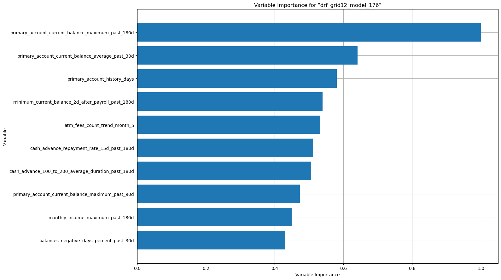

</figure>

<pre><code>
</code></pre>

<h1>SHAP Summary</h1>

<blockquote class="blockquote">SHAP summary plot shows the contribution of the features for each instance (row of data). The sum of the feature contributions and the bias term is equal to the raw prediction of the model, i.e., prediction before applying inverse link function.</blockquote>

<figure class="figure">

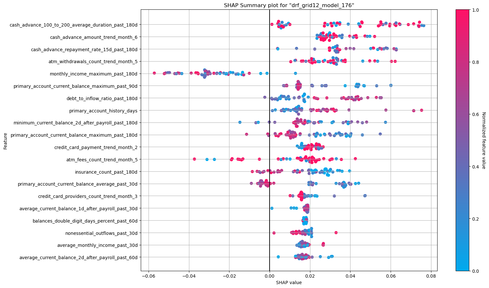

</figure>

<pre><code>
</code></pre>

<h1>Partial Dependence Plots</h1>

<blockquote class="blockquote">Partial dependence plot (PDP) gives a graphical depiction of the marginal effect of a variable on the response. The effect of a variable is measured in change in the mean response. PDP assumes independence between the feature for which is the PDP computed and the rest.</blockquote>

<figure class="figure">

</figure>

<pre><code>
</code></pre>

<figure class="figure">

</figure>

<pre><code>
</code></pre>

<figure class="figure">

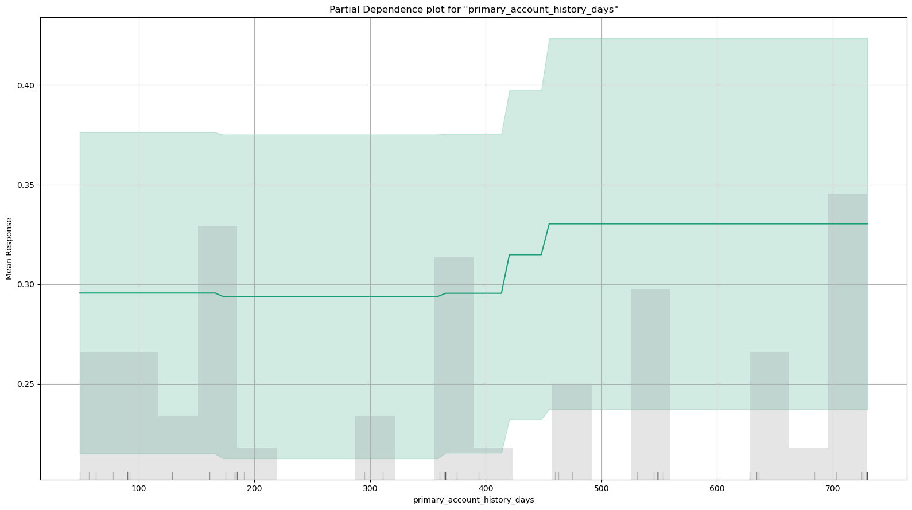

</figure>

<pre><code>
</code></pre>

<figure class="figure">

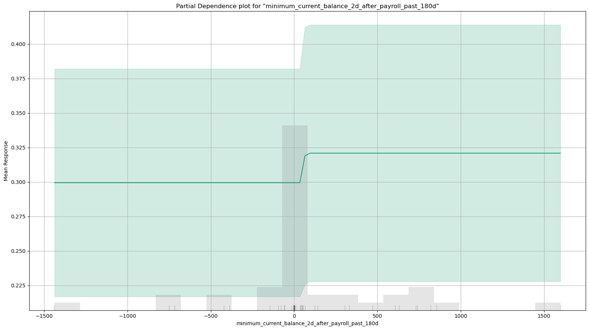

</figure>

<pre><code>
</code></pre>

<figure class="figure">

</figure>

<pre><code>
</code></pre>

<figure class="figure">

</figure>

<pre><code>
</code></pre>

<h1>Individual Conditional Expectation</h1>

<blockquote class="blockquote">An Individual Conditional Expectation (ICE) plot gives a graphical depiction of the marginal effect of a variable on the response. ICE plots are similar to partial dependence plots (PDP); PDP shows the average effect of a feature while ICE plot shows the effect for a single instance. This function will plot the effect for each decile. In contrast to the PDP, ICE plots can provide more insight, especially when there is stronger feature interaction.</blockquote>

<figure class="figure">

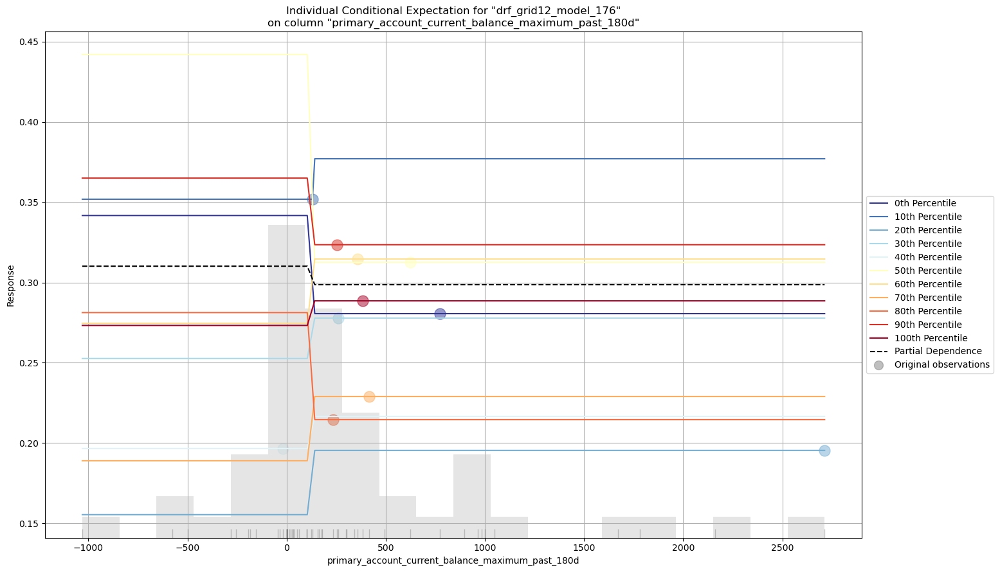

</figure>

<pre><code>
</code></pre>

<figure class="figure">

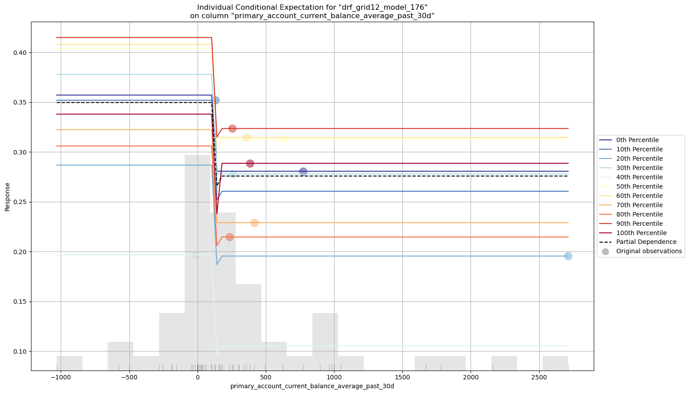

</figure>

<pre><code>
</code></pre>

<figure class="figure">

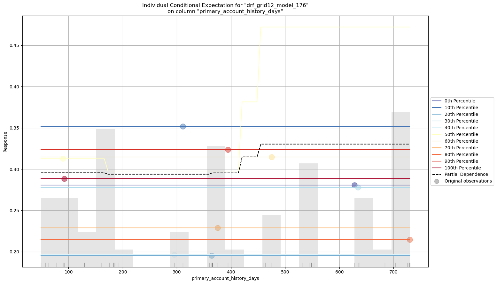

</figure>

<pre><code>
</code></pre>

<pre><code>/opt/anaconda3/lib/python3.12/site-packages/h2o/explanation/_explain.py:1728: UserWarning: Original observation of "minimum_current_balance_2d_after_payroll_past_180d" for 60th Percentile is [nan, 0.3146189205348492]. Plotting of NAs is not yet supported.
  warnings.warn(msg)
/opt/anaconda3/lib/python3.12/site-packages/h2o/explanation/_explain.py:1728: UserWarning: Original observation of "minimum_current_balance_2d_after_payroll_past_180d" for 70th Percentile is [nan, 0.2289852313697338]. Plotting of NAs is not yet supported.
  warnings.warn(msg)</code></pre>

<figure class="figure">

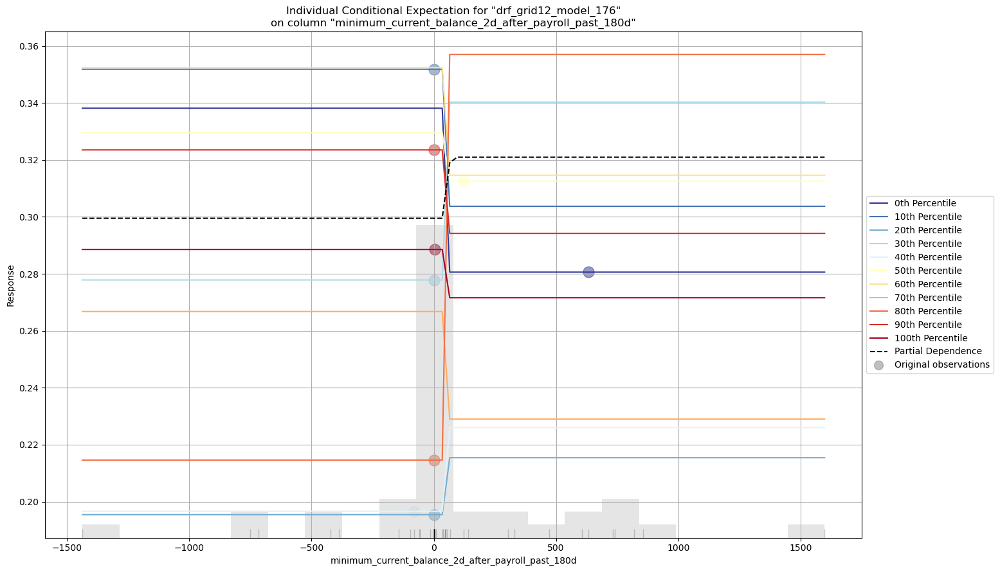

</figure>

<pre><code>
</code></pre>

<figure class="figure">

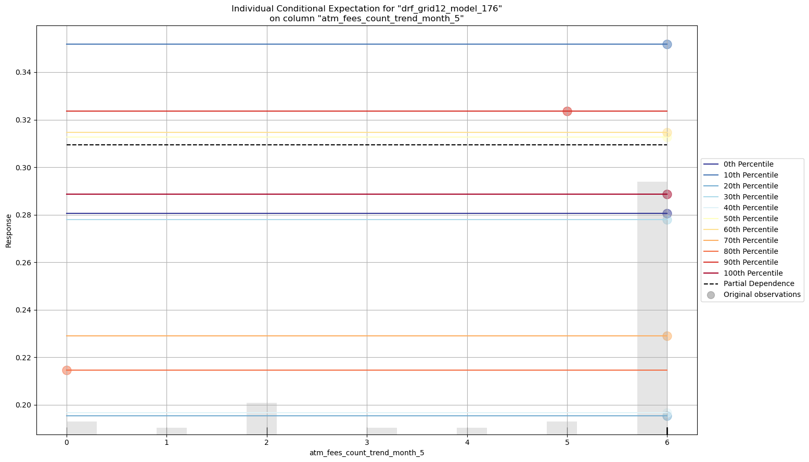

</figure>

<pre><code>
</code></pre>

<pre><code>/opt/anaconda3/lib/python3.12/site-packages/h2o/explanation/_explain.py:1728: UserWarning: Original observation of "cash_advance_repayment_rate_15d_past_180d" for 0th Percentile is [nan, 0.2805991642177105]. Plotting of NAs is not yet supported.
  warnings.warn(msg)
/opt/anaconda3/lib/python3.12/site-packages/h2o/explanation/_explain.py:1728: UserWarning: Original observation of "cash_advance_repayment_rate_15d_past_180d" for 10th Percentile is [nan, 0.3518538445234298]. Plotting of NAs is not yet supported.
  warnings.warn(msg)
/opt/anaconda3/lib/python3.12/site-packages/h2o/explanation/_explain.py:1728: UserWarning: Original observation of "cash_advance_repayment_rate_15d_past_180d" for 50th Percentile is [nan, 0.31258414983749394]. Plotting of NAs is not yet supported.
  warnings.warn(msg)
/opt/anaconda3/lib/python3.12/site-packages/h2o/explanation/_explain.py:1728: UserWarning: Original observation of "cash_advance_repayment_rate_15d_past_180d" for 70th Percentile is [nan, 0.2289852313697338]. Plotting of NAs is not yet supported.
  warnings.warn(msg)</code></pre>

<figure class="figure">

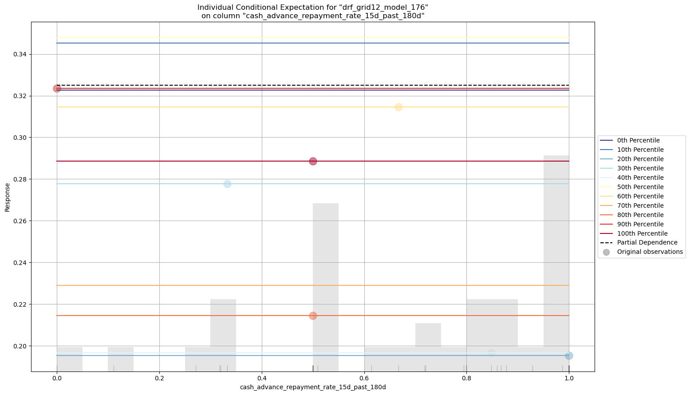

</figure>

<pre><code>
</code></pre>

<h1>Variable Importance</h1>

<blockquote class="blockquote">The variable importance plot shows the relative importance of the most important variables in the model.</blockquote>

<figure class="figure">

</figure>

<h1>SHAP Summary</h1>

<blockquote class="blockquote">SHAP summary plot shows the contribution of the features for each instance (row of data). The sum of the feature contributions and the bias term is equal to the raw prediction of the model, i.e., prediction before applying inverse link function.</blockquote>

<figure class="figure">

</figure>

<h1>Partial Dependence Plots</h1>

<blockquote class="blockquote">Partial dependence plot (PDP) gives a graphical depiction of the marginal effect of a variable on the response. The effect of a variable is measured in change in the mean response. PDP assumes independence between the feature for which is the PDP computed and the rest.</blockquote>

<figure class="figure">

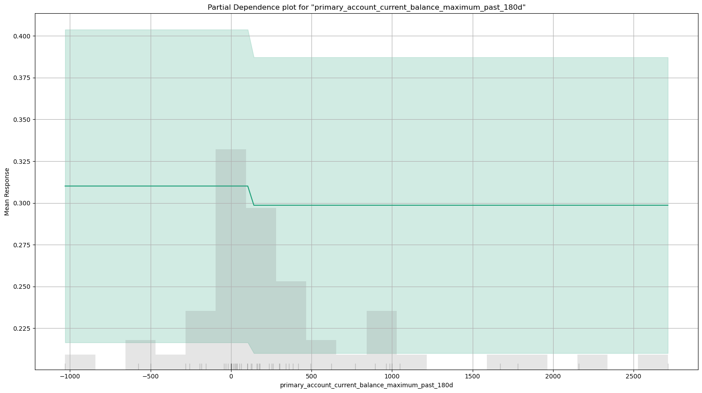

</figure>

<figure class="figure">

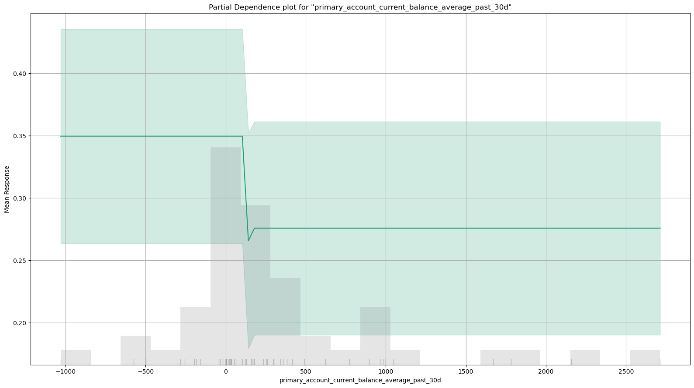

</figure>

<figure class="figure">

</figure>

<figure class="figure">

</figure>

<figure class="figure">

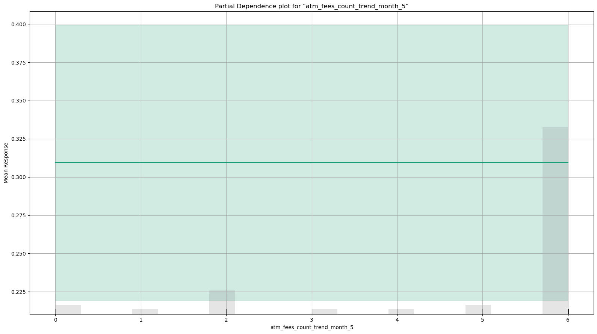

</figure>

<figure class="figure">

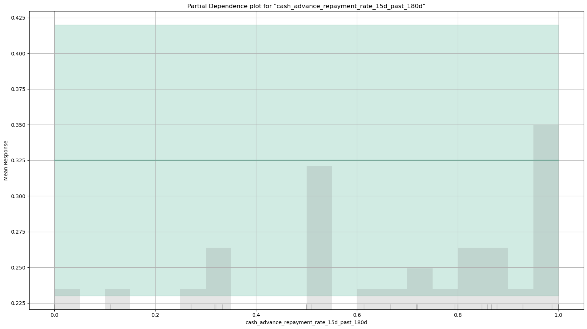

</figure>

<h1>Individual Conditional Expectation</h1>

<blockquote class="blockquote">An Individual Conditional Expectation (ICE) plot gives a graphical depiction of the marginal effect of a variable on the response. ICE plots are similar to partial dependence plots (PDP); PDP shows the average effect of a feature while ICE plot shows the effect for a single instance. This function will plot the effect for each decile. In contrast to the PDP, ICE plots can provide more insight, especially when there is stronger feature interaction.</blockquote>

<figure class="figure">

</figure>

<figure class="figure">

</figure>

<figure class="figure">

</figure>

<figure class="figure">

</figure>

<figure class="figure">

</figure>

<figure class="figure">

</figure>

Code

<pre class="sourceCode python code-with-copy"><code class="sourceCode python">import matplotlib.pyplot as plt
import numpy as np

# Sample data
categories = ['0.1', '0.2', '0.3', '0.4', '0.5',
             '0.6', '0.7', '0.8', '0.9', '1.0']

values1 = [0.026,
0.049,
0.070,
0.099,
0.111,
0.126,
0.137,
0.141,
0.150,
0.180]

values2 = [0.074,
0.151,
0.230,
0.301,
0.389,
0.474,
0.565,
0.660,
0.750,
0.820]

# Set the positions
x = np.arange(len(categories))  # The label locations

# Plotting the stacked bars
plt.bar(x, values1, label='Current Approvals %')
plt.bar(x, values2, bottom=values1, label='New Approvals %')  # Stack values2 on top of values1

# Adding labels and title
plt.xlabel('Deciles')
plt.ylabel('Values')
plt.title('Stacked Bar Chart Example')
plt.xticks(x, categories)  # Set the x-axis labels

# Adding legend
plt.legend()

# Show the plot
plt.show()</code><button title="Copy to Clipboard" class="code-copy-button"><i class="bi"></i></button></pre>

<figure class="figure">

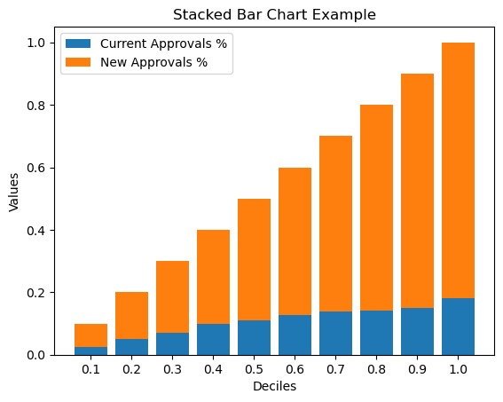

</figure>

Code

<pre class="sourceCode python code-with-copy"><code class="sourceCode python">values3 = [0.0,
0.0384615,
0.0384615,
0.0384615,
0.0576923,
0.0576923,
0.0961538,
0.173077,
0.230769,
0.307692]</code><button title="Copy to Clipboard" class="code-copy-button"><i class="bi"></i></button></pre>

Code

<pre class="sourceCode python code-with-copy"><code class="sourceCode python">import matplotlib.pyplot as plt
import numpy as np

# Updated sample data for categories and values
categories = ['1st', '2nd', '3rd', '4th', '5th', '6th', '7th', '8th', '9th', '10th']
values1 = np.flip([0.026, 0.049, 0.070, 0.099, 0.111, 0.126, 0.137, 0.141, 0.150, 0.180])
values2 = np.flip([0.074, 0.151, 0.230, 0.301, 0.389, 0.474, 0.565, 0.660, 0.750, 0.820])
values3 = np.flip([0.0, 0.0384615, 0.0384615, 0.0384615, 0.0576923, 0.0576923, 0.0961538, 0.173077, 0.230769, 0.307692])

# Set the positions
x = np.arange(len(categories))  # The label locations
bar_width = 0.6

# Plotting the stacked bars with custom colors
plt.figure(figsize=(10,7))
bars1 = plt.bar(x, values1, color="#4682B4", width=bar_width, label='Current Approvals %')  # Blue color
bars2 = plt.bar(x, values2, bottom=values1, color="#4CAF50", width=bar_width, label='New Approvals %')  # Green color
bars3 = plt.bar(x, values3, bottom=np.add(values1, values2), color="#FF0000", width=bar_width, label='Collections %')  # Red color

# Adding labels and title with custom fonts
plt.xlabel('Top Score Deciles', fontsize=14, labelpad=10)
plt.ylabel('Approval Percentages', fontsize=14, labelpad=10)
plt.title('Approval Percentages by Top Decile of Scores (Current vs New vs Collections)', fontsize=16, pad=15)

# Customize x-axis ticks and grid
plt.xticks(x, categories, fontsize=12)
plt.yticks(fontsize=12)
plt.grid(axis='y', linestyle='--', alpha=0.7)

# Adding legend with custom location and fontsize
plt.legend(loc='upper right', fontsize=12)

# Adding percentage labels to each bar segment, excluding the 1st decile for Collections %
for i in range(len(categories)):
    # Current Approvals %
    plt.text(x[i], values1[i] / 2, f"{values1[i]:.1%}", ha='center', va='center', color="white", fontsize=10)
    # New Approvals %
    plt.text(x[i], values1[i] + values2[i] / 2, f"{values2[i]:.1%}", ha='center', va='center', color="white", fontsize=10)
    # Additional Approvals % - only add label if not the first decile
    if i != 9:
        plt.text(x[i], values1[i] + values2[i] + values3[i] / 2, f"{values3[i]:.1%}", ha='center', va='center', color="white", fontsize=10)

# Show the plot
plt.tight_layout()  # Adjusts layout for better spacing
plt.show()</code><button title="Copy to Clipboard" class="code-copy-button"><i class="bi"></i></button></pre>

<figure class="figure">

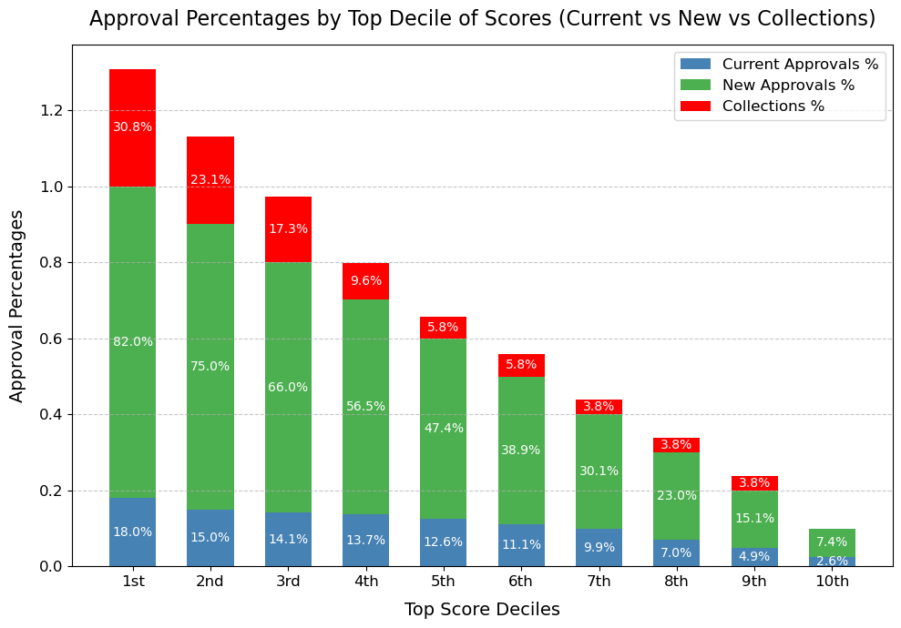

</figure>

Code

<pre class="sourceCode python code-with-copy"><code class="sourceCode python">import matplotlib.pyplot as plt
import numpy as np

# Updated sample data for categories and collections values
categories = ['1st', '2nd', '3rd', '4th', '5th', '6th', '7th', '8th', '9th', '10th']
values3 = np.flip([0.0, 0.0384615, 0.0384615, 0.0384615, 0.0576923, 0.0576923, 0.0961538, 0.173077, 0.230769, 0.307692])

# Set up the line plot
plt.figure(figsize=(10, 6))
plt.plot(categories, values3, color="#FF0000", marker='o', linestyle='-', linewidth=2, markersize=6, label='Collections %')  # Red color for collections

# Adding labels and title with custom fonts
plt.xlabel('Top Score Deciles', fontsize=14)
plt.ylabel('Collections Percentages', fontsize=14)
plt.title('Collections Percentages by Top Decile of Scores', fontsize=16)

# Customize x-axis and y-axis ticks and grid
plt.xticks(fontsize=12)
plt.yticks(fontsize=12)
plt.grid(axis='y', linestyle='--', alpha=0.7)

# Adding legend
plt.legend(loc='upper left', fontsize=12)

# Show the plot
plt.tight_layout()
plt.show()</code><button title="Copy to Clipboard" class="code-copy-button"><i class="bi"></i></button></pre>

<figure class="figure">

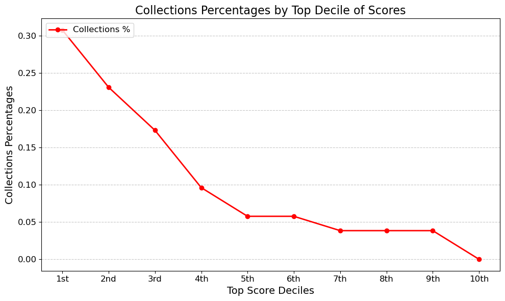

</figure>

Code

<pre class="sourceCode python code-with-copy"><code class="sourceCode python">import matplotlib.pyplot as plt
import numpy as np

# Updated sample data for categories and values
categories = ['Top 100%', 'Top 90%', 'Top 80%', 'Top 70%', 'Top 60%', 'Top 50%', 'Top 40%', 'Top 30%', 'Top 20%', 'Top 10%']
values1 = np.flip([0.026, 0.049, 0.070, 0.099, 0.111, 0.126, 0.137, 0.141, 0.150, 0.180])
values2 = np.flip([0.074, 0.151, 0.230, 0.301, 0.389, 0.474, 0.565, 0.660, 0.750, 0.820])
values3 = np.flip([0.0, 0.0384615, 0.0384615, 0.0384615, 0.0576923, 0.0576923, 0.0961538, 0.173077, 0.230769, 0.307692])

# Set the positions
x = np.arange(len(categories))  # The label locations
bar_width = 0.6

# Create figure and axis objects
fig, ax1 = plt.subplots(figsize=(10, 7))

# Plotting the stacked bars for Current and New Approvals
bars1 = ax1.bar(x, values1, color="#4682B4", width=bar_width, label='Current Approvals %')  # Blue color
bars2 = ax1.bar(x, values2, bottom=values1, color="#4CAF50", width=bar_width, label='New Approvals %')  # Green color

# Adding the line plot for Collections % on top of the bars
ax1.plot(x, values3, color="#FF0000", marker='o', linestyle='-', linewidth=2, markersize=6, label='Collections % (Line)')

# Adding labels and title with custom fonts
ax1.set_xlabel('Top Percentage of Scores', fontsize=14, labelpad=10)
ax1.set_ylabel('Approval %', fontsize=14, labelpad=10)
ax1.set_title('Approval % by Top Percentage of Scores (Current vs New vs Collections)', fontsize=16, pad=15)

# Customize x-axis ticks
ax1.set_xticks(x)
ax1.set_xticklabels(categories, fontsize=12)

# Set y-axis ticks and grid at intervals of 0.1
ax1.set_yticks(np.arange(0, 1.1, 0.1))  # Set y-ticks from 0 to 1 in increments of 0.1
ax1.grid(axis='y', linestyle='--', alpha=0.7)

# Adding secondary y-axis for Collections %
ax2 = ax1.twinx()  # Creates a secondary y-axis sharing the same x-axis
ax2.set_ylabel('Collections %', fontsize=14, labelpad=10)
ax2.set_yticks(np.arange(0, 1.1, 0.1))  # Set same tick intervals for consistency
ax2.tick_params(axis='y')  # Set tick color for distinction

# Adding legend with custom location and fontsize
ax1.legend(loc='upper right', fontsize=12)

# Adding percentage labels to each bar segment
for i in range(len(categories)):
    # Current Approvals %
    ax1.text(x[i], values1[i] / 2, f"{values1[i]:.1%}", ha='center', va='center', color="white", fontsize=10)
    # New Approvals %
    ax1.text(x[i], values1[i] + values2[i] / 2, f"{values2[i]:.1%}", ha='center', va='center', color="white", fontsize=10)

# Show the plot
fig.tight_layout()  # Adjusts layout for better spacing
plt.show()</code><button title="Copy to Clipboard" class="code-copy-button"><i class="bi"></i></button></pre>

<figure class="figure">

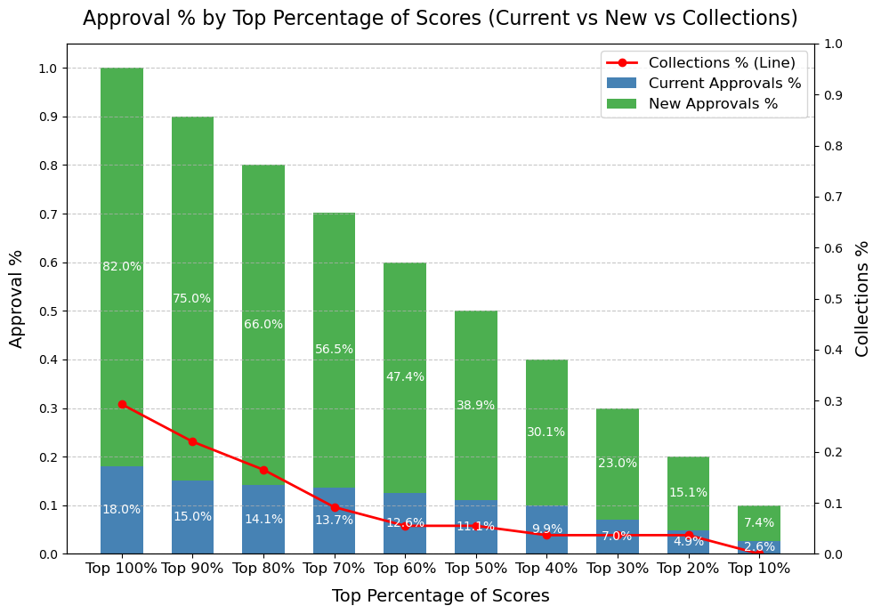

</figure>

</section>
<section id="create-customer-file" class="level2">
<h2 class="anchored" data-anchor-id="create-customer-file">Create Customer file</h2>

Code

<pre class="sourceCode python code-with-copy"><code class="sourceCode python">df = pd.read_csv("/Users/luis/Evaluations/Visible/3_Results/Visible_1169_Records_Scored_20241111.csv")
print(df.shape)</code><button title="Copy to Clipboard" class="code-copy-button"><i class="bi"></i></button></pre>

<pre><code>(1169, 3442)</code></pre>

<pre><code>/var/folders/z5/xxddnyr978bb97d94x1wj3780000gn/T/ipykernel_92556/3848255160.py:1: DtypeWarning: Columns (3430,3438) have mixed types. Specify dtype option on import or set low_memory=False.
  df = pd.read_csv("/Users/luis/Evaluations/Visible/3_Results/Visible_1169_Records_Scored_20241111.csv")</code></pre>

Code

<pre class="sourceCode python code-with-copy"><code class="sourceCode python">view = df[0:1].transpose()
view = view.reset_index(drop = False)
view</code><button title="Copy to Clipboard" class="code-copy-button"><i class="bi"></i></button></pre>

Code

<pre class="sourceCode python code-with-copy"><code class="sourceCode python">df['Pave_Model_Score'] = df['Strategy2'].apply(lambda t: 1-float(t)) </code><button title="Copy to Clipboard" class="code-copy-button"><i class="bi"></i></button></pre>

Code

<pre class="sourceCode python code-with-copy"><code class="sourceCode python">[0,1,2] + [1,2]</code><button title="Copy to Clipboard" class="code-copy-button"><i class="bi"></i></button></pre>

<pre><code>[0, 1, 2, 1, 2]</code></pre>

Code

<pre class="sourceCode python code-with-copy"><code class="sourceCode python">id + score</code><button title="Copy to Clipboard" class="code-copy-button"><i class="bi"></i></button></pre>

<pre><code>['ID', 'USER_ID', 'Pave_Model_Score']</code></pre>

Code

<pre class="sourceCode python code-with-copy"><code class="sourceCode python">list(cas)</code><button title="Copy to Clipboard" class="code-copy-button"><i class="bi"></i></button></pre>

<pre><code>['cas1', 'cas2', 'cas3', 'cas4', 'cas5', 'cas6', 'cas7', 'cas8']</code></pre>

Code

<pre class="sourceCode python code-with-copy"><code class="sourceCode python">ids = ['ID', 'USER_ID']
visible = list(col_list[3432:3437])
score = ['Pave_Model_Score']
sd = list(col_list[3424:3428])
cas = list(col_list[3416:3424])
attributes = list(col_list[4:3406])</code><button title="Copy to Clipboard" class="code-copy-button"><i class="bi"></i></button></pre>

Code

<pre class="sourceCode python code-with-copy"><code class="sourceCode python">customer_file = df[ids + visible + score + sd + cas + attributes]</code><button title="Copy to Clipboard" class="code-copy-button"><i class="bi"></i></button></pre>

Code

<pre class="sourceCode python code-with-copy"><code class="sourceCode python">customer_file.head()</code><button title="Copy to Clipboard" class="code-copy-button"><i class="bi"></i></button></pre>

<table class="dataframe caption-top table table-sm table-striped small" data-quarto-postprocess="true" data-border="1">
<thead>
<tr class="header">
<th data-quarto-table-cell-role="th"></th>
<th data-quarto-table-cell-role="th">ID</th>
<th data-quarto-table-cell-role="th">USER_ID</th>
<th data-quarto-table-cell-role="th">UNDERWRITING_DATE</th>
<th data-quarto-table-cell-role="th">APPROVED</th>
<th data-quarto-table-cell-role="th">AMOUNT</th>
<th data-quarto-table-cell-role="th">DUE_DATE</th>
<th data-quarto-table-cell-role="th">STATUS</th>
<th data-quarto-table-cell-role="th">Pave_Model_Score</th>
<th data-quarto-table-cell-role="th">sd1</th>
<th data-quarto-table-cell-role="th">sd2</th>
<th data-quarto-table-cell-role="th">sd3</th>
<th data-quarto-table-cell-role="th">sd4</th>
<th data-quarto-table-cell-role="th">cas1</th>
<th data-quarto-table-cell-role="th">cas2</th>
<th data-quarto-table-cell-role="th">cas3</th>
<th data-quarto-table-cell-role="th">cas4</th>
<th data-quarto-table-cell-role="th">cas5</th>
<th data-quarto-table-cell-role="th">cas6</th>
<th data-quarto-table-cell-role="th">cas7</th>
<th data-quarto-table-cell-role="th">cas8</th>
<th data-quarto-table-cell-role="th">active_auto_loan_count_past_180d</th>
<th data-quarto-table-cell-role="th">active_auto_loan_count_past_30d</th>
<th data-quarto-table-cell-role="th">active_auto_loan_count_past_60d</th>
<th data-quarto-table-cell-role="th">active_auto_loan_count_past_7d</th>
<th data-quarto-table-cell-role="th">active_auto_loan_count_past_90d</th>
<th data-quarto-table-cell-role="th">active_bnpl_count_past_180d</th>
<th data-quarto-table-cell-role="th">active_bnpl_count_past_30d</th>
<th data-quarto-table-cell-role="th">active_bnpl_count_past_60d</th>
<th data-quarto-table-cell-role="th">active_bnpl_count_past_7d</th>
<th data-quarto-table-cell-role="th">active_bnpl_count_past_90d</th>
<th data-quarto-table-cell-role="th">active_credit_card_count_past_180d</th>
<th data-quarto-table-cell-role="th">active_credit_card_count_past_30d</th>
<th data-quarto-table-cell-role="th">active_credit_card_count_past_60d</th>
<th data-quarto-table-cell-role="th">active_credit_card_count_past_7d</th>
<th data-quarto-table-cell-role="th">active_credit_card_count_past_90d</th>
<th data-quarto-table-cell-role="th">active_lease_to_own_count_past_180d</th>
<th data-quarto-table-cell-role="th">active_lease_to_own_count_past_30d</th>
<th data-quarto-table-cell-role="th">active_lease_to_own_count_past_60d</th>
<th data-quarto-table-cell-role="th">active_lease_to_own_count_past_7d</th>
<th data-quarto-table-cell-role="th">active_lease_to_own_count_past_90d</th>
<th data-quarto-table-cell-role="th">active_loan_count_past_180d</th>
<th data-quarto-table-cell-role="th">active_loan_count_past_30d</th>
<th data-quarto-table-cell-role="th">active_loan_count_past_60d</th>
<th data-quarto-table-cell-role="th">active_loan_count_past_7d</th>
<th data-quarto-table-cell-role="th">active_loan_count_past_90d</th>
<th data-quarto-table-cell-role="th">active_mortgage_count_past_180d</th>
<th data-quarto-table-cell-role="th">active_mortgage_count_past_30d</th>
<th data-quarto-table-cell-role="th">active_mortgage_count_past_60d</th>
<th data-quarto-table-cell-role="th">active_mortgage_count_past_7d</th>
<th data-quarto-table-cell-role="th">active_mortgage_count_past_90d</th>
<th data-quarto-table-cell-role="th">active_payday_loan_count_past_180d</th>
<th data-quarto-table-cell-role="th">active_payday_loan_count_past_30d</th>
<th data-quarto-table-cell-role="th">active_payday_loan_count_past_60d</th>
<th data-quarto-table-cell-role="th">active_payday_loan_count_past_7d</th>
<th data-quarto-table-cell-role="th">active_payday_loan_count_past_90d</th>
<th data-quarto-table-cell-role="th">active_personal_loan_count_past_180d</th>
<th data-quarto-table-cell-role="th">active_personal_loan_count_past_30d</th>
<th data-quarto-table-cell-role="th">active_personal_loan_count_past_60d</th>
<th data-quarto-table-cell-role="th">active_personal_loan_count_past_7d</th>
<th data-quarto-table-cell-role="th">active_personal_loan_count_past_90d</th>
<th data-quarto-table-cell-role="th">active_student_loan_count_past_180d</th>
<th data-quarto-table-cell-role="th">active_student_loan_count_past_30d</th>
<th data-quarto-table-cell-role="th">active_student_loan_count_past_60d</th>
<th data-quarto-table-cell-role="th">active_student_loan_count_past_7d</th>
<th data-quarto-table-cell-role="th">active_student_loan_count_past_90d</th>
<th data-quarto-table-cell-role="th">active_title_loan_count_past_180d</th>
<th data-quarto-table-cell-role="th">active_title_loan_count_past_30d</th>
<th data-quarto-table-cell-role="th">active_title_loan_count_past_60d</th>
<th data-quarto-table-cell-role="th">active_title_loan_count_past_7d</th>
<th data-quarto-table-cell-role="th">active_title_loan_count_past_90d</th>
<th data-quarto-table-cell-role="th">active_to_total_auto_loan_count_ratio_past_180d</th>
<th data-quarto-table-cell-role="th">active_to_total_auto_loan_count_ratio_past_30d</th>
<th data-quarto-table-cell-role="th">active_to_total_auto_loan_count_ratio_past_60d</th>
<th data-quarto-table-cell-role="th">active_to_total_auto_loan_count_ratio_past_7d</th>
<th data-quarto-table-cell-role="th">active_to_total_auto_loan_count_ratio_past_90d</th>
<th data-quarto-table-cell-role="th">active_to_total_credit_card_count_ratio_past_180d</th>
<th data-quarto-table-cell-role="th">active_to_total_credit_card_count_ratio_past_30d</th>
<th data-quarto-table-cell-role="th">active_to_total_credit_card_count_ratio_past_60d</th>
<th data-quarto-table-cell-role="th">active_to_total_credit_card_count_ratio_past_7d</th>
<th data-quarto-table-cell-role="th">active_to_total_credit_card_count_ratio_past_90d</th>
<th data-quarto-table-cell-role="th">active_to_total_lease_to_own_count_ratio_past_180d</th>
<th data-quarto-table-cell-role="th">active_to_total_lease_to_own_count_ratio_past_30d</th>
<th data-quarto-table-cell-role="th">active_to_total_lease_to_own_count_ratio_past_60d</th>
<th data-quarto-table-cell-role="th">active_to_total_lease_to_own_count_ratio_past_7d</th>
<th data-quarto-table-cell-role="th">active_to_total_lease_to_own_count_ratio_past_90d</th>
<th data-quarto-table-cell-role="th">active_to_total_loan_count_ratio_past_180d</th>
<th data-quarto-table-cell-role="th">active_to_total_loan_count_ratio_past_30d</th>
<th data-quarto-table-cell-role="th">active_to_total_loan_count_ratio_past_60d</th>
<th data-quarto-table-cell-role="th">active_to_total_loan_count_ratio_past_7d</th>
<th data-quarto-table-cell-role="th">active_to_total_loan_count_ratio_past_90d</th>
<th data-quarto-table-cell-role="th">active_to_total_mortgage_count_ratio_past_180d</th>
<th data-quarto-table-cell-role="th">active_to_total_mortgage_count_ratio_past_30d</th>
<th data-quarto-table-cell-role="th">active_to_total_mortgage_count_ratio_past_60d</th>
<th data-quarto-table-cell-role="th">active_to_total_mortgage_count_ratio_past_7d</th>
<th data-quarto-table-cell-role="th">active_to_total_mortgage_count_ratio_past_90d</th>
<th data-quarto-table-cell-role="th">active_to_total_payday_loan_count_ratio_past_180d</th>
<th data-quarto-table-cell-role="th">active_to_total_payday_loan_count_ratio_past_30d</th>
<th data-quarto-table-cell-role="th">active_to_total_payday_loan_count_ratio_past_60d</th>
<th data-quarto-table-cell-role="th">active_to_total_payday_loan_count_ratio_past_7d</th>
<th data-quarto-table-cell-role="th">active_to_total_payday_loan_count_ratio_past_90d</th>
<th data-quarto-table-cell-role="th">active_to_total_payroll_count_ratio_past_180d</th>
<th data-quarto-table-cell-role="th">active_to_total_payroll_count_ratio_past_30d</th>
<th data-quarto-table-cell-role="th">active_to_total_payroll_count_ratio_past_60d</th>
<th data-quarto-table-cell-role="th">active_to_total_payroll_count_ratio_past_7d</th>
<th data-quarto-table-cell-role="th">active_to_total_payroll_count_ratio_past_90d</th>
<th data-quarto-table-cell-role="th">active_to_total_personal_loan_count_ratio_past_180d</th>
<th data-quarto-table-cell-role="th">active_to_total_personal_loan_count_ratio_past_30d</th>
<th data-quarto-table-cell-role="th">active_to_total_personal_loan_count_ratio_past_60d</th>
<th data-quarto-table-cell-role="th">active_to_total_personal_loan_count_ratio_past_7d</th>
<th data-quarto-table-cell-role="th">active_to_total_personal_loan_count_ratio_past_90d</th>
<th data-quarto-table-cell-role="th">active_to_total_student_loan_count_ratio_past_180d</th>
<th data-quarto-table-cell-role="th">active_to_total_student_loan_count_ratio_past_30d</th>
<th data-quarto-table-cell-role="th">active_to_total_student_loan_count_ratio_past_60d</th>
<th data-quarto-table-cell-role="th">active_to_total_student_loan_count_ratio_past_7d</th>
<th data-quarto-table-cell-role="th">active_to_total_student_loan_count_ratio_past_90d</th>
<th data-quarto-table-cell-role="th">active_to_total_title_loan_count_ratio_past_180d</th>
<th data-quarto-table-cell-role="th">active_to_total_title_loan_count_ratio_past_30d</th>
<th data-quarto-table-cell-role="th">active_to_total_title_loan_count_ratio_past_60d</th>
<th data-quarto-table-cell-role="th">active_to_total_title_loan_count_ratio_past_7d</th>
<th data-quarto-table-cell-role="th">active_to_total_title_loan_count_ratio_past_90d</th>
<th data-quarto-table-cell-role="th">all_payroll_on_time_or_1d_late_ratio_past_180d</th>
<th data-quarto-table-cell-role="th">all_payroll_on_time_or_1d_late_ratio_past_30d</th>
<th data-quarto-table-cell-role="th">all_payroll_on_time_or_1d_late_ratio_past_60d</th>
<th data-quarto-table-cell-role="th">all_payroll_on_time_or_1d_late_ratio_past_7d</th>
<th data-quarto-table-cell-role="th">all_payroll_on_time_or_1d_late_ratio_past_90d</th>
<th data-quarto-table-cell-role="th">annuity_to_income_ratio_past_180d</th>
<th data-quarto-table-cell-role="th">annuity_to_income_ratio_past_30d</th>
<th data-quarto-table-cell-role="th">annuity_to_income_ratio_past_60d</th>
<th data-quarto-table-cell-role="th">annuity_to_income_ratio_past_7d</th>
<th data-quarto-table-cell-role="th">annuity_to_income_ratio_past_90d</th>
<th data-quarto-table-cell-role="th">annuity_to_income_ratio_trend_month_1</th>
<th data-quarto-table-cell-role="th">annuity_to_income_ratio_trend_month_2</th>
<th data-quarto-table-cell-role="th">annuity_to_income_ratio_trend_month_3</th>
<th data-quarto-table-cell-role="th">annuity_to_income_ratio_trend_month_4</th>
<th data-quarto-table-cell-role="th">annuity_to_income_ratio_trend_month_5</th>
<th data-quarto-table-cell-role="th">annuity_to_income_ratio_trend_month_6</th>
<th data-quarto-table-cell-role="th">atm_decline_count_past_180d</th>
<th data-quarto-table-cell-role="th">atm_decline_count_past_30d</th>
<th data-quarto-table-cell-role="th">atm_decline_count_past_60d</th>
<th data-quarto-table-cell-role="th">atm_decline_count_past_7d</th>
<th data-quarto-table-cell-role="th">atm_decline_count_past_90d</th>
<th data-quarto-table-cell-role="th">atm_decline_count_trend_month_1</th>
<th data-quarto-table-cell-role="th">atm_decline_count_trend_month_2</th>
<th data-quarto-table-cell-role="th">atm_decline_count_trend_month_3</th>
<th data-quarto-table-cell-role="th">atm_decline_count_trend_month_4</th>
<th data-quarto-table-cell-role="th">atm_decline_count_trend_month_5</th>
<th data-quarto-table-cell-role="th">atm_decline_count_trend_month_6</th>
<th data-quarto-table-cell-role="th">atm_decline_past_180d</th>
<th data-quarto-table-cell-role="th">atm_decline_past_30d</th>
<th data-quarto-table-cell-role="th">atm_decline_past_60d</th>
<th data-quarto-table-cell-role="th">atm_decline_past_7d</th>
<th data-quarto-table-cell-role="th">atm_decline_past_90d</th>
<th data-quarto-table-cell-role="th">atm_decline_trend_month_1</th>
<th data-quarto-table-cell-role="th">atm_decline_trend_month_2</th>
<th data-quarto-table-cell-role="th">atm_decline_trend_month_3</th>
<th data-quarto-table-cell-role="th">atm_decline_trend_month_4</th>
<th data-quarto-table-cell-role="th">atm_decline_trend_month_5</th>
<th data-quarto-table-cell-role="th">atm_decline_trend_month_6</th>
<th data-quarto-table-cell-role="th">atm_fees_count_past_180d</th>
<th data-quarto-table-cell-role="th">atm_fees_count_past_30d</th>
<th data-quarto-table-cell-role="th">atm_fees_count_past_60d</th>
<th data-quarto-table-cell-role="th">atm_fees_count_past_7d</th>
<th data-quarto-table-cell-role="th">atm_fees_count_past_90d</th>
<th data-quarto-table-cell-role="th">atm_fees_count_trend_month_1</th>
<th data-quarto-table-cell-role="th">atm_fees_count_trend_month_2</th>
<th data-quarto-table-cell-role="th">atm_fees_count_trend_month_3</th>
<th data-quarto-table-cell-role="th">atm_fees_count_trend_month_4</th>
<th data-quarto-table-cell-role="th">atm_fees_count_trend_month_5</th>
<th data-quarto-table-cell-role="th">atm_fees_count_trend_month_6</th>
<th data-quarto-table-cell-role="th">atm_fees_past_180d</th>
<th data-quarto-table-cell-role="th">atm_fees_past_30d</th>
<th data-quarto-table-cell-role="th">atm_fees_past_60d</th>
<th data-quarto-table-cell-role="th">atm_fees_past_7d</th>
<th data-quarto-table-cell-role="th">atm_fees_past_90d</th>
<th data-quarto-table-cell-role="th">atm_fees_trend_month_1</th>
<th data-quarto-table-cell-role="th">atm_fees_trend_month_2</th>
<th data-quarto-table-cell-role="th">atm_fees_trend_month_3</th>
<th data-quarto-table-cell-role="th">atm_fees_trend_month_4</th>
<th data-quarto-table-cell-role="th">atm_fees_trend_month_5</th>
<th data-quarto-table-cell-role="th">atm_fees_trend_month_6</th>
<th data-quarto-table-cell-role="th">atm_withdrawals_count_past_180d</th>
<th data-quarto-table-cell-role="th">atm_withdrawals_count_past_30d</th>
<th data-quarto-table-cell-role="th">atm_withdrawals_count_past_60d</th>
<th data-quarto-table-cell-role="th">atm_withdrawals_count_past_7d</th>
<th data-quarto-table-cell-role="th">atm_withdrawals_count_past_90d</th>
<th data-quarto-table-cell-role="th">atm_withdrawals_count_trend_month_1</th>
<th data-quarto-table-cell-role="th">atm_withdrawals_count_trend_month_2</th>
<th data-quarto-table-cell-role="th">atm_withdrawals_count_trend_month_3</th>
<th data-quarto-table-cell-role="th">atm_withdrawals_count_trend_month_4</th>
<th data-quarto-table-cell-role="th">atm_withdrawals_count_trend_month_5</th>
<th data-quarto-table-cell-role="th">atm_withdrawals_count_trend_month_6</th>
<th data-quarto-table-cell-role="th">atm_withdrawals_past_180d</th>
<th data-quarto-table-cell-role="th">atm_withdrawals_past_30d</th>
<th data-quarto-table-cell-role="th">atm_withdrawals_past_60d</th>
<th data-quarto-table-cell-role="th">atm_withdrawals_past_7d</th>
<th data-quarto-table-cell-role="th">atm_withdrawals_past_90d</th>
<th data-quarto-table-cell-role="th">atm_withdrawals_trend_month_1</th>
<th data-quarto-table-cell-role="th">atm_withdrawals_trend_month_2</th>
<th data-quarto-table-cell-role="th">atm_withdrawals_trend_month_3</th>
<th data-quarto-table-cell-role="th">atm_withdrawals_trend_month_4</th>
<th data-quarto-table-cell-role="th">atm_withdrawals_trend_month_5</th>
<th data-quarto-table-cell-role="th">atm_withdrawals_trend_month_6</th>
<th data-quarto-table-cell-role="th">auto_insurance_count_past_180d</th>
<th data-quarto-table-cell-role="th">auto_insurance_count_past_30d</th>
<th data-quarto-table-cell-role="th">auto_insurance_count_past_60d</th>
<th data-quarto-table-cell-role="th">auto_insurance_count_past_7d</th>
<th data-quarto-table-cell-role="th">auto_insurance_count_past_90d</th>
<th data-quarto-table-cell-role="th">auto_insurance_count_trend_month_1</th>
<th data-quarto-table-cell-role="th">auto_insurance_count_trend_month_2</th>
<th data-quarto-table-cell-role="th">auto_insurance_count_trend_month_3</th>
<th data-quarto-table-cell-role="th">auto_insurance_count_trend_month_4</th>
<th data-quarto-table-cell-role="th">auto_insurance_count_trend_month_5</th>
<th data-quarto-table-cell-role="th">auto_insurance_count_trend_month_6</th>
<th data-quarto-table-cell-role="th">auto_insurance_past_180d</th>
<th data-quarto-table-cell-role="th">auto_insurance_past_30d</th>
<th data-quarto-table-cell-role="th">auto_insurance_past_60d</th>
<th data-quarto-table-cell-role="th">auto_insurance_past_7d</th>
<th data-quarto-table-cell-role="th">auto_insurance_past_90d</th>
<th data-quarto-table-cell-role="th">auto_insurance_trend_month_1</th>
<th data-quarto-table-cell-role="th">auto_insurance_trend_month_2</th>
<th data-quarto-table-cell-role="th">auto_insurance_trend_month_3</th>
<th data-quarto-table-cell-role="th">auto_insurance_trend_month_4</th>
<th data-quarto-table-cell-role="th">auto_insurance_trend_month_5</th>
<th data-quarto-table-cell-role="th">auto_insurance_trend_month_6</th>
<th data-quarto-table-cell-role="th">auto_loan_payment_count_past_180d</th>
<th data-quarto-table-cell-role="th">auto_loan_payment_count_past_30d</th>
<th data-quarto-table-cell-role="th">auto_loan_payment_count_past_60d</th>
<th data-quarto-table-cell-role="th">auto_loan_payment_count_past_7d</th>
<th data-quarto-table-cell-role="th">auto_loan_payment_count_past_90d</th>
<th data-quarto-table-cell-role="th">auto_loan_payment_count_trend_month_1</th>
<th data-quarto-table-cell-role="th">auto_loan_payment_count_trend_month_2</th>
<th data-quarto-table-cell-role="th">auto_loan_payment_count_trend_month_3</th>
<th data-quarto-table-cell-role="th">auto_loan_payment_count_trend_month_4</th>
<th data-quarto-table-cell-role="th">auto_loan_payment_count_trend_month_5</th>
<th data-quarto-table-cell-role="th">auto_loan_payment_count_trend_month_6</th>
<th data-quarto-table-cell-role="th">auto_loan_payment_past_180d</th>
<th data-quarto-table-cell-role="th">auto_loan_payment_past_30d</th>
<th data-quarto-table-cell-role="th">auto_loan_payment_past_60d</th>
<th data-quarto-table-cell-role="th">auto_loan_payment_past_7d</th>
<th data-quarto-table-cell-role="th">auto_loan_payment_past_90d</th>
<th data-quarto-table-cell-role="th">auto_loan_payment_trend_month_1</th>
<th data-quarto-table-cell-role="th">auto_loan_payment_trend_month_2</th>
<th data-quarto-table-cell-role="th">auto_loan_payment_trend_month_3</th>
<th data-quarto-table-cell-role="th">auto_loan_payment_trend_month_4</th>
<th data-quarto-table-cell-role="th">auto_loan_payment_trend_month_5</th>
<th data-quarto-table-cell-role="th">auto_loan_payment_trend_month_6</th>
<th data-quarto-table-cell-role="th">auto_loan_payments_timeliness_past_180d</th>
<th data-quarto-table-cell-role="th">auto_loan_payments_timeliness_past_30d</th>
<th data-quarto-table-cell-role="th">auto_loan_payments_timeliness_past_60d</th>
<th data-quarto-table-cell-role="th">auto_loan_payments_timeliness_past_7d</th>
<th data-quarto-table-cell-role="th">auto_loan_payments_timeliness_past_90d</th>
<th data-quarto-table-cell-role="th">auto_loan_pmt_std_past_180d</th>
<th data-quarto-table-cell-role="th">auto_loan_pmt_std_past_360d</th>
<th data-quarto-table-cell-role="th">auto_loan_pmt_std_trend_month_6</th>
<th data-quarto-table-cell-role="th">auto_loan_pmt_to_income_ratio_past_180d</th>
<th data-quarto-table-cell-role="th">auto_loan_pmt_to_income_ratio_past_30d</th>
<th data-quarto-table-cell-role="th">auto_loan_pmt_to_income_ratio_past_60d</th>
<th data-quarto-table-cell-role="th">auto_loan_pmt_to_income_ratio_past_7d</th>
<th data-quarto-table-cell-role="th">auto_loan_pmt_to_income_ratio_past_90d</th>
<th data-quarto-table-cell-role="th">auto_loan_pmt_to_income_ratio_trend_month_1</th>
<th data-quarto-table-cell-role="th">auto_loan_pmt_to_income_ratio_trend_month_2</th>
<th data-quarto-table-cell-role="th">auto_loan_pmt_to_income_ratio_trend_month_3</th>
<th data-quarto-table-cell-role="th">auto_loan_pmt_to_income_ratio_trend_month_4</th>
<th data-quarto-table-cell-role="th">auto_loan_pmt_to_income_ratio_trend_month_5</th>
<th data-quarto-table-cell-role="th">auto_loan_pmt_to_income_ratio_trend_month_6</th>
<th data-quarto-table-cell-role="th">auto_loan_providers_count_past_180d</th>
<th data-quarto-table-cell-role="th">auto_loan_providers_count_past_30d</th>
<th data-quarto-table-cell-role="th">auto_loan_providers_count_past_60d</th>
<th data-quarto-table-cell-role="th">auto_loan_providers_count_past_7d</th>
<th data-quarto-table-cell-role="th">auto_loan_providers_count_past_90d</th>
<th data-quarto-table-cell-role="th">auto_loan_providers_count_trend_month_1</th>
<th data-quarto-table-cell-role="th">auto_loan_providers_count_trend_month_2</th>
<th data-quarto-table-cell-role="th">auto_loan_providers_count_trend_month_3</th>
<th data-quarto-table-cell-role="th">auto_loan_providers_count_trend_month_4</th>
<th data-quarto-table-cell-role="th">auto_loan_providers_count_trend_month_5</th>
<th data-quarto-table-cell-role="th">auto_loan_providers_count_trend_month_6</th>
<th data-quarto-table-cell-role="th">auto_owner</th>
<th data-quarto-table-cell-role="th">average_current_balance_0d_after_stable_income_past_180d</th>
<th data-quarto-table-cell-role="th">average_current_balance_0d_after_stable_income_past_30d</th>
<th data-quarto-table-cell-role="th">average_current_balance_0d_after_stable_income_past_60d</th>
<th data-quarto-table-cell-role="th">average_current_balance_0d_after_stable_income_past_7d</th>
<th data-quarto-table-cell-role="th">average_current_balance_0d_after_stable_income_past_90d</th>
<th data-quarto-table-cell-role="th">average_current_balance_1d_after_payroll_past_180d</th>
<th data-quarto-table-cell-role="th">average_current_balance_1d_after_payroll_past_30d</th>
<th data-quarto-table-cell-role="th">average_current_balance_1d_after_payroll_past_60d</th>
<th data-quarto-table-cell-role="th">average_current_balance_1d_after_payroll_past_7d</th>
<th data-quarto-table-cell-role="th">average_current_balance_1d_after_payroll_past_90d</th>
<th data-quarto-table-cell-role="th">average_current_balance_1d_after_stable_income_past_180d</th>
<th data-quarto-table-cell-role="th">average_current_balance_1d_after_stable_income_past_30d</th>
<th data-quarto-table-cell-role="th">average_current_balance_1d_after_stable_income_past_60d</th>
<th data-quarto-table-cell-role="th">average_current_balance_1d_after_stable_income_past_7d</th>
<th data-quarto-table-cell-role="th">average_current_balance_1d_after_stable_income_past_90d</th>
<th data-quarto-table-cell-role="th">average_current_balance_2d_after_payroll_past_180d</th>
<th data-quarto-table-cell-role="th">average_current_balance_2d_after_payroll_past_30d</th>
<th data-quarto-table-cell-role="th">average_current_balance_2d_after_payroll_past_60d</th>
<th data-quarto-table-cell-role="th">average_current_balance_2d_after_payroll_past_7d</th>
<th data-quarto-table-cell-role="th">average_current_balance_2d_after_payroll_past_90d</th>
<th data-quarto-table-cell-role="th">average_current_balance_2d_after_stable_income_past_180d</th>
<th data-quarto-table-cell-role="th">average_current_balance_2d_after_stable_income_past_30d</th>
<th data-quarto-table-cell-role="th">average_current_balance_2d_after_stable_income_past_60d</th>
<th data-quarto-table-cell-role="th">average_current_balance_2d_after_stable_income_past_7d</th>
<th data-quarto-table-cell-role="th">average_current_balance_2d_after_stable_income_past_90d</th>
<th data-quarto-table-cell-role="th">average_current_balance_3d_after_payroll_past_180d</th>
<th data-quarto-table-cell-role="th">average_current_balance_3d_after_payroll_past_30d</th>
<th data-quarto-table-cell-role="th">average_current_balance_3d_after_payroll_past_60d</th>
<th data-quarto-table-cell-role="th">average_current_balance_3d_after_payroll_past_7d</th>
<th data-quarto-table-cell-role="th">average_current_balance_3d_after_payroll_past_90d</th>
<th data-quarto-table-cell-role="th">average_current_balance_3d_after_stable_income_past_180d</th>
<th data-quarto-table-cell-role="th">average_current_balance_3d_after_stable_income_past_30d</th>
<th data-quarto-table-cell-role="th">average_current_balance_3d_after_stable_income_past_60d</th>
<th data-quarto-table-cell-role="th">average_current_balance_3d_after_stable_income_past_7d</th>
<th data-quarto-table-cell-role="th">average_current_balance_3d_after_stable_income_past_90d</th>
<th data-quarto-table-cell-role="th">average_current_balance_on_payday_past_180d</th>
<th data-quarto-table-cell-role="th">average_current_balance_on_payday_past_30d</th>
<th data-quarto-table-cell-role="th">average_current_balance_on_payday_past_60d</th>
<th data-quarto-table-cell-role="th">average_current_balance_on_payday_past_7d</th>
<th data-quarto-table-cell-role="th">average_current_balance_on_payday_past_90d</th>
<th data-quarto-table-cell-role="th">average_monthly_discretionary_income_past_180d</th>
<th data-quarto-table-cell-role="th">average_monthly_discretionary_income_past_30d</th>
<th data-quarto-table-cell-role="th">average_monthly_discretionary_income_past_60d</th>
<th data-quarto-table-cell-role="th">average_monthly_discretionary_income_past_90d</th>
<th data-quarto-table-cell-role="th">average_monthly_income_checking_account_past_180d</th>
<th data-quarto-table-cell-role="th">average_monthly_income_checking_account_past_30d</th>
<th data-quarto-table-cell-role="th">average_monthly_income_checking_account_past_60d</th>
<th data-quarto-table-cell-role="th">average_monthly_income_checking_account_past_90d</th>
<th data-quarto-table-cell-role="th">average_monthly_income_past_180d</th>
<th data-quarto-table-cell-role="th">average_monthly_income_past_30d</th>
<th data-quarto-table-cell-role="th">average_monthly_income_past_60d</th>
<th data-quarto-table-cell-role="th">average_monthly_income_past_90d</th>
<th data-quarto-table-cell-role="th">average_monthly_recurring_inflows_past_180d</th>
<th data-quarto-table-cell-role="th">average_monthly_recurring_inflows_past_30d</th>
<th data-quarto-table-cell-role="th">average_monthly_recurring_inflows_past_60d</th>
<th data-quarto-table-cell-role="th">average_monthly_recurring_inflows_past_90d</th>
<th data-quarto-table-cell-role="th">average_outflows_1d_after_payroll_past_180d</th>
<th data-quarto-table-cell-role="th">average_outflows_1d_after_payroll_past_30d</th>
<th data-quarto-table-cell-role="th">average_outflows_1d_after_payroll_past_60d</th>
<th data-quarto-table-cell-role="th">average_outflows_1d_after_payroll_past_7d</th>
<th data-quarto-table-cell-role="th">average_outflows_1d_after_payroll_past_90d</th>
<th data-quarto-table-cell-role="th">average_outflows_2d_after_payroll_past_180d</th>
<th data-quarto-table-cell-role="th">average_outflows_2d_after_payroll_past_30d</th>
<th data-quarto-table-cell-role="th">average_outflows_2d_after_payroll_past_60d</th>
<th data-quarto-table-cell-role="th">average_outflows_2d_after_payroll_past_7d</th>
<th data-quarto-table-cell-role="th">average_outflows_2d_after_payroll_past_90d</th>
<th data-quarto-table-cell-role="th">average_outflows_3d_after_payroll_past_180d</th>
<th data-quarto-table-cell-role="th">average_outflows_3d_after_payroll_past_30d</th>
<th data-quarto-table-cell-role="th">average_outflows_3d_after_payroll_past_60d</th>
<th data-quarto-table-cell-role="th">average_outflows_3d_after_payroll_past_7d</th>
<th data-quarto-table-cell-role="th">average_outflows_3d_after_payroll_past_90d</th>
<th data-quarto-table-cell-role="th">average_recurring_expenditure_on_paydate_past_180d</th>
<th data-quarto-table-cell-role="th">average_recurring_expenditure_on_paydate_past_30d</th>
<th data-quarto-table-cell-role="th">average_recurring_expenditure_on_paydate_past_60d</th>
<th data-quarto-table-cell-role="th">average_recurring_expenditure_on_paydate_past_7d</th>
<th data-quarto-table-cell-role="th">average_recurring_expenditure_on_paydate_past_90d</th>
<th data-quarto-table-cell-role="th">average_recurring_expenditures_0d_after_stable_income_past_180d</th>
<th data-quarto-table-cell-role="th">average_recurring_expenditures_0d_after_stable_income_past_30d</th>
<th data-quarto-table-cell-role="th">average_recurring_expenditures_0d_after_stable_income_past_60d</th>
<th data-quarto-table-cell-role="th">average_recurring_expenditures_0d_after_stable_income_past_7d</th>
<th data-quarto-table-cell-role="th">average_recurring_expenditures_0d_after_stable_income_past_90d</th>
<th data-quarto-table-cell-role="th">average_recurring_expenditures_1d_after_payroll_past_180d</th>
<th data-quarto-table-cell-role="th">average_recurring_expenditures_1d_after_payroll_past_30d</th>
<th data-quarto-table-cell-role="th">average_recurring_expenditures_1d_after_payroll_past_60d</th>
<th data-quarto-table-cell-role="th">average_recurring_expenditures_1d_after_payroll_past_7d</th>
<th data-quarto-table-cell-role="th">average_recurring_expenditures_1d_after_payroll_past_90d</th>
<th data-quarto-table-cell-role="th">average_recurring_expenditures_1d_after_stable_income_past_180d</th>
<th data-quarto-table-cell-role="th">average_recurring_expenditures_1d_after_stable_income_past_30d</th>
<th data-quarto-table-cell-role="th">average_recurring_expenditures_1d_after_stable_income_past_60d</th>
<th data-quarto-table-cell-role="th">average_recurring_expenditures_1d_after_stable_income_past_7d</th>
<th data-quarto-table-cell-role="th">average_recurring_expenditures_1d_after_stable_income_past_90d</th>
<th data-quarto-table-cell-role="th">average_recurring_expenditures_2d_after_payroll_past_180d</th>
<th data-quarto-table-cell-role="th">average_recurring_expenditures_2d_after_payroll_past_30d</th>
<th data-quarto-table-cell-role="th">average_recurring_expenditures_2d_after_payroll_past_60d</th>
<th data-quarto-table-cell-role="th">average_recurring_expenditures_2d_after_payroll_past_7d</th>
<th data-quarto-table-cell-role="th">average_recurring_expenditures_2d_after_payroll_past_90d</th>
<th data-quarto-table-cell-role="th">average_recurring_expenditures_2d_after_stable_income_past_180d</th>
<th data-quarto-table-cell-role="th">average_recurring_expenditures_2d_after_stable_income_past_30d</th>
<th data-quarto-table-cell-role="th">average_recurring_expenditures_2d_after_stable_income_past_60d</th>
<th data-quarto-table-cell-role="th">average_recurring_expenditures_2d_after_stable_income_past_7d</th>
<th data-quarto-table-cell-role="th">average_recurring_expenditures_2d_after_stable_income_past_90d</th>
<th data-quarto-table-cell-role="th">average_recurring_expenditures_3d_after_payroll_past_180d</th>
<th data-quarto-table-cell-role="th">average_recurring_expenditures_3d_after_payroll_past_30d</th>
<th data-quarto-table-cell-role="th">average_recurring_expenditures_3d_after_payroll_past_60d</th>
<th data-quarto-table-cell-role="th">average_recurring_expenditures_3d_after_payroll_past_7d</th>
<th data-quarto-table-cell-role="th">average_recurring_expenditures_3d_after_payroll_past_90d</th>
<th data-quarto-table-cell-role="th">average_recurring_expenditures_3d_after_stable_income_past_180d</th>
<th data-quarto-table-cell-role="th">average_recurring_expenditures_3d_after_stable_income_past_30d</th>
<th data-quarto-table-cell-role="th">average_recurring_expenditures_3d_after_stable_income_past_60d</th>
<th data-quarto-table-cell-role="th">average_recurring_expenditures_3d_after_stable_income_past_7d</th>
<th data-quarto-table-cell-role="th">average_recurring_expenditures_3d_after_stable_income_past_90d</th>
<th data-quarto-table-cell-role="th">balances_days_double_digit_past_180d</th>
<th data-quarto-table-cell-role="th">balances_days_double_digit_past_30d</th>
<th data-quarto-table-cell-role="th">balances_days_double_digit_past_60d</th>
<th data-quarto-table-cell-role="th">balances_days_double_digit_past_7d</th>
<th data-quarto-table-cell-role="th">balances_days_double_digit_past_90d</th>
<th data-quarto-table-cell-role="th">balances_days_negative_past_180d</th>
<th data-quarto-table-cell-role="th">balances_days_negative_past_30d</th>
<th data-quarto-table-cell-role="th">balances_days_negative_past_60d</th>
<th data-quarto-table-cell-role="th">balances_days_negative_past_7d</th>
<th data-quarto-table-cell-role="th">balances_days_negative_past_90d</th>
<th data-quarto-table-cell-role="th">balances_days_single_digit_past_180d</th>
<th data-quarto-table-cell-role="th">balances_days_single_digit_past_30d</th>
<th data-quarto-table-cell-role="th">balances_days_single_digit_past_60d</th>
<th data-quarto-table-cell-role="th">balances_days_single_digit_past_7d</th>
<th data-quarto-table-cell-role="th">balances_days_single_digit_past_90d</th>
<th data-quarto-table-cell-role="th">balances_double_digit_days_percent_past_180d</th>
<th data-quarto-table-cell-role="th">balances_double_digit_days_percent_past_30d</th>
<th data-quarto-table-cell-role="th">balances_double_digit_days_percent_past_60d</th>
<th data-quarto-table-cell-role="th">balances_double_digit_days_percent_past_7d</th>
<th data-quarto-table-cell-role="th">balances_double_digit_days_percent_past_90d</th>
<th data-quarto-table-cell-role="th">balances_negative_days_percent_past_180d</th>
<th data-quarto-table-cell-role="th">balances_negative_days_percent_past_30d</th>
<th data-quarto-table-cell-role="th">balances_negative_days_percent_past_60d</th>
<th data-quarto-table-cell-role="th">balances_negative_days_percent_past_7d</th>
<th data-quarto-table-cell-role="th">balances_negative_days_percent_past_90d</th>
<th data-quarto-table-cell-role="th">balances_single_digit_days_percent_past_180d</th>
<th data-quarto-table-cell-role="th">balances_single_digit_days_percent_past_30d</th>
<th data-quarto-table-cell-role="th">balances_single_digit_days_percent_past_60d</th>
<th data-quarto-table-cell-role="th">balances_single_digit_days_percent_past_7d</th>
<th data-quarto-table-cell-role="th">balances_single_digit_days_percent_past_90d</th>
<th data-quarto-table-cell-role="th">benefits_count_past_180d</th>
<th data-quarto-table-cell-role="th">benefits_count_past_30d</th>
<th data-quarto-table-cell-role="th">benefits_count_past_60d</th>
<th data-quarto-table-cell-role="th">benefits_count_past_7d</th>
<th data-quarto-table-cell-role="th">benefits_count_past_90d</th>
<th data-quarto-table-cell-role="th">benefits_count_trend_month_1</th>
<th data-quarto-table-cell-role="th">benefits_count_trend_month_2</th>
<th data-quarto-table-cell-role="th">benefits_count_trend_month_3</th>
<th data-quarto-table-cell-role="th">benefits_count_trend_month_4</th>
<th data-quarto-table-cell-role="th">benefits_count_trend_month_5</th>
<th data-quarto-table-cell-role="th">benefits_count_trend_month_6</th>
<th data-quarto-table-cell-role="th">benefits_past_180d</th>
<th data-quarto-table-cell-role="th">benefits_past_30d</th>
<th data-quarto-table-cell-role="th">benefits_past_60d</th>
<th data-quarto-table-cell-role="th">benefits_past_7d</th>
<th data-quarto-table-cell-role="th">benefits_past_90d</th>
<th data-quarto-table-cell-role="th">benefits_providers_count_past_180d</th>
<th data-quarto-table-cell-role="th">benefits_providers_count_past_30d</th>
<th data-quarto-table-cell-role="th">benefits_providers_count_past_60d</th>
<th data-quarto-table-cell-role="th">benefits_providers_count_past_7d</th>
<th data-quarto-table-cell-role="th">benefits_providers_count_past_90d</th>
<th data-quarto-table-cell-role="th">benefits_providers_count_trend_month_1</th>
<th data-quarto-table-cell-role="th">benefits_providers_count_trend_month_2</th>
<th data-quarto-table-cell-role="th">benefits_providers_count_trend_month_3</th>
<th data-quarto-table-cell-role="th">benefits_providers_count_trend_month_4</th>
<th data-quarto-table-cell-role="th">benefits_providers_count_trend_month_5</th>
<th data-quarto-table-cell-role="th">benefits_providers_count_trend_month_6</th>
<th data-quarto-table-cell-role="th">benefits_trend_month_1</th>
<th data-quarto-table-cell-role="th">benefits_trend_month_2</th>
<th data-quarto-table-cell-role="th">benefits_trend_month_3</th>
<th data-quarto-table-cell-role="th">benefits_trend_month_4</th>
<th data-quarto-table-cell-role="th">benefits_trend_month_5</th>
<th data-quarto-table-cell-role="th">benefits_trend_month_6</th>
<th data-quarto-table-cell-role="th">bnpl_loan_amount_std_past_180d</th>
<th data-quarto-table-cell-role="th">bnpl_loan_amount_std_past_30d</th>
<th data-quarto-table-cell-role="th">bnpl_loan_amount_std_past_60d</th>
<th data-quarto-table-cell-role="th">bnpl_loan_amount_std_past_7d</th>
<th data-quarto-table-cell-role="th">bnpl_loan_amount_std_past_90d</th>
<th data-quarto-table-cell-role="th">bnpl_payment_count_trend_month_1</th>
<th data-quarto-table-cell-role="th">bnpl_payment_count_trend_month_2</th>
<th data-quarto-table-cell-role="th">bnpl_payment_count_trend_month_3</th>
<th data-quarto-table-cell-role="th">bnpl_payment_count_trend_month_4</th>
<th data-quarto-table-cell-role="th">bnpl_payment_count_trend_month_5</th>
<th data-quarto-table-cell-role="th">bnpl_payment_count_trend_month_6</th>
<th data-quarto-table-cell-role="th">bnpl_payment_past_180d</th>
<th data-quarto-table-cell-role="th">bnpl_payment_past_30d</th>
<th data-quarto-table-cell-role="th">bnpl_payment_past_60d</th>
<th data-quarto-table-cell-role="th">bnpl_payment_past_7d</th>
<th data-quarto-table-cell-role="th">bnpl_payment_past_90d</th>
<th data-quarto-table-cell-role="th">bnpl_payment_to_income_ratio_past_180d</th>
<th data-quarto-table-cell-role="th">bnpl_payment_to_income_ratio_past_30d</th>
<th data-quarto-table-cell-role="th">bnpl_payment_to_income_ratio_past_60d</th>
<th data-quarto-table-cell-role="th">bnpl_payment_to_income_ratio_past_7d</th>
<th data-quarto-table-cell-role="th">bnpl_payment_to_income_ratio_past_90d</th>
<th data-quarto-table-cell-role="th">bnpl_payment_trend_month_1</th>
<th data-quarto-table-cell-role="th">bnpl_payment_trend_month_2</th>
<th data-quarto-table-cell-role="th">bnpl_payment_trend_month_3</th>
<th data-quarto-table-cell-role="th">bnpl_payment_trend_month_4</th>
<th data-quarto-table-cell-role="th">bnpl_payment_trend_month_5</th>
<th data-quarto-table-cell-role="th">bnpl_payment_trend_month_6</th>
<th data-quarto-table-cell-role="th">bnpl_providers_count_past_180d</th>
<th data-quarto-table-cell-role="th">bnpl_providers_count_past_30d</th>
<th data-quarto-table-cell-role="th">bnpl_providers_count_past_60d</th>
<th data-quarto-table-cell-role="th">bnpl_providers_count_past_7d</th>
<th data-quarto-table-cell-role="th">bnpl_providers_count_past_90d</th>
<th data-quarto-table-cell-role="th">bnpl_providers_count_trend_month_1</th>
<th data-quarto-table-cell-role="th">bnpl_providers_count_trend_month_2</th>
<th data-quarto-table-cell-role="th">bnpl_providers_count_trend_month_3</th>
<th data-quarto-table-cell-role="th">bnpl_providers_count_trend_month_4</th>
<th data-quarto-table-cell-role="th">bnpl_providers_count_trend_month_5</th>
<th data-quarto-table-cell-role="th">bnpl_providers_count_trend_month_6</th>
<th data-quarto-table-cell-role="th">cash_advance_100_to_200_average_duration_past_180d</th>
<th data-quarto-table-cell-role="th">cash_advance_100_to_200_average_duration_past_30d</th>
<th data-quarto-table-cell-role="th">cash_advance_100_to_200_average_duration_past_60d</th>
<th data-quarto-table-cell-role="th">cash_advance_100_to_200_average_duration_past_7d</th>
<th data-quarto-table-cell-role="th">cash_advance_100_to_200_average_duration_past_90d</th>
<th data-quarto-table-cell-role="th">cash_advance_100_to_200_providers_count_past_180d</th>
<th data-quarto-table-cell-role="th">cash_advance_100_to_200_providers_count_past_30d</th>
<th data-quarto-table-cell-role="th">cash_advance_100_to_200_providers_count_past_60d</th>
<th data-quarto-table-cell-role="th">cash_advance_100_to_200_providers_count_past_7d</th>
<th data-quarto-table-cell-role="th">cash_advance_100_to_200_providers_count_past_90d</th>
<th data-quarto-table-cell-role="th">cash_advance_100_to_200_repayment_rate_30d_past_180d</th>
<th data-quarto-table-cell-role="th">cash_advance_100_to_200_repayment_rate_30d_past_30d</th>
<th data-quarto-table-cell-role="th">cash_advance_100_to_200_repayment_rate_30d_past_60d</th>
<th data-quarto-table-cell-role="th">cash_advance_100_to_200_repayment_rate_30d_past_7d</th>
<th data-quarto-table-cell-role="th">cash_advance_100_to_200_repayment_rate_30d_past_90d</th>
<th data-quarto-table-cell-role="th">cash_advance_200_to_300_average_duration_past_180d</th>
<th data-quarto-table-cell-role="th">cash_advance_200_to_300_average_duration_past_30d</th>
<th data-quarto-table-cell-role="th">cash_advance_200_to_300_average_duration_past_60d</th>
<th data-quarto-table-cell-role="th">cash_advance_200_to_300_average_duration_past_7d</th>
<th data-quarto-table-cell-role="th">cash_advance_200_to_300_average_duration_past_90d</th>
<th data-quarto-table-cell-role="th">cash_advance_200_to_300_providers_count_past_180d</th>
<th data-quarto-table-cell-role="th">cash_advance_200_to_300_providers_count_past_30d</th>
<th data-quarto-table-cell-role="th">cash_advance_200_to_300_providers_count_past_60d</th>
<th data-quarto-table-cell-role="th">cash_advance_200_to_300_providers_count_past_7d</th>
<th data-quarto-table-cell-role="th">cash_advance_200_to_300_providers_count_past_90d</th>
<th data-quarto-table-cell-role="th">cash_advance_200_to_300_repayment_rate_30d_past_180d</th>
<th data-quarto-table-cell-role="th">cash_advance_200_to_300_repayment_rate_30d_past_30d</th>
<th data-quarto-table-cell-role="th">cash_advance_200_to_300_repayment_rate_30d_past_60d</th>
<th data-quarto-table-cell-role="th">cash_advance_200_to_300_repayment_rate_30d_past_7d</th>
<th data-quarto-table-cell-role="th">cash_advance_200_to_300_repayment_rate_30d_past_90d</th>
<th data-quarto-table-cell-role="th">cash_advance_25_or_less_average_duration_past_180d</th>
<th data-quarto-table-cell-role="th">cash_advance_25_or_less_average_duration_past_30d</th>
<th data-quarto-table-cell-role="th">cash_advance_25_or_less_average_duration_past_60d</th>
<th data-quarto-table-cell-role="th">cash_advance_25_or_less_average_duration_past_7d</th>
<th data-quarto-table-cell-role="th">cash_advance_25_or_less_average_duration_past_90d</th>
<th data-quarto-table-cell-role="th">cash_advance_25_or_less_providers_count_past_180d</th>
<th data-quarto-table-cell-role="th">cash_advance_25_or_less_providers_count_past_30d</th>
<th data-quarto-table-cell-role="th">cash_advance_25_or_less_providers_count_past_60d</th>
<th data-quarto-table-cell-role="th">cash_advance_25_or_less_providers_count_past_7d</th>
<th data-quarto-table-cell-role="th">cash_advance_25_or_less_providers_count_past_90d</th>
<th data-quarto-table-cell-role="th">cash_advance_25_or_less_repayment_rate_30d_past_180d</th>
<th data-quarto-table-cell-role="th">cash_advance_25_or_less_repayment_rate_30d_past_30d</th>
<th data-quarto-table-cell-role="th">cash_advance_25_or_less_repayment_rate_30d_past_60d</th>
<th data-quarto-table-cell-role="th">cash_advance_25_or_less_repayment_rate_30d_past_7d</th>
<th data-quarto-table-cell-role="th">cash_advance_25_or_less_repayment_rate_30d_past_90d</th>
<th data-quarto-table-cell-role="th">cash_advance_25_to_50_average_duration_past_180d</th>
<th data-quarto-table-cell-role="th">cash_advance_25_to_50_average_duration_past_30d</th>
<th data-quarto-table-cell-role="th">cash_advance_25_to_50_average_duration_past_60d</th>
<th data-quarto-table-cell-role="th">cash_advance_25_to_50_average_duration_past_7d</th>
<th data-quarto-table-cell-role="th">cash_advance_25_to_50_average_duration_past_90d</th>
<th data-quarto-table-cell-role="th">cash_advance_25_to_50_providers_count_past_180d</th>
<th data-quarto-table-cell-role="th">cash_advance_25_to_50_providers_count_past_30d</th>
<th data-quarto-table-cell-role="th">cash_advance_25_to_50_providers_count_past_60d</th>
<th data-quarto-table-cell-role="th">cash_advance_25_to_50_providers_count_past_7d</th>
<th data-quarto-table-cell-role="th">cash_advance_25_to_50_providers_count_past_90d</th>
<th data-quarto-table-cell-role="th">cash_advance_25_to_50_repayment_rate_30d_past_180d</th>
<th data-quarto-table-cell-role="th">cash_advance_25_to_50_repayment_rate_30d_past_30d</th>
<th data-quarto-table-cell-role="th">cash_advance_25_to_50_repayment_rate_30d_past_60d</th>
<th data-quarto-table-cell-role="th">cash_advance_25_to_50_repayment_rate_30d_past_7d</th>
<th data-quarto-table-cell-role="th">cash_advance_25_to_50_repayment_rate_30d_past_90d</th>
<th data-quarto-table-cell-role="th">cash_advance_300_to_400_average_duration_past_180d</th>
<th data-quarto-table-cell-role="th">cash_advance_300_to_400_average_duration_past_30d</th>
<th data-quarto-table-cell-role="th">cash_advance_300_to_400_average_duration_past_60d</th>
<th data-quarto-table-cell-role="th">cash_advance_300_to_400_average_duration_past_7d</th>
<th data-quarto-table-cell-role="th">cash_advance_300_to_400_average_duration_past_90d</th>
<th data-quarto-table-cell-role="th">cash_advance_300_to_400_providers_count_past_180d</th>
<th data-quarto-table-cell-role="th">cash_advance_300_to_400_providers_count_past_30d</th>
<th data-quarto-table-cell-role="th">cash_advance_300_to_400_providers_count_past_60d</th>
<th data-quarto-table-cell-role="th">cash_advance_300_to_400_providers_count_past_7d</th>
<th data-quarto-table-cell-role="th">cash_advance_300_to_400_providers_count_past_90d</th>
<th data-quarto-table-cell-role="th">cash_advance_300_to_400_repayment_rate_30d_past_180d</th>
<th data-quarto-table-cell-role="th">cash_advance_300_to_400_repayment_rate_30d_past_30d</th>
<th data-quarto-table-cell-role="th">cash_advance_300_to_400_repayment_rate_30d_past_60d</th>
<th data-quarto-table-cell-role="th">cash_advance_300_to_400_repayment_rate_30d_past_7d</th>
<th data-quarto-table-cell-role="th">cash_advance_300_to_400_repayment_rate_30d_past_90d</th>
<th data-quarto-table-cell-role="th">cash_advance_400_to_500_average_duration_past_180d</th>
<th data-quarto-table-cell-role="th">cash_advance_400_to_500_average_duration_past_30d</th>
<th data-quarto-table-cell-role="th">cash_advance_400_to_500_average_duration_past_60d</th>
<th data-quarto-table-cell-role="th">cash_advance_400_to_500_average_duration_past_7d</th>
<th data-quarto-table-cell-role="th">cash_advance_400_to_500_average_duration_past_90d</th>
<th data-quarto-table-cell-role="th">cash_advance_400_to_500_providers_count_past_180d</th>
<th data-quarto-table-cell-role="th">cash_advance_400_to_500_providers_count_past_30d</th>
<th data-quarto-table-cell-role="th">cash_advance_400_to_500_providers_count_past_60d</th>
<th data-quarto-table-cell-role="th">cash_advance_400_to_500_providers_count_past_7d</th>
<th data-quarto-table-cell-role="th">cash_advance_400_to_500_providers_count_past_90d</th>
<th data-quarto-table-cell-role="th">cash_advance_400_to_500_repayment_rate_30d_past_180d</th>
<th data-quarto-table-cell-role="th">cash_advance_400_to_500_repayment_rate_30d_past_30d</th>
<th data-quarto-table-cell-role="th">cash_advance_400_to_500_repayment_rate_30d_past_60d</th>
<th data-quarto-table-cell-role="th">cash_advance_400_to_500_repayment_rate_30d_past_7d</th>
<th data-quarto-table-cell-role="th">cash_advance_400_to_500_repayment_rate_30d_past_90d</th>
<th data-quarto-table-cell-role="th">cash_advance_50_to_100_average_duration_past_180d</th>
<th data-quarto-table-cell-role="th">cash_advance_50_to_100_average_duration_past_30d</th>
<th data-quarto-table-cell-role="th">cash_advance_50_to_100_average_duration_past_60d</th>
<th data-quarto-table-cell-role="th">cash_advance_50_to_100_average_duration_past_7d</th>
<th data-quarto-table-cell-role="th">cash_advance_50_to_100_average_duration_past_90d</th>
<th data-quarto-table-cell-role="th">cash_advance_50_to_100_providers_count_past_180d</th>
<th data-quarto-table-cell-role="th">cash_advance_50_to_100_providers_count_past_30d</th>
<th data-quarto-table-cell-role="th">cash_advance_50_to_100_providers_count_past_60d</th>
<th data-quarto-table-cell-role="th">cash_advance_50_to_100_providers_count_past_7d</th>
<th data-quarto-table-cell-role="th">cash_advance_50_to_100_providers_count_past_90d</th>
<th data-quarto-table-cell-role="th">cash_advance_50_to_100_repayment_rate_30d_past_180d</th>
<th data-quarto-table-cell-role="th">cash_advance_50_to_100_repayment_rate_30d_past_30d</th>
<th data-quarto-table-cell-role="th">cash_advance_50_to_100_repayment_rate_30d_past_60d</th>
<th data-quarto-table-cell-role="th">cash_advance_50_to_100_repayment_rate_30d_past_7d</th>
<th data-quarto-table-cell-role="th">cash_advance_50_to_100_repayment_rate_30d_past_90d</th>
<th data-quarto-table-cell-role="th">cash_advance_amount_100_to_200_past_180d</th>
<th data-quarto-table-cell-role="th">cash_advance_amount_100_to_200_past_30d</th>
<th data-quarto-table-cell-role="th">cash_advance_amount_100_to_200_past_60d</th>
<th data-quarto-table-cell-role="th">cash_advance_amount_100_to_200_past_7d</th>
<th data-quarto-table-cell-role="th">cash_advance_amount_100_to_200_past_90d</th>
<th data-quarto-table-cell-role="th">cash_advance_amount_200_to_300_past_180d</th>
<th data-quarto-table-cell-role="th">cash_advance_amount_200_to_300_past_30d</th>
<th data-quarto-table-cell-role="th">cash_advance_amount_200_to_300_past_60d</th>
<th data-quarto-table-cell-role="th">cash_advance_amount_200_to_300_past_7d</th>
<th data-quarto-table-cell-role="th">cash_advance_amount_200_to_300_past_90d</th>
<th data-quarto-table-cell-role="th">cash_advance_amount_25_or_less_past_180d</th>
<th data-quarto-table-cell-role="th">cash_advance_amount_25_or_less_past_30d</th>
<th data-quarto-table-cell-role="th">cash_advance_amount_25_or_less_past_60d</th>
<th data-quarto-table-cell-role="th">cash_advance_amount_25_or_less_past_7d</th>
<th data-quarto-table-cell-role="th">cash_advance_amount_25_or_less_past_90d</th>
<th data-quarto-table-cell-role="th">cash_advance_amount_25_to_50_past_180d</th>
<th data-quarto-table-cell-role="th">cash_advance_amount_25_to_50_past_30d</th>
<th data-quarto-table-cell-role="th">cash_advance_amount_25_to_50_past_60d</th>
<th data-quarto-table-cell-role="th">cash_advance_amount_25_to_50_past_7d</th>
<th data-quarto-table-cell-role="th">cash_advance_amount_25_to_50_past_90d</th>
<th data-quarto-table-cell-role="th">cash_advance_amount_300_to_400_past_180d</th>
<th data-quarto-table-cell-role="th">cash_advance_amount_300_to_400_past_30d</th>
<th data-quarto-table-cell-role="th">cash_advance_amount_300_to_400_past_60d</th>
<th data-quarto-table-cell-role="th">cash_advance_amount_300_to_400_past_7d</th>
<th data-quarto-table-cell-role="th">cash_advance_amount_300_to_400_past_90d</th>
<th data-quarto-table-cell-role="th">cash_advance_amount_400_to_500_past_180d</th>
<th data-quarto-table-cell-role="th">cash_advance_amount_400_to_500_past_30d</th>
<th data-quarto-table-cell-role="th">cash_advance_amount_400_to_500_past_60d</th>
<th data-quarto-table-cell-role="th">cash_advance_amount_400_to_500_past_7d</th>
<th data-quarto-table-cell-role="th">cash_advance_amount_400_to_500_past_90d</th>
<th data-quarto-table-cell-role="th">cash_advance_amount_50_to_100_past_180d</th>
<th data-quarto-table-cell-role="th">cash_advance_amount_50_to_100_past_30d</th>
<th data-quarto-table-cell-role="th">cash_advance_amount_50_to_100_past_60d</th>
<th data-quarto-table-cell-role="th">cash_advance_amount_50_to_100_past_7d</th>
<th data-quarto-table-cell-role="th">cash_advance_amount_50_to_100_past_90d</th>
<th data-quarto-table-cell-role="th">cash_advance_amount_more_than_500_past_180d</th>
<th data-quarto-table-cell-role="th">cash_advance_amount_more_than_500_past_30d</th>
<th data-quarto-table-cell-role="th">cash_advance_amount_more_than_500_past_60d</th>
<th data-quarto-table-cell-role="th">cash_advance_amount_more_than_500_past_7d</th>
<th data-quarto-table-cell-role="th">cash_advance_amount_more_than_500_past_90d</th>
<th data-quarto-table-cell-role="th">cash_advance_amount_past_180d</th>
<th data-quarto-table-cell-role="th">cash_advance_amount_past_30d</th>
<th data-quarto-table-cell-role="th">cash_advance_amount_past_60d</th>
<th data-quarto-table-cell-role="th">cash_advance_amount_past_7d</th>
<th data-quarto-table-cell-role="th">cash_advance_amount_past_90d</th>
<th data-quarto-table-cell-role="th">cash_advance_amount_trend_month_1</th>
<th data-quarto-table-cell-role="th">cash_advance_amount_trend_month_2</th>
<th data-quarto-table-cell-role="th">cash_advance_amount_trend_month_3</th>
<th data-quarto-table-cell-role="th">cash_advance_amount_trend_month_4</th>
<th data-quarto-table-cell-role="th">cash_advance_amount_trend_month_5</th>
<th data-quarto-table-cell-role="th">cash_advance_amount_trend_month_6</th>
<th data-quarto-table-cell-role="th">cash_advance_average_duration_trend_month_1</th>
<th data-quarto-table-cell-role="th">cash_advance_average_duration_trend_month_2</th>
<th data-quarto-table-cell-role="th">cash_advance_average_duration_trend_month_3</th>
<th data-quarto-table-cell-role="th">cash_advance_average_duration_trend_month_4</th>
<th data-quarto-table-cell-role="th">cash_advance_average_duration_trend_month_5</th>
<th data-quarto-table-cell-role="th">cash_advance_average_duration_trend_month_6</th>
<th data-quarto-table-cell-role="th">cash_advance_count_past_180d</th>
<th data-quarto-table-cell-role="th">cash_advance_count_past_30d</th>
<th data-quarto-table-cell-role="th">cash_advance_count_past_60d</th>
<th data-quarto-table-cell-role="th">cash_advance_count_past_7d</th>
<th data-quarto-table-cell-role="th">cash_advance_count_past_90d</th>
<th data-quarto-table-cell-role="th">cash_advance_count_trend_month_1</th>
<th data-quarto-table-cell-role="th">cash_advance_count_trend_month_2</th>
<th data-quarto-table-cell-role="th">cash_advance_count_trend_month_3</th>
<th data-quarto-table-cell-role="th">cash_advance_count_trend_month_4</th>
<th data-quarto-table-cell-role="th">cash_advance_count_trend_month_5</th>
<th data-quarto-table-cell-role="th">cash_advance_count_trend_month_6</th>
<th data-quarto-table-cell-role="th">cash_advance_median_amount_trend_month_1</th>
<th data-quarto-table-cell-role="th">cash_advance_median_amount_trend_month_2</th>
<th data-quarto-table-cell-role="th">cash_advance_median_amount_trend_month_3</th>
<th data-quarto-table-cell-role="th">cash_advance_median_amount_trend_month_4</th>
<th data-quarto-table-cell-role="th">cash_advance_median_amount_trend_month_5</th>
<th data-quarto-table-cell-role="th">cash_advance_median_amount_trend_month_6</th>
<th data-quarto-table-cell-role="th">cash_advance_median_payment_trend_month_1</th>
<th data-quarto-table-cell-role="th">cash_advance_median_payment_trend_month_2</th>
<th data-quarto-table-cell-role="th">cash_advance_median_payment_trend_month_3</th>
<th data-quarto-table-cell-role="th">cash_advance_median_payment_trend_month_4</th>
<th data-quarto-table-cell-role="th">cash_advance_median_payment_trend_month_5</th>
<th data-quarto-table-cell-role="th">cash_advance_median_payment_trend_month_6</th>
<th data-quarto-table-cell-role="th">cash_advance_more_than_500_average_duration_past_180d</th>
<th data-quarto-table-cell-role="th">cash_advance_more_than_500_average_duration_past_30d</th>
<th data-quarto-table-cell-role="th">cash_advance_more_than_500_average_duration_past_60d</th>
<th data-quarto-table-cell-role="th">cash_advance_more_than_500_average_duration_past_7d</th>
<th data-quarto-table-cell-role="th">cash_advance_more_than_500_average_duration_past_90d</th>
<th data-quarto-table-cell-role="th">cash_advance_more_than_500_providers_count_past_180d</th>
<th data-quarto-table-cell-role="th">cash_advance_more_than_500_providers_count_past_30d</th>
<th data-quarto-table-cell-role="th">cash_advance_more_than_500_providers_count_past_60d</th>
<th data-quarto-table-cell-role="th">cash_advance_more_than_500_providers_count_past_7d</th>
<th data-quarto-table-cell-role="th">cash_advance_more_than_500_providers_count_past_90d</th>
<th data-quarto-table-cell-role="th">cash_advance_more_than_500_repayment_rate_30d_past_180d</th>
<th data-quarto-table-cell-role="th">cash_advance_more_than_500_repayment_rate_30d_past_30d</th>
<th data-quarto-table-cell-role="th">cash_advance_more_than_500_repayment_rate_30d_past_60d</th>
<th data-quarto-table-cell-role="th">cash_advance_more_than_500_repayment_rate_30d_past_7d</th>
<th data-quarto-table-cell-role="th">cash_advance_more_than_500_repayment_rate_30d_past_90d</th>
<th data-quarto-table-cell-role="th">cash_advance_paid_within_15d_count_past_180d</th>
<th data-quarto-table-cell-role="th">cash_advance_paid_within_15d_count_past_30d</th>
<th data-quarto-table-cell-role="th">cash_advance_paid_within_15d_count_past_60d</th>
<th data-quarto-table-cell-role="th">cash_advance_paid_within_15d_count_past_90d</th>
<th data-quarto-table-cell-role="th">cash_advance_paid_within_30d_count_past_180d</th>
<th data-quarto-table-cell-role="th">cash_advance_paid_within_30d_count_past_30d</th>
<th data-quarto-table-cell-role="th">cash_advance_paid_within_30d_count_past_60d</th>
<th data-quarto-table-cell-role="th">cash_advance_paid_within_30d_count_past_90d</th>
<th data-quarto-table-cell-role="th">cash_advance_payment_count_trend_month_1</th>
<th data-quarto-table-cell-role="th">cash_advance_payment_count_trend_month_2</th>
<th data-quarto-table-cell-role="th">cash_advance_payment_count_trend_month_3</th>
<th data-quarto-table-cell-role="th">cash_advance_payment_count_trend_month_4</th>
<th data-quarto-table-cell-role="th">cash_advance_payment_count_trend_month_5</th>
<th data-quarto-table-cell-role="th">cash_advance_payment_count_trend_month_6</th>
<th data-quarto-table-cell-role="th">cash_advance_payment_trend_month_1</th>
<th data-quarto-table-cell-role="th">cash_advance_payment_trend_month_2</th>
<th data-quarto-table-cell-role="th">cash_advance_payment_trend_month_3</th>
<th data-quarto-table-cell-role="th">cash_advance_payment_trend_month_4</th>
<th data-quarto-table-cell-role="th">cash_advance_payment_trend_month_5</th>
<th data-quarto-table-cell-role="th">cash_advance_payment_trend_month_6</th>
<th data-quarto-table-cell-role="th">cash_advance_payments_100_to_200_past_180d</th>
<th data-quarto-table-cell-role="th">cash_advance_payments_100_to_200_past_30d</th>
<th data-quarto-table-cell-role="th">cash_advance_payments_100_to_200_past_60d</th>
<th data-quarto-table-cell-role="th">cash_advance_payments_100_to_200_past_7d</th>
<th data-quarto-table-cell-role="th">cash_advance_payments_100_to_200_past_90d</th>
<th data-quarto-table-cell-role="th">cash_advance_payments_200_to_300_past_180d</th>
<th data-quarto-table-cell-role="th">cash_advance_payments_200_to_300_past_30d</th>
<th data-quarto-table-cell-role="th">cash_advance_payments_200_to_300_past_60d</th>
<th data-quarto-table-cell-role="th">cash_advance_payments_200_to_300_past_7d</th>
<th data-quarto-table-cell-role="th">cash_advance_payments_200_to_300_past_90d</th>
<th data-quarto-table-cell-role="th">cash_advance_payments_25_or_less_past_180d</th>
<th data-quarto-table-cell-role="th">cash_advance_payments_25_or_less_past_30d</th>
<th data-quarto-table-cell-role="th">cash_advance_payments_25_or_less_past_60d</th>
<th data-quarto-table-cell-role="th">cash_advance_payments_25_or_less_past_7d</th>
<th data-quarto-table-cell-role="th">cash_advance_payments_25_or_less_past_90d</th>
<th data-quarto-table-cell-role="th">cash_advance_payments_25_to_50_past_180d</th>
<th data-quarto-table-cell-role="th">cash_advance_payments_25_to_50_past_30d</th>
<th data-quarto-table-cell-role="th">cash_advance_payments_25_to_50_past_60d</th>
<th data-quarto-table-cell-role="th">cash_advance_payments_25_to_50_past_7d</th>
<th data-quarto-table-cell-role="th">cash_advance_payments_25_to_50_past_90d</th>
<th data-quarto-table-cell-role="th">cash_advance_payments_300_to_400_past_180d</th>
<th data-quarto-table-cell-role="th">cash_advance_payments_300_to_400_past_30d</th>
<th data-quarto-table-cell-role="th">cash_advance_payments_300_to_400_past_60d</th>
<th data-quarto-table-cell-role="th">cash_advance_payments_300_to_400_past_7d</th>
<th data-quarto-table-cell-role="th">cash_advance_payments_300_to_400_past_90d</th>
<th data-quarto-table-cell-role="th">cash_advance_payments_400_to_500_past_180d</th>
<th data-quarto-table-cell-role="th">cash_advance_payments_400_to_500_past_30d</th>
<th data-quarto-table-cell-role="th">cash_advance_payments_400_to_500_past_60d</th>
<th data-quarto-table-cell-role="th">cash_advance_payments_400_to_500_past_7d</th>
<th data-quarto-table-cell-role="th">cash_advance_payments_400_to_500_past_90d</th>
<th data-quarto-table-cell-role="th">cash_advance_payments_50_to_100_past_180d</th>
<th data-quarto-table-cell-role="th">cash_advance_payments_50_to_100_past_30d</th>
<th data-quarto-table-cell-role="th">cash_advance_payments_50_to_100_past_60d</th>
<th data-quarto-table-cell-role="th">cash_advance_payments_50_to_100_past_7d</th>
<th data-quarto-table-cell-role="th">cash_advance_payments_50_to_100_past_90d</th>
<th data-quarto-table-cell-role="th">cash_advance_payments_more_than_500_past_180d</th>
<th data-quarto-table-cell-role="th">cash_advance_payments_more_than_500_past_30d</th>
<th data-quarto-table-cell-role="th">cash_advance_payments_more_than_500_past_60d</th>
<th data-quarto-table-cell-role="th">cash_advance_payments_more_than_500_past_7d</th>
<th data-quarto-table-cell-role="th">cash_advance_payments_more_than_500_past_90d</th>
<th data-quarto-table-cell-role="th">cash_advance_payments_past_180d</th>
<th data-quarto-table-cell-role="th">cash_advance_payments_past_30d</th>
<th data-quarto-table-cell-role="th">cash_advance_payments_past_60d</th>
<th data-quarto-table-cell-role="th">cash_advance_payments_past_7d</th>
<th data-quarto-table-cell-role="th">cash_advance_payments_past_90d</th>
<th data-quarto-table-cell-role="th">cash_advance_provider_id</th>
<th data-quarto-table-cell-role="th">cash_advance_providers_count_trend_month_1</th>
<th data-quarto-table-cell-role="th">cash_advance_providers_count_trend_month_2</th>
<th data-quarto-table-cell-role="th">cash_advance_providers_count_trend_month_3</th>
<th data-quarto-table-cell-role="th">cash_advance_providers_count_trend_month_4</th>
<th data-quarto-table-cell-role="th">cash_advance_providers_count_trend_month_5</th>
<th data-quarto-table-cell-role="th">cash_advance_providers_count_trend_month_6</th>
<th data-quarto-table-cell-role="th">cash_advance_repayment_rate_15d_past_180d</th>
<th data-quarto-table-cell-role="th">cash_advance_repayment_rate_15d_past_30d</th>
<th data-quarto-table-cell-role="th">cash_advance_repayment_rate_15d_past_60d</th>
<th data-quarto-table-cell-role="th">cash_advance_repayment_rate_15d_past_7d</th>
<th data-quarto-table-cell-role="th">cash_advance_repayment_rate_15d_past_90d</th>
<th data-quarto-table-cell-role="th">cash_advance_repayment_rate_30d_past_180d</th>
<th data-quarto-table-cell-role="th">cash_advance_repayment_rate_30d_past_30d</th>
<th data-quarto-table-cell-role="th">cash_advance_repayment_rate_30d_past_60d</th>
<th data-quarto-table-cell-role="th">cash_advance_repayment_rate_30d_past_7d</th>
<th data-quarto-table-cell-role="th">cash_advance_repayment_rate_30d_past_90d</th>
<th data-quarto-table-cell-role="th">cash_deposit_count_past_180d</th>
<th data-quarto-table-cell-role="th">cash_deposit_count_past_30d</th>
<th data-quarto-table-cell-role="th">cash_deposit_count_past_60d</th>
<th data-quarto-table-cell-role="th">cash_deposit_count_past_7d</th>
<th data-quarto-table-cell-role="th">cash_deposit_count_past_90d</th>
<th data-quarto-table-cell-role="th">cash_deposit_count_trend_month_1</th>
<th data-quarto-table-cell-role="th">cash_deposit_count_trend_month_2</th>
<th data-quarto-table-cell-role="th">cash_deposit_count_trend_month_3</th>
<th data-quarto-table-cell-role="th">cash_deposit_count_trend_month_4</th>
<th data-quarto-table-cell-role="th">cash_deposit_count_trend_month_5</th>
<th data-quarto-table-cell-role="th">cash_deposit_count_trend_month_6</th>
<th data-quarto-table-cell-role="th">cash_deposit_past_180d</th>
<th data-quarto-table-cell-role="th">cash_deposit_past_30d</th>
<th data-quarto-table-cell-role="th">cash_deposit_past_60d</th>
<th data-quarto-table-cell-role="th">cash_deposit_past_7d</th>
<th data-quarto-table-cell-role="th">cash_deposit_past_90d</th>
<th data-quarto-table-cell-role="th">cash_deposit_trend_month_1</th>
<th data-quarto-table-cell-role="th">cash_deposit_trend_month_2</th>
<th data-quarto-table-cell-role="th">cash_deposit_trend_month_3</th>
<th data-quarto-table-cell-role="th">cash_deposit_trend_month_4</th>
<th data-quarto-table-cell-role="th">cash_deposit_trend_month_5</th>
<th data-quarto-table-cell-role="th">cash_deposit_trend_month_6</th>
<th data-quarto-table-cell-role="th">charge_off_count_past_180d</th>
<th data-quarto-table-cell-role="th">charge_off_count_past_30d</th>
<th data-quarto-table-cell-role="th">charge_off_count_past_60d</th>
<th data-quarto-table-cell-role="th">charge_off_count_past_7d</th>
<th data-quarto-table-cell-role="th">charge_off_count_past_90d</th>
<th data-quarto-table-cell-role="th">charge_off_count_trend_month_1</th>
<th data-quarto-table-cell-role="th">charge_off_count_trend_month_2</th>
<th data-quarto-table-cell-role="th">charge_off_count_trend_month_3</th>
<th data-quarto-table-cell-role="th">charge_off_count_trend_month_4</th>
<th data-quarto-table-cell-role="th">charge_off_count_trend_month_5</th>
<th data-quarto-table-cell-role="th">charge_off_count_trend_month_6</th>
<th data-quarto-table-cell-role="th">charge_off_past_180d</th>
<th data-quarto-table-cell-role="th">charge_off_past_30d</th>
<th data-quarto-table-cell-role="th">charge_off_past_60d</th>
<th data-quarto-table-cell-role="th">charge_off_past_7d</th>
<th data-quarto-table-cell-role="th">charge_off_past_90d</th>
<th data-quarto-table-cell-role="th">charge_off_trend_month_1</th>
<th data-quarto-table-cell-role="th">charge_off_trend_month_2</th>
<th data-quarto-table-cell-role="th">charge_off_trend_month_3</th>
<th data-quarto-table-cell-role="th">charge_off_trend_month_4</th>
<th data-quarto-table-cell-role="th">charge_off_trend_month_5</th>
<th data-quarto-table-cell-role="th">charge_off_trend_month_6</th>
<th data-quarto-table-cell-role="th">check_inflow_count_past_180d</th>
<th data-quarto-table-cell-role="th">check_inflow_count_past_30d</th>
<th data-quarto-table-cell-role="th">check_inflow_count_past_60d</th>
<th data-quarto-table-cell-role="th">check_inflow_count_past_7d</th>
<th data-quarto-table-cell-role="th">check_inflow_count_past_90d</th>
<th data-quarto-table-cell-role="th">check_outflow_count_past_180d</th>
<th data-quarto-table-cell-role="th">check_outflow_count_past_30d</th>
<th data-quarto-table-cell-role="th">check_outflow_count_past_60d</th>
<th data-quarto-table-cell-role="th">check_outflow_count_past_7d</th>
<th data-quarto-table-cell-role="th">check_outflow_count_past_90d</th>
<th data-quarto-table-cell-role="th">checking_transfer_count_ratio_past_180d</th>
<th data-quarto-table-cell-role="th">checking_transfer_count_ratio_past_30d</th>
<th data-quarto-table-cell-role="th">checking_transfer_count_ratio_past_60d</th>
<th data-quarto-table-cell-role="th">checking_transfer_count_ratio_past_7d</th>
<th data-quarto-table-cell-role="th">checking_transfer_count_ratio_past_90d</th>
<th data-quarto-table-cell-role="th">checking_transfer_ratio_past_180d</th>
<th data-quarto-table-cell-role="th">checking_transfer_ratio_past_30d</th>
<th data-quarto-table-cell-role="th">checking_transfer_ratio_past_60d</th>
<th data-quarto-table-cell-role="th">checking_transfer_ratio_past_7d</th>
<th data-quarto-table-cell-role="th">checking_transfer_ratio_past_90d</th>
<th data-quarto-table-cell-role="th">child_support_to_income_ratio_past_180d</th>
<th data-quarto-table-cell-role="th">child_support_to_income_ratio_past_30d</th>
<th data-quarto-table-cell-role="th">child_support_to_income_ratio_past_60d</th>
<th data-quarto-table-cell-role="th">child_support_to_income_ratio_past_7d</th>
<th data-quarto-table-cell-role="th">child_support_to_income_ratio_past_90d</th>
<th data-quarto-table-cell-role="th">commission_to_income_ratio_past_180d</th>
<th data-quarto-table-cell-role="th">commission_to_income_ratio_past_30d</th>
<th data-quarto-table-cell-role="th">commission_to_income_ratio_past_60d</th>
<th data-quarto-table-cell-role="th">commission_to_income_ratio_past_7d</th>
<th data-quarto-table-cell-role="th">commission_to_income_ratio_past_90d</th>
<th data-quarto-table-cell-role="th">concurrent_bnpl_count_past_180d</th>
<th data-quarto-table-cell-role="th">concurrent_bnpl_count_past_30d</th>
<th data-quarto-table-cell-role="th">concurrent_bnpl_count_past_60d</th>
<th data-quarto-table-cell-role="th">concurrent_bnpl_count_past_7d</th>
<th data-quarto-table-cell-role="th">concurrent_bnpl_count_past_90d</th>
<th data-quarto-table-cell-role="th">creator_income_count_past_180d</th>
<th data-quarto-table-cell-role="th">creator_income_count_past_30d</th>
<th data-quarto-table-cell-role="th">creator_income_count_past_60d</th>
<th data-quarto-table-cell-role="th">creator_income_count_past_7d</th>
<th data-quarto-table-cell-role="th">creator_income_count_past_90d</th>
<th data-quarto-table-cell-role="th">creator_income_count_trend_month_1</th>
<th data-quarto-table-cell-role="th">creator_income_count_trend_month_2</th>
<th data-quarto-table-cell-role="th">creator_income_count_trend_month_3</th>
<th data-quarto-table-cell-role="th">creator_income_count_trend_month_4</th>
<th data-quarto-table-cell-role="th">creator_income_count_trend_month_5</th>
<th data-quarto-table-cell-role="th">creator_income_count_trend_month_6</th>
<th data-quarto-table-cell-role="th">creator_income_past_180d</th>
<th data-quarto-table-cell-role="th">creator_income_past_30d</th>
<th data-quarto-table-cell-role="th">creator_income_past_60d</th>
<th data-quarto-table-cell-role="th">creator_income_past_7d</th>
<th data-quarto-table-cell-role="th">creator_income_past_90d</th>
<th data-quarto-table-cell-role="th">creator_income_trend_month_1</th>
<th data-quarto-table-cell-role="th">creator_income_trend_month_2</th>
<th data-quarto-table-cell-role="th">creator_income_trend_month_3</th>
<th data-quarto-table-cell-role="th">creator_income_trend_month_4</th>
<th data-quarto-table-cell-role="th">creator_income_trend_month_5</th>
<th data-quarto-table-cell-role="th">creator_income_trend_month_6</th>
<th data-quarto-table-cell-role="th">credit_builder_pmt_count_past_180d</th>
<th data-quarto-table-cell-role="th">credit_builder_pmt_count_past_30d</th>
<th data-quarto-table-cell-role="th">credit_builder_pmt_count_past_60d</th>
<th data-quarto-table-cell-role="th">credit_builder_pmt_count_past_7d</th>
<th data-quarto-table-cell-role="th">credit_builder_pmt_count_past_90d</th>
<th data-quarto-table-cell-role="th">credit_builder_pmt_count_trend_month_1</th>
<th data-quarto-table-cell-role="th">credit_builder_pmt_count_trend_month_2</th>
<th data-quarto-table-cell-role="th">credit_builder_pmt_count_trend_month_3</th>
<th data-quarto-table-cell-role="th">credit_builder_pmt_count_trend_month_4</th>
<th data-quarto-table-cell-role="th">credit_builder_pmt_count_trend_month_5</th>
<th data-quarto-table-cell-role="th">credit_builder_pmt_count_trend_month_6</th>
<th data-quarto-table-cell-role="th">credit_builder_pmt_past_180d</th>
<th data-quarto-table-cell-role="th">credit_builder_pmt_past_30d</th>
<th data-quarto-table-cell-role="th">credit_builder_pmt_past_60d</th>
<th data-quarto-table-cell-role="th">credit_builder_pmt_past_7d</th>
<th data-quarto-table-cell-role="th">credit_builder_pmt_past_90d</th>
<th data-quarto-table-cell-role="th">credit_builder_pmt_trend_month_1</th>
<th data-quarto-table-cell-role="th">credit_builder_pmt_trend_month_2</th>
<th data-quarto-table-cell-role="th">credit_builder_pmt_trend_month_3</th>
<th data-quarto-table-cell-role="th">credit_builder_pmt_trend_month_4</th>
<th data-quarto-table-cell-role="th">credit_builder_pmt_trend_month_5</th>
<th data-quarto-table-cell-role="th">credit_builder_pmt_trend_month_6</th>
<th data-quarto-table-cell-role="th">credit_card_balance_transfer_fee_count_past_180d</th>
<th data-quarto-table-cell-role="th">credit_card_balance_transfer_fee_count_past_30d</th>
<th data-quarto-table-cell-role="th">credit_card_balance_transfer_fee_count_past_60d</th>
<th data-quarto-table-cell-role="th">credit_card_balance_transfer_fee_count_past_7d</th>
<th data-quarto-table-cell-role="th">credit_card_balance_transfer_fee_count_past_90d</th>
<th data-quarto-table-cell-role="th">credit_card_balance_transfer_fee_count_trend_month_1</th>
<th data-quarto-table-cell-role="th">credit_card_balance_transfer_fee_count_trend_month_2</th>
<th data-quarto-table-cell-role="th">credit_card_balance_transfer_fee_count_trend_month_3</th>
<th data-quarto-table-cell-role="th">credit_card_balance_transfer_fee_count_trend_month_4</th>
<th data-quarto-table-cell-role="th">credit_card_balance_transfer_fee_count_trend_month_5</th>
<th data-quarto-table-cell-role="th">credit_card_balance_transfer_fee_count_trend_month_6</th>
<th data-quarto-table-cell-role="th">credit_card_balance_transfer_fee_past_180d</th>
<th data-quarto-table-cell-role="th">credit_card_balance_transfer_fee_past_30d</th>
<th data-quarto-table-cell-role="th">credit_card_balance_transfer_fee_past_60d</th>
<th data-quarto-table-cell-role="th">credit_card_balance_transfer_fee_past_7d</th>
<th data-quarto-table-cell-role="th">credit_card_balance_transfer_fee_past_90d</th>
<th data-quarto-table-cell-role="th">credit_card_balance_transfer_fee_trend_month_1</th>
<th data-quarto-table-cell-role="th">credit_card_balance_transfer_fee_trend_month_2</th>
<th data-quarto-table-cell-role="th">credit_card_balance_transfer_fee_trend_month_3</th>
<th data-quarto-table-cell-role="th">credit_card_balance_transfer_fee_trend_month_4</th>
<th data-quarto-table-cell-role="th">credit_card_balance_transfer_fee_trend_month_5</th>
<th data-quarto-table-cell-role="th">credit_card_balance_transfer_fee_trend_month_6</th>
<th data-quarto-table-cell-role="th">credit_card_cash_advance_count_past_180d</th>
<th data-quarto-table-cell-role="th">credit_card_cash_advance_count_past_30d</th>
<th data-quarto-table-cell-role="th">credit_card_cash_advance_count_past_60d</th>
<th data-quarto-table-cell-role="th">credit_card_cash_advance_count_past_7d</th>
<th data-quarto-table-cell-role="th">credit_card_cash_advance_count_past_90d</th>
<th data-quarto-table-cell-role="th">credit_card_cash_advance_count_trend_month_1</th>
<th data-quarto-table-cell-role="th">credit_card_cash_advance_count_trend_month_2</th>
<th data-quarto-table-cell-role="th">credit_card_cash_advance_count_trend_month_3</th>
<th data-quarto-table-cell-role="th">credit_card_cash_advance_count_trend_month_4</th>
<th data-quarto-table-cell-role="th">credit_card_cash_advance_count_trend_month_5</th>
<th data-quarto-table-cell-role="th">credit_card_cash_advance_count_trend_month_6</th>
<th data-quarto-table-cell-role="th">credit_card_cash_advance_past_180d</th>
<th data-quarto-table-cell-role="th">credit_card_cash_advance_past_30d</th>
<th data-quarto-table-cell-role="th">credit_card_cash_advance_past_60d</th>
<th data-quarto-table-cell-role="th">credit_card_cash_advance_past_7d</th>
<th data-quarto-table-cell-role="th">credit_card_cash_advance_past_90d</th>
<th data-quarto-table-cell-role="th">credit_card_cash_advance_payments_count_past_180d</th>
<th data-quarto-table-cell-role="th">credit_card_cash_advance_payments_count_past_30d</th>
<th data-quarto-table-cell-role="th">credit_card_cash_advance_payments_count_past_60d</th>
<th data-quarto-table-cell-role="th">credit_card_cash_advance_payments_count_past_7d</th>
<th data-quarto-table-cell-role="th">credit_card_cash_advance_payments_count_past_90d</th>
<th data-quarto-table-cell-role="th">credit_card_cash_advance_payments_count_trend_month_1</th>
<th data-quarto-table-cell-role="th">credit_card_cash_advance_payments_count_trend_month_2</th>
<th data-quarto-table-cell-role="th">credit_card_cash_advance_payments_count_trend_month_3</th>
<th data-quarto-table-cell-role="th">credit_card_cash_advance_payments_count_trend_month_4</th>
<th data-quarto-table-cell-role="th">credit_card_cash_advance_payments_count_trend_month_5</th>
<th data-quarto-table-cell-role="th">credit_card_cash_advance_payments_count_trend_month_6</th>
<th data-quarto-table-cell-role="th">credit_card_cash_advance_payments_past_180d</th>
<th data-quarto-table-cell-role="th">credit_card_cash_advance_payments_past_30d</th>
<th data-quarto-table-cell-role="th">credit_card_cash_advance_payments_past_60d</th>
<th data-quarto-table-cell-role="th">credit_card_cash_advance_payments_past_7d</th>
<th data-quarto-table-cell-role="th">credit_card_cash_advance_payments_past_90d</th>
<th data-quarto-table-cell-role="th">credit_card_cash_advance_payments_trend_month_1</th>
<th data-quarto-table-cell-role="th">credit_card_cash_advance_payments_trend_month_2</th>
<th data-quarto-table-cell-role="th">credit_card_cash_advance_payments_trend_month_3</th>
<th data-quarto-table-cell-role="th">credit_card_cash_advance_payments_trend_month_4</th>
<th data-quarto-table-cell-role="th">credit_card_cash_advance_payments_trend_month_5</th>
<th data-quarto-table-cell-role="th">credit_card_cash_advance_payments_trend_month_6</th>
<th data-quarto-table-cell-role="th">credit_card_cash_advance_trend_month_1</th>
<th data-quarto-table-cell-role="th">credit_card_cash_advance_trend_month_2</th>
<th data-quarto-table-cell-role="th">credit_card_cash_advance_trend_month_3</th>
<th data-quarto-table-cell-role="th">credit_card_cash_advance_trend_month_4</th>
<th data-quarto-table-cell-role="th">credit_card_cash_advance_trend_month_5</th>
<th data-quarto-table-cell-role="th">credit_card_cash_advance_trend_month_6</th>
<th data-quarto-table-cell-role="th">credit_card_payment_count_past_180d</th>
<th data-quarto-table-cell-role="th">credit_card_payment_count_past_30d</th>
<th data-quarto-table-cell-role="th">credit_card_payment_count_past_60d</th>
<th data-quarto-table-cell-role="th">credit_card_payment_count_past_7d</th>
<th data-quarto-table-cell-role="th">credit_card_payment_count_past_90d</th>
<th data-quarto-table-cell-role="th">credit_card_payment_count_trend_month_1</th>
<th data-quarto-table-cell-role="th">credit_card_payment_count_trend_month_2</th>
<th data-quarto-table-cell-role="th">credit_card_payment_count_trend_month_3</th>
<th data-quarto-table-cell-role="th">credit_card_payment_count_trend_month_4</th>
<th data-quarto-table-cell-role="th">credit_card_payment_count_trend_month_5</th>
<th data-quarto-table-cell-role="th">credit_card_payment_count_trend_month_6</th>
<th data-quarto-table-cell-role="th">credit_card_payment_past_180d</th>
<th data-quarto-table-cell-role="th">credit_card_payment_past_30d</th>
<th data-quarto-table-cell-role="th">credit_card_payment_past_60d</th>
<th data-quarto-table-cell-role="th">credit_card_payment_past_7d</th>
<th data-quarto-table-cell-role="th">credit_card_payment_past_90d</th>
<th data-quarto-table-cell-role="th">credit_card_payment_to_inflows_ratio_past_180d</th>
<th data-quarto-table-cell-role="th">credit_card_payment_to_inflows_ratio_past_30d</th>
<th data-quarto-table-cell-role="th">credit_card_payment_to_inflows_ratio_past_60d</th>
<th data-quarto-table-cell-role="th">credit_card_payment_to_inflows_ratio_past_7d</th>
<th data-quarto-table-cell-role="th">credit_card_payment_to_inflows_ratio_past_90d</th>
<th data-quarto-table-cell-role="th">credit_card_payment_to_inflows_ratio_trend_month_1</th>
<th data-quarto-table-cell-role="th">credit_card_payment_to_inflows_ratio_trend_month_2</th>
<th data-quarto-table-cell-role="th">credit_card_payment_to_inflows_ratio_trend_month_3</th>
<th data-quarto-table-cell-role="th">credit_card_payment_to_inflows_ratio_trend_month_4</th>
<th data-quarto-table-cell-role="th">credit_card_payment_to_inflows_ratio_trend_month_5</th>
<th data-quarto-table-cell-role="th">credit_card_payment_to_inflows_ratio_trend_month_6</th>
<th data-quarto-table-cell-role="th">credit_card_payment_to_outflows_ratio_past_180d</th>
<th data-quarto-table-cell-role="th">credit_card_payment_to_outflows_ratio_past_30d</th>
<th data-quarto-table-cell-role="th">credit_card_payment_to_outflows_ratio_past_60d</th>
<th data-quarto-table-cell-role="th">credit_card_payment_to_outflows_ratio_past_7d</th>
<th data-quarto-table-cell-role="th">credit_card_payment_to_outflows_ratio_past_90d</th>
<th data-quarto-table-cell-role="th">credit_card_payment_to_outflows_ratio_trend_month_1</th>
<th data-quarto-table-cell-role="th">credit_card_payment_to_outflows_ratio_trend_month_2</th>
<th data-quarto-table-cell-role="th">credit_card_payment_to_outflows_ratio_trend_month_3</th>
<th data-quarto-table-cell-role="th">credit_card_payment_to_outflows_ratio_trend_month_4</th>
<th data-quarto-table-cell-role="th">credit_card_payment_to_outflows_ratio_trend_month_5</th>
<th data-quarto-table-cell-role="th">credit_card_payment_to_outflows_ratio_trend_month_6</th>
<th data-quarto-table-cell-role="th">credit_card_payment_trend_month_1</th>
<th data-quarto-table-cell-role="th">credit_card_payment_trend_month_2</th>
<th data-quarto-table-cell-role="th">credit_card_payment_trend_month_3</th>
<th data-quarto-table-cell-role="th">credit_card_payment_trend_month_4</th>
<th data-quarto-table-cell-role="th">credit_card_payment_trend_month_5</th>
<th data-quarto-table-cell-role="th">credit_card_payment_trend_month_6</th>
<th data-quarto-table-cell-role="th">credit_card_payment_trend_slope_past_180d</th>
<th data-quarto-table-cell-role="th">credit_card_payments_timeliness_past_180d</th>
<th data-quarto-table-cell-role="th">credit_card_payments_timeliness_past_30d</th>
<th data-quarto-table-cell-role="th">credit_card_payments_timeliness_past_60d</th>
<th data-quarto-table-cell-role="th">credit_card_payments_timeliness_past_7d</th>
<th data-quarto-table-cell-role="th">credit_card_payments_timeliness_past_90d</th>
<th data-quarto-table-cell-role="th">credit_card_pmt_to_income_ratio_past_180d</th>
<th data-quarto-table-cell-role="th">credit_card_pmt_to_income_ratio_past_30d</th>
<th data-quarto-table-cell-role="th">credit_card_pmt_to_income_ratio_past_60d</th>
<th data-quarto-table-cell-role="th">credit_card_pmt_to_income_ratio_past_7d</th>
<th data-quarto-table-cell-role="th">credit_card_pmt_to_income_ratio_past_90d</th>
<th data-quarto-table-cell-role="th">credit_card_pmt_to_income_ratio_trend_month_1</th>
<th data-quarto-table-cell-role="th">credit_card_pmt_to_income_ratio_trend_month_2</th>
<th data-quarto-table-cell-role="th">credit_card_pmt_to_income_ratio_trend_month_3</th>
<th data-quarto-table-cell-role="th">credit_card_pmt_to_income_ratio_trend_month_4</th>
<th data-quarto-table-cell-role="th">credit_card_pmt_to_income_ratio_trend_month_5</th>
<th data-quarto-table-cell-role="th">credit_card_pmt_to_income_ratio_trend_month_6</th>
<th data-quarto-table-cell-role="th">credit_card_providers_count_past_180d</th>
<th data-quarto-table-cell-role="th">credit_card_providers_count_past_30d</th>
<th data-quarto-table-cell-role="th">credit_card_providers_count_past_60d</th>
<th data-quarto-table-cell-role="th">credit_card_providers_count_past_7d</th>
<th data-quarto-table-cell-role="th">credit_card_providers_count_past_90d</th>
<th data-quarto-table-cell-role="th">credit_card_providers_count_trend_month_1</th>
<th data-quarto-table-cell-role="th">credit_card_providers_count_trend_month_2</th>
<th data-quarto-table-cell-role="th">credit_card_providers_count_trend_month_3</th>
<th data-quarto-table-cell-role="th">credit_card_providers_count_trend_month_4</th>
<th data-quarto-table-cell-role="th">credit_card_providers_count_trend_month_5</th>
<th data-quarto-table-cell-role="th">credit_card_providers_count_trend_month_6</th>
<th data-quarto-table-cell-role="th">crypto_inflows_count_past_180d</th>
<th data-quarto-table-cell-role="th">crypto_inflows_count_past_30d</th>
<th data-quarto-table-cell-role="th">crypto_inflows_count_past_60d</th>
<th data-quarto-table-cell-role="th">crypto_inflows_count_past_7d</th>
<th data-quarto-table-cell-role="th">crypto_inflows_count_past_90d</th>
<th data-quarto-table-cell-role="th">crypto_inflows_past_180d</th>
<th data-quarto-table-cell-role="th">crypto_inflows_past_30d</th>
<th data-quarto-table-cell-role="th">crypto_inflows_past_60d</th>
<th data-quarto-table-cell-role="th">crypto_inflows_past_7d</th>
<th data-quarto-table-cell-role="th">crypto_inflows_past_90d</th>
<th data-quarto-table-cell-role="th">crypto_inflows_trend_month_1</th>
<th data-quarto-table-cell-role="th">crypto_inflows_trend_month_2</th>
<th data-quarto-table-cell-role="th">crypto_inflows_trend_month_3</th>
<th data-quarto-table-cell-role="th">crypto_inflows_trend_month_4</th>
<th data-quarto-table-cell-role="th">crypto_inflows_trend_month_5</th>
<th data-quarto-table-cell-role="th">crypto_inflows_trend_month_6</th>
<th data-quarto-table-cell-role="th">crypto_outflows_count_past_180d</th>
<th data-quarto-table-cell-role="th">crypto_outflows_count_past_30d</th>
<th data-quarto-table-cell-role="th">crypto_outflows_count_past_60d</th>
<th data-quarto-table-cell-role="th">crypto_outflows_count_past_7d</th>
<th data-quarto-table-cell-role="th">crypto_outflows_count_past_90d</th>
<th data-quarto-table-cell-role="th">crypto_outflows_past_180d</th>
<th data-quarto-table-cell-role="th">crypto_outflows_past_30d</th>
<th data-quarto-table-cell-role="th">crypto_outflows_past_60d</th>
<th data-quarto-table-cell-role="th">crypto_outflows_past_7d</th>
<th data-quarto-table-cell-role="th">crypto_outflows_past_90d</th>
<th data-quarto-table-cell-role="th">crypto_outflows_trend_month_1</th>
<th data-quarto-table-cell-role="th">crypto_outflows_trend_month_2</th>
<th data-quarto-table-cell-role="th">crypto_outflows_trend_month_3</th>
<th data-quarto-table-cell-role="th">crypto_outflows_trend_month_4</th>
<th data-quarto-table-cell-role="th">crypto_outflows_trend_month_5</th>
<th data-quarto-table-cell-role="th">crypto_outflows_trend_month_6</th>
<th data-quarto-table-cell-role="th">current_balance_minimum_past_180d</th>
<th data-quarto-table-cell-role="th">current_balance_minimum_past_30d</th>
<th data-quarto-table-cell-role="th">current_balance_minimum_past_60d</th>
<th data-quarto-table-cell-role="th">current_balance_minimum_past_7d</th>
<th data-quarto-table-cell-role="th">current_balance_minimum_past_90d</th>
<th data-quarto-table-cell-role="th">current_balance_standard_deviation_past_180d</th>
<th data-quarto-table-cell-role="th">current_balance_standard_deviation_past_30d</th>
<th data-quarto-table-cell-role="th">current_balance_standard_deviation_past_60d</th>
<th data-quarto-table-cell-role="th">current_balance_standard_deviation_past_7d</th>
<th data-quarto-table-cell-role="th">current_balance_standard_deviation_past_90d</th>
<th data-quarto-table-cell-role="th">debt_collection_count_trend_month_1</th>
<th data-quarto-table-cell-role="th">debt_collection_count_trend_month_2</th>
<th data-quarto-table-cell-role="th">debt_collection_count_trend_month_3</th>
<th data-quarto-table-cell-role="th">debt_collection_count_trend_month_4</th>
<th data-quarto-table-cell-role="th">debt_collection_count_trend_month_5</th>
<th data-quarto-table-cell-role="th">debt_collection_count_trend_month_6</th>
<th data-quarto-table-cell-role="th">debt_collection_payment_count_past_180d</th>
<th data-quarto-table-cell-role="th">debt_collection_payment_count_past_30d</th>
<th data-quarto-table-cell-role="th">debt_collection_payment_count_past_60d</th>
<th data-quarto-table-cell-role="th">debt_collection_payment_count_past_7d</th>
<th data-quarto-table-cell-role="th">debt_collection_payment_count_past_90d</th>
<th data-quarto-table-cell-role="th">debt_collection_payment_past_180d</th>
<th data-quarto-table-cell-role="th">debt_collection_payment_past_30d</th>
<th data-quarto-table-cell-role="th">debt_collection_payment_past_60d</th>
<th data-quarto-table-cell-role="th">debt_collection_payment_past_7d</th>
<th data-quarto-table-cell-role="th">debt_collection_payment_past_90d</th>
<th data-quarto-table-cell-role="th">debt_collection_payment_trend_month_1</th>
<th data-quarto-table-cell-role="th">debt_collection_payment_trend_month_2</th>
<th data-quarto-table-cell-role="th">debt_collection_payment_trend_month_3</th>
<th data-quarto-table-cell-role="th">debt_collection_payment_trend_month_4</th>
<th data-quarto-table-cell-role="th">debt_collection_payment_trend_month_5</th>
<th data-quarto-table-cell-role="th">debt_collection_payment_trend_month_6</th>
<th data-quarto-table-cell-role="th">debt_payment_count_trend_month_1</th>
<th data-quarto-table-cell-role="th">debt_payment_count_trend_month_2</th>
<th data-quarto-table-cell-role="th">debt_payment_count_trend_month_3</th>
<th data-quarto-table-cell-role="th">debt_payment_count_trend_month_4</th>
<th data-quarto-table-cell-role="th">debt_payment_count_trend_month_5</th>
<th data-quarto-table-cell-role="th">debt_payment_count_trend_month_6</th>
<th data-quarto-table-cell-role="th">debt_payment_trend_month_1</th>
<th data-quarto-table-cell-role="th">debt_payment_trend_month_2</th>
<th data-quarto-table-cell-role="th">debt_payment_trend_month_3</th>
<th data-quarto-table-cell-role="th">debt_payment_trend_month_4</th>
<th data-quarto-table-cell-role="th">debt_payment_trend_month_5</th>
<th data-quarto-table-cell-role="th">debt_payment_trend_month_6</th>
<th data-quarto-table-cell-role="th">debt_payments_past_180d</th>
<th data-quarto-table-cell-role="th">debt_payments_past_30d</th>
<th data-quarto-table-cell-role="th">debt_payments_past_60d</th>
<th data-quarto-table-cell-role="th">debt_payments_past_7d</th>
<th data-quarto-table-cell-role="th">debt_payments_past_90d</th>
<th data-quarto-table-cell-role="th">debt_pmt_std_past_180d</th>
<th data-quarto-table-cell-role="th">debt_pmt_std_past_360d</th>
<th data-quarto-table-cell-role="th">debt_pmt_std_trend_month_6</th>
<th data-quarto-table-cell-role="th">debt_to_income_ratio_past_180d</th>
<th data-quarto-table-cell-role="th">debt_to_income_ratio_past_30d</th>
<th data-quarto-table-cell-role="th">debt_to_income_ratio_past_60d</th>
<th data-quarto-table-cell-role="th">debt_to_income_ratio_past_7d</th>
<th data-quarto-table-cell-role="th">debt_to_income_ratio_past_90d</th>
<th data-quarto-table-cell-role="th">debt_to_income_ratio_trend_month_1</th>
<th data-quarto-table-cell-role="th">debt_to_income_ratio_trend_month_2</th>
<th data-quarto-table-cell-role="th">debt_to_income_ratio_trend_month_3</th>
<th data-quarto-table-cell-role="th">debt_to_income_ratio_trend_month_4</th>
<th data-quarto-table-cell-role="th">debt_to_income_ratio_trend_month_5</th>
<th data-quarto-table-cell-role="th">debt_to_income_ratio_trend_month_6</th>
<th data-quarto-table-cell-role="th">debt_to_inflow_ratio_past_180d</th>
<th data-quarto-table-cell-role="th">debt_to_inflow_ratio_past_30d</th>
<th data-quarto-table-cell-role="th">debt_to_inflow_ratio_past_60d</th>
<th data-quarto-table-cell-role="th">debt_to_inflow_ratio_past_7d</th>
<th data-quarto-table-cell-role="th">debt_to_inflow_ratio_past_90d</th>
<th data-quarto-table-cell-role="th">debt_to_inflow_ratio_trend_month_1</th>
<th data-quarto-table-cell-role="th">debt_to_inflow_ratio_trend_month_2</th>
<th data-quarto-table-cell-role="th">debt_to_inflow_ratio_trend_month_3</th>
<th data-quarto-table-cell-role="th">debt_to_inflow_ratio_trend_month_4</th>
<th data-quarto-table-cell-role="th">debt_to_inflow_ratio_trend_month_5</th>
<th data-quarto-table-cell-role="th">debt_to_inflow_ratio_trend_month_6</th>
<th data-quarto-table-cell-role="th">delta_percent_income_source_past_180d</th>
<th data-quarto-table-cell-role="th">delta_percent_income_source_past_30d</th>
<th data-quarto-table-cell-role="th">delta_percent_income_source_past_60d</th>
<th data-quarto-table-cell-role="th">delta_percent_income_source_past_7d</th>
<th data-quarto-table-cell-role="th">delta_percent_income_source_past_90d</th>
<th data-quarto-table-cell-role="th">detected_financial_account_count_past_180d</th>
<th data-quarto-table-cell-role="th">detected_financial_account_count_past_30d</th>
<th data-quarto-table-cell-role="th">detected_financial_account_count_past_60d</th>
<th data-quarto-table-cell-role="th">detected_financial_account_count_past_7d</th>
<th data-quarto-table-cell-role="th">detected_financial_account_count_past_90d</th>
<th data-quarto-table-cell-role="th">digital_bank_user</th>
<th data-quarto-table-cell-role="th">direct_deposit_count_past_180d</th>
<th data-quarto-table-cell-role="th">direct_deposit_count_past_30d</th>
<th data-quarto-table-cell-role="th">direct_deposit_count_past_60d</th>
<th data-quarto-table-cell-role="th">direct_deposit_count_past_7d</th>
<th data-quarto-table-cell-role="th">direct_deposit_count_past_90d</th>
<th data-quarto-table-cell-role="th">direct_deposit_count_trend_month_1</th>
<th data-quarto-table-cell-role="th">direct_deposit_count_trend_month_2</th>
<th data-quarto-table-cell-role="th">direct_deposit_count_trend_month_3</th>
<th data-quarto-table-cell-role="th">direct_deposit_count_trend_month_4</th>
<th data-quarto-table-cell-role="th">direct_deposit_count_trend_month_5</th>
<th data-quarto-table-cell-role="th">direct_deposit_count_trend_month_6</th>
<th data-quarto-table-cell-role="th">direct_deposit_past_180d</th>
<th data-quarto-table-cell-role="th">direct_deposit_past_30d</th>
<th data-quarto-table-cell-role="th">direct_deposit_past_60d</th>
<th data-quarto-table-cell-role="th">direct_deposit_past_7d</th>
<th data-quarto-table-cell-role="th">direct_deposit_past_90d</th>
<th data-quarto-table-cell-role="th">direct_deposit_trend_month_1</th>
<th data-quarto-table-cell-role="th">direct_deposit_trend_month_2</th>
<th data-quarto-table-cell-role="th">direct_deposit_trend_month_3</th>
<th data-quarto-table-cell-role="th">direct_deposit_trend_month_4</th>
<th data-quarto-table-cell-role="th">direct_deposit_trend_month_5</th>
<th data-quarto-table-cell-role="th">direct_deposit_trend_month_6</th>
<th data-quarto-table-cell-role="th">disputed_transactions_count_past_180d</th>
<th data-quarto-table-cell-role="th">disputed_transactions_count_past_30d</th>
<th data-quarto-table-cell-role="th">disputed_transactions_count_past_60d</th>
<th data-quarto-table-cell-role="th">disputed_transactions_count_past_7d</th>
<th data-quarto-table-cell-role="th">disputed_transactions_count_past_90d</th>
<th data-quarto-table-cell-role="th">disputed_transactions_count_trend_month_1</th>
<th data-quarto-table-cell-role="th">disputed_transactions_count_trend_month_2</th>
<th data-quarto-table-cell-role="th">disputed_transactions_count_trend_month_3</th>
<th data-quarto-table-cell-role="th">disputed_transactions_count_trend_month_4</th>
<th data-quarto-table-cell-role="th">disputed_transactions_count_trend_month_5</th>
<th data-quarto-table-cell-role="th">disputed_transactions_count_trend_month_6</th>
<th data-quarto-table-cell-role="th">disputed_transactions_past_180d</th>
<th data-quarto-table-cell-role="th">disputed_transactions_past_30d</th>
<th data-quarto-table-cell-role="th">disputed_transactions_past_60d</th>
<th data-quarto-table-cell-role="th">disputed_transactions_past_7d</th>
<th data-quarto-table-cell-role="th">disputed_transactions_past_90d</th>
<th data-quarto-table-cell-role="th">disputed_transactions_trend_month_1</th>
<th data-quarto-table-cell-role="th">disputed_transactions_trend_month_2</th>
<th data-quarto-table-cell-role="th">disputed_transactions_trend_month_3</th>
<th data-quarto-table-cell-role="th">disputed_transactions_trend_month_4</th>
<th data-quarto-table-cell-role="th">disputed_transactions_trend_month_5</th>
<th data-quarto-table-cell-role="th">disputed_transactions_trend_month_6</th>
<th data-quarto-table-cell-role="th">dividend_to_income_ratio_past_180d</th>
<th data-quarto-table-cell-role="th">dividend_to_income_ratio_past_30d</th>
<th data-quarto-table-cell-role="th">dividend_to_income_ratio_past_60d</th>
<th data-quarto-table-cell-role="th">dividend_to_income_ratio_past_7d</th>
<th data-quarto-table-cell-role="th">dividend_to_income_ratio_past_90d</th>
<th data-quarto-table-cell-role="th">dividend_to_income_ratio_trend_month_1</th>
<th data-quarto-table-cell-role="th">dividend_to_income_ratio_trend_month_2</th>
<th data-quarto-table-cell-role="th">dividend_to_income_ratio_trend_month_3</th>
<th data-quarto-table-cell-role="th">dividend_to_income_ratio_trend_month_4</th>
<th data-quarto-table-cell-role="th">dividend_to_income_ratio_trend_month_5</th>
<th data-quarto-table-cell-role="th">dividend_to_income_ratio_trend_month_6</th>
<th data-quarto-table-cell-role="th">earned_wage_access_count_past_180d</th>
<th data-quarto-table-cell-role="th">earned_wage_access_count_past_30d</th>
<th data-quarto-table-cell-role="th">earned_wage_access_count_past_60d</th>
<th data-quarto-table-cell-role="th">earned_wage_access_count_past_7d</th>
<th data-quarto-table-cell-role="th">earned_wage_access_count_past_90d</th>
<th data-quarto-table-cell-role="th">earned_wage_access_count_trend_month_1</th>
<th data-quarto-table-cell-role="th">earned_wage_access_count_trend_month_2</th>
<th data-quarto-table-cell-role="th">earned_wage_access_count_trend_month_3</th>
<th data-quarto-table-cell-role="th">earned_wage_access_count_trend_month_4</th>
<th data-quarto-table-cell-role="th">earned_wage_access_count_trend_month_5</th>
<th data-quarto-table-cell-role="th">earned_wage_access_count_trend_month_6</th>
<th data-quarto-table-cell-role="th">earned_wage_access_past_180d</th>
<th data-quarto-table-cell-role="th">earned_wage_access_past_30d</th>
<th data-quarto-table-cell-role="th">earned_wage_access_past_60d</th>
<th data-quarto-table-cell-role="th">earned_wage_access_past_7d</th>
<th data-quarto-table-cell-role="th">earned_wage_access_past_90d</th>
<th data-quarto-table-cell-role="th">earned_wage_access_trend_month_1</th>
<th data-quarto-table-cell-role="th">earned_wage_access_trend_month_2</th>
<th data-quarto-table-cell-role="th">earned_wage_access_trend_month_3</th>
<th data-quarto-table-cell-role="th">earned_wage_access_trend_month_4</th>
<th data-quarto-table-cell-role="th">earned_wage_access_trend_month_5</th>
<th data-quarto-table-cell-role="th">earned_wage_access_trend_month_6</th>
<th data-quarto-table-cell-role="th">ecommerce_revenue_count_trend_month_1</th>
<th data-quarto-table-cell-role="th">ecommerce_revenue_count_trend_month_2</th>
<th data-quarto-table-cell-role="th">ecommerce_revenue_count_trend_month_3</th>
<th data-quarto-table-cell-role="th">ecommerce_revenue_count_trend_month_4</th>
<th data-quarto-table-cell-role="th">ecommerce_revenue_count_trend_month_5</th>
<th data-quarto-table-cell-role="th">ecommerce_revenue_count_trend_month_6</th>
<th data-quarto-table-cell-role="th">ecommerce_revenue_providers_count_past_180d</th>
<th data-quarto-table-cell-role="th">ecommerce_revenue_providers_count_past_30d</th>
<th data-quarto-table-cell-role="th">ecommerce_revenue_providers_count_past_60d</th>
<th data-quarto-table-cell-role="th">ecommerce_revenue_providers_count_past_7d</th>
<th data-quarto-table-cell-role="th">ecommerce_revenue_providers_count_past_90d</th>
<th data-quarto-table-cell-role="th">ecommerce_revenue_to_income_ratio_past_180d</th>
<th data-quarto-table-cell-role="th">ecommerce_revenue_to_income_ratio_past_30d</th>
<th data-quarto-table-cell-role="th">ecommerce_revenue_to_income_ratio_past_60d</th>
<th data-quarto-table-cell-role="th">ecommerce_revenue_to_income_ratio_past_7d</th>
<th data-quarto-table-cell-role="th">ecommerce_revenue_to_income_ratio_past_90d</th>
<th data-quarto-table-cell-role="th">ecommerce_revenue_to_income_ratio_trend_month_1</th>
<th data-quarto-table-cell-role="th">ecommerce_revenue_to_income_ratio_trend_month_2</th>
<th data-quarto-table-cell-role="th">ecommerce_revenue_to_income_ratio_trend_month_3</th>
<th data-quarto-table-cell-role="th">ecommerce_revenue_to_income_ratio_trend_month_4</th>
<th data-quarto-table-cell-role="th">ecommerce_revenue_to_income_ratio_trend_month_5</th>
<th data-quarto-table-cell-role="th">ecommerce_revenue_to_income_ratio_trend_month_6</th>
<th data-quarto-table-cell-role="th">education_expenditure_count_past_180d</th>
<th data-quarto-table-cell-role="th">education_expenditure_count_past_30d</th>
<th data-quarto-table-cell-role="th">education_expenditure_count_past_60d</th>
<th data-quarto-table-cell-role="th">education_expenditure_count_past_7d</th>
<th data-quarto-table-cell-role="th">education_expenditure_count_past_90d</th>
<th data-quarto-table-cell-role="th">education_expenditure_count_trend_month_1</th>
<th data-quarto-table-cell-role="th">education_expenditure_count_trend_month_2</th>
<th data-quarto-table-cell-role="th">education_expenditure_count_trend_month_3</th>
<th data-quarto-table-cell-role="th">education_expenditure_count_trend_month_4</th>
<th data-quarto-table-cell-role="th">education_expenditure_count_trend_month_5</th>
<th data-quarto-table-cell-role="th">education_expenditure_count_trend_month_6</th>
<th data-quarto-table-cell-role="th">education_expenditure_past_180d</th>
<th data-quarto-table-cell-role="th">education_expenditure_past_30d</th>
<th data-quarto-table-cell-role="th">education_expenditure_past_60d</th>
<th data-quarto-table-cell-role="th">education_expenditure_past_7d</th>
<th data-quarto-table-cell-role="th">education_expenditure_past_90d</th>
<th data-quarto-table-cell-role="th">education_expenditure_trend_month_1</th>
<th data-quarto-table-cell-role="th">education_expenditure_trend_month_2</th>
<th data-quarto-table-cell-role="th">education_expenditure_trend_month_3</th>
<th data-quarto-table-cell-role="th">education_expenditure_trend_month_4</th>
<th data-quarto-table-cell-role="th">education_expenditure_trend_month_5</th>
<th data-quarto-table-cell-role="th">education_expenditure_trend_month_6</th>
<th data-quarto-table-cell-role="th">education_providers_count_past_180d</th>
<th data-quarto-table-cell-role="th">education_providers_count_past_30d</th>
<th data-quarto-table-cell-role="th">education_providers_count_past_60d</th>
<th data-quarto-table-cell-role="th">education_providers_count_past_7d</th>
<th data-quarto-table-cell-role="th">education_providers_count_past_90d</th>
<th data-quarto-table-cell-role="th">education_providers_count_trend_month_1</th>
<th data-quarto-table-cell-role="th">education_providers_count_trend_month_2</th>
<th data-quarto-table-cell-role="th">education_providers_count_trend_month_3</th>
<th data-quarto-table-cell-role="th">education_providers_count_trend_month_4</th>
<th data-quarto-table-cell-role="th">education_providers_count_trend_month_5</th>
<th data-quarto-table-cell-role="th">education_providers_count_trend_month_6</th>
<th data-quarto-table-cell-role="th">essential_outflows_count_past_180d</th>
<th data-quarto-table-cell-role="th">essential_outflows_count_past_30d</th>
<th data-quarto-table-cell-role="th">essential_outflows_count_past_60d</th>
<th data-quarto-table-cell-role="th">essential_outflows_count_past_7d</th>
<th data-quarto-table-cell-role="th">essential_outflows_count_past_90d</th>
<th data-quarto-table-cell-role="th">essential_outflows_past_180d</th>
<th data-quarto-table-cell-role="th">essential_outflows_past_30d</th>
<th data-quarto-table-cell-role="th">essential_outflows_past_60d</th>
<th data-quarto-table-cell-role="th">essential_outflows_past_7d</th>
<th data-quarto-table-cell-role="th">essential_outflows_past_90d</th>
<th data-quarto-table-cell-role="th">essential_outflows_to_income_ratio_past_180d</th>
<th data-quarto-table-cell-role="th">essential_outflows_to_income_ratio_past_30d</th>
<th data-quarto-table-cell-role="th">essential_outflows_to_income_ratio_past_60d</th>
<th data-quarto-table-cell-role="th">essential_outflows_to_income_ratio_past_7d</th>
<th data-quarto-table-cell-role="th">essential_outflows_to_income_ratio_past_90d</th>
<th data-quarto-table-cell-role="th">essential_outflows_to_income_ratio_trend_month_1</th>
<th data-quarto-table-cell-role="th">essential_outflows_to_income_ratio_trend_month_2</th>
<th data-quarto-table-cell-role="th">essential_outflows_to_income_ratio_trend_month_3</th>
<th data-quarto-table-cell-role="th">essential_outflows_to_income_ratio_trend_month_4</th>
<th data-quarto-table-cell-role="th">essential_outflows_to_income_ratio_trend_month_5</th>
<th data-quarto-table-cell-role="th">essential_outflows_to_income_ratio_trend_month_6</th>
<th data-quarto-table-cell-role="th">essential_outflows_to_inflow_ratio_trend_month_1</th>
<th data-quarto-table-cell-role="th">essential_outflows_to_inflow_ratio_trend_month_2</th>
<th data-quarto-table-cell-role="th">essential_outflows_to_inflow_ratio_trend_month_3</th>
<th data-quarto-table-cell-role="th">essential_outflows_to_inflow_ratio_trend_month_4</th>
<th data-quarto-table-cell-role="th">essential_outflows_to_inflow_ratio_trend_month_5</th>
<th data-quarto-table-cell-role="th">essential_outflows_to_inflow_ratio_trend_month_6</th>
<th data-quarto-table-cell-role="th">essential_outflows_to_inflows_ratio_past_180d</th>
<th data-quarto-table-cell-role="th">essential_outflows_to_inflows_ratio_past_30d</th>
<th data-quarto-table-cell-role="th">essential_outflows_to_inflows_ratio_past_60d</th>
<th data-quarto-table-cell-role="th">essential_outflows_to_inflows_ratio_past_7d</th>
<th data-quarto-table-cell-role="th">essential_outflows_to_inflows_ratio_past_90d</th>
<th data-quarto-table-cell-role="th">essential_outflows_to_outflows_ratio_past_180d</th>
<th data-quarto-table-cell-role="th">essential_outflows_to_outflows_ratio_past_30d</th>
<th data-quarto-table-cell-role="th">essential_outflows_to_outflows_ratio_past_60d</th>
<th data-quarto-table-cell-role="th">essential_outflows_to_outflows_ratio_past_7d</th>
<th data-quarto-table-cell-role="th">essential_outflows_to_outflows_ratio_past_90d</th>
<th data-quarto-table-cell-role="th">essential_outflows_to_outflows_ratio_trend_month_1</th>
<th data-quarto-table-cell-role="th">essential_outflows_to_outflows_ratio_trend_month_2</th>
<th data-quarto-table-cell-role="th">essential_outflows_to_outflows_ratio_trend_month_3</th>
<th data-quarto-table-cell-role="th">essential_outflows_to_outflows_ratio_trend_month_4</th>
<th data-quarto-table-cell-role="th">essential_outflows_to_outflows_ratio_trend_month_5</th>
<th data-quarto-table-cell-role="th">essential_outflows_to_outflows_ratio_trend_month_6</th>
<th data-quarto-table-cell-role="th">essential_outflows_trend_month_1</th>
<th data-quarto-table-cell-role="th">essential_outflows_trend_month_2</th>
<th data-quarto-table-cell-role="th">essential_outflows_trend_month_3</th>
<th data-quarto-table-cell-role="th">essential_outflows_trend_month_4</th>
<th data-quarto-table-cell-role="th">essential_outflows_trend_month_5</th>
<th data-quarto-table-cell-role="th">essential_outflows_trend_month_6</th>
<th data-quarto-table-cell-role="th">failed_auto_loan_payment_amount_past_180d</th>
<th data-quarto-table-cell-role="th">failed_auto_loan_payment_amount_past_30d</th>
<th data-quarto-table-cell-role="th">failed_auto_loan_payment_amount_past_60d</th>
<th data-quarto-table-cell-role="th">failed_auto_loan_payment_amount_past_7d</th>
<th data-quarto-table-cell-role="th">failed_auto_loan_payment_amount_past_90d</th>
<th data-quarto-table-cell-role="th">failed_auto_loan_payment_amount_trend_month_1</th>
<th data-quarto-table-cell-role="th">failed_auto_loan_payment_amount_trend_month_2</th>
<th data-quarto-table-cell-role="th">failed_auto_loan_payment_amount_trend_month_3</th>
<th data-quarto-table-cell-role="th">failed_auto_loan_payment_amount_trend_month_4</th>
<th data-quarto-table-cell-role="th">failed_auto_loan_payment_amount_trend_month_5</th>
<th data-quarto-table-cell-role="th">failed_auto_loan_payment_amount_trend_month_6</th>
<th data-quarto-table-cell-role="th">failed_auto_loan_payment_count_past_180d</th>
<th data-quarto-table-cell-role="th">failed_auto_loan_payment_count_past_30d</th>
<th data-quarto-table-cell-role="th">failed_auto_loan_payment_count_past_60d</th>
<th data-quarto-table-cell-role="th">failed_auto_loan_payment_count_past_7d</th>
<th data-quarto-table-cell-role="th">failed_auto_loan_payment_count_past_90d</th>
<th data-quarto-table-cell-role="th">failed_auto_loan_payment_count_trend_month_1</th>
<th data-quarto-table-cell-role="th">failed_auto_loan_payment_count_trend_month_2</th>
<th data-quarto-table-cell-role="th">failed_auto_loan_payment_count_trend_month_3</th>
<th data-quarto-table-cell-role="th">failed_auto_loan_payment_count_trend_month_4</th>
<th data-quarto-table-cell-role="th">failed_auto_loan_payment_count_trend_month_5</th>
<th data-quarto-table-cell-role="th">failed_auto_loan_payment_count_trend_month_6</th>
<th data-quarto-table-cell-role="th">failed_bnpl_payment_amount_past_180d</th>
<th data-quarto-table-cell-role="th">failed_bnpl_payment_amount_past_30d</th>
<th data-quarto-table-cell-role="th">failed_bnpl_payment_amount_past_60d</th>
<th data-quarto-table-cell-role="th">failed_bnpl_payment_amount_past_7d</th>
<th data-quarto-table-cell-role="th">failed_bnpl_payment_amount_past_90d</th>
<th data-quarto-table-cell-role="th">failed_bnpl_payment_amount_trend_month_1</th>
<th data-quarto-table-cell-role="th">failed_bnpl_payment_amount_trend_month_2</th>
<th data-quarto-table-cell-role="th">failed_bnpl_payment_amount_trend_month_3</th>
<th data-quarto-table-cell-role="th">failed_bnpl_payment_amount_trend_month_4</th>
<th data-quarto-table-cell-role="th">failed_bnpl_payment_amount_trend_month_5</th>
<th data-quarto-table-cell-role="th">failed_bnpl_payment_amount_trend_month_6</th>
<th data-quarto-table-cell-role="th">failed_bnpl_payment_count_past_180d</th>
<th data-quarto-table-cell-role="th">failed_bnpl_payment_count_past_30d</th>
<th data-quarto-table-cell-role="th">failed_bnpl_payment_count_past_60d</th>
<th data-quarto-table-cell-role="th">failed_bnpl_payment_count_past_7d</th>
<th data-quarto-table-cell-role="th">failed_bnpl_payment_count_past_90d</th>
<th data-quarto-table-cell-role="th">failed_bnpl_payment_count_trend_month_1</th>
<th data-quarto-table-cell-role="th">failed_bnpl_payment_count_trend_month_2</th>
<th data-quarto-table-cell-role="th">failed_bnpl_payment_count_trend_month_3</th>
<th data-quarto-table-cell-role="th">failed_bnpl_payment_count_trend_month_4</th>
<th data-quarto-table-cell-role="th">failed_bnpl_payment_count_trend_month_5</th>
<th data-quarto-table-cell-role="th">failed_bnpl_payment_count_trend_month_6</th>
<th data-quarto-table-cell-role="th">failed_credit_card_payment_amount_past_180d</th>
<th data-quarto-table-cell-role="th">failed_credit_card_payment_amount_past_30d</th>
<th data-quarto-table-cell-role="th">failed_credit_card_payment_amount_past_60d</th>
<th data-quarto-table-cell-role="th">failed_credit_card_payment_amount_past_7d</th>
<th data-quarto-table-cell-role="th">failed_credit_card_payment_amount_past_90d</th>
<th data-quarto-table-cell-role="th">failed_credit_card_payment_amount_trend_month_1</th>
<th data-quarto-table-cell-role="th">failed_credit_card_payment_amount_trend_month_2</th>
<th data-quarto-table-cell-role="th">failed_credit_card_payment_amount_trend_month_3</th>
<th data-quarto-table-cell-role="th">failed_credit_card_payment_amount_trend_month_4</th>
<th data-quarto-table-cell-role="th">failed_credit_card_payment_amount_trend_month_5</th>
<th data-quarto-table-cell-role="th">failed_credit_card_payment_amount_trend_month_6</th>
<th data-quarto-table-cell-role="th">failed_credit_card_payment_count_past_180d</th>
<th data-quarto-table-cell-role="th">failed_credit_card_payment_count_past_30d</th>
<th data-quarto-table-cell-role="th">failed_credit_card_payment_count_past_60d</th>
<th data-quarto-table-cell-role="th">failed_credit_card_payment_count_past_7d</th>
<th data-quarto-table-cell-role="th">failed_credit_card_payment_count_past_90d</th>
<th data-quarto-table-cell-role="th">failed_credit_card_payment_count_trend_month_1</th>
<th data-quarto-table-cell-role="th">failed_credit_card_payment_count_trend_month_2</th>
<th data-quarto-table-cell-role="th">failed_credit_card_payment_count_trend_month_3</th>
<th data-quarto-table-cell-role="th">failed_credit_card_payment_count_trend_month_4</th>
<th data-quarto-table-cell-role="th">failed_credit_card_payment_count_trend_month_5</th>
<th data-quarto-table-cell-role="th">failed_credit_card_payment_count_trend_month_6</th>
<th data-quarto-table-cell-role="th">failed_loan_payment_amount_past_180d</th>
<th data-quarto-table-cell-role="th">failed_loan_payment_amount_past_30d</th>
<th data-quarto-table-cell-role="th">failed_loan_payment_amount_past_60d</th>
<th data-quarto-table-cell-role="th">failed_loan_payment_amount_past_7d</th>
<th data-quarto-table-cell-role="th">failed_loan_payment_amount_past_90d</th>
<th data-quarto-table-cell-role="th">failed_loan_payment_amount_trend_month_1</th>
<th data-quarto-table-cell-role="th">failed_loan_payment_amount_trend_month_2</th>
<th data-quarto-table-cell-role="th">failed_loan_payment_amount_trend_month_3</th>
<th data-quarto-table-cell-role="th">failed_loan_payment_amount_trend_month_4</th>
<th data-quarto-table-cell-role="th">failed_loan_payment_amount_trend_month_5</th>
<th data-quarto-table-cell-role="th">failed_loan_payment_amount_trend_month_6</th>
<th data-quarto-table-cell-role="th">failed_loan_payment_count_past_180d</th>
<th data-quarto-table-cell-role="th">failed_loan_payment_count_past_30d</th>
<th data-quarto-table-cell-role="th">failed_loan_payment_count_past_60d</th>
<th data-quarto-table-cell-role="th">failed_loan_payment_count_past_7d</th>
<th data-quarto-table-cell-role="th">failed_loan_payment_count_past_90d</th>
<th data-quarto-table-cell-role="th">failed_loan_payment_count_trend_month_1</th>
<th data-quarto-table-cell-role="th">failed_loan_payment_count_trend_month_2</th>
<th data-quarto-table-cell-role="th">failed_loan_payment_count_trend_month_3</th>
<th data-quarto-table-cell-role="th">failed_loan_payment_count_trend_month_4</th>
<th data-quarto-table-cell-role="th">failed_loan_payment_count_trend_month_5</th>
<th data-quarto-table-cell-role="th">failed_loan_payment_count_trend_month_6</th>
<th data-quarto-table-cell-role="th">failed_mortgage_payment_amount_past_180d</th>
<th data-quarto-table-cell-role="th">failed_mortgage_payment_amount_past_30d</th>
<th data-quarto-table-cell-role="th">failed_mortgage_payment_amount_past_60d</th>
<th data-quarto-table-cell-role="th">failed_mortgage_payment_amount_past_7d</th>
<th data-quarto-table-cell-role="th">failed_mortgage_payment_amount_past_90d</th>
<th data-quarto-table-cell-role="th">failed_mortgage_payment_amount_trend_month_1</th>
<th data-quarto-table-cell-role="th">failed_mortgage_payment_amount_trend_month_2</th>
<th data-quarto-table-cell-role="th">failed_mortgage_payment_amount_trend_month_3</th>
<th data-quarto-table-cell-role="th">failed_mortgage_payment_amount_trend_month_4</th>
<th data-quarto-table-cell-role="th">failed_mortgage_payment_amount_trend_month_5</th>
<th data-quarto-table-cell-role="th">failed_mortgage_payment_amount_trend_month_6</th>
<th data-quarto-table-cell-role="th">failed_mortgage_payment_count_past_180d</th>
<th data-quarto-table-cell-role="th">failed_mortgage_payment_count_past_30d</th>
<th data-quarto-table-cell-role="th">failed_mortgage_payment_count_past_60d</th>
<th data-quarto-table-cell-role="th">failed_mortgage_payment_count_past_7d</th>
<th data-quarto-table-cell-role="th">failed_mortgage_payment_count_past_90d</th>
<th data-quarto-table-cell-role="th">failed_mortgage_payment_count_trend_month_1</th>
<th data-quarto-table-cell-role="th">failed_mortgage_payment_count_trend_month_2</th>
<th data-quarto-table-cell-role="th">failed_mortgage_payment_count_trend_month_3</th>
<th data-quarto-table-cell-role="th">failed_mortgage_payment_count_trend_month_4</th>
<th data-quarto-table-cell-role="th">failed_mortgage_payment_count_trend_month_5</th>
<th data-quarto-table-cell-role="th">failed_mortgage_payment_count_trend_month_6</th>
<th data-quarto-table-cell-role="th">failed_personal_loan_payment_amount_past_180d</th>
<th data-quarto-table-cell-role="th">failed_personal_loan_payment_amount_past_30d</th>
<th data-quarto-table-cell-role="th">failed_personal_loan_payment_amount_past_60d</th>
<th data-quarto-table-cell-role="th">failed_personal_loan_payment_amount_past_7d</th>
<th data-quarto-table-cell-role="th">failed_personal_loan_payment_amount_past_90d</th>
<th data-quarto-table-cell-role="th">failed_personal_loan_payment_amount_trend_month_1</th>
<th data-quarto-table-cell-role="th">failed_personal_loan_payment_amount_trend_month_2</th>
<th data-quarto-table-cell-role="th">failed_personal_loan_payment_amount_trend_month_3</th>
<th data-quarto-table-cell-role="th">failed_personal_loan_payment_amount_trend_month_4</th>
<th data-quarto-table-cell-role="th">failed_personal_loan_payment_amount_trend_month_5</th>
<th data-quarto-table-cell-role="th">failed_personal_loan_payment_amount_trend_month_6</th>
<th data-quarto-table-cell-role="th">failed_personal_loan_payment_count_past_180d</th>
<th data-quarto-table-cell-role="th">failed_personal_loan_payment_count_past_30d</th>
<th data-quarto-table-cell-role="th">failed_personal_loan_payment_count_past_60d</th>
<th data-quarto-table-cell-role="th">failed_personal_loan_payment_count_past_7d</th>
<th data-quarto-table-cell-role="th">failed_personal_loan_payment_count_past_90d</th>
<th data-quarto-table-cell-role="th">failed_personal_loan_payment_count_trend_month_1</th>
<th data-quarto-table-cell-role="th">failed_personal_loan_payment_count_trend_month_2</th>
<th data-quarto-table-cell-role="th">failed_personal_loan_payment_count_trend_month_3</th>
<th data-quarto-table-cell-role="th">failed_personal_loan_payment_count_trend_month_4</th>
<th data-quarto-table-cell-role="th">failed_personal_loan_payment_count_trend_month_5</th>
<th data-quarto-table-cell-role="th">failed_personal_loan_payment_count_trend_month_6</th>
<th data-quarto-table-cell-role="th">failed_pmt_count_past_180d</th>
<th data-quarto-table-cell-role="th">failed_pmt_count_past_30d</th>
<th data-quarto-table-cell-role="th">failed_pmt_count_past_60d</th>
<th data-quarto-table-cell-role="th">failed_pmt_count_past_7d</th>
<th data-quarto-table-cell-role="th">failed_pmt_count_past_90d</th>
<th data-quarto-table-cell-role="th">failed_pmt_count_trend_month_1</th>
<th data-quarto-table-cell-role="th">failed_pmt_count_trend_month_2</th>
<th data-quarto-table-cell-role="th">failed_pmt_count_trend_month_3</th>
<th data-quarto-table-cell-role="th">failed_pmt_count_trend_month_4</th>
<th data-quarto-table-cell-role="th">failed_pmt_count_trend_month_5</th>
<th data-quarto-table-cell-role="th">failed_pmt_count_trend_month_6</th>
<th data-quarto-table-cell-role="th">failed_pmt_past_180d</th>
<th data-quarto-table-cell-role="th">failed_pmt_past_30d</th>
<th data-quarto-table-cell-role="th">failed_pmt_past_60d</th>
<th data-quarto-table-cell-role="th">failed_pmt_past_7d</th>
<th data-quarto-table-cell-role="th">failed_pmt_past_90d</th>
<th data-quarto-table-cell-role="th">failed_pmt_trend_month_1</th>
<th data-quarto-table-cell-role="th">failed_pmt_trend_month_2</th>
<th data-quarto-table-cell-role="th">failed_pmt_trend_month_3</th>
<th data-quarto-table-cell-role="th">failed_pmt_trend_month_4</th>
<th data-quarto-table-cell-role="th">failed_pmt_trend_month_5</th>
<th data-quarto-table-cell-role="th">failed_pmt_trend_month_6</th>
<th data-quarto-table-cell-role="th">failed_student_loan_payment_amount_past_180d</th>
<th data-quarto-table-cell-role="th">failed_student_loan_payment_amount_past_30d</th>
<th data-quarto-table-cell-role="th">failed_student_loan_payment_amount_past_60d</th>
<th data-quarto-table-cell-role="th">failed_student_loan_payment_amount_past_7d</th>
<th data-quarto-table-cell-role="th">failed_student_loan_payment_amount_past_90d</th>
<th data-quarto-table-cell-role="th">failed_student_loan_payment_amount_trend_month_1</th>
<th data-quarto-table-cell-role="th">failed_student_loan_payment_amount_trend_month_2</th>
<th data-quarto-table-cell-role="th">failed_student_loan_payment_amount_trend_month_3</th>
<th data-quarto-table-cell-role="th">failed_student_loan_payment_amount_trend_month_4</th>
<th data-quarto-table-cell-role="th">failed_student_loan_payment_amount_trend_month_5</th>
<th data-quarto-table-cell-role="th">failed_student_loan_payment_amount_trend_month_6</th>
<th data-quarto-table-cell-role="th">failed_student_loan_payment_count_past_180d</th>
<th data-quarto-table-cell-role="th">failed_student_loan_payment_count_past_30d</th>
<th data-quarto-table-cell-role="th">failed_student_loan_payment_count_past_60d</th>
<th data-quarto-table-cell-role="th">failed_student_loan_payment_count_past_7d</th>
<th data-quarto-table-cell-role="th">failed_student_loan_payment_count_past_90d</th>
<th data-quarto-table-cell-role="th">failed_student_loan_payment_count_trend_month_1</th>
<th data-quarto-table-cell-role="th">failed_student_loan_payment_count_trend_month_2</th>
<th data-quarto-table-cell-role="th">failed_student_loan_payment_count_trend_month_3</th>
<th data-quarto-table-cell-role="th">failed_student_loan_payment_count_trend_month_4</th>
<th data-quarto-table-cell-role="th">failed_student_loan_payment_count_trend_month_5</th>
<th data-quarto-table-cell-role="th">failed_student_loan_payment_count_trend_month_6</th>
<th data-quarto-table-cell-role="th">failed_title_loan_payment_amount_past_180d</th>
<th data-quarto-table-cell-role="th">failed_title_loan_payment_amount_past_30d</th>
<th data-quarto-table-cell-role="th">failed_title_loan_payment_amount_past_60d</th>
<th data-quarto-table-cell-role="th">failed_title_loan_payment_amount_past_7d</th>
<th data-quarto-table-cell-role="th">failed_title_loan_payment_amount_past_90d</th>
<th data-quarto-table-cell-role="th">failed_title_loan_payment_amount_trend_month_1</th>
<th data-quarto-table-cell-role="th">failed_title_loan_payment_amount_trend_month_2</th>
<th data-quarto-table-cell-role="th">failed_title_loan_payment_amount_trend_month_3</th>
<th data-quarto-table-cell-role="th">failed_title_loan_payment_amount_trend_month_4</th>
<th data-quarto-table-cell-role="th">failed_title_loan_payment_amount_trend_month_5</th>
<th data-quarto-table-cell-role="th">failed_title_loan_payment_amount_trend_month_6</th>
<th data-quarto-table-cell-role="th">failed_title_loan_payment_count_past_180d</th>
<th data-quarto-table-cell-role="th">failed_title_loan_payment_count_past_30d</th>
<th data-quarto-table-cell-role="th">failed_title_loan_payment_count_past_60d</th>
<th data-quarto-table-cell-role="th">failed_title_loan_payment_count_past_7d</th>
<th data-quarto-table-cell-role="th">failed_title_loan_payment_count_past_90d</th>
<th data-quarto-table-cell-role="th">failed_title_loan_payment_count_trend_month_1</th>
<th data-quarto-table-cell-role="th">failed_title_loan_payment_count_trend_month_2</th>
<th data-quarto-table-cell-role="th">failed_title_loan_payment_count_trend_month_3</th>
<th data-quarto-table-cell-role="th">failed_title_loan_payment_count_trend_month_4</th>
<th data-quarto-table-cell-role="th">failed_title_loan_payment_count_trend_month_5</th>
<th data-quarto-table-cell-role="th">failed_title_loan_payment_count_trend_month_6</th>
<th data-quarto-table-cell-role="th">fees_amount_past_180d</th>
<th data-quarto-table-cell-role="th">fees_amount_past_30d</th>
<th data-quarto-table-cell-role="th">fees_amount_past_60d</th>
<th data-quarto-table-cell-role="th">fees_amount_past_7d</th>
<th data-quarto-table-cell-role="th">fees_amount_past_90d</th>
<th data-quarto-table-cell-role="th">fees_amount_trend_month_1</th>
<th data-quarto-table-cell-role="th">fees_amount_trend_month_2</th>
<th data-quarto-table-cell-role="th">fees_amount_trend_month_3</th>
<th data-quarto-table-cell-role="th">fees_amount_trend_month_4</th>
<th data-quarto-table-cell-role="th">fees_amount_trend_month_5</th>
<th data-quarto-table-cell-role="th">fees_amount_trend_month_6</th>
<th data-quarto-table-cell-role="th">fees_count_past_180d</th>
<th data-quarto-table-cell-role="th">fees_count_past_30d</th>
<th data-quarto-table-cell-role="th">fees_count_past_60d</th>
<th data-quarto-table-cell-role="th">fees_count_past_7d</th>
<th data-quarto-table-cell-role="th">fees_count_past_90d</th>
<th data-quarto-table-cell-role="th">food_delivery_count_past_180d</th>
<th data-quarto-table-cell-role="th">food_delivery_count_past_30d</th>
<th data-quarto-table-cell-role="th">food_delivery_count_past_60d</th>
<th data-quarto-table-cell-role="th">food_delivery_count_past_7d</th>
<th data-quarto-table-cell-role="th">food_delivery_count_past_90d</th>
<th data-quarto-table-cell-role="th">food_delivery_count_trend_month_1</th>
<th data-quarto-table-cell-role="th">food_delivery_count_trend_month_2</th>
<th data-quarto-table-cell-role="th">food_delivery_count_trend_month_3</th>
<th data-quarto-table-cell-role="th">food_delivery_count_trend_month_4</th>
<th data-quarto-table-cell-role="th">food_delivery_count_trend_month_5</th>
<th data-quarto-table-cell-role="th">food_delivery_count_trend_month_6</th>
<th data-quarto-table-cell-role="th">food_delivery_past_180d</th>
<th data-quarto-table-cell-role="th">food_delivery_past_30d</th>
<th data-quarto-table-cell-role="th">food_delivery_past_60d</th>
<th data-quarto-table-cell-role="th">food_delivery_past_7d</th>
<th data-quarto-table-cell-role="th">food_delivery_past_90d</th>
<th data-quarto-table-cell-role="th">food_delivery_trend_month_1</th>
<th data-quarto-table-cell-role="th">food_delivery_trend_month_2</th>
<th data-quarto-table-cell-role="th">food_delivery_trend_month_3</th>
<th data-quarto-table-cell-role="th">food_delivery_trend_month_4</th>
<th data-quarto-table-cell-role="th">food_delivery_trend_month_5</th>
<th data-quarto-table-cell-role="th">food_delivery_trend_month_6</th>
<th data-quarto-table-cell-role="th">freelance_to_income_ratio_past_180d</th>
<th data-quarto-table-cell-role="th">freelance_to_income_ratio_past_30d</th>
<th data-quarto-table-cell-role="th">freelance_to_income_ratio_past_60d</th>
<th data-quarto-table-cell-role="th">freelance_to_income_ratio_past_7d</th>
<th data-quarto-table-cell-role="th">freelance_to_income_ratio_past_90d</th>
<th data-quarto-table-cell-role="th">freelance_to_income_ratio_trend_month_1</th>
<th data-quarto-table-cell-role="th">freelance_to_income_ratio_trend_month_2</th>
<th data-quarto-table-cell-role="th">freelance_to_income_ratio_trend_month_3</th>
<th data-quarto-table-cell-role="th">freelance_to_income_ratio_trend_month_4</th>
<th data-quarto-table-cell-role="th">freelance_to_income_ratio_trend_month_5</th>
<th data-quarto-table-cell-role="th">freelance_to_income_ratio_trend_month_6</th>
<th data-quarto-table-cell-role="th">gambling_payments_count_past_180d</th>
<th data-quarto-table-cell-role="th">gambling_payments_count_past_30d</th>
<th data-quarto-table-cell-role="th">gambling_payments_count_past_60d</th>
<th data-quarto-table-cell-role="th">gambling_payments_count_past_7d</th>
<th data-quarto-table-cell-role="th">gambling_payments_count_past_90d</th>
<th data-quarto-table-cell-role="th">gambling_payments_past_180d</th>
<th data-quarto-table-cell-role="th">gambling_payments_past_30d</th>
<th data-quarto-table-cell-role="th">gambling_payments_past_60d</th>
<th data-quarto-table-cell-role="th">gambling_payments_past_7d</th>
<th data-quarto-table-cell-role="th">gambling_payments_past_90d</th>
<th data-quarto-table-cell-role="th">gambling_payments_trend_month_1</th>
<th data-quarto-table-cell-role="th">gambling_payments_trend_month_2</th>
<th data-quarto-table-cell-role="th">gambling_payments_trend_month_3</th>
<th data-quarto-table-cell-role="th">gambling_payments_trend_month_4</th>
<th data-quarto-table-cell-role="th">gambling_payments_trend_month_5</th>
<th data-quarto-table-cell-role="th">gambling_payments_trend_month_6</th>
<th data-quarto-table-cell-role="th">gas_expenditure_count_past_180d</th>
<th data-quarto-table-cell-role="th">gas_expenditure_count_past_30d</th>
<th data-quarto-table-cell-role="th">gas_expenditure_count_past_60d</th>
<th data-quarto-table-cell-role="th">gas_expenditure_count_past_7d</th>
<th data-quarto-table-cell-role="th">gas_expenditure_count_past_90d</th>
<th data-quarto-table-cell-role="th">gas_expenditure_count_trend_month_1</th>
<th data-quarto-table-cell-role="th">gas_expenditure_count_trend_month_2</th>
<th data-quarto-table-cell-role="th">gas_expenditure_count_trend_month_3</th>
<th data-quarto-table-cell-role="th">gas_expenditure_count_trend_month_4</th>
<th data-quarto-table-cell-role="th">gas_expenditure_count_trend_month_5</th>
<th data-quarto-table-cell-role="th">gas_expenditure_count_trend_month_6</th>
<th data-quarto-table-cell-role="th">gas_expenditure_past_180d</th>
<th data-quarto-table-cell-role="th">gas_expenditure_past_30d</th>
<th data-quarto-table-cell-role="th">gas_expenditure_past_60d</th>
<th data-quarto-table-cell-role="th">gas_expenditure_past_7d</th>
<th data-quarto-table-cell-role="th">gas_expenditure_past_90d</th>
<th data-quarto-table-cell-role="th">gas_expenditure_trend_month_1</th>
<th data-quarto-table-cell-role="th">gas_expenditure_trend_month_2</th>
<th data-quarto-table-cell-role="th">gas_expenditure_trend_month_3</th>
<th data-quarto-table-cell-role="th">gas_expenditure_trend_month_4</th>
<th data-quarto-table-cell-role="th">gas_expenditure_trend_month_5</th>
<th data-quarto-table-cell-role="th">gas_expenditure_trend_month_6</th>
<th data-quarto-table-cell-role="th">gig_income_to_income_ratio_past_180d</th>
<th data-quarto-table-cell-role="th">gig_income_to_income_ratio_past_30d</th>
<th data-quarto-table-cell-role="th">gig_income_to_income_ratio_past_60d</th>
<th data-quarto-table-cell-role="th">gig_income_to_income_ratio_past_7d</th>
<th data-quarto-table-cell-role="th">gig_income_to_income_ratio_past_90d</th>
<th data-quarto-table-cell-role="th">gig_income_to_income_ratio_trend_month_1</th>
<th data-quarto-table-cell-role="th">gig_income_to_income_ratio_trend_month_2</th>
<th data-quarto-table-cell-role="th">gig_income_to_income_ratio_trend_month_3</th>
<th data-quarto-table-cell-role="th">gig_income_to_income_ratio_trend_month_4</th>
<th data-quarto-table-cell-role="th">gig_income_to_income_ratio_trend_month_5</th>
<th data-quarto-table-cell-role="th">gig_income_to_income_ratio_trend_month_6</th>
<th data-quarto-table-cell-role="th">gig_worker</th>
<th data-quarto-table-cell-role="th">has_active_payroll</th>
<th data-quarto-table-cell-role="th">has_linked_primary_account_past_180d</th>
<th data-quarto-table-cell-role="th">has_linked_primary_account_past_30d</th>
<th data-quarto-table-cell-role="th">has_linked_primary_account_past_60d</th>
<th data-quarto-table-cell-role="th">has_linked_primary_account_past_7d</th>
<th data-quarto-table-cell-role="th">has_linked_primary_account_past_90d</th>
<th data-quarto-table-cell-role="th">has_rent_or_mortgage_payment_past_180d</th>
<th data-quarto-table-cell-role="th">has_rent_or_mortgage_payment_past_30d</th>
<th data-quarto-table-cell-role="th">has_rent_or_mortgage_payment_past_60d</th>
<th data-quarto-table-cell-role="th">has_rent_or_mortgage_payment_past_7d</th>
<th data-quarto-table-cell-role="th">has_rent_or_mortgage_payment_past_90d</th>
<th data-quarto-table-cell-role="th">health_insurance_count_past_180d</th>
<th data-quarto-table-cell-role="th">health_insurance_count_past_30d</th>
<th data-quarto-table-cell-role="th">health_insurance_count_past_60d</th>
<th data-quarto-table-cell-role="th">health_insurance_count_past_7d</th>
<th data-quarto-table-cell-role="th">health_insurance_count_past_90d</th>
<th data-quarto-table-cell-role="th">health_insurance_count_trend_month_1</th>
<th data-quarto-table-cell-role="th">health_insurance_count_trend_month_2</th>
<th data-quarto-table-cell-role="th">health_insurance_count_trend_month_3</th>
<th data-quarto-table-cell-role="th">health_insurance_count_trend_month_4</th>
<th data-quarto-table-cell-role="th">health_insurance_count_trend_month_5</th>
<th data-quarto-table-cell-role="th">health_insurance_count_trend_month_6</th>
<th data-quarto-table-cell-role="th">health_insurance_past_180d</th>
<th data-quarto-table-cell-role="th">health_insurance_past_30d</th>
<th data-quarto-table-cell-role="th">health_insurance_past_60d</th>
<th data-quarto-table-cell-role="th">health_insurance_past_7d</th>
<th data-quarto-table-cell-role="th">health_insurance_past_90d</th>
<th data-quarto-table-cell-role="th">health_insurance_providers_count_past_180d</th>
<th data-quarto-table-cell-role="th">health_insurance_providers_count_past_30d</th>
<th data-quarto-table-cell-role="th">health_insurance_providers_count_past_60d</th>
<th data-quarto-table-cell-role="th">health_insurance_providers_count_past_7d</th>
<th data-quarto-table-cell-role="th">health_insurance_providers_count_past_90d</th>
<th data-quarto-table-cell-role="th">health_insurance_providers_count_trend_month_1</th>
<th data-quarto-table-cell-role="th">health_insurance_providers_count_trend_month_2</th>
<th data-quarto-table-cell-role="th">health_insurance_providers_count_trend_month_3</th>
<th data-quarto-table-cell-role="th">health_insurance_providers_count_trend_month_4</th>
<th data-quarto-table-cell-role="th">health_insurance_providers_count_trend_month_5</th>
<th data-quarto-table-cell-role="th">health_insurance_providers_count_trend_month_6</th>
<th data-quarto-table-cell-role="th">health_insurance_trend_month_1</th>
<th data-quarto-table-cell-role="th">health_insurance_trend_month_2</th>
<th data-quarto-table-cell-role="th">health_insurance_trend_month_3</th>
<th data-quarto-table-cell-role="th">health_insurance_trend_month_4</th>
<th data-quarto-table-cell-role="th">health_insurance_trend_month_5</th>
<th data-quarto-table-cell-role="th">health_insurance_trend_month_6</th>
<th data-quarto-table-cell-role="th">income_next_30d</th>
<th data-quarto-table-cell-role="th">income_next_7d</th>
<th data-quarto-table-cell-role="th">income_past_180d</th>
<th data-quarto-table-cell-role="th">income_past_30d</th>
<th data-quarto-table-cell-role="th">income_past_60d</th>
<th data-quarto-table-cell-role="th">income_past_7d</th>
<th data-quarto-table-cell-role="th">income_past_90d</th>
<th data-quarto-table-cell-role="th">income_sources_count_past_180d</th>
<th data-quarto-table-cell-role="th">income_sources_count_past_30d</th>
<th data-quarto-table-cell-role="th">income_sources_count_past_60d</th>
<th data-quarto-table-cell-role="th">income_sources_count_past_7d</th>
<th data-quarto-table-cell-role="th">income_sources_count_past_90d</th>
<th data-quarto-table-cell-role="th">income_sources_count_trend_month_1</th>
<th data-quarto-table-cell-role="th">income_sources_count_trend_month_2</th>
<th data-quarto-table-cell-role="th">income_sources_count_trend_month_3</th>
<th data-quarto-table-cell-role="th">income_sources_count_trend_month_4</th>
<th data-quarto-table-cell-role="th">income_sources_count_trend_month_5</th>
<th data-quarto-table-cell-role="th">income_sources_count_trend_month_6</th>
<th data-quarto-table-cell-role="th">incoming_overdraft_protection_transfer_count_past_180d</th>
<th data-quarto-table-cell-role="th">incoming_overdraft_protection_transfer_count_past_30d</th>
<th data-quarto-table-cell-role="th">incoming_overdraft_protection_transfer_count_past_60d</th>
<th data-quarto-table-cell-role="th">incoming_overdraft_protection_transfer_count_past_7d</th>
<th data-quarto-table-cell-role="th">incoming_overdraft_protection_transfer_count_past_90d</th>
<th data-quarto-table-cell-role="th">incoming_overdraft_protection_transfer_past_180d</th>
<th data-quarto-table-cell-role="th">incoming_overdraft_protection_transfer_past_30d</th>
<th data-quarto-table-cell-role="th">incoming_overdraft_protection_transfer_past_60d</th>
<th data-quarto-table-cell-role="th">incoming_overdraft_protection_transfer_past_7d</th>
<th data-quarto-table-cell-role="th">incoming_overdraft_protection_transfer_past_90d</th>
<th data-quarto-table-cell-role="th">incoming_overdraft_protection_transfer_trend_month_1</th>
<th data-quarto-table-cell-role="th">incoming_overdraft_protection_transfer_trend_month_2</th>
<th data-quarto-table-cell-role="th">incoming_overdraft_protection_transfer_trend_month_3</th>
<th data-quarto-table-cell-role="th">incoming_overdraft_protection_transfer_trend_month_4</th>
<th data-quarto-table-cell-role="th">incoming_overdraft_protection_transfer_trend_month_5</th>
<th data-quarto-table-cell-role="th">incoming_overdraft_protection_transfer_trend_month_6</th>
<th data-quarto-table-cell-role="th">incoming_payment_app_count_past_180d</th>
<th data-quarto-table-cell-role="th">incoming_payment_app_count_past_30d</th>
<th data-quarto-table-cell-role="th">incoming_payment_app_count_past_60d</th>
<th data-quarto-table-cell-role="th">incoming_payment_app_count_past_7d</th>
<th data-quarto-table-cell-role="th">incoming_payment_app_count_past_90d</th>
<th data-quarto-table-cell-role="th">incoming_payment_app_count_trend_month_1</th>
<th data-quarto-table-cell-role="th">incoming_payment_app_count_trend_month_2</th>
<th data-quarto-table-cell-role="th">incoming_payment_app_count_trend_month_3</th>
<th data-quarto-table-cell-role="th">incoming_payment_app_count_trend_month_4</th>
<th data-quarto-table-cell-role="th">incoming_payment_app_count_trend_month_5</th>
<th data-quarto-table-cell-role="th">incoming_payment_app_count_trend_month_6</th>
<th data-quarto-table-cell-role="th">incoming_payment_app_past_180d</th>
<th data-quarto-table-cell-role="th">incoming_payment_app_past_30d</th>
<th data-quarto-table-cell-role="th">incoming_payment_app_past_60d</th>
<th data-quarto-table-cell-role="th">incoming_payment_app_past_7d</th>
<th data-quarto-table-cell-role="th">incoming_payment_app_past_90d</th>
<th data-quarto-table-cell-role="th">incoming_payment_app_providers_count_past_180d</th>
<th data-quarto-table-cell-role="th">incoming_payment_app_providers_count_past_30d</th>
<th data-quarto-table-cell-role="th">incoming_payment_app_providers_count_past_60d</th>
<th data-quarto-table-cell-role="th">incoming_payment_app_providers_count_past_7d</th>
<th data-quarto-table-cell-role="th">incoming_payment_app_providers_count_past_90d</th>
<th data-quarto-table-cell-role="th">incoming_payment_app_providers_count_trend_month_1</th>
<th data-quarto-table-cell-role="th">incoming_payment_app_providers_count_trend_month_2</th>
<th data-quarto-table-cell-role="th">incoming_payment_app_providers_count_trend_month_3</th>
<th data-quarto-table-cell-role="th">incoming_payment_app_providers_count_trend_month_4</th>
<th data-quarto-table-cell-role="th">incoming_payment_app_providers_count_trend_month_5</th>
<th data-quarto-table-cell-role="th">incoming_payment_app_providers_count_trend_month_6</th>
<th data-quarto-table-cell-role="th">incoming_payment_app_trend_month_1</th>
<th data-quarto-table-cell-role="th">incoming_payment_app_trend_month_2</th>
<th data-quarto-table-cell-role="th">incoming_payment_app_trend_month_3</th>
<th data-quarto-table-cell-role="th">incoming_payment_app_trend_month_4</th>
<th data-quarto-table-cell-role="th">incoming_payment_app_trend_month_5</th>
<th data-quarto-table-cell-role="th">incoming_payment_app_trend_month_6</th>
<th data-quarto-table-cell-role="th">incoming_transfer_count_past_180d</th>
<th data-quarto-table-cell-role="th">incoming_transfer_count_past_30d</th>
<th data-quarto-table-cell-role="th">incoming_transfer_count_past_60d</th>
<th data-quarto-table-cell-role="th">incoming_transfer_count_past_7d</th>
<th data-quarto-table-cell-role="th">incoming_transfer_count_past_90d</th>
<th data-quarto-table-cell-role="th">incoming_transfer_past_180d</th>
<th data-quarto-table-cell-role="th">incoming_transfer_past_30d</th>
<th data-quarto-table-cell-role="th">incoming_transfer_past_60d</th>
<th data-quarto-table-cell-role="th">incoming_transfer_past_7d</th>
<th data-quarto-table-cell-role="th">incoming_transfer_past_90d</th>
<th data-quarto-table-cell-role="th">incoming_transfer_trend_month_1</th>
<th data-quarto-table-cell-role="th">incoming_transfer_trend_month_2</th>
<th data-quarto-table-cell-role="th">incoming_transfer_trend_month_3</th>
<th data-quarto-table-cell-role="th">incoming_transfer_trend_month_4</th>
<th data-quarto-table-cell-role="th">incoming_transfer_trend_month_5</th>
<th data-quarto-table-cell-role="th">incoming_transfer_trend_month_6</th>
<th data-quarto-table-cell-role="th">incoming_wire_transfer_to_incoming_transfers_ratio_past_180d</th>
<th data-quarto-table-cell-role="th">incoming_wire_transfer_to_incoming_transfers_ratio_past_30d</th>
<th data-quarto-table-cell-role="th">incoming_wire_transfer_to_incoming_transfers_ratio_past_60d</th>
<th data-quarto-table-cell-role="th">incoming_wire_transfer_to_incoming_transfers_ratio_past_7d</th>
<th data-quarto-table-cell-role="th">incoming_wire_transfer_to_incoming_transfers_ratio_past_90d</th>
<th data-quarto-table-cell-role="th">inflow_count_trend_month_1</th>
<th data-quarto-table-cell-role="th">inflow_count_trend_month_2</th>
<th data-quarto-table-cell-role="th">inflow_count_trend_month_3</th>
<th data-quarto-table-cell-role="th">inflow_count_trend_month_4</th>
<th data-quarto-table-cell-role="th">inflow_count_trend_month_5</th>
<th data-quarto-table-cell-role="th">inflow_count_trend_month_6</th>
<th data-quarto-table-cell-role="th">inflow_trend_month_1</th>
<th data-quarto-table-cell-role="th">inflow_trend_month_2</th>
<th data-quarto-table-cell-role="th">inflow_trend_month_3</th>
<th data-quarto-table-cell-role="th">inflow_trend_month_4</th>
<th data-quarto-table-cell-role="th">inflow_trend_month_5</th>
<th data-quarto-table-cell-role="th">inflow_trend_month_6</th>
<th data-quarto-table-cell-role="th">inflows_count_past_180d</th>
<th data-quarto-table-cell-role="th">inflows_count_past_30d</th>
<th data-quarto-table-cell-role="th">inflows_count_past_60d</th>
<th data-quarto-table-cell-role="th">inflows_count_past_7d</th>
<th data-quarto-table-cell-role="th">inflows_count_past_90d</th>
<th data-quarto-table-cell-role="th">inflows_past_180d</th>
<th data-quarto-table-cell-role="th">inflows_past_30d</th>
<th data-quarto-table-cell-role="th">inflows_past_60d</th>
<th data-quarto-table-cell-role="th">inflows_past_7d</th>
<th data-quarto-table-cell-role="th">inflows_past_90d</th>
<th data-quarto-table-cell-role="th">inflows_trend_slope_past_180d</th>
<th data-quarto-table-cell-role="th">insurance_count_past_180d</th>
<th data-quarto-table-cell-role="th">insurance_count_past_30d</th>
<th data-quarto-table-cell-role="th">insurance_count_past_60d</th>
<th data-quarto-table-cell-role="th">insurance_count_past_7d</th>
<th data-quarto-table-cell-role="th">insurance_count_past_90d</th>
<th data-quarto-table-cell-role="th">insurance_count_trend_month_1</th>
<th data-quarto-table-cell-role="th">insurance_count_trend_month_2</th>
<th data-quarto-table-cell-role="th">insurance_count_trend_month_3</th>
<th data-quarto-table-cell-role="th">insurance_count_trend_month_4</th>
<th data-quarto-table-cell-role="th">insurance_count_trend_month_5</th>
<th data-quarto-table-cell-role="th">insurance_count_trend_month_6</th>
<th data-quarto-table-cell-role="th">insurance_past_180d</th>
<th data-quarto-table-cell-role="th">insurance_past_30d</th>
<th data-quarto-table-cell-role="th">insurance_past_60d</th>
<th data-quarto-table-cell-role="th">insurance_past_7d</th>
<th data-quarto-table-cell-role="th">insurance_past_90d</th>
<th data-quarto-table-cell-role="th">insurance_providers_count_past_180d</th>
<th data-quarto-table-cell-role="th">insurance_providers_count_past_30d</th>
<th data-quarto-table-cell-role="th">insurance_providers_count_past_60d</th>
<th data-quarto-table-cell-role="th">insurance_providers_count_past_7d</th>
<th data-quarto-table-cell-role="th">insurance_providers_count_past_90d</th>
<th data-quarto-table-cell-role="th">insurance_providers_count_trend_month_1</th>
<th data-quarto-table-cell-role="th">insurance_providers_count_trend_month_2</th>
<th data-quarto-table-cell-role="th">insurance_providers_count_trend_month_3</th>
<th data-quarto-table-cell-role="th">insurance_providers_count_trend_month_4</th>
<th data-quarto-table-cell-role="th">insurance_providers_count_trend_month_5</th>
<th data-quarto-table-cell-role="th">insurance_providers_count_trend_month_6</th>
<th data-quarto-table-cell-role="th">insurance_trend_month_1</th>
<th data-quarto-table-cell-role="th">insurance_trend_month_2</th>
<th data-quarto-table-cell-role="th">insurance_trend_month_3</th>
<th data-quarto-table-cell-role="th">insurance_trend_month_4</th>
<th data-quarto-table-cell-role="th">insurance_trend_month_5</th>
<th data-quarto-table-cell-role="th">insurance_trend_month_6</th>
<th data-quarto-table-cell-role="th">interest_to_income_ratio_past_180d</th>
<th data-quarto-table-cell-role="th">interest_to_income_ratio_past_30d</th>
<th data-quarto-table-cell-role="th">interest_to_income_ratio_past_60d</th>
<th data-quarto-table-cell-role="th">interest_to_income_ratio_past_7d</th>
<th data-quarto-table-cell-role="th">interest_to_income_ratio_past_90d</th>
<th data-quarto-table-cell-role="th">investments_count_past_180d</th>
<th data-quarto-table-cell-role="th">investments_count_past_30d</th>
<th data-quarto-table-cell-role="th">investments_count_past_60d</th>
<th data-quarto-table-cell-role="th">investments_count_past_7d</th>
<th data-quarto-table-cell-role="th">investments_count_past_90d</th>
<th data-quarto-table-cell-role="th">investments_count_trend_month_1</th>
<th data-quarto-table-cell-role="th">investments_count_trend_month_2</th>
<th data-quarto-table-cell-role="th">investments_count_trend_month_3</th>
<th data-quarto-table-cell-role="th">investments_count_trend_month_4</th>
<th data-quarto-table-cell-role="th">investments_count_trend_month_5</th>
<th data-quarto-table-cell-role="th">investments_count_trend_month_6</th>
<th data-quarto-table-cell-role="th">investments_past_180d</th>
<th data-quarto-table-cell-role="th">investments_past_30d</th>
<th data-quarto-table-cell-role="th">investments_past_60d</th>
<th data-quarto-table-cell-role="th">investments_past_7d</th>
<th data-quarto-table-cell-role="th">investments_past_90d</th>
<th data-quarto-table-cell-role="th">investments_trend_month_1</th>
<th data-quarto-table-cell-role="th">investments_trend_month_2</th>
<th data-quarto-table-cell-role="th">investments_trend_month_3</th>
<th data-quarto-table-cell-role="th">investments_trend_month_4</th>
<th data-quarto-table-cell-role="th">investments_trend_month_5</th>
<th data-quarto-table-cell-role="th">investments_trend_month_6</th>
<th data-quarto-table-cell-role="th">is_primary_income_biweekly</th>
<th data-quarto-table-cell-role="th">is_primary_income_payroll</th>
<th data-quarto-table-cell-role="th">is_primary_income_semimonthly</th>
<th data-quarto-table-cell-role="th">is_primary_income_weekly</th>
<th data-quarto-table-cell-role="th">largest_bnpl_loan_amount_past_180d</th>
<th data-quarto-table-cell-role="th">largest_bnpl_loan_amount_past_30d</th>
<th data-quarto-table-cell-role="th">largest_bnpl_loan_amount_past_60d</th>
<th data-quarto-table-cell-role="th">largest_bnpl_loan_amount_past_7d</th>
<th data-quarto-table-cell-role="th">largest_bnpl_loan_amount_past_90d</th>
<th data-quarto-table-cell-role="th">largest_bnpl_payment_count_past_180d</th>
<th data-quarto-table-cell-role="th">largest_bnpl_payment_count_past_30d</th>
<th data-quarto-table-cell-role="th">largest_bnpl_payment_count_past_60d</th>
<th data-quarto-table-cell-role="th">largest_bnpl_payment_count_past_7d</th>
<th data-quarto-table-cell-role="th">largest_bnpl_payment_count_past_90d</th>
<th data-quarto-table-cell-role="th">largest_bnpl_payment_past_180d</th>
<th data-quarto-table-cell-role="th">largest_bnpl_payment_past_30d</th>
<th data-quarto-table-cell-role="th">largest_bnpl_payment_past_60d</th>
<th data-quarto-table-cell-role="th">largest_bnpl_payment_past_7d</th>
<th data-quarto-table-cell-role="th">largest_bnpl_payment_past_90d</th>
<th data-quarto-table-cell-role="th">largest_credit_card_pmt_past_180d</th>
<th data-quarto-table-cell-role="th">largest_credit_card_pmt_past_30d</th>
<th data-quarto-table-cell-role="th">largest_credit_card_pmt_past_60d</th>
<th data-quarto-table-cell-role="th">largest_credit_card_pmt_past_7d</th>
<th data-quarto-table-cell-role="th">largest_credit_card_pmt_past_90d</th>
<th data-quarto-table-cell-role="th">largest_credit_card_pmt_to_income_ratio_past_180d</th>
<th data-quarto-table-cell-role="th">largest_credit_card_pmt_to_income_ratio_past_30d</th>
<th data-quarto-table-cell-role="th">largest_credit_card_pmt_to_income_ratio_past_60d</th>
<th data-quarto-table-cell-role="th">largest_credit_card_pmt_to_income_ratio_past_7d</th>
<th data-quarto-table-cell-role="th">largest_credit_card_pmt_to_income_ratio_past_90d</th>
<th data-quarto-table-cell-role="th">largest_credit_card_pmt_to_income_ratio_trend_month_1</th>
<th data-quarto-table-cell-role="th">largest_credit_card_pmt_to_income_ratio_trend_month_2</th>
<th data-quarto-table-cell-role="th">largest_credit_card_pmt_to_income_ratio_trend_month_3</th>
<th data-quarto-table-cell-role="th">largest_credit_card_pmt_to_income_ratio_trend_month_4</th>
<th data-quarto-table-cell-role="th">largest_credit_card_pmt_to_income_ratio_trend_month_5</th>
<th data-quarto-table-cell-role="th">largest_credit_card_pmt_to_income_ratio_trend_month_6</th>
<th data-quarto-table-cell-role="th">largest_ecommerce_revenue_past_180d</th>
<th data-quarto-table-cell-role="th">largest_ecommerce_revenue_past_30d</th>
<th data-quarto-table-cell-role="th">largest_ecommerce_revenue_past_60d</th>
<th data-quarto-table-cell-role="th">largest_ecommerce_revenue_past_7d</th>
<th data-quarto-table-cell-role="th">largest_ecommerce_revenue_past_90d</th>
<th data-quarto-table-cell-role="th">largest_incoming_transfer_to_incoming_transfers_ratio_past_180d</th>
<th data-quarto-table-cell-role="th">largest_incoming_transfer_to_incoming_transfers_ratio_past_30d</th>
<th data-quarto-table-cell-role="th">largest_incoming_transfer_to_incoming_transfers_ratio_past_60d</th>
<th data-quarto-table-cell-role="th">largest_incoming_transfer_to_incoming_transfers_ratio_past_7d</th>
<th data-quarto-table-cell-role="th">largest_incoming_transfer_to_incoming_transfers_ratio_past_90d</th>
<th data-quarto-table-cell-role="th">largest_incoming_wire_transfer_to_incoming_wire_transfers_ratio_past_180d</th>
<th data-quarto-table-cell-role="th">largest_incoming_wire_transfer_to_incoming_wire_transfers_ratio_past_30d</th>
<th data-quarto-table-cell-role="th">largest_incoming_wire_transfer_to_incoming_wire_transfers_ratio_past_60d</th>
<th data-quarto-table-cell-role="th">largest_incoming_wire_transfer_to_incoming_wire_transfers_ratio_past_7d</th>
<th data-quarto-table-cell-role="th">largest_incoming_wire_transfer_to_incoming_wire_transfers_ratio_past_90d</th>
<th data-quarto-table-cell-role="th">largest_one_time_credit_trend_month_1</th>
<th data-quarto-table-cell-role="th">largest_one_time_credit_trend_month_2</th>
<th data-quarto-table-cell-role="th">largest_one_time_credit_trend_month_3</th>
<th data-quarto-table-cell-role="th">largest_one_time_credit_trend_month_4</th>
<th data-quarto-table-cell-role="th">largest_one_time_credit_trend_month_5</th>
<th data-quarto-table-cell-role="th">largest_one_time_credit_trend_month_6</th>
<th data-quarto-table-cell-role="th">largest_one_time_credit_trend_slope_past_180d</th>
<th data-quarto-table-cell-role="th">largest_one_time_payment_past_180d</th>
<th data-quarto-table-cell-role="th">largest_one_time_payment_past_30d</th>
<th data-quarto-table-cell-role="th">largest_one_time_payment_past_60d</th>
<th data-quarto-table-cell-role="th">largest_one_time_payment_past_7d</th>
<th data-quarto-table-cell-role="th">largest_one_time_payment_past_90d</th>
<th data-quarto-table-cell-role="th">largest_one_time_payment_trend_month_1</th>
<th data-quarto-table-cell-role="th">largest_one_time_payment_trend_month_2</th>
<th data-quarto-table-cell-role="th">largest_one_time_payment_trend_month_3</th>
<th data-quarto-table-cell-role="th">largest_one_time_payment_trend_month_4</th>
<th data-quarto-table-cell-role="th">largest_one_time_payment_trend_month_5</th>
<th data-quarto-table-cell-role="th">largest_one_time_payment_trend_month_6</th>
<th data-quarto-table-cell-role="th">largest_one_time_payment_trend_slope_past_180d</th>
<th data-quarto-table-cell-role="th">largest_outgoing_transfer_to_outgoing_transfers_ratio_past_180d</th>
<th data-quarto-table-cell-role="th">largest_outgoing_transfer_to_outgoing_transfers_ratio_past_30d</th>
<th data-quarto-table-cell-role="th">largest_outgoing_transfer_to_outgoing_transfers_ratio_past_60d</th>
<th data-quarto-table-cell-role="th">largest_outgoing_transfer_to_outgoing_transfers_ratio_past_7d</th>
<th data-quarto-table-cell-role="th">largest_outgoing_transfer_to_outgoing_transfers_ratio_past_90d</th>
<th data-quarto-table-cell-role="th">largest_outgoing_wire_transfer_to_outgoing_wire_transfers_ratio_past_180d</th>
<th data-quarto-table-cell-role="th">largest_outgoing_wire_transfer_to_outgoing_wire_transfers_ratio_past_30d</th>
<th data-quarto-table-cell-role="th">largest_outgoing_wire_transfer_to_outgoing_wire_transfers_ratio_past_60d</th>
<th data-quarto-table-cell-role="th">largest_outgoing_wire_transfer_to_outgoing_wire_transfers_ratio_past_7d</th>
<th data-quarto-table-cell-role="th">largest_outgoing_wire_transfer_to_outgoing_wire_transfers_ratio_past_90d</th>
<th data-quarto-table-cell-role="th">largest_personal_loan_past_180d</th>
<th data-quarto-table-cell-role="th">largest_personal_loan_past_30d</th>
<th data-quarto-table-cell-role="th">largest_personal_loan_past_60d</th>
<th data-quarto-table-cell-role="th">largest_personal_loan_past_7d</th>
<th data-quarto-table-cell-role="th">largest_personal_loan_past_90d</th>
<th data-quarto-table-cell-role="th">largest_personal_loan_payment_past_180d</th>
<th data-quarto-table-cell-role="th">largest_personal_loan_payment_past_30d</th>
<th data-quarto-table-cell-role="th">largest_personal_loan_payment_past_60d</th>
<th data-quarto-table-cell-role="th">largest_personal_loan_payment_past_7d</th>
<th data-quarto-table-cell-role="th">largest_personal_loan_payment_past_90d</th>
<th data-quarto-table-cell-role="th">late_fee_count_past_180d</th>
<th data-quarto-table-cell-role="th">late_fee_count_past_30d</th>
<th data-quarto-table-cell-role="th">late_fee_count_past_60d</th>
<th data-quarto-table-cell-role="th">late_fee_count_past_7d</th>
<th data-quarto-table-cell-role="th">late_fee_count_past_90d</th>
<th data-quarto-table-cell-role="th">late_fee_count_trend_month_1</th>
<th data-quarto-table-cell-role="th">late_fee_count_trend_month_2</th>
<th data-quarto-table-cell-role="th">late_fee_count_trend_month_3</th>
<th data-quarto-table-cell-role="th">late_fee_count_trend_month_4</th>
<th data-quarto-table-cell-role="th">late_fee_count_trend_month_5</th>
<th data-quarto-table-cell-role="th">late_fee_count_trend_month_6</th>
<th data-quarto-table-cell-role="th">late_fee_past_180d</th>
<th data-quarto-table-cell-role="th">late_fee_past_30d</th>
<th data-quarto-table-cell-role="th">late_fee_past_60d</th>
<th data-quarto-table-cell-role="th">late_fee_past_7d</th>
<th data-quarto-table-cell-role="th">late_fee_past_90d</th>
<th data-quarto-table-cell-role="th">late_fee_trend_month_1</th>
<th data-quarto-table-cell-role="th">late_fee_trend_month_2</th>
<th data-quarto-table-cell-role="th">late_fee_trend_month_3</th>
<th data-quarto-table-cell-role="th">late_fee_trend_month_4</th>
<th data-quarto-table-cell-role="th">late_fee_trend_month_5</th>
<th data-quarto-table-cell-role="th">late_fee_trend_month_6</th>
<th data-quarto-table-cell-role="th">lease_to_own_payment_count_past_180d</th>
<th data-quarto-table-cell-role="th">lease_to_own_payment_count_past_30d</th>
<th data-quarto-table-cell-role="th">lease_to_own_payment_count_past_60d</th>
<th data-quarto-table-cell-role="th">lease_to_own_payment_count_past_7d</th>
<th data-quarto-table-cell-role="th">lease_to_own_payment_count_past_90d</th>
<th data-quarto-table-cell-role="th">lease_to_own_payment_past_180d</th>
<th data-quarto-table-cell-role="th">lease_to_own_payment_past_30d</th>
<th data-quarto-table-cell-role="th">lease_to_own_payment_past_60d</th>
<th data-quarto-table-cell-role="th">lease_to_own_payment_past_7d</th>
<th data-quarto-table-cell-role="th">lease_to_own_payment_past_90d</th>
<th data-quarto-table-cell-role="th">lease_to_own_payment_trend_month_1</th>
<th data-quarto-table-cell-role="th">lease_to_own_payment_trend_month_2</th>
<th data-quarto-table-cell-role="th">lease_to_own_payment_trend_month_3</th>
<th data-quarto-table-cell-role="th">lease_to_own_payment_trend_month_4</th>
<th data-quarto-table-cell-role="th">lease_to_own_payment_trend_month_5</th>
<th data-quarto-table-cell-role="th">lease_to_own_payment_trend_month_6</th>
<th data-quarto-table-cell-role="th">life_insurance_count_past_180d</th>
<th data-quarto-table-cell-role="th">life_insurance_count_past_30d</th>
<th data-quarto-table-cell-role="th">life_insurance_count_past_60d</th>
<th data-quarto-table-cell-role="th">life_insurance_count_past_7d</th>
<th data-quarto-table-cell-role="th">life_insurance_count_past_90d</th>
<th data-quarto-table-cell-role="th">life_insurance_count_trend_month_1</th>
<th data-quarto-table-cell-role="th">life_insurance_count_trend_month_2</th>
<th data-quarto-table-cell-role="th">life_insurance_count_trend_month_3</th>
<th data-quarto-table-cell-role="th">life_insurance_count_trend_month_4</th>
<th data-quarto-table-cell-role="th">life_insurance_count_trend_month_5</th>
<th data-quarto-table-cell-role="th">life_insurance_count_trend_month_6</th>
<th data-quarto-table-cell-role="th">life_insurance_past_180d</th>
<th data-quarto-table-cell-role="th">life_insurance_past_30d</th>
<th data-quarto-table-cell-role="th">life_insurance_past_60d</th>
<th data-quarto-table-cell-role="th">life_insurance_past_7d</th>
<th data-quarto-table-cell-role="th">life_insurance_past_90d</th>
<th data-quarto-table-cell-role="th">life_insurance_providers_count_past_180d</th>
<th data-quarto-table-cell-role="th">life_insurance_providers_count_past_30d</th>
<th data-quarto-table-cell-role="th">life_insurance_providers_count_past_60d</th>
<th data-quarto-table-cell-role="th">life_insurance_providers_count_past_7d</th>
<th data-quarto-table-cell-role="th">life_insurance_providers_count_past_90d</th>
<th data-quarto-table-cell-role="th">life_insurance_providers_count_trend_month_1</th>
<th data-quarto-table-cell-role="th">life_insurance_providers_count_trend_month_2</th>
<th data-quarto-table-cell-role="th">life_insurance_providers_count_trend_month_3</th>
<th data-quarto-table-cell-role="th">life_insurance_providers_count_trend_month_4</th>
<th data-quarto-table-cell-role="th">life_insurance_providers_count_trend_month_5</th>
<th data-quarto-table-cell-role="th">life_insurance_providers_count_trend_month_6</th>
<th data-quarto-table-cell-role="th">life_insurance_trend_month_1</th>
<th data-quarto-table-cell-role="th">life_insurance_trend_month_2</th>
<th data-quarto-table-cell-role="th">life_insurance_trend_month_3</th>
<th data-quarto-table-cell-role="th">life_insurance_trend_month_4</th>
<th data-quarto-table-cell-role="th">life_insurance_trend_month_5</th>
<th data-quarto-table-cell-role="th">life_insurance_trend_month_6</th>
<th data-quarto-table-cell-role="th">median_bnpl_loan_amount_past_180d</th>
<th data-quarto-table-cell-role="th">median_bnpl_loan_amount_past_30d</th>
<th data-quarto-table-cell-role="th">median_bnpl_loan_amount_past_60d</th>
<th data-quarto-table-cell-role="th">median_bnpl_loan_amount_past_7d</th>
<th data-quarto-table-cell-role="th">median_bnpl_loan_amount_past_90d</th>
<th data-quarto-table-cell-role="th">median_bnpl_payment_frequency_past_180d</th>
<th data-quarto-table-cell-role="th">median_bnpl_payment_frequency_past_30d</th>
<th data-quarto-table-cell-role="th">median_bnpl_payment_frequency_past_60d</th>
<th data-quarto-table-cell-role="th">median_bnpl_payment_frequency_past_7d</th>
<th data-quarto-table-cell-role="th">median_bnpl_payment_frequency_past_90d</th>
<th data-quarto-table-cell-role="th">median_bnpl_payment_past_180d</th>
<th data-quarto-table-cell-role="th">median_bnpl_payment_past_30d</th>
<th data-quarto-table-cell-role="th">median_bnpl_payment_past_60d</th>
<th data-quarto-table-cell-role="th">median_bnpl_payment_past_7d</th>
<th data-quarto-table-cell-role="th">median_bnpl_payment_past_90d</th>
<th data-quarto-table-cell-role="th">median_current_balance_0d_after_stable_income_past_180d</th>
<th data-quarto-table-cell-role="th">median_current_balance_0d_after_stable_income_past_30d</th>
<th data-quarto-table-cell-role="th">median_current_balance_0d_after_stable_income_past_60d</th>
<th data-quarto-table-cell-role="th">median_current_balance_0d_after_stable_income_past_7d</th>
<th data-quarto-table-cell-role="th">median_current_balance_0d_after_stable_income_past_90d</th>
<th data-quarto-table-cell-role="th">median_current_balance_1d_after_payroll_past_180d</th>
<th data-quarto-table-cell-role="th">median_current_balance_1d_after_payroll_past_30d</th>
<th data-quarto-table-cell-role="th">median_current_balance_1d_after_payroll_past_60d</th>
<th data-quarto-table-cell-role="th">median_current_balance_1d_after_payroll_past_7d</th>
<th data-quarto-table-cell-role="th">median_current_balance_1d_after_payroll_past_90d</th>
<th data-quarto-table-cell-role="th">median_current_balance_1d_after_stable_income_past_180d</th>
<th data-quarto-table-cell-role="th">median_current_balance_1d_after_stable_income_past_30d</th>
<th data-quarto-table-cell-role="th">median_current_balance_1d_after_stable_income_past_60d</th>
<th data-quarto-table-cell-role="th">median_current_balance_1d_after_stable_income_past_7d</th>
<th data-quarto-table-cell-role="th">median_current_balance_1d_after_stable_income_past_90d</th>
<th data-quarto-table-cell-role="th">median_current_balance_2d_after_payroll_past_180d</th>
<th data-quarto-table-cell-role="th">median_current_balance_2d_after_payroll_past_30d</th>
<th data-quarto-table-cell-role="th">median_current_balance_2d_after_payroll_past_60d</th>
<th data-quarto-table-cell-role="th">median_current_balance_2d_after_payroll_past_7d</th>
<th data-quarto-table-cell-role="th">median_current_balance_2d_after_payroll_past_90d</th>
<th data-quarto-table-cell-role="th">median_current_balance_2d_after_stable_income_past_180d</th>
<th data-quarto-table-cell-role="th">median_current_balance_2d_after_stable_income_past_30d</th>
<th data-quarto-table-cell-role="th">median_current_balance_2d_after_stable_income_past_60d</th>
<th data-quarto-table-cell-role="th">median_current_balance_2d_after_stable_income_past_7d</th>
<th data-quarto-table-cell-role="th">median_current_balance_2d_after_stable_income_past_90d</th>
<th data-quarto-table-cell-role="th">median_current_balance_3d_after_payroll_past_180d</th>
<th data-quarto-table-cell-role="th">median_current_balance_3d_after_payroll_past_30d</th>
<th data-quarto-table-cell-role="th">median_current_balance_3d_after_payroll_past_60d</th>
<th data-quarto-table-cell-role="th">median_current_balance_3d_after_payroll_past_7d</th>
<th data-quarto-table-cell-role="th">median_current_balance_3d_after_payroll_past_90d</th>
<th data-quarto-table-cell-role="th">median_current_balance_3d_after_stable_income_past_180d</th>
<th data-quarto-table-cell-role="th">median_current_balance_3d_after_stable_income_past_30d</th>
<th data-quarto-table-cell-role="th">median_current_balance_3d_after_stable_income_past_60d</th>
<th data-quarto-table-cell-role="th">median_current_balance_3d_after_stable_income_past_7d</th>
<th data-quarto-table-cell-role="th">median_current_balance_3d_after_stable_income_past_90d</th>
<th data-quarto-table-cell-role="th">median_current_balance_on_payday_past_180d</th>
<th data-quarto-table-cell-role="th">median_current_balance_on_payday_past_30d</th>
<th data-quarto-table-cell-role="th">median_current_balance_on_payday_past_60d</th>
<th data-quarto-table-cell-role="th">median_current_balance_on_payday_past_7d</th>
<th data-quarto-table-cell-role="th">median_current_balance_on_payday_past_90d</th>
<th data-quarto-table-cell-role="th">median_days_between_personal_loan_payments_past_180d</th>
<th data-quarto-table-cell-role="th">median_days_between_personal_loan_payments_past_30d</th>
<th data-quarto-table-cell-role="th">median_days_between_personal_loan_payments_past_60d</th>
<th data-quarto-table-cell-role="th">median_days_between_personal_loan_payments_past_7d</th>
<th data-quarto-table-cell-role="th">median_days_between_personal_loan_payments_past_90d</th>
<th data-quarto-table-cell-role="th">median_days_between_personal_loan_payments_trend_month_1</th>
<th data-quarto-table-cell-role="th">median_days_between_personal_loan_payments_trend_month_2</th>
<th data-quarto-table-cell-role="th">median_days_between_personal_loan_payments_trend_month_3</th>
<th data-quarto-table-cell-role="th">median_days_between_personal_loan_payments_trend_month_4</th>
<th data-quarto-table-cell-role="th">median_days_between_personal_loan_payments_trend_month_5</th>
<th data-quarto-table-cell-role="th">median_days_between_personal_loan_payments_trend_month_6</th>
<th data-quarto-table-cell-role="th">median_days_to_first_personal_loan_payment_past_180d</th>
<th data-quarto-table-cell-role="th">median_days_to_first_personal_loan_payment_past_30d</th>
<th data-quarto-table-cell-role="th">median_days_to_first_personal_loan_payment_past_60d</th>
<th data-quarto-table-cell-role="th">median_days_to_first_personal_loan_payment_past_7d</th>
<th data-quarto-table-cell-role="th">median_days_to_first_personal_loan_payment_past_90d</th>
<th data-quarto-table-cell-role="th">median_days_to_first_personal_loan_trend_month_1</th>
<th data-quarto-table-cell-role="th">median_days_to_first_personal_loan_trend_month_2</th>
<th data-quarto-table-cell-role="th">median_days_to_first_personal_loan_trend_month_3</th>
<th data-quarto-table-cell-role="th">median_days_to_first_personal_loan_trend_month_4</th>
<th data-quarto-table-cell-role="th">median_days_to_first_personal_loan_trend_month_5</th>
<th data-quarto-table-cell-role="th">median_days_to_first_personal_loan_trend_month_6</th>
<th data-quarto-table-cell-role="th">median_outflows_1d_after_payroll_past_180d</th>
<th data-quarto-table-cell-role="th">median_outflows_1d_after_payroll_past_30d</th>
<th data-quarto-table-cell-role="th">median_outflows_1d_after_payroll_past_60d</th>
<th data-quarto-table-cell-role="th">median_outflows_1d_after_payroll_past_7d</th>
<th data-quarto-table-cell-role="th">median_outflows_1d_after_payroll_past_90d</th>
<th data-quarto-table-cell-role="th">median_outflows_2d_after_payroll_past_180d</th>
<th data-quarto-table-cell-role="th">median_outflows_2d_after_payroll_past_30d</th>
<th data-quarto-table-cell-role="th">median_outflows_2d_after_payroll_past_60d</th>
<th data-quarto-table-cell-role="th">median_outflows_2d_after_payroll_past_7d</th>
<th data-quarto-table-cell-role="th">median_outflows_2d_after_payroll_past_90d</th>
<th data-quarto-table-cell-role="th">median_outflows_3d_after_payroll_past_180d</th>
<th data-quarto-table-cell-role="th">median_outflows_3d_after_payroll_past_30d</th>
<th data-quarto-table-cell-role="th">median_outflows_3d_after_payroll_past_60d</th>
<th data-quarto-table-cell-role="th">median_outflows_3d_after_payroll_past_7d</th>
<th data-quarto-table-cell-role="th">median_outflows_3d_after_payroll_past_90d</th>
<th data-quarto-table-cell-role="th">median_recurring_expenditure_on_paydate_past_180d</th>
<th data-quarto-table-cell-role="th">median_recurring_expenditure_on_paydate_past_30d</th>
<th data-quarto-table-cell-role="th">median_recurring_expenditure_on_paydate_past_60d</th>
<th data-quarto-table-cell-role="th">median_recurring_expenditure_on_paydate_past_7d</th>
<th data-quarto-table-cell-role="th">median_recurring_expenditure_on_paydate_past_90d</th>
<th data-quarto-table-cell-role="th">median_recurring_expenditures_0d_after_stable_income_past_180d</th>
<th data-quarto-table-cell-role="th">median_recurring_expenditures_0d_after_stable_income_past_30d</th>
<th data-quarto-table-cell-role="th">median_recurring_expenditures_0d_after_stable_income_past_60d</th>
<th data-quarto-table-cell-role="th">median_recurring_expenditures_0d_after_stable_income_past_7d</th>
<th data-quarto-table-cell-role="th">median_recurring_expenditures_0d_after_stable_income_past_90d</th>
<th data-quarto-table-cell-role="th">median_recurring_expenditures_1d_after_payroll_past_180d</th>
<th data-quarto-table-cell-role="th">median_recurring_expenditures_1d_after_payroll_past_30d</th>
<th data-quarto-table-cell-role="th">median_recurring_expenditures_1d_after_payroll_past_60d</th>
<th data-quarto-table-cell-role="th">median_recurring_expenditures_1d_after_payroll_past_7d</th>
<th data-quarto-table-cell-role="th">median_recurring_expenditures_1d_after_payroll_past_90d</th>
<th data-quarto-table-cell-role="th">median_recurring_expenditures_1d_after_stable_income_past_180d</th>
<th data-quarto-table-cell-role="th">median_recurring_expenditures_1d_after_stable_income_past_30d</th>
<th data-quarto-table-cell-role="th">median_recurring_expenditures_1d_after_stable_income_past_60d</th>
<th data-quarto-table-cell-role="th">median_recurring_expenditures_1d_after_stable_income_past_7d</th>
<th data-quarto-table-cell-role="th">median_recurring_expenditures_1d_after_stable_income_past_90d</th>
<th data-quarto-table-cell-role="th">median_recurring_expenditures_2d_after_payroll_past_180d</th>
<th data-quarto-table-cell-role="th">median_recurring_expenditures_2d_after_payroll_past_30d</th>
<th data-quarto-table-cell-role="th">median_recurring_expenditures_2d_after_payroll_past_60d</th>
<th data-quarto-table-cell-role="th">median_recurring_expenditures_2d_after_payroll_past_7d</th>
<th data-quarto-table-cell-role="th">median_recurring_expenditures_2d_after_payroll_past_90d</th>
<th data-quarto-table-cell-role="th">median_recurring_expenditures_2d_after_stable_income_past_180d</th>
<th data-quarto-table-cell-role="th">median_recurring_expenditures_2d_after_stable_income_past_30d</th>
<th data-quarto-table-cell-role="th">median_recurring_expenditures_2d_after_stable_income_past_60d</th>
<th data-quarto-table-cell-role="th">median_recurring_expenditures_2d_after_stable_income_past_7d</th>
<th data-quarto-table-cell-role="th">median_recurring_expenditures_2d_after_stable_income_past_90d</th>
<th data-quarto-table-cell-role="th">median_recurring_expenditures_3d_after_payroll_past_180d</th>
<th data-quarto-table-cell-role="th">median_recurring_expenditures_3d_after_payroll_past_30d</th>
<th data-quarto-table-cell-role="th">median_recurring_expenditures_3d_after_payroll_past_60d</th>
<th data-quarto-table-cell-role="th">median_recurring_expenditures_3d_after_payroll_past_7d</th>
<th data-quarto-table-cell-role="th">median_recurring_expenditures_3d_after_payroll_past_90d</th>
<th data-quarto-table-cell-role="th">median_recurring_expenditures_3d_after_stable_income_past_180d</th>
<th data-quarto-table-cell-role="th">median_recurring_expenditures_3d_after_stable_income_past_30d</th>
<th data-quarto-table-cell-role="th">median_recurring_expenditures_3d_after_stable_income_past_60d</th>
<th data-quarto-table-cell-role="th">median_recurring_expenditures_3d_after_stable_income_past_7d</th>
<th data-quarto-table-cell-role="th">median_recurring_expenditures_3d_after_stable_income_past_90d</th>
<th data-quarto-table-cell-role="th">minimum_current_balance_1d_after_payroll_past_180d</th>
<th data-quarto-table-cell-role="th">minimum_current_balance_1d_after_payroll_past_30d</th>
<th data-quarto-table-cell-role="th">minimum_current_balance_1d_after_payroll_past_60d</th>
<th data-quarto-table-cell-role="th">minimum_current_balance_1d_after_payroll_past_7d</th>
<th data-quarto-table-cell-role="th">minimum_current_balance_1d_after_payroll_past_90d</th>
<th data-quarto-table-cell-role="th">minimum_current_balance_2d_after_payroll_past_180d</th>
<th data-quarto-table-cell-role="th">minimum_current_balance_2d_after_payroll_past_30d</th>
<th data-quarto-table-cell-role="th">minimum_current_balance_2d_after_payroll_past_60d</th>
<th data-quarto-table-cell-role="th">minimum_current_balance_2d_after_payroll_past_7d</th>
<th data-quarto-table-cell-role="th">minimum_current_balance_2d_after_payroll_past_90d</th>
<th data-quarto-table-cell-role="th">minimum_current_balance_3d_after_payroll_past_180d</th>
<th data-quarto-table-cell-role="th">minimum_current_balance_3d_after_payroll_past_30d</th>
<th data-quarto-table-cell-role="th">minimum_current_balance_3d_after_payroll_past_60d</th>
<th data-quarto-table-cell-role="th">minimum_current_balance_3d_after_payroll_past_7d</th>
<th data-quarto-table-cell-role="th">minimum_current_balance_3d_after_payroll_past_90d</th>
<th data-quarto-table-cell-role="th">missed_auto_loan_payments_count_past_180d</th>
<th data-quarto-table-cell-role="th">missed_auto_loan_payments_count_past_30d</th>
<th data-quarto-table-cell-role="th">missed_auto_loan_payments_count_past_60d</th>
<th data-quarto-table-cell-role="th">missed_auto_loan_payments_count_past_90d</th>
<th data-quarto-table-cell-role="th">missed_credit_card_payments_count_past_180d</th>
<th data-quarto-table-cell-role="th">missed_credit_card_payments_count_past_30d</th>
<th data-quarto-table-cell-role="th">missed_credit_card_payments_count_past_60d</th>
<th data-quarto-table-cell-role="th">missed_credit_card_payments_count_past_90d</th>
<th data-quarto-table-cell-role="th">missed_first_personal_loan_payment_count_past_180d</th>
<th data-quarto-table-cell-role="th">missed_first_personal_loan_payment_count_past_30d</th>
<th data-quarto-table-cell-role="th">missed_first_personal_loan_payment_count_past_60d</th>
<th data-quarto-table-cell-role="th">missed_first_personal_loan_payment_count_past_7d</th>
<th data-quarto-table-cell-role="th">missed_first_personal_loan_payment_count_past_90d</th>
<th data-quarto-table-cell-role="th">missed_mortgage_payments_count_past_180d</th>
<th data-quarto-table-cell-role="th">missed_mortgage_payments_count_past_30d</th>
<th data-quarto-table-cell-role="th">missed_mortgage_payments_count_past_60d</th>
<th data-quarto-table-cell-role="th">missed_mortgage_payments_count_past_90d</th>
<th data-quarto-table-cell-role="th">missed_personal_loan_payments_count_past_180d</th>
<th data-quarto-table-cell-role="th">missed_personal_loan_payments_count_past_30d</th>
<th data-quarto-table-cell-role="th">missed_personal_loan_payments_count_past_60d</th>
<th data-quarto-table-cell-role="th">missed_personal_loan_payments_count_past_90d</th>
<th data-quarto-table-cell-role="th">missed_student_loan_payments_count_past_180d</th>
<th data-quarto-table-cell-role="th">missed_student_loan_payments_count_past_30d</th>
<th data-quarto-table-cell-role="th">missed_student_loan_payments_count_past_60d</th>
<th data-quarto-table-cell-role="th">missed_student_loan_payments_count_past_90d</th>
<th data-quarto-table-cell-role="th">monthly_income_maximum_past_180d</th>
<th data-quarto-table-cell-role="th">monthly_income_maximum_past_30d</th>
<th data-quarto-table-cell-role="th">monthly_income_maximum_past_60d</th>
<th data-quarto-table-cell-role="th">monthly_income_maximum_past_90d</th>
<th data-quarto-table-cell-role="th">monthly_income_median_past_180d</th>
<th data-quarto-table-cell-role="th">monthly_income_median_past_30d</th>
<th data-quarto-table-cell-role="th">monthly_income_median_past_60d</th>
<th data-quarto-table-cell-role="th">monthly_income_median_past_90d</th>
<th data-quarto-table-cell-role="th">monthly_income_minimum_past_180d</th>
<th data-quarto-table-cell-role="th">monthly_income_minimum_past_30d</th>
<th data-quarto-table-cell-role="th">monthly_income_minimum_past_60d</th>
<th data-quarto-table-cell-role="th">monthly_income_minimum_past_90d</th>
<th data-quarto-table-cell-role="th">monthly_income_std_past_180d</th>
<th data-quarto-table-cell-role="th">monthly_income_std_past_360d</th>
<th data-quarto-table-cell-role="th">monthly_income_std_past_60d</th>
<th data-quarto-table-cell-role="th">monthly_income_std_past_90d</th>
<th data-quarto-table-cell-role="th">mortgage_payment_count_past_180d</th>
<th data-quarto-table-cell-role="th">mortgage_payment_count_past_30d</th>
<th data-quarto-table-cell-role="th">mortgage_payment_count_past_60d</th>
<th data-quarto-table-cell-role="th">mortgage_payment_count_past_7d</th>
<th data-quarto-table-cell-role="th">mortgage_payment_count_past_90d</th>
<th data-quarto-table-cell-role="th">mortgage_payment_count_trend_month_1</th>
<th data-quarto-table-cell-role="th">mortgage_payment_count_trend_month_2</th>
<th data-quarto-table-cell-role="th">mortgage_payment_count_trend_month_3</th>
<th data-quarto-table-cell-role="th">mortgage_payment_count_trend_month_4</th>
<th data-quarto-table-cell-role="th">mortgage_payment_count_trend_month_5</th>
<th data-quarto-table-cell-role="th">mortgage_payment_count_trend_month_6</th>
<th data-quarto-table-cell-role="th">mortgage_payment_past_180d</th>
<th data-quarto-table-cell-role="th">mortgage_payment_past_30d</th>
<th data-quarto-table-cell-role="th">mortgage_payment_past_60d</th>
<th data-quarto-table-cell-role="th">mortgage_payment_past_7d</th>
<th data-quarto-table-cell-role="th">mortgage_payment_past_90d</th>
<th data-quarto-table-cell-role="th">mortgage_payment_trend_month_1</th>
<th data-quarto-table-cell-role="th">mortgage_payment_trend_month_2</th>
<th data-quarto-table-cell-role="th">mortgage_payment_trend_month_3</th>
<th data-quarto-table-cell-role="th">mortgage_payment_trend_month_4</th>
<th data-quarto-table-cell-role="th">mortgage_payment_trend_month_5</th>
<th data-quarto-table-cell-role="th">mortgage_payment_trend_month_6</th>
<th data-quarto-table-cell-role="th">mortgage_payments_timeliness_past_180d</th>
<th data-quarto-table-cell-role="th">mortgage_payments_timeliness_past_30d</th>
<th data-quarto-table-cell-role="th">mortgage_payments_timeliness_past_60d</th>
<th data-quarto-table-cell-role="th">mortgage_payments_timeliness_past_7d</th>
<th data-quarto-table-cell-role="th">mortgage_payments_timeliness_past_90d</th>
<th data-quarto-table-cell-role="th">mortgage_providers_count_past_180d</th>
<th data-quarto-table-cell-role="th">mortgage_providers_count_past_30d</th>
<th data-quarto-table-cell-role="th">mortgage_providers_count_past_60d</th>
<th data-quarto-table-cell-role="th">mortgage_providers_count_past_7d</th>
<th data-quarto-table-cell-role="th">mortgage_providers_count_past_90d</th>
<th data-quarto-table-cell-role="th">mortgage_providers_count_trend_month_1</th>
<th data-quarto-table-cell-role="th">mortgage_providers_count_trend_month_2</th>
<th data-quarto-table-cell-role="th">mortgage_providers_count_trend_month_3</th>
<th data-quarto-table-cell-role="th">mortgage_providers_count_trend_month_4</th>
<th data-quarto-table-cell-role="th">mortgage_providers_count_trend_month_5</th>
<th data-quarto-table-cell-role="th">mortgage_providers_count_trend_month_6</th>
<th data-quarto-table-cell-role="th">nonessential_outflows_count_past_180d</th>
<th data-quarto-table-cell-role="th">nonessential_outflows_count_past_30d</th>
<th data-quarto-table-cell-role="th">nonessential_outflows_count_past_60d</th>
<th data-quarto-table-cell-role="th">nonessential_outflows_count_past_7d</th>
<th data-quarto-table-cell-role="th">nonessential_outflows_count_past_90d</th>
<th data-quarto-table-cell-role="th">nonessential_outflows_past_180d</th>
<th data-quarto-table-cell-role="th">nonessential_outflows_past_30d</th>
<th data-quarto-table-cell-role="th">nonessential_outflows_past_60d</th>
<th data-quarto-table-cell-role="th">nonessential_outflows_past_7d</th>
<th data-quarto-table-cell-role="th">nonessential_outflows_past_90d</th>
<th data-quarto-table-cell-role="th">nonessential_outflows_to_income_ratio_past_180d</th>
<th data-quarto-table-cell-role="th">nonessential_outflows_to_income_ratio_past_30d</th>
<th data-quarto-table-cell-role="th">nonessential_outflows_to_income_ratio_past_60d</th>
<th data-quarto-table-cell-role="th">nonessential_outflows_to_income_ratio_past_7d</th>
<th data-quarto-table-cell-role="th">nonessential_outflows_to_income_ratio_past_90d</th>
<th data-quarto-table-cell-role="th">nonessential_outflows_to_income_ratio_trend_month_1</th>
<th data-quarto-table-cell-role="th">nonessential_outflows_to_income_ratio_trend_month_2</th>
<th data-quarto-table-cell-role="th">nonessential_outflows_to_income_ratio_trend_month_3</th>
<th data-quarto-table-cell-role="th">nonessential_outflows_to_income_ratio_trend_month_4</th>
<th data-quarto-table-cell-role="th">nonessential_outflows_to_income_ratio_trend_month_5</th>
<th data-quarto-table-cell-role="th">nonessential_outflows_to_income_ratio_trend_month_6</th>
<th data-quarto-table-cell-role="th">nonessential_outflows_to_inflows_ratio_past_180d</th>
<th data-quarto-table-cell-role="th">nonessential_outflows_to_inflows_ratio_past_30d</th>
<th data-quarto-table-cell-role="th">nonessential_outflows_to_inflows_ratio_past_60d</th>
<th data-quarto-table-cell-role="th">nonessential_outflows_to_inflows_ratio_past_7d</th>
<th data-quarto-table-cell-role="th">nonessential_outflows_to_inflows_ratio_past_90d</th>
<th data-quarto-table-cell-role="th">nonessential_outflows_to_inflows_ratio_trend_month_1</th>
<th data-quarto-table-cell-role="th">nonessential_outflows_to_inflows_ratio_trend_month_2</th>
<th data-quarto-table-cell-role="th">nonessential_outflows_to_inflows_ratio_trend_month_3</th>
<th data-quarto-table-cell-role="th">nonessential_outflows_to_inflows_ratio_trend_month_4</th>
<th data-quarto-table-cell-role="th">nonessential_outflows_to_inflows_ratio_trend_month_5</th>
<th data-quarto-table-cell-role="th">nonessential_outflows_to_inflows_ratio_trend_month_6</th>
<th data-quarto-table-cell-role="th">nonessential_outflows_to_outflows_ratio_past_180d</th>
<th data-quarto-table-cell-role="th">nonessential_outflows_to_outflows_ratio_past_30d</th>
<th data-quarto-table-cell-role="th">nonessential_outflows_to_outflows_ratio_past_60d</th>
<th data-quarto-table-cell-role="th">nonessential_outflows_to_outflows_ratio_past_7d</th>
<th data-quarto-table-cell-role="th">nonessential_outflows_to_outflows_ratio_past_90d</th>
<th data-quarto-table-cell-role="th">nonessential_outflows_to_outflows_ratio_trend_month_1</th>
<th data-quarto-table-cell-role="th">nonessential_outflows_to_outflows_ratio_trend_month_2</th>
<th data-quarto-table-cell-role="th">nonessential_outflows_to_outflows_ratio_trend_month_3</th>
<th data-quarto-table-cell-role="th">nonessential_outflows_to_outflows_ratio_trend_month_4</th>
<th data-quarto-table-cell-role="th">nonessential_outflows_to_outflows_ratio_trend_month_5</th>
<th data-quarto-table-cell-role="th">nonessential_outflows_to_outflows_ratio_trend_month_6</th>
<th data-quarto-table-cell-role="th">nonessential_outflows_trend_month_1</th>
<th data-quarto-table-cell-role="th">nonessential_outflows_trend_month_2</th>
<th data-quarto-table-cell-role="th">nonessential_outflows_trend_month_3</th>
<th data-quarto-table-cell-role="th">nonessential_outflows_trend_month_4</th>
<th data-quarto-table-cell-role="th">nonessential_outflows_trend_month_5</th>
<th data-quarto-table-cell-role="th">nonessential_outflows_trend_month_6</th>
<th data-quarto-table-cell-role="th">nsf_fee_count_past_180d</th>
<th data-quarto-table-cell-role="th">nsf_fee_count_past_30d</th>
<th data-quarto-table-cell-role="th">nsf_fee_count_past_60d</th>
<th data-quarto-table-cell-role="th">nsf_fee_count_past_7d</th>
<th data-quarto-table-cell-role="th">nsf_fee_count_past_90d</th>
<th data-quarto-table-cell-role="th">nsf_fee_count_trend_month_1</th>
<th data-quarto-table-cell-role="th">nsf_fee_count_trend_month_2</th>
<th data-quarto-table-cell-role="th">nsf_fee_count_trend_month_3</th>
<th data-quarto-table-cell-role="th">nsf_fee_count_trend_month_4</th>
<th data-quarto-table-cell-role="th">nsf_fee_count_trend_month_5</th>
<th data-quarto-table-cell-role="th">nsf_fee_count_trend_month_6</th>
<th data-quarto-table-cell-role="th">nsf_fee_past_180d</th>
<th data-quarto-table-cell-role="th">nsf_fee_past_30d</th>
<th data-quarto-table-cell-role="th">nsf_fee_past_60d</th>
<th data-quarto-table-cell-role="th">nsf_fee_past_7d</th>
<th data-quarto-table-cell-role="th">nsf_fee_past_90d</th>
<th data-quarto-table-cell-role="th">nsf_fee_to_fees_ratio_past_180d</th>
<th data-quarto-table-cell-role="th">nsf_fee_to_fees_ratio_past_30d</th>
<th data-quarto-table-cell-role="th">nsf_fee_to_fees_ratio_past_60d</th>
<th data-quarto-table-cell-role="th">nsf_fee_to_fees_ratio_past_7d</th>
<th data-quarto-table-cell-role="th">nsf_fee_to_fees_ratio_past_90d</th>
<th data-quarto-table-cell-role="th">number_of_days_since_last_income_past_180d</th>
<th data-quarto-table-cell-role="th">number_of_days_since_last_income_past_30d</th>
<th data-quarto-table-cell-role="th">number_of_days_since_last_income_past_60d</th>
<th data-quarto-table-cell-role="th">number_of_days_since_last_income_past_7d</th>
<th data-quarto-table-cell-role="th">number_of_days_since_last_income_past_90d</th>
<th data-quarto-table-cell-role="th">obligatory_outflows_past_180d</th>
<th data-quarto-table-cell-role="th">obligatory_outflows_past_30d</th>
<th data-quarto-table-cell-role="th">obligatory_outflows_past_60d</th>
<th data-quarto-table-cell-role="th">obligatory_outflows_past_7d</th>
<th data-quarto-table-cell-role="th">obligatory_outflows_past_90d</th>
<th data-quarto-table-cell-role="th">obligatory_outflows_to_income_ratio_past_180d</th>
<th data-quarto-table-cell-role="th">obligatory_outflows_to_income_ratio_past_30d</th>
<th data-quarto-table-cell-role="th">obligatory_outflows_to_income_ratio_past_60d</th>
<th data-quarto-table-cell-role="th">obligatory_outflows_to_income_ratio_past_7d</th>
<th data-quarto-table-cell-role="th">obligatory_outflows_to_income_ratio_past_90d</th>
<th data-quarto-table-cell-role="th">obligatory_outflows_to_income_ratio_trend_month_1</th>
<th data-quarto-table-cell-role="th">obligatory_outflows_to_income_ratio_trend_month_2</th>
<th data-quarto-table-cell-role="th">obligatory_outflows_to_income_ratio_trend_month_3</th>
<th data-quarto-table-cell-role="th">obligatory_outflows_to_income_ratio_trend_month_4</th>
<th data-quarto-table-cell-role="th">obligatory_outflows_to_income_ratio_trend_month_5</th>
<th data-quarto-table-cell-role="th">obligatory_outflows_to_income_ratio_trend_month_6</th>
<th data-quarto-table-cell-role="th">obligatory_outflows_to_inflow_ratio_trend_month_1</th>
<th data-quarto-table-cell-role="th">obligatory_outflows_to_inflow_ratio_trend_month_2</th>
<th data-quarto-table-cell-role="th">obligatory_outflows_to_inflow_ratio_trend_month_3</th>
<th data-quarto-table-cell-role="th">obligatory_outflows_to_inflow_ratio_trend_month_4</th>
<th data-quarto-table-cell-role="th">obligatory_outflows_to_inflow_ratio_trend_month_5</th>
<th data-quarto-table-cell-role="th">obligatory_outflows_to_inflow_ratio_trend_month_6</th>
<th data-quarto-table-cell-role="th">obligatory_outflows_to_inflows_ratio_past_180d</th>
<th data-quarto-table-cell-role="th">obligatory_outflows_to_inflows_ratio_past_30d</th>
<th data-quarto-table-cell-role="th">obligatory_outflows_to_inflows_ratio_past_60d</th>
<th data-quarto-table-cell-role="th">obligatory_outflows_to_inflows_ratio_past_7d</th>
<th data-quarto-table-cell-role="th">obligatory_outflows_to_inflows_ratio_past_90d</th>
<th data-quarto-table-cell-role="th">obligatory_outflows_to_outflows_ratio_past_180d</th>
<th data-quarto-table-cell-role="th">obligatory_outflows_to_outflows_ratio_past_30d</th>
<th data-quarto-table-cell-role="th">obligatory_outflows_to_outflows_ratio_past_60d</th>
<th data-quarto-table-cell-role="th">obligatory_outflows_to_outflows_ratio_past_7d</th>
<th data-quarto-table-cell-role="th">obligatory_outflows_to_outflows_ratio_past_90d</th>
<th data-quarto-table-cell-role="th">obligatory_outflows_to_outflows_ratio_trend_month_1</th>
<th data-quarto-table-cell-role="th">obligatory_outflows_to_outflows_ratio_trend_month_2</th>
<th data-quarto-table-cell-role="th">obligatory_outflows_to_outflows_ratio_trend_month_3</th>
<th data-quarto-table-cell-role="th">obligatory_outflows_to_outflows_ratio_trend_month_4</th>
<th data-quarto-table-cell-role="th">obligatory_outflows_to_outflows_ratio_trend_month_5</th>
<th data-quarto-table-cell-role="th">obligatory_outflows_to_outflows_ratio_trend_month_6</th>
<th data-quarto-table-cell-role="th">oldest_account_history_days</th>
<th data-quarto-table-cell-role="th">other_outflow_to_income_ratio_past_180d</th>
<th data-quarto-table-cell-role="th">other_outflow_to_income_ratio_past_30d</th>
<th data-quarto-table-cell-role="th">other_outflow_to_income_ratio_past_60d</th>
<th data-quarto-table-cell-role="th">other_outflow_to_income_ratio_past_7d</th>
<th data-quarto-table-cell-role="th">other_outflow_to_income_ratio_past_90d</th>
<th data-quarto-table-cell-role="th">other_outflow_to_income_ratio_trend_month_1</th>
<th data-quarto-table-cell-role="th">other_outflow_to_income_ratio_trend_month_2</th>
<th data-quarto-table-cell-role="th">other_outflow_to_income_ratio_trend_month_3</th>
<th data-quarto-table-cell-role="th">other_outflow_to_income_ratio_trend_month_4</th>
<th data-quarto-table-cell-role="th">other_outflow_to_income_ratio_trend_month_5</th>
<th data-quarto-table-cell-role="th">other_outflow_to_income_ratio_trend_month_6</th>
<th data-quarto-table-cell-role="th">outflow_count_trend_month_1</th>
<th data-quarto-table-cell-role="th">outflow_count_trend_month_2</th>
<th data-quarto-table-cell-role="th">outflow_count_trend_month_3</th>
<th data-quarto-table-cell-role="th">outflow_count_trend_month_4</th>
<th data-quarto-table-cell-role="th">outflow_count_trend_month_5</th>
<th data-quarto-table-cell-role="th">outflow_count_trend_month_6</th>
<th data-quarto-table-cell-role="th">outflow_to_income_ratio_trend_month_1</th>
<th data-quarto-table-cell-role="th">outflow_to_income_ratio_trend_month_2</th>
<th data-quarto-table-cell-role="th">outflow_to_income_ratio_trend_month_3</th>
<th data-quarto-table-cell-role="th">outflow_to_income_ratio_trend_month_4</th>
<th data-quarto-table-cell-role="th">outflow_to_income_ratio_trend_month_5</th>
<th data-quarto-table-cell-role="th">outflow_to_income_ratio_trend_month_6</th>
<th data-quarto-table-cell-role="th">outflow_to_inflow_ratio_past_180d</th>
<th data-quarto-table-cell-role="th">outflow_to_inflow_ratio_past_30d</th>
<th data-quarto-table-cell-role="th">outflow_to_inflow_ratio_past_60d</th>
<th data-quarto-table-cell-role="th">outflow_to_inflow_ratio_past_7d</th>
<th data-quarto-table-cell-role="th">outflow_to_inflow_ratio_past_90d</th>
<th data-quarto-table-cell-role="th">outflow_to_inflow_ratio_trend_month_1</th>
<th data-quarto-table-cell-role="th">outflow_to_inflow_ratio_trend_month_2</th>
<th data-quarto-table-cell-role="th">outflow_to_inflow_ratio_trend_month_3</th>
<th data-quarto-table-cell-role="th">outflow_to_inflow_ratio_trend_month_4</th>
<th data-quarto-table-cell-role="th">outflow_to_inflow_ratio_trend_month_5</th>
<th data-quarto-table-cell-role="th">outflow_to_inflow_ratio_trend_month_6</th>
<th data-quarto-table-cell-role="th">outflow_trend_month_1</th>
<th data-quarto-table-cell-role="th">outflow_trend_month_2</th>
<th data-quarto-table-cell-role="th">outflow_trend_month_3</th>
<th data-quarto-table-cell-role="th">outflow_trend_month_4</th>
<th data-quarto-table-cell-role="th">outflow_trend_month_5</th>
<th data-quarto-table-cell-role="th">outflow_trend_month_6</th>
<th data-quarto-table-cell-role="th">outflows_count_past_180d</th>
<th data-quarto-table-cell-role="th">outflows_count_past_30d</th>
<th data-quarto-table-cell-role="th">outflows_count_past_60d</th>
<th data-quarto-table-cell-role="th">outflows_count_past_7d</th>
<th data-quarto-table-cell-role="th">outflows_count_past_90d</th>
<th data-quarto-table-cell-role="th">outflows_past_180d</th>
<th data-quarto-table-cell-role="th">outflows_past_30d</th>
<th data-quarto-table-cell-role="th">outflows_past_60d</th>
<th data-quarto-table-cell-role="th">outflows_past_7d</th>
<th data-quarto-table-cell-role="th">outflows_past_90d</th>
<th data-quarto-table-cell-role="th">outflows_trend_slope_past_180d</th>
<th data-quarto-table-cell-role="th">outgoing_overdraft_protection_transfer_count_past_180d</th>
<th data-quarto-table-cell-role="th">outgoing_overdraft_protection_transfer_count_past_30d</th>
<th data-quarto-table-cell-role="th">outgoing_overdraft_protection_transfer_count_past_60d</th>
<th data-quarto-table-cell-role="th">outgoing_overdraft_protection_transfer_count_past_7d</th>
<th data-quarto-table-cell-role="th">outgoing_overdraft_protection_transfer_count_past_90d</th>
<th data-quarto-table-cell-role="th">outgoing_overdraft_protection_transfer_past_180d</th>
<th data-quarto-table-cell-role="th">outgoing_overdraft_protection_transfer_past_30d</th>
<th data-quarto-table-cell-role="th">outgoing_overdraft_protection_transfer_past_60d</th>
<th data-quarto-table-cell-role="th">outgoing_overdraft_protection_transfer_past_7d</th>
<th data-quarto-table-cell-role="th">outgoing_overdraft_protection_transfer_past_90d</th>
<th data-quarto-table-cell-role="th">outgoing_payment_app_count_past_180d</th>
<th data-quarto-table-cell-role="th">outgoing_payment_app_count_past_30d</th>
<th data-quarto-table-cell-role="th">outgoing_payment_app_count_past_60d</th>
<th data-quarto-table-cell-role="th">outgoing_payment_app_count_past_7d</th>
<th data-quarto-table-cell-role="th">outgoing_payment_app_count_past_90d</th>
<th data-quarto-table-cell-role="th">outgoing_payment_app_count_trend_month_1</th>
<th data-quarto-table-cell-role="th">outgoing_payment_app_count_trend_month_2</th>
<th data-quarto-table-cell-role="th">outgoing_payment_app_count_trend_month_3</th>
<th data-quarto-table-cell-role="th">outgoing_payment_app_count_trend_month_4</th>
<th data-quarto-table-cell-role="th">outgoing_payment_app_count_trend_month_5</th>
<th data-quarto-table-cell-role="th">outgoing_payment_app_count_trend_month_6</th>
<th data-quarto-table-cell-role="th">outgoing_payment_app_past_180d</th>
<th data-quarto-table-cell-role="th">outgoing_payment_app_past_30d</th>
<th data-quarto-table-cell-role="th">outgoing_payment_app_past_60d</th>
<th data-quarto-table-cell-role="th">outgoing_payment_app_past_7d</th>
<th data-quarto-table-cell-role="th">outgoing_payment_app_past_90d</th>
<th data-quarto-table-cell-role="th">outgoing_payment_app_providers_count_past_180d</th>
<th data-quarto-table-cell-role="th">outgoing_payment_app_providers_count_past_30d</th>
<th data-quarto-table-cell-role="th">outgoing_payment_app_providers_count_past_60d</th>
<th data-quarto-table-cell-role="th">outgoing_payment_app_providers_count_past_7d</th>
<th data-quarto-table-cell-role="th">outgoing_payment_app_providers_count_past_90d</th>
<th data-quarto-table-cell-role="th">outgoing_payment_app_providers_count_trend_month_1</th>
<th data-quarto-table-cell-role="th">outgoing_payment_app_providers_count_trend_month_2</th>
<th data-quarto-table-cell-role="th">outgoing_payment_app_providers_count_trend_month_3</th>
<th data-quarto-table-cell-role="th">outgoing_payment_app_providers_count_trend_month_4</th>
<th data-quarto-table-cell-role="th">outgoing_payment_app_providers_count_trend_month_5</th>
<th data-quarto-table-cell-role="th">outgoing_payment_app_providers_count_trend_month_6</th>
<th data-quarto-table-cell-role="th">outgoing_payment_app_trend_month_1</th>
<th data-quarto-table-cell-role="th">outgoing_payment_app_trend_month_2</th>
<th data-quarto-table-cell-role="th">outgoing_payment_app_trend_month_3</th>
<th data-quarto-table-cell-role="th">outgoing_payment_app_trend_month_4</th>
<th data-quarto-table-cell-role="th">outgoing_payment_app_trend_month_5</th>
<th data-quarto-table-cell-role="th">outgoing_payment_app_trend_month_6</th>
<th data-quarto-table-cell-role="th">outgoing_transfer_1d_after_payroll_count_past_180d</th>
<th data-quarto-table-cell-role="th">outgoing_transfer_1d_after_payroll_count_past_30d</th>
<th data-quarto-table-cell-role="th">outgoing_transfer_1d_after_payroll_count_past_60d</th>
<th data-quarto-table-cell-role="th">outgoing_transfer_1d_after_payroll_count_past_7d</th>
<th data-quarto-table-cell-role="th">outgoing_transfer_1d_after_payroll_count_past_90d</th>
<th data-quarto-table-cell-role="th">outgoing_transfer_1d_after_payroll_count_trend_month_1</th>
<th data-quarto-table-cell-role="th">outgoing_transfer_1d_after_payroll_count_trend_month_2</th>
<th data-quarto-table-cell-role="th">outgoing_transfer_1d_after_payroll_count_trend_month_3</th>
<th data-quarto-table-cell-role="th">outgoing_transfer_1d_after_payroll_count_trend_month_4</th>
<th data-quarto-table-cell-role="th">outgoing_transfer_1d_after_payroll_count_trend_month_5</th>
<th data-quarto-table-cell-role="th">outgoing_transfer_1d_after_payroll_count_trend_month_6</th>
<th data-quarto-table-cell-role="th">outgoing_transfer_1d_after_payroll_past_180d</th>
<th data-quarto-table-cell-role="th">outgoing_transfer_1d_after_payroll_past_30d</th>
<th data-quarto-table-cell-role="th">outgoing_transfer_1d_after_payroll_past_60d</th>
<th data-quarto-table-cell-role="th">outgoing_transfer_1d_after_payroll_past_7d</th>
<th data-quarto-table-cell-role="th">outgoing_transfer_1d_after_payroll_past_90d</th>
<th data-quarto-table-cell-role="th">outgoing_transfer_1d_after_payroll_trend_month_1</th>
<th data-quarto-table-cell-role="th">outgoing_transfer_1d_after_payroll_trend_month_2</th>
<th data-quarto-table-cell-role="th">outgoing_transfer_1d_after_payroll_trend_month_3</th>
<th data-quarto-table-cell-role="th">outgoing_transfer_1d_after_payroll_trend_month_4</th>
<th data-quarto-table-cell-role="th">outgoing_transfer_1d_after_payroll_trend_month_5</th>
<th data-quarto-table-cell-role="th">outgoing_transfer_1d_after_payroll_trend_month_6</th>
<th data-quarto-table-cell-role="th">outgoing_transfer_1d_after_personal_loan_past_180d</th>
<th data-quarto-table-cell-role="th">outgoing_transfer_1d_after_personal_loan_past_30d</th>
<th data-quarto-table-cell-role="th">outgoing_transfer_1d_after_personal_loan_past_60d</th>
<th data-quarto-table-cell-role="th">outgoing_transfer_1d_after_personal_loan_past_7d</th>
<th data-quarto-table-cell-role="th">outgoing_transfer_1d_after_personal_loan_past_90d</th>
<th data-quarto-table-cell-role="th">outgoing_transfer_1d_after_stable_income_count_past_180d</th>
<th data-quarto-table-cell-role="th">outgoing_transfer_1d_after_stable_income_count_past_30d</th>
<th data-quarto-table-cell-role="th">outgoing_transfer_1d_after_stable_income_count_past_60d</th>
<th data-quarto-table-cell-role="th">outgoing_transfer_1d_after_stable_income_count_past_7d</th>
<th data-quarto-table-cell-role="th">outgoing_transfer_1d_after_stable_income_count_past_90d</th>
<th data-quarto-table-cell-role="th">outgoing_transfer_1d_after_stable_income_count_trend_month_1</th>
<th data-quarto-table-cell-role="th">outgoing_transfer_1d_after_stable_income_count_trend_month_2</th>
<th data-quarto-table-cell-role="th">outgoing_transfer_1d_after_stable_income_count_trend_month_3</th>
<th data-quarto-table-cell-role="th">outgoing_transfer_1d_after_stable_income_count_trend_month_4</th>
<th data-quarto-table-cell-role="th">outgoing_transfer_1d_after_stable_income_count_trend_month_5</th>
<th data-quarto-table-cell-role="th">outgoing_transfer_1d_after_stable_income_count_trend_month_6</th>
<th data-quarto-table-cell-role="th">outgoing_transfer_1d_after_stable_income_past_180d</th>
<th data-quarto-table-cell-role="th">outgoing_transfer_1d_after_stable_income_past_30d</th>
<th data-quarto-table-cell-role="th">outgoing_transfer_1d_after_stable_income_past_60d</th>
<th data-quarto-table-cell-role="th">outgoing_transfer_1d_after_stable_income_past_7d</th>
<th data-quarto-table-cell-role="th">outgoing_transfer_1d_after_stable_income_past_90d</th>
<th data-quarto-table-cell-role="th">outgoing_transfer_1d_after_stable_income_trend_month_1</th>
<th data-quarto-table-cell-role="th">outgoing_transfer_1d_after_stable_income_trend_month_2</th>
<th data-quarto-table-cell-role="th">outgoing_transfer_1d_after_stable_income_trend_month_3</th>
<th data-quarto-table-cell-role="th">outgoing_transfer_1d_after_stable_income_trend_month_4</th>
<th data-quarto-table-cell-role="th">outgoing_transfer_1d_after_stable_income_trend_month_5</th>
<th data-quarto-table-cell-role="th">outgoing_transfer_1d_after_stable_income_trend_month_6</th>
<th data-quarto-table-cell-role="th">outgoing_transfer_2d_after_payroll_count_past_180d</th>
<th data-quarto-table-cell-role="th">outgoing_transfer_2d_after_payroll_count_past_30d</th>
<th data-quarto-table-cell-role="th">outgoing_transfer_2d_after_payroll_count_past_60d</th>
<th data-quarto-table-cell-role="th">outgoing_transfer_2d_after_payroll_count_past_7d</th>
<th data-quarto-table-cell-role="th">outgoing_transfer_2d_after_payroll_count_past_90d</th>
<th data-quarto-table-cell-role="th">outgoing_transfer_2d_after_payroll_count_trend_month_1</th>
<th data-quarto-table-cell-role="th">outgoing_transfer_2d_after_payroll_count_trend_month_2</th>
<th data-quarto-table-cell-role="th">outgoing_transfer_2d_after_payroll_count_trend_month_3</th>
<th data-quarto-table-cell-role="th">outgoing_transfer_2d_after_payroll_count_trend_month_4</th>
<th data-quarto-table-cell-role="th">outgoing_transfer_2d_after_payroll_count_trend_month_5</th>
<th data-quarto-table-cell-role="th">outgoing_transfer_2d_after_payroll_count_trend_month_6</th>
<th data-quarto-table-cell-role="th">outgoing_transfer_2d_after_payroll_past_180d</th>
<th data-quarto-table-cell-role="th">outgoing_transfer_2d_after_payroll_past_30d</th>
<th data-quarto-table-cell-role="th">outgoing_transfer_2d_after_payroll_past_60d</th>
<th data-quarto-table-cell-role="th">outgoing_transfer_2d_after_payroll_past_7d</th>
<th data-quarto-table-cell-role="th">outgoing_transfer_2d_after_payroll_past_90d</th>
<th data-quarto-table-cell-role="th">outgoing_transfer_2d_after_payroll_trend_month_1</th>
<th data-quarto-table-cell-role="th">outgoing_transfer_2d_after_payroll_trend_month_2</th>
<th data-quarto-table-cell-role="th">outgoing_transfer_2d_after_payroll_trend_month_3</th>
<th data-quarto-table-cell-role="th">outgoing_transfer_2d_after_payroll_trend_month_4</th>
<th data-quarto-table-cell-role="th">outgoing_transfer_2d_after_payroll_trend_month_5</th>
<th data-quarto-table-cell-role="th">outgoing_transfer_2d_after_payroll_trend_month_6</th>
<th data-quarto-table-cell-role="th">outgoing_transfer_2d_after_personal_loan_past_180d</th>
<th data-quarto-table-cell-role="th">outgoing_transfer_2d_after_personal_loan_past_30d</th>
<th data-quarto-table-cell-role="th">outgoing_transfer_2d_after_personal_loan_past_60d</th>
<th data-quarto-table-cell-role="th">outgoing_transfer_2d_after_personal_loan_past_7d</th>
<th data-quarto-table-cell-role="th">outgoing_transfer_2d_after_personal_loan_past_90d</th>
<th data-quarto-table-cell-role="th">outgoing_transfer_2d_after_stable_income_count_past_180d</th>
<th data-quarto-table-cell-role="th">outgoing_transfer_2d_after_stable_income_count_past_30d</th>
<th data-quarto-table-cell-role="th">outgoing_transfer_2d_after_stable_income_count_past_60d</th>
<th data-quarto-table-cell-role="th">outgoing_transfer_2d_after_stable_income_count_past_7d</th>
<th data-quarto-table-cell-role="th">outgoing_transfer_2d_after_stable_income_count_past_90d</th>
<th data-quarto-table-cell-role="th">outgoing_transfer_2d_after_stable_income_count_trend_month_1</th>
<th data-quarto-table-cell-role="th">outgoing_transfer_2d_after_stable_income_count_trend_month_2</th>
<th data-quarto-table-cell-role="th">outgoing_transfer_2d_after_stable_income_count_trend_month_3</th>
<th data-quarto-table-cell-role="th">outgoing_transfer_2d_after_stable_income_count_trend_month_4</th>
<th data-quarto-table-cell-role="th">outgoing_transfer_2d_after_stable_income_count_trend_month_5</th>
<th data-quarto-table-cell-role="th">outgoing_transfer_2d_after_stable_income_count_trend_month_6</th>
<th data-quarto-table-cell-role="th">outgoing_transfer_2d_after_stable_income_past_180d</th>
<th data-quarto-table-cell-role="th">outgoing_transfer_2d_after_stable_income_past_30d</th>
<th data-quarto-table-cell-role="th">outgoing_transfer_2d_after_stable_income_past_60d</th>
<th data-quarto-table-cell-role="th">outgoing_transfer_2d_after_stable_income_past_7d</th>
<th data-quarto-table-cell-role="th">outgoing_transfer_2d_after_stable_income_past_90d</th>
<th data-quarto-table-cell-role="th">outgoing_transfer_2d_after_stable_income_trend_month_1</th>
<th data-quarto-table-cell-role="th">outgoing_transfer_2d_after_stable_income_trend_month_2</th>
<th data-quarto-table-cell-role="th">outgoing_transfer_2d_after_stable_income_trend_month_3</th>
<th data-quarto-table-cell-role="th">outgoing_transfer_2d_after_stable_income_trend_month_4</th>
<th data-quarto-table-cell-role="th">outgoing_transfer_2d_after_stable_income_trend_month_5</th>
<th data-quarto-table-cell-role="th">outgoing_transfer_2d_after_stable_income_trend_month_6</th>
<th data-quarto-table-cell-role="th">outgoing_transfer_3d_after_payroll_count_past_180d</th>
<th data-quarto-table-cell-role="th">outgoing_transfer_3d_after_payroll_count_past_30d</th>
<th data-quarto-table-cell-role="th">outgoing_transfer_3d_after_payroll_count_past_60d</th>
<th data-quarto-table-cell-role="th">outgoing_transfer_3d_after_payroll_count_past_7d</th>
<th data-quarto-table-cell-role="th">outgoing_transfer_3d_after_payroll_count_past_90d</th>
<th data-quarto-table-cell-role="th">outgoing_transfer_3d_after_payroll_count_trend_month_1</th>
<th data-quarto-table-cell-role="th">outgoing_transfer_3d_after_payroll_count_trend_month_2</th>
<th data-quarto-table-cell-role="th">outgoing_transfer_3d_after_payroll_count_trend_month_3</th>
<th data-quarto-table-cell-role="th">outgoing_transfer_3d_after_payroll_count_trend_month_4</th>
<th data-quarto-table-cell-role="th">outgoing_transfer_3d_after_payroll_count_trend_month_5</th>
<th data-quarto-table-cell-role="th">outgoing_transfer_3d_after_payroll_count_trend_month_6</th>
<th data-quarto-table-cell-role="th">outgoing_transfer_3d_after_payroll_past_180d</th>
<th data-quarto-table-cell-role="th">outgoing_transfer_3d_after_payroll_past_30d</th>
<th data-quarto-table-cell-role="th">outgoing_transfer_3d_after_payroll_past_60d</th>
<th data-quarto-table-cell-role="th">outgoing_transfer_3d_after_payroll_past_7d</th>
<th data-quarto-table-cell-role="th">outgoing_transfer_3d_after_payroll_past_90d</th>
<th data-quarto-table-cell-role="th">outgoing_transfer_3d_after_payroll_trend_month_1</th>
<th data-quarto-table-cell-role="th">outgoing_transfer_3d_after_payroll_trend_month_2</th>
<th data-quarto-table-cell-role="th">outgoing_transfer_3d_after_payroll_trend_month_3</th>
<th data-quarto-table-cell-role="th">outgoing_transfer_3d_after_payroll_trend_month_4</th>
<th data-quarto-table-cell-role="th">outgoing_transfer_3d_after_payroll_trend_month_5</th>
<th data-quarto-table-cell-role="th">outgoing_transfer_3d_after_payroll_trend_month_6</th>
<th data-quarto-table-cell-role="th">outgoing_transfer_3d_after_personal_loan_past_180d</th>
<th data-quarto-table-cell-role="th">outgoing_transfer_3d_after_personal_loan_past_30d</th>
<th data-quarto-table-cell-role="th">outgoing_transfer_3d_after_personal_loan_past_60d</th>
<th data-quarto-table-cell-role="th">outgoing_transfer_3d_after_personal_loan_past_7d</th>
<th data-quarto-table-cell-role="th">outgoing_transfer_3d_after_personal_loan_past_90d</th>
<th data-quarto-table-cell-role="th">outgoing_transfer_3d_after_stable_income_count_past_180d</th>
<th data-quarto-table-cell-role="th">outgoing_transfer_3d_after_stable_income_count_past_30d</th>
<th data-quarto-table-cell-role="th">outgoing_transfer_3d_after_stable_income_count_past_60d</th>
<th data-quarto-table-cell-role="th">outgoing_transfer_3d_after_stable_income_count_past_7d</th>
<th data-quarto-table-cell-role="th">outgoing_transfer_3d_after_stable_income_count_past_90d</th>
<th data-quarto-table-cell-role="th">outgoing_transfer_3d_after_stable_income_count_trend_month_1</th>
<th data-quarto-table-cell-role="th">outgoing_transfer_3d_after_stable_income_count_trend_month_2</th>
<th data-quarto-table-cell-role="th">outgoing_transfer_3d_after_stable_income_count_trend_month_3</th>
<th data-quarto-table-cell-role="th">outgoing_transfer_3d_after_stable_income_count_trend_month_4</th>
<th data-quarto-table-cell-role="th">outgoing_transfer_3d_after_stable_income_count_trend_month_5</th>
<th data-quarto-table-cell-role="th">outgoing_transfer_3d_after_stable_income_count_trend_month_6</th>
<th data-quarto-table-cell-role="th">outgoing_transfer_3d_after_stable_income_past_180d</th>
<th data-quarto-table-cell-role="th">outgoing_transfer_3d_after_stable_income_past_30d</th>
<th data-quarto-table-cell-role="th">outgoing_transfer_3d_after_stable_income_past_60d</th>
<th data-quarto-table-cell-role="th">outgoing_transfer_3d_after_stable_income_past_7d</th>
<th data-quarto-table-cell-role="th">outgoing_transfer_3d_after_stable_income_past_90d</th>
<th data-quarto-table-cell-role="th">outgoing_transfer_3d_after_stable_income_trend_month_1</th>
<th data-quarto-table-cell-role="th">outgoing_transfer_3d_after_stable_income_trend_month_2</th>
<th data-quarto-table-cell-role="th">outgoing_transfer_3d_after_stable_income_trend_month_3</th>
<th data-quarto-table-cell-role="th">outgoing_transfer_3d_after_stable_income_trend_month_4</th>
<th data-quarto-table-cell-role="th">outgoing_transfer_3d_after_stable_income_trend_month_5</th>
<th data-quarto-table-cell-role="th">outgoing_transfer_3d_after_stable_income_trend_month_6</th>
<th data-quarto-table-cell-role="th">outgoing_transfer_count_past_180d</th>
<th data-quarto-table-cell-role="th">outgoing_transfer_count_past_30d</th>
<th data-quarto-table-cell-role="th">outgoing_transfer_count_past_60d</th>
<th data-quarto-table-cell-role="th">outgoing_transfer_count_past_7d</th>
<th data-quarto-table-cell-role="th">outgoing_transfer_count_past_90d</th>
<th data-quarto-table-cell-role="th">outgoing_transfer_past_180d</th>
<th data-quarto-table-cell-role="th">outgoing_transfer_past_30d</th>
<th data-quarto-table-cell-role="th">outgoing_transfer_past_60d</th>
<th data-quarto-table-cell-role="th">outgoing_transfer_past_7d</th>
<th data-quarto-table-cell-role="th">outgoing_transfer_past_90d</th>
<th data-quarto-table-cell-role="th">outgoing_transfer_trend_month_1</th>
<th data-quarto-table-cell-role="th">outgoing_transfer_trend_month_2</th>
<th data-quarto-table-cell-role="th">outgoing_transfer_trend_month_3</th>
<th data-quarto-table-cell-role="th">outgoing_transfer_trend_month_4</th>
<th data-quarto-table-cell-role="th">outgoing_transfer_trend_month_5</th>
<th data-quarto-table-cell-role="th">outgoing_transfer_trend_month_6</th>
<th data-quarto-table-cell-role="th">outgoing_wire_transfer_to_outgoing_transfers_ratio_past_180d</th>
<th data-quarto-table-cell-role="th">outgoing_wire_transfer_to_outgoing_transfers_ratio_past_30d</th>
<th data-quarto-table-cell-role="th">outgoing_wire_transfer_to_outgoing_transfers_ratio_past_60d</th>
<th data-quarto-table-cell-role="th">outgoing_wire_transfer_to_outgoing_transfers_ratio_past_7d</th>
<th data-quarto-table-cell-role="th">outgoing_wire_transfer_to_outgoing_transfers_ratio_past_90d</th>
<th data-quarto-table-cell-role="th">outstanding_liability_balance_past_180d</th>
<th data-quarto-table-cell-role="th">outstanding_liability_balance_past_30d</th>
<th data-quarto-table-cell-role="th">outstanding_liability_balance_past_60d</th>
<th data-quarto-table-cell-role="th">outstanding_liability_balance_past_7d</th>
<th data-quarto-table-cell-role="th">outstanding_liability_balance_past_90d</th>
<th data-quarto-table-cell-role="th">outstanding_liability_balance_trend_month_1</th>
<th data-quarto-table-cell-role="th">outstanding_liability_balance_trend_month_2</th>
<th data-quarto-table-cell-role="th">outstanding_liability_balance_trend_month_3</th>
<th data-quarto-table-cell-role="th">outstanding_liability_balance_trend_month_4</th>
<th data-quarto-table-cell-role="th">outstanding_liability_balance_trend_month_5</th>
<th data-quarto-table-cell-role="th">outstanding_liability_balance_trend_month_6</th>
<th data-quarto-table-cell-role="th">overdraft_fee_count_past_180d</th>
<th data-quarto-table-cell-role="th">overdraft_fee_count_past_30d</th>
<th data-quarto-table-cell-role="th">overdraft_fee_count_past_60d</th>
<th data-quarto-table-cell-role="th">overdraft_fee_count_past_7d</th>
<th data-quarto-table-cell-role="th">overdraft_fee_count_past_90d</th>
<th data-quarto-table-cell-role="th">overdraft_fee_count_trend_month_1</th>
<th data-quarto-table-cell-role="th">overdraft_fee_count_trend_month_2</th>
<th data-quarto-table-cell-role="th">overdraft_fee_count_trend_month_3</th>
<th data-quarto-table-cell-role="th">overdraft_fee_count_trend_month_4</th>
<th data-quarto-table-cell-role="th">overdraft_fee_count_trend_month_5</th>
<th data-quarto-table-cell-role="th">overdraft_fee_count_trend_month_6</th>
<th data-quarto-table-cell-role="th">overdraft_fee_past_180d</th>
<th data-quarto-table-cell-role="th">overdraft_fee_past_30d</th>
<th data-quarto-table-cell-role="th">overdraft_fee_past_60d</th>
<th data-quarto-table-cell-role="th">overdraft_fee_past_7d</th>
<th data-quarto-table-cell-role="th">overdraft_fee_past_90d</th>
<th data-quarto-table-cell-role="th">overdraft_fee_to_fees_ratio_past_180d</th>
<th data-quarto-table-cell-role="th">overdraft_fee_to_fees_ratio_past_30d</th>
<th data-quarto-table-cell-role="th">overdraft_fee_to_fees_ratio_past_60d</th>
<th data-quarto-table-cell-role="th">overdraft_fee_to_fees_ratio_past_7d</th>
<th data-quarto-table-cell-role="th">overdraft_fee_to_fees_ratio_past_90d</th>
<th data-quarto-table-cell-role="th">overdraft_fee_to_fees_ratio_trend_month_1</th>
<th data-quarto-table-cell-role="th">overdraft_fee_to_fees_ratio_trend_month_2</th>
<th data-quarto-table-cell-role="th">overdraft_fee_to_fees_ratio_trend_month_3</th>
<th data-quarto-table-cell-role="th">overdraft_fee_to_fees_ratio_trend_month_4</th>
<th data-quarto-table-cell-role="th">overdraft_fee_to_fees_ratio_trend_month_5</th>
<th data-quarto-table-cell-role="th">overdraft_fee_to_fees_ratio_trend_month_6</th>
<th data-quarto-table-cell-role="th">overdraft_fee_trend_month_1</th>
<th data-quarto-table-cell-role="th">overdraft_fee_trend_month_2</th>
<th data-quarto-table-cell-role="th">overdraft_fee_trend_month_3</th>
<th data-quarto-table-cell-role="th">overdraft_fee_trend_month_4</th>
<th data-quarto-table-cell-role="th">overdraft_fee_trend_month_5</th>
<th data-quarto-table-cell-role="th">overdraft_fee_trend_month_6</th>
<th data-quarto-table-cell-role="th">payroll_amount_avg_past_180d</th>
<th data-quarto-table-cell-role="th">payroll_amount_avg_past_30d</th>
<th data-quarto-table-cell-role="th">payroll_amount_avg_past_60d</th>
<th data-quarto-table-cell-role="th">payroll_amount_avg_past_7d</th>
<th data-quarto-table-cell-role="th">payroll_amount_avg_past_90d</th>
<th data-quarto-table-cell-role="th">payroll_amount_max_past_180d</th>
<th data-quarto-table-cell-role="th">payroll_amount_max_past_30d</th>
<th data-quarto-table-cell-role="th">payroll_amount_max_past_60d</th>
<th data-quarto-table-cell-role="th">payroll_amount_max_past_7d</th>
<th data-quarto-table-cell-role="th">payroll_amount_max_past_90d</th>
<th data-quarto-table-cell-role="th">payroll_amount_median_past_180d</th>
<th data-quarto-table-cell-role="th">payroll_amount_median_past_30d</th>
<th data-quarto-table-cell-role="th">payroll_amount_median_past_60d</th>
<th data-quarto-table-cell-role="th">payroll_amount_median_past_7d</th>
<th data-quarto-table-cell-role="th">payroll_amount_median_past_90d</th>
<th data-quarto-table-cell-role="th">payroll_amount_min_past_180d</th>
<th data-quarto-table-cell-role="th">payroll_amount_min_past_30d</th>
<th data-quarto-table-cell-role="th">payroll_amount_min_past_60d</th>
<th data-quarto-table-cell-role="th">payroll_amount_min_past_7d</th>
<th data-quarto-table-cell-role="th">payroll_amount_min_past_90d</th>
<th data-quarto-table-cell-role="th">payroll_count_trend_month_1</th>
<th data-quarto-table-cell-role="th">payroll_count_trend_month_2</th>
<th data-quarto-table-cell-role="th">payroll_count_trend_month_3</th>
<th data-quarto-table-cell-role="th">payroll_count_trend_month_4</th>
<th data-quarto-table-cell-role="th">payroll_count_trend_month_5</th>
<th data-quarto-table-cell-role="th">payroll_count_trend_month_6</th>
<th data-quarto-table-cell-role="th">payroll_count_trend_slope_past_180d</th>
<th data-quarto-table-cell-role="th">payroll_past_180d</th>
<th data-quarto-table-cell-role="th">payroll_past_30d</th>
<th data-quarto-table-cell-role="th">payroll_past_60d</th>
<th data-quarto-table-cell-role="th">payroll_past_7d</th>
<th data-quarto-table-cell-role="th">payroll_past_90d</th>
<th data-quarto-table-cell-role="th">payroll_to_income_ratio_past_180d</th>
<th data-quarto-table-cell-role="th">payroll_to_income_ratio_past_30d</th>
<th data-quarto-table-cell-role="th">payroll_to_income_ratio_past_60d</th>
<th data-quarto-table-cell-role="th">payroll_to_income_ratio_past_7d</th>
<th data-quarto-table-cell-role="th">payroll_to_income_ratio_past_90d</th>
<th data-quarto-table-cell-role="th">payroll_to_income_ratio_trend_month_1</th>
<th data-quarto-table-cell-role="th">payroll_to_income_ratio_trend_month_2</th>
<th data-quarto-table-cell-role="th">payroll_to_income_ratio_trend_month_3</th>
<th data-quarto-table-cell-role="th">payroll_to_income_ratio_trend_month_4</th>
<th data-quarto-table-cell-role="th">payroll_to_income_ratio_trend_month_5</th>
<th data-quarto-table-cell-role="th">payroll_to_income_ratio_trend_month_6</th>
<th data-quarto-table-cell-role="th">payroll_trend_month_1</th>
<th data-quarto-table-cell-role="th">payroll_trend_month_2</th>
<th data-quarto-table-cell-role="th">payroll_trend_month_3</th>
<th data-quarto-table-cell-role="th">payroll_trend_month_4</th>
<th data-quarto-table-cell-role="th">payroll_trend_month_5</th>
<th data-quarto-table-cell-role="th">payroll_trend_month_6</th>
<th data-quarto-table-cell-role="th">payroll_trend_slope_past_180d</th>
<th data-quarto-table-cell-role="th">pending_credit_transactions_count_past_180d</th>
<th data-quarto-table-cell-role="th">pending_credit_transactions_count_past_30d</th>
<th data-quarto-table-cell-role="th">pending_credit_transactions_count_past_60d</th>
<th data-quarto-table-cell-role="th">pending_credit_transactions_count_past_7d</th>
<th data-quarto-table-cell-role="th">pending_credit_transactions_count_past_90d</th>
<th data-quarto-table-cell-role="th">pending_credit_transactions_past_180d</th>
<th data-quarto-table-cell-role="th">pending_credit_transactions_past_30d</th>
<th data-quarto-table-cell-role="th">pending_credit_transactions_past_60d</th>
<th data-quarto-table-cell-role="th">pending_credit_transactions_past_7d</th>
<th data-quarto-table-cell-role="th">pending_credit_transactions_past_90d</th>
<th data-quarto-table-cell-role="th">pending_debit_transactions_count_past_180d</th>
<th data-quarto-table-cell-role="th">pending_debit_transactions_count_past_30d</th>
<th data-quarto-table-cell-role="th">pending_debit_transactions_count_past_60d</th>
<th data-quarto-table-cell-role="th">pending_debit_transactions_count_past_7d</th>
<th data-quarto-table-cell-role="th">pending_debit_transactions_count_past_90d</th>
<th data-quarto-table-cell-role="th">pending_debit_transactions_past_180d</th>
<th data-quarto-table-cell-role="th">pending_debit_transactions_past_30d</th>
<th data-quarto-table-cell-role="th">pending_debit_transactions_past_60d</th>
<th data-quarto-table-cell-role="th">pending_debit_transactions_past_7d</th>
<th data-quarto-table-cell-role="th">pending_debit_transactions_past_90d</th>
<th data-quarto-table-cell-role="th">pension_to_income_ratio_past_180d</th>
<th data-quarto-table-cell-role="th">pension_to_income_ratio_past_30d</th>
<th data-quarto-table-cell-role="th">pension_to_income_ratio_past_60d</th>
<th data-quarto-table-cell-role="th">pension_to_income_ratio_past_7d</th>
<th data-quarto-table-cell-role="th">pension_to_income_ratio_past_90d</th>
<th data-quarto-table-cell-role="th">pension_to_income_ratio_trend_month_1</th>
<th data-quarto-table-cell-role="th">pension_to_income_ratio_trend_month_2</th>
<th data-quarto-table-cell-role="th">pension_to_income_ratio_trend_month_3</th>
<th data-quarto-table-cell-role="th">pension_to_income_ratio_trend_month_4</th>
<th data-quarto-table-cell-role="th">pension_to_income_ratio_trend_month_5</th>
<th data-quarto-table-cell-role="th">pension_to_income_ratio_trend_month_6</th>
<th data-quarto-table-cell-role="th">percentage_income_checking_account_past_180d</th>
<th data-quarto-table-cell-role="th">percentage_income_checking_account_past_30d</th>
<th data-quarto-table-cell-role="th">percentage_income_checking_account_past_60d</th>
<th data-quarto-table-cell-role="th">percentage_income_checking_account_past_7d</th>
<th data-quarto-table-cell-role="th">percentage_income_checking_account_past_90d</th>
<th data-quarto-table-cell-role="th">percentage_income_savings_account_past_180d</th>
<th data-quarto-table-cell-role="th">percentage_income_savings_account_past_30d</th>
<th data-quarto-table-cell-role="th">percentage_income_savings_account_past_60d</th>
<th data-quarto-table-cell-role="th">percentage_income_savings_account_past_7d</th>
<th data-quarto-table-cell-role="th">percentage_income_savings_account_past_90d</th>
<th data-quarto-table-cell-role="th">percentage_personal_loan_with_first_payment_past_180d</th>
<th data-quarto-table-cell-role="th">percentage_personal_loan_with_first_payment_past_30d</th>
<th data-quarto-table-cell-role="th">percentage_personal_loan_with_first_payment_past_60d</th>
<th data-quarto-table-cell-role="th">percentage_personal_loan_with_first_payment_past_7d</th>
<th data-quarto-table-cell-role="th">percentage_personal_loan_with_first_payment_past_90d</th>
<th data-quarto-table-cell-role="th">personal_loan_count_past_180d</th>
<th data-quarto-table-cell-role="th">personal_loan_count_past_30d</th>
<th data-quarto-table-cell-role="th">personal_loan_count_past_60d</th>
<th data-quarto-table-cell-role="th">personal_loan_count_past_7d</th>
<th data-quarto-table-cell-role="th">personal_loan_count_past_90d</th>
<th data-quarto-table-cell-role="th">personal_loan_count_trend_month_1</th>
<th data-quarto-table-cell-role="th">personal_loan_count_trend_month_2</th>
<th data-quarto-table-cell-role="th">personal_loan_count_trend_month_3</th>
<th data-quarto-table-cell-role="th">personal_loan_count_trend_month_4</th>
<th data-quarto-table-cell-role="th">personal_loan_count_trend_month_5</th>
<th data-quarto-table-cell-role="th">personal_loan_count_trend_month_6</th>
<th data-quarto-table-cell-role="th">personal_loan_past_180d</th>
<th data-quarto-table-cell-role="th">personal_loan_past_30d</th>
<th data-quarto-table-cell-role="th">personal_loan_past_60d</th>
<th data-quarto-table-cell-role="th">personal_loan_past_7d</th>
<th data-quarto-table-cell-role="th">personal_loan_past_90d</th>
<th data-quarto-table-cell-role="th">personal_loan_payment_count_past_180d</th>
<th data-quarto-table-cell-role="th">personal_loan_payment_count_past_30d</th>
<th data-quarto-table-cell-role="th">personal_loan_payment_count_past_60d</th>
<th data-quarto-table-cell-role="th">personal_loan_payment_count_past_7d</th>
<th data-quarto-table-cell-role="th">personal_loan_payment_count_past_90d</th>
<th data-quarto-table-cell-role="th">personal_loan_payment_count_trend_month_1</th>
<th data-quarto-table-cell-role="th">personal_loan_payment_count_trend_month_2</th>
<th data-quarto-table-cell-role="th">personal_loan_payment_count_trend_month_3</th>
<th data-quarto-table-cell-role="th">personal_loan_payment_count_trend_month_4</th>
<th data-quarto-table-cell-role="th">personal_loan_payment_count_trend_month_5</th>
<th data-quarto-table-cell-role="th">personal_loan_payment_count_trend_month_6</th>
<th data-quarto-table-cell-role="th">personal_loan_payment_past_180d</th>
<th data-quarto-table-cell-role="th">personal_loan_payment_past_30d</th>
<th data-quarto-table-cell-role="th">personal_loan_payment_past_60d</th>
<th data-quarto-table-cell-role="th">personal_loan_payment_past_7d</th>
<th data-quarto-table-cell-role="th">personal_loan_payment_past_90d</th>
<th data-quarto-table-cell-role="th">personal_loan_payment_trend_month_1</th>
<th data-quarto-table-cell-role="th">personal_loan_payment_trend_month_2</th>
<th data-quarto-table-cell-role="th">personal_loan_payment_trend_month_3</th>
<th data-quarto-table-cell-role="th">personal_loan_payment_trend_month_4</th>
<th data-quarto-table-cell-role="th">personal_loan_payment_trend_month_5</th>
<th data-quarto-table-cell-role="th">personal_loan_payment_trend_month_6</th>
<th data-quarto-table-cell-role="th">personal_loan_payments_timeliness_past_180d</th>
<th data-quarto-table-cell-role="th">personal_loan_payments_timeliness_past_30d</th>
<th data-quarto-table-cell-role="th">personal_loan_payments_timeliness_past_60d</th>
<th data-quarto-table-cell-role="th">personal_loan_payments_timeliness_past_7d</th>
<th data-quarto-table-cell-role="th">personal_loan_payments_timeliness_past_90d</th>
<th data-quarto-table-cell-role="th">personal_loan_pmt_std_past_180d</th>
<th data-quarto-table-cell-role="th">personal_loan_pmt_std_past_360d</th>
<th data-quarto-table-cell-role="th">personal_loan_pmt_std_trend_month_6</th>
<th data-quarto-table-cell-role="th">personal_loan_pmt_to_income_ratio_past_180d</th>
<th data-quarto-table-cell-role="th">personal_loan_pmt_to_income_ratio_past_30d</th>
<th data-quarto-table-cell-role="th">personal_loan_pmt_to_income_ratio_past_60d</th>
<th data-quarto-table-cell-role="th">personal_loan_pmt_to_income_ratio_past_7d</th>
<th data-quarto-table-cell-role="th">personal_loan_pmt_to_income_ratio_past_90d</th>
<th data-quarto-table-cell-role="th">personal_loan_pmt_to_income_ratio_trend_month_1</th>
<th data-quarto-table-cell-role="th">personal_loan_pmt_to_income_ratio_trend_month_2</th>
<th data-quarto-table-cell-role="th">personal_loan_pmt_to_income_ratio_trend_month_3</th>
<th data-quarto-table-cell-role="th">personal_loan_pmt_to_income_ratio_trend_month_4</th>
<th data-quarto-table-cell-role="th">personal_loan_pmt_to_income_ratio_trend_month_5</th>
<th data-quarto-table-cell-role="th">personal_loan_pmt_to_income_ratio_trend_month_6</th>
<th data-quarto-table-cell-role="th">personal_loan_providers_count_past_180d</th>
<th data-quarto-table-cell-role="th">personal_loan_providers_count_past_30d</th>
<th data-quarto-table-cell-role="th">personal_loan_providers_count_past_60d</th>
<th data-quarto-table-cell-role="th">personal_loan_providers_count_past_7d</th>
<th data-quarto-table-cell-role="th">personal_loan_providers_count_past_90d</th>
<th data-quarto-table-cell-role="th">personal_loan_providers_count_trend_month_1</th>
<th data-quarto-table-cell-role="th">personal_loan_providers_count_trend_month_2</th>
<th data-quarto-table-cell-role="th">personal_loan_providers_count_trend_month_3</th>
<th data-quarto-table-cell-role="th">personal_loan_providers_count_trend_month_4</th>
<th data-quarto-table-cell-role="th">personal_loan_providers_count_trend_month_5</th>
<th data-quarto-table-cell-role="th">personal_loan_providers_count_trend_month_6</th>
<th data-quarto-table-cell-role="th">personal_loan_trend_month_1</th>
<th data-quarto-table-cell-role="th">personal_loan_trend_month_2</th>
<th data-quarto-table-cell-role="th">personal_loan_trend_month_3</th>
<th data-quarto-table-cell-role="th">personal_loan_trend_month_4</th>
<th data-quarto-table-cell-role="th">personal_loan_trend_month_5</th>
<th data-quarto-table-cell-role="th">personal_loan_trend_month_6</th>
<th data-quarto-table-cell-role="th">primary_account_current_balance_average_past_180d</th>
<th data-quarto-table-cell-role="th">primary_account_current_balance_average_past_30d</th>
<th data-quarto-table-cell-role="th">primary_account_current_balance_average_past_60d</th>
<th data-quarto-table-cell-role="th">primary_account_current_balance_average_past_7d</th>
<th data-quarto-table-cell-role="th">primary_account_current_balance_average_past_90d</th>
<th data-quarto-table-cell-role="th">primary_account_current_balance_maximum_past_180d</th>
<th data-quarto-table-cell-role="th">primary_account_current_balance_maximum_past_30d</th>
<th data-quarto-table-cell-role="th">primary_account_current_balance_maximum_past_60d</th>
<th data-quarto-table-cell-role="th">primary_account_current_balance_maximum_past_7d</th>
<th data-quarto-table-cell-role="th">primary_account_current_balance_maximum_past_90d</th>
<th data-quarto-table-cell-role="th">primary_account_current_balance_median_past_180d</th>
<th data-quarto-table-cell-role="th">primary_account_current_balance_median_past_30d</th>
<th data-quarto-table-cell-role="th">primary_account_current_balance_median_past_60d</th>
<th data-quarto-table-cell-role="th">primary_account_current_balance_median_past_7d</th>
<th data-quarto-table-cell-role="th">primary_account_current_balance_median_past_90d</th>
<th data-quarto-table-cell-role="th">primary_account_current_balance_minimum_past_180d</th>
<th data-quarto-table-cell-role="th">primary_account_current_balance_minimum_past_30d</th>
<th data-quarto-table-cell-role="th">primary_account_current_balance_minimum_past_60d</th>
<th data-quarto-table-cell-role="th">primary_account_current_balance_minimum_past_7d</th>
<th data-quarto-table-cell-role="th">primary_account_current_balance_minimum_past_90d</th>
<th data-quarto-table-cell-role="th">primary_account_current_balance_std_past_180d</th>
<th data-quarto-table-cell-role="th">primary_account_current_balance_std_past_30d</th>
<th data-quarto-table-cell-role="th">primary_account_current_balance_std_past_60d</th>
<th data-quarto-table-cell-role="th">primary_account_current_balance_std_past_7d</th>
<th data-quarto-table-cell-role="th">primary_account_current_balance_std_past_90d</th>
<th data-quarto-table-cell-role="th">primary_account_history_days</th>
<th data-quarto-table-cell-role="th">primary_payroll_on_time_or_1d_late_ratio_past_180d</th>
<th data-quarto-table-cell-role="th">primary_payroll_on_time_or_1d_late_ratio_past_30d</th>
<th data-quarto-table-cell-role="th">primary_payroll_on_time_or_1d_late_ratio_past_60d</th>
<th data-quarto-table-cell-role="th">primary_payroll_on_time_or_1d_late_ratio_past_7d</th>
<th data-quarto-table-cell-role="th">primary_payroll_on_time_or_1d_late_ratio_past_90d</th>
<th data-quarto-table-cell-role="th">prime_personal_loan_provider_count_past_180d</th>
<th data-quarto-table-cell-role="th">prime_personal_loan_provider_count_past_30d</th>
<th data-quarto-table-cell-role="th">prime_personal_loan_provider_count_past_60d</th>
<th data-quarto-table-cell-role="th">prime_personal_loan_provider_count_past_7d</th>
<th data-quarto-table-cell-role="th">prime_personal_loan_provider_count_past_90d</th>
<th data-quarto-table-cell-role="th">recurring_expenditures_next_30d</th>
<th data-quarto-table-cell-role="th">recurring_expenditures_next_7d</th>
<th data-quarto-table-cell-role="th">recurring_expenditures_to_income_ratio_trend_month_1</th>
<th data-quarto-table-cell-role="th">recurring_expenditures_to_income_ratio_trend_month_2</th>
<th data-quarto-table-cell-role="th">recurring_expenditures_to_income_ratio_trend_month_3</th>
<th data-quarto-table-cell-role="th">recurring_expenditures_to_income_ratio_trend_month_4</th>
<th data-quarto-table-cell-role="th">recurring_expenditures_to_income_ratio_trend_month_5</th>
<th data-quarto-table-cell-role="th">recurring_expenditures_to_income_ratio_trend_month_6</th>
<th data-quarto-table-cell-role="th">recurring_expenditures_to_inflow_ratio_trend_month_1</th>
<th data-quarto-table-cell-role="th">recurring_expenditures_to_inflow_ratio_trend_month_2</th>
<th data-quarto-table-cell-role="th">recurring_expenditures_to_inflow_ratio_trend_month_3</th>
<th data-quarto-table-cell-role="th">recurring_expenditures_to_inflow_ratio_trend_month_4</th>
<th data-quarto-table-cell-role="th">recurring_expenditures_to_inflow_ratio_trend_month_5</th>
<th data-quarto-table-cell-role="th">recurring_expenditures_to_inflow_ratio_trend_month_6</th>
<th data-quarto-table-cell-role="th">recurring_expenditures_trend_month_1</th>
<th data-quarto-table-cell-role="th">recurring_expenditures_trend_month_2</th>
<th data-quarto-table-cell-role="th">recurring_expenditures_trend_month_3</th>
<th data-quarto-table-cell-role="th">recurring_expenditures_trend_month_4</th>
<th data-quarto-table-cell-role="th">recurring_expenditures_trend_month_5</th>
<th data-quarto-table-cell-role="th">recurring_expenditures_trend_month_6</th>
<th data-quarto-table-cell-role="th">rent_payment_count_past_180d</th>
<th data-quarto-table-cell-role="th">rent_payment_count_past_30d</th>
<th data-quarto-table-cell-role="th">rent_payment_count_past_60d</th>
<th data-quarto-table-cell-role="th">rent_payment_count_past_7d</th>
<th data-quarto-table-cell-role="th">rent_payment_count_past_90d</th>
<th data-quarto-table-cell-role="th">rent_payment_count_trend_month_1</th>
<th data-quarto-table-cell-role="th">rent_payment_count_trend_month_2</th>
<th data-quarto-table-cell-role="th">rent_payment_count_trend_month_3</th>
<th data-quarto-table-cell-role="th">rent_payment_count_trend_month_4</th>
<th data-quarto-table-cell-role="th">rent_payment_count_trend_month_5</th>
<th data-quarto-table-cell-role="th">rent_payment_count_trend_month_6</th>
<th data-quarto-table-cell-role="th">rent_payment_past_180d</th>
<th data-quarto-table-cell-role="th">rent_payment_past_30d</th>
<th data-quarto-table-cell-role="th">rent_payment_past_60d</th>
<th data-quarto-table-cell-role="th">rent_payment_past_7d</th>
<th data-quarto-table-cell-role="th">rent_payment_past_90d</th>
<th data-quarto-table-cell-role="th">rent_payment_trend_month_1</th>
<th data-quarto-table-cell-role="th">rent_payment_trend_month_2</th>
<th data-quarto-table-cell-role="th">rent_payment_trend_month_3</th>
<th data-quarto-table-cell-role="th">rent_payment_trend_month_4</th>
<th data-quarto-table-cell-role="th">rent_payment_trend_month_5</th>
<th data-quarto-table-cell-role="th">rent_payment_trend_month_6</th>
<th data-quarto-table-cell-role="th">rent_to_income_ratio_past_180d</th>
<th data-quarto-table-cell-role="th">rent_to_income_ratio_past_30d</th>
<th data-quarto-table-cell-role="th">rent_to_income_ratio_past_60d</th>
<th data-quarto-table-cell-role="th">rent_to_income_ratio_past_7d</th>
<th data-quarto-table-cell-role="th">rent_to_income_ratio_past_90d</th>
<th data-quarto-table-cell-role="th">rent_to_income_ratio_trend_month_1</th>
<th data-quarto-table-cell-role="th">rent_to_income_ratio_trend_month_2</th>
<th data-quarto-table-cell-role="th">rent_to_income_ratio_trend_month_3</th>
<th data-quarto-table-cell-role="th">rent_to_income_ratio_trend_month_4</th>
<th data-quarto-table-cell-role="th">rent_to_income_ratio_trend_month_5</th>
<th data-quarto-table-cell-role="th">rent_to_income_ratio_trend_month_6</th>
<th data-quarto-table-cell-role="th">rent_to_inflow_ratio_past_180d</th>
<th data-quarto-table-cell-role="th">rent_to_inflow_ratio_past_30d</th>
<th data-quarto-table-cell-role="th">rent_to_inflow_ratio_past_60d</th>
<th data-quarto-table-cell-role="th">rent_to_inflow_ratio_past_7d</th>
<th data-quarto-table-cell-role="th">rent_to_inflow_ratio_past_90d</th>
<th data-quarto-table-cell-role="th">rent_to_inflow_ratio_trend_month_1</th>
<th data-quarto-table-cell-role="th">rent_to_inflow_ratio_trend_month_2</th>
<th data-quarto-table-cell-role="th">rent_to_inflow_ratio_trend_month_3</th>
<th data-quarto-table-cell-role="th">rent_to_inflow_ratio_trend_month_4</th>
<th data-quarto-table-cell-role="th">rent_to_inflow_ratio_trend_month_5</th>
<th data-quarto-table-cell-role="th">rent_to_inflow_ratio_trend_month_6</th>
<th data-quarto-table-cell-role="th">renters_insurance_count_past_180d</th>
<th data-quarto-table-cell-role="th">renters_insurance_count_past_30d</th>
<th data-quarto-table-cell-role="th">renters_insurance_count_past_60d</th>
<th data-quarto-table-cell-role="th">renters_insurance_count_past_7d</th>
<th data-quarto-table-cell-role="th">renters_insurance_count_past_90d</th>
<th data-quarto-table-cell-role="th">renters_insurance_count_trend_month_1</th>
<th data-quarto-table-cell-role="th">renters_insurance_count_trend_month_2</th>
<th data-quarto-table-cell-role="th">renters_insurance_count_trend_month_3</th>
<th data-quarto-table-cell-role="th">renters_insurance_count_trend_month_4</th>
<th data-quarto-table-cell-role="th">renters_insurance_count_trend_month_5</th>
<th data-quarto-table-cell-role="th">renters_insurance_count_trend_month_6</th>
<th data-quarto-table-cell-role="th">renters_insurance_past_180d</th>
<th data-quarto-table-cell-role="th">renters_insurance_past_30d</th>
<th data-quarto-table-cell-role="th">renters_insurance_past_60d</th>
<th data-quarto-table-cell-role="th">renters_insurance_past_7d</th>
<th data-quarto-table-cell-role="th">renters_insurance_past_90d</th>
<th data-quarto-table-cell-role="th">renters_insurance_providers_count_past_180d</th>
<th data-quarto-table-cell-role="th">renters_insurance_providers_count_past_30d</th>
<th data-quarto-table-cell-role="th">renters_insurance_providers_count_past_60d</th>
<th data-quarto-table-cell-role="th">renters_insurance_providers_count_past_7d</th>
<th data-quarto-table-cell-role="th">renters_insurance_providers_count_past_90d</th>
<th data-quarto-table-cell-role="th">renters_insurance_providers_count_trend_month_1</th>
<th data-quarto-table-cell-role="th">renters_insurance_providers_count_trend_month_2</th>
<th data-quarto-table-cell-role="th">renters_insurance_providers_count_trend_month_3</th>
<th data-quarto-table-cell-role="th">renters_insurance_providers_count_trend_month_4</th>
<th data-quarto-table-cell-role="th">renters_insurance_providers_count_trend_month_5</th>
<th data-quarto-table-cell-role="th">renters_insurance_providers_count_trend_month_6</th>
<th data-quarto-table-cell-role="th">renters_insurance_trend_month_1</th>
<th data-quarto-table-cell-role="th">renters_insurance_trend_month_2</th>
<th data-quarto-table-cell-role="th">renters_insurance_trend_month_3</th>
<th data-quarto-table-cell-role="th">renters_insurance_trend_month_4</th>
<th data-quarto-table-cell-role="th">renters_insurance_trend_month_5</th>
<th data-quarto-table-cell-role="th">renters_insurance_trend_month_6</th>
<th data-quarto-table-cell-role="th">restaurant_expenditure_count_past_180d</th>
<th data-quarto-table-cell-role="th">restaurant_expenditure_count_past_30d</th>
<th data-quarto-table-cell-role="th">restaurant_expenditure_count_past_60d</th>
<th data-quarto-table-cell-role="th">restaurant_expenditure_count_past_7d</th>
<th data-quarto-table-cell-role="th">restaurant_expenditure_count_past_90d</th>
<th data-quarto-table-cell-role="th">restaurant_expenditure_count_trend_month_1</th>
<th data-quarto-table-cell-role="th">restaurant_expenditure_count_trend_month_2</th>
<th data-quarto-table-cell-role="th">restaurant_expenditure_count_trend_month_3</th>
<th data-quarto-table-cell-role="th">restaurant_expenditure_count_trend_month_4</th>
<th data-quarto-table-cell-role="th">restaurant_expenditure_count_trend_month_5</th>
<th data-quarto-table-cell-role="th">restaurant_expenditure_count_trend_month_6</th>
<th data-quarto-table-cell-role="th">restaurant_expenditure_past_180d</th>
<th data-quarto-table-cell-role="th">restaurant_expenditure_past_30d</th>
<th data-quarto-table-cell-role="th">restaurant_expenditure_past_60d</th>
<th data-quarto-table-cell-role="th">restaurant_expenditure_past_7d</th>
<th data-quarto-table-cell-role="th">restaurant_expenditure_past_90d</th>
<th data-quarto-table-cell-role="th">restaurant_expenditure_trend_month_1</th>
<th data-quarto-table-cell-role="th">restaurant_expenditure_trend_month_2</th>
<th data-quarto-table-cell-role="th">restaurant_expenditure_trend_month_3</th>
<th data-quarto-table-cell-role="th">restaurant_expenditure_trend_month_4</th>
<th data-quarto-table-cell-role="th">restaurant_expenditure_trend_month_5</th>
<th data-quarto-table-cell-role="th">restaurant_expenditure_trend_month_6</th>
<th data-quarto-table-cell-role="th">returned_items_count_past_180d</th>
<th data-quarto-table-cell-role="th">returned_items_count_past_30d</th>
<th data-quarto-table-cell-role="th">returned_items_count_past_60d</th>
<th data-quarto-table-cell-role="th">returned_items_count_past_7d</th>
<th data-quarto-table-cell-role="th">returned_items_count_past_90d</th>
<th data-quarto-table-cell-role="th">returned_items_count_trend_month_1</th>
<th data-quarto-table-cell-role="th">returned_items_count_trend_month_2</th>
<th data-quarto-table-cell-role="th">returned_items_count_trend_month_3</th>
<th data-quarto-table-cell-role="th">returned_items_count_trend_month_4</th>
<th data-quarto-table-cell-role="th">returned_items_count_trend_month_5</th>
<th data-quarto-table-cell-role="th">returned_items_count_trend_month_6</th>
<th data-quarto-table-cell-role="th">returned_items_past_180d</th>
<th data-quarto-table-cell-role="th">returned_items_past_30d</th>
<th data-quarto-table-cell-role="th">returned_items_past_60d</th>
<th data-quarto-table-cell-role="th">returned_items_past_7d</th>
<th data-quarto-table-cell-role="th">returned_items_past_90d</th>
<th data-quarto-table-cell-role="th">returned_items_trend_month_1</th>
<th data-quarto-table-cell-role="th">returned_items_trend_month_2</th>
<th data-quarto-table-cell-role="th">returned_items_trend_month_3</th>
<th data-quarto-table-cell-role="th">returned_items_trend_month_4</th>
<th data-quarto-table-cell-role="th">returned_items_trend_month_5</th>
<th data-quarto-table-cell-role="th">returned_items_trend_month_6</th>
<th data-quarto-table-cell-role="th">reversed_auto_loan_payment_amount_past_180d</th>
<th data-quarto-table-cell-role="th">reversed_auto_loan_payment_amount_past_30d</th>
<th data-quarto-table-cell-role="th">reversed_auto_loan_payment_amount_past_60d</th>
<th data-quarto-table-cell-role="th">reversed_auto_loan_payment_amount_past_7d</th>
<th data-quarto-table-cell-role="th">reversed_auto_loan_payment_amount_past_90d</th>
<th data-quarto-table-cell-role="th">reversed_auto_loan_payment_amount_trend_month_1</th>
<th data-quarto-table-cell-role="th">reversed_auto_loan_payment_amount_trend_month_2</th>
<th data-quarto-table-cell-role="th">reversed_auto_loan_payment_amount_trend_month_3</th>
<th data-quarto-table-cell-role="th">reversed_auto_loan_payment_amount_trend_month_4</th>
<th data-quarto-table-cell-role="th">reversed_auto_loan_payment_amount_trend_month_5</th>
<th data-quarto-table-cell-role="th">reversed_auto_loan_payment_amount_trend_month_6</th>
<th data-quarto-table-cell-role="th">reversed_auto_loan_payment_count_past_180d</th>
<th data-quarto-table-cell-role="th">reversed_auto_loan_payment_count_past_30d</th>
<th data-quarto-table-cell-role="th">reversed_auto_loan_payment_count_past_60d</th>
<th data-quarto-table-cell-role="th">reversed_auto_loan_payment_count_past_7d</th>
<th data-quarto-table-cell-role="th">reversed_auto_loan_payment_count_past_90d</th>
<th data-quarto-table-cell-role="th">reversed_auto_loan_payment_count_trend_month_1</th>
<th data-quarto-table-cell-role="th">reversed_auto_loan_payment_count_trend_month_2</th>
<th data-quarto-table-cell-role="th">reversed_auto_loan_payment_count_trend_month_3</th>
<th data-quarto-table-cell-role="th">reversed_auto_loan_payment_count_trend_month_4</th>
<th data-quarto-table-cell-role="th">reversed_auto_loan_payment_count_trend_month_5</th>
<th data-quarto-table-cell-role="th">reversed_auto_loan_payment_count_trend_month_6</th>
<th data-quarto-table-cell-role="th">reversed_bnpl_payment_amount_past_180d</th>
<th data-quarto-table-cell-role="th">reversed_bnpl_payment_amount_past_30d</th>
<th data-quarto-table-cell-role="th">reversed_bnpl_payment_amount_past_60d</th>
<th data-quarto-table-cell-role="th">reversed_bnpl_payment_amount_past_7d</th>
<th data-quarto-table-cell-role="th">reversed_bnpl_payment_amount_past_90d</th>
<th data-quarto-table-cell-role="th">reversed_bnpl_payment_amount_trend_month_1</th>
<th data-quarto-table-cell-role="th">reversed_bnpl_payment_amount_trend_month_2</th>
<th data-quarto-table-cell-role="th">reversed_bnpl_payment_amount_trend_month_3</th>
<th data-quarto-table-cell-role="th">reversed_bnpl_payment_amount_trend_month_4</th>
<th data-quarto-table-cell-role="th">reversed_bnpl_payment_amount_trend_month_5</th>
<th data-quarto-table-cell-role="th">reversed_bnpl_payment_amount_trend_month_6</th>
<th data-quarto-table-cell-role="th">reversed_bnpl_payment_count_past_180d</th>
<th data-quarto-table-cell-role="th">reversed_bnpl_payment_count_past_30d</th>
<th data-quarto-table-cell-role="th">reversed_bnpl_payment_count_past_60d</th>
<th data-quarto-table-cell-role="th">reversed_bnpl_payment_count_past_7d</th>
<th data-quarto-table-cell-role="th">reversed_bnpl_payment_count_past_90d</th>
<th data-quarto-table-cell-role="th">reversed_bnpl_payment_count_trend_month_1</th>
<th data-quarto-table-cell-role="th">reversed_bnpl_payment_count_trend_month_2</th>
<th data-quarto-table-cell-role="th">reversed_bnpl_payment_count_trend_month_3</th>
<th data-quarto-table-cell-role="th">reversed_bnpl_payment_count_trend_month_4</th>
<th data-quarto-table-cell-role="th">reversed_bnpl_payment_count_trend_month_5</th>
<th data-quarto-table-cell-role="th">reversed_bnpl_payment_count_trend_month_6</th>
<th data-quarto-table-cell-role="th">reversed_credit_card_payment_amount_past_180d</th>
<th data-quarto-table-cell-role="th">reversed_credit_card_payment_amount_past_30d</th>
<th data-quarto-table-cell-role="th">reversed_credit_card_payment_amount_past_60d</th>
<th data-quarto-table-cell-role="th">reversed_credit_card_payment_amount_past_7d</th>
<th data-quarto-table-cell-role="th">reversed_credit_card_payment_amount_past_90d</th>
<th data-quarto-table-cell-role="th">reversed_credit_card_payment_amount_trend_month_1</th>
<th data-quarto-table-cell-role="th">reversed_credit_card_payment_amount_trend_month_2</th>
<th data-quarto-table-cell-role="th">reversed_credit_card_payment_amount_trend_month_3</th>
<th data-quarto-table-cell-role="th">reversed_credit_card_payment_amount_trend_month_4</th>
<th data-quarto-table-cell-role="th">reversed_credit_card_payment_amount_trend_month_5</th>
<th data-quarto-table-cell-role="th">reversed_credit_card_payment_amount_trend_month_6</th>
<th data-quarto-table-cell-role="th">reversed_credit_card_payment_count_past_180d</th>
<th data-quarto-table-cell-role="th">reversed_credit_card_payment_count_past_30d</th>
<th data-quarto-table-cell-role="th">reversed_credit_card_payment_count_past_60d</th>
<th data-quarto-table-cell-role="th">reversed_credit_card_payment_count_past_7d</th>
<th data-quarto-table-cell-role="th">reversed_credit_card_payment_count_past_90d</th>
<th data-quarto-table-cell-role="th">reversed_credit_card_payment_count_trend_month_1</th>
<th data-quarto-table-cell-role="th">reversed_credit_card_payment_count_trend_month_2</th>
<th data-quarto-table-cell-role="th">reversed_credit_card_payment_count_trend_month_3</th>
<th data-quarto-table-cell-role="th">reversed_credit_card_payment_count_trend_month_4</th>
<th data-quarto-table-cell-role="th">reversed_credit_card_payment_count_trend_month_5</th>
<th data-quarto-table-cell-role="th">reversed_credit_card_payment_count_trend_month_6</th>
<th data-quarto-table-cell-role="th">reversed_loan_payment_amount_past_180d</th>
<th data-quarto-table-cell-role="th">reversed_loan_payment_amount_past_30d</th>
<th data-quarto-table-cell-role="th">reversed_loan_payment_amount_past_60d</th>
<th data-quarto-table-cell-role="th">reversed_loan_payment_amount_past_7d</th>
<th data-quarto-table-cell-role="th">reversed_loan_payment_amount_past_90d</th>
<th data-quarto-table-cell-role="th">reversed_loan_payment_amount_trend_month_1</th>
<th data-quarto-table-cell-role="th">reversed_loan_payment_amount_trend_month_2</th>
<th data-quarto-table-cell-role="th">reversed_loan_payment_amount_trend_month_3</th>
<th data-quarto-table-cell-role="th">reversed_loan_payment_amount_trend_month_4</th>
<th data-quarto-table-cell-role="th">reversed_loan_payment_amount_trend_month_5</th>
<th data-quarto-table-cell-role="th">reversed_loan_payment_amount_trend_month_6</th>
<th data-quarto-table-cell-role="th">reversed_loan_payment_count_past_180d</th>
<th data-quarto-table-cell-role="th">reversed_loan_payment_count_past_30d</th>
<th data-quarto-table-cell-role="th">reversed_loan_payment_count_past_60d</th>
<th data-quarto-table-cell-role="th">reversed_loan_payment_count_past_7d</th>
<th data-quarto-table-cell-role="th">reversed_loan_payment_count_past_90d</th>
<th data-quarto-table-cell-role="th">reversed_loan_payment_count_trend_month_1</th>
<th data-quarto-table-cell-role="th">reversed_loan_payment_count_trend_month_2</th>
<th data-quarto-table-cell-role="th">reversed_loan_payment_count_trend_month_3</th>
<th data-quarto-table-cell-role="th">reversed_loan_payment_count_trend_month_4</th>
<th data-quarto-table-cell-role="th">reversed_loan_payment_count_trend_month_5</th>
<th data-quarto-table-cell-role="th">reversed_loan_payment_count_trend_month_6</th>
<th data-quarto-table-cell-role="th">reversed_mortgage_payment_amount_past_180d</th>
<th data-quarto-table-cell-role="th">reversed_mortgage_payment_amount_past_30d</th>
<th data-quarto-table-cell-role="th">reversed_mortgage_payment_amount_past_60d</th>
<th data-quarto-table-cell-role="th">reversed_mortgage_payment_amount_past_7d</th>
<th data-quarto-table-cell-role="th">reversed_mortgage_payment_amount_past_90d</th>
<th data-quarto-table-cell-role="th">reversed_mortgage_payment_amount_trend_month_1</th>
<th data-quarto-table-cell-role="th">reversed_mortgage_payment_amount_trend_month_2</th>
<th data-quarto-table-cell-role="th">reversed_mortgage_payment_amount_trend_month_3</th>
<th data-quarto-table-cell-role="th">reversed_mortgage_payment_amount_trend_month_4</th>
<th data-quarto-table-cell-role="th">reversed_mortgage_payment_amount_trend_month_5</th>
<th data-quarto-table-cell-role="th">reversed_mortgage_payment_amount_trend_month_6</th>
<th data-quarto-table-cell-role="th">reversed_mortgage_payment_count_past_180d</th>
<th data-quarto-table-cell-role="th">reversed_mortgage_payment_count_past_30d</th>
<th data-quarto-table-cell-role="th">reversed_mortgage_payment_count_past_60d</th>
<th data-quarto-table-cell-role="th">reversed_mortgage_payment_count_past_7d</th>
<th data-quarto-table-cell-role="th">reversed_mortgage_payment_count_past_90d</th>
<th data-quarto-table-cell-role="th">reversed_mortgage_payment_count_trend_month_1</th>
<th data-quarto-table-cell-role="th">reversed_mortgage_payment_count_trend_month_2</th>
<th data-quarto-table-cell-role="th">reversed_mortgage_payment_count_trend_month_3</th>
<th data-quarto-table-cell-role="th">reversed_mortgage_payment_count_trend_month_4</th>
<th data-quarto-table-cell-role="th">reversed_mortgage_payment_count_trend_month_5</th>
<th data-quarto-table-cell-role="th">reversed_mortgage_payment_count_trend_month_6</th>
<th data-quarto-table-cell-role="th">reversed_personal_loan_payment_amount_past_180d</th>
<th data-quarto-table-cell-role="th">reversed_personal_loan_payment_amount_past_30d</th>
<th data-quarto-table-cell-role="th">reversed_personal_loan_payment_amount_past_60d</th>
<th data-quarto-table-cell-role="th">reversed_personal_loan_payment_amount_past_7d</th>
<th data-quarto-table-cell-role="th">reversed_personal_loan_payment_amount_past_90d</th>
<th data-quarto-table-cell-role="th">reversed_personal_loan_payment_amount_trend_month_1</th>
<th data-quarto-table-cell-role="th">reversed_personal_loan_payment_amount_trend_month_2</th>
<th data-quarto-table-cell-role="th">reversed_personal_loan_payment_amount_trend_month_3</th>
<th data-quarto-table-cell-role="th">reversed_personal_loan_payment_amount_trend_month_4</th>
<th data-quarto-table-cell-role="th">reversed_personal_loan_payment_amount_trend_month_5</th>
<th data-quarto-table-cell-role="th">reversed_personal_loan_payment_amount_trend_month_6</th>
<th data-quarto-table-cell-role="th">reversed_personal_loan_payment_count_past_180d</th>
<th data-quarto-table-cell-role="th">reversed_personal_loan_payment_count_past_30d</th>
<th data-quarto-table-cell-role="th">reversed_personal_loan_payment_count_past_60d</th>
<th data-quarto-table-cell-role="th">reversed_personal_loan_payment_count_past_7d</th>
<th data-quarto-table-cell-role="th">reversed_personal_loan_payment_count_past_90d</th>
<th data-quarto-table-cell-role="th">reversed_personal_loan_payment_count_trend_month_1</th>
<th data-quarto-table-cell-role="th">reversed_personal_loan_payment_count_trend_month_2</th>
<th data-quarto-table-cell-role="th">reversed_personal_loan_payment_count_trend_month_3</th>
<th data-quarto-table-cell-role="th">reversed_personal_loan_payment_count_trend_month_4</th>
<th data-quarto-table-cell-role="th">reversed_personal_loan_payment_count_trend_month_5</th>
<th data-quarto-table-cell-role="th">reversed_personal_loan_payment_count_trend_month_6</th>
<th data-quarto-table-cell-role="th">reversed_pmt_count_past_180d</th>
<th data-quarto-table-cell-role="th">reversed_pmt_count_past_30d</th>
<th data-quarto-table-cell-role="th">reversed_pmt_count_past_60d</th>
<th data-quarto-table-cell-role="th">reversed_pmt_count_past_7d</th>
<th data-quarto-table-cell-role="th">reversed_pmt_count_past_90d</th>
<th data-quarto-table-cell-role="th">reversed_pmt_count_trend_month_1</th>
<th data-quarto-table-cell-role="th">reversed_pmt_count_trend_month_2</th>
<th data-quarto-table-cell-role="th">reversed_pmt_count_trend_month_3</th>
<th data-quarto-table-cell-role="th">reversed_pmt_count_trend_month_4</th>
<th data-quarto-table-cell-role="th">reversed_pmt_count_trend_month_5</th>
<th data-quarto-table-cell-role="th">reversed_pmt_count_trend_month_6</th>
<th data-quarto-table-cell-role="th">reversed_pmt_past_180d</th>
<th data-quarto-table-cell-role="th">reversed_pmt_past_30d</th>
<th data-quarto-table-cell-role="th">reversed_pmt_past_60d</th>
<th data-quarto-table-cell-role="th">reversed_pmt_past_7d</th>
<th data-quarto-table-cell-role="th">reversed_pmt_past_90d</th>
<th data-quarto-table-cell-role="th">reversed_pmt_trend_month_1</th>
<th data-quarto-table-cell-role="th">reversed_pmt_trend_month_2</th>
<th data-quarto-table-cell-role="th">reversed_pmt_trend_month_3</th>
<th data-quarto-table-cell-role="th">reversed_pmt_trend_month_4</th>
<th data-quarto-table-cell-role="th">reversed_pmt_trend_month_5</th>
<th data-quarto-table-cell-role="th">reversed_pmt_trend_month_6</th>
<th data-quarto-table-cell-role="th">reversed_student_loan_payment_amount_past_180d</th>
<th data-quarto-table-cell-role="th">reversed_student_loan_payment_amount_past_30d</th>
<th data-quarto-table-cell-role="th">reversed_student_loan_payment_amount_past_60d</th>
<th data-quarto-table-cell-role="th">reversed_student_loan_payment_amount_past_7d</th>
<th data-quarto-table-cell-role="th">reversed_student_loan_payment_amount_past_90d</th>
<th data-quarto-table-cell-role="th">reversed_student_loan_payment_amount_trend_month_1</th>
<th data-quarto-table-cell-role="th">reversed_student_loan_payment_amount_trend_month_2</th>
<th data-quarto-table-cell-role="th">reversed_student_loan_payment_amount_trend_month_3</th>
<th data-quarto-table-cell-role="th">reversed_student_loan_payment_amount_trend_month_4</th>
<th data-quarto-table-cell-role="th">reversed_student_loan_payment_amount_trend_month_5</th>
<th data-quarto-table-cell-role="th">reversed_student_loan_payment_amount_trend_month_6</th>
<th data-quarto-table-cell-role="th">reversed_student_loan_payment_count_past_180d</th>
<th data-quarto-table-cell-role="th">reversed_student_loan_payment_count_past_30d</th>
<th data-quarto-table-cell-role="th">reversed_student_loan_payment_count_past_60d</th>
<th data-quarto-table-cell-role="th">reversed_student_loan_payment_count_past_7d</th>
<th data-quarto-table-cell-role="th">reversed_student_loan_payment_count_past_90d</th>
<th data-quarto-table-cell-role="th">reversed_student_loan_payment_count_trend_month_1</th>
<th data-quarto-table-cell-role="th">reversed_student_loan_payment_count_trend_month_2</th>
<th data-quarto-table-cell-role="th">reversed_student_loan_payment_count_trend_month_3</th>
<th data-quarto-table-cell-role="th">reversed_student_loan_payment_count_trend_month_4</th>
<th data-quarto-table-cell-role="th">reversed_student_loan_payment_count_trend_month_5</th>
<th data-quarto-table-cell-role="th">reversed_student_loan_payment_count_trend_month_6</th>
<th data-quarto-table-cell-role="th">reversed_title_loan_payment_amount_past_180d</th>
<th data-quarto-table-cell-role="th">reversed_title_loan_payment_amount_past_30d</th>
<th data-quarto-table-cell-role="th">reversed_title_loan_payment_amount_past_60d</th>
<th data-quarto-table-cell-role="th">reversed_title_loan_payment_amount_past_7d</th>
<th data-quarto-table-cell-role="th">reversed_title_loan_payment_amount_past_90d</th>
<th data-quarto-table-cell-role="th">reversed_title_loan_payment_amount_trend_month_1</th>
<th data-quarto-table-cell-role="th">reversed_title_loan_payment_amount_trend_month_2</th>
<th data-quarto-table-cell-role="th">reversed_title_loan_payment_amount_trend_month_3</th>
<th data-quarto-table-cell-role="th">reversed_title_loan_payment_amount_trend_month_4</th>
<th data-quarto-table-cell-role="th">reversed_title_loan_payment_amount_trend_month_5</th>
<th data-quarto-table-cell-role="th">reversed_title_loan_payment_amount_trend_month_6</th>
<th data-quarto-table-cell-role="th">reversed_title_loan_payment_count_past_180d</th>
<th data-quarto-table-cell-role="th">reversed_title_loan_payment_count_past_30d</th>
<th data-quarto-table-cell-role="th">reversed_title_loan_payment_count_past_60d</th>
<th data-quarto-table-cell-role="th">reversed_title_loan_payment_count_past_7d</th>
<th data-quarto-table-cell-role="th">reversed_title_loan_payment_count_past_90d</th>
<th data-quarto-table-cell-role="th">reversed_title_loan_payment_count_trend_month_1</th>
<th data-quarto-table-cell-role="th">reversed_title_loan_payment_count_trend_month_2</th>
<th data-quarto-table-cell-role="th">reversed_title_loan_payment_count_trend_month_3</th>
<th data-quarto-table-cell-role="th">reversed_title_loan_payment_count_trend_month_4</th>
<th data-quarto-table-cell-role="th">reversed_title_loan_payment_count_trend_month_5</th>
<th data-quarto-table-cell-role="th">reversed_title_loan_payment_count_trend_month_6</th>
<th data-quarto-table-cell-role="th">savings_transfer_count_ratio_past_180d</th>
<th data-quarto-table-cell-role="th">savings_transfer_count_ratio_past_30d</th>
<th data-quarto-table-cell-role="th">savings_transfer_count_ratio_past_60d</th>
<th data-quarto-table-cell-role="th">savings_transfer_count_ratio_past_7d</th>
<th data-quarto-table-cell-role="th">savings_transfer_count_ratio_past_90d</th>
<th data-quarto-table-cell-role="th">savings_transfer_ratio_past_180d</th>
<th data-quarto-table-cell-role="th">savings_transfer_ratio_past_30d</th>
<th data-quarto-table-cell-role="th">savings_transfer_ratio_past_60d</th>
<th data-quarto-table-cell-role="th">savings_transfer_ratio_past_7d</th>
<th data-quarto-table-cell-role="th">savings_transfer_ratio_past_90d</th>
<th data-quarto-table-cell-role="th">savings_transfer_trend_month_1</th>
<th data-quarto-table-cell-role="th">savings_transfer_trend_month_2</th>
<th data-quarto-table-cell-role="th">savings_transfer_trend_month_3</th>
<th data-quarto-table-cell-role="th">savings_transfer_trend_month_4</th>
<th data-quarto-table-cell-role="th">savings_transfer_trend_month_5</th>
<th data-quarto-table-cell-role="th">savings_transfer_trend_month_6</th>
<th data-quarto-table-cell-role="th">social_security_to_income_ratio_past_180d</th>
<th data-quarto-table-cell-role="th">social_security_to_income_ratio_past_30d</th>
<th data-quarto-table-cell-role="th">social_security_to_income_ratio_past_60d</th>
<th data-quarto-table-cell-role="th">social_security_to_income_ratio_past_7d</th>
<th data-quarto-table-cell-role="th">social_security_to_income_ratio_past_90d</th>
<th data-quarto-table-cell-role="th">stable_income_past_180d</th>
<th data-quarto-table-cell-role="th">stable_income_past_30d</th>
<th data-quarto-table-cell-role="th">stable_income_past_60d</th>
<th data-quarto-table-cell-role="th">stable_income_past_7d</th>
<th data-quarto-table-cell-role="th">stable_income_past_90d</th>
<th data-quarto-table-cell-role="th">stable_income_to_income_ratio_past_180d</th>
<th data-quarto-table-cell-role="th">stable_income_to_income_ratio_past_30d</th>
<th data-quarto-table-cell-role="th">stable_income_to_income_ratio_past_60d</th>
<th data-quarto-table-cell-role="th">stable_income_to_income_ratio_past_7d</th>
<th data-quarto-table-cell-role="th">stable_income_to_income_ratio_past_90d</th>
<th data-quarto-table-cell-role="th">stable_income_to_income_ratio_trend_month_1</th>
<th data-quarto-table-cell-role="th">stable_income_to_income_ratio_trend_month_2</th>
<th data-quarto-table-cell-role="th">stable_income_to_income_ratio_trend_month_3</th>
<th data-quarto-table-cell-role="th">stable_income_to_income_ratio_trend_month_4</th>
<th data-quarto-table-cell-role="th">stable_income_to_income_ratio_trend_month_5</th>
<th data-quarto-table-cell-role="th">stable_income_to_income_ratio_trend_month_6</th>
<th data-quarto-table-cell-role="th">stable_income_trend_slope_past_180d</th>
<th data-quarto-table-cell-role="th">staffing_agency_to_income_ratio_past_180d</th>
<th data-quarto-table-cell-role="th">staffing_agency_to_income_ratio_past_30d</th>
<th data-quarto-table-cell-role="th">staffing_agency_to_income_ratio_past_60d</th>
<th data-quarto-table-cell-role="th">staffing_agency_to_income_ratio_past_7d</th>
<th data-quarto-table-cell-role="th">staffing_agency_to_income_ratio_past_90d</th>
<th data-quarto-table-cell-role="th">staffing_agency_to_income_ratio_trend_month_1</th>
<th data-quarto-table-cell-role="th">staffing_agency_to_income_ratio_trend_month_2</th>
<th data-quarto-table-cell-role="th">staffing_agency_to_income_ratio_trend_month_3</th>
<th data-quarto-table-cell-role="th">staffing_agency_to_income_ratio_trend_month_4</th>
<th data-quarto-table-cell-role="th">staffing_agency_to_income_ratio_trend_month_5</th>
<th data-quarto-table-cell-role="th">staffing_agency_to_income_ratio_trend_month_6</th>
<th data-quarto-table-cell-role="th">student</th>
<th data-quarto-table-cell-role="th">student_loan</th>
<th data-quarto-table-cell-role="th">student_loan_payment_count_past_180d</th>
<th data-quarto-table-cell-role="th">student_loan_payment_count_past_30d</th>
<th data-quarto-table-cell-role="th">student_loan_payment_count_past_60d</th>
<th data-quarto-table-cell-role="th">student_loan_payment_count_past_7d</th>
<th data-quarto-table-cell-role="th">student_loan_payment_count_past_90d</th>
<th data-quarto-table-cell-role="th">student_loan_payment_count_trend_month_1</th>
<th data-quarto-table-cell-role="th">student_loan_payment_count_trend_month_2</th>
<th data-quarto-table-cell-role="th">student_loan_payment_count_trend_month_3</th>
<th data-quarto-table-cell-role="th">student_loan_payment_count_trend_month_4</th>
<th data-quarto-table-cell-role="th">student_loan_payment_count_trend_month_5</th>
<th data-quarto-table-cell-role="th">student_loan_payment_count_trend_month_6</th>
<th data-quarto-table-cell-role="th">student_loan_payment_past_180d</th>
<th data-quarto-table-cell-role="th">student_loan_payment_past_30d</th>
<th data-quarto-table-cell-role="th">student_loan_payment_past_60d</th>
<th data-quarto-table-cell-role="th">student_loan_payment_past_7d</th>
<th data-quarto-table-cell-role="th">student_loan_payment_past_90d</th>
<th data-quarto-table-cell-role="th">student_loan_payment_trend_month_1</th>
<th data-quarto-table-cell-role="th">student_loan_payment_trend_month_2</th>
<th data-quarto-table-cell-role="th">student_loan_payment_trend_month_3</th>
<th data-quarto-table-cell-role="th">student_loan_payment_trend_month_4</th>
<th data-quarto-table-cell-role="th">student_loan_payment_trend_month_5</th>
<th data-quarto-table-cell-role="th">student_loan_payment_trend_month_6</th>
<th data-quarto-table-cell-role="th">student_loan_payments_timeliness_past_180d</th>
<th data-quarto-table-cell-role="th">student_loan_payments_timeliness_past_30d</th>
<th data-quarto-table-cell-role="th">student_loan_payments_timeliness_past_60d</th>
<th data-quarto-table-cell-role="th">student_loan_payments_timeliness_past_7d</th>
<th data-quarto-table-cell-role="th">student_loan_payments_timeliness_past_90d</th>
<th data-quarto-table-cell-role="th">student_loan_pmt_std_past_180d</th>
<th data-quarto-table-cell-role="th">student_loan_pmt_std_past_360d</th>
<th data-quarto-table-cell-role="th">student_loan_pmt_std_trend_month_6</th>
<th data-quarto-table-cell-role="th">student_loan_pmt_to_income_ratio_past_180d</th>
<th data-quarto-table-cell-role="th">student_loan_pmt_to_income_ratio_past_30d</th>
<th data-quarto-table-cell-role="th">student_loan_pmt_to_income_ratio_past_60d</th>
<th data-quarto-table-cell-role="th">student_loan_pmt_to_income_ratio_past_7d</th>
<th data-quarto-table-cell-role="th">student_loan_pmt_to_income_ratio_past_90d</th>
<th data-quarto-table-cell-role="th">student_loan_pmt_to_income_ratio_trend_month_1</th>
<th data-quarto-table-cell-role="th">student_loan_pmt_to_income_ratio_trend_month_2</th>
<th data-quarto-table-cell-role="th">student_loan_pmt_to_income_ratio_trend_month_3</th>
<th data-quarto-table-cell-role="th">student_loan_pmt_to_income_ratio_trend_month_4</th>
<th data-quarto-table-cell-role="th">student_loan_pmt_to_income_ratio_trend_month_5</th>
<th data-quarto-table-cell-role="th">student_loan_pmt_to_income_ratio_trend_month_6</th>
<th data-quarto-table-cell-role="th">student_loan_providers_count_past_180d</th>
<th data-quarto-table-cell-role="th">student_loan_providers_count_past_30d</th>
<th data-quarto-table-cell-role="th">student_loan_providers_count_past_60d</th>
<th data-quarto-table-cell-role="th">student_loan_providers_count_past_7d</th>
<th data-quarto-table-cell-role="th">student_loan_providers_count_past_90d</th>
<th data-quarto-table-cell-role="th">subprime_personal_loan_provider_count_past_180d</th>
<th data-quarto-table-cell-role="th">subprime_personal_loan_provider_count_past_30d</th>
<th data-quarto-table-cell-role="th">subprime_personal_loan_provider_count_past_60d</th>
<th data-quarto-table-cell-role="th">subprime_personal_loan_provider_count_past_7d</th>
<th data-quarto-table-cell-role="th">subprime_personal_loan_provider_count_past_90d</th>
<th data-quarto-table-cell-role="th">tax_credit_count_past_180d</th>
<th data-quarto-table-cell-role="th">tax_credit_count_past_30d</th>
<th data-quarto-table-cell-role="th">tax_credit_count_past_60d</th>
<th data-quarto-table-cell-role="th">tax_credit_count_past_7d</th>
<th data-quarto-table-cell-role="th">tax_credit_count_past_90d</th>
<th data-quarto-table-cell-role="th">tax_credit_past_180d</th>
<th data-quarto-table-cell-role="th">tax_credit_past_30d</th>
<th data-quarto-table-cell-role="th">tax_credit_past_60d</th>
<th data-quarto-table-cell-role="th">tax_credit_past_7d</th>
<th data-quarto-table-cell-role="th">tax_credit_past_90d</th>
<th data-quarto-table-cell-role="th">tax_credit_trend_month_1</th>
<th data-quarto-table-cell-role="th">tax_credit_trend_month_2</th>
<th data-quarto-table-cell-role="th">tax_credit_trend_month_3</th>
<th data-quarto-table-cell-role="th">tax_credit_trend_month_4</th>
<th data-quarto-table-cell-role="th">tax_credit_trend_month_5</th>
<th data-quarto-table-cell-role="th">tax_credit_trend_month_6</th>
<th data-quarto-table-cell-role="th">tax_payer</th>
<th data-quarto-table-cell-role="th">tax_payment_count_past_180d</th>
<th data-quarto-table-cell-role="th">tax_payment_count_past_30d</th>
<th data-quarto-table-cell-role="th">tax_payment_count_past_60d</th>
<th data-quarto-table-cell-role="th">tax_payment_count_past_7d</th>
<th data-quarto-table-cell-role="th">tax_payment_count_past_90d</th>
<th data-quarto-table-cell-role="th">tax_payment_past_180d</th>
<th data-quarto-table-cell-role="th">tax_payment_past_30d</th>
<th data-quarto-table-cell-role="th">tax_payment_past_60d</th>
<th data-quarto-table-cell-role="th">tax_payment_past_7d</th>
<th data-quarto-table-cell-role="th">tax_payment_past_90d</th>
<th data-quarto-table-cell-role="th">tax_payment_trend_month_1</th>
<th data-quarto-table-cell-role="th">tax_payment_trend_month_2</th>
<th data-quarto-table-cell-role="th">tax_payment_trend_month_3</th>
<th data-quarto-table-cell-role="th">tax_payment_trend_month_4</th>
<th data-quarto-table-cell-role="th">tax_payment_trend_month_5</th>
<th data-quarto-table-cell-role="th">tax_payment_trend_month_6</th>
<th data-quarto-table-cell-role="th">title_loan_payment_count_past_180d</th>
<th data-quarto-table-cell-role="th">title_loan_payment_count_past_30d</th>
<th data-quarto-table-cell-role="th">title_loan_payment_count_past_60d</th>
<th data-quarto-table-cell-role="th">title_loan_payment_count_past_7d</th>
<th data-quarto-table-cell-role="th">title_loan_payment_count_past_90d</th>
<th data-quarto-table-cell-role="th">title_loan_payment_count_trend_month_1</th>
<th data-quarto-table-cell-role="th">title_loan_payment_count_trend_month_2</th>
<th data-quarto-table-cell-role="th">title_loan_payment_count_trend_month_3</th>
<th data-quarto-table-cell-role="th">title_loan_payment_count_trend_month_4</th>
<th data-quarto-table-cell-role="th">title_loan_payment_count_trend_month_5</th>
<th data-quarto-table-cell-role="th">title_loan_payment_count_trend_month_6</th>
<th data-quarto-table-cell-role="th">title_loan_payment_past_180d</th>
<th data-quarto-table-cell-role="th">title_loan_payment_past_30d</th>
<th data-quarto-table-cell-role="th">title_loan_payment_past_60d</th>
<th data-quarto-table-cell-role="th">title_loan_payment_past_7d</th>
<th data-quarto-table-cell-role="th">title_loan_payment_past_90d</th>
<th data-quarto-table-cell-role="th">title_loan_payment_trend_month_1</th>
<th data-quarto-table-cell-role="th">title_loan_payment_trend_month_2</th>
<th data-quarto-table-cell-role="th">title_loan_payment_trend_month_3</th>
<th data-quarto-table-cell-role="th">title_loan_payment_trend_month_4</th>
<th data-quarto-table-cell-role="th">title_loan_payment_trend_month_5</th>
<th data-quarto-table-cell-role="th">title_loan_payment_trend_month_6</th>
<th data-quarto-table-cell-role="th">title_loan_to_income_ratio_trend_month_1</th>
<th data-quarto-table-cell-role="th">title_loan_to_income_ratio_trend_month_2</th>
<th data-quarto-table-cell-role="th">title_loan_to_income_ratio_trend_month_3</th>
<th data-quarto-table-cell-role="th">title_loan_to_income_ratio_trend_month_4</th>
<th data-quarto-table-cell-role="th">title_loan_to_income_ratio_trend_month_5</th>
<th data-quarto-table-cell-role="th">title_loan_to_income_ratio_trend_month_6</th>
<th data-quarto-table-cell-role="th">title_loan_to_inflow_ratio_trend_month_1</th>
<th data-quarto-table-cell-role="th">title_loan_to_inflow_ratio_trend_month_2</th>
<th data-quarto-table-cell-role="th">title_loan_to_inflow_ratio_trend_month_3</th>
<th data-quarto-table-cell-role="th">title_loan_to_inflow_ratio_trend_month_4</th>
<th data-quarto-table-cell-role="th">title_loan_to_inflow_ratio_trend_month_5</th>
<th data-quarto-table-cell-role="th">title_loan_to_inflow_ratio_trend_month_6</th>
<th data-quarto-table-cell-role="th">transactions_count_past_180d</th>
<th data-quarto-table-cell-role="th">transactions_count_past_30d</th>
<th data-quarto-table-cell-role="th">transactions_count_past_60d</th>
<th data-quarto-table-cell-role="th">transactions_count_past_7d</th>
<th data-quarto-table-cell-role="th">transactions_count_past_90d</th>
<th data-quarto-table-cell-role="th">travel_expenditure_count_past_180d</th>
<th data-quarto-table-cell-role="th">travel_expenditure_count_past_30d</th>
<th data-quarto-table-cell-role="th">travel_expenditure_count_past_60d</th>
<th data-quarto-table-cell-role="th">travel_expenditure_count_past_7d</th>
<th data-quarto-table-cell-role="th">travel_expenditure_count_past_90d</th>
<th data-quarto-table-cell-role="th">travel_expenditure_count_trend_month_1</th>
<th data-quarto-table-cell-role="th">travel_expenditure_count_trend_month_2</th>
<th data-quarto-table-cell-role="th">travel_expenditure_count_trend_month_3</th>
<th data-quarto-table-cell-role="th">travel_expenditure_count_trend_month_4</th>
<th data-quarto-table-cell-role="th">travel_expenditure_count_trend_month_5</th>
<th data-quarto-table-cell-role="th">travel_expenditure_count_trend_month_6</th>
<th data-quarto-table-cell-role="th">travel_expenditure_past_180d</th>
<th data-quarto-table-cell-role="th">travel_expenditure_past_30d</th>
<th data-quarto-table-cell-role="th">travel_expenditure_past_60d</th>
<th data-quarto-table-cell-role="th">travel_expenditure_past_7d</th>
<th data-quarto-table-cell-role="th">travel_expenditure_past_90d</th>
<th data-quarto-table-cell-role="th">travel_expenditure_trend_month_1</th>
<th data-quarto-table-cell-role="th">travel_expenditure_trend_month_2</th>
<th data-quarto-table-cell-role="th">travel_expenditure_trend_month_3</th>
<th data-quarto-table-cell-role="th">travel_expenditure_trend_month_4</th>
<th data-quarto-table-cell-role="th">travel_expenditure_trend_month_5</th>
<th data-quarto-table-cell-role="th">travel_expenditure_trend_month_6</th>
<th data-quarto-table-cell-role="th">unemployment_to_income_ratio_past_180d</th>
<th data-quarto-table-cell-role="th">unemployment_to_income_ratio_past_30d</th>
<th data-quarto-table-cell-role="th">unemployment_to_income_ratio_past_60d</th>
<th data-quarto-table-cell-role="th">unemployment_to_income_ratio_past_7d</th>
<th data-quarto-table-cell-role="th">unemployment_to_income_ratio_past_90d</th>
<th data-quarto-table-cell-role="th">unemployment_to_income_ratio_trend_month_1</th>
<th data-quarto-table-cell-role="th">unemployment_to_income_ratio_trend_month_2</th>
<th data-quarto-table-cell-role="th">unemployment_to_income_ratio_trend_month_3</th>
<th data-quarto-table-cell-role="th">unemployment_to_income_ratio_trend_month_4</th>
<th data-quarto-table-cell-role="th">unemployment_to_income_ratio_trend_month_5</th>
<th data-quarto-table-cell-role="th">unemployment_to_income_ratio_trend_month_6</th>
<th data-quarto-table-cell-role="th">utility_payment_count_past_180d</th>
<th data-quarto-table-cell-role="th">utility_payment_count_past_30d</th>
<th data-quarto-table-cell-role="th">utility_payment_count_past_60d</th>
<th data-quarto-table-cell-role="th">utility_payment_count_past_7d</th>
<th data-quarto-table-cell-role="th">utility_payment_count_past_90d</th>
<th data-quarto-table-cell-role="th">utility_payment_count_trend_month_1</th>
<th data-quarto-table-cell-role="th">utility_payment_count_trend_month_2</th>
<th data-quarto-table-cell-role="th">utility_payment_count_trend_month_3</th>
<th data-quarto-table-cell-role="th">utility_payment_count_trend_month_4</th>
<th data-quarto-table-cell-role="th">utility_payment_count_trend_month_5</th>
<th data-quarto-table-cell-role="th">utility_payment_count_trend_month_6</th>
<th data-quarto-table-cell-role="th">utility_payment_past_180d</th>
<th data-quarto-table-cell-role="th">utility_payment_past_30d</th>
<th data-quarto-table-cell-role="th">utility_payment_past_60d</th>
<th data-quarto-table-cell-role="th">utility_payment_past_7d</th>
<th data-quarto-table-cell-role="th">utility_payment_past_90d</th>
<th data-quarto-table-cell-role="th">utility_payment_trend_month_1</th>
<th data-quarto-table-cell-role="th">utility_payment_trend_month_2</th>
<th data-quarto-table-cell-role="th">utility_payment_trend_month_3</th>
<th data-quarto-table-cell-role="th">utility_payment_trend_month_4</th>
<th data-quarto-table-cell-role="th">utility_payment_trend_month_5</th>
<th data-quarto-table-cell-role="th">utility_payment_trend_month_6</th>
</tr>
</thead>
<tbody>
<tr class="odd">
<td data-quarto-table-cell-role="th">0</td>
<td>67.0</td>
<td>49878</td>
<td>2024-09-02</td>
<td>True</td>
<td>697.0</td>
<td>2024-09-19</td>
<td>PAID</td>
<td>0.827327</td>
<td>0.4925</td>
<td>0.629</td>
<td>0.5872</td>
<td>0.6118</td>
<td>483</td>
<td>490</td>
<td>515</td>
<td>515</td>
<td>692</td>
<td>740</td>
<td>702</td>
<td>485</td>
<td>0</td>
<td>0</td>
<td>0</td>
<td>0</td>
<td>0</td>
<td>9</td>
<td>9</td>
<td>9</td>
<td>5</td>
<td>9</td>
<td>2</td>
<td>2</td>
<td>2</td>
<td>1</td>
<td>2</td>
<td>0</td>
<td>0</td>
<td>0</td>
<td>0</td>
<td>0</td>
<td>2</td>
<td>2</td>
<td>2</td>
<td>2</td>
<td>2</td>
<td>0</td>
<td>0</td>
<td>0</td>
<td>0</td>
<td>0</td>
<td>0</td>
<td>0</td>
<td>0</td>
<td>0</td>
<td>0</td>
<td>1</td>
<td>1</td>
<td>1</td>
<td>1</td>
<td>1</td>
<td>0</td>
<td>0</td>
<td>0</td>
<td>0</td>
<td>0</td>
<td>0</td>
<td>0</td>
<td>0</td>
<td>0</td>
<td>0</td>
<td>NaN</td>
<td>NaN</td>
<td>NaN</td>
<td>NaN</td>
<td>NaN</td>
<td>1.0</td>
<td>1.0</td>
<td>1.0</td>
<td>1.0</td>
<td>1.0</td>
<td>NaN</td>
<td>NaN</td>
<td>NaN</td>
<td>NaN</td>
<td>NaN</td>
<td>1.0</td>
<td>1.0</td>
<td>1.0</td>
<td>1.0</td>
<td>1.0</td>
<td>NaN</td>
<td>NaN</td>
<td>NaN</td>
<td>NaN</td>
<td>NaN</td>
<td>NaN</td>
<td>NaN</td>
<td>NaN</td>
<td>NaN</td>
<td>NaN</td>
<td>0.5</td>
<td>0.5</td>
<td>0.5</td>
<td>NaN</td>
<td>0.5</td>
<td>1.0</td>
<td>1.0</td>
<td>1.0</td>
<td>1.0</td>
<td>1.0</td>
<td>NaN</td>
<td>NaN</td>
<td>NaN</td>
<td>NaN</td>
<td>NaN</td>
<td>NaN</td>
<td>NaN</td>
<td>NaN</td>
<td>NaN</td>
<td>NaN</td>
<td>0.3</td>
<td>0.375</td>
<td>0.3</td>
<td>NaN</td>
<td>0.3</td>
<td>0.0</td>
<td>0.0</td>
<td>0.0</td>
<td>NaN</td>
<td>0.0</td>
<td>NaN</td>
<td>NaN</td>
<td>NaN</td>
<td>NaN</td>
<td>NaN</td>
<td>NaN</td>
<td>0</td>
<td>0</td>
<td>0</td>
<td>0</td>
<td>0</td>
<td>NaN</td>
<td>NaN</td>
<td>NaN</td>
<td>NaN</td>
<td>NaN</td>
<td>NaN</td>
<td>0.0</td>
<td>0.0</td>
<td>0.0</td>
<td>0</td>
<td>0.0</td>
<td>NaN</td>
<td>NaN</td>
<td>NaN</td>
<td>NaN</td>
<td>NaN</td>
<td>NaN</td>
<td>2</td>
<td>2</td>
<td>2</td>
<td>0</td>
<td>2</td>
<td>1.0</td>
<td>NaN</td>
<td>NaN</td>
<td>NaN</td>
<td>NaN</td>
<td>NaN</td>
<td>2.0</td>
<td>2.0</td>
<td>2.0</td>
<td>0.0</td>
<td>2.0</td>
<td>1.0</td>
<td>NaN</td>
<td>NaN</td>
<td>NaN</td>
<td>NaN</td>
<td>NaN</td>
<td>2</td>
<td>2</td>
<td>2</td>
<td>0</td>
<td>2</td>
<td>1.0</td>
<td>NaN</td>
<td>NaN</td>
<td>NaN</td>
<td>NaN</td>
<td>NaN</td>
<td>2.0</td>
<td>2.0</td>
<td>2.0</td>
<td>0.0</td>
<td>2.0</td>
<td>1.0</td>
<td>NaN</td>
<td>NaN</td>
<td>NaN</td>
<td>NaN</td>
<td>NaN</td>
<td>0</td>
<td>0</td>
<td>0</td>
<td>0</td>
<td>0</td>
<td>NaN</td>
<td>NaN</td>
<td>NaN</td>
<td>NaN</td>
<td>NaN</td>
<td>NaN</td>
<td>0.0</td>
<td>0.0</td>
<td>0.0</td>
<td>0.0</td>
<td>0.0</td>
<td>NaN</td>
<td>NaN</td>
<td>NaN</td>
<td>NaN</td>
<td>NaN</td>
<td>NaN</td>
<td>0</td>
<td>0</td>
<td>0</td>
<td>0</td>
<td>0</td>
<td>NaN</td>
<td>NaN</td>
<td>NaN</td>
<td>NaN</td>
<td>NaN</td>
<td>NaN</td>
<td>0.0</td>
<td>0.0</td>
<td>0.0</td>
<td>0.0</td>
<td>0.0</td>
<td>NaN</td>
<td>NaN</td>
<td>NaN</td>
<td>NaN</td>
<td>NaN</td>
<td>NaN</td>
<td>NaN</td>
<td>NaN</td>
<td>NaN</td>
<td>NaN</td>
<td>NaN</td>
<td>NaN</td>
<td>NaN</td>
<td>NaN</td>
<td>0.0</td>
<td>0.0</td>
<td>0.0</td>
<td>NaN</td>
<td>0.0</td>
<td>NaN</td>
<td>NaN</td>
<td>NaN</td>
<td>NaN</td>
<td>NaN</td>
<td>NaN</td>
<td>0</td>
<td>0</td>
<td>0</td>
<td>0</td>
<td>0</td>
<td>NaN</td>
<td>NaN</td>
<td>NaN</td>
<td>NaN</td>
<td>NaN</td>
<td>NaN</td>
<td>False</td>
<td>808.223</td>
<td>607.717</td>
<td>718.878</td>
<td>NaN</td>
<td>808.223</td>
<td>941.182</td>
<td>800.157</td>
<td>892.747</td>
<td>NaN</td>
<td>941.182</td>
<td>941.182</td>
<td>800.157</td>
<td>892.747</td>
<td>NaN</td>
<td>941.182</td>
<td>980.465</td>
<td>895.559</td>
<td>944.117</td>
<td>NaN</td>
<td>980.465</td>
<td>980.465</td>
<td>895.559</td>
<td>944.117</td>
<td>NaN</td>
<td>980.465</td>
<td>647.206</td>
<td>787.721</td>
<td>682.941</td>
<td>NaN</td>
<td>647.206</td>
<td>647.206</td>
<td>787.721</td>
<td>682.941</td>
<td>NaN</td>
<td>647.206</td>
<td>808.223</td>
<td>607.717</td>
<td>718.878</td>
<td>NaN</td>
<td>808.223</td>
<td>1,138.11</td>
<td>1,125.62</td>
<td>2,191.0</td>
<td>2,388.73</td>
<td>2,532.99</td>
<td>4,097.11</td>
<td>5,173.16</td>
<td>5,065.98</td>
<td>2,532.99</td>
<td>4,097.11</td>
<td>5,173.16</td>
<td>5,065.98</td>
<td>911.085</td>
<td>1,852.21</td>
<td>2,188.45</td>
<td>1,746.81</td>
<td>94.451</td>
<td>186.569</td>
<td>123.513</td>
<td>NaN</td>
<td>94.451</td>
<td>37.023</td>
<td>89.913</td>
<td>48.415</td>
<td>NaN</td>
<td>37.023</td>
<td>487.788</td>
<td>365.183</td>
<td>429.846</td>
<td>NaN</td>
<td>487.788</td>
<td>129.609</td>
<td>143.449</td>
<td>157.755</td>
<td>NaN</td>
<td>129.609</td>
<td>129.609</td>
<td>143.449</td>
<td>157.755</td>
<td>NaN</td>
<td>129.609</td>
<td>44.261</td>
<td>75.139</td>
<td>57.879</td>
<td>NaN</td>
<td>44.261</td>
<td>44.261</td>
<td>75.139</td>
<td>57.879</td>
<td>NaN</td>
<td>44.261</td>
<td>20.367</td>
<td>49.463</td>
<td>26.634</td>
<td>NaN</td>
<td>20.367</td>
<td>20.367</td>
<td>49.463</td>
<td>26.634</td>
<td>NaN</td>
<td>20.367</td>
<td>118.749</td>
<td>80.199</td>
<td>126.609</td>
<td>NaN</td>
<td>118.749</td>
<td>118.749</td>
<td>80.199</td>
<td>126.609</td>
<td>NaN</td>
<td>118.749</td>
<td>15</td>
<td>1</td>
<td>1</td>
<td>0</td>
<td>3</td>
<td>78</td>
<td>6</td>
<td>11</td>
<td>3</td>
<td>21</td>
<td>21</td>
<td>0</td>
<td>0</td>
<td>0</td>
<td>0</td>
<td>0.0</td>
<td>0.0</td>
<td>0.0</td>
<td>0.0</td>
<td>0.0</td>
<td>0.0</td>
<td>0.0</td>
<td>0.0</td>
<td>0.0</td>
<td>0.0</td>
<td>0.0</td>
<td>0.0</td>
<td>0.0</td>
<td>0.0</td>
<td>0.0</td>
<td>0</td>
<td>0</td>
<td>0</td>
<td>0</td>
<td>0</td>
<td>NaN</td>
<td>NaN</td>
<td>NaN</td>
<td>NaN</td>
<td>NaN</td>
<td>NaN</td>
<td>0.0</td>
<td>0.0</td>
<td>0.0</td>
<td>0.0</td>
<td>0.0</td>
<td>0</td>
<td>0</td>
<td>0</td>
<td>0</td>
<td>0</td>
<td>NaN</td>
<td>NaN</td>
<td>NaN</td>
<td>NaN</td>
<td>NaN</td>
<td>NaN</td>
<td>NaN</td>
<td>NaN</td>
<td>NaN</td>
<td>NaN</td>
<td>NaN</td>
<td>NaN</td>
<td>119.286</td>
<td>149.367</td>
<td>125.853</td>
<td>52.513</td>
<td>120.783</td>
<td>4.667</td>
<td>5.5</td>
<td>3.0</td>
<td>1.0</td>
<td>NaN</td>
<td>NaN</td>
<td>3,611.88</td>
<td>1,061.45</td>
<td>2,282.0</td>
<td>268.82</td>
<td>3,274.38</td>
<td>0.238</td>
<td>0.259</td>
<td>0.221</td>
<td>NaN</td>
<td>0.215</td>
<td>3.404</td>
<td>4.299</td>
<td>1.998</td>
<td>1.0</td>
<td>NaN</td>
<td>NaN</td>
<td>3</td>
<td>3</td>
<td>3</td>
<td>2</td>
<td>3</td>
<td>3.0</td>
<td>3.0</td>
<td>2.0</td>
<td>1.0</td>
<td>NaN</td>
<td>NaN</td>
<td>NaN</td>
<td>NaN</td>
<td>NaN</td>
<td>NaN</td>
<td>NaN</td>
<td>0</td>
<td>0</td>
<td>0</td>
<td>0</td>
<td>0</td>
<td>NaN</td>
<td>NaN</td>
<td>NaN</td>
<td>NaN</td>
<td>NaN</td>
<td>NaN</td>
<td>NaN</td>
<td>NaN</td>
<td>NaN</td>
<td>NaN</td>
<td>0</td>
<td>0</td>
<td>0</td>
<td>0</td>
<td>0</td>
<td>NaN</td>
<td>NaN</td>
<td>NaN</td>
<td>NaN</td>
<td>NaN</td>
<td>NaN</td>
<td>NaN</td>
<td>NaN</td>
<td>NaN</td>
<td>NaN</td>
<td>0</td>
<td>0</td>
<td>0</td>
<td>0</td>
<td>0</td>
<td>NaN</td>
<td>NaN</td>
<td>NaN</td>
<td>NaN</td>
<td>NaN</td>
<td>NaN</td>
<td>NaN</td>
<td>NaN</td>
<td>NaN</td>
<td>NaN</td>
<td>0</td>
<td>0</td>
<td>0</td>
<td>0</td>
<td>0</td>
<td>NaN</td>
<td>NaN</td>
<td>NaN</td>
<td>NaN</td>
<td>NaN</td>
<td>NaN</td>
<td>NaN</td>
<td>NaN</td>
<td>NaN</td>
<td>NaN</td>
<td>0</td>
<td>0</td>
<td>0</td>
<td>0</td>
<td>0</td>
<td>NaN</td>
<td>NaN</td>
<td>NaN</td>
<td>NaN</td>
<td>NaN</td>
<td>NaN</td>
<td>NaN</td>
<td>NaN</td>
<td>NaN</td>
<td>NaN</td>
<td>0</td>
<td>0</td>
<td>0</td>
<td>0</td>
<td>0</td>
<td>NaN</td>
<td>NaN</td>
<td>NaN</td>
<td>NaN</td>
<td>NaN</td>
<td>NaN</td>
<td>NaN</td>
<td>NaN</td>
<td>NaN</td>
<td>NaN</td>
<td>0</td>
<td>0</td>
<td>0</td>
<td>0</td>
<td>0</td>
<td>NaN</td>
<td>NaN</td>
<td>NaN</td>
<td>NaN</td>
<td>NaN</td>
<td>0.0</td>
<td>0.0</td>
<td>0.0</td>
<td>0.0</td>
<td>0.0</td>
<td>0.0</td>
<td>0.0</td>
<td>0.0</td>
<td>0</td>
<td>0.0</td>
<td>0.0</td>
<td>0.0</td>
<td>0.0</td>
<td>0.0</td>
<td>0.0</td>
<td>0.0</td>
<td>0.0</td>
<td>0.0</td>
<td>0.0</td>
<td>0.0</td>
<td>0.0</td>
<td>0.0</td>
<td>0.0</td>
<td>0</td>
<td>0.0</td>
<td>0.0</td>
<td>0.0</td>
<td>0.0</td>
<td>0.0</td>
<td>0.0</td>
<td>0.0</td>
<td>0.0</td>
<td>0.0</td>
<td>0.0</td>
<td>0.0</td>
<td>0</td>
<td>0</td>
<td>0</td>
<td>0</td>
<td>0</td>
<td>0.0</td>
<td>0.0</td>
<td>0.0</td>
<td>0.0</td>
<td>0.0</td>
<td>NaN</td>
<td>NaN</td>
<td>NaN</td>
<td>NaN</td>
<td>NaN</td>
<td>NaN</td>
<td>NaN</td>
<td>NaN</td>
<td>NaN</td>
<td>NaN</td>
<td>NaN</td>
<td>NaN</td>
<td>0</td>
<td>0</td>
<td>0</td>
<td>0</td>
<td>0</td>
<td>NaN</td>
<td>NaN</td>
<td>NaN</td>
<td>NaN</td>
<td>NaN</td>
<td>NaN</td>
<td>NaN</td>
<td>NaN</td>
<td>NaN</td>
<td>NaN</td>
<td>NaN</td>
<td>NaN</td>
<td>NaN</td>
<td>NaN</td>
<td>NaN</td>
<td>NaN</td>
<td>NaN</td>
<td>NaN</td>
<td>NaN</td>
<td>NaN</td>
<td>NaN</td>
<td>NaN</td>
<td>NaN</td>
<td>0</td>
<td>0</td>
<td>0</td>
<td>0</td>
<td>0</td>
<td>NaN</td>
<td>NaN</td>
<td>NaN</td>
<td>NaN</td>
<td>NaN</td>
<td>0</td>
<td>0</td>
<td>0</td>
<td>0</td>
<td>0</td>
<td>0</td>
<td>0</td>
<td>0</td>
<td>NaN</td>
<td>NaN</td>
<td>NaN</td>
<td>NaN</td>
<td>NaN</td>
<td>NaN</td>
<td>NaN</td>
<td>NaN</td>
<td>NaN</td>
<td>NaN</td>
<td>NaN</td>
<td>NaN</td>
<td>0.0</td>
<td>0.0</td>
<td>0.0</td>
<td>0.0</td>
<td>0.0</td>
<td>0.0</td>
<td>0.0</td>
<td>0.0</td>
<td>0.0</td>
<td>0.0</td>
<td>0.0</td>
<td>0.0</td>
<td>0.0</td>
<td>0.0</td>
<td>0.0</td>
<td>0.0</td>
<td>0.0</td>
<td>0.0</td>
<td>0.0</td>
<td>0.0</td>
<td>0.0</td>
<td>0.0</td>
<td>0.0</td>
<td>0.0</td>
<td>0.0</td>
<td>0.0</td>
<td>0.0</td>
<td>0.0</td>
<td>0.0</td>
<td>0.0</td>
<td>0.0</td>
<td>0.0</td>
<td>0.0</td>
<td>0.0</td>
<td>0.0</td>
<td>0.0</td>
<td>0.0</td>
<td>0.0</td>
<td>0.0</td>
<td>0.0</td>
<td>0.0</td>
<td>0.0</td>
<td>0.0</td>
<td>0.0</td>
<td>0.0</td>
<td>4b110d34-be4b-4744-8c9f-eade3837a028</td>
<td>NaN</td>
<td>NaN</td>
<td>NaN</td>
<td>NaN</td>
<td>NaN</td>
<td>NaN</td>
<td>NaN</td>
<td>NaN</td>
<td>NaN</td>
<td>NaN</td>
<td>NaN</td>
<td>NaN</td>
<td>NaN</td>
<td>NaN</td>
<td>NaN</td>
<td>NaN</td>
<td>0</td>
<td>0</td>
<td>0</td>
<td>0</td>
<td>0</td>
<td>NaN</td>
<td>NaN</td>
<td>NaN</td>
<td>NaN</td>
<td>NaN</td>
<td>NaN</td>
<td>0.0</td>
<td>0.0</td>
<td>0.0</td>
<td>0.0</td>
<td>0.0</td>
<td>NaN</td>
<td>NaN</td>
<td>NaN</td>
<td>NaN</td>
<td>NaN</td>
<td>NaN</td>
<td>0</td>
<td>0</td>
<td>0</td>
<td>0</td>
<td>0</td>
<td>NaN</td>
<td>NaN</td>
<td>NaN</td>
<td>NaN</td>
<td>NaN</td>
<td>NaN</td>
<td>0.0</td>
<td>0</td>
<td>0.0</td>
<td>0</td>
<td>0.0</td>
<td>NaN</td>
<td>NaN</td>
<td>NaN</td>
<td>NaN</td>
<td>NaN</td>
<td>NaN</td>
<td>0</td>
<td>0</td>
<td>0</td>
<td>0</td>
<td>0</td>
<td>3</td>
<td>1</td>
<td>2</td>
<td>0</td>
<td>3</td>
<td>NaN</td>
<td>NaN</td>
<td>NaN</td>
<td>NaN</td>
<td>NaN</td>
<td>NaN</td>
<td>NaN</td>
<td>NaN</td>
<td>NaN</td>
<td>NaN</td>
<td>0.0</td>
<td>0.0</td>
<td>0.0</td>
<td>NaN</td>
<td>0.0</td>
<td>0.0</td>
<td>0.0</td>
<td>0.0</td>
<td>NaN</td>
<td>0.0</td>
<td>39.0</td>
<td>17.0</td>
<td>34.0</td>
<td>6.0</td>
<td>38.0</td>
<td>0</td>
<td>0</td>
<td>0</td>
<td>0</td>
<td>0</td>
<td>NaN</td>
<td>NaN</td>
<td>NaN</td>
<td>NaN</td>
<td>NaN</td>
<td>NaN</td>
<td>0.0</td>
<td>0</td>
<td>0</td>
<td>0</td>
<td>0.0</td>
<td>NaN</td>
<td>NaN</td>
<td>NaN</td>
<td>NaN</td>
<td>NaN</td>
<td>NaN</td>
<td>0</td>
<td>0</td>
<td>0</td>
<td>0</td>
<td>0</td>
<td>NaN</td>
<td>NaN</td>
<td>NaN</td>
<td>NaN</td>
<td>NaN</td>
<td>NaN</td>
<td>0.0</td>
<td>0.0</td>
<td>0.0</td>
<td>0.0</td>
<td>0.0</td>
<td>NaN</td>
<td>NaN</td>
<td>NaN</td>
<td>NaN</td>
<td>NaN</td>
<td>NaN</td>
<td>0</td>
<td>0</td>
<td>0</td>
<td>0</td>
<td>0</td>
<td>NaN</td>
<td>NaN</td>
<td>NaN</td>
<td>NaN</td>
<td>NaN</td>
<td>NaN</td>
<td>0</td>
<td>0</td>
<td>0</td>
<td>0</td>
<td>0</td>
<td>NaN</td>
<td>NaN</td>
<td>NaN</td>
<td>NaN</td>
<td>NaN</td>
<td>NaN</td>
<td>0</td>
<td>0</td>
<td>0</td>
<td>0</td>
<td>0</td>
<td>NaN</td>
<td>NaN</td>
<td>NaN</td>
<td>NaN</td>
<td>NaN</td>
<td>NaN</td>
<td>0.0</td>
<td>0.0</td>
<td>0.0</td>
<td>0</td>
<td>0.0</td>
<td>0</td>
<td>0</td>
<td>0</td>
<td>0</td>
<td>0</td>
<td>NaN</td>
<td>NaN</td>
<td>NaN</td>
<td>NaN</td>
<td>NaN</td>
<td>NaN</td>
<td>0.0</td>
<td>0.0</td>
<td>0.0</td>
<td>0.0</td>
<td>0.0</td>
<td>NaN</td>
<td>NaN</td>
<td>NaN</td>
<td>NaN</td>
<td>NaN</td>
<td>NaN</td>
<td>NaN</td>
<td>NaN</td>
<td>NaN</td>
<td>NaN</td>
<td>NaN</td>
<td>NaN</td>
<td>7</td>
<td>2</td>
<td>5</td>
<td>1</td>
<td>7</td>
<td>2.0</td>
<td>4.0</td>
<td>1.0</td>
<td>NaN</td>
<td>NaN</td>
<td>NaN</td>
<td>303.0</td>
<td>80.0</td>
<td>203.0</td>
<td>50.0</td>
<td>303.0</td>
<td>0.013</td>
<td>0.01</td>
<td>0.012</td>
<td>0.033</td>
<td>0.013</td>
<td>0.949</td>
<td>2.491</td>
<td>1.0</td>
<td>NaN</td>
<td>NaN</td>
<td>NaN</td>
<td>0.013</td>
<td>0.009</td>
<td>0.013</td>
<td>0.03</td>
<td>0.014</td>
<td>0.766</td>
<td>1.729</td>
<td>1.0</td>
<td>NaN</td>
<td>NaN</td>
<td>NaN</td>
<td>1.6</td>
<td>3.46</td>
<td>1.0</td>
<td>NaN</td>
<td>NaN</td>
<td>NaN</td>
<td>25.176</td>
<td>0.0</td>
<td>NaN</td>
<td>0.0</td>
<td>NaN</td>
<td>0.0</td>
<td>0.02</td>
<td>0.02</td>
<td>0.02</td>
<td>NaN</td>
<td>0.02</td>
<td>1.462</td>
<td>3.333</td>
<td>1.0</td>
<td>NaN</td>
<td>NaN</td>
<td>NaN</td>
<td>2</td>
<td>2</td>
<td>2</td>
<td>1</td>
<td>2</td>
<td>2.0</td>
<td>2.0</td>
<td>1.0</td>
<td>NaN</td>
<td>NaN</td>
<td>NaN</td>
<td>0</td>
<td>0</td>
<td>0</td>
<td>0</td>
<td>0</td>
<td>0.0</td>
<td>0.0</td>
<td>0.0</td>
<td>0.0</td>
<td>0.0</td>
<td>NaN</td>
<td>NaN</td>
<td>NaN</td>
<td>NaN</td>
<td>NaN</td>
<td>NaN</td>
<td>0</td>
<td>0</td>
<td>0</td>
<td>0</td>
<td>0</td>
<td>0.0</td>
<td>0.0</td>
<td>0.0</td>
<td>0.0</td>
<td>0.0</td>
<td>NaN</td>
<td>NaN</td>
<td>NaN</td>
<td>NaN</td>
<td>NaN</td>
<td>NaN</td>
<td>771.85</td>
<td>771.85</td>
<td>771.85</td>
<td>771.85</td>
<td>771.85</td>
<td>519.459</td>
<td>433.537</td>
<td>580.444</td>
<td>429.899</td>
<td>607.56</td>
<td>NaN</td>
<td>NaN</td>
<td>NaN</td>
<td>NaN</td>
<td>NaN</td>
<td>NaN</td>
<td>0</td>
<td>0</td>
<td>0</td>
<td>0</td>
<td>0</td>
<td>0.0</td>
<td>0.0</td>
<td>0.0</td>
<td>0.0</td>
<td>0.0</td>
<td>NaN</td>
<td>NaN</td>
<td>NaN</td>
<td>NaN</td>
<td>NaN</td>
<td>NaN</td>
<td>5.833</td>
<td>5.833</td>
<td>3.167</td>
<td>1.0</td>
<td>NaN</td>
<td>NaN</td>
<td>6.615</td>
<td>5.171</td>
<td>3.593</td>
<td>1.0</td>
<td>NaN</td>
<td>NaN</td>
<td>5,527.69</td>
<td>2,145.07</td>
<td>3,659.72</td>
<td>623.88</td>
<td>5,190.19</td>
<td>0.229</td>
<td>0.229</td>
<td>NaN</td>
<td>0.364</td>
<td>0.524</td>
<td>0.354</td>
<td>NaN</td>
<td>0.342</td>
<td>NaN</td>
<td>NaN</td>
<td>NaN</td>
<td>NaN</td>
<td>NaN</td>
<td>NaN</td>
<td>0.24</td>
<td>0.265</td>
<td>0.214</td>
<td>0.412</td>
<td>0.227</td>
<td>0.155</td>
<td>0.147</td>
<td>0.142</td>
<td>1.0</td>
<td>NaN</td>
<td>NaN</td>
<td>0.0</td>
<td>0.0</td>
<td>0.0</td>
<td>NaN</td>
<td>0.0</td>
<td>5</td>
<td>4</td>
<td>5</td>
<td>2</td>
<td>5</td>
<td>False</td>
<td>0</td>
<td>0</td>
<td>0</td>
<td>0</td>
<td>0</td>
<td>NaN</td>
<td>NaN</td>
<td>NaN</td>
<td>NaN</td>
<td>NaN</td>
<td>NaN</td>
<td>0.0</td>
<td>0.0</td>
<td>0.0</td>
<td>0.0</td>
<td>0.0</td>
<td>NaN</td>
<td>NaN</td>
<td>NaN</td>
<td>NaN</td>
<td>NaN</td>
<td>NaN</td>
<td>1</td>
<td>1</td>
<td>1</td>
<td>0</td>
<td>1</td>
<td>1.0</td>
<td>NaN</td>
<td>NaN</td>
<td>NaN</td>
<td>NaN</td>
<td>NaN</td>
<td>99.61</td>
<td>99.61</td>
<td>99.61</td>
<td>0.0</td>
<td>99.61</td>
<td>1.0</td>
<td>NaN</td>
<td>NaN</td>
<td>NaN</td>
<td>NaN</td>
<td>NaN</td>
<td>0.0</td>
<td>0.0</td>
<td>0.0</td>
<td>NaN</td>
<td>0.0</td>
<td>2.284</td>
<td>NaN</td>
<td>1.0</td>
<td>NaN</td>
<td>NaN</td>
<td>NaN</td>
<td>0</td>
<td>0</td>
<td>0</td>
<td>0</td>
<td>0</td>
<td>NaN</td>
<td>NaN</td>
<td>NaN</td>
<td>NaN</td>
<td>NaN</td>
<td>NaN</td>
<td>0.0</td>
<td>0.0</td>
<td>0.0</td>
<td>0.0</td>
<td>0.0</td>
<td>NaN</td>
<td>NaN</td>
<td>NaN</td>
<td>NaN</td>
<td>NaN</td>
<td>NaN</td>
<td>NaN</td>
<td>NaN</td>
<td>NaN</td>
<td>NaN</td>
<td>NaN</td>
<td>NaN</td>
<td>0</td>
<td>0</td>
<td>0</td>
<td>0</td>
<td>0</td>
<td>0.0</td>
<td>0.0</td>
<td>0.0</td>
<td>NaN</td>
<td>0.0</td>
<td>NaN</td>
<td>NaN</td>
<td>NaN</td>
<td>NaN</td>
<td>NaN</td>
<td>NaN</td>
<td>0</td>
<td>0</td>
<td>0</td>
<td>0</td>
<td>0</td>
<td>NaN</td>
<td>NaN</td>
<td>NaN</td>
<td>NaN</td>
<td>NaN</td>
<td>NaN</td>
<td>0.0</td>
<td>0.0</td>
<td>0.0</td>
<td>0.0</td>
<td>0.0</td>
<td>NaN</td>
<td>NaN</td>
<td>NaN</td>
<td>NaN</td>
<td>NaN</td>
<td>NaN</td>
<td>0</td>
<td>0</td>
<td>0</td>
<td>0</td>
<td>0</td>
<td>NaN</td>
<td>NaN</td>
<td>NaN</td>
<td>NaN</td>
<td>NaN</td>
<td>NaN</td>
<td>23</td>
<td>5</td>
<td>14</td>
<td>1</td>
<td>23</td>
<td>908.28</td>
<td>309.69</td>
<td>738.98</td>
<td>7.02</td>
<td>908.28</td>
<td>0.06</td>
<td>0.076</td>
<td>0.071</td>
<td>NaN</td>
<td>0.06</td>
<td>3.392</td>
<td>5.231</td>
<td>1.0</td>
<td>NaN</td>
<td>NaN</td>
<td>NaN</td>
<td>2.201</td>
<td>3.909</td>
<td>1.0</td>
<td>NaN</td>
<td>NaN</td>
<td>NaN</td>
<td>0.039</td>
<td>0.038</td>
<td>0.043</td>
<td>0.005</td>
<td>0.04</td>
<td>0.04</td>
<td>0.036</td>
<td>0.046</td>
<td>0.004</td>
<td>0.041</td>
<td>1.778</td>
<td>2.714</td>
<td>1.0</td>
<td>NaN</td>
<td>NaN</td>
<td>NaN</td>
<td>3.712</td>
<td>5.431</td>
<td>1.0</td>
<td>NaN</td>
<td>NaN</td>
<td>NaN</td>
<td>0.0</td>
<td>0.0</td>
<td>0.0</td>
<td>0.0</td>
<td>0.0</td>
<td>NaN</td>
<td>NaN</td>
<td>NaN</td>
<td>NaN</td>
<td>NaN</td>
<td>NaN</td>
<td>0</td>
<td>0</td>
<td>0</td>
<td>0</td>
<td>0</td>
<td>NaN</td>
<td>NaN</td>
<td>NaN</td>
<td>NaN</td>
<td>NaN</td>
<td>NaN</td>
<td>142.88</td>
<td>142.88</td>
<td>142.88</td>
<td>0.0</td>
<td>142.88</td>
<td>1.0</td>
<td>NaN</td>
<td>NaN</td>
<td>NaN</td>
<td>NaN</td>
<td>NaN</td>
<td>1</td>
<td>1</td>
<td>1</td>
<td>0</td>
<td>1</td>
<td>1.0</td>
<td>NaN</td>
<td>NaN</td>
<td>NaN</td>
<td>NaN</td>
<td>NaN</td>
<td>0.0</td>
<td>0.0</td>
<td>0.0</td>
<td>0</td>
<td>0.0</td>
<td>NaN</td>
<td>NaN</td>
<td>NaN</td>
<td>NaN</td>
<td>NaN</td>
<td>NaN</td>
<td>0</td>
<td>0</td>
<td>0</td>
<td>0</td>
<td>0</td>
<td>NaN</td>
<td>NaN</td>
<td>NaN</td>
<td>NaN</td>
<td>NaN</td>
<td>NaN</td>
<td>142.88</td>
<td>142.88</td>
<td>142.88</td>
<td>0.0</td>
<td>142.88</td>
<td>1.0</td>
<td>NaN</td>
<td>NaN</td>
<td>NaN</td>
<td>NaN</td>
<td>NaN</td>
<td>1</td>
<td>1</td>
<td>1</td>
<td>0</td>
<td>1</td>
<td>1.0</td>
<td>NaN</td>
<td>NaN</td>
<td>NaN</td>
<td>NaN</td>
<td>NaN</td>
<td>0</td>
<td>0</td>
<td>0</td>
<td>0</td>
<td>0</td>
<td>NaN</td>
<td>NaN</td>
<td>NaN</td>
<td>NaN</td>
<td>NaN</td>
<td>NaN</td>
<td>0</td>
<td>0</td>
<td>0</td>
<td>0</td>
<td>0</td>
<td>NaN</td>
<td>NaN</td>
<td>NaN</td>
<td>NaN</td>
<td>NaN</td>
<td>NaN</td>
<td>0.0</td>
<td>0.0</td>
<td>0.0</td>
<td>0</td>
<td>0.0</td>
<td>NaN</td>
<td>NaN</td>
<td>NaN</td>
<td>NaN</td>
<td>NaN</td>
<td>NaN</td>
<td>0</td>
<td>0</td>
<td>0</td>
<td>0</td>
<td>0</td>
<td>NaN</td>
<td>NaN</td>
<td>NaN</td>
<td>NaN</td>
<td>NaN</td>
<td>NaN</td>
<td>3</td>
<td>2</td>
<td>3</td>
<td>0</td>
<td>3</td>
<td>2.0</td>
<td>1.0</td>
<td>NaN</td>
<td>NaN</td>
<td>NaN</td>
<td>NaN</td>
<td>187.74</td>
<td>153.82</td>
<td>187.74</td>
<td>0.0</td>
<td>187.74</td>
<td>4.535</td>
<td>1.0</td>
<td>NaN</td>
<td>NaN</td>
<td>NaN</td>
<td>NaN</td>
<td>0.0</td>
<td>0</td>
<td>0</td>
<td>0</td>
<td>0</td>
<td>NaN</td>
<td>NaN</td>
<td>NaN</td>
<td>NaN</td>
<td>NaN</td>
<td>NaN</td>
<td>0</td>
<td>0</td>
<td>0</td>
<td>0</td>
<td>0</td>
<td>NaN</td>
<td>NaN</td>
<td>NaN</td>
<td>NaN</td>
<td>NaN</td>
<td>NaN</td>
<td>0</td>
<td>0</td>
<td>0</td>
<td>0</td>
<td>0</td>
<td>NaN</td>
<td>NaN</td>
<td>NaN</td>
<td>NaN</td>
<td>NaN</td>
<td>NaN</td>
<td>0</td>
<td>0</td>
<td>0</td>
<td>0</td>
<td>0</td>
<td>NaN</td>
<td>NaN</td>
<td>NaN</td>
<td>NaN</td>
<td>NaN</td>
<td>NaN</td>
<td>111.61</td>
<td>101.61</td>
<td>101.61</td>
<td>0.0</td>
<td>101.61</td>
<td>5.08</td>
<td>NaN</td>
<td>NaN</td>
<td>NaN</td>
<td>NaN</td>
<td>1.0</td>
<td>4</td>
<td>3</td>
<td>3</td>
<td>0</td>
<td>3</td>
<td>0</td>
<td>0</td>
<td>0</td>
<td>0</td>
<td>0</td>
<td>NaN</td>
<td>NaN</td>
<td>NaN</td>
<td>NaN</td>
<td>NaN</td>
<td>NaN</td>
<td>0.0</td>
<td>0.0</td>
<td>0.0</td>
<td>0.0</td>
<td>0.0</td>
<td>NaN</td>
<td>NaN</td>
<td>NaN</td>
<td>NaN</td>
<td>NaN</td>
<td>NaN</td>
<td>0.0</td>
<td>0.0</td>
<td>0.0</td>
<td>NaN</td>
<td>0.0</td>
<td>NaN</td>
<td>NaN</td>
<td>NaN</td>
<td>NaN</td>
<td>NaN</td>
<td>NaN</td>
<td>0</td>
<td>0</td>
<td>0</td>
<td>0</td>
<td>0</td>
<td>0.0</td>
<td>0.0</td>
<td>0.0</td>
<td>0.0</td>
<td>0.0</td>
<td>NaN</td>
<td>NaN</td>
<td>NaN</td>
<td>NaN</td>
<td>NaN</td>
<td>NaN</td>
<td>18</td>
<td>2</td>
<td>9</td>
<td>0</td>
<td>18</td>
<td>0.5</td>
<td>1.5</td>
<td>1.0</td>
<td>NaN</td>
<td>NaN</td>
<td>NaN</td>
<td>399.25</td>
<td>55.8</td>
<td>229.95</td>
<td>0.0</td>
<td>399.25</td>
<td>0.877</td>
<td>2.581</td>
<td>1.0</td>
<td>NaN</td>
<td>NaN</td>
<td>NaN</td>
<td>0.0</td>
<td>0.0</td>
<td>0.0</td>
<td>NaN</td>
<td>0.0</td>
<td>NaN</td>
<td>NaN</td>
<td>NaN</td>
<td>NaN</td>
<td>NaN</td>
<td>NaN</td>
<td>False</td>
<td>False</td>
<td>True</td>
<td>True</td>
<td>True</td>
<td>True</td>
<td>True</td>
<td>False</td>
<td>False</td>
<td>False</td>
<td>False</td>
<td>False</td>
<td>0</td>
<td>0</td>
<td>0</td>
<td>0</td>
<td>0</td>
<td>NaN</td>
<td>NaN</td>
<td>NaN</td>
<td>NaN</td>
<td>NaN</td>
<td>NaN</td>
<td>0.0</td>
<td>0.0</td>
<td>0.0</td>
<td>0.0</td>
<td>0.0</td>
<td>0</td>
<td>0</td>
<td>0</td>
<td>0</td>
<td>0</td>
<td>NaN</td>
<td>NaN</td>
<td>NaN</td>
<td>NaN</td>
<td>NaN</td>
<td>NaN</td>
<td>NaN</td>
<td>NaN</td>
<td>NaN</td>
<td>NaN</td>
<td>NaN</td>
<td>NaN</td>
<td>NaN</td>
<td>NaN</td>
<td>-15,197.9</td>
<td>-4,097.11</td>
<td>-10,346.3</td>
<td>0.0</td>
<td>-15,197.9</td>
<td>1</td>
<td>1</td>
<td>1</td>
<td>0</td>
<td>1</td>
<td>1.0</td>
<td>1.0</td>
<td>1.0</td>
<td>NaN</td>
<td>NaN</td>
<td>NaN</td>
<td>0</td>
<td>0</td>
<td>0</td>
<td>0</td>
<td>0</td>
<td>0.0</td>
<td>0.0</td>
<td>0.0</td>
<td>0.0</td>
<td>0.0</td>
<td>NaN</td>
<td>NaN</td>
<td>NaN</td>
<td>NaN</td>
<td>NaN</td>
<td>NaN</td>
<td>8</td>
<td>0</td>
<td>2</td>
<td>0</td>
<td>6</td>
<td>NaN</td>
<td>1.0</td>
<td>2.0</td>
<td>1.0</td>
<td>NaN</td>
<td>NaN</td>
<td>-1,321.48</td>
<td>0.0</td>
<td>-511.89</td>
<td>0.0</td>
<td>-1,100.42</td>
<td>1</td>
<td>0</td>
<td>1</td>
<td>0</td>
<td>1</td>
<td>NaN</td>
<td>1.0</td>
<td>1.0</td>
<td>1.0</td>
<td>NaN</td>
<td>NaN</td>
<td>NaN</td>
<td>2.316</td>
<td>2.662</td>
<td>1.0</td>
<td>NaN</td>
<td>NaN</td>
<td>30</td>
<td>7</td>
<td>21</td>
<td>2</td>
<td>27</td>
<td>-4,616.51</td>
<td>-1,402.21</td>
<td>-3,526.9</td>
<td>-217.0</td>
<td>-4,390.43</td>
<td>279.325</td>
<td>453.125</td>
<td>142.137</td>
<td>44.036</td>
<td>NaN</td>
<td>1.0</td>
<td>0.0</td>
<td>0.0</td>
<td>0.0</td>
<td>0.0</td>
<td>0.0</td>
<td>46.0</td>
<td>30.0</td>
<td>12.0</td>
<td>2.0</td>
<td>NaN</td>
<td>1.0</td>
<td>1,883.14</td>
<td>1,551.09</td>
<td>1,116.57</td>
<td>44.036</td>
<td>NaN</td>
<td>1.0</td>
<td>91</td>
<td>43</td>
<td>75</td>
<td>6</td>
<td>88</td>
<td>23,071.1</td>
<td>8,090.43</td>
<td>17,089.8</td>
<td>1,513.42</td>
<td>22,845.0</td>
<td>2,113.74</td>
<td>4</td>
<td>0</td>
<td>4</td>
<td>0</td>
<td>4</td>
<td>0.333</td>
<td>1.0</td>
<td>NaN</td>
<td>NaN</td>
<td>NaN</td>
<td>NaN</td>
<td>583.11</td>
<td>0.0</td>
<td>583.11</td>
<td>0.0</td>
<td>583.11</td>
<td>1</td>
<td>0</td>
<td>1</td>
<td>0</td>
<td>1</td>
<td>1.0</td>
<td>1.0</td>
<td>NaN</td>
<td>NaN</td>
<td>NaN</td>
<td>NaN</td>
<td>0.766</td>
<td>1.0</td>
<td>NaN</td>
<td>NaN</td>
<td>NaN</td>
<td>NaN</td>
<td>0.0</td>
<td>0.0</td>
<td>0.0</td>
<td>NaN</td>
<td>0.0</td>
<td>0</td>
<td>0</td>
<td>0</td>
<td>0</td>
<td>0</td>
<td>NaN</td>
<td>NaN</td>
<td>NaN</td>
<td>NaN</td>
<td>NaN</td>
<td>NaN</td>
<td>0.0</td>
<td>0.0</td>
<td>0.0</td>
<td>0.0</td>
<td>0.0</td>
<td>NaN</td>
<td>NaN</td>
<td>NaN</td>
<td>NaN</td>
<td>NaN</td>
<td>NaN</td>
<td>False</td>
<td>True</td>
<td>False</td>
<td>True</td>
<td>650.0</td>
<td>650.0</td>
<td>650.0</td>
<td>187.5</td>
<td>650.0</td>
<td>13.0</td>
<td>4.0</td>
<td>7.0</td>
<td>3.0</td>
<td>9.0</td>
<td>166.79</td>
<td>166.79</td>
<td>166.79</td>
<td>62.13</td>
<td>166.79</td>
<td>50.0</td>
<td>50.0</td>
<td>50.0</td>
<td>50.0</td>
<td>50.0</td>
<td>0.003</td>
<td>0.012</td>
<td>0.005</td>
<td>NaN</td>
<td>0.003</td>
<td>0.914</td>
<td>0.963</td>
<td>1.0</td>
<td>NaN</td>
<td>NaN</td>
<td>NaN</td>
<td>NaN</td>
<td>NaN</td>
<td>NaN</td>
<td>NaN</td>
<td>NaN</td>
<td>0.119</td>
<td>0.357</td>
<td>0.156</td>
<td>0.576</td>
<td>0.125</td>
<td>NaN</td>
<td>NaN</td>
<td>NaN</td>
<td>NaN</td>
<td>NaN</td>
<td>64.645</td>
<td>5.542</td>
<td>1.0</td>
<td>NaN</td>
<td>NaN</td>
<td>NaN</td>
<td>645.36</td>
<td>538.09</td>
<td>412.0</td>
<td>412.0</td>
<td>193.63</td>
<td>538.09</td>
<td>41.2</td>
<td>41.2</td>
<td>53.809</td>
<td>6.25</td>
<td>NaN</td>
<td>1.0</td>
<td>98.003</td>
<td>0.065</td>
<td>0.152</td>
<td>0.082</td>
<td>0.343</td>
<td>0.066</td>
<td>NaN</td>
<td>NaN</td>
<td>NaN</td>
<td>NaN</td>
<td>NaN</td>
<td>400.0</td>
<td>400.0</td>
<td>400.0</td>
<td>0.0</td>
<td>400.0</td>
<td>85.96</td>
<td>85.96</td>
<td>85.96</td>
<td>85.96</td>
<td>85.96</td>
<td>0</td>
<td>0</td>
<td>0</td>
<td>0</td>
<td>0</td>
<td>NaN</td>
<td>NaN</td>
<td>NaN</td>
<td>NaN</td>
<td>NaN</td>
<td>NaN</td>
<td>0.0</td>
<td>0.0</td>
<td>0.0</td>
<td>0</td>
<td>0.0</td>
<td>NaN</td>
<td>NaN</td>
<td>NaN</td>
<td>NaN</td>
<td>NaN</td>
<td>NaN</td>
<td>0</td>
<td>0</td>
<td>0</td>
<td>0</td>
<td>0</td>
<td>0.0</td>
<td>0.0</td>
<td>0.0</td>
<td>0.0</td>
<td>0.0</td>
<td>NaN</td>
<td>NaN</td>
<td>NaN</td>
<td>NaN</td>
<td>NaN</td>
<td>NaN</td>
<td>0</td>
<td>0</td>
<td>0</td>
<td>0</td>
<td>0</td>
<td>NaN</td>
<td>NaN</td>
<td>NaN</td>
<td>NaN</td>
<td>NaN</td>
<td>NaN</td>
<td>0.0</td>
<td>0.0</td>
<td>0.0</td>
<td>0.0</td>
<td>0.0</td>
<td>0</td>
<td>0</td>
<td>0</td>
<td>0</td>
<td>0</td>
<td>NaN</td>
<td>NaN</td>
<td>NaN</td>
<td>NaN</td>
<td>NaN</td>
<td>NaN</td>
<td>NaN</td>
<td>NaN</td>
<td>NaN</td>
<td>NaN</td>
<td>NaN</td>
<td>NaN</td>
<td>60.63</td>
<td>63.2</td>
<td>63.48</td>
<td>102.125</td>
<td>58.895</td>
<td>14.0</td>
<td>14.0</td>
<td>14.0</td>
<td>14.0</td>
<td>14.0</td>
<td>38.45</td>
<td>34.75</td>
<td>37.5</td>
<td>29.875</td>
<td>37.5</td>
<td>801.4</td>
<td>633.43</td>
<td>727.29</td>
<td>NaN</td>
<td>801.4</td>
<td>927.25</td>
<td>927.25</td>
<td>801.4</td>
<td>NaN</td>
<td>927.25</td>
<td>927.25</td>
<td>927.25</td>
<td>801.4</td>
<td>NaN</td>
<td>927.25</td>
<td>927.25</td>
<td>927.25</td>
<td>927.25</td>
<td>NaN</td>
<td>927.25</td>
<td>927.25</td>
<td>927.25</td>
<td>927.25</td>
<td>NaN</td>
<td>927.25</td>
<td>528.92</td>
<td>927.25</td>
<td>633.43</td>
<td>NaN</td>
<td>528.92</td>
<td>528.92</td>
<td>927.25</td>
<td>633.43</td>
<td>NaN</td>
<td>528.92</td>
<td>801.4</td>
<td>633.43</td>
<td>727.29</td>
<td>NaN</td>
<td>801.4</td>
<td>7.0</td>
<td>7.0</td>
<td>7.0</td>
<td>0.0</td>
<td>7.0</td>
<td>1.0</td>
<td>NaN</td>
<td>NaN</td>
<td>NaN</td>
<td>NaN</td>
<td>NaN</td>
<td>4.0</td>
<td>4.0</td>
<td>4.0</td>
<td>NaN</td>
<td>4.0</td>
<td>1.0</td>
<td>NaN</td>
<td>NaN</td>
<td>NaN</td>
<td>NaN</td>
<td>NaN</td>
<td>0.0</td>
<td>100.77</td>
<td>0.0</td>
<td>NaN</td>
<td>0.0</td>
<td>0.0</td>
<td>0.0</td>
<td>0.0</td>
<td>NaN</td>
<td>0.0</td>
<td>456.34</td>
<td>310.76</td>
<td>432.9</td>
<td>NaN</td>
<td>456.34</td>
<td>101.3</td>
<td>176.46</td>
<td>176.46</td>
<td>NaN</td>
<td>101.3</td>
<td>101.3</td>
<td>176.46</td>
<td>176.46</td>
<td>NaN</td>
<td>101.3</td>
<td>0.0</td>
<td>0.0</td>
<td>0.0</td>
<td>NaN</td>
<td>0.0</td>
<td>0.0</td>
<td>0.0</td>
<td>0.0</td>
<td>NaN</td>
<td>0.0</td>
<td>0.0</td>
<td>0.0</td>
<td>0.0</td>
<td>NaN</td>
<td>0.0</td>
<td>0.0</td>
<td>0.0</td>
<td>0.0</td>
<td>NaN</td>
<td>0.0</td>
<td>124.8</td>
<td>3.27</td>
<td>149.06</td>
<td>NaN</td>
<td>124.8</td>
<td>124.8</td>
<td>3.27</td>
<td>149.06</td>
<td>NaN</td>
<td>124.8</td>
<td>316.24</td>
<td>316.24</td>
<td>316.24</td>
<td>NaN</td>
<td>316.24</td>
<td>631.65</td>
<td>631.65</td>
<td>631.65</td>
<td>NaN</td>
<td>631.65</td>
<td>-165.0</td>
<td>237.42</td>
<td>133.57</td>
<td>NaN</td>
<td>-165.0</td>
<td>NaN</td>
<td>NaN</td>
<td>NaN</td>
<td>NaN</td>
<td>0.0</td>
<td>0.0</td>
<td>0.0</td>
<td>0.0</td>
<td>0.0</td>
<td>0.0</td>
<td>0.0</td>
<td>NaN</td>
<td>0.0</td>
<td>NaN</td>
<td>NaN</td>
<td>NaN</td>
<td>NaN</td>
<td>0.0</td>
<td>0.0</td>
<td>0.0</td>
<td>0.0</td>
<td>NaN</td>
<td>NaN</td>
<td>NaN</td>
<td>NaN</td>
<td>6,249.21</td>
<td>4,097.11</td>
<td>6,249.21</td>
<td>6,249.21</td>
<td>2,048.55</td>
<td>4,097.11</td>
<td>5,173.16</td>
<td>4,851.61</td>
<td>0.0</td>
<td>4,097.11</td>
<td>4,097.11</td>
<td>4,097.11</td>
<td>2,610.26</td>
<td>2,238.47</td>
<td>1,076.05</td>
<td>891.571</td>
<td>0</td>
<td>0</td>
<td>0</td>
<td>0</td>
<td>0</td>
<td>NaN</td>
<td>NaN</td>
<td>NaN</td>
<td>NaN</td>
<td>NaN</td>
<td>NaN</td>
<td>0.0</td>
<td>0.0</td>
<td>0.0</td>
<td>0.0</td>
<td>0.0</td>
<td>NaN</td>
<td>NaN</td>
<td>NaN</td>
<td>NaN</td>
<td>NaN</td>
<td>NaN</td>
<td>NaN</td>
<td>NaN</td>
<td>NaN</td>
<td>NaN</td>
<td>NaN</td>
<td>0</td>
<td>0</td>
<td>0</td>
<td>0</td>
<td>0</td>
<td>NaN</td>
<td>NaN</td>
<td>NaN</td>
<td>NaN</td>
<td>NaN</td>
<td>NaN</td>
<td>82</td>
<td>27</td>
<td>56</td>
<td>2</td>
<td>82</td>
<td>2,523.29</td>
<td>993.3</td>
<td>1,736.11</td>
<td>210.59</td>
<td>2,523.29</td>
<td>0.166</td>
<td>0.242</td>
<td>0.168</td>
<td>NaN</td>
<td>0.166</td>
<td>1.589</td>
<td>1.574</td>
<td>1.0</td>
<td>NaN</td>
<td>NaN</td>
<td>NaN</td>
<td>0.109</td>
<td>0.123</td>
<td>0.102</td>
<td>0.139</td>
<td>0.11</td>
<td>1.031</td>
<td>1.177</td>
<td>1.0</td>
<td>NaN</td>
<td>NaN</td>
<td>NaN</td>
<td>0.112</td>
<td>0.117</td>
<td>0.108</td>
<td>0.125</td>
<td>0.114</td>
<td>0.833</td>
<td>0.817</td>
<td>1.0</td>
<td>NaN</td>
<td>NaN</td>
<td>NaN</td>
<td>1.739</td>
<td>1.634</td>
<td>1.0</td>
<td>NaN</td>
<td>NaN</td>
<td>NaN</td>
<td>0</td>
<td>0</td>
<td>0</td>
<td>0</td>
<td>0</td>
<td>NaN</td>
<td>NaN</td>
<td>NaN</td>
<td>NaN</td>
<td>NaN</td>
<td>NaN</td>
<td>0.0</td>
<td>0.0</td>
<td>0.0</td>
<td>0.0</td>
<td>0.0</td>
<td>0.0</td>
<td>0.0</td>
<td>0.0</td>
<td>NaN</td>
<td>0.0</td>
<td>7.0</td>
<td>7.0</td>
<td>7.0</td>
<td>NaN</td>
<td>7.0</td>
<td>7,460.97</td>
<td>2,661.8</td>
<td>5,225.34</td>
<td>698.88</td>
<td>7,123.47</td>
<td>0.491</td>
<td>0.65</td>
<td>0.505</td>
<td>NaN</td>
<td>0.469</td>
<td>NaN</td>
<td>NaN</td>
<td>NaN</td>
<td>NaN</td>
<td>NaN</td>
<td>NaN</td>
<td>0.208</td>
<td>0.231</td>
<td>0.16</td>
<td>1.0</td>
<td>NaN</td>
<td>NaN</td>
<td>0.323</td>
<td>0.329</td>
<td>0.306</td>
<td>0.462</td>
<td>0.312</td>
<td>0.331</td>
<td>0.313</td>
<td>0.326</td>
<td>0.414</td>
<td>0.323</td>
<td>0.424</td>
<td>0.405</td>
<td>0.405</td>
<td>1.0</td>
<td>NaN</td>
<td>NaN</td>
<td>628</td>
<td>0.388</td>
<td>0.598</td>
<td>0.402</td>
<td>NaN</td>
<td>0.382</td>
<td>NaN</td>
<td>NaN</td>
<td>NaN</td>
<td>NaN</td>
<td>NaN</td>
<td>NaN</td>
<td>69.0</td>
<td>69.5</td>
<td>33.5</td>
<td>6.0</td>
<td>NaN</td>
<td>1.0</td>
<td>NaN</td>
<td>NaN</td>
<td>NaN</td>
<td>NaN</td>
<td>NaN</td>
<td>NaN</td>
<td>0.976</td>
<td>1.051</td>
<td>0.939</td>
<td>1.115</td>
<td>0.966</td>
<td>0.241</td>
<td>0.28</td>
<td>0.194</td>
<td>0.49</td>
<td>NaN</td>
<td>1.0</td>
<td>452.896</td>
<td>434.048</td>
<td>216.937</td>
<td>21.576</td>
<td>NaN</td>
<td>1.0</td>
<td>357</td>
<td>128</td>
<td>247</td>
<td>29</td>
<td>344</td>
<td>22,519.2</td>
<td>8,503.9</td>
<td>16,044.7</td>
<td>1,687.49</td>
<td>22,077.6</td>
<td>2,048.09</td>
<td>16</td>
<td>4</td>
<td>7</td>
<td>3</td>
<td>14</td>
<td>320.0</td>
<td>80.0</td>
<td>140.0</td>
<td>60.0</td>
<td>280.0</td>
<td>39</td>
<td>13</td>
<td>21</td>
<td>5</td>
<td>37</td>
<td>6.5</td>
<td>7.5</td>
<td>4.5</td>
<td>1.0</td>
<td>NaN</td>
<td>NaN</td>
<td>1,713.12</td>
<td>800.78</td>
<td>1,129.26</td>
<td>191.15</td>
<td>1,686.02</td>
<td>3</td>
<td>2</td>
<td>3</td>
<td>1</td>
<td>3</td>
<td>2.0</td>
<td>2.0</td>
<td>1.0</td>
<td>1.0</td>
<td>NaN</td>
<td>NaN</td>
<td>29.549</td>
<td>18.669</td>
<td>13.997</td>
<td>1.0</td>
<td>NaN</td>
<td>NaN</td>
<td>14</td>
<td>10</td>
<td>13</td>
<td>0</td>
<td>14</td>
<td>14.0</td>
<td>3.0</td>
<td>1.0</td>
<td>NaN</td>
<td>NaN</td>
<td>NaN</td>
<td>1,331.7</td>
<td>811.7</td>
<td>1,311.7</td>
<td>0.0</td>
<td>1,331.7</td>
<td>63.462</td>
<td>25.0</td>
<td>1.0</td>
<td>NaN</td>
<td>NaN</td>
<td>NaN</td>
<td>354.15</td>
<td>354.15</td>
<td>354.15</td>
<td>0.0</td>
<td>354.15</td>
<td>14</td>
<td>10</td>
<td>13</td>
<td>0</td>
<td>14</td>
<td>14.0</td>
<td>3.0</td>
<td>1.0</td>
<td>NaN</td>
<td>NaN</td>
<td>NaN</td>
<td>1,331.7</td>
<td>811.7</td>
<td>1,311.7</td>
<td>0.0</td>
<td>1,331.7</td>
<td>63.462</td>
<td>25.0</td>
<td>1.0</td>
<td>NaN</td>
<td>NaN</td>
<td>NaN</td>
<td>14</td>
<td>10</td>
<td>13</td>
<td>0</td>
<td>14</td>
<td>16.0</td>
<td>3.0</td>
<td>1.0</td>
<td>NaN</td>
<td>NaN</td>
<td>NaN</td>
<td>1,331.7</td>
<td>811.7</td>
<td>1,311.7</td>
<td>0.0</td>
<td>1,331.7</td>
<td>70.263</td>
<td>25.0</td>
<td>1.0</td>
<td>NaN</td>
<td>NaN</td>
<td>NaN</td>
<td>354.15</td>
<td>354.15</td>
<td>354.15</td>
<td>0.0</td>
<td>354.15</td>
<td>14</td>
<td>10</td>
<td>13</td>
<td>0</td>
<td>14</td>
<td>16.0</td>
<td>3.0</td>
<td>1.0</td>
<td>NaN</td>
<td>NaN</td>
<td>NaN</td>
<td>1,331.7</td>
<td>811.7</td>
<td>1,311.7</td>
<td>0.0</td>
<td>1,331.7</td>
<td>70.263</td>
<td>25.0</td>
<td>1.0</td>
<td>NaN</td>
<td>NaN</td>
<td>NaN</td>
<td>44</td>
<td>14</td>
<td>29</td>
<td>0</td>
<td>44</td>
<td>2.067</td>
<td>0.8</td>
<td>1.0</td>
<td>NaN</td>
<td>NaN</td>
<td>NaN</td>
<td>2,988.37</td>
<td>1,040.85</td>
<td>2,531.61</td>
<td>0.0</td>
<td>2,988.37</td>
<td>5.71</td>
<td>2.612</td>
<td>1.0</td>
<td>NaN</td>
<td>NaN</td>
<td>NaN</td>
<td>675.69</td>
<td>675.69</td>
<td>675.69</td>
<td>0.0</td>
<td>675.69</td>
<td>44</td>
<td>14</td>
<td>29</td>
<td>0</td>
<td>44</td>
<td>2.067</td>
<td>0.8</td>
<td>1.0</td>
<td>NaN</td>
<td>NaN</td>
<td>NaN</td>
<td>2,988.37</td>
<td>1,040.85</td>
<td>2,531.61</td>
<td>0.0</td>
<td>2,988.37</td>
<td>5.71</td>
<td>2.612</td>
<td>1.0</td>
<td>NaN</td>
<td>NaN</td>
<td>NaN</td>
<td>54</td>
<td>20</td>
<td>34</td>
<td>6</td>
<td>51</td>
<td>3,413.12</td>
<td>1,460.78</td>
<td>2,689.26</td>
<td>291.15</td>
<td>3,366.02</td>
<td>31.014</td>
<td>29.85</td>
<td>10.601</td>
<td>1.0</td>
<td>NaN</td>
<td>NaN</td>
<td>0.0</td>
<td>0.0</td>
<td>0.0</td>
<td>0.0</td>
<td>0.0</td>
<td>NaN</td>
<td>NaN</td>
<td>NaN</td>
<td>NaN</td>
<td>NaN</td>
<td>NaN</td>
<td>NaN</td>
<td>NaN</td>
<td>NaN</td>
<td>NaN</td>
<td>NaN</td>
<td>0</td>
<td>0</td>
<td>0</td>
<td>0</td>
<td>0</td>
<td>NaN</td>
<td>NaN</td>
<td>NaN</td>
<td>NaN</td>
<td>NaN</td>
<td>NaN</td>
<td>0.0</td>
<td>0.0</td>
<td>0</td>
<td>0</td>
<td>0.0</td>
<td>0.0</td>
<td>0.0</td>
<td>0.0</td>
<td>NaN</td>
<td>0.0</td>
<td>NaN</td>
<td>NaN</td>
<td>NaN</td>
<td>NaN</td>
<td>NaN</td>
<td>NaN</td>
<td>NaN</td>
<td>NaN</td>
<td>NaN</td>
<td>NaN</td>
<td>NaN</td>
<td>NaN</td>
<td>893.996</td>
<td>585.301</td>
<td>795.871</td>
<td>NaN</td>
<td>893.996</td>
<td>1,212.91</td>
<td>1,212.91</td>
<td>1,212.91</td>
<td>NaN</td>
<td>1,212.91</td>
<td>1,212.9</td>
<td>184.7</td>
<td>1,212.9</td>
<td>NaN</td>
<td>1,212.9</td>
<td>84.3</td>
<td>84.3</td>
<td>84.3</td>
<td>NaN</td>
<td>84.3</td>
<td>2.0</td>
<td>1.25</td>
<td>1.0</td>
<td>NaN</td>
<td>NaN</td>
<td>NaN</td>
<td>1.651</td>
<td>15,197.9</td>
<td>4,097.11</td>
<td>10,346.3</td>
<td>0.0</td>
<td>15,197.9</td>
<td>1.0</td>
<td>1.0</td>
<td>1.0</td>
<td>NaN</td>
<td>1.0</td>
<td>1.0</td>
<td>1.0</td>
<td>1.0</td>
<td>NaN</td>
<td>NaN</td>
<td>NaN</td>
<td>1.094</td>
<td>1.038</td>
<td>1.0</td>
<td>NaN</td>
<td>NaN</td>
<td>NaN</td>
<td>1,277.2</td>
<td>0</td>
<td>0</td>
<td>0</td>
<td>0</td>
<td>0</td>
<td>0.0</td>
<td>0.0</td>
<td>0.0</td>
<td>0.0</td>
<td>0.0</td>
<td>2</td>
<td>2</td>
<td>2</td>
<td>2</td>
<td>2</td>
<td>218.63</td>
<td>218.63</td>
<td>218.63</td>
<td>218.63</td>
<td>218.63</td>
<td>0.0</td>
<td>0.0</td>
<td>0.0</td>
<td>NaN</td>
<td>0.0</td>
<td>NaN</td>
<td>NaN</td>
<td>NaN</td>
<td>NaN</td>
<td>NaN</td>
<td>NaN</td>
<td>1.0</td>
<td>1.0</td>
<td>1.0</td>
<td>NaN</td>
<td>1.0</td>
<td>0.0</td>
<td>0.0</td>
<td>0.0</td>
<td>NaN</td>
<td>0.0</td>
<td>1.0</td>
<td>1.0</td>
<td>1.0</td>
<td>NaN</td>
<td>1.0</td>
<td>1</td>
<td>1</td>
<td>1</td>
<td>0</td>
<td>1</td>
<td>1.0</td>
<td>NaN</td>
<td>NaN</td>
<td>NaN</td>
<td>NaN</td>
<td>NaN</td>
<td>400.0</td>
<td>400.0</td>
<td>400.0</td>
<td>0.0</td>
<td>400.0</td>
<td>3</td>
<td>3</td>
<td>3</td>
<td>1</td>
<td>3</td>
<td>1.0</td>
<td>NaN</td>
<td>NaN</td>
<td>NaN</td>
<td>NaN</td>
<td>NaN</td>
<td>214.9</td>
<td>214.9</td>
<td>214.9</td>
<td>85.96</td>
<td>214.9</td>
<td>1.0</td>
<td>NaN</td>
<td>NaN</td>
<td>NaN</td>
<td>NaN</td>
<td>NaN</td>
<td>0.0</td>
<td>0.0</td>
<td>0.0</td>
<td>NaN</td>
<td>0.0</td>
<td>0.283</td>
<td>0.283</td>
<td>NaN</td>
<td>0.014</td>
<td>0.052</td>
<td>0.021</td>
<td>NaN</td>
<td>0.014</td>
<td>1.0</td>
<td>NaN</td>
<td>NaN</td>
<td>NaN</td>
<td>NaN</td>
<td>NaN</td>
<td>1</td>
<td>1</td>
<td>1</td>
<td>1</td>
<td>1</td>
<td>1.0</td>
<td>NaN</td>
<td>NaN</td>
<td>NaN</td>
<td>NaN</td>
<td>NaN</td>
<td>1.0</td>
<td>NaN</td>
<td>NaN</td>
<td>NaN</td>
<td>NaN</td>
<td>NaN</td>
<td>771.85</td>
<td>771.85</td>
<td>771.85</td>
<td>771.85</td>
<td>771.85</td>
<td>771.85</td>
<td>771.85</td>
<td>771.85</td>
<td>771.85</td>
<td>771.85</td>
<td>771.85</td>
<td>771.85</td>
<td>771.85</td>
<td>771.85</td>
<td>771.85</td>
<td>771.85</td>
<td>771.85</td>
<td>771.85</td>
<td>771.85</td>
<td>771.85</td>
<td>NaN</td>
<td>NaN</td>
<td>NaN</td>
<td>NaN</td>
<td>NaN</td>
<td>628.0</td>
<td>0.0</td>
<td>0.0</td>
<td>0.0</td>
<td>NaN</td>
<td>0.0</td>
<td>1</td>
<td>1</td>
<td>1</td>
<td>0</td>
<td>1</td>
<td>3,794.17</td>
<td>876.167</td>
<td>NaN</td>
<td>NaN</td>
<td>NaN</td>
<td>NaN</td>
<td>NaN</td>
<td>NaN</td>
<td>0.22</td>
<td>0.299</td>
<td>0.106</td>
<td>1.0</td>
<td>NaN</td>
<td>NaN</td>
<td>9.427</td>
<td>10.523</td>
<td>2.7</td>
<td>1.0</td>
<td>NaN</td>
<td>NaN</td>
<td>0</td>
<td>0</td>
<td>0</td>
<td>0</td>
<td>0</td>
<td>NaN</td>
<td>NaN</td>
<td>NaN</td>
<td>NaN</td>
<td>NaN</td>
<td>NaN</td>
<td>0.0</td>
<td>0.0</td>
<td>0.0</td>
<td>0.0</td>
<td>0.0</td>
<td>NaN</td>
<td>NaN</td>
<td>NaN</td>
<td>NaN</td>
<td>NaN</td>
<td>NaN</td>
<td>0.0</td>
<td>0.0</td>
<td>0.0</td>
<td>0.0</td>
<td>0.0</td>
<td>NaN</td>
<td>NaN</td>
<td>NaN</td>
<td>NaN</td>
<td>NaN</td>
<td>NaN</td>
<td>0.0</td>
<td>0.0</td>
<td>0.0</td>
<td>0.0</td>
<td>0.0</td>
<td>NaN</td>
<td>NaN</td>
<td>NaN</td>
<td>NaN</td>
<td>NaN</td>
<td>NaN</td>
<td>0</td>
<td>0</td>
<td>0</td>
<td>0</td>
<td>0</td>
<td>NaN</td>
<td>NaN</td>
<td>NaN</td>
<td>NaN</td>
<td>NaN</td>
<td>NaN</td>
<td>0.0</td>
<td>0.0</td>
<td>0.0</td>
<td>0.0</td>
<td>0.0</td>
<td>0</td>
<td>0</td>
<td>0</td>
<td>0</td>
<td>0</td>
<td>NaN</td>
<td>NaN</td>
<td>NaN</td>
<td>NaN</td>
<td>NaN</td>
<td>NaN</td>
<td>NaN</td>
<td>NaN</td>
<td>NaN</td>
<td>NaN</td>
<td>NaN</td>
<td>NaN</td>
<td>24</td>
<td>9</td>
<td>14</td>
<td>0</td>
<td>24</td>
<td>1.429</td>
<td>1.0</td>
<td>1.0</td>
<td>NaN</td>
<td>NaN</td>
<td>NaN</td>
<td>544.26</td>
<td>229.33</td>
<td>302.68</td>
<td>0.0</td>
<td>544.26</td>
<td>1.51</td>
<td>0.923</td>
<td>1.0</td>
<td>NaN</td>
<td>NaN</td>
<td>NaN</td>
<td>0</td>
<td>0</td>
<td>0</td>
<td>0</td>
<td>0</td>
<td>NaN</td>
<td>NaN</td>
<td>NaN</td>
<td>NaN</td>
<td>NaN</td>
<td>NaN</td>
<td>0.0</td>
<td>0.0</td>
<td>0.0</td>
<td>0.0</td>
<td>0.0</td>
<td>NaN</td>
<td>NaN</td>
<td>NaN</td>
<td>NaN</td>
<td>NaN</td>
<td>NaN</td>
<td>0.0</td>
<td>0.0</td>
<td>0.0</td>
<td>0.0</td>
<td>0.0</td>
<td>NaN</td>
<td>NaN</td>
<td>NaN</td>
<td>NaN</td>
<td>NaN</td>
<td>NaN</td>
<td>0</td>
<td>0</td>
<td>0</td>
<td>0</td>
<td>0</td>
<td>NaN</td>
<td>NaN</td>
<td>NaN</td>
<td>NaN</td>
<td>NaN</td>
<td>NaN</td>
<td>-142.88</td>
<td>-142.88</td>
<td>-142.88</td>
<td>0.0</td>
<td>-142.88</td>
<td>1.0</td>
<td>NaN</td>
<td>NaN</td>
<td>NaN</td>
<td>NaN</td>
<td>NaN</td>
<td>1</td>
<td>1</td>
<td>1</td>
<td>0</td>
<td>1</td>
<td>1.0</td>
<td>NaN</td>
<td>NaN</td>
<td>NaN</td>
<td>NaN</td>
<td>NaN</td>
<td>0.0</td>
<td>0.0</td>
<td>0.0</td>
<td>0.0</td>
<td>0.0</td>
<td>NaN</td>
<td>NaN</td>
<td>NaN</td>
<td>NaN</td>
<td>NaN</td>
<td>NaN</td>
<td>0</td>
<td>0</td>
<td>0</td>
<td>0</td>
<td>0</td>
<td>NaN</td>
<td>NaN</td>
<td>NaN</td>
<td>NaN</td>
<td>NaN</td>
<td>NaN</td>
<td>-142.88</td>
<td>-142.88</td>
<td>-142.88</td>
<td>0.0</td>
<td>-142.88</td>
<td>1.0</td>
<td>NaN</td>
<td>NaN</td>
<td>NaN</td>
<td>NaN</td>
<td>NaN</td>
<td>1</td>
<td>1</td>
<td>1</td>
<td>0</td>
<td>1</td>
<td>1.0</td>
<td>NaN</td>
<td>NaN</td>
<td>NaN</td>
<td>NaN</td>
<td>NaN</td>
<td>0</td>
<td>0</td>
<td>0</td>
<td>0</td>
<td>0</td>
<td>NaN</td>
<td>NaN</td>
<td>NaN</td>
<td>NaN</td>
<td>NaN</td>
<td>NaN</td>
<td>0</td>
<td>0</td>
<td>0</td>
<td>0</td>
<td>0</td>
<td>NaN</td>
<td>NaN</td>
<td>NaN</td>
<td>NaN</td>
<td>NaN</td>
<td>NaN</td>
<td>0.0</td>
<td>0.0</td>
<td>0.0</td>
<td>0</td>
<td>0.0</td>
<td>NaN</td>
<td>NaN</td>
<td>NaN</td>
<td>NaN</td>
<td>NaN</td>
<td>NaN</td>
<td>0</td>
<td>0</td>
<td>0</td>
<td>0</td>
<td>0</td>
<td>NaN</td>
<td>NaN</td>
<td>NaN</td>
<td>NaN</td>
<td>NaN</td>
<td>NaN</td>
<td>3</td>
<td>2</td>
<td>3</td>
<td>0</td>
<td>3</td>
<td>2.0</td>
<td>1.0</td>
<td>NaN</td>
<td>NaN</td>
<td>NaN</td>
<td>NaN</td>
<td>-187.74</td>
<td>-153.82</td>
<td>-187.74</td>
<td>0.0</td>
<td>-187.74</td>
<td>4.535</td>
<td>1.0</td>
<td>NaN</td>
<td>NaN</td>
<td>NaN</td>
<td>NaN</td>
<td>0.0</td>
<td>0</td>
<td>0</td>
<td>0</td>
<td>0</td>
<td>NaN</td>
<td>NaN</td>
<td>NaN</td>
<td>NaN</td>
<td>NaN</td>
<td>NaN</td>
<td>0</td>
<td>0</td>
<td>0</td>
<td>0</td>
<td>0</td>
<td>NaN</td>
<td>NaN</td>
<td>NaN</td>
<td>NaN</td>
<td>NaN</td>
<td>NaN</td>
<td>0</td>
<td>0</td>
<td>0</td>
<td>0</td>
<td>0</td>
<td>NaN</td>
<td>NaN</td>
<td>NaN</td>
<td>NaN</td>
<td>NaN</td>
<td>NaN</td>
<td>0</td>
<td>0</td>
<td>0</td>
<td>0</td>
<td>0</td>
<td>NaN</td>
<td>NaN</td>
<td>NaN</td>
<td>NaN</td>
<td>NaN</td>
<td>NaN</td>
<td>NaN</td>
<td>NaN</td>
<td>NaN</td>
<td>NaN</td>
<td>NaN</td>
<td>NaN</td>
<td>NaN</td>
<td>NaN</td>
<td>NaN</td>
<td>NaN</td>
<td>NaN</td>
<td>NaN</td>
<td>NaN</td>
<td>NaN</td>
<td>NaN</td>
<td>NaN</td>
<td>0.0</td>
<td>0.0</td>
<td>0.0</td>
<td>NaN</td>
<td>0.0</td>
<td>16,490.8</td>
<td>5,390.01</td>
<td>11,639.2</td>
<td>1,292.9</td>
<td>16,490.8</td>
<td>1.085</td>
<td>1.316</td>
<td>1.125</td>
<td>NaN</td>
<td>1.085</td>
<td>1.243</td>
<td>1.0</td>
<td>1.0</td>
<td>NaN</td>
<td>NaN</td>
<td>NaN</td>
<td>1,277.2</td>
<td>0.0</td>
<td>0.0</td>
<td>0.0</td>
<td>NaN</td>
<td>0.0</td>
<td>NaN</td>
<td>NaN</td>
<td>NaN</td>
<td>NaN</td>
<td>NaN</td>
<td>NaN</td>
<td>False</td>
<td>False</td>
<td>0</td>
<td>0</td>
<td>0</td>
<td>0</td>
<td>0</td>
<td>NaN</td>
<td>NaN</td>
<td>NaN</td>
<td>NaN</td>
<td>NaN</td>
<td>NaN</td>
<td>0.0</td>
<td>0.0</td>
<td>0.0</td>
<td>0.0</td>
<td>0.0</td>
<td>NaN</td>
<td>NaN</td>
<td>NaN</td>
<td>NaN</td>
<td>NaN</td>
<td>NaN</td>
<td>NaN</td>
<td>NaN</td>
<td>NaN</td>
<td>NaN</td>
<td>NaN</td>
<td>NaN</td>
<td>NaN</td>
<td>NaN</td>
<td>0.0</td>
<td>0.0</td>
<td>0.0</td>
<td>NaN</td>
<td>0.0</td>
<td>NaN</td>
<td>NaN</td>
<td>NaN</td>
<td>NaN</td>
<td>NaN</td>
<td>NaN</td>
<td>0</td>
<td>0</td>
<td>0</td>
<td>0</td>
<td>0</td>
<td>0</td>
<td>0</td>
<td>0</td>
<td>0</td>
<td>0</td>
<td>0</td>
<td>0</td>
<td>0</td>
<td>0</td>
<td>0</td>
<td>0.0</td>
<td>0.0</td>
<td>0.0</td>
<td>0.0</td>
<td>0.0</td>
<td>NaN</td>
<td>NaN</td>
<td>NaN</td>
<td>NaN</td>
<td>NaN</td>
<td>NaN</td>
<td>False</td>
<td>0</td>
<td>0</td>
<td>0</td>
<td>0</td>
<td>0</td>
<td>0.0</td>
<td>0.0</td>
<td>0.0</td>
<td>0.0</td>
<td>0.0</td>
<td>NaN</td>
<td>NaN</td>
<td>NaN</td>
<td>NaN</td>
<td>NaN</td>
<td>NaN</td>
<td>0</td>
<td>0</td>
<td>0</td>
<td>0</td>
<td>0</td>
<td>NaN</td>
<td>NaN</td>
<td>NaN</td>
<td>NaN</td>
<td>NaN</td>
<td>NaN</td>
<td>0.0</td>
<td>0.0</td>
<td>0.0</td>
<td>0.0</td>
<td>0.0</td>
<td>NaN</td>
<td>NaN</td>
<td>NaN</td>
<td>NaN</td>
<td>NaN</td>
<td>NaN</td>
<td>NaN</td>
<td>NaN</td>
<td>NaN</td>
<td>NaN</td>
<td>NaN</td>
<td>NaN</td>
<td>NaN</td>
<td>NaN</td>
<td>NaN</td>
<td>NaN</td>
<td>NaN</td>
<td>NaN</td>
<td>448</td>
<td>171</td>
<td>322</td>
<td>35</td>
<td>432</td>
<td>2</td>
<td>2</td>
<td>2</td>
<td>2</td>
<td>2</td>
<td>1.0</td>
<td>NaN</td>
<td>NaN</td>
<td>NaN</td>
<td>NaN</td>
<td>NaN</td>
<td>200.65</td>
<td>200.65</td>
<td>200.65</td>
<td>200.65</td>
<td>200.65</td>
<td>1.0</td>
<td>NaN</td>
<td>NaN</td>
<td>NaN</td>
<td>NaN</td>
<td>NaN</td>
<td>0.0</td>
<td>0.0</td>
<td>0.0</td>
<td>NaN</td>
<td>0.0</td>
<td>NaN</td>
<td>NaN</td>
<td>NaN</td>
<td>NaN</td>
<td>NaN</td>
<td>NaN</td>
<td>8</td>
<td>3</td>
<td>6</td>
<td>0</td>
<td>8</td>
<td>3.0</td>
<td>4.0</td>
<td>1.0</td>
<td>NaN</td>
<td>NaN</td>
<td>NaN</td>
<td>1,022.17</td>
<td>411.73</td>
<td>754.51</td>
<td>0.0</td>
<td>1,022.17</td>
<td>3.721</td>
<td>4.516</td>
<td>1.0</td>
<td>NaN</td>
<td>NaN</td>
<td>NaN</td>
</tr>
<tr class="even">
<td data-quarto-table-cell-role="th">1</td>
<td>150.0</td>
<td>63626</td>
<td>2024-09-29</td>
<td>True</td>
<td>1,200.0</td>
<td>2024-10-16</td>
<td>PAID</td>
<td>0.825357</td>
<td>0.5825</td>
<td>0.6013</td>
<td>0.5176</td>
<td>0.608</td>
<td>515</td>
<td>515</td>
<td>515</td>
<td>497</td>
<td>514</td>
<td>514</td>
<td>488</td>
<td>391</td>
<td>0</td>
<td>0</td>
<td>0</td>
<td>0</td>
<td>0</td>
<td>6</td>
<td>5</td>
<td>6</td>
<td>1</td>
<td>6</td>
<td>5</td>
<td>5</td>
<td>5</td>
<td>2</td>
<td>5</td>
<td>1</td>
<td>1</td>
<td>1</td>
<td>0</td>
<td>1</td>
<td>18</td>
<td>18</td>
<td>18</td>
<td>7</td>
<td>18</td>
<td>0</td>
<td>0</td>
<td>0</td>
<td>0</td>
<td>0</td>
<td>0</td>
<td>0</td>
<td>0</td>
<td>0</td>
<td>0</td>
<td>3</td>
<td>3</td>
<td>3</td>
<td>1</td>
<td>3</td>
<td>0</td>
<td>0</td>
<td>0</td>
<td>0</td>
<td>0</td>
<td>0</td>
<td>0</td>
<td>0</td>
<td>0</td>
<td>0</td>
<td>0.0</td>
<td>NaN</td>
<td>0.0</td>
<td>NaN</td>
<td>0.0</td>
<td>1.0</td>
<td>1.0</td>
<td>1.0</td>
<td>1.0</td>
<td>1.0</td>
<td>1.0</td>
<td>1.0</td>
<td>1.0</td>
<td>NaN</td>
<td>1.0</td>
<td>0.9</td>
<td>1.0</td>
<td>0.9</td>
<td>1.0</td>
<td>0.9</td>
<td>NaN</td>
<td>NaN</td>
<td>NaN</td>
<td>NaN</td>
<td>NaN</td>
<td>NaN</td>
<td>NaN</td>
<td>NaN</td>
<td>NaN</td>
<td>NaN</td>
<td>1.0</td>
<td>1.0</td>
<td>1.0</td>
<td>1.0</td>
<td>1.0</td>
<td>1.0</td>
<td>1.0</td>
<td>1.0</td>
<td>1.0</td>
<td>1.0</td>
<td>NaN</td>
<td>NaN</td>
<td>NaN</td>
<td>NaN</td>
<td>NaN</td>
<td>NaN</td>
<td>NaN</td>
<td>NaN</td>
<td>NaN</td>
<td>NaN</td>
<td>0.85</td>
<td>0.25</td>
<td>0.778</td>
<td>0.0</td>
<td>0.917</td>
<td>0.0</td>
<td>0.0</td>
<td>0.0</td>
<td>0.0</td>
<td>0.0</td>
<td>NaN</td>
<td>NaN</td>
<td>NaN</td>
<td>NaN</td>
<td>NaN</td>
<td>NaN</td>
<td>0</td>
<td>0</td>
<td>0</td>
<td>0</td>
<td>0</td>
<td>NaN</td>
<td>NaN</td>
<td>NaN</td>
<td>NaN</td>
<td>NaN</td>
<td>NaN</td>
<td>0.0</td>
<td>0.0</td>
<td>0.0</td>
<td>0</td>
<td>0.0</td>
<td>NaN</td>
<td>NaN</td>
<td>NaN</td>
<td>NaN</td>
<td>NaN</td>
<td>NaN</td>
<td>33</td>
<td>1</td>
<td>11</td>
<td>0</td>
<td>16</td>
<td>0.25</td>
<td>2.5</td>
<td>1.25</td>
<td>0.5</td>
<td>1.75</td>
<td>2.5</td>
<td>33.0</td>
<td>1.0</td>
<td>11.0</td>
<td>0.0</td>
<td>16.0</td>
<td>0.25</td>
<td>2.5</td>
<td>1.25</td>
<td>0.5</td>
<td>1.75</td>
<td>2.5</td>
<td>67</td>
<td>4</td>
<td>24</td>
<td>0</td>
<td>34</td>
<td>0.857</td>
<td>2.714</td>
<td>1.286</td>
<td>0.714</td>
<td>1.714</td>
<td>3.0</td>
<td>6,655.32</td>
<td>370.99</td>
<td>2,426.96</td>
<td>0.0</td>
<td>3,837.9</td>
<td>0.528</td>
<td>2.044</td>
<td>0.685</td>
<td>0.601</td>
<td>0.784</td>
<td>1.361</td>
<td>0</td>
<td>0</td>
<td>0</td>
<td>0</td>
<td>0</td>
<td>NaN</td>
<td>NaN</td>
<td>NaN</td>
<td>NaN</td>
<td>NaN</td>
<td>NaN</td>
<td>0.0</td>
<td>0.0</td>
<td>0.0</td>
<td>0.0</td>
<td>0.0</td>
<td>NaN</td>
<td>NaN</td>
<td>NaN</td>
<td>NaN</td>
<td>NaN</td>
<td>NaN</td>
<td>5</td>
<td>0</td>
<td>1</td>
<td>0</td>
<td>2</td>
<td>NaN</td>
<td>0.5</td>
<td>0.5</td>
<td>0.5</td>
<td>0.5</td>
<td>0.5</td>
<td>5,500.0</td>
<td>0.0</td>
<td>1,100.0</td>
<td>0.0</td>
<td>2,200.0</td>
<td>NaN</td>
<td>0.995</td>
<td>0.995</td>
<td>0.995</td>
<td>0.995</td>
<td>0.995</td>
<td>0.0</td>
<td>NaN</td>
<td>NaN</td>
<td>NaN</td>
<td>0.0</td>
<td>0.0</td>
<td>0.211</td>
<td>NaN</td>
<td>0.463</td>
<td>0.0</td>
<td>0.214</td>
<td>0.0</td>
<td>0.322</td>
<td>NaN</td>
<td>0.893</td>
<td>1.127</td>
<td>1.265</td>
<td>1.392</td>
<td>0.727</td>
<td>1</td>
<td>0</td>
<td>1</td>
<td>0</td>
<td>1</td>
<td>NaN</td>
<td>1.0</td>
<td>1.0</td>
<td>1.0</td>
<td>1.0</td>
<td>1.0</td>
<td>True</td>
<td>2,795.75</td>
<td>628.062</td>
<td>1,224.22</td>
<td>322.195</td>
<td>1,704.83</td>
<td>2,239.88</td>
<td>576.992</td>
<td>866.853</td>
<td>54.905</td>
<td>1,357.58</td>
<td>2,239.88</td>
<td>576.992</td>
<td>866.853</td>
<td>54.905</td>
<td>1,357.58</td>
<td>2,201.68</td>
<td>400.422</td>
<td>552.385</td>
<td>63.34</td>
<td>1,404.54</td>
<td>2,201.68</td>
<td>400.422</td>
<td>552.385</td>
<td>63.34</td>
<td>1,404.54</td>
<td>2,211.01</td>
<td>568.587</td>
<td>683.438</td>
<td>31.67</td>
<td>1,434.08</td>
<td>2,211.01</td>
<td>568.587</td>
<td>683.438</td>
<td>31.67</td>
<td>1,434.08</td>
<td>2,795.75</td>
<td>628.062</td>
<td>1,224.22</td>
<td>322.195</td>
<td>1,704.83</td>
<td>-11,966.6</td>
<td>-10,662.5</td>
<td>-12,580.3</td>
<td>-12,802.0</td>
<td>1,977.73</td>
<td>2,438.59</td>
<td>2,566.34</td>
<td>2,276.02</td>
<td>1,977.73</td>
<td>2,438.59</td>
<td>2,566.34</td>
<td>2,276.02</td>
<td>19,441.9</td>
<td>18,758.5</td>
<td>19,510.8</td>
<td>20,694.5</td>
<td>1,111.02</td>
<td>434.47</td>
<td>876.119</td>
<td>367.29</td>
<td>969.377</td>
<td>653.876</td>
<td>745.017</td>
<td>831.731</td>
<td>242.73</td>
<td>804.545</td>
<td>209.027</td>
<td>268.295</td>
<td>250.337</td>
<td>0.0</td>
<td>320.762</td>
<td>537.767</td>
<td>673.728</td>
<td>634.492</td>
<td>857.605</td>
<td>569.385</td>
<td>537.767</td>
<td>673.728</td>
<td>634.492</td>
<td>857.605</td>
<td>569.385</td>
<td>474.293</td>
<td>300.422</td>
<td>370.089</td>
<td>300.025</td>
<td>393.048</td>
<td>474.293</td>
<td>300.422</td>
<td>370.089</td>
<td>300.025</td>
<td>393.048</td>
<td>381.326</td>
<td>175.585</td>
<td>424.211</td>
<td>170.625</td>
<td>430.066</td>
<td>381.326</td>
<td>175.585</td>
<td>424.211</td>
<td>170.625</td>
<td>430.066</td>
<td>148.85</td>
<td>219.002</td>
<td>205.966</td>
<td>0.0</td>
<td>222.069</td>
<td>148.85</td>
<td>219.002</td>
<td>205.966</td>
<td>0.0</td>
<td>222.069</td>
<td>7</td>
<td>7</td>
<td>7</td>
<td>4</td>
<td>7</td>
<td>1</td>
<td>0</td>
<td>1</td>
<td>0</td>
<td>1</td>
<td>0</td>
<td>0</td>
<td>0</td>
<td>0</td>
<td>0</td>
<td>1.0</td>
<td>1.0</td>
<td>1.0</td>
<td>1.0</td>
<td>1.0</td>
<td>0.0</td>
<td>0.0</td>
<td>0.0</td>
<td>0.0</td>
<td>0.0</td>
<td>0.0</td>
<td>0.0</td>
<td>0.0</td>
<td>0.0</td>
<td>0.0</td>
<td>0</td>
<td>0</td>
<td>0</td>
<td>0</td>
<td>0</td>
<td>NaN</td>
<td>NaN</td>
<td>NaN</td>
<td>NaN</td>
<td>NaN</td>
<td>NaN</td>
<td>0.0</td>
<td>0.0</td>
<td>0.0</td>
<td>0.0</td>
<td>0.0</td>
<td>0</td>
<td>0</td>
<td>0</td>
<td>0</td>
<td>0</td>
<td>NaN</td>
<td>NaN</td>
<td>NaN</td>
<td>NaN</td>
<td>NaN</td>
<td>NaN</td>
<td>NaN</td>
<td>NaN</td>
<td>NaN</td>
<td>NaN</td>
<td>NaN</td>
<td>NaN</td>
<td>102.42</td>
<td>111.517</td>
<td>102.42</td>
<td>26.212</td>
<td>102.42</td>
<td>1.75</td>
<td>1.75</td>
<td>1.5</td>
<td>1.25</td>
<td>1.0</td>
<td>1.0</td>
<td>933.78</td>
<td>217.44</td>
<td>437.1</td>
<td>86.47</td>
<td>591.27</td>
<td>0.079</td>
<td>0.089</td>
<td>0.085</td>
<td>0.104</td>
<td>0.087</td>
<td>2.477</td>
<td>2.503</td>
<td>2.021</td>
<td>1.757</td>
<td>1.073</td>
<td>1.073</td>
<td>2</td>
<td>2</td>
<td>2</td>
<td>1</td>
<td>2</td>
<td>2.0</td>
<td>2.0</td>
<td>2.0</td>
<td>2.0</td>
<td>1.0</td>
<td>1.0</td>
<td>12.5</td>
<td>NaN</td>
<td>NaN</td>
<td>NaN</td>
<td>NaN</td>
<td>1</td>
<td>1</td>
<td>1</td>
<td>0</td>
<td>1</td>
<td>0.5</td>
<td>NaN</td>
<td>0.0</td>
<td>NaN</td>
<td>0.0</td>
<td>NaN</td>
<td>NaN</td>
<td>NaN</td>
<td>NaN</td>
<td>NaN</td>
<td>0</td>
<td>0</td>
<td>0</td>
<td>0</td>
<td>0</td>
<td>NaN</td>
<td>NaN</td>
<td>NaN</td>
<td>NaN</td>
<td>NaN</td>
<td>NaN</td>
<td>NaN</td>
<td>NaN</td>
<td>NaN</td>
<td>NaN</td>
<td>0</td>
<td>0</td>
<td>0</td>
<td>0</td>
<td>0</td>
<td>NaN</td>
<td>NaN</td>
<td>NaN</td>
<td>NaN</td>
<td>NaN</td>
<td>NaN</td>
<td>NaN</td>
<td>NaN</td>
<td>NaN</td>
<td>NaN</td>
<td>1</td>
<td>0</td>
<td>0</td>
<td>0</td>
<td>1</td>
<td>0.0</td>
<td>NaN</td>
<td>NaN</td>
<td>NaN</td>
<td>0.0</td>
<td>2.0</td>
<td>2.0</td>
<td>2.0</td>
<td>2.0</td>
<td>2.0</td>
<td>1</td>
<td>1</td>
<td>1</td>
<td>1</td>
<td>1</td>
<td>0.25</td>
<td>1.0</td>
<td>0.333</td>
<td>1.0</td>
<td>0.25</td>
<td>1.0</td>
<td>NaN</td>
<td>1.0</td>
<td>NaN</td>
<td>1.0</td>
<td>2</td>
<td>0</td>
<td>2</td>
<td>0</td>
<td>2</td>
<td>0.5</td>
<td>NaN</td>
<td>0.5</td>
<td>NaN</td>
<td>0.5</td>
<td>3.6</td>
<td>2.5</td>
<td>3.25</td>
<td>2.0</td>
<td>3.6</td>
<td>1</td>
<td>1</td>
<td>1</td>
<td>1</td>
<td>1</td>
<td>0.833</td>
<td>1.0</td>
<td>0.8</td>
<td>1.0</td>
<td>0.833</td>
<td>-950.0</td>
<td>-200.0</td>
<td>-400.0</td>
<td>0.0</td>
<td>-550.0</td>
<td>0.0</td>
<td>0.0</td>
<td>0.0</td>
<td>0</td>
<td>0.0</td>
<td>0.0</td>
<td>0.0</td>
<td>0.0</td>
<td>0.0</td>
<td>0.0</td>
<td>-50.0</td>
<td>0.0</td>
<td>0.0</td>
<td>0.0</td>
<td>-50.0</td>
<td>-1,925.0</td>
<td>-725.0</td>
<td>-1,525.0</td>
<td>-325</td>
<td>-1,925.0</td>
<td>-1,000.0</td>
<td>0.0</td>
<td>-1,000.0</td>
<td>0.0</td>
<td>-1,000.0</td>
<td>-550.0</td>
<td>-250.0</td>
<td>-475.0</td>
<td>-75.0</td>
<td>-550.0</td>
<td>-700</td>
<td>-700</td>
<td>-700</td>
<td>0</td>
<td>-700</td>
<td>5,175.0</td>
<td>1,875.0</td>
<td>4,100.0</td>
<td>400.0</td>
<td>4,775.0</td>
<td>5.938</td>
<td>4.312</td>
<td>1.688</td>
<td>1.0</td>
<td>NaN</td>
<td>NaN</td>
<td>0.16</td>
<td>0.32</td>
<td>0.4</td>
<td>1.0</td>
<td>NaN</td>
<td>NaN</td>
<td>21</td>
<td>7</td>
<td>15</td>
<td>2</td>
<td>19</td>
<td>4.0</td>
<td>3.5</td>
<td>2.0</td>
<td>1.0</td>
<td>NaN</td>
<td>NaN</td>
<td>1.312</td>
<td>1.0</td>
<td>0.562</td>
<td>1.0</td>
<td>NaN</td>
<td>NaN</td>
<td>1.0</td>
<td>1.928</td>
<td>1.396</td>
<td>1.0</td>
<td>1.0</td>
<td>1.0</td>
<td>NaN</td>
<td>NaN</td>
<td>NaN</td>
<td>NaN</td>
<td>NaN</td>
<td>1</td>
<td>1</td>
<td>1</td>
<td>0</td>
<td>1</td>
<td>NaN</td>
<td>NaN</td>
<td>NaN</td>
<td>NaN</td>
<td>NaN</td>
<td>9</td>
<td>3</td>
<td>6</td>
<td>7</td>
<td>9</td>
<td>3</td>
<td>6</td>
<td>7</td>
<td>4.5</td>
<td>2.5</td>
<td>2.5</td>
<td>1.5</td>
<td>1.0</td>
<td>1.0</td>
<td>7.871</td>
<td>5.964</td>
<td>4.066</td>
<td>1.698</td>
<td>1.0</td>
<td>1.0</td>
<td>2,241.25</td>
<td>586.52</td>
<td>1,037.81</td>
<td>293.26</td>
<td>1,338.67</td>
<td>1,212.5</td>
<td>290.0</td>
<td>580.0</td>
<td>0.0</td>
<td>1,002.5</td>
<td>0.0</td>
<td>0.0</td>
<td>0.0</td>
<td>0.0</td>
<td>0.0</td>
<td>0.0</td>
<td>0.0</td>
<td>0.0</td>
<td>0.0</td>
<td>0.0</td>
<td>341.25</td>
<td>341.25</td>
<td>341.25</td>
<td>341.25</td>
<td>341.25</td>
<td>2,000.0</td>
<td>1,000.0</td>
<td>1,500.0</td>
<td>500.0</td>
<td>2,000.0</td>
<td>0.0</td>
<td>0.0</td>
<td>0.0</td>
<td>0.0</td>
<td>0.0</td>
<td>703.56</td>
<td>0.0</td>
<td>703.56</td>
<td>0.0</td>
<td>703.56</td>
<td>6,498.56</td>
<td>2,217.77</td>
<td>4,162.62</td>
<td>1,134.51</td>
<td>5,385.98</td>
<td>4b110d34-be4b-4744-8c9f-eade3837a028</td>
<td>2.0</td>
<td>2.0</td>
<td>2.0</td>
<td>2.0</td>
<td>1.0</td>
<td>1.0</td>
<td>0.5</td>
<td>0.75</td>
<td>0.5</td>
<td>1.0</td>
<td>0.438</td>
<td>0.529</td>
<td>1.0</td>
<td>0.545</td>
<td>1.0</td>
<td>0.467</td>
<td>83</td>
<td>19</td>
<td>29</td>
<td>7</td>
<td>40</td>
<td>6.333</td>
<td>3.667</td>
<td>3.333</td>
<td>5.333</td>
<td>5.0</td>
<td>4.0</td>
<td>58,597.0</td>
<td>9,322.0</td>
<td>19,225.0</td>
<td>3,283.0</td>
<td>31,739.0</td>
<td>2.218</td>
<td>2.713</td>
<td>2.621</td>
<td>3.011</td>
<td>1.782</td>
<td>1.597</td>
<td>0</td>
<td>0</td>
<td>0</td>
<td>0</td>
<td>0</td>
<td>NaN</td>
<td>NaN</td>
<td>NaN</td>
<td>NaN</td>
<td>NaN</td>
<td>NaN</td>
<td>0.0</td>
<td>0</td>
<td>0.0</td>
<td>0</td>
<td>0.0</td>
<td>NaN</td>
<td>NaN</td>
<td>NaN</td>
<td>NaN</td>
<td>NaN</td>
<td>NaN</td>
<td>2</td>
<td>0</td>
<td>1</td>
<td>0</td>
<td>1</td>
<td>5</td>
<td>0</td>
<td>0</td>
<td>0</td>
<td>3</td>
<td>22.0</td>
<td>1.0</td>
<td>4.5</td>
<td>NaN</td>
<td>8.5</td>
<td>-6.149</td>
<td>-1.478</td>
<td>-2.987</td>
<td>NaN</td>
<td>-4.017</td>
<td>0.0</td>
<td>0.0</td>
<td>0.0</td>
<td>0.0</td>
<td>0.0</td>
<td>0.0</td>
<td>0.0</td>
<td>0.0</td>
<td>0.0</td>
<td>0.0</td>
<td>9.0</td>
<td>7.0</td>
<td>9.0</td>
<td>3.0</td>
<td>9.0</td>
<td>0</td>
<td>0</td>
<td>0</td>
<td>0</td>
<td>0</td>
<td>NaN</td>
<td>NaN</td>
<td>NaN</td>
<td>NaN</td>
<td>NaN</td>
<td>NaN</td>
<td>0.0</td>
<td>0</td>
<td>0</td>
<td>0</td>
<td>0.0</td>
<td>NaN</td>
<td>NaN</td>
<td>NaN</td>
<td>NaN</td>
<td>NaN</td>
<td>NaN</td>
<td>0</td>
<td>0</td>
<td>0</td>
<td>0</td>
<td>0</td>
<td>NaN</td>
<td>NaN</td>
<td>NaN</td>
<td>NaN</td>
<td>NaN</td>
<td>NaN</td>
<td>0.0</td>
<td>0.0</td>
<td>0.0</td>
<td>0.0</td>
<td>0.0</td>
<td>NaN</td>
<td>NaN</td>
<td>NaN</td>
<td>NaN</td>
<td>NaN</td>
<td>NaN</td>
<td>0</td>
<td>0</td>
<td>0</td>
<td>0</td>
<td>0</td>
<td>NaN</td>
<td>NaN</td>
<td>NaN</td>
<td>NaN</td>
<td>NaN</td>
<td>NaN</td>
<td>0</td>
<td>0</td>
<td>0</td>
<td>0</td>
<td>0</td>
<td>NaN</td>
<td>NaN</td>
<td>NaN</td>
<td>NaN</td>
<td>NaN</td>
<td>NaN</td>
<td>0</td>
<td>0</td>
<td>0</td>
<td>0</td>
<td>0</td>
<td>NaN</td>
<td>NaN</td>
<td>NaN</td>
<td>NaN</td>
<td>NaN</td>
<td>NaN</td>
<td>0.0</td>
<td>0.0</td>
<td>0.0</td>
<td>0</td>
<td>0.0</td>
<td>0</td>
<td>0</td>
<td>0</td>
<td>0</td>
<td>0</td>
<td>NaN</td>
<td>NaN</td>
<td>NaN</td>
<td>NaN</td>
<td>NaN</td>
<td>NaN</td>
<td>0.0</td>
<td>0.0</td>
<td>0.0</td>
<td>0.0</td>
<td>0.0</td>
<td>NaN</td>
<td>NaN</td>
<td>NaN</td>
<td>NaN</td>
<td>NaN</td>
<td>NaN</td>
<td>NaN</td>
<td>NaN</td>
<td>NaN</td>
<td>NaN</td>
<td>NaN</td>
<td>NaN</td>
<td>60</td>
<td>10</td>
<td>20</td>
<td>4</td>
<td>30</td>
<td>0.909</td>
<td>0.909</td>
<td>0.909</td>
<td>0.909</td>
<td>0.818</td>
<td>1.091</td>
<td>2,473.22</td>
<td>392.0</td>
<td>796.0</td>
<td>120.0</td>
<td>1,183.0</td>
<td>0.018</td>
<td>0.017</td>
<td>0.017</td>
<td>0.024</td>
<td>0.016</td>
<td>0.415</td>
<td>0.438</td>
<td>0.344</td>
<td>0.469</td>
<td>0.531</td>
<td>0.636</td>
<td>0.018</td>
<td>0.018</td>
<td>0.016</td>
<td>0.025</td>
<td>0.016</td>
<td>0.453</td>
<td>0.418</td>
<td>0.428</td>
<td>0.538</td>
<td>0.53</td>
<td>0.653</td>
<td>0.577</td>
<td>0.594</td>
<td>0.569</td>
<td>0.687</td>
<td>0.538</td>
<td>0.754</td>
<td>-11.218</td>
<td>0.267</td>
<td>0.0</td>
<td>0.2</td>
<td>NaN</td>
<td>0.267</td>
<td>0.208</td>
<td>0.161</td>
<td>0.155</td>
<td>0.144</td>
<td>0.173</td>
<td>0.063</td>
<td>0.09</td>
<td>0.109</td>
<td>0.148</td>
<td>0.128</td>
<td>0.093</td>
<td>5</td>
<td>5</td>
<td>5</td>
<td>2</td>
<td>5</td>
<td>1.0</td>
<td>1.0</td>
<td>1.0</td>
<td>0.8</td>
<td>0.8</td>
<td>1.0</td>
<td>1</td>
<td>1</td>
<td>1</td>
<td>0</td>
<td>1</td>
<td>-141.57</td>
<td>-141.57</td>
<td>-141.57</td>
<td>0.0</td>
<td>-141.57</td>
<td>1.0</td>
<td>NaN</td>
<td>NaN</td>
<td>NaN</td>
<td>NaN</td>
<td>NaN</td>
<td>0</td>
<td>0</td>
<td>0</td>
<td>0</td>
<td>0</td>
<td>0.0</td>
<td>0.0</td>
<td>0.0</td>
<td>0.0</td>
<td>0.0</td>
<td>NaN</td>
<td>NaN</td>
<td>NaN</td>
<td>NaN</td>
<td>NaN</td>
<td>NaN</td>
<td>63.34</td>
<td>63.34</td>
<td>63.34</td>
<td>63.34</td>
<td>63.34</td>
<td>1,705.59</td>
<td>788.465</td>
<td>1,007.8</td>
<td>413.1</td>
<td>1,672.9</td>
<td>NaN</td>
<td>NaN</td>
<td>NaN</td>
<td>NaN</td>
<td>NaN</td>
<td>NaN</td>
<td>0</td>
<td>0</td>
<td>0</td>
<td>0</td>
<td>0</td>
<td>0.0</td>
<td>0.0</td>
<td>0.0</td>
<td>0.0</td>
<td>0.0</td>
<td>NaN</td>
<td>NaN</td>
<td>NaN</td>
<td>NaN</td>
<td>NaN</td>
<td>NaN</td>
<td>4.8</td>
<td>4.2</td>
<td>4.2</td>
<td>3.8</td>
<td>3.267</td>
<td>3.333</td>
<td>2.071</td>
<td>2.126</td>
<td>1.825</td>
<td>1.702</td>
<td>1.397</td>
<td>1.438</td>
<td>55,593.7</td>
<td>10,197.2</td>
<td>22,267.8</td>
<td>2,913.72</td>
<td>31,770.6</td>
<td>0.098</td>
<td>0.152</td>
<td>0.564</td>
<td>4.685</td>
<td>4.182</td>
<td>4.338</td>
<td>3.503</td>
<td>4.653</td>
<td>0.225</td>
<td>0.324</td>
<td>0.351</td>
<td>0.367</td>
<td>0.331</td>
<td>0.178</td>
<td>0.412</td>
<td>0.448</td>
<td>0.487</td>
<td>0.579</td>
<td>0.422</td>
<td>1.49</td>
<td>1.568</td>
<td>1.103</td>
<td>1.163</td>
<td>1.379</td>
<td>1.212</td>
<td>-0.878</td>
<td>-0.878</td>
<td>-0.878</td>
<td>-0.878</td>
<td>-0.878</td>
<td>10</td>
<td>9</td>
<td>9</td>
<td>2</td>
<td>10</td>
<td>False</td>
<td>0</td>
<td>0</td>
<td>0</td>
<td>0</td>
<td>0</td>
<td>NaN</td>
<td>NaN</td>
<td>NaN</td>
<td>NaN</td>
<td>NaN</td>
<td>NaN</td>
<td>0.0</td>
<td>0.0</td>
<td>0.0</td>
<td>0.0</td>
<td>0.0</td>
<td>NaN</td>
<td>NaN</td>
<td>NaN</td>
<td>NaN</td>
<td>NaN</td>
<td>NaN</td>
<td>0</td>
<td>0</td>
<td>0</td>
<td>0</td>
<td>0</td>
<td>NaN</td>
<td>NaN</td>
<td>NaN</td>
<td>NaN</td>
<td>NaN</td>
<td>NaN</td>
<td>0.0</td>
<td>0.0</td>
<td>0.0</td>
<td>0.0</td>
<td>0.0</td>
<td>NaN</td>
<td>NaN</td>
<td>NaN</td>
<td>NaN</td>
<td>NaN</td>
<td>NaN</td>
<td>0.0</td>
<td>0.0</td>
<td>0.0</td>
<td>0.0</td>
<td>0.0</td>
<td>0.641</td>
<td>1.794</td>
<td>1.132</td>
<td>1.271</td>
<td>1.398</td>
<td>1.46</td>
<td>0</td>
<td>0</td>
<td>0</td>
<td>0</td>
<td>0</td>
<td>NaN</td>
<td>NaN</td>
<td>NaN</td>
<td>NaN</td>
<td>NaN</td>
<td>NaN</td>
<td>0.0</td>
<td>0.0</td>
<td>0.0</td>
<td>0.0</td>
<td>0.0</td>
<td>NaN</td>
<td>NaN</td>
<td>NaN</td>
<td>NaN</td>
<td>NaN</td>
<td>NaN</td>
<td>NaN</td>
<td>NaN</td>
<td>NaN</td>
<td>NaN</td>
<td>NaN</td>
<td>NaN</td>
<td>0</td>
<td>0</td>
<td>0</td>
<td>0</td>
<td>0</td>
<td>0.0</td>
<td>0.0</td>
<td>0.0</td>
<td>0.0</td>
<td>0.0</td>
<td>NaN</td>
<td>NaN</td>
<td>NaN</td>
<td>NaN</td>
<td>NaN</td>
<td>NaN</td>
<td>0</td>
<td>0</td>
<td>0</td>
<td>0</td>
<td>0</td>
<td>NaN</td>
<td>NaN</td>
<td>NaN</td>
<td>NaN</td>
<td>NaN</td>
<td>NaN</td>
<td>0.0</td>
<td>0.0</td>
<td>0.0</td>
<td>0.0</td>
<td>0.0</td>
<td>NaN</td>
<td>NaN</td>
<td>NaN</td>
<td>NaN</td>
<td>NaN</td>
<td>NaN</td>
<td>0</td>
<td>0</td>
<td>0</td>
<td>0</td>
<td>0</td>
<td>NaN</td>
<td>NaN</td>
<td>NaN</td>
<td>NaN</td>
<td>NaN</td>
<td>NaN</td>
<td>245</td>
<td>42</td>
<td>74</td>
<td>10</td>
<td>114</td>
<td>17,563.8</td>
<td>1,854.65</td>
<td>4,550.57</td>
<td>651.61</td>
<td>7,814.82</td>
<td>1.48</td>
<td>0.761</td>
<td>0.887</td>
<td>0.783</td>
<td>1.145</td>
<td>0.139</td>
<td>0.245</td>
<td>0.439</td>
<td>0.449</td>
<td>0.348</td>
<td>0.4</td>
<td>0.919</td>
<td>1.185</td>
<td>1.38</td>
<td>1.422</td>
<td>1.448</td>
<td>2.721</td>
<td>0.13</td>
<td>0.082</td>
<td>0.1</td>
<td>0.13</td>
<td>0.104</td>
<td>0.127</td>
<td>0.085</td>
<td>0.093</td>
<td>0.134</td>
<td>0.103</td>
<td>1.003</td>
<td>1.131</td>
<td>1.716</td>
<td>1.632</td>
<td>1.444</td>
<td>2.795</td>
<td>1.277</td>
<td>1.607</td>
<td>2.285</td>
<td>2.083</td>
<td>1.466</td>
<td>3.228</td>
<td>0.0</td>
<td>0.0</td>
<td>0.0</td>
<td>0.0</td>
<td>0.0</td>
<td>NaN</td>
<td>NaN</td>
<td>NaN</td>
<td>NaN</td>
<td>NaN</td>
<td>NaN</td>
<td>0</td>
<td>0</td>
<td>0</td>
<td>0</td>
<td>0</td>
<td>NaN</td>
<td>NaN</td>
<td>NaN</td>
<td>NaN</td>
<td>NaN</td>
<td>NaN</td>
<td>0.0</td>
<td>0.0</td>
<td>0.0</td>
<td>0.0</td>
<td>0.0</td>
<td>NaN</td>
<td>NaN</td>
<td>NaN</td>
<td>NaN</td>
<td>NaN</td>
<td>NaN</td>
<td>0</td>
<td>0</td>
<td>0</td>
<td>0</td>
<td>0</td>
<td>NaN</td>
<td>NaN</td>
<td>NaN</td>
<td>NaN</td>
<td>NaN</td>
<td>NaN</td>
<td>0.0</td>
<td>0.0</td>
<td>0.0</td>
<td>0</td>
<td>0.0</td>
<td>NaN</td>
<td>NaN</td>
<td>NaN</td>
<td>NaN</td>
<td>NaN</td>
<td>NaN</td>
<td>0</td>
<td>0</td>
<td>0</td>
<td>0</td>
<td>0</td>
<td>NaN</td>
<td>NaN</td>
<td>NaN</td>
<td>NaN</td>
<td>NaN</td>
<td>NaN</td>
<td>0.0</td>
<td>0.0</td>
<td>0.0</td>
<td>0.0</td>
<td>0.0</td>
<td>NaN</td>
<td>NaN</td>
<td>NaN</td>
<td>NaN</td>
<td>NaN</td>
<td>NaN</td>
<td>0</td>
<td>0</td>
<td>0</td>
<td>0</td>
<td>0</td>
<td>NaN</td>
<td>NaN</td>
<td>NaN</td>
<td>NaN</td>
<td>NaN</td>
<td>NaN</td>
<td>0</td>
<td>0</td>
<td>0</td>
<td>0</td>
<td>0</td>
<td>NaN</td>
<td>NaN</td>
<td>NaN</td>
<td>NaN</td>
<td>NaN</td>
<td>NaN</td>
<td>0</td>
<td>0</td>
<td>0</td>
<td>0</td>
<td>0</td>
<td>NaN</td>
<td>NaN</td>
<td>NaN</td>
<td>NaN</td>
<td>NaN</td>
<td>NaN</td>
<td>0.0</td>
<td>0.0</td>
<td>0.0</td>
<td>0</td>
<td>0.0</td>
<td>NaN</td>
<td>NaN</td>
<td>NaN</td>
<td>NaN</td>
<td>NaN</td>
<td>NaN</td>
<td>0</td>
<td>0</td>
<td>0</td>
<td>0</td>
<td>0</td>
<td>NaN</td>
<td>NaN</td>
<td>NaN</td>
<td>NaN</td>
<td>NaN</td>
<td>NaN</td>
<td>0</td>
<td>0</td>
<td>0</td>
<td>0</td>
<td>0</td>
<td>NaN</td>
<td>NaN</td>
<td>NaN</td>
<td>NaN</td>
<td>NaN</td>
<td>NaN</td>
<td>0.0</td>
<td>0.0</td>
<td>0.0</td>
<td>0.0</td>
<td>0.0</td>
<td>NaN</td>
<td>NaN</td>
<td>NaN</td>
<td>NaN</td>
<td>NaN</td>
<td>NaN</td>
<td>0.0</td>
<td>0</td>
<td>0</td>
<td>0</td>
<td>0</td>
<td>NaN</td>
<td>NaN</td>
<td>NaN</td>
<td>NaN</td>
<td>NaN</td>
<td>NaN</td>
<td>0</td>
<td>0</td>
<td>0</td>
<td>0</td>
<td>0</td>
<td>NaN</td>
<td>NaN</td>
<td>NaN</td>
<td>NaN</td>
<td>NaN</td>
<td>NaN</td>
<td>0</td>
<td>0</td>
<td>0</td>
<td>0</td>
<td>0</td>
<td>NaN</td>
<td>NaN</td>
<td>NaN</td>
<td>NaN</td>
<td>NaN</td>
<td>NaN</td>
<td>0</td>
<td>0</td>
<td>0</td>
<td>0</td>
<td>0</td>
<td>NaN</td>
<td>NaN</td>
<td>NaN</td>
<td>NaN</td>
<td>NaN</td>
<td>NaN</td>
<td>120.03</td>
<td>88.0</td>
<td>98.0</td>
<td>87.0</td>
<td>103.0</td>
<td>22.0</td>
<td>2.5</td>
<td>1.25</td>
<td>0.507</td>
<td>1.75</td>
<td>2.5</td>
<td>37</td>
<td>4</td>
<td>14</td>
<td>3</td>
<td>19</td>
<td>1</td>
<td>0</td>
<td>0</td>
<td>0</td>
<td>0</td>
<td>NaN</td>
<td>NaN</td>
<td>NaN</td>
<td>NaN</td>
<td>1.0</td>
<td>NaN</td>
<td>31.57</td>
<td>0.0</td>
<td>0.0</td>
<td>0.0</td>
<td>0.0</td>
<td>NaN</td>
<td>NaN</td>
<td>NaN</td>
<td>NaN</td>
<td>1.0</td>
<td>NaN</td>
<td>0.0</td>
<td>0.0</td>
<td>0.0</td>
<td>0.0</td>
<td>0.0</td>
<td>NaN</td>
<td>NaN</td>
<td>NaN</td>
<td>NaN</td>
<td>NaN</td>
<td>NaN</td>
<td>0</td>
<td>0</td>
<td>0</td>
<td>0</td>
<td>0</td>
<td>0.0</td>
<td>0.0</td>
<td>0.0</td>
<td>0.0</td>
<td>0.0</td>
<td>NaN</td>
<td>NaN</td>
<td>NaN</td>
<td>NaN</td>
<td>NaN</td>
<td>NaN</td>
<td>88</td>
<td>19</td>
<td>32</td>
<td>4</td>
<td>43</td>
<td>3.167</td>
<td>2.167</td>
<td>2.0</td>
<td>2.167</td>
<td>2.833</td>
<td>3.0</td>
<td>1,759.84</td>
<td>339.61</td>
<td>617.12</td>
<td>81.16</td>
<td>807.89</td>
<td>1.394</td>
<td>1.139</td>
<td>0.865</td>
<td>1.494</td>
<td>1.27</td>
<td>1.377</td>
<td>0.0</td>
<td>0.0</td>
<td>0.0</td>
<td>0.0</td>
<td>0.0</td>
<td>NaN</td>
<td>NaN</td>
<td>NaN</td>
<td>NaN</td>
<td>NaN</td>
<td>NaN</td>
<td>False</td>
<td>True</td>
<td>True</td>
<td>True</td>
<td>True</td>
<td>True</td>
<td>True</td>
<td>False</td>
<td>False</td>
<td>False</td>
<td>False</td>
<td>False</td>
<td>0</td>
<td>0</td>
<td>0</td>
<td>0</td>
<td>0</td>
<td>NaN</td>
<td>NaN</td>
<td>NaN</td>
<td>NaN</td>
<td>NaN</td>
<td>NaN</td>
<td>0.0</td>
<td>0.0</td>
<td>0.0</td>
<td>0.0</td>
<td>0.0</td>
<td>0</td>
<td>0</td>
<td>0</td>
<td>0</td>
<td>0</td>
<td>NaN</td>
<td>NaN</td>
<td>NaN</td>
<td>NaN</td>
<td>NaN</td>
<td>NaN</td>
<td>NaN</td>
<td>NaN</td>
<td>NaN</td>
<td>NaN</td>
<td>NaN</td>
<td>NaN</td>
<td>NaN</td>
<td>NaN</td>
<td>-11,866.4</td>
<td>-2,438.59</td>
<td>-5,132.69</td>
<td>-831.8</td>
<td>-6,828.06</td>
<td>1</td>
<td>1</td>
<td>1</td>
<td>1</td>
<td>1</td>
<td>1.0</td>
<td>1.0</td>
<td>1.0</td>
<td>1.0</td>
<td>1.0</td>
<td>1.0</td>
<td>0</td>
<td>0</td>
<td>0</td>
<td>0</td>
<td>0</td>
<td>0.0</td>
<td>0.0</td>
<td>0.0</td>
<td>0.0</td>
<td>0.0</td>
<td>NaN</td>
<td>NaN</td>
<td>NaN</td>
<td>NaN</td>
<td>NaN</td>
<td>NaN</td>
<td>166</td>
<td>30</td>
<td>52</td>
<td>5</td>
<td>81</td>
<td>4.714</td>
<td>2.714</td>
<td>4.429</td>
<td>4.0</td>
<td>4.0</td>
<td>4.571</td>
<td>-37,921.7</td>
<td>-5,885.31</td>
<td>-10,898.0</td>
<td>-335.0</td>
<td>-18,593.2</td>
<td>5</td>
<td>3</td>
<td>3</td>
<td>1</td>
<td>4</td>
<td>3.0</td>
<td>3.0</td>
<td>4.0</td>
<td>4.0</td>
<td>4.0</td>
<td>4.0</td>
<td>2.951</td>
<td>2.423</td>
<td>3.991</td>
<td>3.155</td>
<td>3.018</td>
<td>4.517</td>
<td>176</td>
<td>32</td>
<td>56</td>
<td>5</td>
<td>86</td>
<td>-42,964.7</td>
<td>-6,150.31</td>
<td>-12,763.0</td>
<td>-335.0</td>
<td>-20,788.2</td>
<td>1.175</td>
<td>1.225</td>
<td>1.584</td>
<td>1.451</td>
<td>1.325</td>
<td>1.88</td>
<td>0.0</td>
<td>0.0</td>
<td>0.0</td>
<td>0.0</td>
<td>0.0</td>
<td>2.75</td>
<td>1.786</td>
<td>2.107</td>
<td>2.357</td>
<td>2.214</td>
<td>2.179</td>
<td>1.39</td>
<td>1.356</td>
<td>1.655</td>
<td>1.464</td>
<td>1.013</td>
<td>1.186</td>
<td>362</td>
<td>72</td>
<td>126</td>
<td>19</td>
<td>183</td>
<td>1.35002e+05</td>
<td>22,738.6</td>
<td>45,701.0</td>
<td>5,028.97</td>
<td>75,248.1</td>
<td>527.751</td>
<td>6</td>
<td>1</td>
<td>2</td>
<td>0</td>
<td>3</td>
<td>1.0</td>
<td>1.0</td>
<td>1.0</td>
<td>1.0</td>
<td>1.0</td>
<td>1.0</td>
<td>2,082.5</td>
<td>413.34</td>
<td>826.48</td>
<td>0.0</td>
<td>1,140.47</td>
<td>1</td>
<td>1</td>
<td>1</td>
<td>0</td>
<td>1</td>
<td>1.0</td>
<td>1.0</td>
<td>1.0</td>
<td>1.0</td>
<td>1.0</td>
<td>1.0</td>
<td>1.653</td>
<td>1.652</td>
<td>1.256</td>
<td>1.256</td>
<td>1.256</td>
<td>1.256</td>
<td>0.0</td>
<td>0.0</td>
<td>0.0</td>
<td>0.0</td>
<td>0.0</td>
<td>0</td>
<td>0</td>
<td>0</td>
<td>0</td>
<td>0</td>
<td>NaN</td>
<td>NaN</td>
<td>NaN</td>
<td>NaN</td>
<td>NaN</td>
<td>NaN</td>
<td>0.0</td>
<td>0.0</td>
<td>0.0</td>
<td>0.0</td>
<td>0.0</td>
<td>NaN</td>
<td>NaN</td>
<td>NaN</td>
<td>NaN</td>
<td>NaN</td>
<td>NaN</td>
<td>False</td>
<td>True</td>
<td>False</td>
<td>True</td>
<td>291.51</td>
<td>291.51</td>
<td>291.51</td>
<td>62.24</td>
<td>291.51</td>
<td>6.0</td>
<td>1.0</td>
<td>2.0</td>
<td>1.0</td>
<td>3.0</td>
<td>62.24</td>
<td>62.24</td>
<td>62.24</td>
<td>62.24</td>
<td>62.24</td>
<td>93.26</td>
<td>71.0</td>
<td>71.0</td>
<td>50.0</td>
<td>71.0</td>
<td>0.008</td>
<td>0.029</td>
<td>0.014</td>
<td>0.06</td>
<td>0.01</td>
<td>0.022</td>
<td>0.03</td>
<td>0.038</td>
<td>0.057</td>
<td>0.058</td>
<td>0.027</td>
<td>NaN</td>
<td>NaN</td>
<td>NaN</td>
<td>NaN</td>
<td>NaN</td>
<td>0.026</td>
<td>0.179</td>
<td>0.086</td>
<td>0.478</td>
<td>0.053</td>
<td>NaN</td>
<td>NaN</td>
<td>NaN</td>
<td>NaN</td>
<td>NaN</td>
<td>0.533</td>
<td>0.003</td>
<td>1.733</td>
<td>0.093</td>
<td>NaN</td>
<td>0.0</td>
<td>-62.057</td>
<td>630.0</td>
<td>630.0</td>
<td>630.0</td>
<td>243.64</td>
<td>630.0</td>
<td>0.42</td>
<td>0.186</td>
<td>0.186</td>
<td>0.294</td>
<td>0.186</td>
<td>0.186</td>
<td>46.156</td>
<td>0.06</td>
<td>0.349</td>
<td>0.192</td>
<td>NaN</td>
<td>0.111</td>
<td>NaN</td>
<td>NaN</td>
<td>NaN</td>
<td>NaN</td>
<td>NaN</td>
<td>1,190.0</td>
<td>0.0</td>
<td>0.0</td>
<td>0.0</td>
<td>1,190.0</td>
<td>166.4</td>
<td>166.4</td>
<td>166.4</td>
<td>102.6</td>
<td>166.4</td>
<td>0</td>
<td>0</td>
<td>0</td>
<td>0</td>
<td>0</td>
<td>NaN</td>
<td>NaN</td>
<td>NaN</td>
<td>NaN</td>
<td>NaN</td>
<td>NaN</td>
<td>0.0</td>
<td>0.0</td>
<td>0.0</td>
<td>0</td>
<td>0.0</td>
<td>NaN</td>
<td>NaN</td>
<td>NaN</td>
<td>NaN</td>
<td>NaN</td>
<td>NaN</td>
<td>25</td>
<td>4</td>
<td>8</td>
<td>0</td>
<td>12</td>
<td>2,448.5</td>
<td>391.76</td>
<td>783.52</td>
<td>0.0</td>
<td>1,175.28</td>
<td>1.333</td>
<td>1.333</td>
<td>1.667</td>
<td>1.333</td>
<td>1.667</td>
<td>1.333</td>
<td>0</td>
<td>0</td>
<td>0</td>
<td>0</td>
<td>0</td>
<td>NaN</td>
<td>NaN</td>
<td>NaN</td>
<td>NaN</td>
<td>NaN</td>
<td>NaN</td>
<td>0.0</td>
<td>0.0</td>
<td>0.0</td>
<td>0.0</td>
<td>0.0</td>
<td>0</td>
<td>0</td>
<td>0</td>
<td>0</td>
<td>0</td>
<td>NaN</td>
<td>NaN</td>
<td>NaN</td>
<td>NaN</td>
<td>NaN</td>
<td>NaN</td>
<td>NaN</td>
<td>NaN</td>
<td>NaN</td>
<td>NaN</td>
<td>NaN</td>
<td>NaN</td>
<td>170.94</td>
<td>170.94</td>
<td>170.94</td>
<td>20.0</td>
<td>170.94</td>
<td>30.0</td>
<td>30.0</td>
<td>30.0</td>
<td>30.0</td>
<td>30.0</td>
<td>23.2</td>
<td>23.04</td>
<td>23.12</td>
<td>14.23</td>
<td>23.2</td>
<td>3,044.77</td>
<td>444.39</td>
<td>824.335</td>
<td>322.195</td>
<td>844.95</td>
<td>2,286.68</td>
<td>167.35</td>
<td>410.94</td>
<td>54.905</td>
<td>634.62</td>
<td>2,286.68</td>
<td>167.35</td>
<td>410.94</td>
<td>54.905</td>
<td>634.62</td>
<td>2,194.83</td>
<td>396.72</td>
<td>597.115</td>
<td>63.34</td>
<td>730.1</td>
<td>2,194.83</td>
<td>396.72</td>
<td>597.115</td>
<td>63.34</td>
<td>730.1</td>
<td>2,010.07</td>
<td>162.965</td>
<td>563.005</td>
<td>31.67</td>
<td>807.66</td>
<td>2,010.07</td>
<td>162.965</td>
<td>563.005</td>
<td>31.67</td>
<td>807.66</td>
<td>3,044.77</td>
<td>444.39</td>
<td>824.335</td>
<td>322.195</td>
<td>844.95</td>
<td>29.0</td>
<td>14.0</td>
<td>33.0</td>
<td>0.0</td>
<td>30.5</td>
<td>NaN</td>
<td>NaN</td>
<td>NaN</td>
<td>NaN</td>
<td>NaN</td>
<td>NaN</td>
<td>8.0</td>
<td>NaN</td>
<td>NaN</td>
<td>NaN</td>
<td>8.0</td>
<td>NaN</td>
<td>NaN</td>
<td>NaN</td>
<td>NaN</td>
<td>NaN</td>
<td>NaN</td>
<td>995.92</td>
<td>266.105</td>
<td>599.515</td>
<td>367.29</td>
<td>888.61</td>
<td>577.4</td>
<td>311.355</td>
<td>531.43</td>
<td>242.73</td>
<td>577.4</td>
<td>2.0</td>
<td>258.555</td>
<td>0.5</td>
<td>0.0</td>
<td>60.0</td>
<td>487.09</td>
<td>573.83</td>
<td>573.83</td>
<td>857.605</td>
<td>570.0</td>
<td>487.09</td>
<td>573.83</td>
<td>573.83</td>
<td>857.605</td>
<td>570.0</td>
<td>563.05</td>
<td>184.99</td>
<td>371.06</td>
<td>300.025</td>
<td>474.0</td>
<td>563.05</td>
<td>184.99</td>
<td>371.06</td>
<td>300.025</td>
<td>474.0</td>
<td>341.25</td>
<td>96.0</td>
<td>275.13</td>
<td>170.625</td>
<td>209.01</td>
<td>341.25</td>
<td>96.0</td>
<td>275.13</td>
<td>170.625</td>
<td>209.01</td>
<td>0.0</td>
<td>194.665</td>
<td>0.0</td>
<td>0.0</td>
<td>0.0</td>
<td>0.0</td>
<td>194.665</td>
<td>0.0</td>
<td>0.0</td>
<td>0.0</td>
<td>46.47</td>
<td>46.47</td>
<td>46.47</td>
<td>46.47</td>
<td>46.47</td>
<td>35.95</td>
<td>35.95</td>
<td>35.95</td>
<td>63.34</td>
<td>35.95</td>
<td>0.0</td>
<td>0.0</td>
<td>0.0</td>
<td>0.0</td>
<td>0.0</td>
<td>0.0</td>
<td>NaN</td>
<td>0.0</td>
<td>0.0</td>
<td>1.0</td>
<td>0.0</td>
<td>0.0</td>
<td>0.0</td>
<td>0.0</td>
<td>NaN</td>
<td>NaN</td>
<td>NaN</td>
<td>0.0</td>
<td>NaN</td>
<td>NaN</td>
<td>NaN</td>
<td>NaN</td>
<td>0.0</td>
<td>0.0</td>
<td>0.0</td>
<td>0.0</td>
<td>NaN</td>
<td>NaN</td>
<td>NaN</td>
<td>NaN</td>
<td>2,554.49</td>
<td>2,438.59</td>
<td>2,438.59</td>
<td>2,554.49</td>
<td>1,695.06</td>
<td>2,438.59</td>
<td>2,136.78</td>
<td>2,438.59</td>
<td>1,372.75</td>
<td>2,438.59</td>
<td>1,834.98</td>
<td>1,834.98</td>
<td>459.778</td>
<td>584.669</td>
<td>301.805</td>
<td>315.431</td>
<td>0</td>
<td>0</td>
<td>0</td>
<td>0</td>
<td>0</td>
<td>NaN</td>
<td>NaN</td>
<td>NaN</td>
<td>NaN</td>
<td>NaN</td>
<td>NaN</td>
<td>0.0</td>
<td>0.0</td>
<td>0.0</td>
<td>0.0</td>
<td>0.0</td>
<td>NaN</td>
<td>NaN</td>
<td>NaN</td>
<td>NaN</td>
<td>NaN</td>
<td>NaN</td>
<td>NaN</td>
<td>NaN</td>
<td>NaN</td>
<td>NaN</td>
<td>NaN</td>
<td>0</td>
<td>0</td>
<td>0</td>
<td>0</td>
<td>0</td>
<td>NaN</td>
<td>NaN</td>
<td>NaN</td>
<td>NaN</td>
<td>NaN</td>
<td>NaN</td>
<td>315</td>
<td>44</td>
<td>103</td>
<td>11</td>
<td>178</td>
<td>8,321.03</td>
<td>972.08</td>
<td>2,774.45</td>
<td>239.37</td>
<td>4,752.24</td>
<td>0.701</td>
<td>0.399</td>
<td>0.541</td>
<td>0.288</td>
<td>0.696</td>
<td>0.036</td>
<td>0.094</td>
<td>0.105</td>
<td>0.108</td>
<td>0.079</td>
<td>0.046</td>
<td>0.062</td>
<td>0.043</td>
<td>0.061</td>
<td>0.048</td>
<td>0.063</td>
<td>0.238</td>
<td>0.458</td>
<td>0.33</td>
<td>0.341</td>
<td>0.331</td>
<td>0.314</td>
<td>0.06</td>
<td>0.044</td>
<td>0.057</td>
<td>0.049</td>
<td>0.063</td>
<td>0.26</td>
<td>0.437</td>
<td>0.41</td>
<td>0.391</td>
<td>0.33</td>
<td>0.322</td>
<td>0.331</td>
<td>0.62</td>
<td>0.546</td>
<td>0.5</td>
<td>0.335</td>
<td>0.372</td>
<td>3</td>
<td>3</td>
<td>3</td>
<td>3</td>
<td>3</td>
<td>3.0</td>
<td>NaN</td>
<td>NaN</td>
<td>NaN</td>
<td>NaN</td>
<td>NaN</td>
<td>87.0</td>
<td>87.0</td>
<td>87.0</td>
<td>87.0</td>
<td>87.0</td>
<td>0.725</td>
<td>0.989</td>
<td>0.888</td>
<td>1.0</td>
<td>0.845</td>
<td>0.0</td>
<td>0.0</td>
<td>0.0</td>
<td>0.0</td>
<td>0.0</td>
<td>66,102.2</td>
<td>11,246.5</td>
<td>25,742.7</td>
<td>3,033.72</td>
<td>37,419.2</td>
<td>5.571</td>
<td>4.612</td>
<td>5.015</td>
<td>3.647</td>
<td>5.48</td>
<td>0.204</td>
<td>0.303</td>
<td>0.32</td>
<td>0.342</td>
<td>0.311</td>
<td>0.168</td>
<td>1.349</td>
<td>1.469</td>
<td>1.006</td>
<td>1.083</td>
<td>1.296</td>
<td>1.141</td>
<td>0.49</td>
<td>0.495</td>
<td>0.563</td>
<td>0.603</td>
<td>0.497</td>
<td>0.478</td>
<td>0.514</td>
<td>0.525</td>
<td>0.623</td>
<td>0.493</td>
<td>1.473</td>
<td>1.402</td>
<td>1.251</td>
<td>1.243</td>
<td>1.293</td>
<td>1.172</td>
<td>365</td>
<td>1.279</td>
<td>1.361</td>
<td>1.174</td>
<td>1.207</td>
<td>1.269</td>
<td>0.183</td>
<td>0.217</td>
<td>0.178</td>
<td>0.36</td>
<td>0.201</td>
<td>0.085</td>
<td>1.693</td>
<td>1.8</td>
<td>1.843</td>
<td>1.757</td>
<td>1.443</td>
<td>1.786</td>
<td>0.139</td>
<td>0.216</td>
<td>0.256</td>
<td>0.275</td>
<td>0.241</td>
<td>0.143</td>
<td>1.025</td>
<td>0.963</td>
<td>1.074</td>
<td>0.968</td>
<td>1.009</td>
<td>0.916</td>
<td>1.048</td>
<td>0.804</td>
<td>0.872</td>
<td>1.002</td>
<td>0.974</td>
<td>1.273</td>
<td>1.421</td>
<td>1.331</td>
<td>1.276</td>
<td>1.015</td>
<td>1.155</td>
<td>1384</td>
<td>217</td>
<td>469</td>
<td>54</td>
<td>736</td>
<td>1.38345e+05</td>
<td>21,888.8</td>
<td>49,071.9</td>
<td>4,869.06</td>
<td>75,913.3</td>
<td>578.448</td>
<td>0</td>
<td>0</td>
<td>0</td>
<td>0</td>
<td>0</td>
<td>0.0</td>
<td>0.0</td>
<td>0.0</td>
<td>0.0</td>
<td>0.0</td>
<td>79</td>
<td>11</td>
<td>24</td>
<td>0</td>
<td>36</td>
<td>0.846</td>
<td>1.0</td>
<td>0.923</td>
<td>1.308</td>
<td>1.231</td>
<td>0.923</td>
<td>20,265.0</td>
<td>4,047.29</td>
<td>7,147.98</td>
<td>0.0</td>
<td>10,832.3</td>
<td>4</td>
<td>4</td>
<td>4</td>
<td>0</td>
<td>4</td>
<td>2.0</td>
<td>2.0</td>
<td>1.5</td>
<td>2.0</td>
<td>2.0</td>
<td>1.5</td>
<td>1.42</td>
<td>1.088</td>
<td>1.292</td>
<td>1.312</td>
<td>1.16</td>
<td>0.936</td>
<td>25</td>
<td>1</td>
<td>7</td>
<td>0</td>
<td>16</td>
<td>1.0</td>
<td>6.0</td>
<td>9.0</td>
<td>1.0</td>
<td>4.0</td>
<td>7.0</td>
<td>9,550.99</td>
<td>251.0</td>
<td>2,551.0</td>
<td>0.0</td>
<td>7,163.99</td>
<td>0.502</td>
<td>4.6</td>
<td>9.226</td>
<td>0.01</td>
<td>0.76</td>
<td>4.394</td>
<td>40.0</td>
<td>0.0</td>
<td>0.0</td>
<td>0.0</td>
<td>40.0</td>
<td>25</td>
<td>1</td>
<td>7</td>
<td>0</td>
<td>16</td>
<td>1.0</td>
<td>6.0</td>
<td>9.0</td>
<td>1.0</td>
<td>4.0</td>
<td>7.0</td>
<td>9,550.99</td>
<td>251.0</td>
<td>2,551.0</td>
<td>0.0</td>
<td>7,163.99</td>
<td>0.502</td>
<td>4.6</td>
<td>9.226</td>
<td>0.01</td>
<td>0.76</td>
<td>4.394</td>
<td>33</td>
<td>4</td>
<td>14</td>
<td>0</td>
<td>23</td>
<td>6.0</td>
<td>8.0</td>
<td>9.0</td>
<td>1.0</td>
<td>4.0</td>
<td>10.0</td>
<td>12,441.0</td>
<td>2,901.0</td>
<td>5,416.0</td>
<td>0.0</td>
<td>10,029.0</td>
<td>5.912</td>
<td>4.92</td>
<td>9.226</td>
<td>0.01</td>
<td>0.76</td>
<td>5.694</td>
<td>120.0</td>
<td>0.0</td>
<td>0.0</td>
<td>0.0</td>
<td>120.0</td>
<td>33</td>
<td>4</td>
<td>14</td>
<td>0</td>
<td>23</td>
<td>6.0</td>
<td>8.0</td>
<td>9.0</td>
<td>1.0</td>
<td>4.0</td>
<td>10.0</td>
<td>12,441.0</td>
<td>2,901.0</td>
<td>5,416.0</td>
<td>0.0</td>
<td>10,029.0</td>
<td>5.912</td>
<td>4.92</td>
<td>9.226</td>
<td>0.01</td>
<td>0.76</td>
<td>5.694</td>
<td>39</td>
<td>6</td>
<td>16</td>
<td>0</td>
<td>26</td>
<td>4.5</td>
<td>4.0</td>
<td>5.0</td>
<td>0.5</td>
<td>4.0</td>
<td>5.5</td>
<td>12,622.5</td>
<td>2,967.51</td>
<td>5,482.51</td>
<td>0.0</td>
<td>10,155.5</td>
<td>4.346</td>
<td>3.514</td>
<td>6.676</td>
<td>0.007</td>
<td>0.614</td>
<td>4.11</td>
<td>120.0</td>
<td>0.0</td>
<td>0.0</td>
<td>0.0</td>
<td>120.0</td>
<td>39</td>
<td>6</td>
<td>16</td>
<td>0</td>
<td>26</td>
<td>4.5</td>
<td>4.0</td>
<td>5.0</td>
<td>0.5</td>
<td>4.0</td>
<td>5.5</td>
<td>12,622.5</td>
<td>2,967.51</td>
<td>5,482.51</td>
<td>0.0</td>
<td>10,155.5</td>
<td>4.346</td>
<td>3.514</td>
<td>6.676</td>
<td>0.007</td>
<td>0.614</td>
<td>4.11</td>
<td>126</td>
<td>12</td>
<td>32</td>
<td>0</td>
<td>54</td>
<td>25,196.1</td>
<td>4,304.08</td>
<td>7,794.08</td>
<td>0.0</td>
<td>13,485.1</td>
<td>0.748</td>
<td>0.607</td>
<td>0.992</td>
<td>0.85</td>
<td>0.748</td>
<td>0.592</td>
<td>0.0</td>
<td>0.0</td>
<td>0.0</td>
<td>NaN</td>
<td>0.0</td>
<td>NaN</td>
<td>NaN</td>
<td>NaN</td>
<td>NaN</td>
<td>NaN</td>
<td>NaN</td>
<td>NaN</td>
<td>NaN</td>
<td>NaN</td>
<td>NaN</td>
<td>NaN</td>
<td>0</td>
<td>0</td>
<td>0</td>
<td>0</td>
<td>0</td>
<td>NaN</td>
<td>NaN</td>
<td>NaN</td>
<td>NaN</td>
<td>NaN</td>
<td>NaN</td>
<td>0.0</td>
<td>0.0</td>
<td>0</td>
<td>0</td>
<td>0.0</td>
<td>0.0</td>
<td>0.0</td>
<td>0.0</td>
<td>0.0</td>
<td>0.0</td>
<td>NaN</td>
<td>NaN</td>
<td>NaN</td>
<td>NaN</td>
<td>NaN</td>
<td>NaN</td>
<td>NaN</td>
<td>NaN</td>
<td>NaN</td>
<td>NaN</td>
<td>NaN</td>
<td>NaN</td>
<td>515.93</td>
<td>406.432</td>
<td>513.269</td>
<td>415.9</td>
<td>525.235</td>
<td>859.12</td>
<td>741.08</td>
<td>859.12</td>
<td>741.08</td>
<td>859.12</td>
<td>549.69</td>
<td>355.695</td>
<td>557.425</td>
<td>415.9</td>
<td>560.57</td>
<td>90.72</td>
<td>90.72</td>
<td>90.72</td>
<td>90.72</td>
<td>90.72</td>
<td>7.0</td>
<td>3.0</td>
<td>3.0</td>
<td>3.0</td>
<td>3.0</td>
<td>5.0</td>
<td>0.464</td>
<td>11,866.4</td>
<td>2,438.59</td>
<td>5,132.69</td>
<td>831.8</td>
<td>6,828.06</td>
<td>1.0</td>
<td>1.0</td>
<td>1.0</td>
<td>1.0</td>
<td>1.0</td>
<td>1.0</td>
<td>1.0</td>
<td>1.0</td>
<td>1.0</td>
<td>1.0</td>
<td>1.0</td>
<td>9.188</td>
<td>6.569</td>
<td>5.205</td>
<td>4.637</td>
<td>4.214</td>
<td>8.074</td>
<td>198.398</td>
<td>2</td>
<td>2</td>
<td>2</td>
<td>2</td>
<td>2</td>
<td>-1,400.0</td>
<td>-1,400.0</td>
<td>-1,400.0</td>
<td>-1,400.0</td>
<td>-1,400.0</td>
<td>3</td>
<td>3</td>
<td>3</td>
<td>3</td>
<td>3</td>
<td>61.61</td>
<td>61.61</td>
<td>61.61</td>
<td>61.61</td>
<td>61.61</td>
<td>0.0</td>
<td>0.0</td>
<td>0.0</td>
<td>0.0</td>
<td>0.0</td>
<td>NaN</td>
<td>NaN</td>
<td>NaN</td>
<td>NaN</td>
<td>NaN</td>
<td>NaN</td>
<td>1.0</td>
<td>1.0</td>
<td>1.0</td>
<td>1.0</td>
<td>1.0</td>
<td>0.0</td>
<td>0.0</td>
<td>0.0</td>
<td>0.0</td>
<td>0.0</td>
<td>1.0</td>
<td>NaN</td>
<td>NaN</td>
<td>NaN</td>
<td>1.0</td>
<td>1</td>
<td>0</td>
<td>0</td>
<td>0</td>
<td>1</td>
<td>NaN</td>
<td>NaN</td>
<td>1.0</td>
<td>NaN</td>
<td>NaN</td>
<td>NaN</td>
<td>1,190.0</td>
<td>0.0</td>
<td>0.0</td>
<td>0.0</td>
<td>1,190.0</td>
<td>18</td>
<td>4</td>
<td>9</td>
<td>1</td>
<td>12</td>
<td>5.0</td>
<td>4.0</td>
<td>3.0</td>
<td>2.0</td>
<td>2.0</td>
<td>2.0</td>
<td>2,067.0</td>
<td>442.6</td>
<td>1,016.8</td>
<td>102.6</td>
<td>1,357.8</td>
<td>7.789</td>
<td>6.737</td>
<td>4.871</td>
<td>3.377</td>
<td>3.377</td>
<td>3.377</td>
<td>0.0</td>
<td>0.0</td>
<td>0.0</td>
<td>NaN</td>
<td>0.0</td>
<td>0.048</td>
<td>0.049</td>
<td>NaN</td>
<td>0.174</td>
<td>0.181</td>
<td>0.198</td>
<td>0.123</td>
<td>0.199</td>
<td>0.848</td>
<td>1.026</td>
<td>0.936</td>
<td>0.728</td>
<td>0.801</td>
<td>0.418</td>
<td>3</td>
<td>3</td>
<td>3</td>
<td>1</td>
<td>3</td>
<td>3.0</td>
<td>3.0</td>
<td>3.0</td>
<td>2.0</td>
<td>2.0</td>
<td>2.0</td>
<td>NaN</td>
<td>NaN</td>
<td>1.0</td>
<td>NaN</td>
<td>NaN</td>
<td>NaN</td>
<td>63.34</td>
<td>63.34</td>
<td>63.34</td>
<td>63.34</td>
<td>63.34</td>
<td>63.34</td>
<td>63.34</td>
<td>63.34</td>
<td>63.34</td>
<td>63.34</td>
<td>63.34</td>
<td>63.34</td>
<td>63.34</td>
<td>63.34</td>
<td>63.34</td>
<td>63.34</td>
<td>63.34</td>
<td>63.34</td>
<td>63.34</td>
<td>63.34</td>
<td>NaN</td>
<td>NaN</td>
<td>NaN</td>
<td>NaN</td>
<td>NaN</td>
<td>365.0</td>
<td>0.85</td>
<td>0.25</td>
<td>0.778</td>
<td>0.0</td>
<td>0.917</td>
<td>1</td>
<td>0</td>
<td>0</td>
<td>0</td>
<td>1</td>
<td>11,593.1</td>
<td>2,991.19</td>
<td>0.251</td>
<td>0.377</td>
<td>0.401</td>
<td>0.408</td>
<td>0.392</td>
<td>0.21</td>
<td>1.66</td>
<td>1.828</td>
<td>1.262</td>
<td>1.294</td>
<td>1.631</td>
<td>1.427</td>
<td>2.308</td>
<td>2.479</td>
<td>2.089</td>
<td>1.894</td>
<td>1.652</td>
<td>1.693</td>
<td>0</td>
<td>0</td>
<td>0</td>
<td>0</td>
<td>0</td>
<td>NaN</td>
<td>NaN</td>
<td>NaN</td>
<td>NaN</td>
<td>NaN</td>
<td>NaN</td>
<td>0.0</td>
<td>0.0</td>
<td>0.0</td>
<td>0.0</td>
<td>0.0</td>
<td>NaN</td>
<td>NaN</td>
<td>NaN</td>
<td>NaN</td>
<td>NaN</td>
<td>NaN</td>
<td>0.0</td>
<td>0.0</td>
<td>0.0</td>
<td>0.0</td>
<td>0.0</td>
<td>NaN</td>
<td>NaN</td>
<td>NaN</td>
<td>NaN</td>
<td>NaN</td>
<td>NaN</td>
<td>0.0</td>
<td>0.0</td>
<td>0.0</td>
<td>0.0</td>
<td>0.0</td>
<td>NaN</td>
<td>NaN</td>
<td>NaN</td>
<td>NaN</td>
<td>NaN</td>
<td>NaN</td>
<td>0</td>
<td>0</td>
<td>0</td>
<td>0</td>
<td>0</td>
<td>NaN</td>
<td>NaN</td>
<td>NaN</td>
<td>NaN</td>
<td>NaN</td>
<td>NaN</td>
<td>0.0</td>
<td>0.0</td>
<td>0.0</td>
<td>0.0</td>
<td>0.0</td>
<td>0</td>
<td>0</td>
<td>0</td>
<td>0</td>
<td>0</td>
<td>NaN</td>
<td>NaN</td>
<td>NaN</td>
<td>NaN</td>
<td>NaN</td>
<td>NaN</td>
<td>NaN</td>
<td>NaN</td>
<td>NaN</td>
<td>NaN</td>
<td>NaN</td>
<td>NaN</td>
<td>44</td>
<td>4</td>
<td>13</td>
<td>2</td>
<td>25</td>
<td>0.357</td>
<td>0.643</td>
<td>0.786</td>
<td>0.571</td>
<td>0.286</td>
<td>0.571</td>
<td>1,720.82</td>
<td>145.79</td>
<td>475.42</td>
<td>88.97</td>
<td>908.13</td>
<td>0.463</td>
<td>0.959</td>
<td>1.134</td>
<td>0.976</td>
<td>0.397</td>
<td>1.001</td>
<td>0</td>
<td>0</td>
<td>0</td>
<td>0</td>
<td>0</td>
<td>NaN</td>
<td>NaN</td>
<td>NaN</td>
<td>NaN</td>
<td>NaN</td>
<td>NaN</td>
<td>0.0</td>
<td>0.0</td>
<td>0.0</td>
<td>0.0</td>
<td>0.0</td>
<td>NaN</td>
<td>NaN</td>
<td>NaN</td>
<td>NaN</td>
<td>NaN</td>
<td>NaN</td>
<td>0.0</td>
<td>0.0</td>
<td>0.0</td>
<td>0.0</td>
<td>0.0</td>
<td>NaN</td>
<td>NaN</td>
<td>NaN</td>
<td>NaN</td>
<td>NaN</td>
<td>NaN</td>
<td>0</td>
<td>0</td>
<td>0</td>
<td>0</td>
<td>0</td>
<td>NaN</td>
<td>NaN</td>
<td>NaN</td>
<td>NaN</td>
<td>NaN</td>
<td>NaN</td>
<td>0.0</td>
<td>0.0</td>
<td>0.0</td>
<td>0.0</td>
<td>0.0</td>
<td>NaN</td>
<td>NaN</td>
<td>NaN</td>
<td>NaN</td>
<td>NaN</td>
<td>NaN</td>
<td>0</td>
<td>0</td>
<td>0</td>
<td>0</td>
<td>0</td>
<td>NaN</td>
<td>NaN</td>
<td>NaN</td>
<td>NaN</td>
<td>NaN</td>
<td>NaN</td>
<td>0.0</td>
<td>0.0</td>
<td>0.0</td>
<td>0.0</td>
<td>0.0</td>
<td>NaN</td>
<td>NaN</td>
<td>NaN</td>
<td>NaN</td>
<td>NaN</td>
<td>NaN</td>
<td>0</td>
<td>0</td>
<td>0</td>
<td>0</td>
<td>0</td>
<td>NaN</td>
<td>NaN</td>
<td>NaN</td>
<td>NaN</td>
<td>NaN</td>
<td>NaN</td>
<td>0.0</td>
<td>0.0</td>
<td>0.0</td>
<td>0.0</td>
<td>0.0</td>
<td>NaN</td>
<td>NaN</td>
<td>NaN</td>
<td>NaN</td>
<td>NaN</td>
<td>NaN</td>
<td>0</td>
<td>0</td>
<td>0</td>
<td>0</td>
<td>0</td>
<td>NaN</td>
<td>NaN</td>
<td>NaN</td>
<td>NaN</td>
<td>NaN</td>
<td>NaN</td>
<td>0</td>
<td>0</td>
<td>0</td>
<td>0</td>
<td>0</td>
<td>NaN</td>
<td>NaN</td>
<td>NaN</td>
<td>NaN</td>
<td>NaN</td>
<td>NaN</td>
<td>0</td>
<td>0</td>
<td>0</td>
<td>0</td>
<td>0</td>
<td>NaN</td>
<td>NaN</td>
<td>NaN</td>
<td>NaN</td>
<td>NaN</td>
<td>NaN</td>
<td>0.0</td>
<td>0.0</td>
<td>0.0</td>
<td>0</td>
<td>0.0</td>
<td>NaN</td>
<td>NaN</td>
<td>NaN</td>
<td>NaN</td>
<td>NaN</td>
<td>NaN</td>
<td>0</td>
<td>0</td>
<td>0</td>
<td>0</td>
<td>0</td>
<td>NaN</td>
<td>NaN</td>
<td>NaN</td>
<td>NaN</td>
<td>NaN</td>
<td>NaN</td>
<td>0</td>
<td>0</td>
<td>0</td>
<td>0</td>
<td>0</td>
<td>NaN</td>
<td>NaN</td>
<td>NaN</td>
<td>NaN</td>
<td>NaN</td>
<td>NaN</td>
<td>0.0</td>
<td>0.0</td>
<td>0.0</td>
<td>0.0</td>
<td>0.0</td>
<td>NaN</td>
<td>NaN</td>
<td>NaN</td>
<td>NaN</td>
<td>NaN</td>
<td>NaN</td>
<td>0.0</td>
<td>0</td>
<td>0</td>
<td>0</td>
<td>0</td>
<td>NaN</td>
<td>NaN</td>
<td>NaN</td>
<td>NaN</td>
<td>NaN</td>
<td>NaN</td>
<td>0</td>
<td>0</td>
<td>0</td>
<td>0</td>
<td>0</td>
<td>NaN</td>
<td>NaN</td>
<td>NaN</td>
<td>NaN</td>
<td>NaN</td>
<td>NaN</td>
<td>0</td>
<td>0</td>
<td>0</td>
<td>0</td>
<td>0</td>
<td>NaN</td>
<td>NaN</td>
<td>NaN</td>
<td>NaN</td>
<td>NaN</td>
<td>NaN</td>
<td>0</td>
<td>0</td>
<td>0</td>
<td>0</td>
<td>0</td>
<td>NaN</td>
<td>NaN</td>
<td>NaN</td>
<td>NaN</td>
<td>NaN</td>
<td>NaN</td>
<td>NaN</td>
<td>NaN</td>
<td>NaN</td>
<td>NaN</td>
<td>NaN</td>
<td>NaN</td>
<td>NaN</td>
<td>NaN</td>
<td>NaN</td>
<td>NaN</td>
<td>NaN</td>
<td>NaN</td>
<td>NaN</td>
<td>NaN</td>
<td>NaN</td>
<td>NaN</td>
<td>0.0</td>
<td>0.0</td>
<td>0.0</td>
<td>0.0</td>
<td>0.0</td>
<td>11,866.4</td>
<td>2,438.59</td>
<td>5,132.69</td>
<td>831.8</td>
<td>6,828.06</td>
<td>1.0</td>
<td>1.0</td>
<td>1.0</td>
<td>1.0</td>
<td>1.0</td>
<td>1.0</td>
<td>1.0</td>
<td>1.0</td>
<td>1.0</td>
<td>1.0</td>
<td>1.0</td>
<td>198.398</td>
<td>0.0</td>
<td>0.0</td>
<td>0.0</td>
<td>0.0</td>
<td>0.0</td>
<td>NaN</td>
<td>NaN</td>
<td>NaN</td>
<td>NaN</td>
<td>NaN</td>
<td>NaN</td>
<td>False</td>
<td>False</td>
<td>0</td>
<td>0</td>
<td>0</td>
<td>0</td>
<td>0</td>
<td>NaN</td>
<td>NaN</td>
<td>NaN</td>
<td>NaN</td>
<td>NaN</td>
<td>NaN</td>
<td>0.0</td>
<td>0.0</td>
<td>0.0</td>
<td>0.0</td>
<td>0.0</td>
<td>NaN</td>
<td>NaN</td>
<td>NaN</td>
<td>NaN</td>
<td>NaN</td>
<td>NaN</td>
<td>NaN</td>
<td>NaN</td>
<td>NaN</td>
<td>NaN</td>
<td>NaN</td>
<td>NaN</td>
<td>NaN</td>
<td>NaN</td>
<td>0.0</td>
<td>0.0</td>
<td>0.0</td>
<td>0.0</td>
<td>0.0</td>
<td>NaN</td>
<td>NaN</td>
<td>NaN</td>
<td>NaN</td>
<td>NaN</td>
<td>NaN</td>
<td>0</td>
<td>0</td>
<td>0</td>
<td>0</td>
<td>0</td>
<td>0</td>
<td>0</td>
<td>0</td>
<td>0</td>
<td>0</td>
<td>0</td>
<td>0</td>
<td>0</td>
<td>0</td>
<td>0</td>
<td>0.0</td>
<td>0.0</td>
<td>0.0</td>
<td>0.0</td>
<td>0.0</td>
<td>NaN</td>
<td>NaN</td>
<td>NaN</td>
<td>NaN</td>
<td>NaN</td>
<td>NaN</td>
<td>True</td>
<td>5</td>
<td>0</td>
<td>1</td>
<td>0</td>
<td>2</td>
<td>590.0</td>
<td>0.0</td>
<td>118.0</td>
<td>0.0</td>
<td>236.0</td>
<td>1.0</td>
<td>1.0</td>
<td>1.0</td>
<td>1.0</td>
<td>1.0</td>
<td>1.0</td>
<td>0</td>
<td>0</td>
<td>0</td>
<td>0</td>
<td>0</td>
<td>NaN</td>
<td>NaN</td>
<td>NaN</td>
<td>NaN</td>
<td>NaN</td>
<td>NaN</td>
<td>0.0</td>
<td>0.0</td>
<td>0.0</td>
<td>0.0</td>
<td>0.0</td>
<td>NaN</td>
<td>NaN</td>
<td>NaN</td>
<td>NaN</td>
<td>NaN</td>
<td>NaN</td>
<td>NaN</td>
<td>NaN</td>
<td>NaN</td>
<td>NaN</td>
<td>NaN</td>
<td>NaN</td>
<td>NaN</td>
<td>NaN</td>
<td>NaN</td>
<td>NaN</td>
<td>NaN</td>
<td>NaN</td>
<td>1746</td>
<td>289</td>
<td>595</td>
<td>73</td>
<td>919</td>
<td>5</td>
<td>0</td>
<td>0</td>
<td>0</td>
<td>0</td>
<td>NaN</td>
<td>NaN</td>
<td>NaN</td>
<td>4.0</td>
<td>NaN</td>
<td>1.0</td>
<td>138.97</td>
<td>0.0</td>
<td>0.0</td>
<td>0.0</td>
<td>0.0</td>
<td>NaN</td>
<td>NaN</td>
<td>NaN</td>
<td>1.219</td>
<td>NaN</td>
<td>0.027</td>
<td>0.0</td>
<td>0.0</td>
<td>0.0</td>
<td>0.0</td>
<td>0.0</td>
<td>NaN</td>
<td>NaN</td>
<td>NaN</td>
<td>NaN</td>
<td>NaN</td>
<td>NaN</td>
<td>25</td>
<td>3</td>
<td>9</td>
<td>0</td>
<td>14</td>
<td>1.667</td>
<td>1.667</td>
<td>1.333</td>
<td>1.667</td>
<td>1.0</td>
<td>1.0</td>
<td>5,362.83</td>
<td>243.89</td>
<td>1,734.45</td>
<td>0.0</td>
<td>3,089.12</td>
<td>1.483</td>
<td>2.33</td>
<td>1.443</td>
<td>1.497</td>
<td>1.259</td>
<td>1.113</td>
</tr>
<tr class="odd">
<td data-quarto-table-cell-role="th">2</td>
<td>38.0</td>
<td>47698</td>
<td>2024-08-30</td>
<td>True</td>
<td>1,000.0</td>
<td>2024-09-18</td>
<td>COLLECTED</td>
<td>0.664579</td>
<td>0.464</td>
<td>0.6061</td>
<td>0.4558</td>
<td>0.447</td>
<td>282</td>
<td>287</td>
<td>308</td>
<td>308</td>
<td>488</td>
<td>549</td>
<td>504</td>
<td>306</td>
<td>1</td>
<td>1</td>
<td>1</td>
<td>0</td>
<td>1</td>
<td>0</td>
<td>0</td>
<td>0</td>
<td>0</td>
<td>0</td>
<td>4</td>
<td>4</td>
<td>4</td>
<td>1</td>
<td>4</td>
<td>0</td>
<td>0</td>
<td>0</td>
<td>0</td>
<td>0</td>
<td>4</td>
<td>4</td>
<td>4</td>
<td>1</td>
<td>4</td>
<td>0</td>
<td>0</td>
<td>0</td>
<td>0</td>
<td>0</td>
<td>0</td>
<td>0</td>
<td>0</td>
<td>0</td>
<td>0</td>
<td>1</td>
<td>1</td>
<td>1</td>
<td>1</td>
<td>1</td>
<td>0</td>
<td>0</td>
<td>0</td>
<td>0</td>
<td>0</td>
<td>0</td>
<td>0</td>
<td>0</td>
<td>0</td>
<td>0</td>
<td>1.0</td>
<td>1.0</td>
<td>1.0</td>
<td>NaN</td>
<td>1.0</td>
<td>0.8</td>
<td>1.0</td>
<td>0.8</td>
<td>1.0</td>
<td>0.8</td>
<td>NaN</td>
<td>NaN</td>
<td>NaN</td>
<td>NaN</td>
<td>NaN</td>
<td>1.0</td>
<td>1.0</td>
<td>1.0</td>
<td>1.0</td>
<td>1.0</td>
<td>NaN</td>
<td>NaN</td>
<td>NaN</td>
<td>NaN</td>
<td>NaN</td>
<td>NaN</td>
<td>NaN</td>
<td>NaN</td>
<td>NaN</td>
<td>NaN</td>
<td>NaN</td>
<td>NaN</td>
<td>NaN</td>
<td>NaN</td>
<td>NaN</td>
<td>1.0</td>
<td>1.0</td>
<td>1.0</td>
<td>1.0</td>
<td>1.0</td>
<td>NaN</td>
<td>NaN</td>
<td>NaN</td>
<td>NaN</td>
<td>NaN</td>
<td>NaN</td>
<td>NaN</td>
<td>NaN</td>
<td>NaN</td>
<td>NaN</td>
<td>NaN</td>
<td>NaN</td>
<td>NaN</td>
<td>NaN</td>
<td>NaN</td>
<td>NaN</td>
<td>NaN</td>
<td>NaN</td>
<td>NaN</td>
<td>NaN</td>
<td>NaN</td>
<td>NaN</td>
<td>NaN</td>
<td>NaN</td>
<td>NaN</td>
<td>NaN</td>
<td>0</td>
<td>0</td>
<td>0</td>
<td>0</td>
<td>0</td>
<td>NaN</td>
<td>NaN</td>
<td>NaN</td>
<td>NaN</td>
<td>NaN</td>
<td>NaN</td>
<td>0.0</td>
<td>0.0</td>
<td>0.0</td>
<td>0</td>
<td>0.0</td>
<td>NaN</td>
<td>NaN</td>
<td>NaN</td>
<td>NaN</td>
<td>NaN</td>
<td>NaN</td>
<td>0</td>
<td>0</td>
<td>0</td>
<td>0</td>
<td>0</td>
<td>NaN</td>
<td>NaN</td>
<td>NaN</td>
<td>NaN</td>
<td>NaN</td>
<td>NaN</td>
<td>0.0</td>
<td>0.0</td>
<td>0.0</td>
<td>0.0</td>
<td>0.0</td>
<td>NaN</td>
<td>NaN</td>
<td>NaN</td>
<td>NaN</td>
<td>NaN</td>
<td>NaN</td>
<td>0</td>
<td>0</td>
<td>0</td>
<td>0</td>
<td>0</td>
<td>NaN</td>
<td>NaN</td>
<td>NaN</td>
<td>NaN</td>
<td>NaN</td>
<td>NaN</td>
<td>0.0</td>
<td>0.0</td>
<td>0.0</td>
<td>0.0</td>
<td>0.0</td>
<td>NaN</td>
<td>NaN</td>
<td>NaN</td>
<td>NaN</td>
<td>NaN</td>
<td>NaN</td>
<td>0</td>
<td>0</td>
<td>0</td>
<td>0</td>
<td>0</td>
<td>NaN</td>
<td>NaN</td>
<td>NaN</td>
<td>NaN</td>
<td>NaN</td>
<td>NaN</td>
<td>0.0</td>
<td>0.0</td>
<td>0.0</td>
<td>0.0</td>
<td>0.0</td>
<td>NaN</td>
<td>NaN</td>
<td>NaN</td>
<td>NaN</td>
<td>NaN</td>
<td>NaN</td>
<td>10</td>
<td>2</td>
<td>4</td>
<td>0</td>
<td>4</td>
<td>1.0</td>
<td>1.0</td>
<td>NaN</td>
<td>1.5</td>
<td>0.5</td>
<td>1.0</td>
<td>3,109.0</td>
<td>400.0</td>
<td>920.0</td>
<td>0.0</td>
<td>920.0</td>
<td>0.492</td>
<td>0.64</td>
<td>NaN</td>
<td>1.262</td>
<td>0.431</td>
<td>1.0</td>
<td>0.0</td>
<td>0.0</td>
<td>0.0</td>
<td>NaN</td>
<td>0.0</td>
<td>0.407</td>
<td>0.407</td>
<td>1.0</td>
<td>NaN</td>
<td>NaN</td>
<td>NaN</td>
<td>NaN</td>
<td>NaN</td>
<td>NaN</td>
<td>NaN</td>
<td>NaN</td>
<td>NaN</td>
<td>NaN</td>
<td>NaN</td>
<td>1</td>
<td>1</td>
<td>1</td>
<td>0</td>
<td>1</td>
<td>1.0</td>
<td>1.0</td>
<td>NaN</td>
<td>1.0</td>
<td>1.0</td>
<td>1.0</td>
<td>True</td>
<td>NaN</td>
<td>NaN</td>
<td>NaN</td>
<td>NaN</td>
<td>NaN</td>
<td>NaN</td>
<td>NaN</td>
<td>NaN</td>
<td>NaN</td>
<td>NaN</td>
<td>NaN</td>
<td>NaN</td>
<td>NaN</td>
<td>NaN</td>
<td>NaN</td>
<td>NaN</td>
<td>NaN</td>
<td>NaN</td>
<td>NaN</td>
<td>NaN</td>
<td>NaN</td>
<td>NaN</td>
<td>NaN</td>
<td>NaN</td>
<td>NaN</td>
<td>NaN</td>
<td>NaN</td>
<td>NaN</td>
<td>NaN</td>
<td>NaN</td>
<td>NaN</td>
<td>NaN</td>
<td>NaN</td>
<td>NaN</td>
<td>NaN</td>
<td>NaN</td>
<td>NaN</td>
<td>NaN</td>
<td>NaN</td>
<td>NaN</td>
<td>-3,331.47</td>
<td>-3,660.2</td>
<td>-3,434.86</td>
<td>-3,066.51</td>
<td>NaN</td>
<td>NaN</td>
<td>NaN</td>
<td>NaN</td>
<td>NaN</td>
<td>NaN</td>
<td>NaN</td>
<td>NaN</td>
<td>7,791.38</td>
<td>7,794.99</td>
<td>7,421.89</td>
<td>6,690.25</td>
<td>NaN</td>
<td>NaN</td>
<td>NaN</td>
<td>NaN</td>
<td>NaN</td>
<td>NaN</td>
<td>NaN</td>
<td>NaN</td>
<td>NaN</td>
<td>NaN</td>
<td>NaN</td>
<td>NaN</td>
<td>NaN</td>
<td>NaN</td>
<td>NaN</td>
<td>NaN</td>
<td>NaN</td>
<td>NaN</td>
<td>NaN</td>
<td>NaN</td>
<td>NaN</td>
<td>NaN</td>
<td>NaN</td>
<td>NaN</td>
<td>NaN</td>
<td>NaN</td>
<td>NaN</td>
<td>NaN</td>
<td>NaN</td>
<td>NaN</td>
<td>NaN</td>
<td>NaN</td>
<td>NaN</td>
<td>NaN</td>
<td>NaN</td>
<td>NaN</td>
<td>NaN</td>
<td>NaN</td>
<td>NaN</td>
<td>NaN</td>
<td>NaN</td>
<td>NaN</td>
<td>NaN</td>
<td>NaN</td>
<td>NaN</td>
<td>NaN</td>
<td>NaN</td>
<td>NaN</td>
<td>NaN</td>
<td>NaN</td>
<td>NaN</td>
<td>NaN</td>
<td>NaN</td>
<td>NaN</td>
<td>NaN</td>
<td>45</td>
<td>14</td>
<td>26</td>
<td>0</td>
<td>33</td>
<td>3</td>
<td>1</td>
<td>2</td>
<td>0</td>
<td>3</td>
<td>47</td>
<td>5</td>
<td>13</td>
<td>4</td>
<td>17</td>
<td>0.0</td>
<td>0.0</td>
<td>0.0</td>
<td>0.0</td>
<td>0.0</td>
<td>0.0</td>
<td>0.0</td>
<td>0.0</td>
<td>0.0</td>
<td>0.0</td>
<td>0.0</td>
<td>0.0</td>
<td>0.0</td>
<td>0.0</td>
<td>0.0</td>
<td>0</td>
<td>0</td>
<td>0</td>
<td>0</td>
<td>0</td>
<td>NaN</td>
<td>NaN</td>
<td>NaN</td>
<td>NaN</td>
<td>NaN</td>
<td>NaN</td>
<td>0.0</td>
<td>0.0</td>
<td>0.0</td>
<td>0.0</td>
<td>0.0</td>
<td>0</td>
<td>0</td>
<td>0</td>
<td>0</td>
<td>0</td>
<td>NaN</td>
<td>NaN</td>
<td>NaN</td>
<td>NaN</td>
<td>NaN</td>
<td>NaN</td>
<td>NaN</td>
<td>NaN</td>
<td>NaN</td>
<td>NaN</td>
<td>NaN</td>
<td>NaN</td>
<td>NaN</td>
<td>NaN</td>
<td>NaN</td>
<td>NaN</td>
<td>NaN</td>
<td>NaN</td>
<td>NaN</td>
<td>NaN</td>
<td>NaN</td>
<td>NaN</td>
<td>NaN</td>
<td>0.0</td>
<td>0.0</td>
<td>0.0</td>
<td>0.0</td>
<td>0.0</td>
<td>NaN</td>
<td>NaN</td>
<td>NaN</td>
<td>NaN</td>
<td>NaN</td>
<td>NaN</td>
<td>NaN</td>
<td>NaN</td>
<td>NaN</td>
<td>NaN</td>
<td>NaN</td>
<td>0</td>
<td>0</td>
<td>0</td>
<td>0</td>
<td>0</td>
<td>NaN</td>
<td>NaN</td>
<td>NaN</td>
<td>NaN</td>
<td>NaN</td>
<td>NaN</td>
<td>NaN</td>
<td>NaN</td>
<td>NaN</td>
<td>NaN</td>
<td>NaN</td>
<td>0</td>
<td>0</td>
<td>0</td>
<td>0</td>
<td>0</td>
<td>NaN</td>
<td>NaN</td>
<td>NaN</td>
<td>NaN</td>
<td>NaN</td>
<td>NaN</td>
<td>NaN</td>
<td>NaN</td>
<td>NaN</td>
<td>NaN</td>
<td>0</td>
<td>0</td>
<td>0</td>
<td>0</td>
<td>0</td>
<td>NaN</td>
<td>NaN</td>
<td>NaN</td>
<td>NaN</td>
<td>NaN</td>
<td>NaN</td>
<td>NaN</td>
<td>NaN</td>
<td>NaN</td>
<td>NaN</td>
<td>0</td>
<td>0</td>
<td>0</td>
<td>0</td>
<td>0</td>
<td>NaN</td>
<td>NaN</td>
<td>NaN</td>
<td>NaN</td>
<td>NaN</td>
<td>NaN</td>
<td>NaN</td>
<td>NaN</td>
<td>NaN</td>
<td>NaN</td>
<td>0</td>
<td>0</td>
<td>0</td>
<td>0</td>
<td>0</td>
<td>NaN</td>
<td>NaN</td>
<td>NaN</td>
<td>NaN</td>
<td>NaN</td>
<td>NaN</td>
<td>NaN</td>
<td>NaN</td>
<td>NaN</td>
<td>NaN</td>
<td>0</td>
<td>0</td>
<td>0</td>
<td>0</td>
<td>0</td>
<td>NaN</td>
<td>NaN</td>
<td>NaN</td>
<td>NaN</td>
<td>NaN</td>
<td>NaN</td>
<td>NaN</td>
<td>NaN</td>
<td>NaN</td>
<td>NaN</td>
<td>0</td>
<td>0</td>
<td>0</td>
<td>0</td>
<td>0</td>
<td>NaN</td>
<td>NaN</td>
<td>NaN</td>
<td>NaN</td>
<td>NaN</td>
<td>NaN</td>
<td>NaN</td>
<td>NaN</td>
<td>NaN</td>
<td>NaN</td>
<td>0</td>
<td>0</td>
<td>0</td>
<td>0</td>
<td>0</td>
<td>NaN</td>
<td>NaN</td>
<td>NaN</td>
<td>NaN</td>
<td>NaN</td>
<td>0.0</td>
<td>0.0</td>
<td>0.0</td>
<td>0.0</td>
<td>0.0</td>
<td>0.0</td>
<td>0.0</td>
<td>0.0</td>
<td>0</td>
<td>0.0</td>
<td>0.0</td>
<td>0.0</td>
<td>0.0</td>
<td>0.0</td>
<td>0.0</td>
<td>0.0</td>
<td>0.0</td>
<td>0.0</td>
<td>0.0</td>
<td>0.0</td>
<td>0.0</td>
<td>0.0</td>
<td>0.0</td>
<td>0</td>
<td>0.0</td>
<td>0.0</td>
<td>0.0</td>
<td>0.0</td>
<td>0.0</td>
<td>0.0</td>
<td>0.0</td>
<td>0.0</td>
<td>0.0</td>
<td>0.0</td>
<td>0.0</td>
<td>0</td>
<td>0</td>
<td>0</td>
<td>0</td>
<td>0</td>
<td>0.0</td>
<td>0.0</td>
<td>0.0</td>
<td>0.0</td>
<td>0.0</td>
<td>NaN</td>
<td>NaN</td>
<td>NaN</td>
<td>NaN</td>
<td>NaN</td>
<td>NaN</td>
<td>NaN</td>
<td>NaN</td>
<td>NaN</td>
<td>NaN</td>
<td>NaN</td>
<td>NaN</td>
<td>0</td>
<td>0</td>
<td>0</td>
<td>0</td>
<td>0</td>
<td>NaN</td>
<td>NaN</td>
<td>NaN</td>
<td>NaN</td>
<td>NaN</td>
<td>NaN</td>
<td>NaN</td>
<td>NaN</td>
<td>NaN</td>
<td>NaN</td>
<td>NaN</td>
<td>NaN</td>
<td>NaN</td>
<td>NaN</td>
<td>NaN</td>
<td>NaN</td>
<td>NaN</td>
<td>NaN</td>
<td>NaN</td>
<td>NaN</td>
<td>NaN</td>
<td>NaN</td>
<td>NaN</td>
<td>0</td>
<td>0</td>
<td>0</td>
<td>0</td>
<td>0</td>
<td>NaN</td>
<td>NaN</td>
<td>NaN</td>
<td>NaN</td>
<td>NaN</td>
<td>0</td>
<td>0</td>
<td>0</td>
<td>0</td>
<td>0</td>
<td>0</td>
<td>0</td>
<td>0</td>
<td>NaN</td>
<td>NaN</td>
<td>NaN</td>
<td>NaN</td>
<td>NaN</td>
<td>NaN</td>
<td>NaN</td>
<td>NaN</td>
<td>NaN</td>
<td>NaN</td>
<td>NaN</td>
<td>NaN</td>
<td>0.0</td>
<td>0.0</td>
<td>0.0</td>
<td>0.0</td>
<td>0.0</td>
<td>0.0</td>
<td>0.0</td>
<td>0.0</td>
<td>0.0</td>
<td>0.0</td>
<td>0.0</td>
<td>0.0</td>
<td>0.0</td>
<td>0.0</td>
<td>0.0</td>
<td>0.0</td>
<td>0.0</td>
<td>0.0</td>
<td>0.0</td>
<td>0.0</td>
<td>0.0</td>
<td>0.0</td>
<td>0.0</td>
<td>0.0</td>
<td>0.0</td>
<td>0.0</td>
<td>0.0</td>
<td>0.0</td>
<td>0.0</td>
<td>0.0</td>
<td>0.0</td>
<td>0.0</td>
<td>0.0</td>
<td>0.0</td>
<td>0.0</td>
<td>0.0</td>
<td>0.0</td>
<td>0.0</td>
<td>0.0</td>
<td>0.0</td>
<td>0.0</td>
<td>0.0</td>
<td>0.0</td>
<td>0.0</td>
<td>0.0</td>
<td>4b110d34-be4b-4744-8c9f-eade3837a028</td>
<td>NaN</td>
<td>NaN</td>
<td>NaN</td>
<td>NaN</td>
<td>NaN</td>
<td>NaN</td>
<td>NaN</td>
<td>NaN</td>
<td>NaN</td>
<td>NaN</td>
<td>NaN</td>
<td>NaN</td>
<td>NaN</td>
<td>NaN</td>
<td>NaN</td>
<td>NaN</td>
<td>0</td>
<td>0</td>
<td>0</td>
<td>0</td>
<td>0</td>
<td>NaN</td>
<td>NaN</td>
<td>NaN</td>
<td>NaN</td>
<td>NaN</td>
<td>NaN</td>
<td>0.0</td>
<td>0.0</td>
<td>0.0</td>
<td>0.0</td>
<td>0.0</td>
<td>NaN</td>
<td>NaN</td>
<td>NaN</td>
<td>NaN</td>
<td>NaN</td>
<td>NaN</td>
<td>0</td>
<td>0</td>
<td>0</td>
<td>0</td>
<td>0</td>
<td>NaN</td>
<td>NaN</td>
<td>NaN</td>
<td>NaN</td>
<td>NaN</td>
<td>NaN</td>
<td>0.0</td>
<td>0</td>
<td>0.0</td>
<td>0</td>
<td>0.0</td>
<td>NaN</td>
<td>NaN</td>
<td>NaN</td>
<td>NaN</td>
<td>NaN</td>
<td>NaN</td>
<td>0</td>
<td>0</td>
<td>0</td>
<td>0</td>
<td>0</td>
<td>0</td>
<td>0</td>
<td>0</td>
<td>0</td>
<td>0</td>
<td>NaN</td>
<td>NaN</td>
<td>NaN</td>
<td>NaN</td>
<td>NaN</td>
<td>NaN</td>
<td>NaN</td>
<td>NaN</td>
<td>NaN</td>
<td>NaN</td>
<td>NaN</td>
<td>NaN</td>
<td>NaN</td>
<td>NaN</td>
<td>NaN</td>
<td>NaN</td>
<td>NaN</td>
<td>NaN</td>
<td>NaN</td>
<td>NaN</td>
<td>NaN</td>
<td>NaN</td>
<td>NaN</td>
<td>NaN</td>
<td>NaN</td>
<td>0</td>
<td>0</td>
<td>0</td>
<td>0</td>
<td>0</td>
<td>NaN</td>
<td>NaN</td>
<td>NaN</td>
<td>NaN</td>
<td>NaN</td>
<td>NaN</td>
<td>0.0</td>
<td>0</td>
<td>0</td>
<td>0</td>
<td>0.0</td>
<td>NaN</td>
<td>NaN</td>
<td>NaN</td>
<td>NaN</td>
<td>NaN</td>
<td>NaN</td>
<td>0</td>
<td>0</td>
<td>0</td>
<td>0</td>
<td>0</td>
<td>NaN</td>
<td>NaN</td>
<td>NaN</td>
<td>NaN</td>
<td>NaN</td>
<td>NaN</td>
<td>0.0</td>
<td>0.0</td>
<td>0.0</td>
<td>0.0</td>
<td>0.0</td>
<td>NaN</td>
<td>NaN</td>
<td>NaN</td>
<td>NaN</td>
<td>NaN</td>
<td>NaN</td>
<td>0</td>
<td>0</td>
<td>0</td>
<td>0</td>
<td>0</td>
<td>NaN</td>
<td>NaN</td>
<td>NaN</td>
<td>NaN</td>
<td>NaN</td>
<td>NaN</td>
<td>0</td>
<td>0</td>
<td>0</td>
<td>0</td>
<td>0</td>
<td>NaN</td>
<td>NaN</td>
<td>NaN</td>
<td>NaN</td>
<td>NaN</td>
<td>NaN</td>
<td>0</td>
<td>0</td>
<td>0</td>
<td>0</td>
<td>0</td>
<td>NaN</td>
<td>NaN</td>
<td>NaN</td>
<td>NaN</td>
<td>NaN</td>
<td>NaN</td>
<td>0.0</td>
<td>0.0</td>
<td>0.0</td>
<td>0</td>
<td>0.0</td>
<td>0</td>
<td>0</td>
<td>0</td>
<td>0</td>
<td>0</td>
<td>NaN</td>
<td>NaN</td>
<td>NaN</td>
<td>NaN</td>
<td>NaN</td>
<td>NaN</td>
<td>0.0</td>
<td>0.0</td>
<td>0.0</td>
<td>0.0</td>
<td>0.0</td>
<td>NaN</td>
<td>NaN</td>
<td>NaN</td>
<td>NaN</td>
<td>NaN</td>
<td>NaN</td>
<td>NaN</td>
<td>NaN</td>
<td>NaN</td>
<td>NaN</td>
<td>NaN</td>
<td>NaN</td>
<td>53</td>
<td>6</td>
<td>17</td>
<td>1</td>
<td>28</td>
<td>6.0</td>
<td>11.0</td>
<td>12.0</td>
<td>7.0</td>
<td>5.0</td>
<td>12.0</td>
<td>6,197.35</td>
<td>206.0</td>
<td>1,386.72</td>
<td>20.0</td>
<td>2,959.57</td>
<td>0.132</td>
<td>0.026</td>
<td>0.092</td>
<td>0.006</td>
<td>0.145</td>
<td>0.671</td>
<td>4.093</td>
<td>5.937</td>
<td>3.687</td>
<td>2.683</td>
<td>3.177</td>
<td>0.132</td>
<td>0.026</td>
<td>0.09</td>
<td>0.006</td>
<td>0.141</td>
<td>0.654</td>
<td>3.834</td>
<td>6.049</td>
<td>3.591</td>
<td>2.62</td>
<td>3.099</td>
<td>10.3</td>
<td>59.036</td>
<td>86.362</td>
<td>48.5</td>
<td>32.817</td>
<td>72.852</td>
<td>-145.831</td>
<td>0.217</td>
<td>0.0</td>
<td>0.1</td>
<td>NaN</td>
<td>0.0</td>
<td>NaN</td>
<td>NaN</td>
<td>NaN</td>
<td>NaN</td>
<td>NaN</td>
<td>NaN</td>
<td>NaN</td>
<td>NaN</td>
<td>NaN</td>
<td>NaN</td>
<td>NaN</td>
<td>5</td>
<td>4</td>
<td>5</td>
<td>1</td>
<td>5</td>
<td>4.0</td>
<td>5.0</td>
<td>4.0</td>
<td>4.0</td>
<td>3.0</td>
<td>4.0</td>
<td>0</td>
<td>0</td>
<td>0</td>
<td>0</td>
<td>0</td>
<td>0.0</td>
<td>0.0</td>
<td>0.0</td>
<td>0.0</td>
<td>0.0</td>
<td>NaN</td>
<td>NaN</td>
<td>NaN</td>
<td>NaN</td>
<td>NaN</td>
<td>NaN</td>
<td>0</td>
<td>0</td>
<td>0</td>
<td>0</td>
<td>0</td>
<td>0.0</td>
<td>0.0</td>
<td>0.0</td>
<td>0.0</td>
<td>0.0</td>
<td>NaN</td>
<td>NaN</td>
<td>NaN</td>
<td>NaN</td>
<td>NaN</td>
<td>NaN</td>
<td>416.43</td>
<td>416.43</td>
<td>416.43</td>
<td>416.43</td>
<td>416.43</td>
<td>327.45</td>
<td>170.948</td>
<td>244.908</td>
<td>271.007</td>
<td>228.235</td>
<td>NaN</td>
<td>NaN</td>
<td>NaN</td>
<td>NaN</td>
<td>NaN</td>
<td>NaN</td>
<td>0</td>
<td>0</td>
<td>0</td>
<td>0</td>
<td>0</td>
<td>0.0</td>
<td>0.0</td>
<td>0.0</td>
<td>0.0</td>
<td>0.0</td>
<td>NaN</td>
<td>NaN</td>
<td>NaN</td>
<td>NaN</td>
<td>NaN</td>
<td>NaN</td>
<td>6.0</td>
<td>5.0</td>
<td>3.0</td>
<td>5.0</td>
<td>3.0</td>
<td>3.0</td>
<td>3.513</td>
<td>3.274</td>
<td>1.421</td>
<td>4.014</td>
<td>1.779</td>
<td>3.261</td>
<td>4,833.4</td>
<td>983.76</td>
<td>1,900.4</td>
<td>490.76</td>
<td>2,298.4</td>
<td>0.21</td>
<td>0.207</td>
<td>NaN</td>
<td>NaN</td>
<td>NaN</td>
<td>NaN</td>
<td>NaN</td>
<td>NaN</td>
<td>NaN</td>
<td>NaN</td>
<td>NaN</td>
<td>NaN</td>
<td>NaN</td>
<td>NaN</td>
<td>0.103</td>
<td>0.126</td>
<td>0.126</td>
<td>0.145</td>
<td>0.113</td>
<td>0.229</td>
<td>0.227</td>
<td>0.098</td>
<td>0.305</td>
<td>0.145</td>
<td>0.142</td>
<td>NaN</td>
<td>NaN</td>
<td>NaN</td>
<td>NaN</td>
<td>NaN</td>
<td>6</td>
<td>5</td>
<td>6</td>
<td>2</td>
<td>6</td>
<td>False</td>
<td>0</td>
<td>0</td>
<td>0</td>
<td>0</td>
<td>0</td>
<td>NaN</td>
<td>NaN</td>
<td>NaN</td>
<td>NaN</td>
<td>NaN</td>
<td>NaN</td>
<td>0.0</td>
<td>0.0</td>
<td>0.0</td>
<td>0.0</td>
<td>0.0</td>
<td>NaN</td>
<td>NaN</td>
<td>NaN</td>
<td>NaN</td>
<td>NaN</td>
<td>NaN</td>
<td>0</td>
<td>0</td>
<td>0</td>
<td>0</td>
<td>0</td>
<td>NaN</td>
<td>NaN</td>
<td>NaN</td>
<td>NaN</td>
<td>NaN</td>
<td>NaN</td>
<td>0.0</td>
<td>0.0</td>
<td>0.0</td>
<td>0.0</td>
<td>0.0</td>
<td>NaN</td>
<td>NaN</td>
<td>NaN</td>
<td>NaN</td>
<td>NaN</td>
<td>NaN</td>
<td>NaN</td>
<td>NaN</td>
<td>NaN</td>
<td>NaN</td>
<td>NaN</td>
<td>NaN</td>
<td>NaN</td>
<td>NaN</td>
<td>NaN</td>
<td>NaN</td>
<td>NaN</td>
<td>0</td>
<td>0</td>
<td>0</td>
<td>0</td>
<td>0</td>
<td>NaN</td>
<td>NaN</td>
<td>NaN</td>
<td>NaN</td>
<td>NaN</td>
<td>NaN</td>
<td>0.0</td>
<td>0.0</td>
<td>0.0</td>
<td>0.0</td>
<td>0.0</td>
<td>NaN</td>
<td>NaN</td>
<td>NaN</td>
<td>NaN</td>
<td>NaN</td>
<td>NaN</td>
<td>NaN</td>
<td>NaN</td>
<td>NaN</td>
<td>NaN</td>
<td>NaN</td>
<td>NaN</td>
<td>0</td>
<td>0</td>
<td>0</td>
<td>0</td>
<td>0</td>
<td>NaN</td>
<td>NaN</td>
<td>NaN</td>
<td>NaN</td>
<td>NaN</td>
<td>NaN</td>
<td>NaN</td>
<td>NaN</td>
<td>NaN</td>
<td>NaN</td>
<td>NaN</td>
<td>0</td>
<td>0</td>
<td>0</td>
<td>0</td>
<td>0</td>
<td>NaN</td>
<td>NaN</td>
<td>NaN</td>
<td>NaN</td>
<td>NaN</td>
<td>NaN</td>
<td>0.0</td>
<td>0.0</td>
<td>0.0</td>
<td>0.0</td>
<td>0.0</td>
<td>NaN</td>
<td>NaN</td>
<td>NaN</td>
<td>NaN</td>
<td>NaN</td>
<td>NaN</td>
<td>0</td>
<td>0</td>
<td>0</td>
<td>0</td>
<td>0</td>
<td>NaN</td>
<td>NaN</td>
<td>NaN</td>
<td>NaN</td>
<td>NaN</td>
<td>NaN</td>
<td>1</td>
<td>0</td>
<td>0</td>
<td>0</td>
<td>1</td>
<td>14.0</td>
<td>0.0</td>
<td>0.0</td>
<td>0.0</td>
<td>14.0</td>
<td>NaN</td>
<td>NaN</td>
<td>NaN</td>
<td>NaN</td>
<td>NaN</td>
<td>NaN</td>
<td>NaN</td>
<td>NaN</td>
<td>NaN</td>
<td>NaN</td>
<td>NaN</td>
<td>NaN</td>
<td>NaN</td>
<td>1.0</td>
<td>NaN</td>
<td>NaN</td>
<td>NaN</td>
<td>0.0</td>
<td>0.0</td>
<td>0.0</td>
<td>0.0</td>
<td>0.001</td>
<td>0.0</td>
<td>0.0</td>
<td>0.0</td>
<td>0.0</td>
<td>0.001</td>
<td>NaN</td>
<td>NaN</td>
<td>1.0</td>
<td>NaN</td>
<td>NaN</td>
<td>NaN</td>
<td>NaN</td>
<td>NaN</td>
<td>1.0</td>
<td>NaN</td>
<td>NaN</td>
<td>NaN</td>
<td>0.0</td>
<td>0.0</td>
<td>0.0</td>
<td>0.0</td>
<td>0.0</td>
<td>NaN</td>
<td>NaN</td>
<td>NaN</td>
<td>NaN</td>
<td>NaN</td>
<td>NaN</td>
<td>0</td>
<td>0</td>
<td>0</td>
<td>0</td>
<td>0</td>
<td>NaN</td>
<td>NaN</td>
<td>NaN</td>
<td>NaN</td>
<td>NaN</td>
<td>NaN</td>
<td>0.0</td>
<td>0.0</td>
<td>0.0</td>
<td>0.0</td>
<td>0.0</td>
<td>NaN</td>
<td>NaN</td>
<td>NaN</td>
<td>NaN</td>
<td>NaN</td>
<td>NaN</td>
<td>0</td>
<td>0</td>
<td>0</td>
<td>0</td>
<td>0</td>
<td>NaN</td>
<td>NaN</td>
<td>NaN</td>
<td>NaN</td>
<td>NaN</td>
<td>NaN</td>
<td>0.0</td>
<td>0.0</td>
<td>0.0</td>
<td>0</td>
<td>0.0</td>
<td>NaN</td>
<td>NaN</td>
<td>NaN</td>
<td>NaN</td>
<td>NaN</td>
<td>NaN</td>
<td>0</td>
<td>0</td>
<td>0</td>
<td>0</td>
<td>0</td>
<td>NaN</td>
<td>NaN</td>
<td>NaN</td>
<td>NaN</td>
<td>NaN</td>
<td>NaN</td>
<td>0.0</td>
<td>0.0</td>
<td>0.0</td>
<td>0.0</td>
<td>0.0</td>
<td>NaN</td>
<td>NaN</td>
<td>NaN</td>
<td>NaN</td>
<td>NaN</td>
<td>NaN</td>
<td>0</td>
<td>0</td>
<td>0</td>
<td>0</td>
<td>0</td>
<td>NaN</td>
<td>NaN</td>
<td>NaN</td>
<td>NaN</td>
<td>NaN</td>
<td>NaN</td>
<td>0</td>
<td>0</td>
<td>0</td>
<td>0</td>
<td>0</td>
<td>NaN</td>
<td>NaN</td>
<td>NaN</td>
<td>NaN</td>
<td>NaN</td>
<td>NaN</td>
<td>0</td>
<td>0</td>
<td>0</td>
<td>0</td>
<td>0</td>
<td>NaN</td>
<td>NaN</td>
<td>NaN</td>
<td>NaN</td>
<td>NaN</td>
<td>NaN</td>
<td>0.0</td>
<td>0.0</td>
<td>0.0</td>
<td>0</td>
<td>0.0</td>
<td>NaN</td>
<td>NaN</td>
<td>NaN</td>
<td>NaN</td>
<td>NaN</td>
<td>NaN</td>
<td>0</td>
<td>0</td>
<td>0</td>
<td>0</td>
<td>0</td>
<td>NaN</td>
<td>NaN</td>
<td>NaN</td>
<td>NaN</td>
<td>NaN</td>
<td>NaN</td>
<td>0</td>
<td>0</td>
<td>0</td>
<td>0</td>
<td>0</td>
<td>NaN</td>
<td>NaN</td>
<td>NaN</td>
<td>NaN</td>
<td>NaN</td>
<td>NaN</td>
<td>0.0</td>
<td>0.0</td>
<td>0.0</td>
<td>0.0</td>
<td>0.0</td>
<td>NaN</td>
<td>NaN</td>
<td>NaN</td>
<td>NaN</td>
<td>NaN</td>
<td>NaN</td>
<td>0.0</td>
<td>0</td>
<td>0</td>
<td>0</td>
<td>0</td>
<td>NaN</td>
<td>NaN</td>
<td>NaN</td>
<td>NaN</td>
<td>NaN</td>
<td>NaN</td>
<td>0</td>
<td>0</td>
<td>0</td>
<td>0</td>
<td>0</td>
<td>NaN</td>
<td>NaN</td>
<td>NaN</td>
<td>NaN</td>
<td>NaN</td>
<td>NaN</td>
<td>0</td>
<td>0</td>
<td>0</td>
<td>0</td>
<td>0</td>
<td>NaN</td>
<td>NaN</td>
<td>NaN</td>
<td>NaN</td>
<td>NaN</td>
<td>NaN</td>
<td>0</td>
<td>0</td>
<td>0</td>
<td>0</td>
<td>0</td>
<td>NaN</td>
<td>NaN</td>
<td>NaN</td>
<td>NaN</td>
<td>NaN</td>
<td>NaN</td>
<td>30.0</td>
<td>5.0</td>
<td>10.0</td>
<td>0.0</td>
<td>15.0</td>
<td>1.0</td>
<td>1.0</td>
<td>1.0</td>
<td>1.0</td>
<td>1.0</td>
<td>1.0</td>
<td>6</td>
<td>1</td>
<td>2</td>
<td>0</td>
<td>3</td>
<td>0</td>
<td>0</td>
<td>0</td>
<td>0</td>
<td>0</td>
<td>NaN</td>
<td>NaN</td>
<td>NaN</td>
<td>NaN</td>
<td>NaN</td>
<td>NaN</td>
<td>0.0</td>
<td>0.0</td>
<td>0.0</td>
<td>0.0</td>
<td>0.0</td>
<td>NaN</td>
<td>NaN</td>
<td>NaN</td>
<td>NaN</td>
<td>NaN</td>
<td>NaN</td>
<td>NaN</td>
<td>NaN</td>
<td>NaN</td>
<td>NaN</td>
<td>NaN</td>
<td>NaN</td>
<td>NaN</td>
<td>NaN</td>
<td>NaN</td>
<td>NaN</td>
<td>NaN</td>
<td>0</td>
<td>0</td>
<td>0</td>
<td>0</td>
<td>0</td>
<td>0.0</td>
<td>0.0</td>
<td>0.0</td>
<td>0.0</td>
<td>0.0</td>
<td>NaN</td>
<td>NaN</td>
<td>NaN</td>
<td>NaN</td>
<td>NaN</td>
<td>NaN</td>
<td>0</td>
<td>0</td>
<td>0</td>
<td>0</td>
<td>0</td>
<td>NaN</td>
<td>NaN</td>
<td>NaN</td>
<td>NaN</td>
<td>NaN</td>
<td>NaN</td>
<td>0.0</td>
<td>0.0</td>
<td>0.0</td>
<td>0.0</td>
<td>0.0</td>
<td>NaN</td>
<td>NaN</td>
<td>NaN</td>
<td>NaN</td>
<td>NaN</td>
<td>NaN</td>
<td>NaN</td>
<td>NaN</td>
<td>NaN</td>
<td>NaN</td>
<td>NaN</td>
<td>NaN</td>
<td>NaN</td>
<td>NaN</td>
<td>NaN</td>
<td>NaN</td>
<td>NaN</td>
<td>False</td>
<td>False</td>
<td>True</td>
<td>True</td>
<td>True</td>
<td>True</td>
<td>True</td>
<td>False</td>
<td>False</td>
<td>False</td>
<td>False</td>
<td>False</td>
<td>0</td>
<td>0</td>
<td>0</td>
<td>0</td>
<td>0</td>
<td>NaN</td>
<td>NaN</td>
<td>NaN</td>
<td>NaN</td>
<td>NaN</td>
<td>NaN</td>
<td>0.0</td>
<td>0.0</td>
<td>0.0</td>
<td>0.0</td>
<td>0.0</td>
<td>0</td>
<td>0</td>
<td>0</td>
<td>0</td>
<td>0</td>
<td>NaN</td>
<td>NaN</td>
<td>NaN</td>
<td>NaN</td>
<td>NaN</td>
<td>NaN</td>
<td>NaN</td>
<td>NaN</td>
<td>NaN</td>
<td>NaN</td>
<td>NaN</td>
<td>NaN</td>
<td>NaN</td>
<td>NaN</td>
<td>0.0</td>
<td>0.0</td>
<td>0.0</td>
<td>0.0</td>
<td>0.0</td>
<td>0</td>
<td>0</td>
<td>0</td>
<td>0</td>
<td>0</td>
<td>NaN</td>
<td>NaN</td>
<td>NaN</td>
<td>NaN</td>
<td>NaN</td>
<td>NaN</td>
<td>0</td>
<td>0</td>
<td>0</td>
<td>0</td>
<td>0</td>
<td>0.0</td>
<td>0.0</td>
<td>0.0</td>
<td>0.0</td>
<td>0.0</td>
<td>NaN</td>
<td>NaN</td>
<td>NaN</td>
<td>NaN</td>
<td>NaN</td>
<td>NaN</td>
<td>53</td>
<td>5</td>
<td>12</td>
<td>2</td>
<td>16</td>
<td>0.455</td>
<td>0.636</td>
<td>0.636</td>
<td>0.818</td>
<td>1.273</td>
<td>1.0</td>
<td>-27,226.5</td>
<td>-2,995.0</td>
<td>-6,520.0</td>
<td>-1,510.0</td>
<td>-8,585.5</td>
<td>1</td>
<td>1</td>
<td>1</td>
<td>1</td>
<td>1</td>
<td>1.0</td>
<td>1.0</td>
<td>1.0</td>
<td>1.0</td>
<td>1.0</td>
<td>1.0</td>
<td>0.336</td>
<td>0.396</td>
<td>0.435</td>
<td>0.325</td>
<td>0.564</td>
<td>1.0</td>
<td>192</td>
<td>33</td>
<td>76</td>
<td>10</td>
<td>106</td>
<td>-46,748.3</td>
<td>-7,794.99</td>
<td>-14,843.8</td>
<td>-3,395.0</td>
<td>-20,070.8</td>
<td>15.36</td>
<td>13.889</td>
<td>14.546</td>
<td>13.156</td>
<td>12.231</td>
<td>22.934</td>
<td>0.0</td>
<td>0.0</td>
<td>0.0</td>
<td>0.0</td>
<td>0.0</td>
<td>6.6</td>
<td>8.8</td>
<td>7.0</td>
<td>4.6</td>
<td>5.6</td>
<td>6.0</td>
<td>15.36</td>
<td>14.425</td>
<td>14.546</td>
<td>13.156</td>
<td>12.231</td>
<td>22.934</td>
<td>193</td>
<td>33</td>
<td>77</td>
<td>10</td>
<td>107</td>
<td>47,020.1</td>
<td>7,794.99</td>
<td>15,115.6</td>
<td>3,395.0</td>
<td>20,342.5</td>
<td>-649.262</td>
<td>6</td>
<td>1</td>
<td>3</td>
<td>0</td>
<td>4</td>
<td>1.0</td>
<td>2.0</td>
<td>1.0</td>
<td>1.0</td>
<td>1.0</td>
<td>NaN</td>
<td>2,193.61</td>
<td>351.84</td>
<td>1,369.79</td>
<td>0.0</td>
<td>1,576.04</td>
<td>1</td>
<td>1</td>
<td>1</td>
<td>0</td>
<td>1</td>
<td>1.0</td>
<td>1.0</td>
<td>1.0</td>
<td>1.0</td>
<td>1.0</td>
<td>NaN</td>
<td>0.855</td>
<td>2.475</td>
<td>0.501</td>
<td>0.501</td>
<td>1.0</td>
<td>NaN</td>
<td>NaN</td>
<td>NaN</td>
<td>NaN</td>
<td>NaN</td>
<td>NaN</td>
<td>0</td>
<td>0</td>
<td>0</td>
<td>0</td>
<td>0</td>
<td>NaN</td>
<td>NaN</td>
<td>NaN</td>
<td>NaN</td>
<td>NaN</td>
<td>NaN</td>
<td>0.0</td>
<td>0.0</td>
<td>0.0</td>
<td>0.0</td>
<td>0.0</td>
<td>NaN</td>
<td>NaN</td>
<td>NaN</td>
<td>NaN</td>
<td>NaN</td>
<td>NaN</td>
<td>NaN</td>
<td>False</td>
<td>NaN</td>
<td>NaN</td>
<td>NaN</td>
<td>NaN</td>
<td>NaN</td>
<td>NaN</td>
<td>NaN</td>
<td>NaN</td>
<td>NaN</td>
<td>NaN</td>
<td>NaN</td>
<td>NaN</td>
<td>NaN</td>
<td>NaN</td>
<td>NaN</td>
<td>NaN</td>
<td>NaN</td>
<td>410.17</td>
<td>50.0</td>
<td>300.0</td>
<td>20.0</td>
<td>300.0</td>
<td>NaN</td>
<td>NaN</td>
<td>NaN</td>
<td>NaN</td>
<td>NaN</td>
<td>NaN</td>
<td>NaN</td>
<td>NaN</td>
<td>NaN</td>
<td>NaN</td>
<td>NaN</td>
<td>NaN</td>
<td>NaN</td>
<td>NaN</td>
<td>NaN</td>
<td>NaN</td>
<td>0.074</td>
<td>0.136</td>
<td>0.071</td>
<td>0.312</td>
<td>0.053</td>
<td>NaN</td>
<td>NaN</td>
<td>NaN</td>
<td>NaN</td>
<td>NaN</td>
<td>NaN</td>
<td>1.0</td>
<td>NaN</td>
<td>NaN</td>
<td>NaN</td>
<td>NaN</td>
<td>NaN</td>
<td>400.0</td>
<td>400.0</td>
<td>400.0</td>
<td>400.0</td>
<td>400.0</td>
<td>80.0</td>
<td>35.596</td>
<td>35.596</td>
<td>15.718</td>
<td>15.718</td>
<td>15.718</td>
<td>49.438</td>
<td>0.065</td>
<td>0.41</td>
<td>0.222</td>
<td>0.272</td>
<td>0.167</td>
<td>NaN</td>
<td>NaN</td>
<td>NaN</td>
<td>NaN</td>
<td>NaN</td>
<td>0.0</td>
<td>0.0</td>
<td>0.0</td>
<td>0.0</td>
<td>0.0</td>
<td>300.0</td>
<td>300.0</td>
<td>300.0</td>
<td>300.0</td>
<td>300.0</td>
<td>0</td>
<td>0</td>
<td>0</td>
<td>0</td>
<td>0</td>
<td>NaN</td>
<td>NaN</td>
<td>NaN</td>
<td>NaN</td>
<td>NaN</td>
<td>NaN</td>
<td>0.0</td>
<td>0.0</td>
<td>0.0</td>
<td>0</td>
<td>0.0</td>
<td>NaN</td>
<td>NaN</td>
<td>NaN</td>
<td>NaN</td>
<td>NaN</td>
<td>NaN</td>
<td>0</td>
<td>0</td>
<td>0</td>
<td>0</td>
<td>0</td>
<td>0.0</td>
<td>0.0</td>
<td>0.0</td>
<td>0.0</td>
<td>0.0</td>
<td>NaN</td>
<td>NaN</td>
<td>NaN</td>
<td>NaN</td>
<td>NaN</td>
<td>NaN</td>
<td>0</td>
<td>0</td>
<td>0</td>
<td>0</td>
<td>0</td>
<td>NaN</td>
<td>NaN</td>
<td>NaN</td>
<td>NaN</td>
<td>NaN</td>
<td>NaN</td>
<td>0.0</td>
<td>0.0</td>
<td>0.0</td>
<td>0.0</td>
<td>0.0</td>
<td>0</td>
<td>0</td>
<td>0</td>
<td>0</td>
<td>0</td>
<td>NaN</td>
<td>NaN</td>
<td>NaN</td>
<td>NaN</td>
<td>NaN</td>
<td>NaN</td>
<td>NaN</td>
<td>NaN</td>
<td>NaN</td>
<td>NaN</td>
<td>NaN</td>
<td>NaN</td>
<td>NaN</td>
<td>NaN</td>
<td>NaN</td>
<td>NaN</td>
<td>NaN</td>
<td>NaN</td>
<td>NaN</td>
<td>NaN</td>
<td>NaN</td>
<td>NaN</td>
<td>NaN</td>
<td>NaN</td>
<td>NaN</td>
<td>NaN</td>
<td>NaN</td>
<td>NaN</td>
<td>NaN</td>
<td>NaN</td>
<td>NaN</td>
<td>NaN</td>
<td>NaN</td>
<td>NaN</td>
<td>NaN</td>
<td>NaN</td>
<td>NaN</td>
<td>NaN</td>
<td>NaN</td>
<td>NaN</td>
<td>NaN</td>
<td>NaN</td>
<td>NaN</td>
<td>NaN</td>
<td>NaN</td>
<td>NaN</td>
<td>NaN</td>
<td>NaN</td>
<td>NaN</td>
<td>NaN</td>
<td>NaN</td>
<td>NaN</td>
<td>NaN</td>
<td>NaN</td>
<td>NaN</td>
<td>NaN</td>
<td>NaN</td>
<td>NaN</td>
<td>NaN</td>
<td>NaN</td>
<td>NaN</td>
<td>NaN</td>
<td>NaN</td>
<td>NaN</td>
<td>NaN</td>
<td>NaN</td>
<td>NaN</td>
<td>36.5</td>
<td>0.0</td>
<td>43.0</td>
<td>0.0</td>
<td>36.5</td>
<td>NaN</td>
<td>NaN</td>
<td>NaN</td>
<td>NaN</td>
<td>NaN</td>
<td>NaN</td>
<td>NaN</td>
<td>NaN</td>
<td>NaN</td>
<td>NaN</td>
<td>NaN</td>
<td>NaN</td>
<td>NaN</td>
<td>NaN</td>
<td>NaN</td>
<td>NaN</td>
<td>NaN</td>
<td>NaN</td>
<td>NaN</td>
<td>NaN</td>
<td>NaN</td>
<td>NaN</td>
<td>NaN</td>
<td>NaN</td>
<td>NaN</td>
<td>NaN</td>
<td>NaN</td>
<td>NaN</td>
<td>NaN</td>
<td>NaN</td>
<td>NaN</td>
<td>NaN</td>
<td>NaN</td>
<td>NaN</td>
<td>NaN</td>
<td>NaN</td>
<td>NaN</td>
<td>NaN</td>
<td>NaN</td>
<td>NaN</td>
<td>NaN</td>
<td>NaN</td>
<td>NaN</td>
<td>NaN</td>
<td>NaN</td>
<td>NaN</td>
<td>NaN</td>
<td>NaN</td>
<td>NaN</td>
<td>NaN</td>
<td>NaN</td>
<td>NaN</td>
<td>NaN</td>
<td>NaN</td>
<td>NaN</td>
<td>NaN</td>
<td>NaN</td>
<td>NaN</td>
<td>NaN</td>
<td>NaN</td>
<td>NaN</td>
<td>NaN</td>
<td>NaN</td>
<td>NaN</td>
<td>NaN</td>
<td>NaN</td>
<td>NaN</td>
<td>NaN</td>
<td>NaN</td>
<td>NaN</td>
<td>NaN</td>
<td>NaN</td>
<td>NaN</td>
<td>NaN</td>
<td>NaN</td>
<td>NaN</td>
<td>NaN</td>
<td>NaN</td>
<td>NaN</td>
<td>NaN</td>
<td>NaN</td>
<td>NaN</td>
<td>NaN</td>
<td>NaN</td>
<td>NaN</td>
<td>NaN</td>
<td>NaN</td>
<td>1.0</td>
<td>0.0</td>
<td>0.0</td>
<td>0.0</td>
<td>1.0</td>
<td>0.0</td>
<td>0.0</td>
<td>0.0</td>
<td>NaN</td>
<td>NaN</td>
<td>NaN</td>
<td>NaN</td>
<td>NaN</td>
<td>NaN</td>
<td>NaN</td>
<td>NaN</td>
<td>NaN</td>
<td>0.0</td>
<td>0.0</td>
<td>0.0</td>
<td>0.0</td>
<td>NaN</td>
<td>NaN</td>
<td>NaN</td>
<td>NaN</td>
<td>0.0</td>
<td>0.0</td>
<td>0.0</td>
<td>0.0</td>
<td>0.0</td>
<td>0.0</td>
<td>0.0</td>
<td>0.0</td>
<td>0.0</td>
<td>0.0</td>
<td>0.0</td>
<td>0.0</td>
<td>0.0</td>
<td>0.0</td>
<td>0.0</td>
<td>0.0</td>
<td>0</td>
<td>0</td>
<td>0</td>
<td>0</td>
<td>0</td>
<td>NaN</td>
<td>NaN</td>
<td>NaN</td>
<td>NaN</td>
<td>NaN</td>
<td>NaN</td>
<td>0.0</td>
<td>0.0</td>
<td>0.0</td>
<td>0.0</td>
<td>0.0</td>
<td>NaN</td>
<td>NaN</td>
<td>NaN</td>
<td>NaN</td>
<td>NaN</td>
<td>NaN</td>
<td>NaN</td>
<td>NaN</td>
<td>NaN</td>
<td>NaN</td>
<td>NaN</td>
<td>0</td>
<td>0</td>
<td>0</td>
<td>0</td>
<td>0</td>
<td>NaN</td>
<td>NaN</td>
<td>NaN</td>
<td>NaN</td>
<td>NaN</td>
<td>NaN</td>
<td>0</td>
<td>0</td>
<td>0</td>
<td>0</td>
<td>0</td>
<td>0.0</td>
<td>0.0</td>
<td>0.0</td>
<td>0.0</td>
<td>0.0</td>
<td>NaN</td>
<td>NaN</td>
<td>NaN</td>
<td>NaN</td>
<td>NaN</td>
<td>NaN</td>
<td>NaN</td>
<td>NaN</td>
<td>NaN</td>
<td>NaN</td>
<td>NaN</td>
<td>0.0</td>
<td>0.0</td>
<td>0.0</td>
<td>0.0</td>
<td>0.0</td>
<td>NaN</td>
<td>NaN</td>
<td>NaN</td>
<td>NaN</td>
<td>NaN</td>
<td>NaN</td>
<td>0.0</td>
<td>0.0</td>
<td>0.0</td>
<td>0.0</td>
<td>0.0</td>
<td>NaN</td>
<td>NaN</td>
<td>NaN</td>
<td>NaN</td>
<td>NaN</td>
<td>NaN</td>
<td>NaN</td>
<td>NaN</td>
<td>NaN</td>
<td>NaN</td>
<td>NaN</td>
<td>NaN</td>
<td>0</td>
<td>0</td>
<td>0</td>
<td>0</td>
<td>0</td>
<td>NaN</td>
<td>NaN</td>
<td>NaN</td>
<td>NaN</td>
<td>NaN</td>
<td>NaN</td>
<td>0.0</td>
<td>0.0</td>
<td>0.0</td>
<td>0.0</td>
<td>0.0</td>
<td>0.0</td>
<td>0.0</td>
<td>0.0</td>
<td>NaN</td>
<td>0.0</td>
<td>NaN</td>
<td>NaN</td>
<td>NaN</td>
<td>NaN</td>
<td>NaN</td>
<td>19,974.8</td>
<td>3,660.2</td>
<td>6,869.71</td>
<td>551.12</td>
<td>9,185.53</td>
<td>NaN</td>
<td>NaN</td>
<td>NaN</td>
<td>NaN</td>
<td>NaN</td>
<td>NaN</td>
<td>NaN</td>
<td>NaN</td>
<td>NaN</td>
<td>NaN</td>
<td>NaN</td>
<td>0.596</td>
<td>0.556</td>
<td>0.425</td>
<td>0.832</td>
<td>0.745</td>
<td>0.285</td>
<td>0.425</td>
<td>0.47</td>
<td>0.454</td>
<td>0.162</td>
<td>0.452</td>
<td>0.425</td>
<td>0.47</td>
<td>0.446</td>
<td>0.163</td>
<td>0.439</td>
<td>0.581</td>
<td>0.521</td>
<td>0.433</td>
<td>0.81</td>
<td>0.727</td>
<td>0.278</td>
<td>375</td>
<td>NaN</td>
<td>NaN</td>
<td>NaN</td>
<td>NaN</td>
<td>NaN</td>
<td>NaN</td>
<td>NaN</td>
<td>NaN</td>
<td>NaN</td>
<td>NaN</td>
<td>NaN</td>
<td>6.714</td>
<td>7.857</td>
<td>6.429</td>
<td>4.857</td>
<td>5.286</td>
<td>8.0</td>
<td>NaN</td>
<td>NaN</td>
<td>NaN</td>
<td>NaN</td>
<td>NaN</td>
<td>NaN</td>
<td>1.0</td>
<td>1.0</td>
<td>1.02</td>
<td>0.996</td>
<td>1.029</td>
<td>1.025</td>
<td>1.067</td>
<td>0.982</td>
<td>1.027</td>
<td>1.024</td>
<td>1.025</td>
<td>15.745</td>
<td>15.396</td>
<td>14.277</td>
<td>13.505</td>
<td>12.524</td>
<td>23.511</td>
<td>274</td>
<td>47</td>
<td>102</td>
<td>17</td>
<td>145</td>
<td>47,004.4</td>
<td>7,793.71</td>
<td>15,414.8</td>
<td>3,379.79</td>
<td>20,927.5</td>
<td>-578.537</td>
<td>0</td>
<td>0</td>
<td>0</td>
<td>0</td>
<td>0</td>
<td>0.0</td>
<td>0.0</td>
<td>0.0</td>
<td>0.0</td>
<td>0.0</td>
<td>37</td>
<td>4</td>
<td>9</td>
<td>3</td>
<td>12</td>
<td>0.444</td>
<td>0.556</td>
<td>0.333</td>
<td>0.556</td>
<td>1.222</td>
<td>1.0</td>
<td>11,979.0</td>
<td>2,322.0</td>
<td>3,018.0</td>
<td>322.0</td>
<td>3,768.0</td>
<td>1</td>
<td>1</td>
<td>1</td>
<td>1</td>
<td>1</td>
<td>1.0</td>
<td>1.0</td>
<td>1.0</td>
<td>1.0</td>
<td>1.0</td>
<td>1.0</td>
<td>0.972</td>
<td>0.291</td>
<td>0.314</td>
<td>1.044</td>
<td>1.394</td>
<td>1.0</td>
<td>0</td>
<td>0</td>
<td>0</td>
<td>0</td>
<td>0</td>
<td>NaN</td>
<td>NaN</td>
<td>NaN</td>
<td>NaN</td>
<td>NaN</td>
<td>NaN</td>
<td>0.0</td>
<td>0.0</td>
<td>0.0</td>
<td>0.0</td>
<td>0.0</td>
<td>NaN</td>
<td>NaN</td>
<td>NaN</td>
<td>NaN</td>
<td>NaN</td>
<td>NaN</td>
<td>0.0</td>
<td>0.0</td>
<td>0.0</td>
<td>0.0</td>
<td>0.0</td>
<td>0</td>
<td>0</td>
<td>0</td>
<td>0</td>
<td>0</td>
<td>NaN</td>
<td>NaN</td>
<td>NaN</td>
<td>NaN</td>
<td>NaN</td>
<td>NaN</td>
<td>0.0</td>
<td>0.0</td>
<td>0.0</td>
<td>0.0</td>
<td>0.0</td>
<td>NaN</td>
<td>NaN</td>
<td>NaN</td>
<td>NaN</td>
<td>NaN</td>
<td>NaN</td>
<td>0</td>
<td>0</td>
<td>0</td>
<td>0</td>
<td>0</td>
<td>NaN</td>
<td>NaN</td>
<td>NaN</td>
<td>NaN</td>
<td>NaN</td>
<td>NaN</td>
<td>0.0</td>
<td>0.0</td>
<td>0.0</td>
<td>0.0</td>
<td>0.0</td>
<td>NaN</td>
<td>NaN</td>
<td>NaN</td>
<td>NaN</td>
<td>NaN</td>
<td>NaN</td>
<td>0.0</td>
<td>0.0</td>
<td>0.0</td>
<td>0.0</td>
<td>0.0</td>
<td>0</td>
<td>0</td>
<td>0</td>
<td>0</td>
<td>0</td>
<td>NaN</td>
<td>NaN</td>
<td>NaN</td>
<td>NaN</td>
<td>NaN</td>
<td>NaN</td>
<td>0.0</td>
<td>0.0</td>
<td>0.0</td>
<td>0.0</td>
<td>0.0</td>
<td>NaN</td>
<td>NaN</td>
<td>NaN</td>
<td>NaN</td>
<td>NaN</td>
<td>NaN</td>
<td>0</td>
<td>0</td>
<td>0</td>
<td>0</td>
<td>0</td>
<td>NaN</td>
<td>NaN</td>
<td>NaN</td>
<td>NaN</td>
<td>NaN</td>
<td>NaN</td>
<td>0.0</td>
<td>0.0</td>
<td>0.0</td>
<td>0.0</td>
<td>0.0</td>
<td>NaN</td>
<td>NaN</td>
<td>NaN</td>
<td>NaN</td>
<td>NaN</td>
<td>NaN</td>
<td>0.0</td>
<td>0.0</td>
<td>0.0</td>
<td>0.0</td>
<td>0.0</td>
<td>0</td>
<td>0</td>
<td>0</td>
<td>0</td>
<td>0</td>
<td>NaN</td>
<td>NaN</td>
<td>NaN</td>
<td>NaN</td>
<td>NaN</td>
<td>NaN</td>
<td>0.0</td>
<td>0.0</td>
<td>0.0</td>
<td>0.0</td>
<td>0.0</td>
<td>NaN</td>
<td>NaN</td>
<td>NaN</td>
<td>NaN</td>
<td>NaN</td>
<td>NaN</td>
<td>161</td>
<td>27</td>
<td>59</td>
<td>10</td>
<td>80</td>
<td>30,983.4</td>
<td>4,875.25</td>
<td>9,025.29</td>
<td>1,654.0</td>
<td>11,946.5</td>
<td>54.169</td>
<td>46.112</td>
<td>48.014</td>
<td>46.936</td>
<td>49.703</td>
<td>99.326</td>
<td>0.0</td>
<td>0.0</td>
<td>0.0</td>
<td>0.0</td>
<td>0.0</td>
<td>NaN</td>
<td>NaN</td>
<td>NaN</td>
<td>NaN</td>
<td>NaN</td>
<td>NaN</td>
<td>NaN</td>
<td>NaN</td>
<td>NaN</td>
<td>NaN</td>
<td>NaN</td>
<td>0</td>
<td>0</td>
<td>0</td>
<td>0</td>
<td>0</td>
<td>NaN</td>
<td>NaN</td>
<td>NaN</td>
<td>NaN</td>
<td>NaN</td>
<td>NaN</td>
<td>0.0</td>
<td>0.0</td>
<td>0</td>
<td>0</td>
<td>0.0</td>
<td>0.0</td>
<td>0.0</td>
<td>0.0</td>
<td>NaN</td>
<td>0.0</td>
<td>NaN</td>
<td>NaN</td>
<td>NaN</td>
<td>NaN</td>
<td>NaN</td>
<td>NaN</td>
<td>NaN</td>
<td>NaN</td>
<td>NaN</td>
<td>NaN</td>
<td>NaN</td>
<td>NaN</td>
<td>NaN</td>
<td>NaN</td>
<td>NaN</td>
<td>NaN</td>
<td>NaN</td>
<td>NaN</td>
<td>NaN</td>
<td>NaN</td>
<td>NaN</td>
<td>NaN</td>
<td>NaN</td>
<td>NaN</td>
<td>NaN</td>
<td>NaN</td>
<td>NaN</td>
<td>NaN</td>
<td>NaN</td>
<td>NaN</td>
<td>NaN</td>
<td>NaN</td>
<td>NaN</td>
<td>NaN</td>
<td>NaN</td>
<td>NaN</td>
<td>NaN</td>
<td>NaN</td>
<td>0.0</td>
<td>0.0</td>
<td>0.0</td>
<td>0.0</td>
<td>0.0</td>
<td>0.0</td>
<td>NaN</td>
<td>NaN</td>
<td>NaN</td>
<td>NaN</td>
<td>NaN</td>
<td>NaN</td>
<td>NaN</td>
<td>NaN</td>
<td>NaN</td>
<td>NaN</td>
<td>NaN</td>
<td>NaN</td>
<td>NaN</td>
<td>NaN</td>
<td>NaN</td>
<td>NaN</td>
<td>NaN</td>
<td>0.0</td>
<td>0</td>
<td>0</td>
<td>0</td>
<td>0</td>
<td>0</td>
<td>0.0</td>
<td>0.0</td>
<td>0.0</td>
<td>0.0</td>
<td>0.0</td>
<td>1</td>
<td>1</td>
<td>1</td>
<td>1</td>
<td>1</td>
<td>400.0</td>
<td>400.0</td>
<td>400.0</td>
<td>400.0</td>
<td>400.0</td>
<td>NaN</td>
<td>NaN</td>
<td>NaN</td>
<td>NaN</td>
<td>NaN</td>
<td>NaN</td>
<td>NaN</td>
<td>NaN</td>
<td>NaN</td>
<td>NaN</td>
<td>NaN</td>
<td>NaN</td>
<td>NaN</td>
<td>NaN</td>
<td>NaN</td>
<td>NaN</td>
<td>NaN</td>
<td>NaN</td>
<td>NaN</td>
<td>NaN</td>
<td>NaN</td>
<td>NaN</td>
<td>NaN</td>
<td>NaN</td>
<td>NaN</td>
<td>NaN</td>
<td>0</td>
<td>0</td>
<td>0</td>
<td>0</td>
<td>0</td>
<td>NaN</td>
<td>NaN</td>
<td>NaN</td>
<td>NaN</td>
<td>NaN</td>
<td>NaN</td>
<td>0.0</td>
<td>0.0</td>
<td>0.0</td>
<td>0.0</td>
<td>0.0</td>
<td>3</td>
<td>1</td>
<td>2</td>
<td>1</td>
<td>3</td>
<td>1.0</td>
<td>1.0</td>
<td>1.0</td>
<td>NaN</td>
<td>NaN</td>
<td>NaN</td>
<td>848.64</td>
<td>300.0</td>
<td>548.64</td>
<td>300.0</td>
<td>848.64</td>
<td>1.071</td>
<td>0.888</td>
<td>1.071</td>
<td>NaN</td>
<td>NaN</td>
<td>NaN</td>
<td>0.0</td>
<td>NaN</td>
<td>0.0</td>
<td>NaN</td>
<td>0.0</td>
<td>0.086</td>
<td>0.067</td>
<td>NaN</td>
<td>NaN</td>
<td>NaN</td>
<td>NaN</td>
<td>NaN</td>
<td>NaN</td>
<td>NaN</td>
<td>NaN</td>
<td>NaN</td>
<td>NaN</td>
<td>NaN</td>
<td>NaN</td>
<td>1</td>
<td>1</td>
<td>1</td>
<td>1</td>
<td>1</td>
<td>1.0</td>
<td>1.0</td>
<td>1.0</td>
<td>NaN</td>
<td>NaN</td>
<td>NaN</td>
<td>NaN</td>
<td>NaN</td>
<td>NaN</td>
<td>NaN</td>
<td>NaN</td>
<td>NaN</td>
<td>416.43</td>
<td>416.43</td>
<td>416.43</td>
<td>416.43</td>
<td>416.43</td>
<td>416.43</td>
<td>416.43</td>
<td>416.43</td>
<td>416.43</td>
<td>416.43</td>
<td>416.43</td>
<td>416.43</td>
<td>416.43</td>
<td>416.43</td>
<td>416.43</td>
<td>416.43</td>
<td>416.43</td>
<td>416.43</td>
<td>416.43</td>
<td>416.43</td>
<td>NaN</td>
<td>NaN</td>
<td>NaN</td>
<td>NaN</td>
<td>NaN</td>
<td>375.0</td>
<td>NaN</td>
<td>NaN</td>
<td>NaN</td>
<td>NaN</td>
<td>NaN</td>
<td>0</td>
<td>0</td>
<td>0</td>
<td>0</td>
<td>0</td>
<td>2,383.36</td>
<td>449.469</td>
<td>NaN</td>
<td>NaN</td>
<td>NaN</td>
<td>NaN</td>
<td>NaN</td>
<td>NaN</td>
<td>0.239</td>
<td>0.556</td>
<td>0.425</td>
<td>0.452</td>
<td>0.336</td>
<td>0.285</td>
<td>3.674</td>
<td>8.024</td>
<td>6.176</td>
<td>5.943</td>
<td>4.107</td>
<td>6.538</td>
<td>0</td>
<td>0</td>
<td>0</td>
<td>0</td>
<td>0</td>
<td>NaN</td>
<td>NaN</td>
<td>NaN</td>
<td>NaN</td>
<td>NaN</td>
<td>NaN</td>
<td>0.0</td>
<td>0.0</td>
<td>0.0</td>
<td>0.0</td>
<td>0.0</td>
<td>NaN</td>
<td>NaN</td>
<td>NaN</td>
<td>NaN</td>
<td>NaN</td>
<td>NaN</td>
<td>NaN</td>
<td>NaN</td>
<td>NaN</td>
<td>NaN</td>
<td>NaN</td>
<td>NaN</td>
<td>NaN</td>
<td>NaN</td>
<td>NaN</td>
<td>NaN</td>
<td>NaN</td>
<td>0.0</td>
<td>0.0</td>
<td>0.0</td>
<td>0.0</td>
<td>0.0</td>
<td>NaN</td>
<td>NaN</td>
<td>NaN</td>
<td>NaN</td>
<td>NaN</td>
<td>NaN</td>
<td>0</td>
<td>0</td>
<td>0</td>
<td>0</td>
<td>0</td>
<td>NaN</td>
<td>NaN</td>
<td>NaN</td>
<td>NaN</td>
<td>NaN</td>
<td>NaN</td>
<td>0.0</td>
<td>0.0</td>
<td>0.0</td>
<td>0.0</td>
<td>0.0</td>
<td>0</td>
<td>0</td>
<td>0</td>
<td>0</td>
<td>0</td>
<td>NaN</td>
<td>NaN</td>
<td>NaN</td>
<td>NaN</td>
<td>NaN</td>
<td>NaN</td>
<td>NaN</td>
<td>NaN</td>
<td>NaN</td>
<td>NaN</td>
<td>NaN</td>
<td>NaN</td>
<td>0</td>
<td>0</td>
<td>0</td>
<td>0</td>
<td>0</td>
<td>NaN</td>
<td>NaN</td>
<td>NaN</td>
<td>NaN</td>
<td>NaN</td>
<td>NaN</td>
<td>0.0</td>
<td>0.0</td>
<td>0.0</td>
<td>0.0</td>
<td>0.0</td>
<td>NaN</td>
<td>NaN</td>
<td>NaN</td>
<td>NaN</td>
<td>NaN</td>
<td>NaN</td>
<td>0</td>
<td>0</td>
<td>0</td>
<td>0</td>
<td>0</td>
<td>NaN</td>
<td>NaN</td>
<td>NaN</td>
<td>NaN</td>
<td>NaN</td>
<td>NaN</td>
<td>0.0</td>
<td>0.0</td>
<td>0.0</td>
<td>0.0</td>
<td>0.0</td>
<td>NaN</td>
<td>NaN</td>
<td>NaN</td>
<td>NaN</td>
<td>NaN</td>
<td>NaN</td>
<td>0.0</td>
<td>0.0</td>
<td>0.0</td>
<td>0.0</td>
<td>0.0</td>
<td>NaN</td>
<td>NaN</td>
<td>NaN</td>
<td>NaN</td>
<td>NaN</td>
<td>NaN</td>
<td>0</td>
<td>0</td>
<td>0</td>
<td>0</td>
<td>0</td>
<td>NaN</td>
<td>NaN</td>
<td>NaN</td>
<td>NaN</td>
<td>NaN</td>
<td>NaN</td>
<td>0.0</td>
<td>0.0</td>
<td>0.0</td>
<td>0.0</td>
<td>0.0</td>
<td>NaN</td>
<td>NaN</td>
<td>NaN</td>
<td>NaN</td>
<td>NaN</td>
<td>NaN</td>
<td>0</td>
<td>0</td>
<td>0</td>
<td>0</td>
<td>0</td>
<td>NaN</td>
<td>NaN</td>
<td>NaN</td>
<td>NaN</td>
<td>NaN</td>
<td>NaN</td>
<td>0.0</td>
<td>0.0</td>
<td>0.0</td>
<td>0.0</td>
<td>0.0</td>
<td>NaN</td>
<td>NaN</td>
<td>NaN</td>
<td>NaN</td>
<td>NaN</td>
<td>NaN</td>
<td>0</td>
<td>0</td>
<td>0</td>
<td>0</td>
<td>0</td>
<td>NaN</td>
<td>NaN</td>
<td>NaN</td>
<td>NaN</td>
<td>NaN</td>
<td>NaN</td>
<td>0.0</td>
<td>0.0</td>
<td>0.0</td>
<td>0.0</td>
<td>0.0</td>
<td>NaN</td>
<td>NaN</td>
<td>NaN</td>
<td>NaN</td>
<td>NaN</td>
<td>NaN</td>
<td>0</td>
<td>0</td>
<td>0</td>
<td>0</td>
<td>0</td>
<td>NaN</td>
<td>NaN</td>
<td>NaN</td>
<td>NaN</td>
<td>NaN</td>
<td>NaN</td>
<td>0</td>
<td>0</td>
<td>0</td>
<td>0</td>
<td>0</td>
<td>NaN</td>
<td>NaN</td>
<td>NaN</td>
<td>NaN</td>
<td>NaN</td>
<td>NaN</td>
<td>0</td>
<td>0</td>
<td>0</td>
<td>0</td>
<td>0</td>
<td>NaN</td>
<td>NaN</td>
<td>NaN</td>
<td>NaN</td>
<td>NaN</td>
<td>NaN</td>
<td>0.0</td>
<td>0.0</td>
<td>0.0</td>
<td>0</td>
<td>0.0</td>
<td>NaN</td>
<td>NaN</td>
<td>NaN</td>
<td>NaN</td>
<td>NaN</td>
<td>NaN</td>
<td>0</td>
<td>0</td>
<td>0</td>
<td>0</td>
<td>0</td>
<td>NaN</td>
<td>NaN</td>
<td>NaN</td>
<td>NaN</td>
<td>NaN</td>
<td>NaN</td>
<td>0</td>
<td>0</td>
<td>0</td>
<td>0</td>
<td>0</td>
<td>NaN</td>
<td>NaN</td>
<td>NaN</td>
<td>NaN</td>
<td>NaN</td>
<td>NaN</td>
<td>0.0</td>
<td>0.0</td>
<td>0.0</td>
<td>0.0</td>
<td>0.0</td>
<td>NaN</td>
<td>NaN</td>
<td>NaN</td>
<td>NaN</td>
<td>NaN</td>
<td>NaN</td>
<td>0.0</td>
<td>0</td>
<td>0</td>
<td>0</td>
<td>0</td>
<td>NaN</td>
<td>NaN</td>
<td>NaN</td>
<td>NaN</td>
<td>NaN</td>
<td>NaN</td>
<td>0</td>
<td>0</td>
<td>0</td>
<td>0</td>
<td>0</td>
<td>NaN</td>
<td>NaN</td>
<td>NaN</td>
<td>NaN</td>
<td>NaN</td>
<td>NaN</td>
<td>0</td>
<td>0</td>
<td>0</td>
<td>0</td>
<td>0</td>
<td>NaN</td>
<td>NaN</td>
<td>NaN</td>
<td>NaN</td>
<td>NaN</td>
<td>NaN</td>
<td>0</td>
<td>0</td>
<td>0</td>
<td>0</td>
<td>0</td>
<td>NaN</td>
<td>NaN</td>
<td>NaN</td>
<td>NaN</td>
<td>NaN</td>
<td>NaN</td>
<td>0.793</td>
<td>0.75</td>
<td>0.643</td>
<td>NaN</td>
<td>0.526</td>
<td>-1.239</td>
<td>-0.587</td>
<td>-1.353</td>
<td>NaN</td>
<td>-1.384</td>
<td>0.506</td>
<td>1.344</td>
<td>1.043</td>
<td>0.545</td>
<td>0.233</td>
<td>1.0</td>
<td>NaN</td>
<td>NaN</td>
<td>NaN</td>
<td>NaN</td>
<td>NaN</td>
<td>0.0</td>
<td>0.0</td>
<td>0.0</td>
<td>0.0</td>
<td>0.0</td>
<td>NaN</td>
<td>NaN</td>
<td>NaN</td>
<td>NaN</td>
<td>NaN</td>
<td>NaN</td>
<td>NaN</td>
<td>NaN</td>
<td>NaN</td>
<td>NaN</td>
<td>NaN</td>
<td>0.0</td>
<td>NaN</td>
<td>NaN</td>
<td>NaN</td>
<td>NaN</td>
<td>NaN</td>
<td>NaN</td>
<td>NaN</td>
<td>NaN</td>
<td>NaN</td>
<td>NaN</td>
<td>NaN</td>
<td>False</td>
<td>False</td>
<td>0</td>
<td>0</td>
<td>0</td>
<td>0</td>
<td>0</td>
<td>NaN</td>
<td>NaN</td>
<td>NaN</td>
<td>NaN</td>
<td>NaN</td>
<td>NaN</td>
<td>0.0</td>
<td>0.0</td>
<td>0.0</td>
<td>0.0</td>
<td>0.0</td>
<td>NaN</td>
<td>NaN</td>
<td>NaN</td>
<td>NaN</td>
<td>NaN</td>
<td>NaN</td>
<td>NaN</td>
<td>NaN</td>
<td>NaN</td>
<td>NaN</td>
<td>NaN</td>
<td>NaN</td>
<td>NaN</td>
<td>NaN</td>
<td>NaN</td>
<td>NaN</td>
<td>NaN</td>
<td>NaN</td>
<td>NaN</td>
<td>NaN</td>
<td>NaN</td>
<td>NaN</td>
<td>NaN</td>
<td>NaN</td>
<td>NaN</td>
<td>0</td>
<td>0</td>
<td>0</td>
<td>0</td>
<td>0</td>
<td>0</td>
<td>0</td>
<td>0</td>
<td>0</td>
<td>0</td>
<td>0</td>
<td>0</td>
<td>0</td>
<td>0</td>
<td>0</td>
<td>0.0</td>
<td>0.0</td>
<td>0.0</td>
<td>0.0</td>
<td>0.0</td>
<td>NaN</td>
<td>NaN</td>
<td>NaN</td>
<td>NaN</td>
<td>NaN</td>
<td>NaN</td>
<td>False</td>
<td>0</td>
<td>0</td>
<td>0</td>
<td>0</td>
<td>0</td>
<td>0.0</td>
<td>0.0</td>
<td>0.0</td>
<td>0.0</td>
<td>0.0</td>
<td>NaN</td>
<td>NaN</td>
<td>NaN</td>
<td>NaN</td>
<td>NaN</td>
<td>NaN</td>
<td>0</td>
<td>0</td>
<td>0</td>
<td>0</td>
<td>0</td>
<td>NaN</td>
<td>NaN</td>
<td>NaN</td>
<td>NaN</td>
<td>NaN</td>
<td>NaN</td>
<td>0.0</td>
<td>0.0</td>
<td>0.0</td>
<td>0.0</td>
<td>0.0</td>
<td>NaN</td>
<td>NaN</td>
<td>NaN</td>
<td>NaN</td>
<td>NaN</td>
<td>NaN</td>
<td>NaN</td>
<td>NaN</td>
<td>NaN</td>
<td>NaN</td>
<td>NaN</td>
<td>NaN</td>
<td>NaN</td>
<td>NaN</td>
<td>NaN</td>
<td>NaN</td>
<td>NaN</td>
<td>NaN</td>
<td>467</td>
<td>80</td>
<td>179</td>
<td>27</td>
<td>252</td>
<td>0</td>
<td>0</td>
<td>0</td>
<td>0</td>
<td>0</td>
<td>NaN</td>
<td>NaN</td>
<td>NaN</td>
<td>NaN</td>
<td>NaN</td>
<td>NaN</td>
<td>0.0</td>
<td>0.0</td>
<td>0.0</td>
<td>0.0</td>
<td>0.0</td>
<td>NaN</td>
<td>NaN</td>
<td>NaN</td>
<td>NaN</td>
<td>NaN</td>
<td>NaN</td>
<td>NaN</td>
<td>NaN</td>
<td>NaN</td>
<td>NaN</td>
<td>NaN</td>
<td>NaN</td>
<td>NaN</td>
<td>NaN</td>
<td>NaN</td>
<td>NaN</td>
<td>NaN</td>
<td>11</td>
<td>2</td>
<td>4</td>
<td>1</td>
<td>7</td>
<td>2.0</td>
<td>2.0</td>
<td>3.0</td>
<td>1.0</td>
<td>1.0</td>
<td>2.0</td>
<td>750.49</td>
<td>118.6</td>
<td>212.8</td>
<td>40.36</td>
<td>351.52</td>
<td>1.186</td>
<td>0.942</td>
<td>1.387</td>
<td>0.77</td>
<td>0.77</td>
<td>2.45</td>
</tr>
<tr class="even">
<td data-quarto-table-cell-role="th">3</td>
<td>49.0</td>
<td>49765</td>
<td>2024-09-02</td>
<td>True</td>
<td>552.0</td>
<td>2024-09-16</td>
<td>PAID_OVERDUE</td>
<td>0.712797</td>
<td>0.4334</td>
<td>0.5445</td>
<td>0.4891</td>
<td>0.4803</td>
<td>556</td>
<td>554</td>
<td>554</td>
<td>543</td>
<td>607</td>
<td>668</td>
<td>636</td>
<td>488</td>
<td>0</td>
<td>0</td>
<td>0</td>
<td>0</td>
<td>0</td>
<td>0</td>
<td>0</td>
<td>0</td>
<td>0</td>
<td>0</td>
<td>1</td>
<td>1</td>
<td>1</td>
<td>0</td>
<td>1</td>
<td>0</td>
<td>0</td>
<td>0</td>
<td>0</td>
<td>0</td>
<td>0</td>
<td>0</td>
<td>0</td>
<td>0</td>
<td>0</td>
<td>0</td>
<td>0</td>
<td>0</td>
<td>0</td>
<td>0</td>
<td>0</td>
<td>0</td>
<td>0</td>
<td>0</td>
<td>0</td>
<td>0</td>
<td>0</td>
<td>0</td>
<td>0</td>
<td>0</td>
<td>0</td>
<td>0</td>
<td>0</td>
<td>0</td>
<td>0</td>
<td>0</td>
<td>0</td>
<td>0</td>
<td>0</td>
<td>0</td>
<td>NaN</td>
<td>NaN</td>
<td>NaN</td>
<td>NaN</td>
<td>NaN</td>
<td>1.0</td>
<td>1.0</td>
<td>1.0</td>
<td>NaN</td>
<td>1.0</td>
<td>0.0</td>
<td>NaN</td>
<td>0.0</td>
<td>NaN</td>
<td>0.0</td>
<td>0.0</td>
<td>NaN</td>
<td>0.0</td>
<td>NaN</td>
<td>0.0</td>
<td>NaN</td>
<td>NaN</td>
<td>NaN</td>
<td>NaN</td>
<td>NaN</td>
<td>NaN</td>
<td>NaN</td>
<td>NaN</td>
<td>NaN</td>
<td>NaN</td>
<td>1.0</td>
<td>1.0</td>
<td>1.0</td>
<td>NaN</td>
<td>1.0</td>
<td>NaN</td>
<td>NaN</td>
<td>NaN</td>
<td>NaN</td>
<td>NaN</td>
<td>NaN</td>
<td>NaN</td>
<td>NaN</td>
<td>NaN</td>
<td>NaN</td>
<td>NaN</td>
<td>NaN</td>
<td>NaN</td>
<td>NaN</td>
<td>NaN</td>
<td>0.0</td>
<td>NaN</td>
<td>0.0</td>
<td>NaN</td>
<td>0.0</td>
<td>0.0</td>
<td>0.0</td>
<td>0.0</td>
<td>0.0</td>
<td>0.0</td>
<td>NaN</td>
<td>NaN</td>
<td>NaN</td>
<td>NaN</td>
<td>NaN</td>
<td>NaN</td>
<td>0</td>
<td>0</td>
<td>0</td>
<td>0</td>
<td>0</td>
<td>NaN</td>
<td>NaN</td>
<td>NaN</td>
<td>NaN</td>
<td>NaN</td>
<td>NaN</td>
<td>0.0</td>
<td>0.0</td>
<td>0.0</td>
<td>0</td>
<td>0.0</td>
<td>NaN</td>
<td>NaN</td>
<td>NaN</td>
<td>NaN</td>
<td>NaN</td>
<td>NaN</td>
<td>0</td>
<td>0</td>
<td>0</td>
<td>0</td>
<td>0</td>
<td>NaN</td>
<td>NaN</td>
<td>NaN</td>
<td>NaN</td>
<td>NaN</td>
<td>NaN</td>
<td>0.0</td>
<td>0.0</td>
<td>0.0</td>
<td>0.0</td>
<td>0.0</td>
<td>NaN</td>
<td>NaN</td>
<td>NaN</td>
<td>NaN</td>
<td>NaN</td>
<td>NaN</td>
<td>0</td>
<td>0</td>
<td>0</td>
<td>0</td>
<td>0</td>
<td>NaN</td>
<td>NaN</td>
<td>NaN</td>
<td>NaN</td>
<td>NaN</td>
<td>NaN</td>
<td>0.0</td>
<td>0.0</td>
<td>0.0</td>
<td>0.0</td>
<td>0.0</td>
<td>NaN</td>
<td>NaN</td>
<td>NaN</td>
<td>NaN</td>
<td>NaN</td>
<td>NaN</td>
<td>0</td>
<td>0</td>
<td>0</td>
<td>0</td>
<td>0</td>
<td>NaN</td>
<td>NaN</td>
<td>NaN</td>
<td>NaN</td>
<td>NaN</td>
<td>NaN</td>
<td>0.0</td>
<td>0.0</td>
<td>0.0</td>
<td>0.0</td>
<td>0.0</td>
<td>NaN</td>
<td>NaN</td>
<td>NaN</td>
<td>NaN</td>
<td>NaN</td>
<td>NaN</td>
<td>0</td>
<td>0</td>
<td>0</td>
<td>0</td>
<td>0</td>
<td>NaN</td>
<td>NaN</td>
<td>NaN</td>
<td>NaN</td>
<td>NaN</td>
<td>NaN</td>
<td>0.0</td>
<td>0.0</td>
<td>0.0</td>
<td>0.0</td>
<td>0.0</td>
<td>NaN</td>
<td>NaN</td>
<td>NaN</td>
<td>NaN</td>
<td>NaN</td>
<td>NaN</td>
<td>NaN</td>
<td>NaN</td>
<td>NaN</td>
<td>NaN</td>
<td>NaN</td>
<td>NaN</td>
<td>NaN</td>
<td>NaN</td>
<td>0.0</td>
<td>0.0</td>
<td>0.0</td>
<td>0.0</td>
<td>0.0</td>
<td>NaN</td>
<td>NaN</td>
<td>NaN</td>
<td>NaN</td>
<td>NaN</td>
<td>NaN</td>
<td>0</td>
<td>0</td>
<td>0</td>
<td>0</td>
<td>0</td>
<td>NaN</td>
<td>NaN</td>
<td>NaN</td>
<td>NaN</td>
<td>NaN</td>
<td>NaN</td>
<td>True</td>
<td>570.683</td>
<td>816.02</td>
<td>521.557</td>
<td>NaN</td>
<td>567.795</td>
<td>566.146</td>
<td>602.63</td>
<td>342.07</td>
<td>NaN</td>
<td>638.152</td>
<td>566.146</td>
<td>602.63</td>
<td>342.07</td>
<td>NaN</td>
<td>638.152</td>
<td>457.555</td>
<td>602.63</td>
<td>342.07</td>
<td>NaN</td>
<td>493.363</td>
<td>457.555</td>
<td>602.63</td>
<td>342.07</td>
<td>NaN</td>
<td>493.363</td>
<td>457.555</td>
<td>602.63</td>
<td>342.07</td>
<td>NaN</td>
<td>493.363</td>
<td>457.555</td>
<td>602.63</td>
<td>342.07</td>
<td>NaN</td>
<td>493.363</td>
<td>570.683</td>
<td>816.02</td>
<td>521.557</td>
<td>NaN</td>
<td>567.795</td>
<td>1,503.6</td>
<td>999.45</td>
<td>1,396.58</td>
<td>1,863.67</td>
<td>2,095.45</td>
<td>1,496.29</td>
<td>2,109.78</td>
<td>2,586.82</td>
<td>2,095.45</td>
<td>1,496.29</td>
<td>2,109.78</td>
<td>2,586.82</td>
<td>2,146.57</td>
<td>1,011.94</td>
<td>1,834.83</td>
<td>2,352.17</td>
<td>201.529</td>
<td>406.63</td>
<td>273.567</td>
<td>NaN</td>
<td>168.183</td>
<td>142.216</td>
<td>0.0</td>
<td>0.0</td>
<td>NaN</td>
<td>189.622</td>
<td>0.0</td>
<td>0.0</td>
<td>0.0</td>
<td>NaN</td>
<td>0.0</td>
<td>42.457</td>
<td>127.93</td>
<td>97.56</td>
<td>NaN</td>
<td>56.61</td>
<td>42.457</td>
<td>127.93</td>
<td>97.56</td>
<td>NaN</td>
<td>56.61</td>
<td>117.834</td>
<td>55.0</td>
<td>110.507</td>
<td>NaN</td>
<td>83.32</td>
<td>117.834</td>
<td>55.0</td>
<td>110.507</td>
<td>NaN</td>
<td>83.32</td>
<td>39.002</td>
<td>0.0</td>
<td>0.0</td>
<td>NaN</td>
<td>52.003</td>
<td>39.002</td>
<td>0.0</td>
<td>0.0</td>
<td>NaN</td>
<td>52.003</td>
<td>0.0</td>
<td>0.0</td>
<td>0.0</td>
<td>NaN</td>
<td>0.0</td>
<td>0.0</td>
<td>0.0</td>
<td>0.0</td>
<td>NaN</td>
<td>0.0</td>
<td>31</td>
<td>17</td>
<td>21</td>
<td>3</td>
<td>31</td>
<td>0</td>
<td>0</td>
<td>0</td>
<td>0</td>
<td>0</td>
<td>1</td>
<td>1</td>
<td>1</td>
<td>0</td>
<td>1</td>
<td>0.0</td>
<td>0.0</td>
<td>0.0</td>
<td>0.0</td>
<td>0.0</td>
<td>0.0</td>
<td>0.0</td>
<td>0.0</td>
<td>0.0</td>
<td>0.0</td>
<td>0.0</td>
<td>0.0</td>
<td>0.0</td>
<td>0.0</td>
<td>0.0</td>
<td>0</td>
<td>0</td>
<td>0</td>
<td>0</td>
<td>0</td>
<td>NaN</td>
<td>NaN</td>
<td>NaN</td>
<td>NaN</td>
<td>NaN</td>
<td>NaN</td>
<td>0.0</td>
<td>0.0</td>
<td>0.0</td>
<td>0.0</td>
<td>0.0</td>
<td>0</td>
<td>0</td>
<td>0</td>
<td>0</td>
<td>0</td>
<td>NaN</td>
<td>NaN</td>
<td>NaN</td>
<td>NaN</td>
<td>NaN</td>
<td>NaN</td>
<td>NaN</td>
<td>NaN</td>
<td>NaN</td>
<td>NaN</td>
<td>NaN</td>
<td>NaN</td>
<td>NaN</td>
<td>NaN</td>
<td>NaN</td>
<td>NaN</td>
<td>NaN</td>
<td>NaN</td>
<td>NaN</td>
<td>NaN</td>
<td>NaN</td>
<td>NaN</td>
<td>NaN</td>
<td>0.0</td>
<td>0.0</td>
<td>0.0</td>
<td>0.0</td>
<td>0.0</td>
<td>0.0</td>
<td>0.0</td>
<td>0.0</td>
<td>0.0</td>
<td>0.0</td>
<td>NaN</td>
<td>NaN</td>
<td>NaN</td>
<td>NaN</td>
<td>NaN</td>
<td>NaN</td>
<td>0</td>
<td>0</td>
<td>0</td>
<td>0</td>
<td>0</td>
<td>NaN</td>
<td>NaN</td>
<td>NaN</td>
<td>NaN</td>
<td>NaN</td>
<td>NaN</td>
<td>NaN</td>
<td>NaN</td>
<td>NaN</td>
<td>NaN</td>
<td>NaN</td>
<td>0</td>
<td>0</td>
<td>0</td>
<td>0</td>
<td>0</td>
<td>NaN</td>
<td>NaN</td>
<td>NaN</td>
<td>NaN</td>
<td>NaN</td>
<td>NaN</td>
<td>NaN</td>
<td>NaN</td>
<td>NaN</td>
<td>NaN</td>
<td>0</td>
<td>0</td>
<td>0</td>
<td>0</td>
<td>0</td>
<td>NaN</td>
<td>NaN</td>
<td>NaN</td>
<td>NaN</td>
<td>NaN</td>
<td>6.5</td>
<td>6.0</td>
<td>6.5</td>
<td>NaN</td>
<td>6.5</td>
<td>2</td>
<td>1</td>
<td>2</td>
<td>0</td>
<td>2</td>
<td>1.0</td>
<td>1.0</td>
<td>1.0</td>
<td>NaN</td>
<td>1.0</td>
<td>5.667</td>
<td>7.0</td>
<td>5.667</td>
<td>3.0</td>
<td>5.667</td>
<td>2</td>
<td>2</td>
<td>2</td>
<td>1</td>
<td>2</td>
<td>1.0</td>
<td>1.0</td>
<td>1.0</td>
<td>1.0</td>
<td>1.0</td>
<td>NaN</td>
<td>NaN</td>
<td>NaN</td>
<td>NaN</td>
<td>NaN</td>
<td>0</td>
<td>0</td>
<td>0</td>
<td>0</td>
<td>0</td>
<td>NaN</td>
<td>NaN</td>
<td>NaN</td>
<td>NaN</td>
<td>NaN</td>
<td>NaN</td>
<td>NaN</td>
<td>NaN</td>
<td>NaN</td>
<td>NaN</td>
<td>0</td>
<td>0</td>
<td>0</td>
<td>0</td>
<td>0</td>
<td>NaN</td>
<td>NaN</td>
<td>NaN</td>
<td>NaN</td>
<td>NaN</td>
<td>9.75</td>
<td>9.667</td>
<td>9.75</td>
<td>NaN</td>
<td>9.75</td>
<td>2</td>
<td>2</td>
<td>2</td>
<td>1</td>
<td>2</td>
<td>1.0</td>
<td>1.0</td>
<td>1.0</td>
<td>NaN</td>
<td>1.0</td>
<td>0.0</td>
<td>0.0</td>
<td>0.0</td>
<td>0.0</td>
<td>0.0</td>
<td>0.0</td>
<td>0.0</td>
<td>0.0</td>
<td>0</td>
<td>0.0</td>
<td>-50.0</td>
<td>-25.0</td>
<td>-50.0</td>
<td>0.0</td>
<td>-50.0</td>
<td>-150.0</td>
<td>-100.0</td>
<td>-150.0</td>
<td>-50.0</td>
<td>-150.0</td>
<td>0.0</td>
<td>0.0</td>
<td>0.0</td>
<td>0</td>
<td>0.0</td>
<td>0.0</td>
<td>0.0</td>
<td>0.0</td>
<td>0.0</td>
<td>0.0</td>
<td>-425.0</td>
<td>-350.0</td>
<td>-425.0</td>
<td>-100.0</td>
<td>-425.0</td>
<td>0</td>
<td>0</td>
<td>0</td>
<td>0</td>
<td>0</td>
<td>625.0</td>
<td>475.0</td>
<td>625.0</td>
<td>150.0</td>
<td>625.0</td>
<td>3.167</td>
<td>1.0</td>
<td>NaN</td>
<td>NaN</td>
<td>NaN</td>
<td>NaN</td>
<td>1.225</td>
<td>1.0</td>
<td>NaN</td>
<td>NaN</td>
<td>NaN</td>
<td>NaN</td>
<td>10</td>
<td>7</td>
<td>10</td>
<td>2</td>
<td>10</td>
<td>2.333</td>
<td>1.0</td>
<td>NaN</td>
<td>NaN</td>
<td>NaN</td>
<td>NaN</td>
<td>1.5</td>
<td>1.0</td>
<td>NaN</td>
<td>NaN</td>
<td>NaN</td>
<td>NaN</td>
<td>2.34</td>
<td>1.0</td>
<td>NaN</td>
<td>NaN</td>
<td>NaN</td>
<td>NaN</td>
<td>NaN</td>
<td>NaN</td>
<td>NaN</td>
<td>NaN</td>
<td>NaN</td>
<td>0</td>
<td>0</td>
<td>0</td>
<td>0</td>
<td>0</td>
<td>NaN</td>
<td>NaN</td>
<td>NaN</td>
<td>NaN</td>
<td>NaN</td>
<td>9</td>
<td>6</td>
<td>9</td>
<td>9</td>
<td>9</td>
<td>6</td>
<td>9</td>
<td>9</td>
<td>7.0</td>
<td>1.0</td>
<td>NaN</td>
<td>NaN</td>
<td>NaN</td>
<td>NaN</td>
<td>15.732</td>
<td>1.0</td>
<td>NaN</td>
<td>NaN</td>
<td>NaN</td>
<td>NaN</td>
<td>103.99</td>
<td>103.99</td>
<td>103.99</td>
<td>103.99</td>
<td>103.99</td>
<td>0.0</td>
<td>0.0</td>
<td>0.0</td>
<td>0.0</td>
<td>0.0</td>
<td>0.0</td>
<td>0.0</td>
<td>0.0</td>
<td>0.0</td>
<td>0.0</td>
<td>33.75</td>
<td>0.0</td>
<td>33.75</td>
<td>0.0</td>
<td>33.75</td>
<td>0.0</td>
<td>0.0</td>
<td>0.0</td>
<td>0.0</td>
<td>0.0</td>
<td>0.0</td>
<td>0.0</td>
<td>0.0</td>
<td>0.0</td>
<td>0.0</td>
<td>426.97</td>
<td>296.97</td>
<td>426.97</td>
<td>162.98</td>
<td>426.97</td>
<td>0.0</td>
<td>0.0</td>
<td>0.0</td>
<td>0.0</td>
<td>0.0</td>
<td>564.71</td>
<td>400.96</td>
<td>564.71</td>
<td>266.97</td>
<td>564.71</td>
<td>4b110d34-be4b-4744-8c9f-eade3837a028</td>
<td>1.0</td>
<td>1.0</td>
<td>NaN</td>
<td>NaN</td>
<td>NaN</td>
<td>NaN</td>
<td>1.0</td>
<td>1.0</td>
<td>1.0</td>
<td>1.0</td>
<td>1.0</td>
<td>1.0</td>
<td>1.0</td>
<td>1.0</td>
<td>1.0</td>
<td>1.0</td>
<td>0</td>
<td>0</td>
<td>0</td>
<td>0</td>
<td>0</td>
<td>NaN</td>
<td>NaN</td>
<td>NaN</td>
<td>NaN</td>
<td>NaN</td>
<td>NaN</td>
<td>0.0</td>
<td>0.0</td>
<td>0.0</td>
<td>0.0</td>
<td>0.0</td>
<td>NaN</td>
<td>NaN</td>
<td>NaN</td>
<td>NaN</td>
<td>NaN</td>
<td>NaN</td>
<td>0</td>
<td>0</td>
<td>0</td>
<td>0</td>
<td>0</td>
<td>NaN</td>
<td>NaN</td>
<td>NaN</td>
<td>NaN</td>
<td>NaN</td>
<td>NaN</td>
<td>0.0</td>
<td>0</td>
<td>0.0</td>
<td>0</td>
<td>0.0</td>
<td>NaN</td>
<td>NaN</td>
<td>NaN</td>
<td>NaN</td>
<td>NaN</td>
<td>NaN</td>
<td>0</td>
<td>0</td>
<td>0</td>
<td>0</td>
<td>0</td>
<td>0</td>
<td>0</td>
<td>0</td>
<td>0</td>
<td>0</td>
<td>0.26</td>
<td>0.241</td>
<td>0.241</td>
<td>0.222</td>
<td>0.242</td>
<td>-1.375</td>
<td>-1.403</td>
<td>-1.937</td>
<td>-3.824</td>
<td>-1.693</td>
<td>0.0</td>
<td>0.0</td>
<td>0.0</td>
<td>0.0</td>
<td>0.0</td>
<td>0.0</td>
<td>0.0</td>
<td>0.0</td>
<td>0.0</td>
<td>0.0</td>
<td>NaN</td>
<td>NaN</td>
<td>NaN</td>
<td>NaN</td>
<td>NaN</td>
<td>0</td>
<td>0</td>
<td>0</td>
<td>0</td>
<td>0</td>
<td>NaN</td>
<td>NaN</td>
<td>NaN</td>
<td>NaN</td>
<td>NaN</td>
<td>NaN</td>
<td>0.0</td>
<td>0</td>
<td>0</td>
<td>0</td>
<td>0.0</td>
<td>NaN</td>
<td>NaN</td>
<td>NaN</td>
<td>NaN</td>
<td>NaN</td>
<td>NaN</td>
<td>0</td>
<td>0</td>
<td>0</td>
<td>0</td>
<td>0</td>
<td>NaN</td>
<td>NaN</td>
<td>NaN</td>
<td>NaN</td>
<td>NaN</td>
<td>NaN</td>
<td>0.0</td>
<td>0.0</td>
<td>0.0</td>
<td>0.0</td>
<td>0.0</td>
<td>NaN</td>
<td>NaN</td>
<td>NaN</td>
<td>NaN</td>
<td>NaN</td>
<td>NaN</td>
<td>0</td>
<td>0</td>
<td>0</td>
<td>0</td>
<td>0</td>
<td>NaN</td>
<td>NaN</td>
<td>NaN</td>
<td>NaN</td>
<td>NaN</td>
<td>NaN</td>
<td>0</td>
<td>0</td>
<td>0</td>
<td>0</td>
<td>0</td>
<td>NaN</td>
<td>NaN</td>
<td>NaN</td>
<td>NaN</td>
<td>NaN</td>
<td>NaN</td>
<td>0</td>
<td>0</td>
<td>0</td>
<td>0</td>
<td>0</td>
<td>NaN</td>
<td>NaN</td>
<td>NaN</td>
<td>NaN</td>
<td>NaN</td>
<td>NaN</td>
<td>0.0</td>
<td>0.0</td>
<td>0.0</td>
<td>0</td>
<td>0.0</td>
<td>0</td>
<td>0</td>
<td>0</td>
<td>0</td>
<td>0</td>
<td>NaN</td>
<td>NaN</td>
<td>NaN</td>
<td>NaN</td>
<td>NaN</td>
<td>NaN</td>
<td>0.0</td>
<td>0.0</td>
<td>0.0</td>
<td>0.0</td>
<td>0.0</td>
<td>NaN</td>
<td>NaN</td>
<td>NaN</td>
<td>NaN</td>
<td>NaN</td>
<td>NaN</td>
<td>NaN</td>
<td>NaN</td>
<td>NaN</td>
<td>NaN</td>
<td>NaN</td>
<td>NaN</td>
<td>2</td>
<td>1</td>
<td>1</td>
<td>0</td>
<td>2</td>
<td>1.0</td>
<td>NaN</td>
<td>1.0</td>
<td>NaN</td>
<td>NaN</td>
<td>NaN</td>
<td>95.92</td>
<td>48.94</td>
<td>48.94</td>
<td>0.0</td>
<td>95.92</td>
<td>0.004</td>
<td>0.013</td>
<td>0.005</td>
<td>0.0</td>
<td>0.006</td>
<td>1.0</td>
<td>NaN</td>
<td>1.0</td>
<td>NaN</td>
<td>NaN</td>
<td>NaN</td>
<td>0.004</td>
<td>0.014</td>
<td>0.004</td>
<td>0.0</td>
<td>0.006</td>
<td>0.957</td>
<td>NaN</td>
<td>1.0</td>
<td>NaN</td>
<td>NaN</td>
<td>NaN</td>
<td>1.042</td>
<td>NaN</td>
<td>1.0</td>
<td>NaN</td>
<td>NaN</td>
<td>NaN</td>
<td>10.124</td>
<td>0.5</td>
<td>NaN</td>
<td>NaN</td>
<td>NaN</td>
<td>0.5</td>
<td>0.009</td>
<td>0.033</td>
<td>0.012</td>
<td>0.0</td>
<td>0.012</td>
<td>0.789</td>
<td>NaN</td>
<td>1.0</td>
<td>NaN</td>
<td>NaN</td>
<td>NaN</td>
<td>1</td>
<td>1</td>
<td>1</td>
<td>0</td>
<td>1</td>
<td>1.0</td>
<td>NaN</td>
<td>1.0</td>
<td>NaN</td>
<td>NaN</td>
<td>NaN</td>
<td>0</td>
<td>0</td>
<td>0</td>
<td>0</td>
<td>0</td>
<td>0.0</td>
<td>0.0</td>
<td>0.0</td>
<td>0.0</td>
<td>0.0</td>
<td>NaN</td>
<td>NaN</td>
<td>NaN</td>
<td>NaN</td>
<td>NaN</td>
<td>NaN</td>
<td>0</td>
<td>0</td>
<td>0</td>
<td>0</td>
<td>0</td>
<td>0.0</td>
<td>0.0</td>
<td>0.0</td>
<td>0.0</td>
<td>0.0</td>
<td>NaN</td>
<td>NaN</td>
<td>NaN</td>
<td>NaN</td>
<td>NaN</td>
<td>NaN</td>
<td>341.29</td>
<td>341.29</td>
<td>341.29</td>
<td>341.29</td>
<td>341.29</td>
<td>269.431</td>
<td>219.528</td>
<td>221.576</td>
<td>156.077</td>
<td>316.349</td>
<td>NaN</td>
<td>NaN</td>
<td>NaN</td>
<td>NaN</td>
<td>NaN</td>
<td>NaN</td>
<td>0</td>
<td>0</td>
<td>0</td>
<td>0</td>
<td>0</td>
<td>0.0</td>
<td>0.0</td>
<td>0.0</td>
<td>0.0</td>
<td>0.0</td>
<td>NaN</td>
<td>NaN</td>
<td>NaN</td>
<td>NaN</td>
<td>NaN</td>
<td>NaN</td>
<td>3.5</td>
<td>1.0</td>
<td>1.0</td>
<td>1.0</td>
<td>NaN</td>
<td>NaN</td>
<td>3.034</td>
<td>1.174</td>
<td>1.191</td>
<td>1.0</td>
<td>NaN</td>
<td>NaN</td>
<td>1,119.78</td>
<td>400.96</td>
<td>736.4</td>
<td>266.97</td>
<td>944.8</td>
<td>0.054</td>
<td>0.054</td>
<td>NaN</td>
<td>0.107</td>
<td>0.268</td>
<td>0.175</td>
<td>1.78</td>
<td>0.122</td>
<td>2.877</td>
<td>1.17</td>
<td>1.492</td>
<td>1.0</td>
<td>NaN</td>
<td>NaN</td>
<td>0.047</td>
<td>0.11</td>
<td>0.072</td>
<td>0.183</td>
<td>0.055</td>
<td>3.515</td>
<td>0.941</td>
<td>1.438</td>
<td>1.0</td>
<td>NaN</td>
<td>NaN</td>
<td>1.0</td>
<td>1.0</td>
<td>1.0</td>
<td>1.0</td>
<td>1.0</td>
<td>3</td>
<td>3</td>
<td>3</td>
<td>2</td>
<td>3</td>
<td>False</td>
<td>1</td>
<td>1</td>
<td>1</td>
<td>1</td>
<td>1</td>
<td>1.0</td>
<td>NaN</td>
<td>NaN</td>
<td>NaN</td>
<td>NaN</td>
<td>NaN</td>
<td>-1,139.74</td>
<td>-1,139.74</td>
<td>-1,139.74</td>
<td>-1,139.74</td>
<td>-1,139.74</td>
<td>1.0</td>
<td>NaN</td>
<td>NaN</td>
<td>NaN</td>
<td>NaN</td>
<td>NaN</td>
<td>1</td>
<td>0</td>
<td>1</td>
<td>0</td>
<td>1</td>
<td>NaN</td>
<td>1.0</td>
<td>NaN</td>
<td>NaN</td>
<td>NaN</td>
<td>NaN</td>
<td>86.26</td>
<td>0.0</td>
<td>86.26</td>
<td>0.0</td>
<td>86.26</td>
<td>NaN</td>
<td>1.0</td>
<td>NaN</td>
<td>NaN</td>
<td>NaN</td>
<td>NaN</td>
<td>0.0</td>
<td>0.0</td>
<td>0.0</td>
<td>0.0</td>
<td>0.0</td>
<td>0.757</td>
<td>NaN</td>
<td>1.0</td>
<td>NaN</td>
<td>NaN</td>
<td>NaN</td>
<td>6</td>
<td>5</td>
<td>6</td>
<td>2</td>
<td>6</td>
<td>5.0</td>
<td>1.0</td>
<td>NaN</td>
<td>NaN</td>
<td>NaN</td>
<td>NaN</td>
<td>-425.0</td>
<td>-350.0</td>
<td>-425.0</td>
<td>-150.0</td>
<td>-425.0</td>
<td>4.667</td>
<td>1.0</td>
<td>NaN</td>
<td>NaN</td>
<td>NaN</td>
<td>NaN</td>
<td>NaN</td>
<td>NaN</td>
<td>NaN</td>
<td>NaN</td>
<td>NaN</td>
<td>NaN</td>
<td>0</td>
<td>0</td>
<td>0</td>
<td>0</td>
<td>0</td>
<td>0.0</td>
<td>0.0</td>
<td>0.0</td>
<td>0.0</td>
<td>0.0</td>
<td>NaN</td>
<td>NaN</td>
<td>NaN</td>
<td>NaN</td>
<td>NaN</td>
<td>NaN</td>
<td>0</td>
<td>0</td>
<td>0</td>
<td>0</td>
<td>0</td>
<td>NaN</td>
<td>NaN</td>
<td>NaN</td>
<td>NaN</td>
<td>NaN</td>
<td>NaN</td>
<td>0.0</td>
<td>0.0</td>
<td>0.0</td>
<td>0.0</td>
<td>0.0</td>
<td>NaN</td>
<td>NaN</td>
<td>NaN</td>
<td>NaN</td>
<td>NaN</td>
<td>NaN</td>
<td>0</td>
<td>0</td>
<td>0</td>
<td>0</td>
<td>0</td>
<td>NaN</td>
<td>NaN</td>
<td>NaN</td>
<td>NaN</td>
<td>NaN</td>
<td>NaN</td>
<td>17</td>
<td>3</td>
<td>11</td>
<td>1</td>
<td>12</td>
<td>345.15</td>
<td>46.94</td>
<td>215.9</td>
<td>1.29</td>
<td>237.5</td>
<td>0.033</td>
<td>0.031</td>
<td>0.051</td>
<td>0.009</td>
<td>0.031</td>
<td>0.516</td>
<td>1.456</td>
<td>0.251</td>
<td>1.0</td>
<td>NaN</td>
<td>NaN</td>
<td>0.631</td>
<td>1.171</td>
<td>0.242</td>
<td>1.0</td>
<td>NaN</td>
<td>NaN</td>
<td>0.015</td>
<td>0.013</td>
<td>0.021</td>
<td>0.001</td>
<td>0.014</td>
<td>0.015</td>
<td>0.013</td>
<td>0.019</td>
<td>0.001</td>
<td>0.014</td>
<td>0.649</td>
<td>1.184</td>
<td>0.26</td>
<td>1.0</td>
<td>NaN</td>
<td>NaN</td>
<td>0.545</td>
<td>1.461</td>
<td>0.201</td>
<td>1.0</td>
<td>NaN</td>
<td>NaN</td>
<td>0.0</td>
<td>0.0</td>
<td>0.0</td>
<td>0.0</td>
<td>0.0</td>
<td>NaN</td>
<td>NaN</td>
<td>NaN</td>
<td>NaN</td>
<td>NaN</td>
<td>NaN</td>
<td>0</td>
<td>0</td>
<td>0</td>
<td>0</td>
<td>0</td>
<td>NaN</td>
<td>NaN</td>
<td>NaN</td>
<td>NaN</td>
<td>NaN</td>
<td>NaN</td>
<td>0.0</td>
<td>0.0</td>
<td>0.0</td>
<td>0.0</td>
<td>0.0</td>
<td>NaN</td>
<td>NaN</td>
<td>NaN</td>
<td>NaN</td>
<td>NaN</td>
<td>NaN</td>
<td>0</td>
<td>0</td>
<td>0</td>
<td>0</td>
<td>0</td>
<td>NaN</td>
<td>NaN</td>
<td>NaN</td>
<td>NaN</td>
<td>NaN</td>
<td>NaN</td>
<td>0.0</td>
<td>0.0</td>
<td>0.0</td>
<td>0</td>
<td>0.0</td>
<td>NaN</td>
<td>NaN</td>
<td>NaN</td>
<td>NaN</td>
<td>NaN</td>
<td>NaN</td>
<td>0</td>
<td>0</td>
<td>0</td>
<td>0</td>
<td>0</td>
<td>NaN</td>
<td>NaN</td>
<td>NaN</td>
<td>NaN</td>
<td>NaN</td>
<td>NaN</td>
<td>0.0</td>
<td>0.0</td>
<td>0.0</td>
<td>0.0</td>
<td>0.0</td>
<td>NaN</td>
<td>NaN</td>
<td>NaN</td>
<td>NaN</td>
<td>NaN</td>
<td>NaN</td>
<td>0</td>
<td>0</td>
<td>0</td>
<td>0</td>
<td>0</td>
<td>NaN</td>
<td>NaN</td>
<td>NaN</td>
<td>NaN</td>
<td>NaN</td>
<td>NaN</td>
<td>0</td>
<td>0</td>
<td>0</td>
<td>0</td>
<td>0</td>
<td>NaN</td>
<td>NaN</td>
<td>NaN</td>
<td>NaN</td>
<td>NaN</td>
<td>NaN</td>
<td>0</td>
<td>0</td>
<td>0</td>
<td>0</td>
<td>0</td>
<td>NaN</td>
<td>NaN</td>
<td>NaN</td>
<td>NaN</td>
<td>NaN</td>
<td>NaN</td>
<td>0.0</td>
<td>0.0</td>
<td>0.0</td>
<td>0</td>
<td>0.0</td>
<td>NaN</td>
<td>NaN</td>
<td>NaN</td>
<td>NaN</td>
<td>NaN</td>
<td>NaN</td>
<td>0</td>
<td>0</td>
<td>0</td>
<td>0</td>
<td>0</td>
<td>NaN</td>
<td>NaN</td>
<td>NaN</td>
<td>NaN</td>
<td>NaN</td>
<td>NaN</td>
<td>0</td>
<td>0</td>
<td>0</td>
<td>0</td>
<td>0</td>
<td>NaN</td>
<td>NaN</td>
<td>NaN</td>
<td>NaN</td>
<td>NaN</td>
<td>NaN</td>
<td>0.0</td>
<td>0.0</td>
<td>0.0</td>
<td>0.0</td>
<td>0.0</td>
<td>NaN</td>
<td>NaN</td>
<td>NaN</td>
<td>NaN</td>
<td>NaN</td>
<td>NaN</td>
<td>0.0</td>
<td>0</td>
<td>0</td>
<td>0</td>
<td>0</td>
<td>NaN</td>
<td>NaN</td>
<td>NaN</td>
<td>NaN</td>
<td>NaN</td>
<td>NaN</td>
<td>0</td>
<td>0</td>
<td>0</td>
<td>0</td>
<td>0</td>
<td>NaN</td>
<td>NaN</td>
<td>NaN</td>
<td>NaN</td>
<td>NaN</td>
<td>NaN</td>
<td>0</td>
<td>0</td>
<td>0</td>
<td>0</td>
<td>0</td>
<td>NaN</td>
<td>NaN</td>
<td>NaN</td>
<td>NaN</td>
<td>NaN</td>
<td>NaN</td>
<td>0</td>
<td>0</td>
<td>0</td>
<td>0</td>
<td>0</td>
<td>NaN</td>
<td>NaN</td>
<td>NaN</td>
<td>NaN</td>
<td>NaN</td>
<td>NaN</td>
<td>86.26</td>
<td>0.0</td>
<td>86.26</td>
<td>0.0</td>
<td>86.26</td>
<td>NaN</td>
<td>1.0</td>
<td>NaN</td>
<td>NaN</td>
<td>NaN</td>
<td>NaN</td>
<td>1</td>
<td>0</td>
<td>1</td>
<td>0</td>
<td>1</td>
<td>0</td>
<td>0</td>
<td>0</td>
<td>0</td>
<td>0</td>
<td>NaN</td>
<td>NaN</td>
<td>NaN</td>
<td>NaN</td>
<td>NaN</td>
<td>NaN</td>
<td>0.0</td>
<td>0.0</td>
<td>0.0</td>
<td>0.0</td>
<td>0.0</td>
<td>NaN</td>
<td>NaN</td>
<td>NaN</td>
<td>NaN</td>
<td>NaN</td>
<td>NaN</td>
<td>0.0</td>
<td>0.0</td>
<td>0.0</td>
<td>0.0</td>
<td>0.0</td>
<td>NaN</td>
<td>NaN</td>
<td>NaN</td>
<td>NaN</td>
<td>NaN</td>
<td>NaN</td>
<td>0</td>
<td>0</td>
<td>0</td>
<td>0</td>
<td>0</td>
<td>0.0</td>
<td>0.0</td>
<td>0.0</td>
<td>0.0</td>
<td>0.0</td>
<td>NaN</td>
<td>NaN</td>
<td>NaN</td>
<td>NaN</td>
<td>NaN</td>
<td>NaN</td>
<td>4</td>
<td>1</td>
<td>3</td>
<td>0</td>
<td>3</td>
<td>1.0</td>
<td>2.0</td>
<td>NaN</td>
<td>1.0</td>
<td>NaN</td>
<td>NaN</td>
<td>47.91</td>
<td>15.0</td>
<td>27.91</td>
<td>0.0</td>
<td>27.91</td>
<td>0.75</td>
<td>0.645</td>
<td>NaN</td>
<td>1.0</td>
<td>NaN</td>
<td>NaN</td>
<td>0.0</td>
<td>0.0</td>
<td>0.0</td>
<td>0.0</td>
<td>0.0</td>
<td>NaN</td>
<td>NaN</td>
<td>NaN</td>
<td>NaN</td>
<td>NaN</td>
<td>NaN</td>
<td>True</td>
<td>False</td>
<td>True</td>
<td>True</td>
<td>True</td>
<td>False</td>
<td>True</td>
<td>False</td>
<td>False</td>
<td>False</td>
<td>False</td>
<td>False</td>
<td>0</td>
<td>0</td>
<td>0</td>
<td>0</td>
<td>0</td>
<td>NaN</td>
<td>NaN</td>
<td>NaN</td>
<td>NaN</td>
<td>NaN</td>
<td>NaN</td>
<td>0.0</td>
<td>0.0</td>
<td>0.0</td>
<td>0.0</td>
<td>0.0</td>
<td>0</td>
<td>0</td>
<td>0</td>
<td>0</td>
<td>0</td>
<td>NaN</td>
<td>NaN</td>
<td>NaN</td>
<td>NaN</td>
<td>NaN</td>
<td>NaN</td>
<td>NaN</td>
<td>NaN</td>
<td>NaN</td>
<td>NaN</td>
<td>NaN</td>
<td>NaN</td>
<td>-2,796.39</td>
<td>-70.833</td>
<td>-10,477.2</td>
<td>-1,496.29</td>
<td>-4,219.57</td>
<td>-150.0</td>
<td>-7,760.47</td>
<td>2</td>
<td>2</td>
<td>2</td>
<td>1</td>
<td>2</td>
<td>2.0</td>
<td>2.0</td>
<td>1.0</td>
<td>1.0</td>
<td>NaN</td>
<td>NaN</td>
<td>0</td>
<td>0</td>
<td>0</td>
<td>0</td>
<td>0</td>
<td>0.0</td>
<td>0.0</td>
<td>0.0</td>
<td>0.0</td>
<td>0.0</td>
<td>NaN</td>
<td>NaN</td>
<td>NaN</td>
<td>NaN</td>
<td>NaN</td>
<td>NaN</td>
<td>24</td>
<td>11</td>
<td>16</td>
<td>3</td>
<td>21</td>
<td>4.0</td>
<td>1.667</td>
<td>1.333</td>
<td>1.0</td>
<td>NaN</td>
<td>NaN</td>
<td>-1,297.7</td>
<td>-229.59</td>
<td>-412.11</td>
<td>-29.25</td>
<td>-736.24</td>
<td>2</td>
<td>2</td>
<td>2</td>
<td>1</td>
<td>2</td>
<td>2.0</td>
<td>2.0</td>
<td>2.0</td>
<td>1.0</td>
<td>NaN</td>
<td>NaN</td>
<td>0.445</td>
<td>0.307</td>
<td>0.56</td>
<td>1.0</td>
<td>NaN</td>
<td>NaN</td>
<td>202</td>
<td>43</td>
<td>122</td>
<td>13</td>
<td>158</td>
<td>-11,672.6</td>
<td>-2,026.68</td>
<td>-4,609.4</td>
<td>-1,310.22</td>
<td>-7,996.25</td>
<td>39.715</td>
<td>62.583</td>
<td>49.831</td>
<td>58.024</td>
<td>1.0</td>
<td>NaN</td>
<td>0.0</td>
<td>0.0</td>
<td>0.0</td>
<td>0.0</td>
<td>0.0</td>
<td>63.0</td>
<td>95.0</td>
<td>36.0</td>
<td>40.0</td>
<td>1.0</td>
<td>NaN</td>
<td>93.807</td>
<td>135.524</td>
<td>90.007</td>
<td>108.66</td>
<td>1.0</td>
<td>NaN</td>
<td>235</td>
<td>52</td>
<td>144</td>
<td>16</td>
<td>187</td>
<td>23,715.0</td>
<td>3,647.98</td>
<td>10,220.0</td>
<td>1,460.23</td>
<td>17,239.5</td>
<td>-327.01</td>
<td>3</td>
<td>0</td>
<td>1</td>
<td>0</td>
<td>1</td>
<td>NaN</td>
<td>1.0</td>
<td>1.0</td>
<td>1.0</td>
<td>NaN</td>
<td>NaN</td>
<td>24.99</td>
<td>0.0</td>
<td>8.33</td>
<td>0.0</td>
<td>8.33</td>
<td>1</td>
<td>0</td>
<td>1</td>
<td>0</td>
<td>1</td>
<td>NaN</td>
<td>1.0</td>
<td>1.0</td>
<td>1.0</td>
<td>NaN</td>
<td>NaN</td>
<td>NaN</td>
<td>1.0</td>
<td>1.0</td>
<td>1.0</td>
<td>NaN</td>
<td>NaN</td>
<td>0.0</td>
<td>0.0</td>
<td>0.0</td>
<td>0.0</td>
<td>0.0</td>
<td>0</td>
<td>0</td>
<td>0</td>
<td>0</td>
<td>0</td>
<td>NaN</td>
<td>NaN</td>
<td>NaN</td>
<td>NaN</td>
<td>NaN</td>
<td>NaN</td>
<td>0.0</td>
<td>0.0</td>
<td>0.0</td>
<td>0.0</td>
<td>0.0</td>
<td>NaN</td>
<td>NaN</td>
<td>NaN</td>
<td>NaN</td>
<td>NaN</td>
<td>NaN</td>
<td>True</td>
<td>True</td>
<td>False</td>
<td>False</td>
<td>NaN</td>
<td>NaN</td>
<td>NaN</td>
<td>NaN</td>
<td>NaN</td>
<td>NaN</td>
<td>NaN</td>
<td>NaN</td>
<td>NaN</td>
<td>NaN</td>
<td>NaN</td>
<td>NaN</td>
<td>NaN</td>
<td>NaN</td>
<td>NaN</td>
<td>48.94</td>
<td>48.94</td>
<td>48.94</td>
<td>NaN</td>
<td>48.94</td>
<td>0.005</td>
<td>0.033</td>
<td>0.012</td>
<td>0.0</td>
<td>0.006</td>
<td>0.789</td>
<td>NaN</td>
<td>1.0</td>
<td>NaN</td>
<td>NaN</td>
<td>NaN</td>
<td>NaN</td>
<td>NaN</td>
<td>NaN</td>
<td>NaN</td>
<td>NaN</td>
<td>0.098</td>
<td>0.562</td>
<td>0.247</td>
<td>0.87</td>
<td>0.143</td>
<td>NaN</td>
<td>NaN</td>
<td>NaN</td>
<td>NaN</td>
<td>NaN</td>
<td>13.83</td>
<td>12.45</td>
<td>0.449</td>
<td>1.0</td>
<td>NaN</td>
<td>NaN</td>
<td>557.705</td>
<td>1,143.95</td>
<td>171.69</td>
<td>171.69</td>
<td>20.0</td>
<td>1,143.95</td>
<td>0.156</td>
<td>0.078</td>
<td>1.036</td>
<td>1.0</td>
<td>NaN</td>
<td>NaN</td>
<td>-390.843</td>
<td>0.075</td>
<td>0.216</td>
<td>0.159</td>
<td>0.591</td>
<td>0.103</td>
<td>NaN</td>
<td>NaN</td>
<td>NaN</td>
<td>NaN</td>
<td>NaN</td>
<td>0.0</td>
<td>0.0</td>
<td>0.0</td>
<td>0.0</td>
<td>0.0</td>
<td>0.0</td>
<td>0.0</td>
<td>0.0</td>
<td>0.0</td>
<td>0.0</td>
<td>0</td>
<td>0</td>
<td>0</td>
<td>0</td>
<td>0</td>
<td>NaN</td>
<td>NaN</td>
<td>NaN</td>
<td>NaN</td>
<td>NaN</td>
<td>NaN</td>
<td>0.0</td>
<td>0.0</td>
<td>0.0</td>
<td>0</td>
<td>0.0</td>
<td>NaN</td>
<td>NaN</td>
<td>NaN</td>
<td>NaN</td>
<td>NaN</td>
<td>NaN</td>
<td>4</td>
<td>0</td>
<td>1</td>
<td>0</td>
<td>2</td>
<td>515.07</td>
<td>0.0</td>
<td>171.69</td>
<td>0.0</td>
<td>340.09</td>
<td>NaN</td>
<td>0.981</td>
<td>0.962</td>
<td>1.0</td>
<td>NaN</td>
<td>NaN</td>
<td>0</td>
<td>0</td>
<td>0</td>
<td>0</td>
<td>0</td>
<td>NaN</td>
<td>NaN</td>
<td>NaN</td>
<td>NaN</td>
<td>NaN</td>
<td>NaN</td>
<td>0.0</td>
<td>0.0</td>
<td>0.0</td>
<td>0.0</td>
<td>0.0</td>
<td>0</td>
<td>0</td>
<td>0</td>
<td>0</td>
<td>0</td>
<td>NaN</td>
<td>NaN</td>
<td>NaN</td>
<td>NaN</td>
<td>NaN</td>
<td>NaN</td>
<td>NaN</td>
<td>NaN</td>
<td>NaN</td>
<td>NaN</td>
<td>NaN</td>
<td>NaN</td>
<td>NaN</td>
<td>NaN</td>
<td>NaN</td>
<td>NaN</td>
<td>NaN</td>
<td>NaN</td>
<td>NaN</td>
<td>NaN</td>
<td>NaN</td>
<td>NaN</td>
<td>NaN</td>
<td>NaN</td>
<td>NaN</td>
<td>NaN</td>
<td>NaN</td>
<td>554.91</td>
<td>816.02</td>
<td>557.59</td>
<td>NaN</td>
<td>473.72</td>
<td>350.13</td>
<td>602.63</td>
<td>282.56</td>
<td>NaN</td>
<td>442.595</td>
<td>350.13</td>
<td>602.63</td>
<td>282.56</td>
<td>NaN</td>
<td>442.595</td>
<td>289.54</td>
<td>602.63</td>
<td>282.56</td>
<td>NaN</td>
<td>244.505</td>
<td>289.54</td>
<td>602.63</td>
<td>282.56</td>
<td>NaN</td>
<td>244.505</td>
<td>289.54</td>
<td>602.63</td>
<td>282.56</td>
<td>NaN</td>
<td>244.505</td>
<td>289.54</td>
<td>602.63</td>
<td>282.56</td>
<td>NaN</td>
<td>244.505</td>
<td>554.91</td>
<td>816.02</td>
<td>557.59</td>
<td>NaN</td>
<td>473.72</td>
<td>NaN</td>
<td>NaN</td>
<td>NaN</td>
<td>NaN</td>
<td>NaN</td>
<td>NaN</td>
<td>NaN</td>
<td>NaN</td>
<td>NaN</td>
<td>NaN</td>
<td>NaN</td>
<td>NaN</td>
<td>NaN</td>
<td>NaN</td>
<td>NaN</td>
<td>NaN</td>
<td>NaN</td>
<td>NaN</td>
<td>NaN</td>
<td>NaN</td>
<td>NaN</td>
<td>NaN</td>
<td>193.06</td>
<td>406.63</td>
<td>314.03</td>
<td>NaN</td>
<td>141.72</td>
<td>0.0</td>
<td>0.0</td>
<td>0.0</td>
<td>NaN</td>
<td>0.0</td>
<td>0.0</td>
<td>0.0</td>
<td>0.0</td>
<td>NaN</td>
<td>0.0</td>
<td>17.375</td>
<td>127.93</td>
<td>127.93</td>
<td>NaN</td>
<td>40.865</td>
<td>17.375</td>
<td>127.93</td>
<td>127.93</td>
<td>NaN</td>
<td>40.865</td>
<td>104.88</td>
<td>55.0</td>
<td>55.0</td>
<td>NaN</td>
<td>27.5</td>
<td>104.88</td>
<td>55.0</td>
<td>55.0</td>
<td>NaN</td>
<td>27.5</td>
<td>0.0</td>
<td>0.0</td>
<td>0.0</td>
<td>NaN</td>
<td>0.0</td>
<td>0.0</td>
<td>0.0</td>
<td>0.0</td>
<td>NaN</td>
<td>0.0</td>
<td>0.0</td>
<td>0.0</td>
<td>0.0</td>
<td>NaN</td>
<td>0.0</td>
<td>0.0</td>
<td>0.0</td>
<td>0.0</td>
<td>NaN</td>
<td>0.0</td>
<td>141.02</td>
<td>602.63</td>
<td>141.02</td>
<td>NaN</td>
<td>141.02</td>
<td>141.02</td>
<td>602.63</td>
<td>141.02</td>
<td>NaN</td>
<td>141.02</td>
<td>141.02</td>
<td>602.63</td>
<td>141.02</td>
<td>NaN</td>
<td>141.02</td>
<td>NaN</td>
<td>NaN</td>
<td>NaN</td>
<td>NaN</td>
<td>1.0</td>
<td>0.0</td>
<td>0.0</td>
<td>1.0</td>
<td>NaN</td>
<td>NaN</td>
<td>NaN</td>
<td>NaN</td>
<td>NaN</td>
<td>NaN</td>
<td>NaN</td>
<td>NaN</td>
<td>NaN</td>
<td>NaN</td>
<td>NaN</td>
<td>NaN</td>
<td>NaN</td>
<td>NaN</td>
<td>NaN</td>
<td>NaN</td>
<td>NaN</td>
<td>3,540.9</td>
<td>1,496.29</td>
<td>2,723.28</td>
<td>3,540.9</td>
<td>2,716.77</td>
<td>1,496.29</td>
<td>2,109.78</td>
<td>2,723.28</td>
<td>0.0</td>
<td>1,496.29</td>
<td>1,496.29</td>
<td>1,496.29</td>
<td>1,234.46</td>
<td>1,234.46</td>
<td>613.495</td>
<td>840.267</td>
<td>0</td>
<td>0</td>
<td>0</td>
<td>0</td>
<td>0</td>
<td>NaN</td>
<td>NaN</td>
<td>NaN</td>
<td>NaN</td>
<td>NaN</td>
<td>NaN</td>
<td>0.0</td>
<td>0.0</td>
<td>0.0</td>
<td>0.0</td>
<td>0.0</td>
<td>NaN</td>
<td>NaN</td>
<td>NaN</td>
<td>NaN</td>
<td>NaN</td>
<td>NaN</td>
<td>NaN</td>
<td>NaN</td>
<td>NaN</td>
<td>NaN</td>
<td>NaN</td>
<td>0</td>
<td>0</td>
<td>0</td>
<td>0</td>
<td>0</td>
<td>NaN</td>
<td>NaN</td>
<td>NaN</td>
<td>NaN</td>
<td>NaN</td>
<td>NaN</td>
<td>153</td>
<td>32</td>
<td>94</td>
<td>11</td>
<td>115</td>
<td>2,895.95</td>
<td>474.38</td>
<td>2,162.02</td>
<td>117.09</td>
<td>2,343.07</td>
<td>0.276</td>
<td>0.317</td>
<td>0.512</td>
<td>0.781</td>
<td>0.302</td>
<td>1.172</td>
<td>3.412</td>
<td>0.535</td>
<td>1.0</td>
<td>NaN</td>
<td>NaN</td>
<td>0.122</td>
<td>0.13</td>
<td>0.212</td>
<td>0.08</td>
<td>0.136</td>
<td>1.432</td>
<td>2.746</td>
<td>0.515</td>
<td>1.0</td>
<td>NaN</td>
<td>NaN</td>
<td>0.122</td>
<td>0.133</td>
<td>0.195</td>
<td>0.091</td>
<td>0.137</td>
<td>1.473</td>
<td>2.776</td>
<td>0.554</td>
<td>1.0</td>
<td>NaN</td>
<td>NaN</td>
<td>1.236</td>
<td>3.425</td>
<td>0.427</td>
<td>1.0</td>
<td>NaN</td>
<td>NaN</td>
<td>0</td>
<td>0</td>
<td>0</td>
<td>0</td>
<td>0</td>
<td>NaN</td>
<td>NaN</td>
<td>NaN</td>
<td>NaN</td>
<td>NaN</td>
<td>NaN</td>
<td>0.0</td>
<td>0.0</td>
<td>0.0</td>
<td>0.0</td>
<td>0.0</td>
<td>0.0</td>
<td>NaN</td>
<td>0.0</td>
<td>NaN</td>
<td>0.0</td>
<td>0.0</td>
<td>0.0</td>
<td>0.0</td>
<td>0.0</td>
<td>0.0</td>
<td>2,614.08</td>
<td>449.9</td>
<td>1,210.52</td>
<td>266.97</td>
<td>1,931.97</td>
<td>0.25</td>
<td>0.301</td>
<td>0.287</td>
<td>1.78</td>
<td>0.249</td>
<td>0.816</td>
<td>0.933</td>
<td>1.357</td>
<td>1.0</td>
<td>NaN</td>
<td>NaN</td>
<td>0.997</td>
<td>0.75</td>
<td>1.308</td>
<td>1.0</td>
<td>NaN</td>
<td>NaN</td>
<td>0.11</td>
<td>0.123</td>
<td>0.118</td>
<td>0.183</td>
<td>0.112</td>
<td>0.11</td>
<td>0.126</td>
<td>0.109</td>
<td>0.209</td>
<td>0.113</td>
<td>1.026</td>
<td>0.759</td>
<td>1.405</td>
<td>1.0</td>
<td>NaN</td>
<td>NaN</td>
<td>129</td>
<td>0.332</td>
<td>0.233</td>
<td>0.16</td>
<td>0.331</td>
<td>0.263</td>
<td>0.235</td>
<td>0.233</td>
<td>1.229</td>
<td>1.0</td>
<td>NaN</td>
<td>NaN</td>
<td>1.895</td>
<td>2.0</td>
<td>0.684</td>
<td>1.0</td>
<td>NaN</td>
<td>NaN</td>
<td>0.796</td>
<td>1.229</td>
<td>0.965</td>
<td>1.0</td>
<td>NaN</td>
<td>NaN</td>
<td>1.0</td>
<td>0.981</td>
<td>1.084</td>
<td>0.876</td>
<td>0.994</td>
<td>0.972</td>
<td>0.989</td>
<td>0.93</td>
<td>1.0</td>
<td>NaN</td>
<td>NaN</td>
<td>0.839</td>
<td>1.234</td>
<td>0.771</td>
<td>1.0</td>
<td>NaN</td>
<td>NaN</td>
<td>424</td>
<td>127</td>
<td>282</td>
<td>47</td>
<td>341</td>
<td>23,724.8</td>
<td>3,578.65</td>
<td>11,083.1</td>
<td>1,279.87</td>
<td>17,129.3</td>
<td>-534.217</td>
<td>0</td>
<td>0</td>
<td>0</td>
<td>0</td>
<td>0</td>
<td>0.0</td>
<td>0.0</td>
<td>0.0</td>
<td>0.0</td>
<td>0.0</td>
<td>159</td>
<td>72</td>
<td>133</td>
<td>25</td>
<td>145</td>
<td>6.0</td>
<td>4.462</td>
<td>0.769</td>
<td>1.0</td>
<td>NaN</td>
<td>NaN</td>
<td>4,388.49</td>
<td>1,411.54</td>
<td>3,229.84</td>
<td>305.99</td>
<td>4,022.84</td>
<td>3</td>
<td>2</td>
<td>2</td>
<td>2</td>
<td>2</td>
<td>0.667</td>
<td>0.667</td>
<td>0.667</td>
<td>1.0</td>
<td>NaN</td>
<td>NaN</td>
<td>4.684</td>
<td>5.232</td>
<td>1.493</td>
<td>1.0</td>
<td>NaN</td>
<td>NaN</td>
<td>40</td>
<td>6</td>
<td>18</td>
<td>0</td>
<td>31</td>
<td>1.444</td>
<td>0.778</td>
<td>1.222</td>
<td>1.0</td>
<td>NaN</td>
<td>NaN</td>
<td>8,163.98</td>
<td>405.18</td>
<td>2,681.18</td>
<td>0.0</td>
<td>5,969.98</td>
<td>0.784</td>
<td>1.05</td>
<td>0.886</td>
<td>1.0</td>
<td>NaN</td>
<td>NaN</td>
<td>0.0</td>
<td>0.0</td>
<td>0.0</td>
<td>0.0</td>
<td>0.0</td>
<td>40</td>
<td>6</td>
<td>18</td>
<td>0</td>
<td>31</td>
<td>1.444</td>
<td>0.778</td>
<td>1.222</td>
<td>1.0</td>
<td>NaN</td>
<td>NaN</td>
<td>8,163.98</td>
<td>405.18</td>
<td>2,681.18</td>
<td>0.0</td>
<td>5,969.98</td>
<td>0.784</td>
<td>1.05</td>
<td>0.886</td>
<td>1.0</td>
<td>NaN</td>
<td>NaN</td>
<td>42</td>
<td>6</td>
<td>18</td>
<td>0</td>
<td>33</td>
<td>1.444</td>
<td>1.0</td>
<td>1.222</td>
<td>1.0</td>
<td>NaN</td>
<td>NaN</td>
<td>8,318.98</td>
<td>405.18</td>
<td>2,681.18</td>
<td>0.0</td>
<td>6,124.98</td>
<td>0.784</td>
<td>1.121</td>
<td>0.886</td>
<td>1.0</td>
<td>NaN</td>
<td>NaN</td>
<td>0.0</td>
<td>0.0</td>
<td>0.0</td>
<td>0.0</td>
<td>0.0</td>
<td>42</td>
<td>6</td>
<td>18</td>
<td>0</td>
<td>33</td>
<td>1.444</td>
<td>1.0</td>
<td>1.222</td>
<td>1.0</td>
<td>NaN</td>
<td>NaN</td>
<td>8,318.98</td>
<td>405.18</td>
<td>2,681.18</td>
<td>0.0</td>
<td>6,124.98</td>
<td>0.784</td>
<td>1.121</td>
<td>0.886</td>
<td>1.0</td>
<td>NaN</td>
<td>NaN</td>
<td>42</td>
<td>6</td>
<td>18</td>
<td>0</td>
<td>33</td>
<td>1.444</td>
<td>1.0</td>
<td>1.222</td>
<td>1.0</td>
<td>NaN</td>
<td>NaN</td>
<td>8,318.98</td>
<td>405.18</td>
<td>2,681.18</td>
<td>0.0</td>
<td>6,124.98</td>
<td>0.784</td>
<td>1.121</td>
<td>0.886</td>
<td>1.0</td>
<td>NaN</td>
<td>NaN</td>
<td>0.0</td>
<td>0.0</td>
<td>0.0</td>
<td>0.0</td>
<td>0.0</td>
<td>42</td>
<td>6</td>
<td>18</td>
<td>0</td>
<td>33</td>
<td>1.444</td>
<td>1.0</td>
<td>1.222</td>
<td>1.0</td>
<td>NaN</td>
<td>NaN</td>
<td>8,318.98</td>
<td>405.18</td>
<td>2,681.18</td>
<td>0.0</td>
<td>6,124.98</td>
<td>0.784</td>
<td>1.121</td>
<td>0.886</td>
<td>1.0</td>
<td>NaN</td>
<td>NaN</td>
<td>203</td>
<td>79</td>
<td>149</td>
<td>27</td>
<td>174</td>
<td>14,766.6</td>
<td>2,312.72</td>
<td>6,911.02</td>
<td>845.99</td>
<td>10,712.8</td>
<td>0.978</td>
<td>1.312</td>
<td>0.657</td>
<td>1.0</td>
<td>NaN</td>
<td>NaN</td>
<td>0.0</td>
<td>0.0</td>
<td>0.0</td>
<td>0.0</td>
<td>0.0</td>
<td>NaN</td>
<td>NaN</td>
<td>NaN</td>
<td>NaN</td>
<td>NaN</td>
<td>NaN</td>
<td>NaN</td>
<td>NaN</td>
<td>NaN</td>
<td>NaN</td>
<td>NaN</td>
<td>0</td>
<td>0</td>
<td>0</td>
<td>0</td>
<td>0</td>
<td>NaN</td>
<td>NaN</td>
<td>NaN</td>
<td>NaN</td>
<td>NaN</td>
<td>NaN</td>
<td>0.0</td>
<td>0.0</td>
<td>0</td>
<td>0</td>
<td>0.0</td>
<td>0.0</td>
<td>NaN</td>
<td>0.0</td>
<td>NaN</td>
<td>0.0</td>
<td>NaN</td>
<td>NaN</td>
<td>NaN</td>
<td>NaN</td>
<td>NaN</td>
<td>NaN</td>
<td>NaN</td>
<td>NaN</td>
<td>NaN</td>
<td>NaN</td>
<td>NaN</td>
<td>NaN</td>
<td>1,256.53</td>
<td>1,146.29</td>
<td>1,264.86</td>
<td>NaN</td>
<td>1,222.58</td>
<td>1,380.73</td>
<td>1,146.29</td>
<td>1,368.89</td>
<td>NaN</td>
<td>1,371.98</td>
<td>1,307.71</td>
<td>1,146.29</td>
<td>1,279.39</td>
<td>NaN</td>
<td>1,254.88</td>
<td>938.55</td>
<td>1,146.29</td>
<td>1,146.29</td>
<td>NaN</td>
<td>938.55</td>
<td>3.5</td>
<td>1.5</td>
<td>1.0</td>
<td>1.0</td>
<td>NaN</td>
<td>NaN</td>
<td>-0.406</td>
<td>10,052.2</td>
<td>1,146.29</td>
<td>3,794.57</td>
<td>0.0</td>
<td>7,335.47</td>
<td>0.959</td>
<td>0.766</td>
<td>0.899</td>
<td>0.0</td>
<td>0.945</td>
<td>0.878</td>
<td>0.972</td>
<td>1.0</td>
<td>1.0</td>
<td>NaN</td>
<td>NaN</td>
<td>1.055</td>
<td>1.004</td>
<td>0.798</td>
<td>1.0</td>
<td>NaN</td>
<td>NaN</td>
<td>-568.252</td>
<td>0</td>
<td>0</td>
<td>0</td>
<td>0</td>
<td>0</td>
<td>0.0</td>
<td>0.0</td>
<td>0.0</td>
<td>0.0</td>
<td>0.0</td>
<td>9</td>
<td>9</td>
<td>9</td>
<td>9</td>
<td>9</td>
<td>130.94</td>
<td>130.94</td>
<td>130.94</td>
<td>130.94</td>
<td>130.94</td>
<td>0.0</td>
<td>0.0</td>
<td>0.0</td>
<td>0.0</td>
<td>0.0</td>
<td>NaN</td>
<td>NaN</td>
<td>NaN</td>
<td>NaN</td>
<td>NaN</td>
<td>NaN</td>
<td>1.0</td>
<td>1.0</td>
<td>1.0</td>
<td>1.0</td>
<td>1.0</td>
<td>0.0</td>
<td>0.0</td>
<td>0.0</td>
<td>0.0</td>
<td>0.0</td>
<td>NaN</td>
<td>NaN</td>
<td>NaN</td>
<td>NaN</td>
<td>NaN</td>
<td>0</td>
<td>0</td>
<td>0</td>
<td>0</td>
<td>0</td>
<td>NaN</td>
<td>NaN</td>
<td>NaN</td>
<td>NaN</td>
<td>NaN</td>
<td>NaN</td>
<td>0.0</td>
<td>0.0</td>
<td>0.0</td>
<td>0.0</td>
<td>0.0</td>
<td>0</td>
<td>0</td>
<td>0</td>
<td>0</td>
<td>0</td>
<td>NaN</td>
<td>NaN</td>
<td>NaN</td>
<td>NaN</td>
<td>NaN</td>
<td>NaN</td>
<td>0.0</td>
<td>0.0</td>
<td>0.0</td>
<td>0.0</td>
<td>0.0</td>
<td>NaN</td>
<td>NaN</td>
<td>NaN</td>
<td>NaN</td>
<td>NaN</td>
<td>NaN</td>
<td>NaN</td>
<td>NaN</td>
<td>NaN</td>
<td>NaN</td>
<td>NaN</td>
<td>NaN</td>
<td>NaN</td>
<td>NaN</td>
<td>0.0</td>
<td>0.0</td>
<td>0.0</td>
<td>0.0</td>
<td>0.0</td>
<td>NaN</td>
<td>NaN</td>
<td>NaN</td>
<td>NaN</td>
<td>NaN</td>
<td>NaN</td>
<td>0</td>
<td>0</td>
<td>0</td>
<td>0</td>
<td>0</td>
<td>NaN</td>
<td>NaN</td>
<td>NaN</td>
<td>NaN</td>
<td>NaN</td>
<td>NaN</td>
<td>NaN</td>
<td>NaN</td>
<td>NaN</td>
<td>NaN</td>
<td>NaN</td>
<td>NaN</td>
<td>341.29</td>
<td>341.29</td>
<td>341.29</td>
<td>341.29</td>
<td>341.29</td>
<td>341.29</td>
<td>341.29</td>
<td>341.29</td>
<td>341.29</td>
<td>341.29</td>
<td>341.29</td>
<td>341.29</td>
<td>341.29</td>
<td>341.29</td>
<td>341.29</td>
<td>341.29</td>
<td>341.29</td>
<td>341.29</td>
<td>341.29</td>
<td>341.29</td>
<td>NaN</td>
<td>NaN</td>
<td>NaN</td>
<td>NaN</td>
<td>NaN</td>
<td>129.0</td>
<td>0.0</td>
<td>NaN</td>
<td>0.0</td>
<td>NaN</td>
<td>0.0</td>
<td>0</td>
<td>0</td>
<td>0</td>
<td>0</td>
<td>0</td>
<td>847.645</td>
<td>319.38</td>
<td>0.828</td>
<td>0.945</td>
<td>1.282</td>
<td>1.0</td>
<td>NaN</td>
<td>NaN</td>
<td>1.011</td>
<td>0.76</td>
<td>1.236</td>
<td>1.0</td>
<td>NaN</td>
<td>NaN</td>
<td>0.873</td>
<td>0.948</td>
<td>1.024</td>
<td>1.0</td>
<td>NaN</td>
<td>NaN</td>
<td>0</td>
<td>0</td>
<td>0</td>
<td>0</td>
<td>0</td>
<td>NaN</td>
<td>NaN</td>
<td>NaN</td>
<td>NaN</td>
<td>NaN</td>
<td>NaN</td>
<td>0.0</td>
<td>0.0</td>
<td>0.0</td>
<td>0.0</td>
<td>0.0</td>
<td>NaN</td>
<td>NaN</td>
<td>NaN</td>
<td>NaN</td>
<td>NaN</td>
<td>NaN</td>
<td>0.0</td>
<td>0.0</td>
<td>0.0</td>
<td>0.0</td>
<td>0.0</td>
<td>NaN</td>
<td>NaN</td>
<td>NaN</td>
<td>NaN</td>
<td>NaN</td>
<td>NaN</td>
<td>0.0</td>
<td>0.0</td>
<td>0.0</td>
<td>0.0</td>
<td>0.0</td>
<td>NaN</td>
<td>NaN</td>
<td>NaN</td>
<td>NaN</td>
<td>NaN</td>
<td>NaN</td>
<td>0</td>
<td>0</td>
<td>0</td>
<td>0</td>
<td>0</td>
<td>NaN</td>
<td>NaN</td>
<td>NaN</td>
<td>NaN</td>
<td>NaN</td>
<td>NaN</td>
<td>0.0</td>
<td>0.0</td>
<td>0.0</td>
<td>0.0</td>
<td>0.0</td>
<td>0</td>
<td>0</td>
<td>0</td>
<td>0</td>
<td>0</td>
<td>NaN</td>
<td>NaN</td>
<td>NaN</td>
<td>NaN</td>
<td>NaN</td>
<td>NaN</td>
<td>NaN</td>
<td>NaN</td>
<td>NaN</td>
<td>NaN</td>
<td>NaN</td>
<td>NaN</td>
<td>80</td>
<td>18</td>
<td>51</td>
<td>4</td>
<td>60</td>
<td>1.105</td>
<td>1.684</td>
<td>0.421</td>
<td>1.0</td>
<td>NaN</td>
<td>NaN</td>
<td>1,012.41</td>
<td>259.96</td>
<td>718.89</td>
<td>45.08</td>
<td>791.35</td>
<td>1.528</td>
<td>2.322</td>
<td>0.427</td>
<td>1.0</td>
<td>NaN</td>
<td>NaN</td>
<td>0</td>
<td>0</td>
<td>0</td>
<td>0</td>
<td>0</td>
<td>NaN</td>
<td>NaN</td>
<td>NaN</td>
<td>NaN</td>
<td>NaN</td>
<td>NaN</td>
<td>0.0</td>
<td>0.0</td>
<td>0.0</td>
<td>0.0</td>
<td>0.0</td>
<td>NaN</td>
<td>NaN</td>
<td>NaN</td>
<td>NaN</td>
<td>NaN</td>
<td>NaN</td>
<td>0.0</td>
<td>0.0</td>
<td>0.0</td>
<td>0.0</td>
<td>0.0</td>
<td>NaN</td>
<td>NaN</td>
<td>NaN</td>
<td>NaN</td>
<td>NaN</td>
<td>NaN</td>
<td>0</td>
<td>0</td>
<td>0</td>
<td>0</td>
<td>0</td>
<td>NaN</td>
<td>NaN</td>
<td>NaN</td>
<td>NaN</td>
<td>NaN</td>
<td>NaN</td>
<td>0.0</td>
<td>0.0</td>
<td>0.0</td>
<td>0.0</td>
<td>0.0</td>
<td>NaN</td>
<td>NaN</td>
<td>NaN</td>
<td>NaN</td>
<td>NaN</td>
<td>NaN</td>
<td>0</td>
<td>0</td>
<td>0</td>
<td>0</td>
<td>0</td>
<td>NaN</td>
<td>NaN</td>
<td>NaN</td>
<td>NaN</td>
<td>NaN</td>
<td>NaN</td>
<td>0.0</td>
<td>0.0</td>
<td>0.0</td>
<td>0.0</td>
<td>0.0</td>
<td>NaN</td>
<td>NaN</td>
<td>NaN</td>
<td>NaN</td>
<td>NaN</td>
<td>NaN</td>
<td>0</td>
<td>0</td>
<td>0</td>
<td>0</td>
<td>0</td>
<td>NaN</td>
<td>NaN</td>
<td>NaN</td>
<td>NaN</td>
<td>NaN</td>
<td>NaN</td>
<td>0.0</td>
<td>0.0</td>
<td>0.0</td>
<td>0.0</td>
<td>0.0</td>
<td>NaN</td>
<td>NaN</td>
<td>NaN</td>
<td>NaN</td>
<td>NaN</td>
<td>NaN</td>
<td>0</td>
<td>0</td>
<td>0</td>
<td>0</td>
<td>0</td>
<td>NaN</td>
<td>NaN</td>
<td>NaN</td>
<td>NaN</td>
<td>NaN</td>
<td>NaN</td>
<td>0</td>
<td>0</td>
<td>0</td>
<td>0</td>
<td>0</td>
<td>NaN</td>
<td>NaN</td>
<td>NaN</td>
<td>NaN</td>
<td>NaN</td>
<td>NaN</td>
<td>0</td>
<td>0</td>
<td>0</td>
<td>0</td>
<td>0</td>
<td>NaN</td>
<td>NaN</td>
<td>NaN</td>
<td>NaN</td>
<td>NaN</td>
<td>NaN</td>
<td>0.0</td>
<td>0.0</td>
<td>0.0</td>
<td>0</td>
<td>0.0</td>
<td>NaN</td>
<td>NaN</td>
<td>NaN</td>
<td>NaN</td>
<td>NaN</td>
<td>NaN</td>
<td>0</td>
<td>0</td>
<td>0</td>
<td>0</td>
<td>0</td>
<td>NaN</td>
<td>NaN</td>
<td>NaN</td>
<td>NaN</td>
<td>NaN</td>
<td>NaN</td>
<td>0</td>
<td>0</td>
<td>0</td>
<td>0</td>
<td>0</td>
<td>NaN</td>
<td>NaN</td>
<td>NaN</td>
<td>NaN</td>
<td>NaN</td>
<td>NaN</td>
<td>0.0</td>
<td>0.0</td>
<td>0.0</td>
<td>0.0</td>
<td>0.0</td>
<td>NaN</td>
<td>NaN</td>
<td>NaN</td>
<td>NaN</td>
<td>NaN</td>
<td>NaN</td>
<td>0.0</td>
<td>0</td>
<td>0</td>
<td>0</td>
<td>0</td>
<td>NaN</td>
<td>NaN</td>
<td>NaN</td>
<td>NaN</td>
<td>NaN</td>
<td>NaN</td>
<td>0</td>
<td>0</td>
<td>0</td>
<td>0</td>
<td>0</td>
<td>NaN</td>
<td>NaN</td>
<td>NaN</td>
<td>NaN</td>
<td>NaN</td>
<td>NaN</td>
<td>0</td>
<td>0</td>
<td>0</td>
<td>0</td>
<td>0</td>
<td>NaN</td>
<td>NaN</td>
<td>NaN</td>
<td>NaN</td>
<td>NaN</td>
<td>NaN</td>
<td>0</td>
<td>0</td>
<td>0</td>
<td>0</td>
<td>0</td>
<td>NaN</td>
<td>NaN</td>
<td>NaN</td>
<td>NaN</td>
<td>NaN</td>
<td>NaN</td>
<td>NaN</td>
<td>NaN</td>
<td>NaN</td>
<td>NaN</td>
<td>NaN</td>
<td>NaN</td>
<td>NaN</td>
<td>NaN</td>
<td>NaN</td>
<td>NaN</td>
<td>NaN</td>
<td>NaN</td>
<td>NaN</td>
<td>NaN</td>
<td>NaN</td>
<td>NaN</td>
<td>0.0</td>
<td>0.0</td>
<td>0.0</td>
<td>0.0</td>
<td>0.0</td>
<td>10,052.2</td>
<td>1,146.29</td>
<td>3,794.57</td>
<td>0.0</td>
<td>7,335.47</td>
<td>0.959</td>
<td>0.766</td>
<td>0.899</td>
<td>0.0</td>
<td>0.945</td>
<td>0.878</td>
<td>0.972</td>
<td>1.0</td>
<td>1.0</td>
<td>NaN</td>
<td>NaN</td>
<td>-568.252</td>
<td>0.0</td>
<td>0.0</td>
<td>0.0</td>
<td>0.0</td>
<td>0.0</td>
<td>NaN</td>
<td>NaN</td>
<td>NaN</td>
<td>NaN</td>
<td>NaN</td>
<td>NaN</td>
<td>False</td>
<td>False</td>
<td>0</td>
<td>0</td>
<td>0</td>
<td>0</td>
<td>0</td>
<td>NaN</td>
<td>NaN</td>
<td>NaN</td>
<td>NaN</td>
<td>NaN</td>
<td>NaN</td>
<td>0.0</td>
<td>0.0</td>
<td>0.0</td>
<td>0.0</td>
<td>0.0</td>
<td>NaN</td>
<td>NaN</td>
<td>NaN</td>
<td>NaN</td>
<td>NaN</td>
<td>NaN</td>
<td>NaN</td>
<td>NaN</td>
<td>NaN</td>
<td>NaN</td>
<td>NaN</td>
<td>NaN</td>
<td>NaN</td>
<td>NaN</td>
<td>0.0</td>
<td>0.0</td>
<td>0.0</td>
<td>0.0</td>
<td>0.0</td>
<td>NaN</td>
<td>NaN</td>
<td>NaN</td>
<td>NaN</td>
<td>NaN</td>
<td>NaN</td>
<td>0</td>
<td>0</td>
<td>0</td>
<td>0</td>
<td>0</td>
<td>0</td>
<td>0</td>
<td>0</td>
<td>0</td>
<td>0</td>
<td>0</td>
<td>0</td>
<td>0</td>
<td>0</td>
<td>0</td>
<td>0.0</td>
<td>0.0</td>
<td>0.0</td>
<td>0.0</td>
<td>0.0</td>
<td>NaN</td>
<td>NaN</td>
<td>NaN</td>
<td>NaN</td>
<td>NaN</td>
<td>NaN</td>
<td>False</td>
<td>0</td>
<td>0</td>
<td>0</td>
<td>0</td>
<td>0</td>
<td>0.0</td>
<td>0.0</td>
<td>0.0</td>
<td>0.0</td>
<td>0.0</td>
<td>NaN</td>
<td>NaN</td>
<td>NaN</td>
<td>NaN</td>
<td>NaN</td>
<td>NaN</td>
<td>0</td>
<td>0</td>
<td>0</td>
<td>0</td>
<td>0</td>
<td>NaN</td>
<td>NaN</td>
<td>NaN</td>
<td>NaN</td>
<td>NaN</td>
<td>NaN</td>
<td>0.0</td>
<td>0.0</td>
<td>0.0</td>
<td>0.0</td>
<td>0.0</td>
<td>NaN</td>
<td>NaN</td>
<td>NaN</td>
<td>NaN</td>
<td>NaN</td>
<td>NaN</td>
<td>NaN</td>
<td>NaN</td>
<td>NaN</td>
<td>NaN</td>
<td>NaN</td>
<td>NaN</td>
<td>NaN</td>
<td>NaN</td>
<td>NaN</td>
<td>NaN</td>
<td>NaN</td>
<td>NaN</td>
<td>659</td>
<td>179</td>
<td>426</td>
<td>63</td>
<td>528</td>
<td>0</td>
<td>0</td>
<td>0</td>
<td>0</td>
<td>0</td>
<td>NaN</td>
<td>NaN</td>
<td>NaN</td>
<td>NaN</td>
<td>NaN</td>
<td>NaN</td>
<td>0.0</td>
<td>0.0</td>
<td>0.0</td>
<td>0.0</td>
<td>0.0</td>
<td>NaN</td>
<td>NaN</td>
<td>NaN</td>
<td>NaN</td>
<td>NaN</td>
<td>NaN</td>
<td>0.0</td>
<td>0.0</td>
<td>0.0</td>
<td>0.0</td>
<td>0.0</td>
<td>NaN</td>
<td>NaN</td>
<td>NaN</td>
<td>NaN</td>
<td>NaN</td>
<td>NaN</td>
<td>7</td>
<td>0</td>
<td>2</td>
<td>0</td>
<td>4</td>
<td>NaN</td>
<td>0.667</td>
<td>0.667</td>
<td>1.0</td>
<td>NaN</td>
<td>NaN</td>
<td>1,373.39</td>
<td>0.0</td>
<td>416.85</td>
<td>0.0</td>
<td>882.92</td>
<td>NaN</td>
<td>0.85</td>
<td>0.95</td>
<td>1.0</td>
<td>NaN</td>
<td>NaN</td>
</tr>
<tr class="odd">
<td data-quarto-table-cell-role="th">4</td>
<td>39.0</td>
<td>48056</td>
<td>2024-08-30</td>
<td>True</td>
<td>756.0</td>
<td>2024-09-19</td>
<td>PAID</td>
<td>0.883288</td>
<td>0.4766</td>
<td>0.5283</td>
<td>0.5872</td>
<td>0.6195</td>
<td>545</td>
<td>545</td>
<td>545</td>
<td>538</td>
<td>597</td>
<td>651</td>
<td>607</td>
<td>459</td>
<td>0</td>
<td>0</td>
<td>0</td>
<td>0</td>
<td>0</td>
<td>7</td>
<td>7</td>
<td>7</td>
<td>1</td>
<td>7</td>
<td>1</td>
<td>1</td>
<td>1</td>
<td>0</td>
<td>1</td>
<td>0</td>
<td>0</td>
<td>0</td>
<td>0</td>
<td>0</td>
<td>0</td>
<td>0</td>
<td>0</td>
<td>0</td>
<td>0</td>
<td>0</td>
<td>0</td>
<td>0</td>
<td>0</td>
<td>0</td>
<td>0</td>
<td>0</td>
<td>0</td>
<td>0</td>
<td>0</td>
<td>0</td>
<td>0</td>
<td>0</td>
<td>0</td>
<td>0</td>
<td>0</td>
<td>0</td>
<td>0</td>
<td>0</td>
<td>0</td>
<td>0</td>
<td>0</td>
<td>0</td>
<td>0</td>
<td>0</td>
<td>NaN</td>
<td>NaN</td>
<td>NaN</td>
<td>NaN</td>
<td>NaN</td>
<td>1.0</td>
<td>1.0</td>
<td>1.0</td>
<td>NaN</td>
<td>1.0</td>
<td>NaN</td>
<td>NaN</td>
<td>NaN</td>
<td>NaN</td>
<td>NaN</td>
<td>NaN</td>
<td>NaN</td>
<td>NaN</td>
<td>NaN</td>
<td>NaN</td>
<td>NaN</td>
<td>NaN</td>
<td>NaN</td>
<td>NaN</td>
<td>NaN</td>
<td>NaN</td>
<td>NaN</td>
<td>NaN</td>
<td>NaN</td>
<td>NaN</td>
<td>1.0</td>
<td>1.0</td>
<td>1.0</td>
<td>1.0</td>
<td>1.0</td>
<td>NaN</td>
<td>NaN</td>
<td>NaN</td>
<td>NaN</td>
<td>NaN</td>
<td>NaN</td>
<td>NaN</td>
<td>NaN</td>
<td>NaN</td>
<td>NaN</td>
<td>NaN</td>
<td>NaN</td>
<td>NaN</td>
<td>NaN</td>
<td>NaN</td>
<td>0.0</td>
<td>0.0</td>
<td>0.0</td>
<td>NaN</td>
<td>0.0</td>
<td>0.0</td>
<td>0.0</td>
<td>0.0</td>
<td>0.0</td>
<td>0.0</td>
<td>NaN</td>
<td>NaN</td>
<td>NaN</td>
<td>NaN</td>
<td>NaN</td>
<td>NaN</td>
<td>0</td>
<td>0</td>
<td>0</td>
<td>0</td>
<td>0</td>
<td>NaN</td>
<td>NaN</td>
<td>NaN</td>
<td>NaN</td>
<td>NaN</td>
<td>NaN</td>
<td>0.0</td>
<td>0.0</td>
<td>0.0</td>
<td>0</td>
<td>0.0</td>
<td>NaN</td>
<td>NaN</td>
<td>NaN</td>
<td>NaN</td>
<td>NaN</td>
<td>NaN</td>
<td>0</td>
<td>0</td>
<td>0</td>
<td>0</td>
<td>0</td>
<td>NaN</td>
<td>NaN</td>
<td>NaN</td>
<td>NaN</td>
<td>NaN</td>
<td>NaN</td>
<td>0.0</td>
<td>0.0</td>
<td>0.0</td>
<td>0.0</td>
<td>0.0</td>
<td>NaN</td>
<td>NaN</td>
<td>NaN</td>
<td>NaN</td>
<td>NaN</td>
<td>NaN</td>
<td>1</td>
<td>0</td>
<td>1</td>
<td>0</td>
<td>1</td>
<td>NaN</td>
<td>1.0</td>
<td>NaN</td>
<td>NaN</td>
<td>NaN</td>
<td>NaN</td>
<td>220.0</td>
<td>0.0</td>
<td>220.0</td>
<td>0.0</td>
<td>220.0</td>
<td>NaN</td>
<td>1.0</td>
<td>NaN</td>
<td>NaN</td>
<td>NaN</td>
<td>NaN</td>
<td>0</td>
<td>0</td>
<td>0</td>
<td>0</td>
<td>0</td>
<td>NaN</td>
<td>NaN</td>
<td>NaN</td>
<td>NaN</td>
<td>NaN</td>
<td>NaN</td>
<td>0.0</td>
<td>0.0</td>
<td>0.0</td>
<td>0.0</td>
<td>0.0</td>
<td>NaN</td>
<td>NaN</td>
<td>NaN</td>
<td>NaN</td>
<td>NaN</td>
<td>NaN</td>
<td>0</td>
<td>0</td>
<td>0</td>
<td>0</td>
<td>0</td>
<td>NaN</td>
<td>NaN</td>
<td>NaN</td>
<td>NaN</td>
<td>NaN</td>
<td>NaN</td>
<td>0.0</td>
<td>0.0</td>
<td>0.0</td>
<td>0.0</td>
<td>0.0</td>
<td>NaN</td>
<td>NaN</td>
<td>NaN</td>
<td>NaN</td>
<td>NaN</td>
<td>NaN</td>
<td>NaN</td>
<td>NaN</td>
<td>NaN</td>
<td>NaN</td>
<td>NaN</td>
<td>NaN</td>
<td>NaN</td>
<td>NaN</td>
<td>0.0</td>
<td>0.0</td>
<td>0.0</td>
<td>0.0</td>
<td>0.0</td>
<td>NaN</td>
<td>NaN</td>
<td>NaN</td>
<td>NaN</td>
<td>NaN</td>
<td>NaN</td>
<td>0</td>
<td>0</td>
<td>0</td>
<td>0</td>
<td>0</td>
<td>NaN</td>
<td>NaN</td>
<td>NaN</td>
<td>NaN</td>
<td>NaN</td>
<td>NaN</td>
<td>False</td>
<td>2,000.74</td>
<td>1,926.04</td>
<td>1,934.6</td>
<td>962.56</td>
<td>2,000.74</td>
<td>1,571.97</td>
<td>1,287.8</td>
<td>1,398.64</td>
<td>0.0</td>
<td>1,571.97</td>
<td>1,571.97</td>
<td>1,287.8</td>
<td>1,398.64</td>
<td>0.0</td>
<td>1,571.97</td>
<td>1,559.31</td>
<td>1,314.19</td>
<td>1,382.81</td>
<td>0.0</td>
<td>1,559.31</td>
<td>1,559.31</td>
<td>1,314.19</td>
<td>1,382.81</td>
<td>0.0</td>
<td>1,559.31</td>
<td>1,688.98</td>
<td>1,314.19</td>
<td>1,334.0</td>
<td>0.0</td>
<td>1,688.98</td>
<td>1,688.98</td>
<td>1,314.19</td>
<td>1,334.0</td>
<td>0.0</td>
<td>1,688.98</td>
<td>2,000.74</td>
<td>1,926.04</td>
<td>1,934.6</td>
<td>962.56</td>
<td>2,000.74</td>
<td>690.54</td>
<td>1,647.23</td>
<td>151.065</td>
<td>690.54</td>
<td>2,862.4</td>
<td>5,106.74</td>
<td>3,408.86</td>
<td>2,862.4</td>
<td>2,862.4</td>
<td>5,106.74</td>
<td>3,408.86</td>
<td>2,862.4</td>
<td>365.243</td>
<td>617.38</td>
<td>547.865</td>
<td>365.243</td>
<td>273.254</td>
<td>359.05</td>
<td>341.567</td>
<td>0.0</td>
<td>273.254</td>
<td>66.146</td>
<td>46.073</td>
<td>82.683</td>
<td>0.0</td>
<td>66.146</td>
<td>56.074</td>
<td>0.0</td>
<td>50.093</td>
<td>0.0</td>
<td>56.074</td>
<td>271.54</td>
<td>269.3</td>
<td>339.425</td>
<td>198.48</td>
<td>271.54</td>
<td>271.54</td>
<td>269.3</td>
<td>339.425</td>
<td>198.48</td>
<td>271.54</td>
<td>29.988</td>
<td>49.98</td>
<td>37.485</td>
<td>0.0</td>
<td>29.988</td>
<td>29.988</td>
<td>49.98</td>
<td>37.485</td>
<td>0.0</td>
<td>29.988</td>
<td>31.248</td>
<td>18.42</td>
<td>39.06</td>
<td>0.0</td>
<td>31.248</td>
<td>31.248</td>
<td>18.42</td>
<td>39.06</td>
<td>0.0</td>
<td>31.248</td>
<td>3.446</td>
<td>0.0</td>
<td>4.308</td>
<td>0.0</td>
<td>3.446</td>
<td>3.446</td>
<td>0.0</td>
<td>4.308</td>
<td>0.0</td>
<td>3.446</td>
<td>0</td>
<td>0</td>
<td>0</td>
<td>0</td>
<td>0</td>
<td>0</td>
<td>0</td>
<td>0</td>
<td>0</td>
<td>0</td>
<td>0</td>
<td>0</td>
<td>0</td>
<td>0</td>
<td>0</td>
<td>0.0</td>
<td>0.0</td>
<td>0.0</td>
<td>0.0</td>
<td>0.0</td>
<td>0.0</td>
<td>0.0</td>
<td>0.0</td>
<td>0.0</td>
<td>0.0</td>
<td>0.0</td>
<td>0.0</td>
<td>0.0</td>
<td>0.0</td>
<td>0.0</td>
<td>0</td>
<td>0</td>
<td>0</td>
<td>0</td>
<td>0</td>
<td>NaN</td>
<td>NaN</td>
<td>NaN</td>
<td>NaN</td>
<td>NaN</td>
<td>NaN</td>
<td>0.0</td>
<td>0.0</td>
<td>0.0</td>
<td>0.0</td>
<td>0.0</td>
<td>0</td>
<td>0</td>
<td>0</td>
<td>0</td>
<td>0</td>
<td>NaN</td>
<td>NaN</td>
<td>NaN</td>
<td>NaN</td>
<td>NaN</td>
<td>NaN</td>
<td>NaN</td>
<td>NaN</td>
<td>NaN</td>
<td>NaN</td>
<td>NaN</td>
<td>NaN</td>
<td>39.179</td>
<td>42.973</td>
<td>39.179</td>
<td>69.304</td>
<td>39.179</td>
<td>1.286</td>
<td>1.0</td>
<td>NaN</td>
<td>NaN</td>
<td>NaN</td>
<td>NaN</td>
<td>781.66</td>
<td>516.8</td>
<td>781.66</td>
<td>123.21</td>
<td>781.66</td>
<td>0.091</td>
<td>0.101</td>
<td>0.115</td>
<td>0.074</td>
<td>0.091</td>
<td>1.951</td>
<td>1.0</td>
<td>NaN</td>
<td>NaN</td>
<td>NaN</td>
<td>NaN</td>
<td>2</td>
<td>2</td>
<td>2</td>
<td>2</td>
<td>2</td>
<td>1.0</td>
<td>1.0</td>
<td>NaN</td>
<td>NaN</td>
<td>NaN</td>
<td>NaN</td>
<td>NaN</td>
<td>NaN</td>
<td>NaN</td>
<td>NaN</td>
<td>NaN</td>
<td>0</td>
<td>0</td>
<td>0</td>
<td>0</td>
<td>0</td>
<td>NaN</td>
<td>NaN</td>
<td>NaN</td>
<td>NaN</td>
<td>NaN</td>
<td>NaN</td>
<td>NaN</td>
<td>NaN</td>
<td>NaN</td>
<td>NaN</td>
<td>0</td>
<td>0</td>
<td>0</td>
<td>0</td>
<td>0</td>
<td>NaN</td>
<td>NaN</td>
<td>NaN</td>
<td>NaN</td>
<td>NaN</td>
<td>NaN</td>
<td>NaN</td>
<td>NaN</td>
<td>NaN</td>
<td>NaN</td>
<td>0</td>
<td>0</td>
<td>0</td>
<td>0</td>
<td>0</td>
<td>NaN</td>
<td>NaN</td>
<td>NaN</td>
<td>NaN</td>
<td>NaN</td>
<td>12.667</td>
<td>12.0</td>
<td>12.667</td>
<td>NaN</td>
<td>12.667</td>
<td>1</td>
<td>1</td>
<td>1</td>
<td>0</td>
<td>1</td>
<td>1.0</td>
<td>1.0</td>
<td>1.0</td>
<td>NaN</td>
<td>1.0</td>
<td>NaN</td>
<td>NaN</td>
<td>NaN</td>
<td>NaN</td>
<td>NaN</td>
<td>0</td>
<td>0</td>
<td>0</td>
<td>0</td>
<td>0</td>
<td>NaN</td>
<td>NaN</td>
<td>NaN</td>
<td>NaN</td>
<td>NaN</td>
<td>NaN</td>
<td>NaN</td>
<td>NaN</td>
<td>NaN</td>
<td>NaN</td>
<td>0</td>
<td>0</td>
<td>0</td>
<td>0</td>
<td>0</td>
<td>NaN</td>
<td>NaN</td>
<td>NaN</td>
<td>NaN</td>
<td>NaN</td>
<td>12.833</td>
<td>12.0</td>
<td>12.833</td>
<td>NaN</td>
<td>12.833</td>
<td>2</td>
<td>2</td>
<td>2</td>
<td>0</td>
<td>2</td>
<td>1.0</td>
<td>1.0</td>
<td>1.0</td>
<td>NaN</td>
<td>1.0</td>
<td>0.0</td>
<td>0.0</td>
<td>0.0</td>
<td>0.0</td>
<td>0.0</td>
<td>0.0</td>
<td>0.0</td>
<td>0.0</td>
<td>0</td>
<td>0.0</td>
<td>0.0</td>
<td>0.0</td>
<td>0.0</td>
<td>0.0</td>
<td>0.0</td>
<td>-150.0</td>
<td>-100.0</td>
<td>-150.0</td>
<td>0.0</td>
<td>-150.0</td>
<td>0.0</td>
<td>0.0</td>
<td>0.0</td>
<td>0</td>
<td>0.0</td>
<td>0.0</td>
<td>0.0</td>
<td>0.0</td>
<td>0.0</td>
<td>0.0</td>
<td>-600.0</td>
<td>-320.0</td>
<td>-600.0</td>
<td>0.0</td>
<td>-600.0</td>
<td>0</td>
<td>0</td>
<td>0</td>
<td>0</td>
<td>0</td>
<td>750.0</td>
<td>420.0</td>
<td>750.0</td>
<td>0.0</td>
<td>750.0</td>
<td>1.273</td>
<td>1.0</td>
<td>NaN</td>
<td>NaN</td>
<td>NaN</td>
<td>NaN</td>
<td>0.896</td>
<td>1.0</td>
<td>NaN</td>
<td>NaN</td>
<td>NaN</td>
<td>NaN</td>
<td>11</td>
<td>6</td>
<td>11</td>
<td>0</td>
<td>11</td>
<td>1.2</td>
<td>1.0</td>
<td>NaN</td>
<td>NaN</td>
<td>NaN</td>
<td>NaN</td>
<td>1.036</td>
<td>1.0</td>
<td>NaN</td>
<td>NaN</td>
<td>NaN</td>
<td>NaN</td>
<td>0.983</td>
<td>1.0</td>
<td>NaN</td>
<td>NaN</td>
<td>NaN</td>
<td>NaN</td>
<td>NaN</td>
<td>NaN</td>
<td>NaN</td>
<td>NaN</td>
<td>NaN</td>
<td>0</td>
<td>0</td>
<td>0</td>
<td>0</td>
<td>0</td>
<td>NaN</td>
<td>NaN</td>
<td>NaN</td>
<td>NaN</td>
<td>NaN</td>
<td>8</td>
<td>4</td>
<td>8</td>
<td>8</td>
<td>9</td>
<td>4</td>
<td>9</td>
<td>9</td>
<td>1.375</td>
<td>1.0</td>
<td>NaN</td>
<td>NaN</td>
<td>NaN</td>
<td>NaN</td>
<td>1.572</td>
<td>1.0</td>
<td>NaN</td>
<td>NaN</td>
<td>NaN</td>
<td>NaN</td>
<td>0.0</td>
<td>0.0</td>
<td>0.0</td>
<td>0.0</td>
<td>0.0</td>
<td>0.0</td>
<td>0.0</td>
<td>0.0</td>
<td>0.0</td>
<td>0.0</td>
<td>15.0</td>
<td>0.0</td>
<td>15.0</td>
<td>0.0</td>
<td>15.0</td>
<td>74.99</td>
<td>0.0</td>
<td>74.99</td>
<td>0.0</td>
<td>74.99</td>
<td>0.0</td>
<td>0.0</td>
<td>0.0</td>
<td>0.0</td>
<td>0.0</td>
<td>0.0</td>
<td>0.0</td>
<td>0.0</td>
<td>0.0</td>
<td>0.0</td>
<td>1,123.12</td>
<td>741.52</td>
<td>1,123.12</td>
<td>189.49</td>
<td>1,123.12</td>
<td>0.0</td>
<td>0.0</td>
<td>0.0</td>
<td>0.0</td>
<td>0.0</td>
<td>1,213.11</td>
<td>741.52</td>
<td>1,213.11</td>
<td>189.49</td>
<td>1,213.11</td>
<td>4b110d34-be4b-4744-8c9f-eade3837a028</td>
<td>1.0</td>
<td>1.0</td>
<td>NaN</td>
<td>NaN</td>
<td>NaN</td>
<td>NaN</td>
<td>0.8</td>
<td>0.8</td>
<td>0.8</td>
<td>NaN</td>
<td>0.8</td>
<td>1.0</td>
<td>1.0</td>
<td>1.0</td>
<td>NaN</td>
<td>1.0</td>
<td>1</td>
<td>0</td>
<td>1</td>
<td>0</td>
<td>1</td>
<td>NaN</td>
<td>1.0</td>
<td>NaN</td>
<td>NaN</td>
<td>NaN</td>
<td>NaN</td>
<td>923.28</td>
<td>0.0</td>
<td>923.28</td>
<td>0.0</td>
<td>923.28</td>
<td>NaN</td>
<td>1.0</td>
<td>NaN</td>
<td>NaN</td>
<td>NaN</td>
<td>NaN</td>
<td>0</td>
<td>0</td>
<td>0</td>
<td>0</td>
<td>0</td>
<td>NaN</td>
<td>NaN</td>
<td>NaN</td>
<td>NaN</td>
<td>NaN</td>
<td>NaN</td>
<td>0.0</td>
<td>0</td>
<td>0.0</td>
<td>0</td>
<td>0.0</td>
<td>NaN</td>
<td>NaN</td>
<td>NaN</td>
<td>NaN</td>
<td>NaN</td>
<td>NaN</td>
<td>0</td>
<td>0</td>
<td>0</td>
<td>0</td>
<td>0</td>
<td>1</td>
<td>0</td>
<td>0</td>
<td>0</td>
<td>1</td>
<td>NaN</td>
<td>NaN</td>
<td>NaN</td>
<td>NaN</td>
<td>NaN</td>
<td>NaN</td>
<td>NaN</td>
<td>NaN</td>
<td>NaN</td>
<td>NaN</td>
<td>0.0</td>
<td>0.0</td>
<td>0.0</td>
<td>0.0</td>
<td>0.0</td>
<td>0.0</td>
<td>0.0</td>
<td>0.0</td>
<td>0.0</td>
<td>0.0</td>
<td>20.0</td>
<td>12.0</td>
<td>20.0</td>
<td>4.0</td>
<td>20.0</td>
<td>0</td>
<td>0</td>
<td>0</td>
<td>0</td>
<td>0</td>
<td>NaN</td>
<td>NaN</td>
<td>NaN</td>
<td>NaN</td>
<td>NaN</td>
<td>NaN</td>
<td>0.0</td>
<td>0</td>
<td>0</td>
<td>0</td>
<td>0.0</td>
<td>NaN</td>
<td>NaN</td>
<td>NaN</td>
<td>NaN</td>
<td>NaN</td>
<td>NaN</td>
<td>0</td>
<td>0</td>
<td>0</td>
<td>0</td>
<td>0</td>
<td>NaN</td>
<td>NaN</td>
<td>NaN</td>
<td>NaN</td>
<td>NaN</td>
<td>NaN</td>
<td>0.0</td>
<td>0.0</td>
<td>0.0</td>
<td>0.0</td>
<td>0.0</td>
<td>NaN</td>
<td>NaN</td>
<td>NaN</td>
<td>NaN</td>
<td>NaN</td>
<td>NaN</td>
<td>0</td>
<td>0</td>
<td>0</td>
<td>0</td>
<td>0</td>
<td>NaN</td>
<td>NaN</td>
<td>NaN</td>
<td>NaN</td>
<td>NaN</td>
<td>NaN</td>
<td>0</td>
<td>0</td>
<td>0</td>
<td>0</td>
<td>0</td>
<td>NaN</td>
<td>NaN</td>
<td>NaN</td>
<td>NaN</td>
<td>NaN</td>
<td>NaN</td>
<td>0</td>
<td>0</td>
<td>0</td>
<td>0</td>
<td>0</td>
<td>NaN</td>
<td>NaN</td>
<td>NaN</td>
<td>NaN</td>
<td>NaN</td>
<td>NaN</td>
<td>0.0</td>
<td>0.0</td>
<td>0.0</td>
<td>0</td>
<td>0.0</td>
<td>0</td>
<td>0</td>
<td>0</td>
<td>0</td>
<td>0</td>
<td>NaN</td>
<td>NaN</td>
<td>NaN</td>
<td>NaN</td>
<td>NaN</td>
<td>NaN</td>
<td>0.0</td>
<td>0.0</td>
<td>0.0</td>
<td>0.0</td>
<td>0.0</td>
<td>NaN</td>
<td>NaN</td>
<td>NaN</td>
<td>NaN</td>
<td>NaN</td>
<td>NaN</td>
<td>NaN</td>
<td>NaN</td>
<td>NaN</td>
<td>NaN</td>
<td>NaN</td>
<td>NaN</td>
<td>3</td>
<td>1</td>
<td>3</td>
<td>0</td>
<td>3</td>
<td>0.5</td>
<td>1.0</td>
<td>NaN</td>
<td>NaN</td>
<td>NaN</td>
<td>NaN</td>
<td>95.0</td>
<td>25.0</td>
<td>95.0</td>
<td>0.0</td>
<td>95.0</td>
<td>0.008</td>
<td>0.004</td>
<td>0.009</td>
<td>0.0</td>
<td>0.008</td>
<td>0.206</td>
<td>1.0</td>
<td>NaN</td>
<td>NaN</td>
<td>NaN</td>
<td>NaN</td>
<td>0.008</td>
<td>0.004</td>
<td>0.009</td>
<td>0.0</td>
<td>0.008</td>
<td>0.318</td>
<td>1.0</td>
<td>NaN</td>
<td>NaN</td>
<td>NaN</td>
<td>NaN</td>
<td>0.357</td>
<td>1.0</td>
<td>NaN</td>
<td>NaN</td>
<td>NaN</td>
<td>NaN</td>
<td>-45.63</td>
<td>0.0</td>
<td>NaN</td>
<td>0.0</td>
<td>NaN</td>
<td>0.0</td>
<td>0.011</td>
<td>0.005</td>
<td>0.014</td>
<td>0.0</td>
<td>0.011</td>
<td>0.12</td>
<td>1.0</td>
<td>NaN</td>
<td>NaN</td>
<td>NaN</td>
<td>NaN</td>
<td>2</td>
<td>1</td>
<td>2</td>
<td>0</td>
<td>2</td>
<td>0.5</td>
<td>1.0</td>
<td>NaN</td>
<td>NaN</td>
<td>NaN</td>
<td>NaN</td>
<td>0</td>
<td>0</td>
<td>0</td>
<td>0</td>
<td>0</td>
<td>0.0</td>
<td>0.0</td>
<td>0.0</td>
<td>0.0</td>
<td>0.0</td>
<td>NaN</td>
<td>NaN</td>
<td>NaN</td>
<td>NaN</td>
<td>NaN</td>
<td>NaN</td>
<td>0</td>
<td>0</td>
<td>0</td>
<td>0</td>
<td>0</td>
<td>0.0</td>
<td>0.0</td>
<td>0.0</td>
<td>0.0</td>
<td>0.0</td>
<td>NaN</td>
<td>NaN</td>
<td>NaN</td>
<td>NaN</td>
<td>NaN</td>
<td>NaN</td>
<td>962.56</td>
<td>962.56</td>
<td>962.56</td>
<td>962.56</td>
<td>962.56</td>
<td>436.818</td>
<td>541.219</td>
<td>618.582</td>
<td>26.338</td>
<td>568.417</td>
<td>NaN</td>
<td>NaN</td>
<td>NaN</td>
<td>NaN</td>
<td>NaN</td>
<td>NaN</td>
<td>0</td>
<td>0</td>
<td>0</td>
<td>0</td>
<td>0</td>
<td>0.0</td>
<td>0.0</td>
<td>0.0</td>
<td>0.0</td>
<td>0.0</td>
<td>NaN</td>
<td>NaN</td>
<td>NaN</td>
<td>NaN</td>
<td>NaN</td>
<td>NaN</td>
<td>0.96</td>
<td>1.0</td>
<td>NaN</td>
<td>NaN</td>
<td>NaN</td>
<td>NaN</td>
<td>1.121</td>
<td>1.0</td>
<td>NaN</td>
<td>NaN</td>
<td>NaN</td>
<td>NaN</td>
<td>2,034.11</td>
<td>1,075.01</td>
<td>2,034.11</td>
<td>40.9</td>
<td>2,034.11</td>
<td>0.058</td>
<td>0.058</td>
<td>NaN</td>
<td>0.237</td>
<td>0.211</td>
<td>0.298</td>
<td>0.025</td>
<td>0.237</td>
<td>0.376</td>
<td>1.0</td>
<td>NaN</td>
<td>NaN</td>
<td>NaN</td>
<td>NaN</td>
<td>0.166</td>
<td>0.162</td>
<td>0.195</td>
<td>0.025</td>
<td>0.166</td>
<td>0.647</td>
<td>1.0</td>
<td>NaN</td>
<td>NaN</td>
<td>NaN</td>
<td>NaN</td>
<td>-0.062</td>
<td>-0.062</td>
<td>-0.062</td>
<td>NaN</td>
<td>-0.062</td>
<td>10</td>
<td>9</td>
<td>10</td>
<td>2</td>
<td>10</td>
<td>False</td>
<td>5</td>
<td>3</td>
<td>4</td>
<td>1</td>
<td>5</td>
<td>3.0</td>
<td>1.0</td>
<td>1.0</td>
<td>NaN</td>
<td>NaN</td>
<td>NaN</td>
<td>-8,587.21</td>
<td>-5,106.74</td>
<td>-6,817.72</td>
<td>-1,655.65</td>
<td>-8,587.21</td>
<td>2.886</td>
<td>0.967</td>
<td>1.0</td>
<td>NaN</td>
<td>NaN</td>
<td>NaN</td>
<td>0</td>
<td>0</td>
<td>0</td>
<td>0</td>
<td>0</td>
<td>NaN</td>
<td>NaN</td>
<td>NaN</td>
<td>NaN</td>
<td>NaN</td>
<td>NaN</td>
<td>0.0</td>
<td>0.0</td>
<td>0.0</td>
<td>0.0</td>
<td>0.0</td>
<td>NaN</td>
<td>NaN</td>
<td>NaN</td>
<td>NaN</td>
<td>NaN</td>
<td>NaN</td>
<td>0.0</td>
<td>0.0</td>
<td>0.0</td>
<td>0.0</td>
<td>0.0</td>
<td>NaN</td>
<td>NaN</td>
<td>NaN</td>
<td>NaN</td>
<td>NaN</td>
<td>NaN</td>
<td>0</td>
<td>0</td>
<td>0</td>
<td>0</td>
<td>0</td>
<td>NaN</td>
<td>NaN</td>
<td>NaN</td>
<td>NaN</td>
<td>NaN</td>
<td>NaN</td>
<td>0.0</td>
<td>0.0</td>
<td>0.0</td>
<td>0.0</td>
<td>0.0</td>
<td>NaN</td>
<td>NaN</td>
<td>NaN</td>
<td>NaN</td>
<td>NaN</td>
<td>NaN</td>
<td>NaN</td>
<td>NaN</td>
<td>NaN</td>
<td>NaN</td>
<td>NaN</td>
<td>NaN</td>
<td>0</td>
<td>0</td>
<td>0</td>
<td>0</td>
<td>0</td>
<td>0.0</td>
<td>0.0</td>
<td>0.0</td>
<td>0.0</td>
<td>0.0</td>
<td>NaN</td>
<td>NaN</td>
<td>NaN</td>
<td>NaN</td>
<td>NaN</td>
<td>NaN</td>
<td>0</td>
<td>0</td>
<td>0</td>
<td>0</td>
<td>0</td>
<td>NaN</td>
<td>NaN</td>
<td>NaN</td>
<td>NaN</td>
<td>NaN</td>
<td>NaN</td>
<td>0.0</td>
<td>0.0</td>
<td>0.0</td>
<td>0.0</td>
<td>0.0</td>
<td>NaN</td>
<td>NaN</td>
<td>NaN</td>
<td>NaN</td>
<td>NaN</td>
<td>NaN</td>
<td>0</td>
<td>0</td>
<td>0</td>
<td>0</td>
<td>0</td>
<td>NaN</td>
<td>NaN</td>
<td>NaN</td>
<td>NaN</td>
<td>NaN</td>
<td>NaN</td>
<td>10</td>
<td>5</td>
<td>10</td>
<td>1</td>
<td>10</td>
<td>226.55</td>
<td>72.63</td>
<td>226.55</td>
<td>9.99</td>
<td>226.55</td>
<td>0.026</td>
<td>0.014</td>
<td>0.033</td>
<td>0.006</td>
<td>0.026</td>
<td>0.158</td>
<td>1.0</td>
<td>NaN</td>
<td>NaN</td>
<td>NaN</td>
<td>NaN</td>
<td>0.273</td>
<td>1.0</td>
<td>NaN</td>
<td>NaN</td>
<td>NaN</td>
<td>NaN</td>
<td>0.019</td>
<td>0.011</td>
<td>0.022</td>
<td>0.006</td>
<td>0.019</td>
<td>0.02</td>
<td>0.013</td>
<td>0.021</td>
<td>0.015</td>
<td>0.02</td>
<td>0.42</td>
<td>1.0</td>
<td>NaN</td>
<td>NaN</td>
<td>NaN</td>
<td>NaN</td>
<td>0.472</td>
<td>1.0</td>
<td>NaN</td>
<td>NaN</td>
<td>NaN</td>
<td>NaN</td>
<td>0.0</td>
<td>0.0</td>
<td>0.0</td>
<td>0.0</td>
<td>0.0</td>
<td>NaN</td>
<td>NaN</td>
<td>NaN</td>
<td>NaN</td>
<td>NaN</td>
<td>NaN</td>
<td>0</td>
<td>0</td>
<td>0</td>
<td>0</td>
<td>0</td>
<td>NaN</td>
<td>NaN</td>
<td>NaN</td>
<td>NaN</td>
<td>NaN</td>
<td>NaN</td>
<td>0.0</td>
<td>0.0</td>
<td>0.0</td>
<td>0.0</td>
<td>0.0</td>
<td>NaN</td>
<td>NaN</td>
<td>NaN</td>
<td>NaN</td>
<td>NaN</td>
<td>NaN</td>
<td>0</td>
<td>0</td>
<td>0</td>
<td>0</td>
<td>0</td>
<td>NaN</td>
<td>NaN</td>
<td>NaN</td>
<td>NaN</td>
<td>NaN</td>
<td>NaN</td>
<td>0.0</td>
<td>0.0</td>
<td>0.0</td>
<td>0</td>
<td>0.0</td>
<td>NaN</td>
<td>NaN</td>
<td>NaN</td>
<td>NaN</td>
<td>NaN</td>
<td>NaN</td>
<td>0</td>
<td>0</td>
<td>0</td>
<td>0</td>
<td>0</td>
<td>NaN</td>
<td>NaN</td>
<td>NaN</td>
<td>NaN</td>
<td>NaN</td>
<td>NaN</td>
<td>0.0</td>
<td>0.0</td>
<td>0.0</td>
<td>0.0</td>
<td>0.0</td>
<td>NaN</td>
<td>NaN</td>
<td>NaN</td>
<td>NaN</td>
<td>NaN</td>
<td>NaN</td>
<td>0</td>
<td>0</td>
<td>0</td>
<td>0</td>
<td>0</td>
<td>NaN</td>
<td>NaN</td>
<td>NaN</td>
<td>NaN</td>
<td>NaN</td>
<td>NaN</td>
<td>0</td>
<td>0</td>
<td>0</td>
<td>0</td>
<td>0</td>
<td>NaN</td>
<td>NaN</td>
<td>NaN</td>
<td>NaN</td>
<td>NaN</td>
<td>NaN</td>
<td>0</td>
<td>0</td>
<td>0</td>
<td>0</td>
<td>0</td>
<td>NaN</td>
<td>NaN</td>
<td>NaN</td>
<td>NaN</td>
<td>NaN</td>
<td>NaN</td>
<td>0.0</td>
<td>0.0</td>
<td>0.0</td>
<td>0</td>
<td>0.0</td>
<td>NaN</td>
<td>NaN</td>
<td>NaN</td>
<td>NaN</td>
<td>NaN</td>
<td>NaN</td>
<td>0</td>
<td>0</td>
<td>0</td>
<td>0</td>
<td>0</td>
<td>NaN</td>
<td>NaN</td>
<td>NaN</td>
<td>NaN</td>
<td>NaN</td>
<td>NaN</td>
<td>0</td>
<td>0</td>
<td>0</td>
<td>0</td>
<td>0</td>
<td>NaN</td>
<td>NaN</td>
<td>NaN</td>
<td>NaN</td>
<td>NaN</td>
<td>NaN</td>
<td>0.0</td>
<td>0.0</td>
<td>0.0</td>
<td>0.0</td>
<td>0.0</td>
<td>NaN</td>
<td>NaN</td>
<td>NaN</td>
<td>NaN</td>
<td>NaN</td>
<td>NaN</td>
<td>0.0</td>
<td>0</td>
<td>0</td>
<td>0</td>
<td>0</td>
<td>NaN</td>
<td>NaN</td>
<td>NaN</td>
<td>NaN</td>
<td>NaN</td>
<td>NaN</td>
<td>0</td>
<td>0</td>
<td>0</td>
<td>0</td>
<td>0</td>
<td>NaN</td>
<td>NaN</td>
<td>NaN</td>
<td>NaN</td>
<td>NaN</td>
<td>NaN</td>
<td>0</td>
<td>0</td>
<td>0</td>
<td>0</td>
<td>0</td>
<td>NaN</td>
<td>NaN</td>
<td>NaN</td>
<td>NaN</td>
<td>NaN</td>
<td>NaN</td>
<td>0</td>
<td>0</td>
<td>0</td>
<td>0</td>
<td>0</td>
<td>NaN</td>
<td>NaN</td>
<td>NaN</td>
<td>NaN</td>
<td>NaN</td>
<td>NaN</td>
<td>0.0</td>
<td>0.0</td>
<td>0.0</td>
<td>0.0</td>
<td>0.0</td>
<td>NaN</td>
<td>NaN</td>
<td>NaN</td>
<td>NaN</td>
<td>NaN</td>
<td>NaN</td>
<td>0</td>
<td>0</td>
<td>0</td>
<td>0</td>
<td>0</td>
<td>9</td>
<td>2</td>
<td>9</td>
<td>0</td>
<td>9</td>
<td>0.286</td>
<td>1.0</td>
<td>NaN</td>
<td>NaN</td>
<td>NaN</td>
<td>NaN</td>
<td>169.23</td>
<td>30.85</td>
<td>169.23</td>
<td>0.0</td>
<td>169.23</td>
<td>0.223</td>
<td>1.0</td>
<td>NaN</td>
<td>NaN</td>
<td>NaN</td>
<td>NaN</td>
<td>0.0</td>
<td>0.0</td>
<td>0.0</td>
<td>0.0</td>
<td>0.0</td>
<td>NaN</td>
<td>NaN</td>
<td>NaN</td>
<td>NaN</td>
<td>NaN</td>
<td>NaN</td>
<td>0</td>
<td>0</td>
<td>0</td>
<td>0</td>
<td>0</td>
<td>0.0</td>
<td>0.0</td>
<td>0.0</td>
<td>0.0</td>
<td>0.0</td>
<td>NaN</td>
<td>NaN</td>
<td>NaN</td>
<td>NaN</td>
<td>NaN</td>
<td>NaN</td>
<td>2</td>
<td>1</td>
<td>2</td>
<td>0</td>
<td>2</td>
<td>1.0</td>
<td>1.0</td>
<td>NaN</td>
<td>NaN</td>
<td>NaN</td>
<td>NaN</td>
<td>22.12</td>
<td>10.0</td>
<td>22.12</td>
<td>0.0</td>
<td>22.12</td>
<td>0.825</td>
<td>1.0</td>
<td>NaN</td>
<td>NaN</td>
<td>NaN</td>
<td>NaN</td>
<td>0.0</td>
<td>0.0</td>
<td>0.0</td>
<td>0.0</td>
<td>0.0</td>
<td>NaN</td>
<td>NaN</td>
<td>NaN</td>
<td>NaN</td>
<td>NaN</td>
<td>NaN</td>
<td>False</td>
<td>True</td>
<td>True</td>
<td>True</td>
<td>True</td>
<td>True</td>
<td>True</td>
<td>True</td>
<td>True</td>
<td>True</td>
<td>False</td>
<td>True</td>
<td>0</td>
<td>0</td>
<td>0</td>
<td>0</td>
<td>0</td>
<td>NaN</td>
<td>NaN</td>
<td>NaN</td>
<td>NaN</td>
<td>NaN</td>
<td>NaN</td>
<td>0.0</td>
<td>0.0</td>
<td>0.0</td>
<td>0.0</td>
<td>0.0</td>
<td>0</td>
<td>0</td>
<td>0</td>
<td>0</td>
<td>0</td>
<td>NaN</td>
<td>NaN</td>
<td>NaN</td>
<td>NaN</td>
<td>NaN</td>
<td>NaN</td>
<td>NaN</td>
<td>NaN</td>
<td>NaN</td>
<td>NaN</td>
<td>NaN</td>
<td>NaN</td>
<td>NaN</td>
<td>NaN</td>
<td>-8,587.21</td>
<td>-5,106.74</td>
<td>-6,817.72</td>
<td>-1,655.65</td>
<td>-8,587.21</td>
<td>1</td>
<td>1</td>
<td>1</td>
<td>1</td>
<td>1</td>
<td>1.0</td>
<td>1.0</td>
<td>1.0</td>
<td>NaN</td>
<td>NaN</td>
<td>NaN</td>
<td>0</td>
<td>0</td>
<td>0</td>
<td>0</td>
<td>0</td>
<td>0.0</td>
<td>0.0</td>
<td>0.0</td>
<td>0.0</td>
<td>0.0</td>
<td>NaN</td>
<td>NaN</td>
<td>NaN</td>
<td>NaN</td>
<td>NaN</td>
<td>NaN</td>
<td>8</td>
<td>2</td>
<td>8</td>
<td>0</td>
<td>8</td>
<td>0.333</td>
<td>1.0</td>
<td>NaN</td>
<td>NaN</td>
<td>NaN</td>
<td>NaN</td>
<td>-262.5</td>
<td>-197.38</td>
<td>-262.5</td>
<td>0.0</td>
<td>-262.5</td>
<td>3</td>
<td>2</td>
<td>3</td>
<td>0</td>
<td>3</td>
<td>0.667</td>
<td>1.0</td>
<td>NaN</td>
<td>NaN</td>
<td>NaN</td>
<td>NaN</td>
<td>3.031</td>
<td>1.0</td>
<td>NaN</td>
<td>NaN</td>
<td>NaN</td>
<td>NaN</td>
<td>28</td>
<td>13</td>
<td>27</td>
<td>1</td>
<td>28</td>
<td>-10,799.7</td>
<td>-6,624.12</td>
<td>-9,030.23</td>
<td>-1,655.65</td>
<td>-10,799.7</td>
<td>3.744</td>
<td>1.36</td>
<td>1.0</td>
<td>NaN</td>
<td>NaN</td>
<td>NaN</td>
<td>0.0</td>
<td>0.0</td>
<td>0.0</td>
<td>0.0</td>
<td>0.0</td>
<td>13.0</td>
<td>19.0</td>
<td>1.0</td>
<td>NaN</td>
<td>NaN</td>
<td>NaN</td>
<td>3.744</td>
<td>2.162</td>
<td>1.0</td>
<td>NaN</td>
<td>NaN</td>
<td>NaN</td>
<td>33</td>
<td>13</td>
<td>32</td>
<td>1</td>
<td>33</td>
<td>12,219.7</td>
<td>6,624.12</td>
<td>10,450.2</td>
<td>1,655.65</td>
<td>12,219.7</td>
<td>356.553</td>
<td>2</td>
<td>2</td>
<td>2</td>
<td>0</td>
<td>2</td>
<td>1.0</td>
<td>NaN</td>
<td>NaN</td>
<td>NaN</td>
<td>NaN</td>
<td>NaN</td>
<td>351.3</td>
<td>351.3</td>
<td>351.3</td>
<td>0.0</td>
<td>351.3</td>
<td>2</td>
<td>2</td>
<td>2</td>
<td>0</td>
<td>2</td>
<td>1.0</td>
<td>NaN</td>
<td>NaN</td>
<td>NaN</td>
<td>NaN</td>
<td>NaN</td>
<td>1.0</td>
<td>NaN</td>
<td>NaN</td>
<td>NaN</td>
<td>NaN</td>
<td>NaN</td>
<td>0.0</td>
<td>0.0</td>
<td>0.0</td>
<td>0.0</td>
<td>0.0</td>
<td>0</td>
<td>0</td>
<td>0</td>
<td>0</td>
<td>0</td>
<td>NaN</td>
<td>NaN</td>
<td>NaN</td>
<td>NaN</td>
<td>NaN</td>
<td>NaN</td>
<td>0.0</td>
<td>0.0</td>
<td>0.0</td>
<td>0.0</td>
<td>0.0</td>
<td>NaN</td>
<td>NaN</td>
<td>NaN</td>
<td>NaN</td>
<td>NaN</td>
<td>NaN</td>
<td>False</td>
<td>True</td>
<td>True</td>
<td>False</td>
<td>163.6</td>
<td>163.6</td>
<td>163.6</td>
<td>163.6</td>
<td>163.6</td>
<td>4.0</td>
<td>3.0</td>
<td>4.0</td>
<td>1.0</td>
<td>4.0</td>
<td>46.27</td>
<td>46.27</td>
<td>46.27</td>
<td>43.7</td>
<td>46.27</td>
<td>40.0</td>
<td>25.0</td>
<td>40.0</td>
<td>NaN</td>
<td>40.0</td>
<td>0.005</td>
<td>0.005</td>
<td>0.006</td>
<td>0.0</td>
<td>0.005</td>
<td>0.209</td>
<td>1.0</td>
<td>NaN</td>
<td>NaN</td>
<td>NaN</td>
<td>NaN</td>
<td>NaN</td>
<td>NaN</td>
<td>NaN</td>
<td>NaN</td>
<td>NaN</td>
<td>0.164</td>
<td>0.267</td>
<td>0.196</td>
<td>1.0</td>
<td>0.164</td>
<td>NaN</td>
<td>NaN</td>
<td>NaN</td>
<td>NaN</td>
<td>NaN</td>
<td>0.758</td>
<td>1.0</td>
<td>NaN</td>
<td>NaN</td>
<td>NaN</td>
<td>NaN</td>
<td>304.2</td>
<td>560.0</td>
<td>247.8</td>
<td>247.8</td>
<td>113.32</td>
<td>560.0</td>
<td>0.443</td>
<td>0.393</td>
<td>1.0</td>
<td>NaN</td>
<td>NaN</td>
<td>NaN</td>
<td>28.189</td>
<td>0.134</td>
<td>0.203</td>
<td>0.134</td>
<td>0.644</td>
<td>0.134</td>
<td>NaN</td>
<td>NaN</td>
<td>NaN</td>
<td>NaN</td>
<td>NaN</td>
<td>0.0</td>
<td>0.0</td>
<td>0.0</td>
<td>0.0</td>
<td>0.0</td>
<td>0.0</td>
<td>0.0</td>
<td>0.0</td>
<td>0.0</td>
<td>0.0</td>
<td>0</td>
<td>0</td>
<td>0</td>
<td>0</td>
<td>0</td>
<td>NaN</td>
<td>NaN</td>
<td>NaN</td>
<td>NaN</td>
<td>NaN</td>
<td>NaN</td>
<td>0.0</td>
<td>0.0</td>
<td>0.0</td>
<td>0</td>
<td>0.0</td>
<td>NaN</td>
<td>NaN</td>
<td>NaN</td>
<td>NaN</td>
<td>NaN</td>
<td>NaN</td>
<td>0</td>
<td>0</td>
<td>0</td>
<td>0</td>
<td>0</td>
<td>0.0</td>
<td>0.0</td>
<td>0.0</td>
<td>0.0</td>
<td>0.0</td>
<td>NaN</td>
<td>NaN</td>
<td>NaN</td>
<td>NaN</td>
<td>NaN</td>
<td>NaN</td>
<td>0</td>
<td>0</td>
<td>0</td>
<td>0</td>
<td>0</td>
<td>NaN</td>
<td>NaN</td>
<td>NaN</td>
<td>NaN</td>
<td>NaN</td>
<td>NaN</td>
<td>0.0</td>
<td>0.0</td>
<td>0.0</td>
<td>0.0</td>
<td>0.0</td>
<td>0</td>
<td>0</td>
<td>0</td>
<td>0</td>
<td>0</td>
<td>NaN</td>
<td>NaN</td>
<td>NaN</td>
<td>NaN</td>
<td>NaN</td>
<td>NaN</td>
<td>NaN</td>
<td>NaN</td>
<td>NaN</td>
<td>NaN</td>
<td>NaN</td>
<td>NaN</td>
<td>25.86</td>
<td>45.71</td>
<td>25.86</td>
<td>35.16</td>
<td>25.86</td>
<td>15.0</td>
<td>15.0</td>
<td>15.0</td>
<td>15.0</td>
<td>15.0</td>
<td>23.86</td>
<td>25.0</td>
<td>23.86</td>
<td>33.76</td>
<td>23.86</td>
<td>2,265.3</td>
<td>2,400.37</td>
<td>2,180.32</td>
<td>962.56</td>
<td>2,265.3</td>
<td>1,822.76</td>
<td>1,822.76</td>
<td>1,776.96</td>
<td>0.0</td>
<td>1,822.76</td>
<td>1,822.76</td>
<td>1,822.76</td>
<td>1,776.96</td>
<td>0.0</td>
<td>1,822.76</td>
<td>1,901.92</td>
<td>1,901.92</td>
<td>1,745.29</td>
<td>0.0</td>
<td>1,901.92</td>
<td>1,901.92</td>
<td>1,901.92</td>
<td>1,745.29</td>
<td>0.0</td>
<td>1,901.92</td>
<td>1,901.92</td>
<td>1,901.92</td>
<td>1,647.67</td>
<td>0.0</td>
<td>1,901.92</td>
<td>1,901.92</td>
<td>1,901.92</td>
<td>1,647.67</td>
<td>0.0</td>
<td>1,901.92</td>
<td>2,265.3</td>
<td>2,400.37</td>
<td>2,180.32</td>
<td>962.56</td>
<td>2,265.3</td>
<td>NaN</td>
<td>NaN</td>
<td>NaN</td>
<td>NaN</td>
<td>NaN</td>
<td>NaN</td>
<td>NaN</td>
<td>NaN</td>
<td>NaN</td>
<td>NaN</td>
<td>NaN</td>
<td>NaN</td>
<td>NaN</td>
<td>NaN</td>
<td>NaN</td>
<td>NaN</td>
<td>NaN</td>
<td>NaN</td>
<td>NaN</td>
<td>NaN</td>
<td>NaN</td>
<td>NaN</td>
<td>289.12</td>
<td>484.72</td>
<td>386.92</td>
<td>0.0</td>
<td>289.12</td>
<td>0.0</td>
<td>0.0</td>
<td>69.11</td>
<td>0.0</td>
<td>0.0</td>
<td>0.0</td>
<td>0.0</td>
<td>0.0</td>
<td>0.0</td>
<td>0.0</td>
<td>295.22</td>
<td>295.22</td>
<td>304.71</td>
<td>198.48</td>
<td>295.22</td>
<td>295.22</td>
<td>295.22</td>
<td>304.71</td>
<td>198.48</td>
<td>295.22</td>
<td>0.0</td>
<td>35.1</td>
<td>17.55</td>
<td>0.0</td>
<td>0.0</td>
<td>0.0</td>
<td>35.1</td>
<td>17.55</td>
<td>0.0</td>
<td>0.0</td>
<td>0.0</td>
<td>0.0</td>
<td>27.63</td>
<td>0.0</td>
<td>0.0</td>
<td>0.0</td>
<td>0.0</td>
<td>27.63</td>
<td>0.0</td>
<td>0.0</td>
<td>0.0</td>
<td>0.0</td>
<td>0.0</td>
<td>0.0</td>
<td>0.0</td>
<td>0.0</td>
<td>0.0</td>
<td>0.0</td>
<td>0.0</td>
<td>0.0</td>
<td>0.0</td>
<td>0.0</td>
<td>0.0</td>
<td>0.0</td>
<td>0.0</td>
<td>0.0</td>
<td>0.0</td>
<td>0.0</td>
<td>0.0</td>
<td>0.0</td>
<td>0.0</td>
<td>0.0</td>
<td>0.0</td>
<td>0.0</td>
<td>0.0</td>
<td>NaN</td>
<td>NaN</td>
<td>NaN</td>
<td>NaN</td>
<td>0.0</td>
<td>0.0</td>
<td>0.0</td>
<td>0.0</td>
<td>NaN</td>
<td>NaN</td>
<td>NaN</td>
<td>NaN</td>
<td>NaN</td>
<td>NaN</td>
<td>NaN</td>
<td>NaN</td>
<td>NaN</td>
<td>NaN</td>
<td>NaN</td>
<td>NaN</td>
<td>NaN</td>
<td>NaN</td>
<td>NaN</td>
<td>NaN</td>
<td>NaN</td>
<td>3,421.71</td>
<td>3,421.71</td>
<td>3,421.71</td>
<td>3,421.71</td>
<td>3,396.01</td>
<td>3,421.71</td>
<td>3,408.86</td>
<td>3,396.01</td>
<td>1,769.49</td>
<td>3,421.71</td>
<td>3,396.01</td>
<td>1,769.49</td>
<td>772.878</td>
<td>772.878</td>
<td>12.85</td>
<td>772.878</td>
<td>0</td>
<td>0</td>
<td>0</td>
<td>0</td>
<td>0</td>
<td>NaN</td>
<td>NaN</td>
<td>NaN</td>
<td>NaN</td>
<td>NaN</td>
<td>NaN</td>
<td>0.0</td>
<td>0.0</td>
<td>0.0</td>
<td>0.0</td>
<td>0.0</td>
<td>NaN</td>
<td>NaN</td>
<td>NaN</td>
<td>NaN</td>
<td>NaN</td>
<td>NaN</td>
<td>NaN</td>
<td>NaN</td>
<td>NaN</td>
<td>NaN</td>
<td>NaN</td>
<td>0</td>
<td>0</td>
<td>0</td>
<td>0</td>
<td>0</td>
<td>NaN</td>
<td>NaN</td>
<td>NaN</td>
<td>NaN</td>
<td>NaN</td>
<td>NaN</td>
<td>58</td>
<td>23</td>
<td>58</td>
<td>4</td>
<td>58</td>
<td>1,434.37</td>
<td>569.14</td>
<td>1,434.37</td>
<td>61.47</td>
<td>1,434.37</td>
<td>0.167</td>
<td>0.111</td>
<td>0.21</td>
<td>0.037</td>
<td>0.167</td>
<td>0.22</td>
<td>1.0</td>
<td>NaN</td>
<td>NaN</td>
<td>NaN</td>
<td>NaN</td>
<td>0.117</td>
<td>0.086</td>
<td>0.137</td>
<td>0.037</td>
<td>0.117</td>
<td>0.38</td>
<td>1.0</td>
<td>NaN</td>
<td>NaN</td>
<td>NaN</td>
<td>NaN</td>
<td>0.127</td>
<td>0.101</td>
<td>0.134</td>
<td>0.094</td>
<td>0.127</td>
<td>0.585</td>
<td>1.0</td>
<td>NaN</td>
<td>NaN</td>
<td>NaN</td>
<td>NaN</td>
<td>0.658</td>
<td>1.0</td>
<td>NaN</td>
<td>NaN</td>
<td>NaN</td>
<td>NaN</td>
<td>0</td>
<td>0</td>
<td>0</td>
<td>0</td>
<td>0</td>
<td>NaN</td>
<td>NaN</td>
<td>NaN</td>
<td>NaN</td>
<td>NaN</td>
<td>NaN</td>
<td>0.0</td>
<td>0.0</td>
<td>0.0</td>
<td>0.0</td>
<td>0.0</td>
<td>NaN</td>
<td>NaN</td>
<td>NaN</td>
<td>NaN</td>
<td>NaN</td>
<td>0.0</td>
<td>0.0</td>
<td>0.0</td>
<td>0.0</td>
<td>0.0</td>
<td>6,289.04</td>
<td>3,386.88</td>
<td>6,289.04</td>
<td>312.7</td>
<td>6,289.04</td>
<td>0.732</td>
<td>0.663</td>
<td>0.922</td>
<td>0.189</td>
<td>0.732</td>
<td>0.391</td>
<td>1.0</td>
<td>NaN</td>
<td>NaN</td>
<td>NaN</td>
<td>NaN</td>
<td>0.674</td>
<td>1.0</td>
<td>NaN</td>
<td>NaN</td>
<td>NaN</td>
<td>NaN</td>
<td>0.515</td>
<td>0.511</td>
<td>0.602</td>
<td>0.189</td>
<td>0.515</td>
<td>0.559</td>
<td>0.598</td>
<td>0.588</td>
<td>0.481</td>
<td>0.559</td>
<td>1.038</td>
<td>1.0</td>
<td>NaN</td>
<td>NaN</td>
<td>NaN</td>
<td>NaN</td>
<td>63</td>
<td>0.397</td>
<td>0.292</td>
<td>0.418</td>
<td>0.203</td>
<td>0.397</td>
<td>0.923</td>
<td>2.511</td>
<td>1.0</td>
<td>NaN</td>
<td>NaN</td>
<td>NaN</td>
<td>86.0</td>
<td>94.0</td>
<td>1.0</td>
<td>NaN</td>
<td>NaN</td>
<td>NaN</td>
<td>3.504</td>
<td>9.298</td>
<td>1.0</td>
<td>NaN</td>
<td>NaN</td>
<td>NaN</td>
<td>0.921</td>
<td>0.855</td>
<td>1.024</td>
<td>0.393</td>
<td>0.921</td>
<td>2.701</td>
<td>4.158</td>
<td>1.0</td>
<td>NaN</td>
<td>NaN</td>
<td>NaN</td>
<td>10.112</td>
<td>8.99</td>
<td>1.0</td>
<td>NaN</td>
<td>NaN</td>
<td>NaN</td>
<td>181</td>
<td>86</td>
<td>180</td>
<td>15</td>
<td>181</td>
<td>11,257.1</td>
<td>5,662.52</td>
<td>10,697.1</td>
<td>650.73</td>
<td>11,257.1</td>
<td>55.486</td>
<td>0</td>
<td>0</td>
<td>0</td>
<td>0</td>
<td>0</td>
<td>0.0</td>
<td>0.0</td>
<td>0.0</td>
<td>0.0</td>
<td>0.0</td>
<td>20</td>
<td>11</td>
<td>20</td>
<td>1</td>
<td>20</td>
<td>1.222</td>
<td>1.0</td>
<td>NaN</td>
<td>NaN</td>
<td>NaN</td>
<td>NaN</td>
<td>1,192.57</td>
<td>765.32</td>
<td>1,192.57</td>
<td>44.26</td>
<td>1,192.57</td>
<td>3</td>
<td>3</td>
<td>3</td>
<td>1</td>
<td>3</td>
<td>1.0</td>
<td>1.0</td>
<td>NaN</td>
<td>NaN</td>
<td>NaN</td>
<td>NaN</td>
<td>1.791</td>
<td>1.0</td>
<td>NaN</td>
<td>NaN</td>
<td>NaN</td>
<td>NaN</td>
<td>17</td>
<td>13</td>
<td>17</td>
<td>2</td>
<td>17</td>
<td>3.25</td>
<td>1.0</td>
<td>NaN</td>
<td>NaN</td>
<td>NaN</td>
<td>NaN</td>
<td>1,333.97</td>
<td>993.97</td>
<td>1,333.97</td>
<td>124.26</td>
<td>1,333.97</td>
<td>2.923</td>
<td>1.0</td>
<td>NaN</td>
<td>NaN</td>
<td>NaN</td>
<td>NaN</td>
<td>0.0</td>
<td>0.0</td>
<td>0.0</td>
<td>0.0</td>
<td>0.0</td>
<td>17</td>
<td>13</td>
<td>17</td>
<td>2</td>
<td>17</td>
<td>3.25</td>
<td>1.0</td>
<td>NaN</td>
<td>NaN</td>
<td>NaN</td>
<td>NaN</td>
<td>1,333.97</td>
<td>993.97</td>
<td>1,333.97</td>
<td>124.26</td>
<td>1,333.97</td>
<td>2.923</td>
<td>1.0</td>
<td>NaN</td>
<td>NaN</td>
<td>NaN</td>
<td>NaN</td>
<td>18</td>
<td>13</td>
<td>18</td>
<td>2</td>
<td>18</td>
<td>2.6</td>
<td>1.0</td>
<td>NaN</td>
<td>NaN</td>
<td>NaN</td>
<td>NaN</td>
<td>1,393.97</td>
<td>993.97</td>
<td>1,393.97</td>
<td>124.26</td>
<td>1,393.97</td>
<td>2.485</td>
<td>1.0</td>
<td>NaN</td>
<td>NaN</td>
<td>NaN</td>
<td>NaN</td>
<td>0.0</td>
<td>0.0</td>
<td>0.0</td>
<td>0.0</td>
<td>0.0</td>
<td>18</td>
<td>13</td>
<td>18</td>
<td>2</td>
<td>18</td>
<td>2.6</td>
<td>1.0</td>
<td>NaN</td>
<td>NaN</td>
<td>NaN</td>
<td>NaN</td>
<td>1,393.97</td>
<td>993.97</td>
<td>1,393.97</td>
<td>124.26</td>
<td>1,393.97</td>
<td>2.485</td>
<td>1.0</td>
<td>NaN</td>
<td>NaN</td>
<td>NaN</td>
<td>NaN</td>
<td>18</td>
<td>13</td>
<td>18</td>
<td>2</td>
<td>18</td>
<td>2.6</td>
<td>1.0</td>
<td>NaN</td>
<td>NaN</td>
<td>NaN</td>
<td>NaN</td>
<td>1,393.97</td>
<td>993.97</td>
<td>1,393.97</td>
<td>124.26</td>
<td>1,393.97</td>
<td>2.485</td>
<td>1.0</td>
<td>NaN</td>
<td>NaN</td>
<td>NaN</td>
<td>NaN</td>
<td>0.0</td>
<td>0.0</td>
<td>0.0</td>
<td>0.0</td>
<td>0.0</td>
<td>18</td>
<td>13</td>
<td>18</td>
<td>2</td>
<td>18</td>
<td>2.6</td>
<td>1.0</td>
<td>NaN</td>
<td>NaN</td>
<td>NaN</td>
<td>NaN</td>
<td>1,393.97</td>
<td>993.97</td>
<td>1,393.97</td>
<td>124.26</td>
<td>1,393.97</td>
<td>2.485</td>
<td>1.0</td>
<td>NaN</td>
<td>NaN</td>
<td>NaN</td>
<td>NaN</td>
<td>25</td>
<td>14</td>
<td>25</td>
<td>2</td>
<td>25</td>
<td>1,569.3</td>
<td>1,036.3</td>
<td>1,569.3</td>
<td>124.26</td>
<td>1,569.3</td>
<td>1.944</td>
<td>1.0</td>
<td>NaN</td>
<td>NaN</td>
<td>NaN</td>
<td>NaN</td>
<td>0.0</td>
<td>0.0</td>
<td>0.0</td>
<td>0.0</td>
<td>0.0</td>
<td>NaN</td>
<td>NaN</td>
<td>NaN</td>
<td>NaN</td>
<td>NaN</td>
<td>NaN</td>
<td>NaN</td>
<td>NaN</td>
<td>NaN</td>
<td>NaN</td>
<td>NaN</td>
<td>0</td>
<td>0</td>
<td>0</td>
<td>0</td>
<td>0</td>
<td>NaN</td>
<td>NaN</td>
<td>NaN</td>
<td>NaN</td>
<td>NaN</td>
<td>NaN</td>
<td>0.0</td>
<td>0.0</td>
<td>0</td>
<td>0</td>
<td>0.0</td>
<td>NaN</td>
<td>NaN</td>
<td>NaN</td>
<td>NaN</td>
<td>NaN</td>
<td>NaN</td>
<td>NaN</td>
<td>NaN</td>
<td>NaN</td>
<td>NaN</td>
<td>NaN</td>
<td>NaN</td>
<td>NaN</td>
<td>NaN</td>
<td>NaN</td>
<td>NaN</td>
<td>NaN</td>
<td>1,717.44</td>
<td>1,702.25</td>
<td>1,704.43</td>
<td>1,655.65</td>
<td>1,717.44</td>
<td>1,769.49</td>
<td>1,766.06</td>
<td>1,766.06</td>
<td>1,655.65</td>
<td>1,769.49</td>
<td>1,710.98</td>
<td>1,685.03</td>
<td>1,698.01</td>
<td>1,655.65</td>
<td>1,710.98</td>
<td>1,655.65</td>
<td>1,655.65</td>
<td>1,655.65</td>
<td>1,655.65</td>
<td>1,655.65</td>
<td>3.0</td>
<td>1.0</td>
<td>1.0</td>
<td>NaN</td>
<td>NaN</td>
<td>NaN</td>
<td>0.0</td>
<td>8,587.21</td>
<td>5,106.74</td>
<td>6,817.72</td>
<td>1,655.65</td>
<td>8,587.21</td>
<td>1.0</td>
<td>1.0</td>
<td>1.0</td>
<td>1.0</td>
<td>1.0</td>
<td>1.0</td>
<td>1.0</td>
<td>1.0</td>
<td>NaN</td>
<td>NaN</td>
<td>NaN</td>
<td>2.886</td>
<td>0.967</td>
<td>1.0</td>
<td>NaN</td>
<td>NaN</td>
<td>NaN</td>
<td>26.06</td>
<td>1</td>
<td>1</td>
<td>1</td>
<td>1</td>
<td>1</td>
<td>-1,655.65</td>
<td>-1,655.65</td>
<td>-1,655.65</td>
<td>-1,655.65</td>
<td>-1,655.65</td>
<td>13</td>
<td>13</td>
<td>13</td>
<td>13</td>
<td>13</td>
<td>599.84</td>
<td>599.84</td>
<td>599.84</td>
<td>599.84</td>
<td>599.84</td>
<td>0.0</td>
<td>0.0</td>
<td>0.0</td>
<td>0.0</td>
<td>0.0</td>
<td>NaN</td>
<td>NaN</td>
<td>NaN</td>
<td>NaN</td>
<td>NaN</td>
<td>NaN</td>
<td>1.0</td>
<td>1.0</td>
<td>1.0</td>
<td>1.0</td>
<td>1.0</td>
<td>0.0</td>
<td>0.0</td>
<td>0.0</td>
<td>0.0</td>
<td>0.0</td>
<td>NaN</td>
<td>NaN</td>
<td>NaN</td>
<td>NaN</td>
<td>NaN</td>
<td>0</td>
<td>0</td>
<td>0</td>
<td>0</td>
<td>0</td>
<td>NaN</td>
<td>NaN</td>
<td>NaN</td>
<td>NaN</td>
<td>NaN</td>
<td>NaN</td>
<td>0.0</td>
<td>0.0</td>
<td>0.0</td>
<td>0.0</td>
<td>0.0</td>
<td>0</td>
<td>0</td>
<td>0</td>
<td>0</td>
<td>0</td>
<td>NaN</td>
<td>NaN</td>
<td>NaN</td>
<td>NaN</td>
<td>NaN</td>
<td>NaN</td>
<td>0.0</td>
<td>0.0</td>
<td>0.0</td>
<td>0.0</td>
<td>0.0</td>
<td>NaN</td>
<td>NaN</td>
<td>NaN</td>
<td>NaN</td>
<td>NaN</td>
<td>NaN</td>
<td>NaN</td>
<td>NaN</td>
<td>NaN</td>
<td>NaN</td>
<td>NaN</td>
<td>NaN</td>
<td>NaN</td>
<td>NaN</td>
<td>0.0</td>
<td>0.0</td>
<td>0.0</td>
<td>0.0</td>
<td>0.0</td>
<td>NaN</td>
<td>NaN</td>
<td>NaN</td>
<td>NaN</td>
<td>NaN</td>
<td>NaN</td>
<td>0</td>
<td>0</td>
<td>0</td>
<td>0</td>
<td>0</td>
<td>NaN</td>
<td>NaN</td>
<td>NaN</td>
<td>NaN</td>
<td>NaN</td>
<td>NaN</td>
<td>NaN</td>
<td>NaN</td>
<td>NaN</td>
<td>NaN</td>
<td>NaN</td>
<td>NaN</td>
<td>962.56</td>
<td>962.56</td>
<td>962.56</td>
<td>962.56</td>
<td>962.56</td>
<td>962.56</td>
<td>962.56</td>
<td>962.56</td>
<td>962.56</td>
<td>962.56</td>
<td>962.56</td>
<td>962.56</td>
<td>962.56</td>
<td>962.56</td>
<td>962.56</td>
<td>962.56</td>
<td>962.56</td>
<td>962.56</td>
<td>962.56</td>
<td>962.56</td>
<td>NaN</td>
<td>NaN</td>
<td>NaN</td>
<td>NaN</td>
<td>NaN</td>
<td>63.0</td>
<td>0.0</td>
<td>0.0</td>
<td>0.0</td>
<td>NaN</td>
<td>0.0</td>
<td>0</td>
<td>0</td>
<td>0</td>
<td>0</td>
<td>0</td>
<td>1,094.8</td>
<td>116.6</td>
<td>0.405</td>
<td>1.0</td>
<td>NaN</td>
<td>NaN</td>
<td>NaN</td>
<td>NaN</td>
<td>0.698</td>
<td>1.0</td>
<td>NaN</td>
<td>NaN</td>
<td>NaN</td>
<td>NaN</td>
<td>1.209</td>
<td>1.0</td>
<td>NaN</td>
<td>NaN</td>
<td>NaN</td>
<td>NaN</td>
<td>2</td>
<td>1</td>
<td>2</td>
<td>0</td>
<td>2</td>
<td>1.0</td>
<td>1.0</td>
<td>NaN</td>
<td>NaN</td>
<td>NaN</td>
<td>NaN</td>
<td>3,026.0</td>
<td>1,513.0</td>
<td>3,026.0</td>
<td>0.0</td>
<td>3,026.0</td>
<td>1.0</td>
<td>1.0</td>
<td>NaN</td>
<td>NaN</td>
<td>NaN</td>
<td>NaN</td>
<td>0.352</td>
<td>0.296</td>
<td>0.444</td>
<td>0.0</td>
<td>0.352</td>
<td>0.335</td>
<td>1.0</td>
<td>NaN</td>
<td>NaN</td>
<td>NaN</td>
<td>NaN</td>
<td>0.248</td>
<td>0.228</td>
<td>0.29</td>
<td>0.0</td>
<td>0.248</td>
<td>0.578</td>
<td>1.0</td>
<td>NaN</td>
<td>NaN</td>
<td>NaN</td>
<td>NaN</td>
<td>0</td>
<td>0</td>
<td>0</td>
<td>0</td>
<td>0</td>
<td>NaN</td>
<td>NaN</td>
<td>NaN</td>
<td>NaN</td>
<td>NaN</td>
<td>NaN</td>
<td>0.0</td>
<td>0.0</td>
<td>0.0</td>
<td>0.0</td>
<td>0.0</td>
<td>0</td>
<td>0</td>
<td>0</td>
<td>0</td>
<td>0</td>
<td>NaN</td>
<td>NaN</td>
<td>NaN</td>
<td>NaN</td>
<td>NaN</td>
<td>NaN</td>
<td>NaN</td>
<td>NaN</td>
<td>NaN</td>
<td>NaN</td>
<td>NaN</td>
<td>NaN</td>
<td>6</td>
<td>2</td>
<td>6</td>
<td>1</td>
<td>6</td>
<td>0.5</td>
<td>1.0</td>
<td>NaN</td>
<td>NaN</td>
<td>NaN</td>
<td>NaN</td>
<td>157.18</td>
<td>31.77</td>
<td>157.18</td>
<td>7.75</td>
<td>157.18</td>
<td>0.253</td>
<td>1.0</td>
<td>NaN</td>
<td>NaN</td>
<td>NaN</td>
<td>NaN</td>
<td>0</td>
<td>0</td>
<td>0</td>
<td>0</td>
<td>0</td>
<td>NaN</td>
<td>NaN</td>
<td>NaN</td>
<td>NaN</td>
<td>NaN</td>
<td>NaN</td>
<td>0.0</td>
<td>0.0</td>
<td>0.0</td>
<td>0.0</td>
<td>0.0</td>
<td>NaN</td>
<td>NaN</td>
<td>NaN</td>
<td>NaN</td>
<td>NaN</td>
<td>NaN</td>
<td>0.0</td>
<td>0.0</td>
<td>0.0</td>
<td>0.0</td>
<td>0.0</td>
<td>NaN</td>
<td>NaN</td>
<td>NaN</td>
<td>NaN</td>
<td>NaN</td>
<td>NaN</td>
<td>0</td>
<td>0</td>
<td>0</td>
<td>0</td>
<td>0</td>
<td>NaN</td>
<td>NaN</td>
<td>NaN</td>
<td>NaN</td>
<td>NaN</td>
<td>NaN</td>
<td>0.0</td>
<td>0.0</td>
<td>0.0</td>
<td>0.0</td>
<td>0.0</td>
<td>NaN</td>
<td>NaN</td>
<td>NaN</td>
<td>NaN</td>
<td>NaN</td>
<td>NaN</td>
<td>0</td>
<td>0</td>
<td>0</td>
<td>0</td>
<td>0</td>
<td>NaN</td>
<td>NaN</td>
<td>NaN</td>
<td>NaN</td>
<td>NaN</td>
<td>NaN</td>
<td>0.0</td>
<td>0.0</td>
<td>0.0</td>
<td>0.0</td>
<td>0.0</td>
<td>NaN</td>
<td>NaN</td>
<td>NaN</td>
<td>NaN</td>
<td>NaN</td>
<td>NaN</td>
<td>0</td>
<td>0</td>
<td>0</td>
<td>0</td>
<td>0</td>
<td>NaN</td>
<td>NaN</td>
<td>NaN</td>
<td>NaN</td>
<td>NaN</td>
<td>NaN</td>
<td>0.0</td>
<td>0.0</td>
<td>0.0</td>
<td>0.0</td>
<td>0.0</td>
<td>NaN</td>
<td>NaN</td>
<td>NaN</td>
<td>NaN</td>
<td>NaN</td>
<td>NaN</td>
<td>0</td>
<td>0</td>
<td>0</td>
<td>0</td>
<td>0</td>
<td>NaN</td>
<td>NaN</td>
<td>NaN</td>
<td>NaN</td>
<td>NaN</td>
<td>NaN</td>
<td>0</td>
<td>0</td>
<td>0</td>
<td>0</td>
<td>0</td>
<td>NaN</td>
<td>NaN</td>
<td>NaN</td>
<td>NaN</td>
<td>NaN</td>
<td>NaN</td>
<td>0</td>
<td>0</td>
<td>0</td>
<td>0</td>
<td>0</td>
<td>NaN</td>
<td>NaN</td>
<td>NaN</td>
<td>NaN</td>
<td>NaN</td>
<td>NaN</td>
<td>0.0</td>
<td>0.0</td>
<td>0.0</td>
<td>0</td>
<td>0.0</td>
<td>NaN</td>
<td>NaN</td>
<td>NaN</td>
<td>NaN</td>
<td>NaN</td>
<td>NaN</td>
<td>0</td>
<td>0</td>
<td>0</td>
<td>0</td>
<td>0</td>
<td>NaN</td>
<td>NaN</td>
<td>NaN</td>
<td>NaN</td>
<td>NaN</td>
<td>NaN</td>
<td>0</td>
<td>0</td>
<td>0</td>
<td>0</td>
<td>0</td>
<td>NaN</td>
<td>NaN</td>
<td>NaN</td>
<td>NaN</td>
<td>NaN</td>
<td>NaN</td>
<td>0.0</td>
<td>0.0</td>
<td>0.0</td>
<td>0.0</td>
<td>0.0</td>
<td>NaN</td>
<td>NaN</td>
<td>NaN</td>
<td>NaN</td>
<td>NaN</td>
<td>NaN</td>
<td>0.0</td>
<td>0</td>
<td>0</td>
<td>0</td>
<td>0</td>
<td>NaN</td>
<td>NaN</td>
<td>NaN</td>
<td>NaN</td>
<td>NaN</td>
<td>NaN</td>
<td>0</td>
<td>0</td>
<td>0</td>
<td>0</td>
<td>0</td>
<td>NaN</td>
<td>NaN</td>
<td>NaN</td>
<td>NaN</td>
<td>NaN</td>
<td>NaN</td>
<td>0</td>
<td>0</td>
<td>0</td>
<td>0</td>
<td>0</td>
<td>NaN</td>
<td>NaN</td>
<td>NaN</td>
<td>NaN</td>
<td>NaN</td>
<td>NaN</td>
<td>0</td>
<td>0</td>
<td>0</td>
<td>0</td>
<td>0</td>
<td>NaN</td>
<td>NaN</td>
<td>NaN</td>
<td>NaN</td>
<td>NaN</td>
<td>NaN</td>
<td>NaN</td>
<td>NaN</td>
<td>NaN</td>
<td>NaN</td>
<td>NaN</td>
<td>NaN</td>
<td>NaN</td>
<td>NaN</td>
<td>NaN</td>
<td>NaN</td>
<td>NaN</td>
<td>NaN</td>
<td>NaN</td>
<td>NaN</td>
<td>NaN</td>
<td>NaN</td>
<td>0.0</td>
<td>0.0</td>
<td>0.0</td>
<td>0.0</td>
<td>0.0</td>
<td>8,587.21</td>
<td>5,106.74</td>
<td>6,817.72</td>
<td>1,655.65</td>
<td>8,587.21</td>
<td>1.0</td>
<td>1.0</td>
<td>1.0</td>
<td>1.0</td>
<td>1.0</td>
<td>1.0</td>
<td>1.0</td>
<td>1.0</td>
<td>NaN</td>
<td>NaN</td>
<td>NaN</td>
<td>26.06</td>
<td>0.0</td>
<td>0.0</td>
<td>0.0</td>
<td>0.0</td>
<td>0.0</td>
<td>NaN</td>
<td>NaN</td>
<td>NaN</td>
<td>NaN</td>
<td>NaN</td>
<td>NaN</td>
<td>False</td>
<td>False</td>
<td>0</td>
<td>0</td>
<td>0</td>
<td>0</td>
<td>0</td>
<td>NaN</td>
<td>NaN</td>
<td>NaN</td>
<td>NaN</td>
<td>NaN</td>
<td>NaN</td>
<td>0.0</td>
<td>0.0</td>
<td>0.0</td>
<td>0.0</td>
<td>0.0</td>
<td>NaN</td>
<td>NaN</td>
<td>NaN</td>
<td>NaN</td>
<td>NaN</td>
<td>NaN</td>
<td>NaN</td>
<td>NaN</td>
<td>NaN</td>
<td>NaN</td>
<td>NaN</td>
<td>NaN</td>
<td>NaN</td>
<td>NaN</td>
<td>0.0</td>
<td>0.0</td>
<td>0.0</td>
<td>0.0</td>
<td>0.0</td>
<td>NaN</td>
<td>NaN</td>
<td>NaN</td>
<td>NaN</td>
<td>NaN</td>
<td>NaN</td>
<td>0</td>
<td>0</td>
<td>0</td>
<td>0</td>
<td>0</td>
<td>0</td>
<td>0</td>
<td>0</td>
<td>0</td>
<td>0</td>
<td>0</td>
<td>0</td>
<td>0</td>
<td>0</td>
<td>0</td>
<td>0.0</td>
<td>0.0</td>
<td>0.0</td>
<td>0.0</td>
<td>0.0</td>
<td>NaN</td>
<td>NaN</td>
<td>NaN</td>
<td>NaN</td>
<td>NaN</td>
<td>NaN</td>
<td>False</td>
<td>0</td>
<td>0</td>
<td>0</td>
<td>0</td>
<td>0</td>
<td>0.0</td>
<td>0.0</td>
<td>0.0</td>
<td>0.0</td>
<td>0.0</td>
<td>NaN</td>
<td>NaN</td>
<td>NaN</td>
<td>NaN</td>
<td>NaN</td>
<td>NaN</td>
<td>0</td>
<td>0</td>
<td>0</td>
<td>0</td>
<td>0</td>
<td>NaN</td>
<td>NaN</td>
<td>NaN</td>
<td>NaN</td>
<td>NaN</td>
<td>NaN</td>
<td>0.0</td>
<td>0.0</td>
<td>0.0</td>
<td>0.0</td>
<td>0.0</td>
<td>NaN</td>
<td>NaN</td>
<td>NaN</td>
<td>NaN</td>
<td>NaN</td>
<td>NaN</td>
<td>NaN</td>
<td>NaN</td>
<td>NaN</td>
<td>NaN</td>
<td>NaN</td>
<td>NaN</td>
<td>NaN</td>
<td>NaN</td>
<td>NaN</td>
<td>NaN</td>
<td>NaN</td>
<td>NaN</td>
<td>214</td>
<td>99</td>
<td>212</td>
<td>16</td>
<td>214</td>
<td>0</td>
<td>0</td>
<td>0</td>
<td>0</td>
<td>0</td>
<td>NaN</td>
<td>NaN</td>
<td>NaN</td>
<td>NaN</td>
<td>NaN</td>
<td>NaN</td>
<td>0.0</td>
<td>0.0</td>
<td>0.0</td>
<td>0.0</td>
<td>0.0</td>
<td>NaN</td>
<td>NaN</td>
<td>NaN</td>
<td>NaN</td>
<td>NaN</td>
<td>NaN</td>
<td>0.0</td>
<td>0.0</td>
<td>0.0</td>
<td>0.0</td>
<td>0.0</td>
<td>NaN</td>
<td>NaN</td>
<td>NaN</td>
<td>NaN</td>
<td>NaN</td>
<td>NaN</td>
<td>4</td>
<td>1</td>
<td>4</td>
<td>0</td>
<td>4</td>
<td>0.333</td>
<td>1.0</td>
<td>NaN</td>
<td>NaN</td>
<td>NaN</td>
<td>NaN</td>
<td>510.83</td>
<td>150.77</td>
<td>510.83</td>
<td>0.0</td>
<td>510.83</td>
<td>0.419</td>
<td>1.0</td>
<td>NaN</td>
<td>NaN</td>
<td>NaN</td>
<td>NaN</td>
</tr>
</tbody>
</table>

Code

<pre class="sourceCode python code-with-copy"><code class="sourceCode python">customer_file.to_csv("Pave_Evaluation_Cash_Attributes_Scores_1169_20241113.csv", index = False)</code><button title="Copy to Clipboard" class="code-copy-button"><i class="bi"></i></button></pre>

</section>
<section id="file-checks" class="level2">
<h2 class="anchored" data-anchor-id="file-checks">File checks</h2>

Code

<pre class="sourceCode python code-with-copy"><code class="sourceCode python">print(customer_file.shape)
print((~customer_file.Pave_Model_Score.isnull()).value_counts())
print((~customer_file.ID.isnull()).value_counts())
print((~customer_file.USER_ID.isnull()).value_counts())
print(customer_file.STATUS.fillna("NA").value_counts())
print(customer_file.APPROVED.fillna("NA").value_counts())
print(customer_file.ID.nunique())
print(customer_file.USER_ID.nunique())</code><button title="Copy to Clipboard" class="code-copy-button"><i class="bi"></i></button></pre>

<pre><code>(1169, 3422)
Pave_Model_Score
True    1169
Name: count, dtype: int64
ID
True    1169
Name: count, dtype: int64
USER_ID
True    1169
Name: count, dtype: int64
STATUS
NA                    958
PAID                   87
SENT_TO_COLLECTION     48
PAID_OVERDUE           30
FINANCED               20
OVERDUE                15
DUE                     8
COLLECTED               3
Name: count, dtype: int64
APPROVED
False    958
True     211
Name: count, dtype: int64
1169
1169</code></pre>

Code

<pre class="sourceCode python code-with-copy"><code class="sourceCode python">df['label2'] = df['label'].apply(lambda t: 1 if t == 0 else 0)</code><button title="Copy to Clipboard" class="code-copy-button"><i class="bi"></i></button></pre>

Code

<pre class="sourceCode python code-with-copy"><code class="sourceCode python">roc_auc_score(df[df['dataset']=='test'].label2,
              df[df['dataset']=='test'].Pave_Model_Score)</code><button title="Copy to Clipboard" class="code-copy-button"><i class="bi"></i></button></pre>

<pre><code>0.798611111111111</code></pre>

</section>

</main>
<!-- /main column -->

 <!-- /content -->

</body></html>
