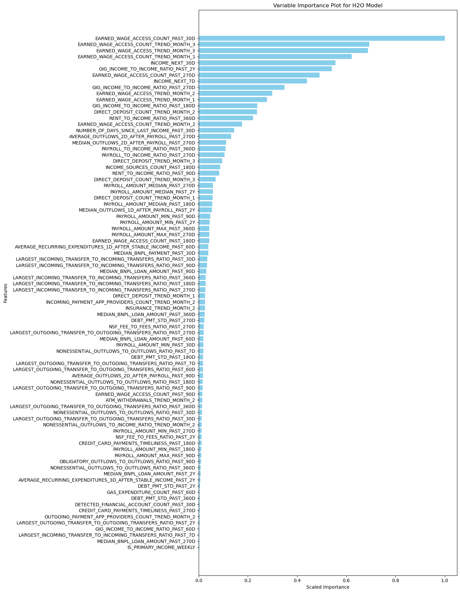
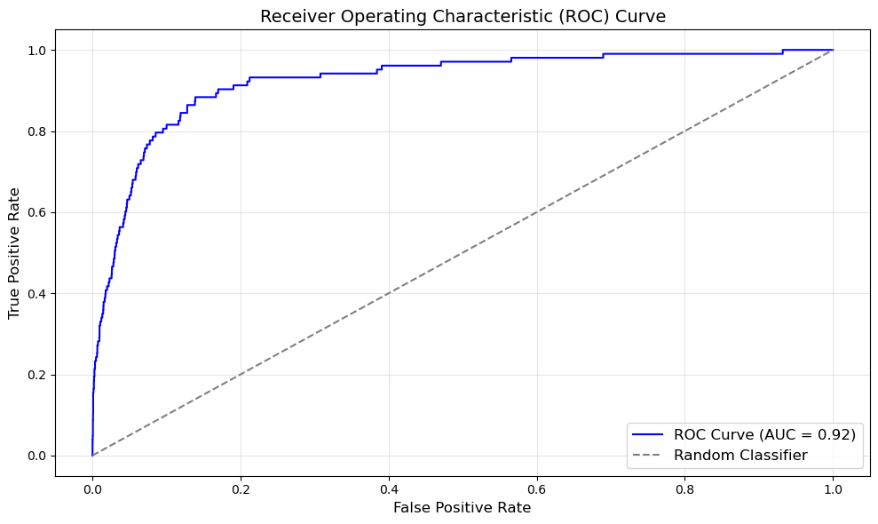
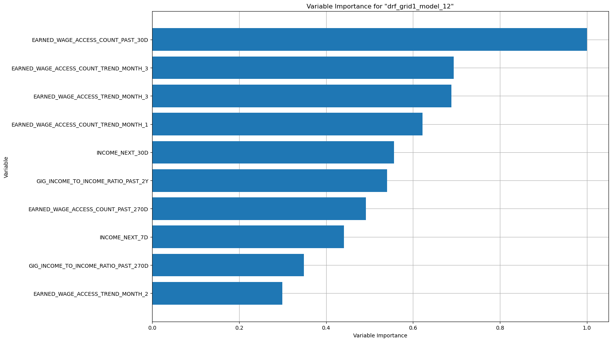
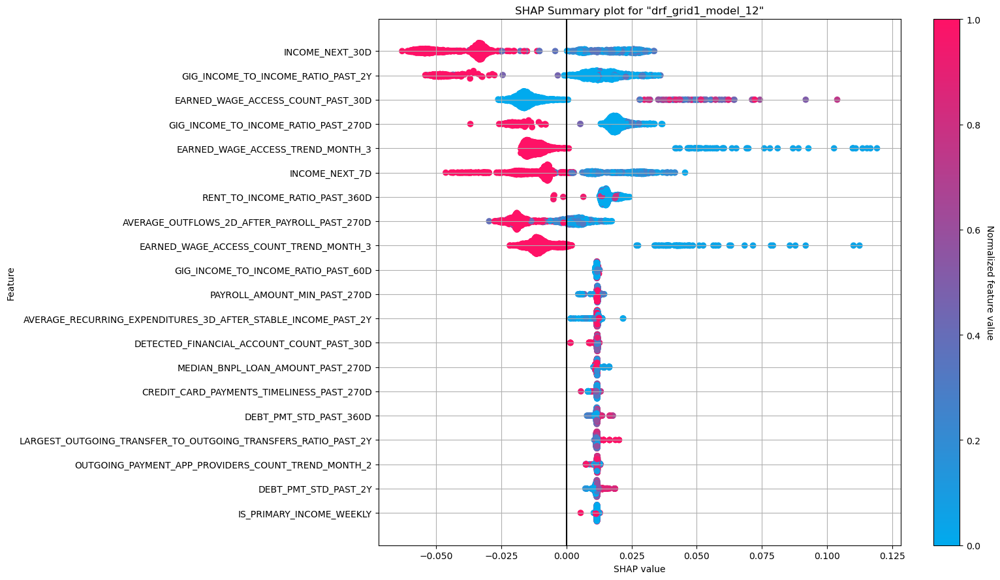
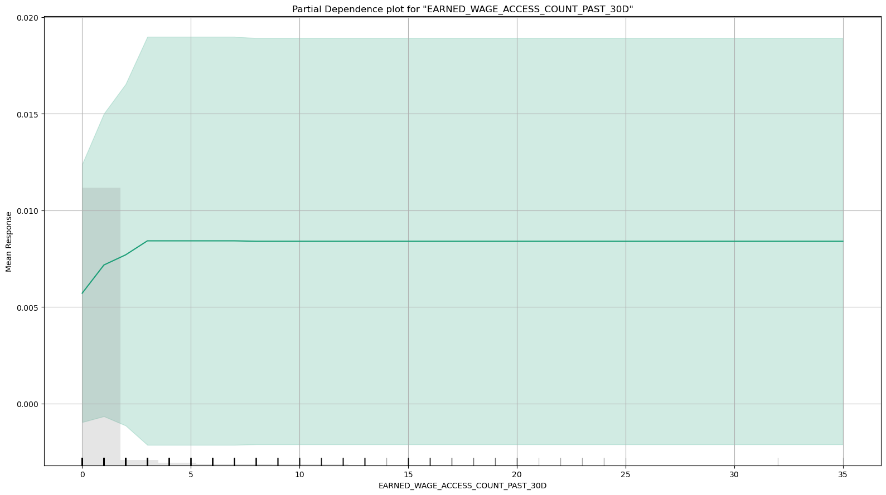
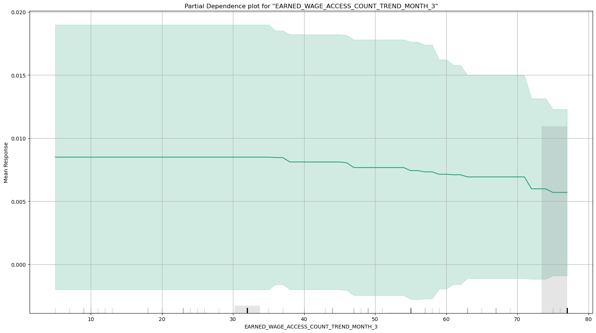
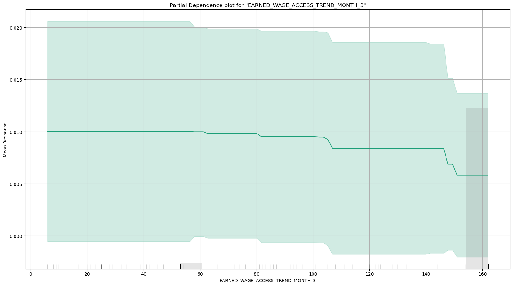
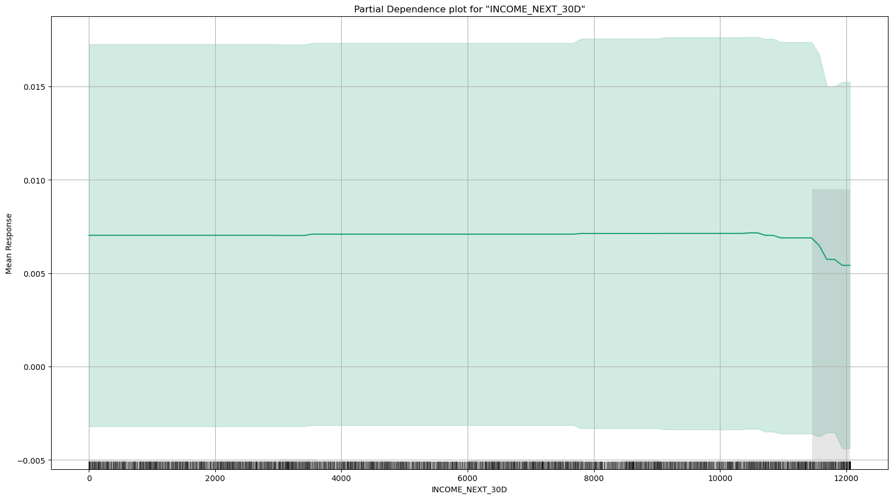
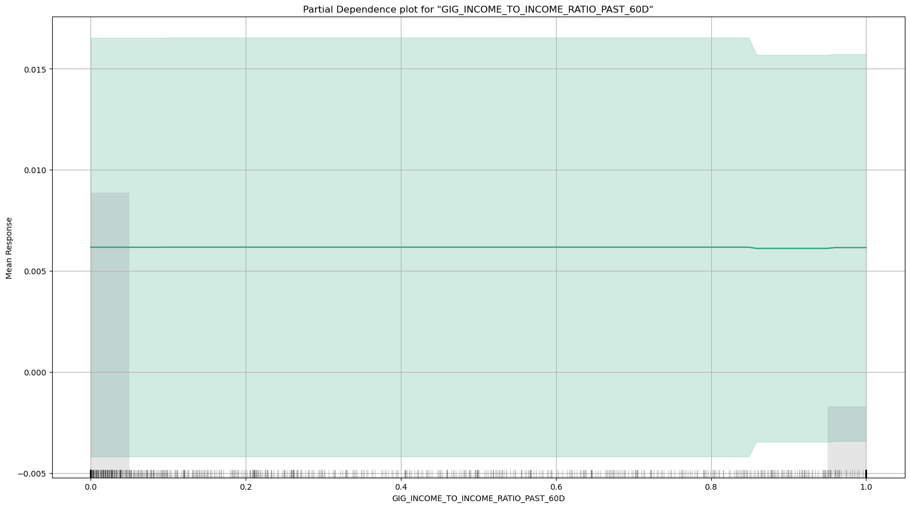

</head>

<body class="fullcontent">

  

</header>

Code

<pre class="sourceCode python code-with-copy"><code class="sourceCode python">import pandas as pd
import numpy as np
import os
from sklearn.ensemble import RandomForestClassifier, GradientBoostingClassifier
from sklearn.metrics import roc_auc_score, accuracy_score
from sklearn.utils.class_weight import compute_class_weight
from sklearn.model_selection import GridSearchCV, train_test_split, cross_val_score, StratifiedKFold, RandomizedSearchCV
from sklearn.datasets import make_classification
from sklearn.inspection import PartialDependenceDisplay
from xgboost import XGBClassifier

import shap
from catboost import CatBoostClassifier
import matplotlib.pyplot as plt
from joblib import dump, load

pd.set_option("display.max_columns", None)
pd.set_option("display.max_rows", None)
pd.options.display.float_format = "{:,.4}".format

# Run H2O later
import h2o
import pandoc
from h2o.estimators.glm import H2OGeneralizedLinearEstimator
from h2o.estimators.gbm import H2OGradientBoostingEstimator
from h2o.estimators import H2ORandomForestEstimator, H2ODecisionTreeEstimator
from h2o.grid.grid_search import H2OGridSearch
from h2o.estimators import H2OKMeansEstimator
from h2o.automl import H2OAutoML
h2o.init(max_mem_size = "20G") # need more memory
#h2o.init() # need more memory

import warnings
# Suppress all warnings
warnings.filterwarnings("ignore")</code><button title="Copy to Clipboard" class="code-copy-button"><i class="bi"></i></button></pre>

<pre><code>Checking whether there is an H2O instance running at http://localhost:54321..... not found.
Attempting to start a local H2O server...
  Java Version: openjdk version "11.0.23" 2024-04-16 LTS; OpenJDK Runtime Environment Zulu11.72+19-CA (build 11.0.23+9-LTS); OpenJDK 64-Bit Server VM Zulu11.72+19-CA (build 11.0.23+9-LTS, mixed mode)
  Starting server from /opt/anaconda3/lib/python3.12/site-packages/h2o/backend/bin/h2o.jar
  Ice root: /var/folders/z5/xxddnyr978bb97d94x1wj3780000gn/T/tmp96srg0t1
  JVM stdout: /var/folders/z5/xxddnyr978bb97d94x1wj3780000gn/T/tmp96srg0t1/h2o_luis_started_from_python.out
  JVM stderr: /var/folders/z5/xxddnyr978bb97d94x1wj3780000gn/T/tmp96srg0t1/h2o_luis_started_from_python.err
  Server is running at http://127.0.0.1:54321
Connecting to H2O server at http://127.0.0.1:54321 ... successful.</code></pre>

      

  
<table class="h2o-table caption-top table table-sm table-striped small" data-quarto-postprocess="true">
<tbody>
<tr class="odd">
<td>H2O_cluster_uptime:</td>
<td>02 secs</td>
</tr>
<tr class="even">
<td>H2O_cluster_timezone:</td>
<td>America/New_York</td>
</tr>
<tr class="odd">
<td>H2O_data_parsing_timezone:</td>
<td>UTC</td>
</tr>
<tr class="even">
<td>H2O_cluster_version:</td>
<td>3.46.0.6</td>
</tr>
<tr class="odd">
<td>H2O_cluster_version_age:</td>
<td>16 days</td>
</tr>
<tr class="even">
<td>H2O_cluster_name:</td>
<td>H2O_from_python_luis_oovuc7</td>
</tr>
<tr class="odd">
<td>H2O_cluster_total_nodes:</td>
<td>1</td>
</tr>
<tr class="even">
<td>H2O_cluster_free_memory:</td>
<td>20 Gb</td>
</tr>
<tr class="odd">
<td>H2O_cluster_total_cores:</td>
<td>10</td>
</tr>
<tr class="even">
<td>H2O_cluster_allowed_cores:</td>
<td>10</td>
</tr>
<tr class="odd">
<td>H2O_cluster_status:</td>
<td>locked, healthy</td>
</tr>
<tr class="even">
<td>H2O_connection_url:</td>
<td>http://127.0.0.1:54321</td>
</tr>
<tr class="odd">
<td>H2O_connection_proxy:</td>
<td>{"http": null, "https": null}</td>
</tr>
<tr class="even">
<td>H2O_internal_security:</td>
<td>False</td>
</tr>
<tr class="odd">
<td>Python_version:</td>
<td>3.12.2 final</td>
</tr>
</tbody>
</table>

Code

<pre class="sourceCode python code-with-copy"><code class="sourceCode python">def firingRate(df):
    return 1-df.isna().sum(axis=0)/df.shape[0]

def uniqueCount(df):
    return df.nunique()

def uniqueRate(df):
    return df.nunique()/df.shape[0]

def firingRateDetailed(df):
    output = []
    firingRate = 1-df.isna().sum(axis=0)/df.shape[0]
    uniqueCount = df.nunique()
    uniqueRate = df.nunique()/df.shape[0]
    for i in df.columns:
        if df[i].dtypes == 'O':
            if df[i].nunique() &lt;= 15:
                output.append(df[i].value_counts(dropna = False, normalize = True))
            else:
                output.append((i+': Categorical Column with '+ str(df[i].nunique()) + ' groups'))
        elif (df[i].dtypes in ['int8','int16','int32','int64','float32','float64']):
            output.append(df[i].describe())
        else:
            df[i] = df[i].astype(str)
            if df[i].nunique() &lt;= 15:
                output.append(df[i].value_counts(dropna = False, normalize = True))
            else:
                output.append((i+': Categorical Column with '+ str(df[i].nunique()) + ' groups'))
    final = pd.DataFrame({'Column': df.columns,
                          'firingRate': firingRate,
                          'uniqueCount': uniqueCount,
                          'uniqueRate': uniqueRate,
                          'Detailed_Summary': output})   
    return(final)

def compute_class_weights(y):
    # Calculate the class weights
    class_weights = compute_class_weight(
        class_weight="balanced", classes=np.unique(y), y=y
    )

    # Convert the result to a dictionary with class labels as keys
    class_weight_dict = dict(zip(np.unique(y), class_weights))

    # Create an array of the same length as y with the corresponding class weight for each element
    class_weights_array = np.array([class_weight_dict[label] for label in y])

    return class_weights_array</code><button title="Copy to Clipboard" class="code-copy-button"><i class="bi"></i></button></pre>

<section id="read-in-files" class="level2">
<h2 class="anchored" data-anchor-id="read-in-files">Read in files</h2>

Code

<pre class="sourceCode python code-with-copy"><code class="sourceCode python">df = pd.read_parquet("giggle_user_ids_33603_w2flags_20241116.parquet")</code><button title="Copy to Clipboard" class="code-copy-button"><i class="bi"></i></button></pre>

</section>
<section id="create-samples" class="level2">
<h2 class="anchored" data-anchor-id="create-samples">Create Samples</h2>
<section id="class-0---non-w2" class="level3">
<h3 class="anchored" data-anchor-id="class-0---non-w2">Class 0 - Non W2</h3>
</section>
<section id="class-1---w2" class="level3">
<h3 class="anchored" data-anchor-id="class-1---w2">Class 1 - W2</h3>

Code

<pre class="sourceCode python code-with-copy"><code class="sourceCode python">cl0 = df[df['W2_INCOME']==0]
print(cl0.shape)
cl1 = df[df['W2_INCOME']==1]
print(cl1.shape)</code><button title="Copy to Clipboard" class="code-copy-button"><i class="bi"></i></button></pre>

<pre><code>(33261, 5021)
(342, 5021)</code></pre>

Code

<pre class="sourceCode python code-with-copy"><code class="sourceCode python">train0 = cl0.sample(int(len(cl0)*.7), random_state = 181, replace = False)
test0 = cl0[~cl0.USER_ID.isin(train0.USER_ID.tolist())]

train1 = cl1.sample(int(len(cl1)*.7), random_state = 181, replace = False)
test1 = cl1[~cl1.USER_ID.isin(train1.USER_ID.tolist())]

train = pd.concat([train0, train1])
test = pd.concat([test0, test1])

train = train.sample(int(len(train)), random_state = 191, replace = False)
test = test.sample(int(len(test)), random_state = 191, replace = False)

print("Train Size: " + str(len(train)))
print("Train W2's: " + str(len(train[train['W2_INCOME'] == 1])))
print("Test Size: " + str(len(test)))
print("Test W2's: " + str(len(test[test['W2_INCOME'] == 1])))

train['dataset'] = 'train'
test['dataset'] = 'test'

combine = pd.concat([train, test])
combine = combine.sample(int(len(combine)), random_state = 191, replace = False).reset_index(drop = True)
print("Combined Data Size: " + str(len(combine)))

</code><button title="Copy to Clipboard" class="code-copy-button"><i class="bi"></i></button></pre>

<pre><code>Train Size: 23521
Train W2's: 239
Test Size: 10082
Test W2's: 103
Combined Data Size: 33603</code></pre>

</section>
</section>
<section id="list-of-predictorsnon-predictors" class="level2">
<h2 class="anchored" data-anchor-id="list-of-predictorsnon-predictors">List of predictors/non-predictors</h2>
<section id="read-in-feature-selection-results-display-top-10" class="level3">
<h3 class="anchored" data-anchor-id="read-in-feature-selection-results-display-top-10">Read in Feature Selection Results (display top 10)</h3>

Code

<pre class="sourceCode python code-with-copy"><code class="sourceCode python">top_features = pd.read_csv("Feature_Selection_84_20241118.csv")
top_features.head(10)</code><button title="Copy to Clipboard" class="code-copy-button"><i class="bi"></i></button></pre>

<table class="dataframe caption-top table table-sm table-striped small" data-quarto-postprocess="true" data-border="1">
<thead>
<tr class="header">
<th data-quarto-table-cell-role="th"></th>
<th data-quarto-table-cell-role="th">Variable</th>
<th data-quarto-table-cell-role="th">Total Relative Importance</th>
</tr>
</thead>
<tbody>
<tr class="odd">
<td data-quarto-table-cell-role="th">0</td>
<td>EARNED_WAGE_ACCESS_COUNT_TREND_MONTH_3</td>
<td>6.003e+04</td>
</tr>
<tr class="even">
<td data-quarto-table-cell-role="th">1</td>
<td>EARNED_WAGE_ACCESS_COUNT_PAST_180D</td>
<td>5.892e+04</td>
</tr>
<tr class="odd">
<td data-quarto-table-cell-role="th">2</td>
<td>EARNED_WAGE_ACCESS_COUNT_PAST_270D</td>
<td>4.417e+04</td>
</tr>
<tr class="even">
<td data-quarto-table-cell-role="th">3</td>
<td>EARNED_WAGE_ACCESS_COUNT_TREND_MONTH_1</td>
<td>4.019e+04</td>
</tr>
<tr class="odd">
<td data-quarto-table-cell-role="th">4</td>
<td>GIG_INCOME_TO_INCOME_RATIO_PAST_180D</td>
<td>3.797e+04</td>
</tr>
<tr class="even">
<td data-quarto-table-cell-role="th">5</td>
<td>EARNED_WAGE_ACCESS_TREND_MONTH_1</td>
<td>3.637e+04</td>
</tr>
<tr class="odd">
<td data-quarto-table-cell-role="th">6</td>
<td>INCOME_NEXT_7D</td>
<td>3.605e+04</td>
</tr>
<tr class="even">
<td data-quarto-table-cell-role="th">7</td>
<td>EARNED_WAGE_ACCESS_TREND_MONTH_3</td>
<td>3.582e+04</td>
</tr>
<tr class="odd">
<td data-quarto-table-cell-role="th">8</td>
<td>INCOME_NEXT_30D</td>
<td>3.446e+04</td>
</tr>
<tr class="even">
<td data-quarto-table-cell-role="th">9</td>
<td>RENT_TO_INCOME_RATIO_PAST_360D</td>
<td>3.119e+04</td>
</tr>
</tbody>
</table>

Code

<pre class="sourceCode python code-with-copy"><code class="sourceCode python">predictors = top_features.Variable.tolist()
outcome_flag = 'W2_INCOME'</code><button title="Copy to Clipboard" class="code-copy-button"><i class="bi"></i></button></pre>

</section>
</section>
<section id="these-will-be-columns-to-keep-in-h2o-frame-show-last-5" class="level2">
<h2 class="anchored" data-anchor-id="these-will-be-columns-to-keep-in-h2o-frame-show-last-5">These will be columns to keep in H2O Frame (show last 5)</h2>

Code

<pre class="sourceCode python code-with-copy"><code class="sourceCode python">col_keep = predictors+['W2_INCOME', 'dataset']
col_keep[80:85]</code><button title="Copy to Clipboard" class="code-copy-button"><i class="bi"></i></button></pre>

<pre><code>['MEDIAN_BNPL_PAYMENT_PAST_30D',
 'DEBT_PMT_STD_PAST_2Y',
 'MEDIAN_BNPL_LOAN_AMOUNT_PAST_90D',
 'OBLIGATORY_OUTFLOWS_TO_OUTFLOWS_RATIO_PAST_90D',
 'W2_INCOME']</code></pre>

</section>
<section id="convert-dataframe-to-h2o-frame" class="level2">
<h2 class="anchored" data-anchor-id="convert-dataframe-to-h2o-frame">Convert DataFrame to H2O Frame</h2>

Code

<pre class="sourceCode python code-with-copy"><code class="sourceCode python">df_h2o = h2o.H2OFrame(combine[col_keep])</code><button title="Copy to Clipboard" class="code-copy-button"><i class="bi"></i></button></pre>

<pre><code>Parse progress: |████████████████████████████████████████████████████████████████| (done) 100%</code></pre>

Code

<pre class="sourceCode python code-with-copy"><code class="sourceCode python">import time
start = time.time()
# Fix Column Types in h2o
# If column enum has "9 or more" values, turn numeric (to prevent high cardinality in categorical)
for i in df_h2o.columns:
    if (df_h2o.types[i] == "enum"):
        if len(df_h2o[i].levels()[0]) &gt;= 9:
            df_h2o[i] = df_h2o[i].asnumeric()
            
    #elif df_h2o.types[i] == "int":
    #    df_h2o[i] = df_h2o[i].asnumeric()
end = time.time()
print("Execution time:", end - start, "seconds")
#df_h2o.types</code><button title="Copy to Clipboard" class="code-copy-button"><i class="bi"></i></button></pre>

<pre><code>Execution time: 3.9899189472198486 seconds</code></pre>

Code

<pre class="sourceCode python code-with-copy"><code class="sourceCode python">df_h2o["W2_INCOME"] = df_h2o["W2_INCOME"].asfactor()</code><button title="Copy to Clipboard" class="code-copy-button"><i class="bi"></i></button></pre>

Code

<pre class="sourceCode python code-with-copy"><code class="sourceCode python">df_train = df_h2o[df_h2o['dataset'] == 'train']
df_test = df_h2o[df_h2o['dataset'] == 'test']</code><button title="Copy to Clipboard" class="code-copy-button"><i class="bi"></i></button></pre>

</section>
<section id="grid-search-of-models-using-random-forest-estimator" class="level2">
<h2 class="anchored" data-anchor-id="grid-search-of-models-using-random-forest-estimator">Grid Search of Models (Using Random Forest Estimator)</h2>

Code

<pre class="sourceCode python code-with-copy"><code class="sourceCode python">drf_params1 = {
    "max_depth": [5, 7, 10, 15, 20, 25],               # Extended range
    "sample_rate": [0.5, 0.6, 0.7, 0.8, 0.9],         # More options for sampling
    "ntrees": [10, 15, 20, 25, 30, 35, 40, 50],       # Larger range for tree count
    "min_rows": [1, 5, 10, 20, 50],                   # Smaller minimum rows for high granularity
    "mtries": [1, 3, 5, -1],                          # Add '-1' for auto (sqrt of predictors)
    "nbins": [10, 20, 30, 40, 50],                    # Number of bins for histogram splitting
    "nbins_top_level": [50, 100, 200],                # Top-level histogram bins
    "nbins_cats": [16, 64, 256],                      # For categorical predictors
    "col_sample_rate_per_tree": [0.5, 0.6, 0.7, 0.8], # Column sampling for each tree
    "distribution": ["bernoulli"],     # Add support for other distributions if applicable
    "seed": [1234]                              # Add seeds for reproducibility
}

search_criteria = {
    'strategy': "RandomDiscrete",
    'max_models': 100,             # Limit runtime to 20 minutes
    'max_runtime_secs': 1200,
    'stopping_metric': "AUC",             # Stop based on AUC
    'stopping_rounds': 5,
    'stopping_tolerance': 0.001,
    'seed': 1234 
}

# Initialize the Random Forest estimator with balance_classes enabled
rf_model = H2ORandomForestEstimator(
    seed=1,
    nfolds = 5,
    balance_classes=True   # Enables class balancing for imbalanced data
)

# Create and run the grid search
rf_grid = H2OGridSearch(
    model=rf_model,
    hyper_params=drf_params1,
    grid_id='drf_grid1',
    search_criteria=search_criteria
)

rf_grid.train(x=predictors, 
                y=outcome_flag,
                training_frame= df_train,
              validation_frame= df_test,
                seed=1)</code><button title="Copy to Clipboard" class="code-copy-button"><i class="bi"></i></button></pre>

<pre><code>drf Grid Build progress: |███████████████████████████████████████████████████████| (done) 100%</code></pre>

      

  
<table class="h2o-table caption-top table table-sm table-striped small" data-quarto-postprocess="true">
<caption>Hyper-Parameter Search Summary: ordered by increasing logloss</caption>
<thead>
<tr class="header">
<th data-quarto-table-cell-role="th"></th>
<th data-quarto-table-cell-role="th">col_sample_rate_per_tree</th>
<th data-quarto-table-cell-role="th">distribution</th>
<th data-quarto-table-cell-role="th">max_depth</th>
<th data-quarto-table-cell-role="th">min_rows</th>
<th data-quarto-table-cell-role="th">mtries</th>
<th data-quarto-table-cell-role="th">nbins</th>
<th data-quarto-table-cell-role="th">nbins_cats</th>
<th data-quarto-table-cell-role="th">nbins_top_level</th>
<th data-quarto-table-cell-role="th">ntrees</th>
<th data-quarto-table-cell-role="th">sample_rate</th>
<th data-quarto-table-cell-role="th">seed</th>
<th data-quarto-table-cell-role="th">model_ids</th>
<th data-quarto-table-cell-role="th">logloss</th>
</tr>
</thead>
<tbody>
<tr class="odd">
<td></td>
<td>0.8</td>
<td>bernoulli</td>
<td>5.0</td>
<td>10.0</td>
<td>-1.0</td>
<td>10.0</td>
<td>256.0</td>
<td>200.0</td>
<td>35.0</td>
<td>0.6</td>
<td>1234.0</td>
<td>drf_grid1_model_43</td>
<td>0.0452794</td>
</tr>
<tr class="even">
<td></td>
<td>0.6</td>
<td>bernoulli</td>
<td>7.0</td>
<td>50.0</td>
<td>-1.0</td>
<td>10.0</td>
<td>16.0</td>
<td>100.0</td>
<td>15.0</td>
<td>0.5</td>
<td>1234.0</td>
<td>drf_grid1_model_86</td>
<td>0.0454753</td>
</tr>
<tr class="odd">
<td></td>
<td>0.6</td>
<td>bernoulli</td>
<td>5.0</td>
<td>1.0</td>
<td>-1.0</td>
<td>30.0</td>
<td>256.0</td>
<td>200.0</td>
<td>10.0</td>
<td>0.7</td>
<td>1234.0</td>
<td>drf_grid1_model_28</td>
<td>0.0455021</td>
</tr>
<tr class="even">
<td></td>
<td>0.6</td>
<td>bernoulli</td>
<td>5.0</td>
<td>20.0</td>
<td>-1.0</td>
<td>30.0</td>
<td>256.0</td>
<td>100.0</td>
<td>35.0</td>
<td>0.8</td>
<td>1234.0</td>
<td>drf_grid1_model_72</td>
<td>0.0455302</td>
</tr>
<tr class="odd">
<td></td>
<td>0.5</td>
<td>bernoulli</td>
<td>5.0</td>
<td>20.0</td>
<td>-1.0</td>
<td>20.0</td>
<td>64.0</td>
<td>50.0</td>
<td>40.0</td>
<td>0.8</td>
<td>1234.0</td>
<td>drf_grid1_model_49</td>
<td>0.0455320</td>
</tr>
<tr class="even">
<td></td>
<td>0.7</td>
<td>bernoulli</td>
<td>5.0</td>
<td>10.0</td>
<td>-1.0</td>
<td>50.0</td>
<td>64.0</td>
<td>50.0</td>
<td>50.0</td>
<td>0.6</td>
<td>1234.0</td>
<td>drf_grid1_model_94</td>
<td>0.0455838</td>
</tr>
<tr class="odd">
<td></td>
<td>0.7</td>
<td>bernoulli</td>
<td>5.0</td>
<td>10.0</td>
<td>-1.0</td>
<td>40.0</td>
<td>256.0</td>
<td>100.0</td>
<td>25.0</td>
<td>0.8</td>
<td>1234.0</td>
<td>drf_grid1_model_84</td>
<td>0.0459985</td>
</tr>
<tr class="even">
<td></td>
<td>0.5</td>
<td>bernoulli</td>
<td>5.0</td>
<td>50.0</td>
<td>5.0</td>
<td>40.0</td>
<td>64.0</td>
<td>50.0</td>
<td>50.0</td>
<td>0.6</td>
<td>1234.0</td>
<td>drf_grid1_model_26</td>
<td>0.0461046</td>
</tr>
<tr class="odd">
<td></td>
<td>0.6</td>
<td>bernoulli</td>
<td>5.0</td>
<td>5.0</td>
<td>5.0</td>
<td>10.0</td>
<td>16.0</td>
<td>200.0</td>
<td>30.0</td>
<td>0.5</td>
<td>1234.0</td>
<td>drf_grid1_model_35</td>
<td>0.0462889</td>
</tr>
<tr class="even">
<td></td>
<td>0.7</td>
<td>bernoulli</td>
<td>5.0</td>
<td>50.0</td>
<td>5.0</td>
<td>20.0</td>
<td>64.0</td>
<td>50.0</td>
<td>30.0</td>
<td>0.7</td>
<td>1234.0</td>
<td>drf_grid1_model_12</td>
<td>0.0463223</td>
</tr>
<tr class="odd">
<td>---</td>
<td>---</td>
<td>---</td>
<td>---</td>
<td>---</td>
<td>---</td>
<td>---</td>
<td>---</td>
<td>---</td>
<td>---</td>
<td>---</td>
<td>---</td>
<td>---</td>
<td>---</td>
</tr>
<tr class="even">
<td></td>
<td>0.5</td>
<td>bernoulli</td>
<td>25.0</td>
<td>10.0</td>
<td>5.0</td>
<td>40.0</td>
<td>64.0</td>
<td>50.0</td>
<td>15.0</td>
<td>0.8</td>
<td>1234.0</td>
<td>drf_grid1_model_31</td>
<td>0.0979471</td>
</tr>
<tr class="odd">
<td></td>
<td>0.8</td>
<td>bernoulli</td>
<td>25.0</td>
<td>5.0</td>
<td>-1.0</td>
<td>50.0</td>
<td>64.0</td>
<td>200.0</td>
<td>20.0</td>
<td>0.6</td>
<td>1234.0</td>
<td>drf_grid1_model_65</td>
<td>0.0980817</td>
</tr>
<tr class="even">
<td></td>
<td>0.5</td>
<td>bernoulli</td>
<td>20.0</td>
<td>1.0</td>
<td>5.0</td>
<td>20.0</td>
<td>256.0</td>
<td>200.0</td>
<td>30.0</td>
<td>0.6</td>
<td>1234.0</td>
<td>drf_grid1_model_88</td>
<td>0.1011293</td>
</tr>
<tr class="odd">
<td></td>
<td>0.6</td>
<td>bernoulli</td>
<td>20.0</td>
<td>5.0</td>
<td>5.0</td>
<td>30.0</td>
<td>256.0</td>
<td>50.0</td>
<td>20.0</td>
<td>0.9</td>
<td>1234.0</td>
<td>drf_grid1_model_77</td>
<td>0.1028425</td>
</tr>
<tr class="even">
<td></td>
<td>0.5</td>
<td>bernoulli</td>
<td>20.0</td>
<td>10.0</td>
<td>5.0</td>
<td>10.0</td>
<td>256.0</td>
<td>100.0</td>
<td>10.0</td>
<td>0.8</td>
<td>1234.0</td>
<td>drf_grid1_model_93</td>
<td>0.1041151</td>
</tr>
<tr class="odd">
<td></td>
<td>0.7</td>
<td>bernoulli</td>
<td>20.0</td>
<td>1.0</td>
<td>-1.0</td>
<td>30.0</td>
<td>64.0</td>
<td>200.0</td>
<td>25.0</td>
<td>0.6</td>
<td>1234.0</td>
<td>drf_grid1_model_51</td>
<td>0.1044277</td>
</tr>
<tr class="even">
<td></td>
<td>0.8</td>
<td>bernoulli</td>
<td>20.0</td>
<td>5.0</td>
<td>3.0</td>
<td>20.0</td>
<td>256.0</td>
<td>100.0</td>
<td>10.0</td>
<td>0.5</td>
<td>1234.0</td>
<td>drf_grid1_model_44</td>
<td>0.1104028</td>
</tr>
<tr class="odd">
<td></td>
<td>0.7</td>
<td>bernoulli</td>
<td>20.0</td>
<td>1.0</td>
<td>-1.0</td>
<td>40.0</td>
<td>16.0</td>
<td>50.0</td>
<td>15.0</td>
<td>0.5</td>
<td>1234.0</td>
<td>drf_grid1_model_57</td>
<td>0.1228886</td>
</tr>
<tr class="even">
<td></td>
<td>0.7</td>
<td>bernoulli</td>
<td>25.0</td>
<td>1.0</td>
<td>-1.0</td>
<td>40.0</td>
<td>64.0</td>
<td>100.0</td>
<td>20.0</td>
<td>0.7</td>
<td>1234.0</td>
<td>drf_grid1_model_1</td>
<td>0.1318061</td>
</tr>
<tr class="odd">
<td></td>
<td>0.6</td>
<td>bernoulli</td>
<td>25.0</td>
<td>1.0</td>
<td>-1.0</td>
<td>50.0</td>
<td>64.0</td>
<td>100.0</td>
<td>15.0</td>
<td>0.7</td>
<td>1234.0</td>
<td>drf_grid1_model_22</td>
<td>0.1440571</td>
</tr>
</tbody>
</table>

<pre style="font-size: smaller; margin-bottom: 1em;">[100 rows x 14 columns]</pre>

</section>
<section id="leaderboard-results" class="level2">
<h2 class="anchored" data-anchor-id="leaderboard-results">Leaderboard results</h2>

Code

<pre class="sourceCode python code-with-copy"><code class="sourceCode python">leaderboard = rf_grid.get_grid(sort_by='auc', decreasing=True)
leaderboard</code><button title="Copy to Clipboard" class="code-copy-button"><i class="bi"></i></button></pre>

      

  
<table class="h2o-table caption-top table table-sm table-striped small" data-quarto-postprocess="true">
<caption>Hyper-Parameter Search Summary: ordered by decreasing auc</caption>
<thead>
<tr class="header">
<th data-quarto-table-cell-role="th"></th>
<th data-quarto-table-cell-role="th">col_sample_rate_per_tree</th>
<th data-quarto-table-cell-role="th">distribution</th>
<th data-quarto-table-cell-role="th">max_depth</th>
<th data-quarto-table-cell-role="th">min_rows</th>
<th data-quarto-table-cell-role="th">mtries</th>
<th data-quarto-table-cell-role="th">nbins</th>
<th data-quarto-table-cell-role="th">nbins_cats</th>
<th data-quarto-table-cell-role="th">nbins_top_level</th>
<th data-quarto-table-cell-role="th">ntrees</th>
<th data-quarto-table-cell-role="th">sample_rate</th>
<th data-quarto-table-cell-role="th">seed</th>
<th data-quarto-table-cell-role="th">model_ids</th>
<th data-quarto-table-cell-role="th">auc</th>
</tr>
</thead>
<tbody>
<tr class="odd">
<td></td>
<td>0.5</td>
<td>bernoulli</td>
<td>20.0</td>
<td>50.0</td>
<td>-1.0</td>
<td>10.0</td>
<td>256.0</td>
<td>100.0</td>
<td>30.0</td>
<td>0.8</td>
<td>1234.0</td>
<td>drf_grid1_model_78</td>
<td>0.9059074</td>
</tr>
<tr class="even">
<td></td>
<td>0.5</td>
<td>bernoulli</td>
<td>15.0</td>
<td>50.0</td>
<td>5.0</td>
<td>10.0</td>
<td>16.0</td>
<td>200.0</td>
<td>50.0</td>
<td>0.6</td>
<td>1234.0</td>
<td>drf_grid1_model_85</td>
<td>0.9052891</td>
</tr>
<tr class="odd">
<td></td>
<td>0.7</td>
<td>bernoulli</td>
<td>10.0</td>
<td>20.0</td>
<td>5.0</td>
<td>40.0</td>
<td>16.0</td>
<td>200.0</td>
<td>40.0</td>
<td>0.5</td>
<td>1234.0</td>
<td>drf_grid1_model_25</td>
<td>0.9047158</td>
</tr>
<tr class="even">
<td></td>
<td>0.5</td>
<td>bernoulli</td>
<td>15.0</td>
<td>50.0</td>
<td>-1.0</td>
<td>10.0</td>
<td>256.0</td>
<td>200.0</td>
<td>30.0</td>
<td>0.9</td>
<td>1234.0</td>
<td>drf_grid1_model_79</td>
<td>0.9042310</td>
</tr>
<tr class="odd">
<td></td>
<td>0.5</td>
<td>bernoulli</td>
<td>10.0</td>
<td>50.0</td>
<td>3.0</td>
<td>40.0</td>
<td>256.0</td>
<td>100.0</td>
<td>40.0</td>
<td>0.8</td>
<td>1234.0</td>
<td>drf_grid1_model_52</td>
<td>0.9017198</td>
</tr>
<tr class="even">
<td></td>
<td>0.5</td>
<td>bernoulli</td>
<td>10.0</td>
<td>50.0</td>
<td>-1.0</td>
<td>10.0</td>
<td>64.0</td>
<td>50.0</td>
<td>10.0</td>
<td>0.7</td>
<td>1234.0</td>
<td>drf_grid1_model_81</td>
<td>0.8988795</td>
</tr>
<tr class="odd">
<td></td>
<td>0.6</td>
<td>bernoulli</td>
<td>25.0</td>
<td>50.0</td>
<td>3.0</td>
<td>30.0</td>
<td>256.0</td>
<td>50.0</td>
<td>35.0</td>
<td>0.7</td>
<td>1234.0</td>
<td>drf_grid1_model_64</td>
<td>0.8935552</td>
</tr>
<tr class="even">
<td></td>
<td>0.5</td>
<td>bernoulli</td>
<td>7.0</td>
<td>20.0</td>
<td>-1.0</td>
<td>30.0</td>
<td>64.0</td>
<td>50.0</td>
<td>35.0</td>
<td>0.8</td>
<td>1234.0</td>
<td>drf_grid1_model_73</td>
<td>0.8934037</td>
</tr>
<tr class="odd">
<td></td>
<td>0.6</td>
<td>bernoulli</td>
<td>7.0</td>
<td>50.0</td>
<td>-1.0</td>
<td>10.0</td>
<td>16.0</td>
<td>100.0</td>
<td>15.0</td>
<td>0.5</td>
<td>1234.0</td>
<td>drf_grid1_model_86</td>
<td>0.8934011</td>
</tr>
<tr class="even">
<td></td>
<td>0.6</td>
<td>bernoulli</td>
<td>10.0</td>
<td>50.0</td>
<td>-1.0</td>
<td>20.0</td>
<td>256.0</td>
<td>100.0</td>
<td>10.0</td>
<td>0.8</td>
<td>1234.0</td>
<td>drf_grid1_model_21</td>
<td>0.8915046</td>
</tr>
<tr class="odd">
<td>---</td>
<td>---</td>
<td>---</td>
<td>---</td>
<td>---</td>
<td>---</td>
<td>---</td>
<td>---</td>
<td>---</td>
<td>---</td>
<td>---</td>
<td>---</td>
<td>---</td>
<td>---</td>
</tr>
<tr class="even">
<td></td>
<td>0.7</td>
<td>bernoulli</td>
<td>20.0</td>
<td>1.0</td>
<td>-1.0</td>
<td>30.0</td>
<td>64.0</td>
<td>200.0</td>
<td>25.0</td>
<td>0.6</td>
<td>1234.0</td>
<td>drf_grid1_model_51</td>
<td>0.8054194</td>
</tr>
<tr class="odd">
<td></td>
<td>0.5</td>
<td>bernoulli</td>
<td>20.0</td>
<td>10.0</td>
<td>5.0</td>
<td>10.0</td>
<td>256.0</td>
<td>100.0</td>
<td>10.0</td>
<td>0.8</td>
<td>1234.0</td>
<td>drf_grid1_model_93</td>
<td>0.7959275</td>
</tr>
<tr class="even">
<td></td>
<td>0.7</td>
<td>bernoulli</td>
<td>20.0</td>
<td>1.0</td>
<td>-1.0</td>
<td>40.0</td>
<td>16.0</td>
<td>50.0</td>
<td>15.0</td>
<td>0.5</td>
<td>1234.0</td>
<td>drf_grid1_model_57</td>
<td>0.7899624</td>
</tr>
<tr class="odd">
<td></td>
<td>0.7</td>
<td>bernoulli</td>
<td>20.0</td>
<td>5.0</td>
<td>3.0</td>
<td>20.0</td>
<td>64.0</td>
<td>200.0</td>
<td>15.0</td>
<td>0.9</td>
<td>1234.0</td>
<td>drf_grid1_model_13</td>
<td>0.7829220</td>
</tr>
<tr class="even">
<td></td>
<td>0.5</td>
<td>bernoulli</td>
<td>20.0</td>
<td>1.0</td>
<td>5.0</td>
<td>20.0</td>
<td>256.0</td>
<td>200.0</td>
<td>30.0</td>
<td>0.6</td>
<td>1234.0</td>
<td>drf_grid1_model_88</td>
<td>0.7784129</td>
</tr>
<tr class="odd">
<td></td>
<td>0.8</td>
<td>bernoulli</td>
<td>20.0</td>
<td>5.0</td>
<td>3.0</td>
<td>20.0</td>
<td>256.0</td>
<td>100.0</td>
<td>10.0</td>
<td>0.5</td>
<td>1234.0</td>
<td>drf_grid1_model_44</td>
<td>0.7667530</td>
</tr>
<tr class="even">
<td></td>
<td>0.7</td>
<td>bernoulli</td>
<td>25.0</td>
<td>1.0</td>
<td>-1.0</td>
<td>40.0</td>
<td>64.0</td>
<td>100.0</td>
<td>20.0</td>
<td>0.7</td>
<td>1234.0</td>
<td>drf_grid1_model_1</td>
<td>0.7564273</td>
</tr>
<tr class="odd">
<td></td>
<td>0.6</td>
<td>bernoulli</td>
<td>25.0</td>
<td>1.0</td>
<td>-1.0</td>
<td>50.0</td>
<td>64.0</td>
<td>100.0</td>
<td>15.0</td>
<td>0.7</td>
<td>1234.0</td>
<td>drf_grid1_model_22</td>
<td>0.7440692</td>
</tr>
<tr class="even">
<td></td>
<td>0.7</td>
<td>bernoulli</td>
<td>25.0</td>
<td>1.0</td>
<td>3.0</td>
<td>20.0</td>
<td>16.0</td>
<td>200.0</td>
<td>35.0</td>
<td>0.7</td>
<td>1234.0</td>
<td>drf_grid1_model_14</td>
<td>0.7432266</td>
</tr>
<tr class="odd">
<td></td>
<td>0.7</td>
<td>bernoulli</td>
<td>25.0</td>
<td>1.0</td>
<td>1.0</td>
<td>50.0</td>
<td>16.0</td>
<td>50.0</td>
<td>30.0</td>
<td>0.9</td>
<td>1234.0</td>
<td>drf_grid1_model_41</td>
<td>0.7215771</td>
</tr>
</tbody>
</table>

<pre style="font-size: smaller; margin-bottom: 1em;">[100 rows x 14 columns]</pre>

</section>
<section id="compute-training-cross-validation-and-validation-aucs" class="level2">
<h2 class="anchored" data-anchor-id="compute-training-cross-validation-and-validation-aucs">Compute Training, Cross Validation, and Validation AUC’s</h2>

Code

<pre class="sourceCode python code-with-copy"><code class="sourceCode python">results = []

# Iterate through each model in the leaderboard
for model in leaderboard.models:
    model_id = model.model_id                       # Get the model ID
       
    # Retrieve the model from the H2O cluster
    model_obj = h2o.get_model(model_id)

    #validation_auc = model.auc(valid=True)          # Get the validation AUC
    validation_auc = model_obj.model_performance(df_test).auc()
    
    # Train AUC
    #train_auc = model_obj.auc(train=True)
    train_auc = model_obj.model_performance(df_train).auc()
    
    # Check for cross-validation metrics summary
    if model_obj.cross_validation_metrics_summary():
        # Extract AUC from the cross-validation summary
        cv_auc = model_obj.cross_validation_metrics_summary().as_data_frame().loc[2, 'mean']  # Extract mean AUC
    else:
        cv_auc = None  # If no cross-validation is available
    
    # Append the results to the list
    results.append({
        'model_id': model_id,
        'train_auc': train_auc,
        'validation_auc': validation_auc,
        'cross_validation_auc': cv_auc
    })

# Convert the results list into a Pandas DataFrame
df = pd.DataFrame(results)</code><button title="Copy to Clipboard" class="code-copy-button"><i class="bi"></i></button></pre>

</section>
<section id="display-the-model-results-auc-performance" class="level2">
<h2 class="anchored" data-anchor-id="display-the-model-results-auc-performance">Display the model results (AUC Performance)</h2>

Code

<pre class="sourceCode python code-with-copy"><code class="sourceCode python">df['overtraining_metric'] = np.array(df['train_auc']) - np.array(df['validation_auc']) ## the smaller the better
df.sort_values("overtraining_metric", ascending = True)</code><button title="Copy to Clipboard" class="code-copy-button"><i class="bi"></i></button></pre>

<table class="dataframe caption-top table table-sm table-striped small" data-quarto-postprocess="true" data-border="1">
<thead>
<tr class="header">
<th data-quarto-table-cell-role="th"></th>
<th data-quarto-table-cell-role="th">model_id</th>
<th data-quarto-table-cell-role="th">train_auc</th>
<th data-quarto-table-cell-role="th">validation_auc</th>
<th data-quarto-table-cell-role="th">cross_validation_auc</th>
<th data-quarto-table-cell-role="th">overtraining_metric</th>
</tr>
</thead>
<tbody>
<tr class="odd">
<td data-quarto-table-cell-role="th">31</td>
<td>drf_grid1_model_28</td>
<td>0.9405</td>
<td>0.9409</td>
<td>0.8784</td>
<td>-0.0003594</td>
</tr>
<tr class="even">
<td data-quarto-table-cell-role="th">51</td>
<td>drf_grid1_model_23</td>
<td>0.9262</td>
<td>0.9258</td>
<td>0.8656</td>
<td>0.0003516</td>
</tr>
<tr class="odd">
<td data-quarto-table-cell-role="th">17</td>
<td>drf_grid1_model_94</td>
<td>0.9453</td>
<td>0.9419</td>
<td>0.8859</td>
<td>0.003448</td>
</tr>
<tr class="even">
<td data-quarto-table-cell-role="th">14</td>
<td>drf_grid1_model_72</td>
<td>0.9456</td>
<td>0.9422</td>
<td>0.8882</td>
<td>0.003467</td>
</tr>
<tr class="odd">
<td data-quarto-table-cell-role="th">12</td>
<td>drf_grid1_model_49</td>
<td>0.9461</td>
<td>0.9417</td>
<td>0.8882</td>
<td>0.004408</td>
</tr>
<tr class="even">
<td data-quarto-table-cell-role="th">39</td>
<td>drf_grid1_model_35</td>
<td>0.9357</td>
<td>0.9309</td>
<td>0.8735</td>
<td>0.004847</td>
</tr>
<tr class="odd">
<td data-quarto-table-cell-role="th">24</td>
<td>drf_grid1_model_84</td>
<td>0.9447</td>
<td>0.9394</td>
<td>0.8834</td>
<td>0.00534</td>
</tr>
<tr class="even">
<td data-quarto-table-cell-role="th">47</td>
<td>drf_grid1_model_42</td>
<td>0.9245</td>
<td>0.9187</td>
<td>0.8683</td>
<td>0.005756</td>
</tr>
<tr class="odd">
<td data-quarto-table-cell-role="th">71</td>
<td>drf_grid1_model_15</td>
<td>0.905</td>
<td>0.8979</td>
<td>0.8516</td>
<td>0.007063</td>
</tr>
<tr class="even">
<td data-quarto-table-cell-role="th">22</td>
<td>drf_grid1_model_12</td>
<td>0.9312</td>
<td>0.9234</td>
<td>0.882</td>
<td>0.007748</td>
</tr>
<tr class="odd">
<td data-quarto-table-cell-role="th">52</td>
<td>drf_grid1_model_50</td>
<td>0.9278</td>
<td>0.9201</td>
<td>0.8655</td>
<td>0.007752</td>
</tr>
<tr class="even">
<td data-quarto-table-cell-role="th">23</td>
<td>drf_grid1_model_26</td>
<td>0.9371</td>
<td>0.9292</td>
<td>0.8812</td>
<td>0.007953</td>
</tr>
<tr class="odd">
<td data-quarto-table-cell-role="th">28</td>
<td>drf_grid1_model_46</td>
<td>0.934</td>
<td>0.9235</td>
<td>0.8788</td>
<td>0.01056</td>
</tr>
<tr class="even">
<td data-quarto-table-cell-role="th">80</td>
<td>drf_grid1_model_96</td>
<td>0.8998</td>
<td>0.889</td>
<td>0.8366</td>
<td>0.0108</td>
</tr>
<tr class="odd">
<td data-quarto-table-cell-role="th">13</td>
<td>drf_grid1_model_43</td>
<td>0.9482</td>
<td>0.9366</td>
<td>0.8864</td>
<td>0.01165</td>
</tr>
<tr class="even">
<td data-quarto-table-cell-role="th">84</td>
<td>drf_grid1_model_3</td>
<td>0.8994</td>
<td>0.8869</td>
<td>0.8313</td>
<td>0.01255</td>
</tr>
<tr class="odd">
<td data-quarto-table-cell-role="th">49</td>
<td>drf_grid1_model_45</td>
<td>0.9388</td>
<td>0.9253</td>
<td>0.8679</td>
<td>0.01355</td>
</tr>
<tr class="even">
<td data-quarto-table-cell-role="th">44</td>
<td>drf_grid1_model_20</td>
<td>0.9395</td>
<td>0.9248</td>
<td>0.8713</td>
<td>0.01473</td>
</tr>
<tr class="odd">
<td data-quarto-table-cell-role="th">40</td>
<td>drf_grid1_model_66</td>
<td>0.9271</td>
<td>0.9123</td>
<td>0.8731</td>
<td>0.01482</td>
</tr>
<tr class="even">
<td data-quarto-table-cell-role="th">75</td>
<td>drf_grid1_model_33</td>
<td>0.9393</td>
<td>0.912</td>
<td>0.8461</td>
<td>0.02729</td>
</tr>
<tr class="odd">
<td data-quarto-table-cell-role="th">69</td>
<td>drf_grid1_model_8</td>
<td>0.9321</td>
<td>0.9031</td>
<td>0.8526</td>
<td>0.02899</td>
</tr>
<tr class="even">
<td data-quarto-table-cell-role="th">8</td>
<td>drf_grid1_model_86</td>
<td>0.9714</td>
<td>0.9414</td>
<td>0.8932</td>
<td>0.02999</td>
</tr>
<tr class="odd">
<td data-quarto-table-cell-role="th">72</td>
<td>drf_grid1_model_99</td>
<td>0.9326</td>
<td>0.9012</td>
<td>0.8491</td>
<td>0.03143</td>
</tr>
<tr class="even">
<td data-quarto-table-cell-role="th">76</td>
<td>drf_grid1_model_76</td>
<td>0.9307</td>
<td>0.8972</td>
<td>0.8387</td>
<td>0.03353</td>
</tr>
<tr class="odd">
<td data-quarto-table-cell-role="th">7</td>
<td>drf_grid1_model_73</td>
<td>0.9824</td>
<td>0.9455</td>
<td>0.8931</td>
<td>0.03691</td>
</tr>
<tr class="even">
<td data-quarto-table-cell-role="th">25</td>
<td>drf_grid1_model_24</td>
<td>0.9716</td>
<td>0.9293</td>
<td>0.8796</td>
<td>0.04237</td>
</tr>
<tr class="odd">
<td data-quarto-table-cell-role="th">59</td>
<td>drf_grid1_model_39</td>
<td>0.9682</td>
<td>0.9257</td>
<td>0.86</td>
<td>0.04248</td>
</tr>
<tr class="even">
<td data-quarto-table-cell-role="th">10</td>
<td>drf_grid1_model_37</td>
<td>0.982</td>
<td>0.9393</td>
<td>0.8895</td>
<td>0.04267</td>
</tr>
<tr class="odd">
<td data-quarto-table-cell-role="th">41</td>
<td>drf_grid1_model_56</td>
<td>0.9805</td>
<td>0.9377</td>
<td>0.8731</td>
<td>0.04276</td>
</tr>
<tr class="even">
<td data-quarto-table-cell-role="th">35</td>
<td>drf_grid1_model_11</td>
<td>0.9801</td>
<td>0.9368</td>
<td>0.8781</td>
<td>0.04329</td>
</tr>
<tr class="odd">
<td data-quarto-table-cell-role="th">16</td>
<td>drf_grid1_model_18</td>
<td>0.9823</td>
<td>0.9367</td>
<td>0.8851</td>
<td>0.04562</td>
</tr>
<tr class="even">
<td data-quarto-table-cell-role="th">29</td>
<td>drf_grid1_model_95</td>
<td>0.9825</td>
<td>0.9364</td>
<td>0.8796</td>
<td>0.04607</td>
</tr>
<tr class="odd">
<td data-quarto-table-cell-role="th">33</td>
<td>drf_grid1_model_91</td>
<td>0.9791</td>
<td>0.9312</td>
<td>0.8787</td>
<td>0.04788</td>
</tr>
<tr class="even">
<td data-quarto-table-cell-role="th">3</td>
<td>drf_grid1_model_79</td>
<td>0.9992</td>
<td>0.9504</td>
<td>0.9014</td>
<td>0.04877</td>
</tr>
<tr class="odd">
<td data-quarto-table-cell-role="th">53</td>
<td>drf_grid1_model_83</td>
<td>0.9751</td>
<td>0.9262</td>
<td>0.8639</td>
<td>0.04892</td>
</tr>
<tr class="even">
<td data-quarto-table-cell-role="th">30</td>
<td>drf_grid1_model_48</td>
<td>1.0</td>
<td>0.9491</td>
<td>0.8779</td>
<td>0.05093</td>
</tr>
<tr class="odd">
<td data-quarto-table-cell-role="th">73</td>
<td>drf_grid1_model_2</td>
<td>0.9739</td>
<td>0.9224</td>
<td>0.8482</td>
<td>0.05146</td>
</tr>
<tr class="even">
<td data-quarto-table-cell-role="th">48</td>
<td>drf_grid1_model_100</td>
<td>0.9711</td>
<td>0.9194</td>
<td>0.8669</td>
<td>0.05167</td>
</tr>
<tr class="odd">
<td data-quarto-table-cell-role="th">2</td>
<td>drf_grid1_model_25</td>
<td>0.9973</td>
<td>0.9432</td>
<td>0.9038</td>
<td>0.05406</td>
</tr>
<tr class="even">
<td data-quarto-table-cell-role="th">4</td>
<td>drf_grid1_model_52</td>
<td>0.9949</td>
<td>0.9405</td>
<td>0.8993</td>
<td>0.05443</td>
</tr>
<tr class="odd">
<td data-quarto-table-cell-role="th">19</td>
<td>drf_grid1_model_9</td>
<td>0.9999</td>
<td>0.9439</td>
<td>0.8827</td>
<td>0.05598</td>
</tr>
<tr class="even">
<td data-quarto-table-cell-role="th">81</td>
<td>drf_grid1_model_38</td>
<td>0.9318</td>
<td>0.8747</td>
<td>0.8331</td>
<td>0.05705</td>
</tr>
<tr class="odd">
<td data-quarto-table-cell-role="th">6</td>
<td>drf_grid1_model_64</td>
<td>0.9987</td>
<td>0.941</td>
<td>0.892</td>
<td>0.0577</td>
</tr>
<tr class="even">
<td data-quarto-table-cell-role="th">21</td>
<td>drf_grid1_model_36</td>
<td>0.9998</td>
<td>0.9414</td>
<td>0.8819</td>
<td>0.05839</td>
</tr>
<tr class="odd">
<td data-quarto-table-cell-role="th">1</td>
<td>drf_grid1_model_85</td>
<td>0.9985</td>
<td>0.9384</td>
<td>0.9034</td>
<td>0.0601</td>
</tr>
<tr class="even">
<td data-quarto-table-cell-role="th">56</td>
<td>drf_grid1_model_90</td>
<td>0.9878</td>
<td>0.9275</td>
<td>0.8622</td>
<td>0.06024</td>
</tr>
<tr class="odd">
<td data-quarto-table-cell-role="th">9</td>
<td>drf_grid1_model_21</td>
<td>0.995</td>
<td>0.9342</td>
<td>0.8918</td>
<td>0.06074</td>
</tr>
<tr class="even">
<td data-quarto-table-cell-role="th">65</td>
<td>drf_grid1_model_75</td>
<td>0.9801</td>
<td>0.9176</td>
<td>0.8553</td>
<td>0.06248</td>
</tr>
<tr class="odd">
<td data-quarto-table-cell-role="th">11</td>
<td>drf_grid1_model_82</td>
<td>0.9971</td>
<td>0.9341</td>
<td>0.8879</td>
<td>0.06301</td>
</tr>
<tr class="even">
<td data-quarto-table-cell-role="th">58</td>
<td>drf_grid1_model_54</td>
<td>1.0</td>
<td>0.9358</td>
<td>0.8569</td>
<td>0.06422</td>
</tr>
<tr class="odd">
<td data-quarto-table-cell-role="th">34</td>
<td>drf_grid1_model_4</td>
<td>0.9999</td>
<td>0.9351</td>
<td>0.8767</td>
<td>0.06476</td>
</tr>
<tr class="even">
<td data-quarto-table-cell-role="th">60</td>
<td>drf_grid1_model_69</td>
<td>1.0</td>
<td>0.9341</td>
<td>0.8592</td>
<td>0.06591</td>
</tr>
<tr class="odd">
<td data-quarto-table-cell-role="th">0</td>
<td>drf_grid1_model_78</td>
<td>0.9992</td>
<td>0.9331</td>
<td>0.904</td>
<td>0.0661</td>
</tr>
<tr class="even">
<td data-quarto-table-cell-role="th">5</td>
<td>drf_grid1_model_81</td>
<td>0.9955</td>
<td>0.9263</td>
<td>0.8981</td>
<td>0.06918</td>
</tr>
<tr class="odd">
<td data-quarto-table-cell-role="th">37</td>
<td>drf_grid1_model_40</td>
<td>0.9976</td>
<td>0.9281</td>
<td>0.8746</td>
<td>0.06959</td>
</tr>
<tr class="even">
<td data-quarto-table-cell-role="th">67</td>
<td>drf_grid1_model_92</td>
<td>0.9761</td>
<td>0.9061</td>
<td>0.8537</td>
<td>0.06993</td>
</tr>
<tr class="odd">
<td data-quarto-table-cell-role="th">18</td>
<td>drf_grid1_model_98</td>
<td>0.9936</td>
<td>0.9232</td>
<td>0.8824</td>
<td>0.0704</td>
</tr>
<tr class="even">
<td data-quarto-table-cell-role="th">20</td>
<td>drf_grid1_model_87</td>
<td>0.9982</td>
<td>0.9277</td>
<td>0.8825</td>
<td>0.07042</td>
</tr>
<tr class="odd">
<td data-quarto-table-cell-role="th">38</td>
<td>drf_grid1_model_19</td>
<td>0.9999</td>
<td>0.9287</td>
<td>0.8725</td>
<td>0.07122</td>
</tr>
<tr class="even">
<td data-quarto-table-cell-role="th">57</td>
<td>drf_grid1_model_89</td>
<td>0.9995</td>
<td>0.9276</td>
<td>0.862</td>
<td>0.07181</td>
</tr>
<tr class="odd">
<td data-quarto-table-cell-role="th">36</td>
<td>drf_grid1_model_67</td>
<td>0.995</td>
<td>0.9224</td>
<td>0.8769</td>
<td>0.07263</td>
</tr>
<tr class="even">
<td data-quarto-table-cell-role="th">27</td>
<td>drf_grid1_model_17</td>
<td>0.9997</td>
<td>0.927</td>
<td>0.8796</td>
<td>0.07271</td>
</tr>
<tr class="odd">
<td data-quarto-table-cell-role="th">15</td>
<td>drf_grid1_model_53</td>
<td>0.9999</td>
<td>0.9263</td>
<td>0.8852</td>
<td>0.07359</td>
</tr>
<tr class="even">
<td data-quarto-table-cell-role="th">46</td>
<td>drf_grid1_model_5</td>
<td>0.9979</td>
<td>0.9233</td>
<td>0.8661</td>
<td>0.07462</td>
</tr>
<tr class="odd">
<td data-quarto-table-cell-role="th">50</td>
<td>drf_grid1_model_47</td>
<td>0.9931</td>
<td>0.9179</td>
<td>0.8653</td>
<td>0.07528</td>
</tr>
<tr class="even">
<td data-quarto-table-cell-role="th">32</td>
<td>drf_grid1_model_97</td>
<td>0.9999</td>
<td>0.9239</td>
<td>0.8797</td>
<td>0.07602</td>
</tr>
<tr class="odd">
<td data-quarto-table-cell-role="th">66</td>
<td>drf_grid1_model_60</td>
<td>0.9882</td>
<td>0.9112</td>
<td>0.8548</td>
<td>0.07696</td>
</tr>
<tr class="even">
<td data-quarto-table-cell-role="th">26</td>
<td>drf_grid1_model_61</td>
<td>0.9979</td>
<td>0.9204</td>
<td>0.8802</td>
<td>0.07755</td>
</tr>
<tr class="odd">
<td data-quarto-table-cell-role="th">54</td>
<td>drf_grid1_model_62</td>
<td>0.9976</td>
<td>0.9191</td>
<td>0.8627</td>
<td>0.07842</td>
</tr>
<tr class="even">
<td data-quarto-table-cell-role="th">70</td>
<td>drf_grid1_model_7</td>
<td>0.9999</td>
<td>0.921</td>
<td>0.8492</td>
<td>0.07888</td>
</tr>
<tr class="odd">
<td data-quarto-table-cell-role="th">42</td>
<td>drf_grid1_model_59</td>
<td>0.9995</td>
<td>0.9196</td>
<td>0.8712</td>
<td>0.07984</td>
</tr>
<tr class="even">
<td data-quarto-table-cell-role="th">61</td>
<td>drf_grid1_model_70</td>
<td>0.9983</td>
<td>0.9178</td>
<td>0.8603</td>
<td>0.08048</td>
</tr>
<tr class="odd">
<td data-quarto-table-cell-role="th">43</td>
<td>drf_grid1_model_29</td>
<td>0.9998</td>
<td>0.9177</td>
<td>0.8715</td>
<td>0.08217</td>
</tr>
<tr class="even">
<td data-quarto-table-cell-role="th">82</td>
<td>drf_grid1_model_80</td>
<td>0.9995</td>
<td>0.9168</td>
<td>0.8294</td>
<td>0.08273</td>
</tr>
<tr class="odd">
<td data-quarto-table-cell-role="th">78</td>
<td>drf_grid1_model_65</td>
<td>1.0</td>
<td>0.9129</td>
<td>0.8372</td>
<td>0.08713</td>
</tr>
<tr class="even">
<td data-quarto-table-cell-role="th">62</td>
<td>drf_grid1_model_55</td>
<td>1.0</td>
<td>0.9118</td>
<td>0.8579</td>
<td>0.08823</td>
</tr>
<tr class="odd">
<td data-quarto-table-cell-role="th">74</td>
<td>drf_grid1_model_34</td>
<td>1.0</td>
<td>0.9116</td>
<td>0.8436</td>
<td>0.08834</td>
</tr>
<tr class="even">
<td data-quarto-table-cell-role="th">45</td>
<td>drf_grid1_model_16</td>
<td>0.9992</td>
<td>0.9101</td>
<td>0.8685</td>
<td>0.08912</td>
</tr>
<tr class="odd">
<td data-quarto-table-cell-role="th">63</td>
<td>drf_grid1_model_58</td>
<td>0.9956</td>
<td>0.9056</td>
<td>0.8577</td>
<td>0.08999</td>
</tr>
<tr class="even">
<td data-quarto-table-cell-role="th">55</td>
<td>drf_grid1_model_32</td>
<td>0.9999</td>
<td>0.9075</td>
<td>0.8632</td>
<td>0.09248</td>
</tr>
<tr class="odd">
<td data-quarto-table-cell-role="th">83</td>
<td>drf_grid1_model_74</td>
<td>0.9971</td>
<td>0.9005</td>
<td>0.8337</td>
<td>0.09664</td>
</tr>
<tr class="even">
<td data-quarto-table-cell-role="th">68</td>
<td>drf_grid1_model_63</td>
<td>0.9979</td>
<td>0.8969</td>
<td>0.8502</td>
<td>0.1011</td>
</tr>
<tr class="odd">
<td data-quarto-table-cell-role="th">77</td>
<td>drf_grid1_model_68</td>
<td>0.9978</td>
<td>0.8954</td>
<td>0.8414</td>
<td>0.1024</td>
</tr>
<tr class="even">
<td data-quarto-table-cell-role="th">89</td>
<td>drf_grid1_model_31</td>
<td>1.0</td>
<td>0.896</td>
<td>0.8077</td>
<td>0.104</td>
</tr>
<tr class="odd">
<td data-quarto-table-cell-role="th">64</td>
<td>drf_grid1_model_10</td>
<td>1.0</td>
<td>0.8944</td>
<td>0.8562</td>
<td>0.1056</td>
</tr>
<tr class="even">
<td data-quarto-table-cell-role="th">88</td>
<td>drf_grid1_model_77</td>
<td>1.0</td>
<td>0.8941</td>
<td>0.8138</td>
<td>0.1059</td>
</tr>
<tr class="odd">
<td data-quarto-table-cell-role="th">79</td>
<td>drf_grid1_model_30</td>
<td>1.0</td>
<td>0.89</td>
<td>0.8366</td>
<td>0.11</td>
</tr>
<tr class="even">
<td data-quarto-table-cell-role="th">86</td>
<td>drf_grid1_model_71</td>
<td>0.9988</td>
<td>0.8703</td>
<td>0.8136</td>
<td>0.1285</td>
</tr>
<tr class="odd">
<td data-quarto-table-cell-role="th">92</td>
<td>drf_grid1_model_57</td>
<td>1.0</td>
<td>0.8675</td>
<td>0.7835</td>
<td>0.1325</td>
</tr>
<tr class="even">
<td data-quarto-table-cell-role="th">87</td>
<td>drf_grid1_model_6</td>
<td>0.9989</td>
<td>0.8652</td>
<td>0.8137</td>
<td>0.1337</td>
</tr>
<tr class="odd">
<td data-quarto-table-cell-role="th">90</td>
<td>drf_grid1_model_51</td>
<td>1.0</td>
<td>0.8631</td>
<td>0.8009</td>
<td>0.1369</td>
</tr>
<tr class="even">
<td data-quarto-table-cell-role="th">85</td>
<td>drf_grid1_model_27</td>
<td>0.9932</td>
<td>0.8483</td>
<td>0.8169</td>
<td>0.1449</td>
</tr>
<tr class="odd">
<td data-quarto-table-cell-role="th">95</td>
<td>drf_grid1_model_44</td>
<td>1.0</td>
<td>0.8551</td>
<td>0.764</td>
<td>0.1449</td>
</tr>
<tr class="even">
<td data-quarto-table-cell-role="th">94</td>
<td>drf_grid1_model_88</td>
<td>1.0</td>
<td>0.8545</td>
<td>0.7732</td>
<td>0.1455</td>
</tr>
<tr class="odd">
<td data-quarto-table-cell-role="th">91</td>
<td>drf_grid1_model_93</td>
<td>0.9999</td>
<td>0.8374</td>
<td>0.7914</td>
<td>0.1625</td>
</tr>
<tr class="even">
<td data-quarto-table-cell-role="th">93</td>
<td>drf_grid1_model_13</td>
<td>1.0</td>
<td>0.8319</td>
<td>0.7805</td>
<td>0.1681</td>
</tr>
<tr class="odd">
<td data-quarto-table-cell-role="th">96</td>
<td>drf_grid1_model_1</td>
<td>1.0</td>
<td>0.8157</td>
<td>0.7509</td>
<td>0.1843</td>
</tr>
<tr class="even">
<td data-quarto-table-cell-role="th">97</td>
<td>drf_grid1_model_22</td>
<td>1.0</td>
<td>0.8049</td>
<td>0.7404</td>
<td>0.1951</td>
</tr>
<tr class="odd">
<td data-quarto-table-cell-role="th">98</td>
<td>drf_grid1_model_14</td>
<td>1.0</td>
<td>0.7898</td>
<td>0.7366</td>
<td>0.2102</td>
</tr>
<tr class="even">
<td data-quarto-table-cell-role="th">99</td>
<td>drf_grid1_model_41</td>
<td>0.9998</td>
<td>0.7895</td>
<td>0.7207</td>
<td>0.2103</td>
</tr>
</tbody>
</table>

</section>
<section id="save-grid" class="level2">
<h2 class="anchored" data-anchor-id="save-grid">Save Grid</h2>

Code

<pre class="sourceCode python code-with-copy"><code class="sourceCode python">h2o.save_grid("giggle_w2flag_models_grid", rf_grid.grid_id)</code><button title="Copy to Clipboard" class="code-copy-button"><i class="bi"></i></button></pre>

<pre><code>'giggle_w2flag_models_grid/drf_grid1'</code></pre>

Code

<pre class="sourceCode python code-with-copy"><code class="sourceCode python">## Best Model 'drf_grid1_model_15'</code><button title="Copy to Clipboard" class="code-copy-button"><i class="bi"></i></button></pre>

</section>
<section id="get-h2o-model" class="level2">
<h2 class="anchored" data-anchor-id="get-h2o-model">Get H2O Model</h2>

Code

<pre class="sourceCode python code-with-copy"><code class="sourceCode python">model = h2o.get_model('drf_grid1_model_12')</code><button title="Copy to Clipboard" class="code-copy-button"><i class="bi"></i></button></pre>

</section>
<section id="variable-importance" class="level2">
<h2 class="anchored" data-anchor-id="variable-importance">Variable Importance</h2>

Code

<pre class="sourceCode python code-with-copy"><code class="sourceCode python">#Get variable importance as a Pandas DataFrame
var_importance = model.varimp(use_pandas=True)

# Sort by scaled importance for better visualization
var_importance = var_importance.sort_values('scaled_importance', ascending=True)

# Plot variable importance
plt.figure(figsize=(14, 18))
plt.barh(var_importance['variable'], var_importance['scaled_importance'], color='skyblue')
plt.xlabel('Scaled Importance')
plt.ylabel('Features')
plt.title('Variable Importance Plot for H2O Model')
plt.tight_layout()
plt.show()</code><button title="Copy to Clipboard" class="code-copy-button"><i class="bi"></i></button></pre>

<figure class="figure">

</figure>

</section>
<section id="test-auc-performance" class="level2">
<h2 class="anchored" data-anchor-id="test-auc-performance">Test AUC Performance</h2>

Code

<pre class="sourceCode python code-with-copy"><code class="sourceCode python">scores = model.predict(df_test)
test = df_test.as_data_frame()
test['w2_score'] = scores.as_data_frame()['p1']</code><button title="Copy to Clipboard" class="code-copy-button"><i class="bi"></i></button></pre>

<pre><code>drf prediction progress: |███████████████████████████████████████████████████████| (done) 100%</code></pre>

</section>
<section id="plot-roc-curve" class="level2">
<h2 class="anchored" data-anchor-id="plot-roc-curve">Plot ROC Curve</h2>

Code

<pre class="sourceCode python code-with-copy"><code class="sourceCode python">import matplotlib.pyplot as plt
from sklearn.metrics import roc_curve, roc_auc_score

# Example: Ensure you have your test DataFrame
# test = ... # Your DataFrame with columns "w2_score" and "w2_outcome"

# Extract actual outcomes and predicted scores
y_true = test["W2_INCOME"]
y_scores = test["w2_score"]

# Compute ROC curve and AUC score
fpr, tpr, thresholds = roc_curve(y_true, y_scores)
auc_score = roc_auc_score(y_true, y_scores)

# Plot ROC curve
plt.figure(figsize=(10, 6))
plt.plot(fpr, tpr, color='blue', label=f'ROC Curve (AUC = {auc_score:.2f})')
plt.plot([0, 1], [0, 1], color='grey', linestyle='--', label='Random Classifier')

# Add labels, title, and legend
plt.xlabel('False Positive Rate', fontsize=12)
plt.ylabel('True Positive Rate', fontsize=12)
plt.title('Receiver Operating Characteristic (ROC) Curve', fontsize=14)
plt.legend(loc='lower right', fontsize=12)
plt.grid(alpha=0.3)

# Beautify the plot
plt.tight_layout()
plt.show()
</code><button title="Copy to Clipboard" class="code-copy-button"><i class="bi"></i></button></pre>

<figure class="figure">

</figure>

</section>
<section id="more-detailed-view-of-top-variables" class="level2">
<h2 class="anchored" data-anchor-id="more-detailed-view-of-top-variables">More Detailed view of Top Variables</h2>

Code

<pre class="sourceCode python code-with-copy"><code class="sourceCode python">var_importance.sort_values("relative_importance", ascending = False)</code><button title="Copy to Clipboard" class="code-copy-button"><i class="bi"></i></button></pre>

<table class="dataframe caption-top table table-sm table-striped small" data-quarto-postprocess="true" data-border="1">
<thead>
<tr class="header">
<th data-quarto-table-cell-role="th"></th>
<th data-quarto-table-cell-role="th">variable</th>
<th data-quarto-table-cell-role="th">relative_importance</th>
<th data-quarto-table-cell-role="th">scaled_importance</th>
<th data-quarto-table-cell-role="th">percentage</th>
</tr>
</thead>
<tbody>
<tr class="odd">
<td data-quarto-table-cell-role="th">0</td>
<td>EARNED_WAGE_ACCESS_COUNT_PAST_30D</td>
<td>1.271e+04</td>
<td>1.0</td>
<td>0.1101</td>
</tr>
<tr class="even">
<td data-quarto-table-cell-role="th">1</td>
<td>EARNED_WAGE_ACCESS_COUNT_TREND_MONTH_3</td>
<td>8.813e+03</td>
<td>0.6934</td>
<td>0.07633</td>
</tr>
<tr class="odd">
<td data-quarto-table-cell-role="th">2</td>
<td>EARNED_WAGE_ACCESS_TREND_MONTH_3</td>
<td>8.748e+03</td>
<td>0.6883</td>
<td>0.07577</td>
</tr>
<tr class="even">
<td data-quarto-table-cell-role="th">3</td>
<td>EARNED_WAGE_ACCESS_COUNT_TREND_MONTH_1</td>
<td>7.904e+03</td>
<td>0.6219</td>
<td>0.06846</td>
</tr>
<tr class="odd">
<td data-quarto-table-cell-role="th">4</td>
<td>INCOME_NEXT_30D</td>
<td>7.07e+03</td>
<td>0.5563</td>
<td>0.06124</td>
</tr>
<tr class="even">
<td data-quarto-table-cell-role="th">5</td>
<td>GIG_INCOME_TO_INCOME_RATIO_PAST_2Y</td>
<td>6.874e+03</td>
<td>0.5408</td>
<td>0.05953</td>
</tr>
<tr class="odd">
<td data-quarto-table-cell-role="th">6</td>
<td>EARNED_WAGE_ACCESS_COUNT_PAST_270D</td>
<td>6.247e+03</td>
<td>0.4915</td>
<td>0.05411</td>
</tr>
<tr class="even">
<td data-quarto-table-cell-role="th">7</td>
<td>INCOME_NEXT_7D</td>
<td>5.602e+03</td>
<td>0.4408</td>
<td>0.04852</td>
</tr>
<tr class="odd">
<td data-quarto-table-cell-role="th">8</td>
<td>GIG_INCOME_TO_INCOME_RATIO_PAST_270D</td>
<td>4.431e+03</td>
<td>0.3486</td>
<td>0.03838</td>
</tr>
<tr class="even">
<td data-quarto-table-cell-role="th">9</td>
<td>EARNED_WAGE_ACCESS_TREND_MONTH_2</td>
<td>3.8e+03</td>
<td>0.299</td>
<td>0.03292</td>
</tr>
<tr class="odd">
<td data-quarto-table-cell-role="th">10</td>
<td>EARNED_WAGE_ACCESS_TREND_MONTH_1</td>
<td>3.53e+03</td>
<td>0.2777</td>
<td>0.03057</td>
</tr>
<tr class="even">
<td data-quarto-table-cell-role="th">11</td>
<td>GIG_INCOME_TO_INCOME_RATIO_PAST_180D</td>
<td>3.033e+03</td>
<td>0.2386</td>
<td>0.02627</td>
</tr>
<tr class="odd">
<td data-quarto-table-cell-role="th">12</td>
<td>DIRECT_DEPOSIT_COUNT_TREND_MONTH_2</td>
<td>3.018e+03</td>
<td>0.2375</td>
<td>0.02614</td>
</tr>
<tr class="even">
<td data-quarto-table-cell-role="th">13</td>
<td>RENT_TO_INCOME_RATIO_PAST_360D</td>
<td>2.802e+03</td>
<td>0.2204</td>
<td>0.02427</td>
</tr>
<tr class="odd">
<td data-quarto-table-cell-role="th">14</td>
<td>EARNED_WAGE_ACCESS_COUNT_TREND_MONTH_2</td>
<td>2.249e+03</td>
<td>0.1769</td>
<td>0.01948</td>
</tr>
<tr class="even">
<td data-quarto-table-cell-role="th">15</td>
<td>NUMBER_OF_DAYS_SINCE_LAST_INCOME_PAST_30D</td>
<td>1.84e+03</td>
<td>0.1447</td>
<td>0.01593</td>
</tr>
<tr class="odd">
<td data-quarto-table-cell-role="th">16</td>
<td>AVERAGE_OUTFLOWS_2D_AFTER_PAYROLL_PAST_270D</td>
<td>1.679e+03</td>
<td>0.1321</td>
<td>0.01455</td>
</tr>
<tr class="even">
<td data-quarto-table-cell-role="th">17</td>
<td>MEDIAN_OUTFLOWS_2D_AFTER_PAYROLL_PAST_270D</td>
<td>1.418e+03</td>
<td>0.1116</td>
<td>0.01228</td>
</tr>
<tr class="odd">
<td data-quarto-table-cell-role="th">18</td>
<td>PAYROLL_TO_INCOME_RATIO_PAST_360D</td>
<td>1.389e+03</td>
<td>0.1093</td>
<td>0.01203</td>
</tr>
<tr class="even">
<td data-quarto-table-cell-role="th">19</td>
<td>PAYROLL_TO_INCOME_RATIO_PAST_270D</td>
<td>1.333e+03</td>
<td>0.1048</td>
<td>0.01154</td>
</tr>
<tr class="odd">
<td data-quarto-table-cell-role="th">20</td>
<td>DIRECT_DEPOSIT_TREND_MONTH_3</td>
<td>1.223e+03</td>
<td>0.09619</td>
<td>0.01059</td>
</tr>
<tr class="even">
<td data-quarto-table-cell-role="th">21</td>
<td>INCOME_SOURCES_COUNT_PAST_180D</td>
<td>1.111e+03</td>
<td>0.08743</td>
<td>0.009625</td>
</tr>
<tr class="odd">
<td data-quarto-table-cell-role="th">22</td>
<td>RENT_TO_INCOME_RATIO_PAST_90D</td>
<td>1.067e+03</td>
<td>0.08395</td>
<td>0.009242</td>
</tr>
<tr class="even">
<td data-quarto-table-cell-role="th">23</td>
<td>DIRECT_DEPOSIT_COUNT_TREND_MONTH_3</td>
<td>870.0</td>
<td>0.06845</td>
<td>0.007535</td>
</tr>
<tr class="odd">
<td data-quarto-table-cell-role="th">24</td>
<td>PAYROLL_AMOUNT_MEDIAN_PAST_270D</td>
<td>742.1</td>
<td>0.05839</td>
<td>0.006427</td>
</tr>
<tr class="even">
<td data-quarto-table-cell-role="th">25</td>
<td>PAYROLL_AMOUNT_MEDIAN_PAST_2Y</td>
<td>737.1</td>
<td>0.058</td>
<td>0.006384</td>
</tr>
<tr class="odd">
<td data-quarto-table-cell-role="th">26</td>
<td>DIRECT_DEPOSIT_COUNT_TREND_MONTH_1</td>
<td>717.4</td>
<td>0.05644</td>
<td>0.006214</td>
</tr>
<tr class="even">
<td data-quarto-table-cell-role="th">27</td>
<td>PAYROLL_AMOUNT_MEDIAN_PAST_180D</td>
<td>698.4</td>
<td>0.05495</td>
<td>0.006049</td>
</tr>
<tr class="odd">
<td data-quarto-table-cell-role="th">28</td>
<td>MEDIAN_OUTFLOWS_1D_AFTER_PAYROLL_PAST_2Y</td>
<td>681.1</td>
<td>0.05358</td>
<td>0.005899</td>
</tr>
<tr class="even">
<td data-quarto-table-cell-role="th">29</td>
<td>PAYROLL_AMOUNT_MIN_PAST_90D</td>
<td>604.2</td>
<td>0.04754</td>
<td>0.005233</td>
</tr>
<tr class="odd">
<td data-quarto-table-cell-role="th">30</td>
<td>PAYROLL_AMOUNT_MIN_PAST_2Y</td>
<td>561.2</td>
<td>0.04415</td>
<td>0.004861</td>
</tr>
<tr class="even">
<td data-quarto-table-cell-role="th">31</td>
<td>PAYROLL_AMOUNT_MAX_PAST_360D</td>
<td>557.7</td>
<td>0.04388</td>
<td>0.00483</td>
</tr>
<tr class="odd">
<td data-quarto-table-cell-role="th">32</td>
<td>PAYROLL_AMOUNT_MAX_PAST_270D</td>
<td>546.0</td>
<td>0.04296</td>
<td>0.004729</td>
</tr>
<tr class="even">
<td data-quarto-table-cell-role="th">33</td>
<td>EARNED_WAGE_ACCESS_COUNT_PAST_180D</td>
<td>545.3</td>
<td>0.0429</td>
<td>0.004723</td>
</tr>
<tr class="odd">
<td data-quarto-table-cell-role="th">34</td>
<td>AVERAGE_RECURRING_EXPENDITURES_1D_AFTER_STABLE...</td>
<td>503.3</td>
<td>0.0396</td>
<td>0.004359</td>
</tr>
<tr class="even">
<td data-quarto-table-cell-role="th">35</td>
<td>MEDIAN_BNPL_PAYMENT_PAST_30D</td>
<td>494.4</td>
<td>0.0389</td>
<td>0.004282</td>
</tr>
<tr class="odd">
<td data-quarto-table-cell-role="th">36</td>
<td>LARGEST_INCOMING_TRANSFER_TO_INCOMING_TRANSFER...</td>
<td>454.1</td>
<td>0.03573</td>
<td>0.003933</td>
</tr>
<tr class="even">
<td data-quarto-table-cell-role="th">37</td>
<td>LARGEST_INCOMING_TRANSFER_TO_INCOMING_TRANSFER...</td>
<td>435.1</td>
<td>0.03423</td>
<td>0.003768</td>
</tr>
<tr class="odd">
<td data-quarto-table-cell-role="th">38</td>
<td>MEDIAN_BNPL_LOAN_AMOUNT_PAST_90D</td>
<td>401.1</td>
<td>0.03156</td>
<td>0.003474</td>
</tr>
<tr class="even">
<td data-quarto-table-cell-role="th">39</td>
<td>LARGEST_INCOMING_TRANSFER_TO_INCOMING_TRANSFER...</td>
<td>358.8</td>
<td>0.02823</td>
<td>0.003107</td>
</tr>
<tr class="odd">
<td data-quarto-table-cell-role="th">40</td>
<td>LARGEST_INCOMING_TRANSFER_TO_INCOMING_TRANSFER...</td>
<td>355.1</td>
<td>0.02794</td>
<td>0.003076</td>
</tr>
<tr class="even">
<td data-quarto-table-cell-role="th">41</td>
<td>LARGEST_INCOMING_TRANSFER_TO_INCOMING_TRANSFER...</td>
<td>348.6</td>
<td>0.02743</td>
<td>0.003019</td>
</tr>
<tr class="odd">
<td data-quarto-table-cell-role="th">42</td>
<td>DIRECT_DEPOSIT_TREND_MONTH_1</td>
<td>330.9</td>
<td>0.02603</td>
<td>0.002866</td>
</tr>
<tr class="even">
<td data-quarto-table-cell-role="th">43</td>
<td>INCOMING_PAYMENT_APP_PROVIDERS_COUNT_TREND_MON...</td>
<td>329.9</td>
<td>0.02596</td>
<td>0.002857</td>
</tr>
<tr class="odd">
<td data-quarto-table-cell-role="th">44</td>
<td>INSURANCE_TREND_MONTH_2</td>
<td>320.8</td>
<td>0.02524</td>
<td>0.002778</td>
</tr>
<tr class="even">
<td data-quarto-table-cell-role="th">45</td>
<td>MEDIAN_BNPL_LOAN_AMOUNT_PAST_360D</td>
<td>303.5</td>
<td>0.02388</td>
<td>0.002629</td>
</tr>
<tr class="odd">
<td data-quarto-table-cell-role="th">46</td>
<td>DEBT_PMT_STD_PAST_270D</td>
<td>296.9</td>
<td>0.02336</td>
<td>0.002572</td>
</tr>
<tr class="even">
<td data-quarto-table-cell-role="th">47</td>
<td>NSF_FEE_TO_FEES_RATIO_PAST_270D</td>
<td>256.5</td>
<td>0.02018</td>
<td>0.002222</td>
</tr>
<tr class="odd">
<td data-quarto-table-cell-role="th">48</td>
<td>LARGEST_OUTGOING_TRANSFER_TO_OUTGOING_TRANSFER...</td>
<td>254.0</td>
<td>0.01998</td>
<td>0.0022</td>
</tr>
<tr class="even">
<td data-quarto-table-cell-role="th">49</td>
<td>MEDIAN_BNPL_LOAN_AMOUNT_PAST_60D</td>
<td>247.6</td>
<td>0.01948</td>
<td>0.002145</td>
</tr>
<tr class="odd">
<td data-quarto-table-cell-role="th">50</td>
<td>PAYROLL_AMOUNT_MIN_PAST_30D</td>
<td>246.8</td>
<td>0.01941</td>
<td>0.002137</td>
</tr>
<tr class="even">
<td data-quarto-table-cell-role="th">51</td>
<td>NONESSENTIAL_OUTFLOWS_TO_OUTFLOWS_RATIO_PAST_7D</td>
<td>246.4</td>
<td>0.01939</td>
<td>0.002135</td>
</tr>
<tr class="odd">
<td data-quarto-table-cell-role="th">52</td>
<td>DEBT_PMT_STD_PAST_180D</td>
<td>232.8</td>
<td>0.01831</td>
<td>0.002016</td>
</tr>
<tr class="even">
<td data-quarto-table-cell-role="th">53</td>
<td>LARGEST_OUTGOING_TRANSFER_TO_OUTGOING_TRANSFER...</td>
<td>232.3</td>
<td>0.01828</td>
<td>0.002012</td>
</tr>
<tr class="odd">
<td data-quarto-table-cell-role="th">54</td>
<td>LARGEST_OUTGOING_TRANSFER_TO_OUTGOING_TRANSFER...</td>
<td>226.3</td>
<td>0.01781</td>
<td>0.00196</td>
</tr>
<tr class="even">
<td data-quarto-table-cell-role="th">55</td>
<td>AVERAGE_OUTFLOWS_2D_AFTER_PAYROLL_PAST_90D</td>
<td>223.9</td>
<td>0.01762</td>
<td>0.00194</td>
</tr>
<tr class="odd">
<td data-quarto-table-cell-role="th">56</td>
<td>NONESSENTIAL_OUTFLOWS_TO_OUTFLOWS_RATIO_PAST_180D</td>
<td>216.7</td>
<td>0.01705</td>
<td>0.001877</td>
</tr>
<tr class="even">
<td data-quarto-table-cell-role="th">57</td>
<td>LARGEST_OUTGOING_TRANSFER_TO_OUTGOING_TRANSFER...</td>
<td>212.5</td>
<td>0.01672</td>
<td>0.00184</td>
</tr>
<tr class="odd">
<td data-quarto-table-cell-role="th">58</td>
<td>EARNED_WAGE_ACCESS_COUNT_PAST_90D</td>
<td>191.9</td>
<td>0.0151</td>
<td>0.001662</td>
</tr>
<tr class="even">
<td data-quarto-table-cell-role="th">59</td>
<td>ATM_WITHDRAWALS_TREND_MONTH_2</td>
<td>185.6</td>
<td>0.0146</td>
<td>0.001607</td>
</tr>
<tr class="odd">
<td data-quarto-table-cell-role="th">60</td>
<td>LARGEST_OUTGOING_TRANSFER_TO_OUTGOING_TRANSFER...</td>
<td>173.4</td>
<td>0.01364</td>
<td>0.001502</td>
</tr>
<tr class="even">
<td data-quarto-table-cell-role="th">61</td>
<td>NONESSENTIAL_OUTFLOWS_TO_OUTFLOWS_RATIO_PAST_30D</td>
<td>171.4</td>
<td>0.01349</td>
<td>0.001485</td>
</tr>
<tr class="odd">
<td data-quarto-table-cell-role="th">62</td>
<td>LARGEST_OUTGOING_TRANSFER_TO_OUTGOING_TRANSFER...</td>
<td>165.3</td>
<td>0.013</td>
<td>0.001432</td>
</tr>
<tr class="even">
<td data-quarto-table-cell-role="th">63</td>
<td>NONESSENTIAL_OUTFLOWS_TO_INCOME_RATIO_TREND_MO...</td>
<td>161.3</td>
<td>0.01269</td>
<td>0.001397</td>
</tr>
<tr class="odd">
<td data-quarto-table-cell-role="th">64</td>
<td>PAYROLL_AMOUNT_MIN_PAST_270D</td>
<td>158.1</td>
<td>0.01244</td>
<td>0.00137</td>
</tr>
<tr class="even">
<td data-quarto-table-cell-role="th">65</td>
<td>NSF_FEE_TO_FEES_RATIO_PAST_2Y</td>
<td>154.2</td>
<td>0.01213</td>
<td>0.001335</td>
</tr>
<tr class="odd">
<td data-quarto-table-cell-role="th">66</td>
<td>CREDIT_CARD_PAYMENTS_TIMELINESS_PAST_180D</td>
<td>150.4</td>
<td>0.01183</td>
<td>0.001303</td>
</tr>
<tr class="even">
<td data-quarto-table-cell-role="th">67</td>
<td>PAYROLL_AMOUNT_MIN_PAST_180D</td>
<td>142.1</td>
<td>0.01118</td>
<td>0.001231</td>
</tr>
<tr class="odd">
<td data-quarto-table-cell-role="th">68</td>
<td>PAYROLL_AMOUNT_MAX_PAST_90D</td>
<td>140.4</td>
<td>0.01105</td>
<td>0.001216</td>
</tr>
<tr class="even">
<td data-quarto-table-cell-role="th">69</td>
<td>OBLIGATORY_OUTFLOWS_TO_OUTFLOWS_RATIO_PAST_90D</td>
<td>128.6</td>
<td>0.01012</td>
<td>0.001114</td>
</tr>
<tr class="odd">
<td data-quarto-table-cell-role="th">70</td>
<td>NONESSENTIAL_OUTFLOWS_TO_OUTFLOWS_RATIO_PAST_360D</td>
<td>103.9</td>
<td>0.008174</td>
<td>0.0008998</td>
</tr>
<tr class="even">
<td data-quarto-table-cell-role="th">71</td>
<td>MEDIAN_BNPL_LOAN_AMOUNT_PAST_2Y</td>
<td>98.18</td>
<td>0.007725</td>
<td>0.0008504</td>
</tr>
<tr class="odd">
<td data-quarto-table-cell-role="th">72</td>
<td>AVERAGE_RECURRING_EXPENDITURES_3D_AFTER_STABLE...</td>
<td>97.69</td>
<td>0.007686</td>
<td>0.0008461</td>
</tr>
<tr class="even">
<td data-quarto-table-cell-role="th">73</td>
<td>DEBT_PMT_STD_PAST_2Y</td>
<td>76.26</td>
<td>0.006</td>
<td>0.0006605</td>
</tr>
<tr class="odd">
<td data-quarto-table-cell-role="th">74</td>
<td>GAS_EXPENDITURE_COUNT_PAST_60D</td>
<td>61.58</td>
<td>0.004845</td>
<td>0.0005333</td>
</tr>
<tr class="even">
<td data-quarto-table-cell-role="th">75</td>
<td>DEBT_PMT_STD_PAST_360D</td>
<td>61.22</td>
<td>0.004816</td>
<td>0.0005302</td>
</tr>
<tr class="odd">
<td data-quarto-table-cell-role="th">76</td>
<td>DETECTED_FINANCIAL_ACCOUNT_COUNT_PAST_30D</td>
<td>54.84</td>
<td>0.004315</td>
<td>0.000475</td>
</tr>
<tr class="even">
<td data-quarto-table-cell-role="th">77</td>
<td>CREDIT_CARD_PAYMENTS_TIMELINESS_PAST_270D</td>
<td>49.57</td>
<td>0.0039</td>
<td>0.0004293</td>
</tr>
<tr class="odd">
<td data-quarto-table-cell-role="th">78</td>
<td>OUTGOING_PAYMENT_APP_PROVIDERS_COUNT_TREND_MON...</td>
<td>47.56</td>
<td>0.003742</td>
<td>0.0004119</td>
</tr>
<tr class="even">
<td data-quarto-table-cell-role="th">79</td>
<td>LARGEST_OUTGOING_TRANSFER_TO_OUTGOING_TRANSFER...</td>
<td>47.31</td>
<td>0.003723</td>
<td>0.0004098</td>
</tr>
<tr class="odd">
<td data-quarto-table-cell-role="th">80</td>
<td>GIG_INCOME_TO_INCOME_RATIO_PAST_60D</td>
<td>44.28</td>
<td>0.003484</td>
<td>0.0003835</td>
</tr>
<tr class="even">
<td data-quarto-table-cell-role="th">81</td>
<td>LARGEST_INCOMING_TRANSFER_TO_INCOMING_TRANSFER...</td>
<td>41.95</td>
<td>0.003301</td>
<td>0.0003633</td>
</tr>
<tr class="odd">
<td data-quarto-table-cell-role="th">82</td>
<td>MEDIAN_BNPL_LOAN_AMOUNT_PAST_270D</td>
<td>36.54</td>
<td>0.002875</td>
<td>0.0003165</td>
</tr>
<tr class="even">
<td data-quarto-table-cell-role="th">83</td>
<td>IS_PRIMARY_INCOME_WEEKLY</td>
<td>32.9</td>
<td>0.002589</td>
<td>0.000285</td>
</tr>
</tbody>
</table>

</section>
<section id="h2o-explainability-plots" class="level2">
<h2 class="anchored" data-anchor-id="h2o-explainability-plots">H2O Explainability Plots</h2>

Code

<pre class="sourceCode python code-with-copy"><code class="sourceCode python">h2o.explain(model, df_test, columns = ['EARNED_WAGE_ACCESS_COUNT_PAST_30D',
                                                             'EARNED_WAGE_ACCESS_COUNT_TREND_MONTH_3',
                                                             'EARNED_WAGE_ACCESS_TREND_MONTH_3',
                                       'INCOME_NEXT_30D',
                                       'GIG_INCOME_TO_INCOME_RATIO_PAST_60D'],
           include_explanations = ['confusion_matrix',
                                   'varimp',
                                   'pdp',
                                  'varimp_heatmap',
                                  'shap_summary',
                                  'ice','model_correlation_heatmap'])</code><button title="Copy to Clipboard" class="code-copy-button"><i class="bi"></i></button></pre>

<h1>Confusion Matrix</h1>

<blockquote class="blockquote">Confusion matrix shows a predicted class vs an actual class.</blockquote>

<h2 class="anchored">drf_grid1_model_12</h2>

      

  
<table class="h2o-table caption-top table table-sm table-striped small" data-quarto-postprocess="true">
<caption>Confusion Matrix (Act/Pred) for max f1 @ threshold = 0.051718291665807735</caption>
<thead>
<tr class="header">
<th data-quarto-table-cell-role="th"></th>
<th data-quarto-table-cell-role="th">0</th>
<th data-quarto-table-cell-role="th">1</th>
<th data-quarto-table-cell-role="th">Error</th>
<th data-quarto-table-cell-role="th">Rate</th>
</tr>
</thead>
<tbody>
<tr class="odd">
<td>0</td>
<td>9944.0</td>
<td>35.0</td>
<td>0.0035</td>
<td>(35.0/9979.0)</td>
</tr>
<tr class="even">
<td>1</td>
<td>79.0</td>
<td>24.0</td>
<td>0.767</td>
<td>(79.0/103.0)</td>
</tr>
<tr class="odd">
<td>Total</td>
<td>10023.0</td>
<td>59.0</td>
<td>0.0113</td>
<td>(114.0/10082.0)</td>
</tr>
</tbody>
</table>

<h1>Variable Importance</h1>

<blockquote class="blockquote">The variable importance plot shows the relative importance of the most important variables in the model.</blockquote>

<figure class="figure">

</figure>

<pre><code>
</code></pre>

<h1>SHAP Summary</h1>

<blockquote class="blockquote">SHAP summary plot shows the contribution of the features for each instance (row of data). The sum of the feature contributions and the bias term is equal to the raw prediction of the model, i.e., prediction before applying inverse link function.</blockquote>

<figure class="figure">

</figure>

<pre><code>
</code></pre>

<h1>Partial Dependence Plots</h1>

<blockquote class="blockquote">Partial dependence plot (PDP) gives a graphical depiction of the marginal effect of a variable on the response. The effect of a variable is measured in change in the mean response. PDP assumes independence between the feature for which is the PDP computed and the rest.</blockquote>

<figure class="figure">

</figure>

<pre><code>
</code></pre>

<figure class="figure">

</figure>

<pre><code>
</code></pre>

<figure class="figure">

</figure>

<pre><code>
</code></pre>

<figure class="figure">

</figure>

<pre><code>
</code></pre>

<figure class="figure">

</figure>

<pre><code>
</code></pre>

<h1>Confusion Matrix</h1>

<blockquote class="blockquote">Confusion matrix shows a predicted class vs an actual class.</blockquote>

<h2 class="anchored">drf_grid1_model_12</h2>

      

  
<table class="h2o-table caption-top table table-sm table-striped small" data-quarto-postprocess="true">
<caption>Confusion Matrix (Act/Pred) for max f1 @ threshold = 0.051718291665807735</caption>
<thead>
<tr class="header">
<th data-quarto-table-cell-role="th"></th>
<th data-quarto-table-cell-role="th">0</th>
<th data-quarto-table-cell-role="th">1</th>
<th data-quarto-table-cell-role="th">Error</th>
<th data-quarto-table-cell-role="th">Rate</th>
</tr>
</thead>
<tbody>
<tr class="odd">
<td>0</td>
<td>9944.0</td>
<td>35.0</td>
<td>0.0035</td>
<td>(35.0/9979.0)</td>
</tr>
<tr class="even">
<td>1</td>
<td>79.0</td>
<td>24.0</td>
<td>0.767</td>
<td>(79.0/103.0)</td>
</tr>
<tr class="odd">
<td>Total</td>
<td>10023.0</td>
<td>59.0</td>
<td>0.0113</td>
<td>(114.0/10082.0)</td>
</tr>
</tbody>
</table>

<h1>Variable Importance</h1>

<blockquote class="blockquote">The variable importance plot shows the relative importance of the most important variables in the model.</blockquote>

<figure class="figure">

</figure>

<h1>SHAP Summary</h1>

<blockquote class="blockquote">SHAP summary plot shows the contribution of the features for each instance (row of data). The sum of the feature contributions and the bias term is equal to the raw prediction of the model, i.e., prediction before applying inverse link function.</blockquote>

<figure class="figure">

</figure>

<h1>Partial Dependence Plots</h1>

<blockquote class="blockquote">Partial dependence plot (PDP) gives a graphical depiction of the marginal effect of a variable on the response. The effect of a variable is measured in change in the mean response. PDP assumes independence between the feature for which is the PDP computed and the rest.</blockquote>

<figure class="figure">

</figure>

<figure class="figure">

</figure>

<figure class="figure">

</figure>

<figure class="figure">

</figure>

<figure class="figure">

</figure>

</section>

</main>
<!-- /main column -->
