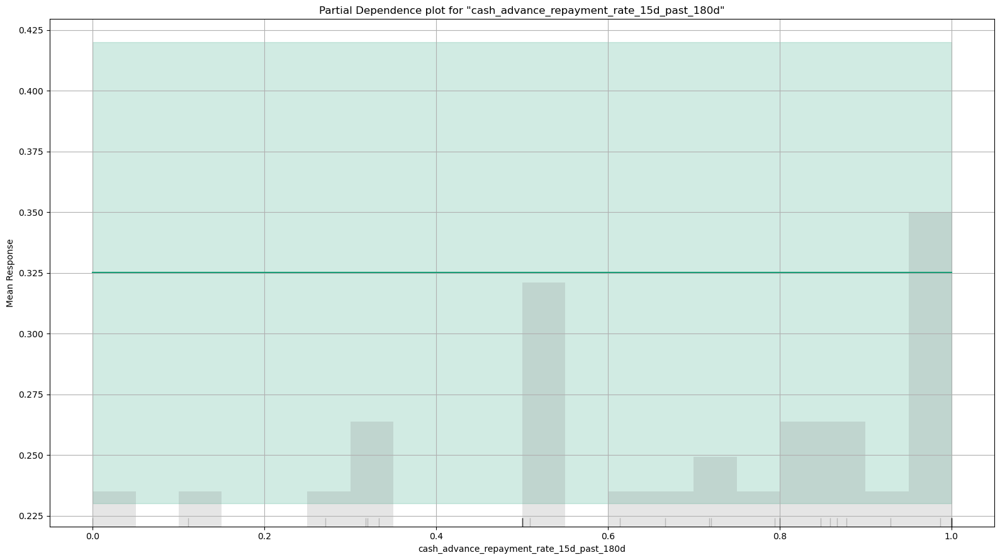
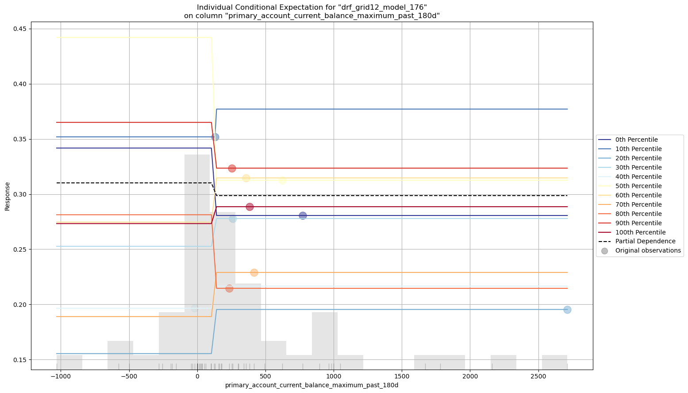
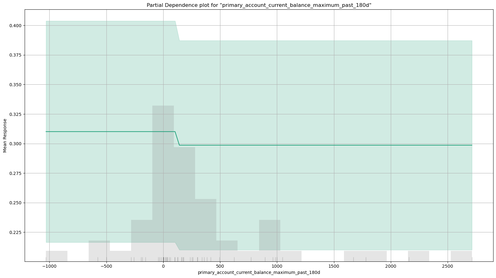
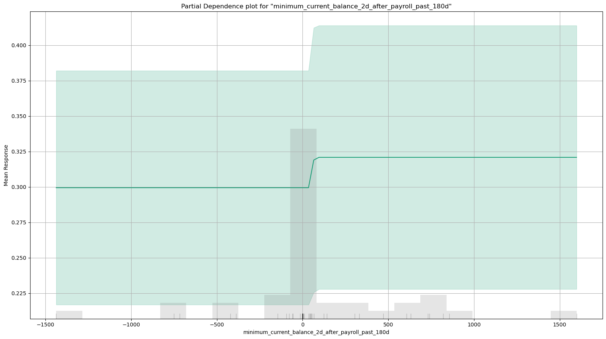
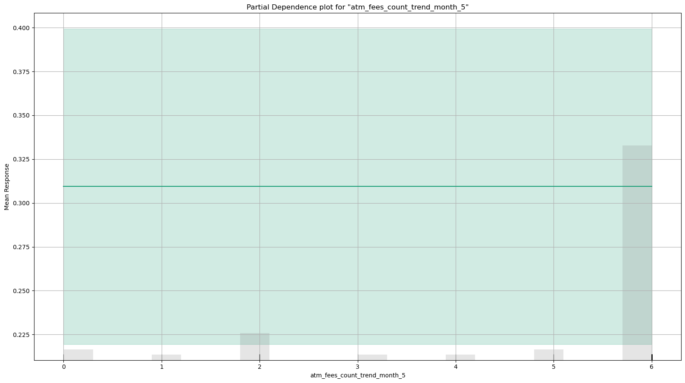
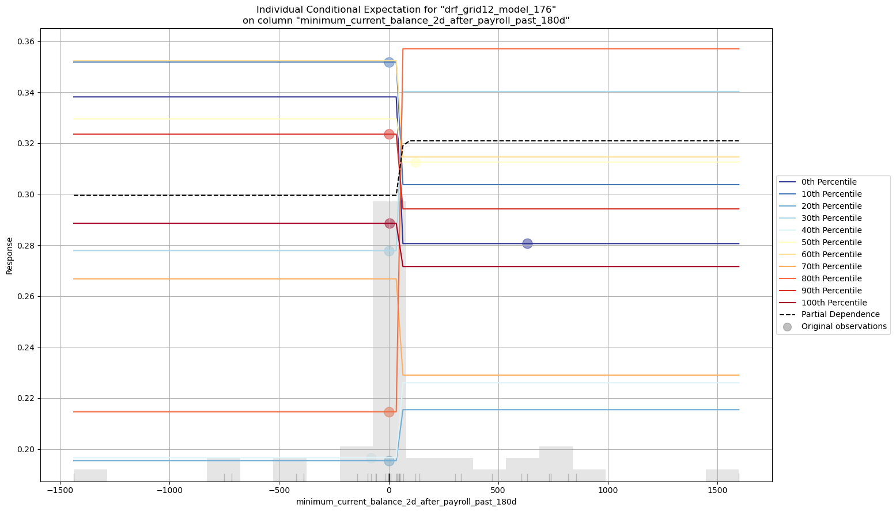
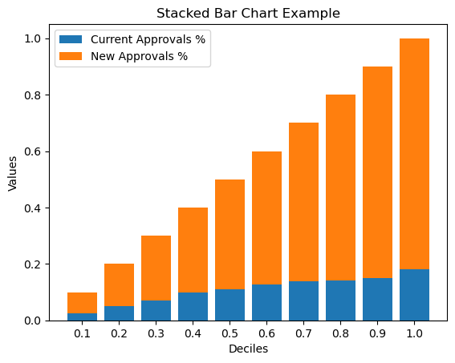
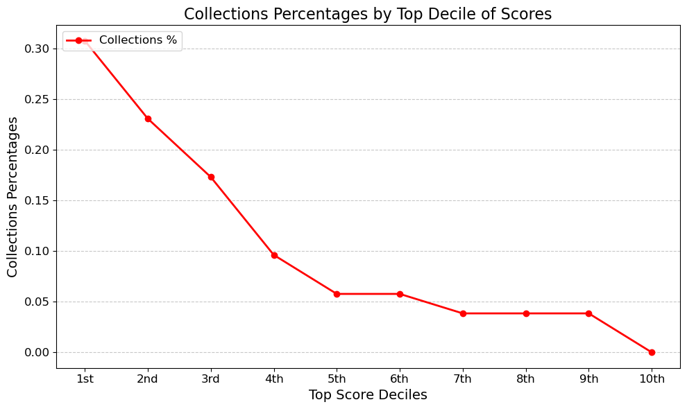

:::::::::::::::::::::::::::::::::::::::::::::::::::::::::::::::::::::::::::::::::::::::::::::::::::::::::::::::::::::::::::::::::::::::::::::::::::::::::::::::::::::::::::::::::::::::::::::::::::::::::::::::::::::::::::::::::::::::::::::::::::::::::::::::::::::::::: {#quarto-document-content .content role="main"}
::::::::::: {#title-block-header .quarto-title-block .default}
::: quarto-title
# Luis Testing Quarto {#luis-testing-quarto .title}
:::

::::::::: quarto-title-meta
<div>

::: quarto-title-meta-heading
Author
:::

::: quarto-title-meta-contents
Luis Sosa
:::

</div>

<div>

::: quarto-title-meta-heading
Published
:::

::: quarto-title-meta-contents
November 16, 2024
:::

</div>
:::::::::
:::::::::::

:::: {#e29a75f1-c23d-42c4-851d-38bdb9eb4b9b .cell}
Code

::: {#cb1 .sourceCode .cell-code}
``` {.sourceCode .python .code-with-copy}
import pandas as pd
import numpy as np
import os
from sklearn.ensemble import RandomForestClassifier, GradientBoostingClassifier
from sklearn.metrics import roc_auc_score, accuracy_score
from sklearn.utils.class_weight import compute_class_weight
from sklearn.model_selection import GridSearchCV, train_test_split, cross_val_score, StratifiedKFold, RandomizedSearchCV
from sklearn.datasets import make_classification
from sklearn.inspection import PartialDependenceDisplay
from xgboost import XGBClassifier


import shap
from catboost import CatBoostClassifier
import matplotlib.pyplot as plt
from joblib import dump, load

pd.set_option("display.max_columns", None)
pd.set_option("display.max_rows", None)
pd.options.display.float_format = "{:,.6}".format

# Run H2O later
import h2o
import pandoc
from h2o.estimators.glm import H2OGeneralizedLinearEstimator
from h2o.estimators.gbm import H2OGradientBoostingEstimator
from h2o.estimators import H2ORandomForestEstimator, H2ODecisionTreeEstimator
from h2o.grid.grid_search import H2OGridSearch
from h2o.estimators import H2OKMeansEstimator
from h2o.automl import H2OAutoML
h2o.init(max_mem_size = "10G") # need more memory
h2o.init() # need more memory
```
:::
::::

:::: {#ba4e9e1a-a1f4-48d5-aecd-aa45cbb85687 .cell execution_count="274"}
Code

::: {#cb2 .sourceCode .cell-code}
``` {.sourceCode .python .code-with-copy}
def firingRate(df):
    return 1-df.isna().sum(axis=0)/df.shape[0]

def uniqueCount(df):
    return df.nunique()

def uniqueRate(df):
    return df.nunique()/df.shape[0]

def firingRateDetailed(df):
    output = []
    firingRate = 1-df.isna().sum(axis=0)/df.shape[0]
    uniqueCount = df.nunique()
    uniqueRate = df.nunique()/df.shape[0]
    for i in df.columns:
        if df[i].dtypes == 'O':
            if df[i].nunique() <= 15:
                output.append(df[i].value_counts(dropna = False, normalize = True))
            else:
                output.append((i+': Categorical Column with '+ str(df[i].nunique()) + ' groups'))
        elif (df[i].dtypes in ['int8','int16','int32','int64','float32','float64']):
            output.append(df[i].describe())
        else:
            df[i] = df[i].astype(str)
            if df[i].nunique() <= 15:
                output.append(df[i].value_counts(dropna = False, normalize = True))
            else:
                output.append((i+': Categorical Column with '+ str(df[i].nunique()) + ' groups'))
    final = pd.DataFrame({'Column': df.columns,
                          'firingRate': firingRate,
                          'uniqueCount': uniqueCount,
                          'uniqueRate': uniqueRate,
                          'Detailed_Summary': output})   
    return(final)

def liftchart(actual, predicted_scores, loss_amount, nbins = 100):
    df = pd.DataFrame({"actual" : actual,"scores" : predicted_scores, "loss_amount": loss_amount})
    centile_bins = np.flip(np.array(range(nbins-1, -1, -1))/nbins )#+ np.array([0.1]*nbins)
    score_bins = np.flip(np.quantile(predicted_scores, centile_bins))
    sum_loss = df[df['actual'] == 1].loss_amount.sum()
    capture_count = []
    loss_total = []
    for i in score_bins:
        df_bin = df[df["scores"] >= i]
        capture_count.append(sum(df_bin["actual"]))
        loss_total.append(sum_loss - sum(df_bin[df_bin["actual"]==1]["loss_amount"]))
    output_df = pd.DataFrame({"centile_bins": np.array([1] * nbins) -  np.array(centile_bins + np.array([1/nbins]*nbins)),                           
                             "threshold":score_bins,
                             "number_of_defaults_present": capture_count})
    output_df['cumulative_running_total'] = np.array(capture_count) / sum(df_bin["actual"])
    output_df['default_rate_at_current_bin'] = np.array(capture_count) / len(df)
    #output_df['savings'] = loss_total
    return(output_df)

def compute_class_weights(y):
    # Calculate the class weights
    class_weights = compute_class_weight(
        class_weight="balanced", classes=np.unique(y), y=y
    )

    # Convert the result to a dictionary with class labels as keys
    class_weight_dict = dict(zip(np.unique(y), class_weights))

    # Create an array of the same length as y with the corresponding class weight for each element
    class_weights_array = np.array([class_weight_dict[label] for label in y])

    return class_weights_array
```
:::
::::

:::: {#8c93fc3d-c72e-443a-b92f-3d39692475b9 .cell execution_count="3"}
Code

::: {#cb3 .sourceCode .cell-code}
``` {.sourceCode .python .code-with-copy}
### h2o.shutdown() #in case you need to shut down
```
:::
::::

::::::::::::::::::::: {#read-results-file .section .level2}
## Read Results File {.anchored anchor-id="read-results-file"}

:::::: {#336b5080-4e7c-49ad-9d7f-923919bcb255 .cell execution_count="127"}
Code

::: {#cb4 .sourceCode .cell-code}
``` {.sourceCode .python .code-with-copy}
df = pd.read_csv("/Users/luis/Evaluations/Visible/3_Results/Visible_1169_Records_Scored_20241111.csv")
print(df.shape)
```
:::

::: {.cell-output .cell-output-stdout}
    (1169, 3442)
:::

::: {.cell-output .cell-output-stderr}
    /var/folders/z5/xxddnyr978bb97d94x1wj3780000gn/T/ipykernel_92556/3848255160.py:1: DtypeWarning: Columns (3430,3438) have mixed types. Specify dtype option on import or set low_memory=False.
      df = pd.read_csv("/Users/luis/Evaluations/Visible/3_Results/Visible_1169_Records_Scored_20241111.csv")
:::
::::::

:::::: {#e5043c5e-9ccf-4585-b61e-b61fe8b0d424 .cell execution_count="12"}
Code

::: {#cb7 .sourceCode .cell-code}
``` {.sourceCode .python .code-with-copy}
df.APPROVED.value_counts().to_frame()
```
:::

:::: {.cell-output .cell-output-display execution_count="12"}
<div>

             count
  ---------- -------
  APPROVED   
  False      958
  True       211

</div>
::::
::::::

:::::: {#f08741e8-0c3a-45d7-bd83-7c48b061bd9b .cell execution_count="14"}
Code

::: {#cb8 .sourceCode .cell-code}
``` {.sourceCode .python .code-with-copy}
df.APPROVED.value_counts(normalize = True).to_frame()
```
:::

:::: {.cell-output .cell-output-display execution_count="14"}
<div>

             proportion
  ---------- ------------
  APPROVED   
  False      0.819504
  True       0.180496

</div>
::::
::::::

:::::: {#d6e2e7c3-9908-42c9-b521-c7df5112be3d .cell execution_count="294"}
Code

::: {#cb9 .sourceCode .cell-code}
``` {.sourceCode .python .code-with-copy}
df.STATUS.value_counts().to_frame()
```
:::

:::: {.cell-output .cell-output-display execution_count="294"}
<div>

                       count
  -------------------- -------
  STATUS               
  PAID                 87
  SENT_TO_COLLECTION   48
  PAID_OVERDUE         30
  FINANCED             20
  OVERDUE              15
  DUE                  8
  COLLECTED            3

</div>
::::
::::::

:::: {#629fab40-5a6a-4500-a243-bcfdfdc21b75 .cell}
Code

::: {#cb10 .sourceCode .cell-code}
``` {.sourceCode .python .code-with-copy}
df.STATUS.value_counts().to_frame()
```
:::
::::
:::::::::::::::::::::

:::::::::::::::::::::::::::::::::::::: {#print-evaluation-metrics .section .level2}
## Print Evaluation Metrics {.anchored anchor-id="print-evaluation-metrics"}

::::::::::: {#strategy-1 .section .level3}
### Strategy 1 {.anchored anchor-id="strategy-1"}

:::: {#5bfeac9e-6bf0-4f32-af54-64b120524178 .cell execution_count="260"}
Code

::: {#cb11 .sourceCode .cell-code}
``` {.sourceCode .python .code-with-copy}
strategy1 = h2o.load_model('/Users/luis/Evaluations/Visible/2_Modeling/Strategy1v4_seed_191/GBM_grid_1_AutoML_1_20241111_235212_model_9')
```
:::
::::

::::: {#aacd7d50-1dc7-4247-8482-77ebcd986fb5 .cell execution_count="268"}
Code

::: {#cb12 .sourceCode .cell-code}
``` {.sourceCode .python .code-with-copy}
print("Strategy 1 Train AUC: " + str(strategy1.auc(train = True)))
```
:::

::: {.cell-output .cell-output-stdout}
    Strategy 1 Train AUC: 1.0
:::
:::::

::::: {#f97d66d2-d325-47e8-be23-582a1abd37c1 .cell execution_count="270"}
Code

::: {#cb14 .sourceCode .cell-code}
``` {.sourceCode .python .code-with-copy}
print("Strategy 1 Test AUC: " + str(strategy1.auc(valid = True)))
```
:::

::: {.cell-output .cell-output-stdout}
    Strategy 1 Test AUC: 0.7708333333333334
:::
:::::
:::::::::::

::::::::::::::::::::::: {#strategy-2 .section .level3}
### Strategy 2 {.anchored anchor-id="strategy-2"}

:::: {#7f1dcc18-99fe-4067-a34e-29b1eead1df8 .cell}
Code

::: {#cb16 .sourceCode .cell-code}
``` {.sourceCode .python .code-with-copy}
strategy2 = h2o.load_model('/Users/luis/Evaluations/Visible/2_Modeling/Strategy2v5_seed_191_oversampled_DRF/drf_grid12_model_176')
```
:::
::::

::::: {#683a908f-200c-4ada-aef0-0d6bb08ef3a9 .cell execution_count="304"}
Code

::: {#cb17 .sourceCode .cell-code}
``` {.sourceCode .python .code-with-copy}
strategy2_train = pd.read_csv("/Users/luis/Evaluations/Visible/3_Results/Strategy2_Results_file_Oversampled_20241111_drf_grid12_model_176.csv").rename(
    columns = {"Pave_Custom_Score": "Strategy2"})
```
:::

::: {.cell-output .cell-output-stderr}
    /var/folders/z5/xxddnyr978bb97d94x1wj3780000gn/T/ipykernel_58373/1856857068.py:1: DtypeWarning: Columns (0,2,3407,3433) have mixed types. Specify dtype option on import or set low_memory=False.
      strategy2_train = pd.read_csv("/Users/luis/Evaluations/Visible/3_Results/Strategy2_Results_file_Oversampled_20241111_drf_grid12_model_176.csv").rename(
:::
:::::

:::: {#61da338f-71e0-4963-9f9a-86707d82cad3 .cell execution_count="334"}
Code

::: {#cb19 .sourceCode .cell-code}
``` {.sourceCode .python .code-with-copy}
strategy2_train['label'] = strategy2_train['label'].astype(int)
```
:::
::::

::::: {#3071cee4-7f04-427f-b799-69f8484e1247 .cell execution_count="302"}
Code

::: {#cb20 .sourceCode .cell-code}
``` {.sourceCode .python .code-with-copy}
strategy2_train.columns[3430:3440]
```
:::

::: {.cell-output .cell-output-display execution_count="302"}
    Index(['client', 'ID', 'UNDERWRITING_DATE', 'APPROVED', 'AMOUNT', 'DUE_DATE',
           'STATUS', 'weights', 'dataset', 'Pave_Custom_Score'],
          dtype='object')
:::
:::::

::::: {#7b71bc37-ee15-4835-8cc4-023b2e7ba73f .cell execution_count="312"}
Code

::: {#cb22 .sourceCode .cell-code}
``` {.sourceCode .python .code-with-copy}
print("Strategy 2 Train AUC: " + str(strategy2.auc(train = True)))
```
:::

::: {.cell-output .cell-output-stdout}
    Strategy 2 Train AUC: 0.8472831549268215
:::
:::::

::::: {#760a514b-aa9e-4b18-8cd1-5fd687fd4b43 .cell execution_count="274"}
Code

::: {#cb24 .sourceCode .cell-code}
``` {.sourceCode .python .code-with-copy}
print("Strategy 2 Test AUC: " + str(strategy2.auc(valid = True)))
```
:::

::: {.cell-output .cell-output-stdout}
    Strategy 2 Test AUC: 0.7986111111111112
:::
:::::

:::::: {#f944dc6e-0a56-4cf9-9ba9-31fd742d4fa2 .cell execution_count="129"}
Code

::: {#cb26 .sourceCode .cell-code}
``` {.sourceCode .python .code-with-copy}
train = strategy2_train[strategy2_train['dataset'] == 'train']
print(train.shape) # test size
print(train.label.fillna("NA").value_counts()) # Label Counts
roc_auc_score(train.label, train.Strategy2) # AUC Performance
```
:::

::: {.cell-output .cell-output-stdout}
    (3272, 3440)
    label
    0    2559
    1     713
    Name: count, dtype: int64
:::

::: {.cell-output .cell-output-display execution_count="129"}
    0.8909267239843754
:::
::::::
:::::::::::::::::::::::

::::::: {#test-auc-confirmed-in-scoring-roc_auc_score-sklearn-function .section .level3}
### Test AUC confirmed in scoring roc_auc_score (sklearn function) {.anchored anchor-id="test-auc-confirmed-in-scoring-roc_auc_score-sklearn-function"}

:::::: {#89645e45-d6f5-4f3e-b4ef-299ed8b269a1 .cell execution_count="131"}
Code

::: {#cb29 .sourceCode .cell-code}
``` {.sourceCode .python .code-with-copy}
test = df[df['dataset'] == 'test']
print(test.shape) # test size
print(test.label.fillna("NA").value_counts()) # Label Counts
roc_auc_score(test.label, test.Strategy2) # AUC Performance
```
:::

::: {.cell-output .cell-output-stdout}
    (52, 3442)
    label
    0    36
    1    16
    Name: count, dtype: int64
:::

::: {.cell-output .cell-output-display execution_count="131"}
    0.798611111111111
:::
::::::
:::::::
::::::::::::::::::::::::::::::::::::::

:::::::::::::::::::::: {#lift-chart-on-test-dataset-we-will-use-this-to-observe-the-default-rates-in-top-deciles .section .level2}
## Lift Chart on Test Dataset (we will use this to observe the default rates in top deciles) {.anchored anchor-id="lift-chart-on-test-dataset-we-will-use-this-to-observe-the-default-rates-in-top-deciles"}

:::: {#a13d11ae-49e8-4a79-9f8f-ee5e7673b780 .cell execution_count="133"}
Code

::: {#cb32 .sourceCode .cell-code}
``` {.sourceCode .python .code-with-copy}
## Adjustment so the higher the score, the better the applicant
df['Strategy2_Adj'] = df['Strategy2'].apply(lambda t: 1-float(t)) 
df['loss'] = df['AMOUNT'] ## We will use the CREDIT_AMOUNT as a loss amount (in case of COLLECTIONS)
```
:::
::::

:::::::::: {#top-scoring-bins-and-savings-on-test-dataset-52-records .section .level3}
### Top Scoring bins and savings on Test Dataset (52 records) {.anchored anchor-id="top-scoring-bins-and-savings-on-test-dataset-52-records"}

:::: {#d3358bb2-acc6-4547-bc5d-9af58ea8010d .cell scrolled="true"}
Code

::: {#cb33 .sourceCode .cell-code}
``` {.sourceCode .python .code-with-copy}
test = df[df['dataset'] == 'test']
print(test.shape)
print(test.label.fillna("NA").value_counts())

lc2_test = liftchart(test['label'], test['Strategy2_Adj'], test['loss'], nbins = 100)
lc2_test
```
:::
::::

::::::: {#5a7f41f1-2613-430a-8de6-d5061e33b311 .cell execution_count="266"}
Code

::: {#cb34 .sourceCode .cell-code}
``` {.sourceCode .python .code-with-copy}
test = df[df['dataset'] == 'test']
print(test.shape)
print(test.label.fillna("NA").value_counts())

lc2_test = liftchart(test['label'], test['Strategy2_Adj'], test['loss'], nbins = 10)
lc2_test
```
:::

::: {.cell-output .cell-output-stdout}
    (52, 3444)
    label
    0    36
    1    16
    Name: count, dtype: int64
:::

:::: {.cell-output .cell-output-display execution_count="266"}
<div>

      centile_bins   threshold   number_of_defaults_present   cumulative_running_total   default_rate_at_current_bin
  --- -------------- ----------- ---------------------------- -------------------------- -----------------------------
  0   0.9            0.865685    0                            0.0                        0.0
  1   0.8            0.837012    2                            0.125                      0.0384615
  2   0.7            0.796041    2                            0.125                      0.0384615
  3   0.6            0.781759    2                            0.125                      0.0384615
  4   0.5            0.727344    3                            0.1875                     0.0576923
  5   0.4            0.715786    3                            0.1875                     0.0576923
  6   0.3            0.661514    5                            0.3125                     0.0961538
  7   0.2            0.611454    9                            0.5625                     0.173077
  8   0.1            0.545787    12                           0.75                       0.230769
  9   0.0            0.398259    16                           1.0                        0.307692

</div>
::::
:::::::
::::::::::

:::::::: {#top-scoring-bins-and-savings-on-approved-records-only .section .level3}
### Top Scoring bins and savings on Approved Records Only {.anchored anchor-id="top-scoring-bins-and-savings-on-approved-records-only"}

::::: {#d66ffb25-51dc-44d3-8e04-6515252e8c8a .cell execution_count="137"}
Code

::: {#cb36 .sourceCode .cell-code}
``` {.sourceCode .python .code-with-copy}
df.STATUS.unique()
```
:::

::: {.cell-output .cell-output-display execution_count="137"}
    array(['PAID', 'COLLECTED', 'PAID_OVERDUE', 'SENT_TO_COLLECTION', nan,
           'OVERDUE', 'FINANCED', 'DUE'], dtype=object)
:::
:::::

:::: {#7b3d8b3d-4764-4315-8d8b-8b964a56cbbe .cell scrolled="true"}
Code

::: {#cb38 .sourceCode .cell-code}
``` {.sourceCode .python .code-with-copy}
dfa = df[df['APPROVED'] == True ]
print(dfa.shape)
print(dfa.label.fillna("NA").value_counts())

lc2_approvals = liftchart(dfa['label'], dfa['Strategy2_Adj'], dfa['loss'], nbins = 100)
lc2_approvals
#lc2_approvals.sort_values("threshold", ascending = True)
```
:::
::::
::::::::

::::: {#top-scoring-bins-and-savings-on-all-records-including-declines .section .level3}
### Top Scoring bins and savings on All Records (including declines) {.anchored anchor-id="top-scoring-bins-and-savings-on-all-records-including-declines"}

:::: {#dc38411a-481b-4c7e-aa87-632b40462bf9 .cell scrolled="true"}
Code

::: {#cb39 .sourceCode .cell-code}
``` {.sourceCode .python .code-with-copy}
print(df.shape)
print(df.label.fillna("NA").value_counts())

lc2_overall= liftchart(df['label'], df['Strategy2_Adj'], df['loss'], nbins = 100)
lc2_overall
#lc2_overall.sort_values("centile_bins")
```
:::
::::
:::::
::::::::::::::::::::::

:::::::::::::: {#compute-new-approval-rates .section .level2}
## Compute new Approval Rates {.anchored anchor-id="compute-new-approval-rates"}

:::: {#21001143-2f64-4a38-bbc2-38eb0d70374e .cell execution_count="294"}
Code

::: {#cb40 .sourceCode .cell-code}
``` {.sourceCode .python .code-with-copy}
thresholds_lc2 = lc2_overall['threshold'].tolist() # Use thresholds for overal dataset (including declines)
```
:::
::::

:::: {#7607bf99-da05-460c-b8ed-3070c6007976 .cell}
Code

::: {#cb41 .sourceCode .cell-code}
``` {.sourceCode .python .code-with-copy}
declined_df = df[df["APPROVED"] == False]
approved_df = df[(df["APPROVED"] == True)]

new_approvals_list = []
#new_approvals_income_list = []
existing_approvals_list = []


for i in thresholds_lc2:
    new_approvals = len(
        declined_df[declined_df["Strategy2_Adj"] >= i]
    )
    new_approvals_list.append(new_approvals)
  #  new_approvals_income = len(
  #      declined_income_df[declined_income_df["pave_custom_score"] >= i]
  #  )
  #  new_approvals_income_list.append(new_approvals_income)
    
    existing_approvals = len(
        approved_df[approved_df["Strategy2_Adj"] >= i]
    )
    existing_approvals_list.append(existing_approvals)
    print(
        f"{i}: | new approvals: {new_approvals} | existing approvals: {existing_approvals}"
    )
```
:::
::::

:::: {#2ee5cb26-f3ec-4920-b958-662eea30daf2 .cell execution_count="298"}
Code

::: {#cb42 .sourceCode .cell-code}
``` {.sourceCode .python .code-with-copy}
new_and_existing_approvals = pd.DataFrame({"centile_bins": lc2_approvals['centile_bins'].tolist(),
                            "threshold": thresholds_lc2,
                            "new_approvals - scores above threshold": new_approvals_list,
                              "existing_approvals": existing_approvals_list})
new_and_existing_approvals['Total_Approvals'] = np.array(new_and_existing_approvals['new_approvals - scores above threshold']) \
                                                + np.array(new_and_existing_approvals['existing_approvals'])
```
:::
::::

:::: {#893c9e60-8e6e-4ad0-87f6-82a03709e3ec .cell scrolled="true"}
Code

::: {#cb43 .sourceCode .cell-code}
``` {.sourceCode .python .code-with-copy}
lc2_final = pd.merge(lc2_test[['centile_bins',
                                    'default_rate_at_current_bin']],
                     new_and_existing_approvals[['centile_bins', 
                                    'new_approvals - scores above threshold',
                                    'existing_approvals']], how = 'inner', on = 'centile_bins')
lc2_final
```
:::
::::

::::: {#compute-margin-of-error-of-default-rates-using-standard-error .section .level3}
### Compute Margin of Error of Default Rates using Standard Error {.anchored anchor-id="compute-margin-of-error-of-default-rates-using-standard-error"}

:::: {#3cf82db6-376d-4b7c-9ac4-b1b17a1a776d .cell scrolled="true"}
Code

::: {#cb44 .sourceCode .cell-code}
``` {.sourceCode .python .code-with-copy}
print("Size of Test Data: " + str(len(test)))
t_star = 2.009 # 51 degrees od freedom
print("t* with 51 (n-1) degrees of freedom: " + str(t_star))

lower_p_hat_list = []
upper_p_hat_list = []
for i in lc2_final.default_rate_at_current_bin.tolist():
    lower_p_hat_list.append(i - (t_star * (np.sqrt(((i) * (1-i))/len(test)))))
    upper_p_hat_list.append(i + (t_star * (np.sqrt(((i) * (1-i))/len(test)))))

lc2_final['95% CI LowerBound_Default_Rate'] = lower_p_hat_list
lc2_final['95% CI UpperBound_Default_Rate'] = upper_p_hat_list

lc2_final['95% CI LowerBound_Default_Rate'] = np.where(lc2_final['95% CI LowerBound_Default_Rate'] <= \
                                                       lc2_final['default_rate_at_current_bin'], lc2_final['default_rate_at_current_bin'],
                                                       lc2_final['95% CI LowerBound_Default_Rate'])


lc2_final['95% CI UpperBound_Default_Rate'] = np.where(lc2_final['95% CI UpperBound_Default_Rate'] >= \
                                                       0.307692 , 0.307692,
                                                       lc2_final['95% CI UpperBound_Default_Rate'])

lc2_final = lc2_final[['centile_bins', '95% CI LowerBound_Default_Rate','95% CI UpperBound_Default_Rate',
       'new_approvals - scores above threshold', 'existing_approvals']]

lc2_final['Total Approvals'] = np.array(lc2_final['new_approvals - scores above threshold']) +\
                                np.array(lc2_final['existing_approvals'])

lc2_final['Approval Rate at Top Decile'] = np.array(lc2_final['existing_approvals']) /\
                                np.array([1169] * len(lc2_final))


lc2_final
```
:::
::::
:::::
::::::::::::::

:::::::::::::::::::::::::::::::::::::::::::::::::::::::::::::::::::::::::::::::::::::::::::::::::::::::::::::::::::::::::::::: {#takeaways .section .level2}
## Takeaways: {.anchored anchor-id="takeaways"}

-   Visible's current approval rate is 18.0%

-   Their default rate is 30.3% (when you exclude "Overdue, Due, and
    Financed".

-   Using our model, if we were to approve the top 40% of applicants in
    the top of the funnel, we would be able to lower the default capture
    rate from 30.3% to 10.7% (using a 95% Margin of Error).

-   Using this threshold will also increase your current approval rate
    by 22% (from 18% to 40%).

:::::: {#6ef66db4-a4ea-4c84-9592-deceb3eb2580 .cell execution_count="26"}
Code

::: {#cb45 .sourceCode .cell-code}
``` {.sourceCode .python .code-with-copy}
strategy2_train = pd.read_csv("/Users/luis/Evaluations/Visible/3_Results/Strategy2_Results_file_Oversampled_20241111_drf_grid12_model_176.csv").rename(
    columns = {"Pave_Custom_Score": "Strategy2"})
test = strategy2_train[strategy2_train['dataset'] == 'test']
print(len(test))
```
:::

::: {.cell-output .cell-output-stdout}
    52
:::

::: {.cell-output .cell-output-stderr}
    /var/folders/z5/xxddnyr978bb97d94x1wj3780000gn/T/ipykernel_92556/502720196.py:1: DtypeWarning: Columns (0,2,3407,3433) have mixed types. Specify dtype option on import or set low_memory=False.
      strategy2_train = pd.read_csv("/Users/luis/Evaluations/Visible/3_Results/Strategy2_Results_file_Oversampled_20241111_drf_grid12_model_176.csv").rename(
:::
::::::

:::: {#05738880-b2e2-4e9c-9bae-82bd20e9241f .cell execution_count="18"}
Code

::: {#cb48 .sourceCode .cell-code}
``` {.sourceCode .python .code-with-copy}
strategy2 = h2o.load_model('/Users/luis/Evaluations/Visible/2_Modeling/Strategy2v5_seed_191_oversampled_DRF/drf_grid12_model_176')
```
:::
::::

:::::: {#665f5f79-c90a-488d-ad05-216437dedb7a .cell execution_count="53"}
Code

::: {#cb49 .sourceCode .cell-code}
``` {.sourceCode .python .code-with-copy}
varimp_pd = strategy2.varimp(use_pandas = True)
varimp_pd.to_csv("/Users/luis/Evaluations/Visible/2_Modeling/Variable_Importance_drf_grid12_model_176.csv", index = False)
varimp_pd.head()
```
:::

:::: {.cell-output .cell-output-display execution_count="53"}
<div>

      variable                                              relative_importance   scaled_importance   percentage
  --- ----------------------------------------------------- --------------------- ------------------- ------------
  0   primary_account_current_balance_maximum_past_180d     83.6137               1.0                 0.0714135
  1   primary_account_current_balance_average_past_30d      53.5737               0.640729            0.0457567
  2   primary_account_history_days                          48.5071               0.580134            0.0414294
  3   minimum_current_balance_2d_after_payroll_past\_\...   45.0793               0.539138            0.0385017
  4   atm_fees_count_trend_month_5                          44.5181               0.532426            0.0380224

</div>
::::
::::::

::::: {#3a2a8e33-b37e-4b28-8e30-4dcddc66b079 .cell execution_count="113"}
Code

::: {#cb50 .sourceCode .cell-code}
``` {.sourceCode .python .code-with-copy}
test_h2o = h2o.H2OFrame(test[varimp_pd.variable.tolist()+['label']])
```
:::

::: {.cell-output .cell-output-stdout}
    Parse progress: |████████████████████████████████████████████████████████████████| (done) 100%
:::
:::::

:::: {#917aabe4-c76f-430e-befe-061e4bef6c28 .cell execution_count="115"}
Code

::: {#cb52 .sourceCode .cell-code}
``` {.sourceCode .python .code-with-copy}
# Fix Column Types in h2o
# If column enum has "9 or more" values, turn numeric (to prevent high cardinality in categorical)
for i in test_h2o.columns:
    if (test_h2o.types[i] == "enum"):
        if len(test_h2o[i].levels()[0]) >= 5:
            test_h2o[i] = test_h2o[i].asnumeric()
            
    #elif df_h2o.types[i] == "int":
    #    df_h2o[i] = df_h2o[i].asnumeric()
        
#df_h2o.types
```
:::
::::

:::::::::::::::::::::::::::::::::::::::::::::::::::::::::::::::::::::::::::::::::::::::::::: {#5427818d-45dc-431e-ac66-49866b7c9484 .cell scrolled="true" execution_count="116"}
Code

::: {#cb53 .sourceCode .cell-code}
``` {.sourceCode .python .code-with-copy}
test_h2o["balances_double_digit_days_percent_past_60d"] = test_h2o["balances_double_digit_days_percent_past_60d"].asnumeric().ascharacter().asfactor()
test_h2o["balances_negative_days_percent_past_30d"] = test_h2o["balances_negative_days_percent_past_30d"].asnumeric().ascharacter().asfactor()
test_h2o["balances_single_digit_days_percent_past_30d"] = test_h2o["balances_single_digit_days_percent_past_30d"].asnumeric().ascharacter().asfactor()
test_h2o["cash_advance_amount_trend_month_6"] = test_h2o["cash_advance_amount_trend_month_6"].asnumeric()
test_h2o["insurance_providers_count_trend_month_4"] = test_h2o["insurance_providers_count_trend_month_4"].asnumeric()
test_h2o["investments_count_trend_month_6"] = test_h2o["investments_count_trend_month_6"].asnumeric()
test_h2o["reversed_loan_payment_amount_trend_month_3"] = test_h2o["reversed_loan_payment_amount_trend_month_3"].asnumeric()


h2o.explain(strategy2, test_h2o, columns = ['primary_account_current_balance_maximum_past_180d',
                                                             'primary_account_current_balance_average_past_30d',
                                                             'primary_account_history_days',
                                       'minimum_current_balance_2d_after_payroll_past_180d',
                                       'atm_fees_count_trend_month_5',
                                       'cash_advance_repayment_rate_15d_past_180d'],
           include_explanations = ['confusion_matrix',
                                   'varimp',
                                   'pdp',
                                  'varimp_heatmap',
                                  'shap_summary',
                                  'ice','model_correlation_heatmap'])
```
:::

::: {.cell-output .cell-output-display}
# Variable Importance
:::

::: {.cell-output .cell-output-display}
> The variable importance plot shows the relative importance of the most
> important variables in the model.
:::

:::: {.cell-output .cell-output-display}
<div>

<figure class="figure">
<p></p>
</figure>

</div>
::::

::: {.cell-output .cell-output-stdout}
:::

::: {.cell-output .cell-output-display}
# SHAP Summary
:::

::: {.cell-output .cell-output-display}
> SHAP summary plot shows the contribution of the features for each
> instance (row of data). The sum of the feature contributions and the
> bias term is equal to the raw prediction of the model, i.e.,
> prediction before applying inverse link function.
:::

:::: {.cell-output .cell-output-display}
<div>

<figure class="figure">
<p></p>
</figure>

</div>
::::

::: {.cell-output .cell-output-stdout}
:::

::: {.cell-output .cell-output-display}
# Partial Dependence Plots
:::

::: {.cell-output .cell-output-display}
> Partial dependence plot (PDP) gives a graphical depiction of the
> marginal effect of a variable on the response. The effect of a
> variable is measured in change in the mean response. PDP assumes
> independence between the feature for which is the PDP computed and the
> rest.
:::

:::: {.cell-output .cell-output-display}
<div>

<figure class="figure">
<p></p>
</figure>

</div>
::::

::: {.cell-output .cell-output-stdout}
:::

:::: {.cell-output .cell-output-display}
<div>

<figure class="figure">
<p></p>
</figure>

</div>
::::

::: {.cell-output .cell-output-stdout}
:::

:::: {.cell-output .cell-output-display}
<div>

<figure class="figure">
<p></p>
</figure>

</div>
::::

::: {.cell-output .cell-output-stdout}
:::

:::: {.cell-output .cell-output-display}
<div>

<figure class="figure">
<p></p>
</figure>

</div>
::::

::: {.cell-output .cell-output-stdout}
:::

:::: {.cell-output .cell-output-display}
<div>

<figure class="figure">
<p></p>
</figure>

</div>
::::

::: {.cell-output .cell-output-stdout}
:::

:::: {.cell-output .cell-output-display}
<div>

<figure class="figure">
<p></p>
</figure>

</div>
::::

::: {.cell-output .cell-output-stdout}
:::

::: {.cell-output .cell-output-display}
# Individual Conditional Expectation
:::

::: {.cell-output .cell-output-display}
> An Individual Conditional Expectation (ICE) plot gives a graphical
> depiction of the marginal effect of a variable on the response. ICE
> plots are similar to partial dependence plots (PDP); PDP shows the
> average effect of a feature while ICE plot shows the effect for a
> single instance. This function will plot the effect for each decile.
> In contrast to the PDP, ICE plots can provide more insight, especially
> when there is stronger feature interaction.
:::

:::: {.cell-output .cell-output-display}
<div>

<figure class="figure">
<p></p>
</figure>

</div>
::::

::: {.cell-output .cell-output-stdout}
:::

:::: {.cell-output .cell-output-display}
<div>

<figure class="figure">
<p></p>
</figure>

</div>
::::

::: {.cell-output .cell-output-stdout}
:::

:::: {.cell-output .cell-output-display}
<div>

<figure class="figure">
<p></p>
</figure>

</div>
::::

::: {.cell-output .cell-output-stdout}
:::

::: {.cell-output .cell-output-stderr}
    /opt/anaconda3/lib/python3.12/site-packages/h2o/explanation/_explain.py:1728: UserWarning: Original observation of "minimum_current_balance_2d_after_payroll_past_180d" for 60th Percentile is [nan, 0.3146189205348492]. Plotting of NAs is not yet supported.
      warnings.warn(msg)
    /opt/anaconda3/lib/python3.12/site-packages/h2o/explanation/_explain.py:1728: UserWarning: Original observation of "minimum_current_balance_2d_after_payroll_past_180d" for 70th Percentile is [nan, 0.2289852313697338]. Plotting of NAs is not yet supported.
      warnings.warn(msg)
:::

:::: {.cell-output .cell-output-display}
<div>

<figure class="figure">
<p></p>
</figure>

</div>
::::

::: {.cell-output .cell-output-stdout}
:::

:::: {.cell-output .cell-output-display}
<div>

<figure class="figure">
<p></p>
</figure>

</div>
::::

::: {.cell-output .cell-output-stdout}
:::

::: {.cell-output .cell-output-stderr}
    /opt/anaconda3/lib/python3.12/site-packages/h2o/explanation/_explain.py:1728: UserWarning: Original observation of "cash_advance_repayment_rate_15d_past_180d" for 0th Percentile is [nan, 0.2805991642177105]. Plotting of NAs is not yet supported.
      warnings.warn(msg)
    /opt/anaconda3/lib/python3.12/site-packages/h2o/explanation/_explain.py:1728: UserWarning: Original observation of "cash_advance_repayment_rate_15d_past_180d" for 10th Percentile is [nan, 0.3518538445234298]. Plotting of NAs is not yet supported.
      warnings.warn(msg)
    /opt/anaconda3/lib/python3.12/site-packages/h2o/explanation/_explain.py:1728: UserWarning: Original observation of "cash_advance_repayment_rate_15d_past_180d" for 50th Percentile is [nan, 0.31258414983749394]. Plotting of NAs is not yet supported.
      warnings.warn(msg)
    /opt/anaconda3/lib/python3.12/site-packages/h2o/explanation/_explain.py:1728: UserWarning: Original observation of "cash_advance_repayment_rate_15d_past_180d" for 70th Percentile is [nan, 0.2289852313697338]. Plotting of NAs is not yet supported.
      warnings.warn(msg)
:::

:::: {.cell-output .cell-output-display}
<div>

<figure class="figure">
<p></p>
</figure>

</div>
::::

::: {.cell-output .cell-output-stdout}
:::

::: {.cell-output .cell-output-display}
# Variable Importance
:::

::: {.cell-output .cell-output-display}
> The variable importance plot shows the relative importance of the most
> important variables in the model.
:::

:::: {.cell-output .cell-output-display}
<div>

<figure class="figure">
<p></p>
</figure>

</div>
::::

::: {.cell-output .cell-output-display}
# SHAP Summary
:::

::: {.cell-output .cell-output-display}
> SHAP summary plot shows the contribution of the features for each
> instance (row of data). The sum of the feature contributions and the
> bias term is equal to the raw prediction of the model, i.e.,
> prediction before applying inverse link function.
:::

:::: {.cell-output .cell-output-display}
<div>

<figure class="figure">
<p></p>
</figure>

</div>
::::

::: {.cell-output .cell-output-display}
# Partial Dependence Plots
:::

::: {.cell-output .cell-output-display}
> Partial dependence plot (PDP) gives a graphical depiction of the
> marginal effect of a variable on the response. The effect of a
> variable is measured in change in the mean response. PDP assumes
> independence between the feature for which is the PDP computed and the
> rest.
:::

:::: {.cell-output .cell-output-display}
<div>

<figure class="figure">
<p></p>
</figure>

</div>
::::

:::: {.cell-output .cell-output-display}
<div>

<figure class="figure">
<p></p>
</figure>

</div>
::::

:::: {.cell-output .cell-output-display}
<div>

<figure class="figure">
<p></p>
</figure>

</div>
::::

:::: {.cell-output .cell-output-display}
<div>

<figure class="figure">
<p></p>
</figure>

</div>
::::

:::: {.cell-output .cell-output-display}
<div>

<figure class="figure">
<p></p>
</figure>

</div>
::::

:::: {.cell-output .cell-output-display}
<div>

<figure class="figure">
<p></p>
</figure>

</div>
::::

::: {.cell-output .cell-output-display}
# Individual Conditional Expectation
:::

::: {.cell-output .cell-output-display}
> An Individual Conditional Expectation (ICE) plot gives a graphical
> depiction of the marginal effect of a variable on the response. ICE
> plots are similar to partial dependence plots (PDP); PDP shows the
> average effect of a feature while ICE plot shows the effect for a
> single instance. This function will plot the effect for each decile.
> In contrast to the PDP, ICE plots can provide more insight, especially
> when there is stronger feature interaction.
:::

:::: {.cell-output .cell-output-display}
<div>

<figure class="figure">
<p></p>
</figure>

</div>
::::

:::: {.cell-output .cell-output-display}
<div>

<figure class="figure">
<p></p>
</figure>

</div>
::::

:::: {.cell-output .cell-output-display}
<div>

<figure class="figure">
<p></p>
</figure>

</div>
::::

:::: {.cell-output .cell-output-display}
<div>

<figure class="figure">
<p></p>
</figure>

</div>
::::

:::: {.cell-output .cell-output-display}
<div>

<figure class="figure">
<p></p>
</figure>

</div>
::::

:::: {.cell-output .cell-output-display}
<div>

<figure class="figure">
<p></p>
</figure>

</div>
::::
::::::::::::::::::::::::::::::::::::::::::::::::::::::::::::::::::::::::::::::::::::::::::::

:::::: {#9e5744b8-9f57-4bfb-af4f-15efddf9219a .cell execution_count="190"}
Code

::: {#cb70 .sourceCode .cell-code}
``` {.sourceCode .python .code-with-copy}
import matplotlib.pyplot as plt
import numpy as np

# Sample data
categories = ['0.1', '0.2', '0.3', '0.4', '0.5',
             '0.6', '0.7', '0.8', '0.9', '1.0']


values1 = [0.026,
0.049,
0.070,
0.099,
0.111,
0.126,
0.137,
0.141,
0.150,
0.180]

values2 = [0.074,
0.151,
0.230,
0.301,
0.389,
0.474,
0.565,
0.660,
0.750,
0.820]


# Set the positions
x = np.arange(len(categories))  # The label locations

# Plotting the stacked bars
plt.bar(x, values1, label='Current Approvals %')
plt.bar(x, values2, bottom=values1, label='New Approvals %')  # Stack values2 on top of values1

# Adding labels and title
plt.xlabel('Deciles')
plt.ylabel('Values')
plt.title('Stacked Bar Chart Example')
plt.xticks(x, categories)  # Set the x-axis labels

# Adding legend
plt.legend()

# Show the plot
plt.show()
```
:::

:::: {.cell-output .cell-output-display}
<div>

<figure class="figure">
<p></p>
</figure>

</div>
::::
::::::

:::: {#a412016a-e1ac-4055-b77c-9c2d07616cd8 .cell}
Code

::: {#cb71 .sourceCode .cell-code}
``` {.sourceCode .python .code-with-copy}
values3 = [0.0,
0.0384615,
0.0384615,
0.0384615,
0.0576923,
0.0576923,
0.0961538,
0.173077,
0.230769,
0.307692]
```
:::
::::

:::::: {#6fb7a14d-bc10-4a73-a549-e5d367b85faf .cell execution_count="236"}
Code

::: {#cb72 .sourceCode .cell-code}
``` {.sourceCode .python .code-with-copy}
import matplotlib.pyplot as plt
import numpy as np

# Updated sample data for categories and values
categories = ['1st', '2nd', '3rd', '4th', '5th', '6th', '7th', '8th', '9th', '10th']
values1 = np.flip([0.026, 0.049, 0.070, 0.099, 0.111, 0.126, 0.137, 0.141, 0.150, 0.180])
values2 = np.flip([0.074, 0.151, 0.230, 0.301, 0.389, 0.474, 0.565, 0.660, 0.750, 0.820])
values3 = np.flip([0.0, 0.0384615, 0.0384615, 0.0384615, 0.0576923, 0.0576923, 0.0961538, 0.173077, 0.230769, 0.307692])

# Set the positions
x = np.arange(len(categories))  # The label locations
bar_width = 0.6

# Plotting the stacked bars with custom colors
plt.figure(figsize=(10,7))
bars1 = plt.bar(x, values1, color="#4682B4", width=bar_width, label='Current Approvals %')  # Blue color
bars2 = plt.bar(x, values2, bottom=values1, color="#4CAF50", width=bar_width, label='New Approvals %')  # Green color
bars3 = plt.bar(x, values3, bottom=np.add(values1, values2), color="#FF0000", width=bar_width, label='Collections %')  # Red color

# Adding labels and title with custom fonts
plt.xlabel('Top Score Deciles', fontsize=14, labelpad=10)
plt.ylabel('Approval Percentages', fontsize=14, labelpad=10)
plt.title('Approval Percentages by Top Decile of Scores (Current vs New vs Collections)', fontsize=16, pad=15)

# Customize x-axis ticks and grid
plt.xticks(x, categories, fontsize=12)
plt.yticks(fontsize=12)
plt.grid(axis='y', linestyle='--', alpha=0.7)

# Adding legend with custom location and fontsize
plt.legend(loc='upper right', fontsize=12)

# Adding percentage labels to each bar segment, excluding the 1st decile for Collections %
for i in range(len(categories)):
    # Current Approvals %
    plt.text(x[i], values1[i] / 2, f"{values1[i]:.1%}", ha='center', va='center', color="white", fontsize=10)
    # New Approvals %
    plt.text(x[i], values1[i] + values2[i] / 2, f"{values2[i]:.1%}", ha='center', va='center', color="white", fontsize=10)
    # Additional Approvals % - only add label if not the first decile
    if i != 9:
        plt.text(x[i], values1[i] + values2[i] + values3[i] / 2, f"{values3[i]:.1%}", ha='center', va='center', color="white", fontsize=10)

# Show the plot
plt.tight_layout()  # Adjusts layout for better spacing
plt.show()
```
:::

:::: {.cell-output .cell-output-display}
<div>

<figure class="figure">
<p></p>
</figure>

</div>
::::
::::::

:::::: {#05be6abc-07ab-4379-b7ca-71b90d1e9faf .cell execution_count="238"}
Code

::: {#cb73 .sourceCode .cell-code}
``` {.sourceCode .python .code-with-copy}
import matplotlib.pyplot as plt
import numpy as np

# Updated sample data for categories and collections values
categories = ['1st', '2nd', '3rd', '4th', '5th', '6th', '7th', '8th', '9th', '10th']
values3 = np.flip([0.0, 0.0384615, 0.0384615, 0.0384615, 0.0576923, 0.0576923, 0.0961538, 0.173077, 0.230769, 0.307692])

# Set up the line plot
plt.figure(figsize=(10, 6))
plt.plot(categories, values3, color="#FF0000", marker='o', linestyle='-', linewidth=2, markersize=6, label='Collections %')  # Red color for collections

# Adding labels and title with custom fonts
plt.xlabel('Top Score Deciles', fontsize=14)
plt.ylabel('Collections Percentages', fontsize=14)
plt.title('Collections Percentages by Top Decile of Scores', fontsize=16)

# Customize x-axis and y-axis ticks and grid
plt.xticks(fontsize=12)
plt.yticks(fontsize=12)
plt.grid(axis='y', linestyle='--', alpha=0.7)

# Adding legend
plt.legend(loc='upper left', fontsize=12)

# Show the plot
plt.tight_layout()
plt.show()
```
:::

:::: {.cell-output .cell-output-display}
<div>

<figure class="figure">
<p></p>
</figure>

</div>
::::
::::::

:::::: {#8202a5b1-54ee-4f2f-a5e1-c1f6e9d0af1a .cell execution_count="264"}
Code

::: {#cb74 .sourceCode .cell-code}
``` {.sourceCode .python .code-with-copy}
import matplotlib.pyplot as plt
import numpy as np

# Updated sample data for categories and values
categories = ['Top 100%', 'Top 90%', 'Top 80%', 'Top 70%', 'Top 60%', 'Top 50%', 'Top 40%', 'Top 30%', 'Top 20%', 'Top 10%']
values1 = np.flip([0.026, 0.049, 0.070, 0.099, 0.111, 0.126, 0.137, 0.141, 0.150, 0.180])
values2 = np.flip([0.074, 0.151, 0.230, 0.301, 0.389, 0.474, 0.565, 0.660, 0.750, 0.820])
values3 = np.flip([0.0, 0.0384615, 0.0384615, 0.0384615, 0.0576923, 0.0576923, 0.0961538, 0.173077, 0.230769, 0.307692])

# Set the positions
x = np.arange(len(categories))  # The label locations
bar_width = 0.6

# Create figure and axis objects
fig, ax1 = plt.subplots(figsize=(10, 7))

# Plotting the stacked bars for Current and New Approvals
bars1 = ax1.bar(x, values1, color="#4682B4", width=bar_width, label='Current Approvals %')  # Blue color
bars2 = ax1.bar(x, values2, bottom=values1, color="#4CAF50", width=bar_width, label='New Approvals %')  # Green color

# Adding the line plot for Collections % on top of the bars
ax1.plot(x, values3, color="#FF0000", marker='o', linestyle='-', linewidth=2, markersize=6, label='Collections % (Line)')

# Adding labels and title with custom fonts
ax1.set_xlabel('Top Percentage of Scores', fontsize=14, labelpad=10)
ax1.set_ylabel('Approval %', fontsize=14, labelpad=10)
ax1.set_title('Approval % by Top Percentage of Scores (Current vs New vs Collections)', fontsize=16, pad=15)

# Customize x-axis ticks
ax1.set_xticks(x)
ax1.set_xticklabels(categories, fontsize=12)

# Set y-axis ticks and grid at intervals of 0.1
ax1.set_yticks(np.arange(0, 1.1, 0.1))  # Set y-ticks from 0 to 1 in increments of 0.1
ax1.grid(axis='y', linestyle='--', alpha=0.7)

# Adding secondary y-axis for Collections %
ax2 = ax1.twinx()  # Creates a secondary y-axis sharing the same x-axis
ax2.set_ylabel('Collections %', fontsize=14, labelpad=10)
ax2.set_yticks(np.arange(0, 1.1, 0.1))  # Set same tick intervals for consistency
ax2.tick_params(axis='y')  # Set tick color for distinction

# Adding legend with custom location and fontsize
ax1.legend(loc='upper right', fontsize=12)

# Adding percentage labels to each bar segment
for i in range(len(categories)):
    # Current Approvals %
    ax1.text(x[i], values1[i] / 2, f"{values1[i]:.1%}", ha='center', va='center', color="white", fontsize=10)
    # New Approvals %
    ax1.text(x[i], values1[i] + values2[i] / 2, f"{values2[i]:.1%}", ha='center', va='center', color="white", fontsize=10)

# Show the plot
fig.tight_layout()  # Adjusts layout for better spacing
plt.show()
```
:::

:::: {.cell-output .cell-output-display}
<div>

<figure class="figure">
<p></p>
</figure>

</div>
::::
::::::
::::::::::::::::::::::::::::::::::::::::::::::::::::::::::::::::::::::::::::::::::::::::::::::::::::::::::::::::::::::::::::::

:::::::::::::::::::::::::::::: {#create-customer-file .section .level2}
## Create Customer file {.anchored anchor-id="create-customer-file"}

:::::: {#3757fffd-f84b-4a0f-bb36-a394b80c18ce .cell execution_count="316"}
Code

::: {#cb75 .sourceCode .cell-code}
``` {.sourceCode .python .code-with-copy}
df = pd.read_csv("/Users/luis/Evaluations/Visible/3_Results/Visible_1169_Records_Scored_20241111.csv")
print(df.shape)
```
:::

::: {.cell-output .cell-output-stdout}
    (1169, 3442)
:::

::: {.cell-output .cell-output-stderr}
    /var/folders/z5/xxddnyr978bb97d94x1wj3780000gn/T/ipykernel_92556/3848255160.py:1: DtypeWarning: Columns (3430,3438) have mixed types. Specify dtype option on import or set low_memory=False.
      df = pd.read_csv("/Users/luis/Evaluations/Visible/3_Results/Visible_1169_Records_Scored_20241111.csv")
:::
::::::

:::: {#13739762-22f5-49e6-862e-103fd1928164 .cell scrolled="true"}
Code

::: {#cb78 .sourceCode .cell-code}
``` {.sourceCode .python .code-with-copy}
view = df[0:1].transpose()
view = view.reset_index(drop = False)
view
```
:::
::::

:::: {#a040d0ac-409c-4058-8455-dae979ac8486 .cell execution_count="328"}
Code

::: {#cb79 .sourceCode .cell-code}
``` {.sourceCode .python .code-with-copy}
df['Pave_Model_Score'] = df['Strategy2'].apply(lambda t: 1-float(t)) 
```
:::
::::

::::: {#cf8f1d5b-8596-4dba-9dbe-17ede26e3e5e .cell execution_count="342"}
Code

::: {#cb80 .sourceCode .cell-code}
``` {.sourceCode .python .code-with-copy}
[0,1,2] + [1,2]
```
:::

::: {.cell-output .cell-output-display execution_count="342"}
    [0, 1, 2, 1, 2]
:::
:::::

::::: {#fdcf739d-fcbd-4103-888a-0f9e139bb65a .cell execution_count="344"}
Code

::: {#cb82 .sourceCode .cell-code}
``` {.sourceCode .python .code-with-copy}
id + score
```
:::

::: {.cell-output .cell-output-display execution_count="344"}
    ['ID', 'USER_ID', 'Pave_Model_Score']
:::
:::::

::::: {#547a3c9e-70cd-4c17-9b3f-adbda419bfd3 .cell execution_count="356"}
Code

::: {#cb84 .sourceCode .cell-code}
``` {.sourceCode .python .code-with-copy}
list(cas)
```
:::

::: {.cell-output .cell-output-display execution_count="356"}
    ['cas1', 'cas2', 'cas3', 'cas4', 'cas5', 'cas6', 'cas7', 'cas8']
:::
:::::

:::: {#6557c651-5c2c-4790-9fe4-e366378e3cec .cell execution_count="364"}
Code

::: {#cb86 .sourceCode .cell-code}
``` {.sourceCode .python .code-with-copy}
ids = ['ID', 'USER_ID']
visible = list(col_list[3432:3437])
score = ['Pave_Model_Score']
sd = list(col_list[3424:3428])
cas = list(col_list[3416:3424])
attributes = list(col_list[4:3406])
```
:::
::::

:::: {#94ffb9b3-0ebf-44a7-af8e-dcd46b644e57 .cell execution_count="366"}
Code

::: {#cb87 .sourceCode .cell-code}
``` {.sourceCode .python .code-with-copy}
customer_file = df[ids + visible + score + sd + cas + attributes]
```
:::
::::

:::::: {#35ead028-85b0-4f86-aeb0-e94b934fcf4f .cell execution_count="368"}
Code

::: {#cb88 .sourceCode .cell-code}
``` {.sourceCode .python .code-with-copy}
customer_file.head()
```
:::

:::: {.cell-output .cell-output-display execution_count="368"}
<div>

      ID      USER_ID   UNDERWRITING_DATE   APPROVED   AMOUNT    DUE_DATE     STATUS         Pave_Model_Score   sd1      sd2      sd3      sd4      cas1   cas2   cas3   cas4   cas5   cas6   cas7   cas8   active_auto_loan_count_past_180d   active_auto_loan_count_past_30d   active_auto_loan_count_past_60d   active_auto_loan_count_past_7d   active_auto_loan_count_past_90d   active_bnpl_count_past_180d   active_bnpl_count_past_30d   active_bnpl_count_past_60d   active_bnpl_count_past_7d   active_bnpl_count_past_90d   active_credit_card_count_past_180d   active_credit_card_count_past_30d   active_credit_card_count_past_60d   active_credit_card_count_past_7d   active_credit_card_count_past_90d   active_lease_to_own_count_past_180d   active_lease_to_own_count_past_30d   active_lease_to_own_count_past_60d   active_lease_to_own_count_past_7d   active_lease_to_own_count_past_90d   active_loan_count_past_180d   active_loan_count_past_30d   active_loan_count_past_60d   active_loan_count_past_7d   active_loan_count_past_90d   active_mortgage_count_past_180d   active_mortgage_count_past_30d   active_mortgage_count_past_60d   active_mortgage_count_past_7d   active_mortgage_count_past_90d   active_payday_loan_count_past_180d   active_payday_loan_count_past_30d   active_payday_loan_count_past_60d   active_payday_loan_count_past_7d   active_payday_loan_count_past_90d   active_personal_loan_count_past_180d   active_personal_loan_count_past_30d   active_personal_loan_count_past_60d   active_personal_loan_count_past_7d   active_personal_loan_count_past_90d   active_student_loan_count_past_180d   active_student_loan_count_past_30d   active_student_loan_count_past_60d   active_student_loan_count_past_7d   active_student_loan_count_past_90d   active_title_loan_count_past_180d   active_title_loan_count_past_30d   active_title_loan_count_past_60d   active_title_loan_count_past_7d   active_title_loan_count_past_90d   active_to_total_auto_loan_count_ratio_past_180d   active_to_total_auto_loan_count_ratio_past_30d   active_to_total_auto_loan_count_ratio_past_60d   active_to_total_auto_loan_count_ratio_past_7d   active_to_total_auto_loan_count_ratio_past_90d   active_to_total_credit_card_count_ratio_past_180d   active_to_total_credit_card_count_ratio_past_30d   active_to_total_credit_card_count_ratio_past_60d   active_to_total_credit_card_count_ratio_past_7d   active_to_total_credit_card_count_ratio_past_90d   active_to_total_lease_to_own_count_ratio_past_180d   active_to_total_lease_to_own_count_ratio_past_30d   active_to_total_lease_to_own_count_ratio_past_60d   active_to_total_lease_to_own_count_ratio_past_7d   active_to_total_lease_to_own_count_ratio_past_90d   active_to_total_loan_count_ratio_past_180d   active_to_total_loan_count_ratio_past_30d   active_to_total_loan_count_ratio_past_60d   active_to_total_loan_count_ratio_past_7d   active_to_total_loan_count_ratio_past_90d   active_to_total_mortgage_count_ratio_past_180d   active_to_total_mortgage_count_ratio_past_30d   active_to_total_mortgage_count_ratio_past_60d   active_to_total_mortgage_count_ratio_past_7d   active_to_total_mortgage_count_ratio_past_90d   active_to_total_payday_loan_count_ratio_past_180d   active_to_total_payday_loan_count_ratio_past_30d   active_to_total_payday_loan_count_ratio_past_60d   active_to_total_payday_loan_count_ratio_past_7d   active_to_total_payday_loan_count_ratio_past_90d   active_to_total_payroll_count_ratio_past_180d   active_to_total_payroll_count_ratio_past_30d   active_to_total_payroll_count_ratio_past_60d   active_to_total_payroll_count_ratio_past_7d   active_to_total_payroll_count_ratio_past_90d   active_to_total_personal_loan_count_ratio_past_180d   active_to_total_personal_loan_count_ratio_past_30d   active_to_total_personal_loan_count_ratio_past_60d   active_to_total_personal_loan_count_ratio_past_7d   active_to_total_personal_loan_count_ratio_past_90d   active_to_total_student_loan_count_ratio_past_180d   active_to_total_student_loan_count_ratio_past_30d   active_to_total_student_loan_count_ratio_past_60d   active_to_total_student_loan_count_ratio_past_7d   active_to_total_student_loan_count_ratio_past_90d   active_to_total_title_loan_count_ratio_past_180d   active_to_total_title_loan_count_ratio_past_30d   active_to_total_title_loan_count_ratio_past_60d   active_to_total_title_loan_count_ratio_past_7d   active_to_total_title_loan_count_ratio_past_90d   all_payroll_on_time_or_1d_late_ratio_past_180d   all_payroll_on_time_or_1d_late_ratio_past_30d   all_payroll_on_time_or_1d_late_ratio_past_60d   all_payroll_on_time_or_1d_late_ratio_past_7d   all_payroll_on_time_or_1d_late_ratio_past_90d   annuity_to_income_ratio_past_180d   annuity_to_income_ratio_past_30d   annuity_to_income_ratio_past_60d   annuity_to_income_ratio_past_7d   annuity_to_income_ratio_past_90d   annuity_to_income_ratio_trend_month_1   annuity_to_income_ratio_trend_month_2   annuity_to_income_ratio_trend_month_3   annuity_to_income_ratio_trend_month_4   annuity_to_income_ratio_trend_month_5   annuity_to_income_ratio_trend_month_6   atm_decline_count_past_180d   atm_decline_count_past_30d   atm_decline_count_past_60d   atm_decline_count_past_7d   atm_decline_count_past_90d   atm_decline_count_trend_month_1   atm_decline_count_trend_month_2   atm_decline_count_trend_month_3   atm_decline_count_trend_month_4   atm_decline_count_trend_month_5   atm_decline_count_trend_month_6   atm_decline_past_180d   atm_decline_past_30d   atm_decline_past_60d   atm_decline_past_7d   atm_decline_past_90d   atm_decline_trend_month_1   atm_decline_trend_month_2   atm_decline_trend_month_3   atm_decline_trend_month_4   atm_decline_trend_month_5   atm_decline_trend_month_6   atm_fees_count_past_180d   atm_fees_count_past_30d   atm_fees_count_past_60d   atm_fees_count_past_7d   atm_fees_count_past_90d   atm_fees_count_trend_month_1   atm_fees_count_trend_month_2   atm_fees_count_trend_month_3   atm_fees_count_trend_month_4   atm_fees_count_trend_month_5   atm_fees_count_trend_month_6   atm_fees_past_180d   atm_fees_past_30d   atm_fees_past_60d   atm_fees_past_7d   atm_fees_past_90d   atm_fees_trend_month_1   atm_fees_trend_month_2   atm_fees_trend_month_3   atm_fees_trend_month_4   atm_fees_trend_month_5   atm_fees_trend_month_6   atm_withdrawals_count_past_180d   atm_withdrawals_count_past_30d   atm_withdrawals_count_past_60d   atm_withdrawals_count_past_7d   atm_withdrawals_count_past_90d   atm_withdrawals_count_trend_month_1   atm_withdrawals_count_trend_month_2   atm_withdrawals_count_trend_month_3   atm_withdrawals_count_trend_month_4   atm_withdrawals_count_trend_month_5   atm_withdrawals_count_trend_month_6   atm_withdrawals_past_180d   atm_withdrawals_past_30d   atm_withdrawals_past_60d   atm_withdrawals_past_7d   atm_withdrawals_past_90d   atm_withdrawals_trend_month_1   atm_withdrawals_trend_month_2   atm_withdrawals_trend_month_3   atm_withdrawals_trend_month_4   atm_withdrawals_trend_month_5   atm_withdrawals_trend_month_6   auto_insurance_count_past_180d   auto_insurance_count_past_30d   auto_insurance_count_past_60d   auto_insurance_count_past_7d   auto_insurance_count_past_90d   auto_insurance_count_trend_month_1   auto_insurance_count_trend_month_2   auto_insurance_count_trend_month_3   auto_insurance_count_trend_month_4   auto_insurance_count_trend_month_5   auto_insurance_count_trend_month_6   auto_insurance_past_180d   auto_insurance_past_30d   auto_insurance_past_60d   auto_insurance_past_7d   auto_insurance_past_90d   auto_insurance_trend_month_1   auto_insurance_trend_month_2   auto_insurance_trend_month_3   auto_insurance_trend_month_4   auto_insurance_trend_month_5   auto_insurance_trend_month_6   auto_loan_payment_count_past_180d   auto_loan_payment_count_past_30d   auto_loan_payment_count_past_60d   auto_loan_payment_count_past_7d   auto_loan_payment_count_past_90d   auto_loan_payment_count_trend_month_1   auto_loan_payment_count_trend_month_2   auto_loan_payment_count_trend_month_3   auto_loan_payment_count_trend_month_4   auto_loan_payment_count_trend_month_5   auto_loan_payment_count_trend_month_6   auto_loan_payment_past_180d   auto_loan_payment_past_30d   auto_loan_payment_past_60d   auto_loan_payment_past_7d   auto_loan_payment_past_90d   auto_loan_payment_trend_month_1   auto_loan_payment_trend_month_2   auto_loan_payment_trend_month_3   auto_loan_payment_trend_month_4   auto_loan_payment_trend_month_5   auto_loan_payment_trend_month_6   auto_loan_payments_timeliness_past_180d   auto_loan_payments_timeliness_past_30d   auto_loan_payments_timeliness_past_60d   auto_loan_payments_timeliness_past_7d   auto_loan_payments_timeliness_past_90d   auto_loan_pmt_std_past_180d   auto_loan_pmt_std_past_360d   auto_loan_pmt_std_trend_month_6   auto_loan_pmt_to_income_ratio_past_180d   auto_loan_pmt_to_income_ratio_past_30d   auto_loan_pmt_to_income_ratio_past_60d   auto_loan_pmt_to_income_ratio_past_7d   auto_loan_pmt_to_income_ratio_past_90d   auto_loan_pmt_to_income_ratio_trend_month_1   auto_loan_pmt_to_income_ratio_trend_month_2   auto_loan_pmt_to_income_ratio_trend_month_3   auto_loan_pmt_to_income_ratio_trend_month_4   auto_loan_pmt_to_income_ratio_trend_month_5   auto_loan_pmt_to_income_ratio_trend_month_6   auto_loan_providers_count_past_180d   auto_loan_providers_count_past_30d   auto_loan_providers_count_past_60d   auto_loan_providers_count_past_7d   auto_loan_providers_count_past_90d   auto_loan_providers_count_trend_month_1   auto_loan_providers_count_trend_month_2   auto_loan_providers_count_trend_month_3   auto_loan_providers_count_trend_month_4   auto_loan_providers_count_trend_month_5   auto_loan_providers_count_trend_month_6   auto_owner   average_current_balance_0d_after_stable_income_past_180d   average_current_balance_0d_after_stable_income_past_30d   average_current_balance_0d_after_stable_income_past_60d   average_current_balance_0d_after_stable_income_past_7d   average_current_balance_0d_after_stable_income_past_90d   average_current_balance_1d_after_payroll_past_180d   average_current_balance_1d_after_payroll_past_30d   average_current_balance_1d_after_payroll_past_60d   average_current_balance_1d_after_payroll_past_7d   average_current_balance_1d_after_payroll_past_90d   average_current_balance_1d_after_stable_income_past_180d   average_current_balance_1d_after_stable_income_past_30d   average_current_balance_1d_after_stable_income_past_60d   average_current_balance_1d_after_stable_income_past_7d   average_current_balance_1d_after_stable_income_past_90d   average_current_balance_2d_after_payroll_past_180d   average_current_balance_2d_after_payroll_past_30d   average_current_balance_2d_after_payroll_past_60d   average_current_balance_2d_after_payroll_past_7d   average_current_balance_2d_after_payroll_past_90d   average_current_balance_2d_after_stable_income_past_180d   average_current_balance_2d_after_stable_income_past_30d   average_current_balance_2d_after_stable_income_past_60d   average_current_balance_2d_after_stable_income_past_7d   average_current_balance_2d_after_stable_income_past_90d   average_current_balance_3d_after_payroll_past_180d   average_current_balance_3d_after_payroll_past_30d   average_current_balance_3d_after_payroll_past_60d   average_current_balance_3d_after_payroll_past_7d   average_current_balance_3d_after_payroll_past_90d   average_current_balance_3d_after_stable_income_past_180d   average_current_balance_3d_after_stable_income_past_30d   average_current_balance_3d_after_stable_income_past_60d   average_current_balance_3d_after_stable_income_past_7d   average_current_balance_3d_after_stable_income_past_90d   average_current_balance_on_payday_past_180d   average_current_balance_on_payday_past_30d   average_current_balance_on_payday_past_60d   average_current_balance_on_payday_past_7d   average_current_balance_on_payday_past_90d   average_monthly_discretionary_income_past_180d   average_monthly_discretionary_income_past_30d   average_monthly_discretionary_income_past_60d   average_monthly_discretionary_income_past_90d   average_monthly_income_checking_account_past_180d   average_monthly_income_checking_account_past_30d   average_monthly_income_checking_account_past_60d   average_monthly_income_checking_account_past_90d   average_monthly_income_past_180d   average_monthly_income_past_30d   average_monthly_income_past_60d   average_monthly_income_past_90d   average_monthly_recurring_inflows_past_180d   average_monthly_recurring_inflows_past_30d   average_monthly_recurring_inflows_past_60d   average_monthly_recurring_inflows_past_90d   average_outflows_1d_after_payroll_past_180d   average_outflows_1d_after_payroll_past_30d   average_outflows_1d_after_payroll_past_60d   average_outflows_1d_after_payroll_past_7d   average_outflows_1d_after_payroll_past_90d   average_outflows_2d_after_payroll_past_180d   average_outflows_2d_after_payroll_past_30d   average_outflows_2d_after_payroll_past_60d   average_outflows_2d_after_payroll_past_7d   average_outflows_2d_after_payroll_past_90d   average_outflows_3d_after_payroll_past_180d   average_outflows_3d_after_payroll_past_30d   average_outflows_3d_after_payroll_past_60d   average_outflows_3d_after_payroll_past_7d   average_outflows_3d_after_payroll_past_90d   average_recurring_expenditure_on_paydate_past_180d   average_recurring_expenditure_on_paydate_past_30d   average_recurring_expenditure_on_paydate_past_60d   average_recurring_expenditure_on_paydate_past_7d   average_recurring_expenditure_on_paydate_past_90d   average_recurring_expenditures_0d_after_stable_income_past_180d   average_recurring_expenditures_0d_after_stable_income_past_30d   average_recurring_expenditures_0d_after_stable_income_past_60d   average_recurring_expenditures_0d_after_stable_income_past_7d   average_recurring_expenditures_0d_after_stable_income_past_90d   average_recurring_expenditures_1d_after_payroll_past_180d   average_recurring_expenditures_1d_after_payroll_past_30d   average_recurring_expenditures_1d_after_payroll_past_60d   average_recurring_expenditures_1d_after_payroll_past_7d   average_recurring_expenditures_1d_after_payroll_past_90d   average_recurring_expenditures_1d_after_stable_income_past_180d   average_recurring_expenditures_1d_after_stable_income_past_30d   average_recurring_expenditures_1d_after_stable_income_past_60d   average_recurring_expenditures_1d_after_stable_income_past_7d   average_recurring_expenditures_1d_after_stable_income_past_90d   average_recurring_expenditures_2d_after_payroll_past_180d   average_recurring_expenditures_2d_after_payroll_past_30d   average_recurring_expenditures_2d_after_payroll_past_60d   average_recurring_expenditures_2d_after_payroll_past_7d   average_recurring_expenditures_2d_after_payroll_past_90d   average_recurring_expenditures_2d_after_stable_income_past_180d   average_recurring_expenditures_2d_after_stable_income_past_30d   average_recurring_expenditures_2d_after_stable_income_past_60d   average_recurring_expenditures_2d_after_stable_income_past_7d   average_recurring_expenditures_2d_after_stable_income_past_90d   average_recurring_expenditures_3d_after_payroll_past_180d   average_recurring_expenditures_3d_after_payroll_past_30d   average_recurring_expenditures_3d_after_payroll_past_60d   average_recurring_expenditures_3d_after_payroll_past_7d   average_recurring_expenditures_3d_after_payroll_past_90d   average_recurring_expenditures_3d_after_stable_income_past_180d   average_recurring_expenditures_3d_after_stable_income_past_30d   average_recurring_expenditures_3d_after_stable_income_past_60d   average_recurring_expenditures_3d_after_stable_income_past_7d   average_recurring_expenditures_3d_after_stable_income_past_90d   balances_days_double_digit_past_180d   balances_days_double_digit_past_30d   balances_days_double_digit_past_60d   balances_days_double_digit_past_7d   balances_days_double_digit_past_90d   balances_days_negative_past_180d   balances_days_negative_past_30d   balances_days_negative_past_60d   balances_days_negative_past_7d   balances_days_negative_past_90d   balances_days_single_digit_past_180d   balances_days_single_digit_past_30d   balances_days_single_digit_past_60d   balances_days_single_digit_past_7d   balances_days_single_digit_past_90d   balances_double_digit_days_percent_past_180d   balances_double_digit_days_percent_past_30d   balances_double_digit_days_percent_past_60d   balances_double_digit_days_percent_past_7d   balances_double_digit_days_percent_past_90d   balances_negative_days_percent_past_180d   balances_negative_days_percent_past_30d   balances_negative_days_percent_past_60d   balances_negative_days_percent_past_7d   balances_negative_days_percent_past_90d   balances_single_digit_days_percent_past_180d   balances_single_digit_days_percent_past_30d   balances_single_digit_days_percent_past_60d   balances_single_digit_days_percent_past_7d   balances_single_digit_days_percent_past_90d   benefits_count_past_180d   benefits_count_past_30d   benefits_count_past_60d   benefits_count_past_7d   benefits_count_past_90d   benefits_count_trend_month_1   benefits_count_trend_month_2   benefits_count_trend_month_3   benefits_count_trend_month_4   benefits_count_trend_month_5   benefits_count_trend_month_6   benefits_past_180d   benefits_past_30d   benefits_past_60d   benefits_past_7d   benefits_past_90d   benefits_providers_count_past_180d   benefits_providers_count_past_30d   benefits_providers_count_past_60d   benefits_providers_count_past_7d   benefits_providers_count_past_90d   benefits_providers_count_trend_month_1   benefits_providers_count_trend_month_2   benefits_providers_count_trend_month_3   benefits_providers_count_trend_month_4   benefits_providers_count_trend_month_5   benefits_providers_count_trend_month_6   benefits_trend_month_1   benefits_trend_month_2   benefits_trend_month_3   benefits_trend_month_4   benefits_trend_month_5   benefits_trend_month_6   bnpl_loan_amount_std_past_180d   bnpl_loan_amount_std_past_30d   bnpl_loan_amount_std_past_60d   bnpl_loan_amount_std_past_7d   bnpl_loan_amount_std_past_90d   bnpl_payment_count_trend_month_1   bnpl_payment_count_trend_month_2   bnpl_payment_count_trend_month_3   bnpl_payment_count_trend_month_4   bnpl_payment_count_trend_month_5   bnpl_payment_count_trend_month_6   bnpl_payment_past_180d   bnpl_payment_past_30d   bnpl_payment_past_60d   bnpl_payment_past_7d   bnpl_payment_past_90d   bnpl_payment_to_income_ratio_past_180d   bnpl_payment_to_income_ratio_past_30d   bnpl_payment_to_income_ratio_past_60d   bnpl_payment_to_income_ratio_past_7d   bnpl_payment_to_income_ratio_past_90d   bnpl_payment_trend_month_1   bnpl_payment_trend_month_2   bnpl_payment_trend_month_3   bnpl_payment_trend_month_4   bnpl_payment_trend_month_5   bnpl_payment_trend_month_6   bnpl_providers_count_past_180d   bnpl_providers_count_past_30d   bnpl_providers_count_past_60d   bnpl_providers_count_past_7d   bnpl_providers_count_past_90d   bnpl_providers_count_trend_month_1   bnpl_providers_count_trend_month_2   bnpl_providers_count_trend_month_3   bnpl_providers_count_trend_month_4   bnpl_providers_count_trend_month_5   bnpl_providers_count_trend_month_6   cash_advance_100_to_200_average_duration_past_180d   cash_advance_100_to_200_average_duration_past_30d   cash_advance_100_to_200_average_duration_past_60d   cash_advance_100_to_200_average_duration_past_7d   cash_advance_100_to_200_average_duration_past_90d   cash_advance_100_to_200_providers_count_past_180d   cash_advance_100_to_200_providers_count_past_30d   cash_advance_100_to_200_providers_count_past_60d   cash_advance_100_to_200_providers_count_past_7d   cash_advance_100_to_200_providers_count_past_90d   cash_advance_100_to_200_repayment_rate_30d_past_180d   cash_advance_100_to_200_repayment_rate_30d_past_30d   cash_advance_100_to_200_repayment_rate_30d_past_60d   cash_advance_100_to_200_repayment_rate_30d_past_7d   cash_advance_100_to_200_repayment_rate_30d_past_90d   cash_advance_200_to_300_average_duration_past_180d   cash_advance_200_to_300_average_duration_past_30d   cash_advance_200_to_300_average_duration_past_60d   cash_advance_200_to_300_average_duration_past_7d   cash_advance_200_to_300_average_duration_past_90d   cash_advance_200_to_300_providers_count_past_180d   cash_advance_200_to_300_providers_count_past_30d   cash_advance_200_to_300_providers_count_past_60d   cash_advance_200_to_300_providers_count_past_7d   cash_advance_200_to_300_providers_count_past_90d   cash_advance_200_to_300_repayment_rate_30d_past_180d   cash_advance_200_to_300_repayment_rate_30d_past_30d   cash_advance_200_to_300_repayment_rate_30d_past_60d   cash_advance_200_to_300_repayment_rate_30d_past_7d   cash_advance_200_to_300_repayment_rate_30d_past_90d   cash_advance_25_or_less_average_duration_past_180d   cash_advance_25_or_less_average_duration_past_30d   cash_advance_25_or_less_average_duration_past_60d   cash_advance_25_or_less_average_duration_past_7d   cash_advance_25_or_less_average_duration_past_90d   cash_advance_25_or_less_providers_count_past_180d   cash_advance_25_or_less_providers_count_past_30d   cash_advance_25_or_less_providers_count_past_60d   cash_advance_25_or_less_providers_count_past_7d   cash_advance_25_or_less_providers_count_past_90d   cash_advance_25_or_less_repayment_rate_30d_past_180d   cash_advance_25_or_less_repayment_rate_30d_past_30d   cash_advance_25_or_less_repayment_rate_30d_past_60d   cash_advance_25_or_less_repayment_rate_30d_past_7d   cash_advance_25_or_less_repayment_rate_30d_past_90d   cash_advance_25_to_50_average_duration_past_180d   cash_advance_25_to_50_average_duration_past_30d   cash_advance_25_to_50_average_duration_past_60d   cash_advance_25_to_50_average_duration_past_7d   cash_advance_25_to_50_average_duration_past_90d   cash_advance_25_to_50_providers_count_past_180d   cash_advance_25_to_50_providers_count_past_30d   cash_advance_25_to_50_providers_count_past_60d   cash_advance_25_to_50_providers_count_past_7d   cash_advance_25_to_50_providers_count_past_90d   cash_advance_25_to_50_repayment_rate_30d_past_180d   cash_advance_25_to_50_repayment_rate_30d_past_30d   cash_advance_25_to_50_repayment_rate_30d_past_60d   cash_advance_25_to_50_repayment_rate_30d_past_7d   cash_advance_25_to_50_repayment_rate_30d_past_90d   cash_advance_300_to_400_average_duration_past_180d   cash_advance_300_to_400_average_duration_past_30d   cash_advance_300_to_400_average_duration_past_60d   cash_advance_300_to_400_average_duration_past_7d   cash_advance_300_to_400_average_duration_past_90d   cash_advance_300_to_400_providers_count_past_180d   cash_advance_300_to_400_providers_count_past_30d   cash_advance_300_to_400_providers_count_past_60d   cash_advance_300_to_400_providers_count_past_7d   cash_advance_300_to_400_providers_count_past_90d   cash_advance_300_to_400_repayment_rate_30d_past_180d   cash_advance_300_to_400_repayment_rate_30d_past_30d   cash_advance_300_to_400_repayment_rate_30d_past_60d   cash_advance_300_to_400_repayment_rate_30d_past_7d   cash_advance_300_to_400_repayment_rate_30d_past_90d   cash_advance_400_to_500_average_duration_past_180d   cash_advance_400_to_500_average_duration_past_30d   cash_advance_400_to_500_average_duration_past_60d   cash_advance_400_to_500_average_duration_past_7d   cash_advance_400_to_500_average_duration_past_90d   cash_advance_400_to_500_providers_count_past_180d   cash_advance_400_to_500_providers_count_past_30d   cash_advance_400_to_500_providers_count_past_60d   cash_advance_400_to_500_providers_count_past_7d   cash_advance_400_to_500_providers_count_past_90d   cash_advance_400_to_500_repayment_rate_30d_past_180d   cash_advance_400_to_500_repayment_rate_30d_past_30d   cash_advance_400_to_500_repayment_rate_30d_past_60d   cash_advance_400_to_500_repayment_rate_30d_past_7d   cash_advance_400_to_500_repayment_rate_30d_past_90d   cash_advance_50_to_100_average_duration_past_180d   cash_advance_50_to_100_average_duration_past_30d   cash_advance_50_to_100_average_duration_past_60d   cash_advance_50_to_100_average_duration_past_7d   cash_advance_50_to_100_average_duration_past_90d   cash_advance_50_to_100_providers_count_past_180d   cash_advance_50_to_100_providers_count_past_30d   cash_advance_50_to_100_providers_count_past_60d   cash_advance_50_to_100_providers_count_past_7d   cash_advance_50_to_100_providers_count_past_90d   cash_advance_50_to_100_repayment_rate_30d_past_180d   cash_advance_50_to_100_repayment_rate_30d_past_30d   cash_advance_50_to_100_repayment_rate_30d_past_60d   cash_advance_50_to_100_repayment_rate_30d_past_7d   cash_advance_50_to_100_repayment_rate_30d_past_90d   cash_advance_amount_100_to_200_past_180d   cash_advance_amount_100_to_200_past_30d   cash_advance_amount_100_to_200_past_60d   cash_advance_amount_100_to_200_past_7d   cash_advance_amount_100_to_200_past_90d   cash_advance_amount_200_to_300_past_180d   cash_advance_amount_200_to_300_past_30d   cash_advance_amount_200_to_300_past_60d   cash_advance_amount_200_to_300_past_7d   cash_advance_amount_200_to_300_past_90d   cash_advance_amount_25_or_less_past_180d   cash_advance_amount_25_or_less_past_30d   cash_advance_amount_25_or_less_past_60d   cash_advance_amount_25_or_less_past_7d   cash_advance_amount_25_or_less_past_90d   cash_advance_amount_25_to_50_past_180d   cash_advance_amount_25_to_50_past_30d   cash_advance_amount_25_to_50_past_60d   cash_advance_amount_25_to_50_past_7d   cash_advance_amount_25_to_50_past_90d   cash_advance_amount_300_to_400_past_180d   cash_advance_amount_300_to_400_past_30d   cash_advance_amount_300_to_400_past_60d   cash_advance_amount_300_to_400_past_7d   cash_advance_amount_300_to_400_past_90d   cash_advance_amount_400_to_500_past_180d   cash_advance_amount_400_to_500_past_30d   cash_advance_amount_400_to_500_past_60d   cash_advance_amount_400_to_500_past_7d   cash_advance_amount_400_to_500_past_90d   cash_advance_amount_50_to_100_past_180d   cash_advance_amount_50_to_100_past_30d   cash_advance_amount_50_to_100_past_60d   cash_advance_amount_50_to_100_past_7d   cash_advance_amount_50_to_100_past_90d   cash_advance_amount_more_than_500_past_180d   cash_advance_amount_more_than_500_past_30d   cash_advance_amount_more_than_500_past_60d   cash_advance_amount_more_than_500_past_7d   cash_advance_amount_more_than_500_past_90d   cash_advance_amount_past_180d   cash_advance_amount_past_30d   cash_advance_amount_past_60d   cash_advance_amount_past_7d   cash_advance_amount_past_90d   cash_advance_amount_trend_month_1   cash_advance_amount_trend_month_2   cash_advance_amount_trend_month_3   cash_advance_amount_trend_month_4   cash_advance_amount_trend_month_5   cash_advance_amount_trend_month_6   cash_advance_average_duration_trend_month_1   cash_advance_average_duration_trend_month_2   cash_advance_average_duration_trend_month_3   cash_advance_average_duration_trend_month_4   cash_advance_average_duration_trend_month_5   cash_advance_average_duration_trend_month_6   cash_advance_count_past_180d   cash_advance_count_past_30d   cash_advance_count_past_60d   cash_advance_count_past_7d   cash_advance_count_past_90d   cash_advance_count_trend_month_1   cash_advance_count_trend_month_2   cash_advance_count_trend_month_3   cash_advance_count_trend_month_4   cash_advance_count_trend_month_5   cash_advance_count_trend_month_6   cash_advance_median_amount_trend_month_1   cash_advance_median_amount_trend_month_2   cash_advance_median_amount_trend_month_3   cash_advance_median_amount_trend_month_4   cash_advance_median_amount_trend_month_5   cash_advance_median_amount_trend_month_6   cash_advance_median_payment_trend_month_1   cash_advance_median_payment_trend_month_2   cash_advance_median_payment_trend_month_3   cash_advance_median_payment_trend_month_4   cash_advance_median_payment_trend_month_5   cash_advance_median_payment_trend_month_6   cash_advance_more_than_500_average_duration_past_180d   cash_advance_more_than_500_average_duration_past_30d   cash_advance_more_than_500_average_duration_past_60d   cash_advance_more_than_500_average_duration_past_7d   cash_advance_more_than_500_average_duration_past_90d   cash_advance_more_than_500_providers_count_past_180d   cash_advance_more_than_500_providers_count_past_30d   cash_advance_more_than_500_providers_count_past_60d   cash_advance_more_than_500_providers_count_past_7d   cash_advance_more_than_500_providers_count_past_90d   cash_advance_more_than_500_repayment_rate_30d_past_180d   cash_advance_more_than_500_repayment_rate_30d_past_30d   cash_advance_more_than_500_repayment_rate_30d_past_60d   cash_advance_more_than_500_repayment_rate_30d_past_7d   cash_advance_more_than_500_repayment_rate_30d_past_90d   cash_advance_paid_within_15d_count_past_180d   cash_advance_paid_within_15d_count_past_30d   cash_advance_paid_within_15d_count_past_60d   cash_advance_paid_within_15d_count_past_90d   cash_advance_paid_within_30d_count_past_180d   cash_advance_paid_within_30d_count_past_30d   cash_advance_paid_within_30d_count_past_60d   cash_advance_paid_within_30d_count_past_90d   cash_advance_payment_count_trend_month_1   cash_advance_payment_count_trend_month_2   cash_advance_payment_count_trend_month_3   cash_advance_payment_count_trend_month_4   cash_advance_payment_count_trend_month_5   cash_advance_payment_count_trend_month_6   cash_advance_payment_trend_month_1   cash_advance_payment_trend_month_2   cash_advance_payment_trend_month_3   cash_advance_payment_trend_month_4   cash_advance_payment_trend_month_5   cash_advance_payment_trend_month_6   cash_advance_payments_100_to_200_past_180d   cash_advance_payments_100_to_200_past_30d   cash_advance_payments_100_to_200_past_60d   cash_advance_payments_100_to_200_past_7d   cash_advance_payments_100_to_200_past_90d   cash_advance_payments_200_to_300_past_180d   cash_advance_payments_200_to_300_past_30d   cash_advance_payments_200_to_300_past_60d   cash_advance_payments_200_to_300_past_7d   cash_advance_payments_200_to_300_past_90d   cash_advance_payments_25_or_less_past_180d   cash_advance_payments_25_or_less_past_30d   cash_advance_payments_25_or_less_past_60d   cash_advance_payments_25_or_less_past_7d   cash_advance_payments_25_or_less_past_90d   cash_advance_payments_25_to_50_past_180d   cash_advance_payments_25_to_50_past_30d   cash_advance_payments_25_to_50_past_60d   cash_advance_payments_25_to_50_past_7d   cash_advance_payments_25_to_50_past_90d   cash_advance_payments_300_to_400_past_180d   cash_advance_payments_300_to_400_past_30d   cash_advance_payments_300_to_400_past_60d   cash_advance_payments_300_to_400_past_7d   cash_advance_payments_300_to_400_past_90d   cash_advance_payments_400_to_500_past_180d   cash_advance_payments_400_to_500_past_30d   cash_advance_payments_400_to_500_past_60d   cash_advance_payments_400_to_500_past_7d   cash_advance_payments_400_to_500_past_90d   cash_advance_payments_50_to_100_past_180d   cash_advance_payments_50_to_100_past_30d   cash_advance_payments_50_to_100_past_60d   cash_advance_payments_50_to_100_past_7d   cash_advance_payments_50_to_100_past_90d   cash_advance_payments_more_than_500_past_180d   cash_advance_payments_more_than_500_past_30d   cash_advance_payments_more_than_500_past_60d   cash_advance_payments_more_than_500_past_7d   cash_advance_payments_more_than_500_past_90d   cash_advance_payments_past_180d   cash_advance_payments_past_30d   cash_advance_payments_past_60d   cash_advance_payments_past_7d   cash_advance_payments_past_90d   cash_advance_provider_id               cash_advance_providers_count_trend_month_1   cash_advance_providers_count_trend_month_2   cash_advance_providers_count_trend_month_3   cash_advance_providers_count_trend_month_4   cash_advance_providers_count_trend_month_5   cash_advance_providers_count_trend_month_6   cash_advance_repayment_rate_15d_past_180d   cash_advance_repayment_rate_15d_past_30d   cash_advance_repayment_rate_15d_past_60d   cash_advance_repayment_rate_15d_past_7d   cash_advance_repayment_rate_15d_past_90d   cash_advance_repayment_rate_30d_past_180d   cash_advance_repayment_rate_30d_past_30d   cash_advance_repayment_rate_30d_past_60d   cash_advance_repayment_rate_30d_past_7d   cash_advance_repayment_rate_30d_past_90d   cash_deposit_count_past_180d   cash_deposit_count_past_30d   cash_deposit_count_past_60d   cash_deposit_count_past_7d   cash_deposit_count_past_90d   cash_deposit_count_trend_month_1   cash_deposit_count_trend_month_2   cash_deposit_count_trend_month_3   cash_deposit_count_trend_month_4   cash_deposit_count_trend_month_5   cash_deposit_count_trend_month_6   cash_deposit_past_180d   cash_deposit_past_30d   cash_deposit_past_60d   cash_deposit_past_7d   cash_deposit_past_90d   cash_deposit_trend_month_1   cash_deposit_trend_month_2   cash_deposit_trend_month_3   cash_deposit_trend_month_4   cash_deposit_trend_month_5   cash_deposit_trend_month_6   charge_off_count_past_180d   charge_off_count_past_30d   charge_off_count_past_60d   charge_off_count_past_7d   charge_off_count_past_90d   charge_off_count_trend_month_1   charge_off_count_trend_month_2   charge_off_count_trend_month_3   charge_off_count_trend_month_4   charge_off_count_trend_month_5   charge_off_count_trend_month_6   charge_off_past_180d   charge_off_past_30d   charge_off_past_60d   charge_off_past_7d   charge_off_past_90d   charge_off_trend_month_1   charge_off_trend_month_2   charge_off_trend_month_3   charge_off_trend_month_4   charge_off_trend_month_5   charge_off_trend_month_6   check_inflow_count_past_180d   check_inflow_count_past_30d   check_inflow_count_past_60d   check_inflow_count_past_7d   check_inflow_count_past_90d   check_outflow_count_past_180d   check_outflow_count_past_30d   check_outflow_count_past_60d   check_outflow_count_past_7d   check_outflow_count_past_90d   checking_transfer_count_ratio_past_180d   checking_transfer_count_ratio_past_30d   checking_transfer_count_ratio_past_60d   checking_transfer_count_ratio_past_7d   checking_transfer_count_ratio_past_90d   checking_transfer_ratio_past_180d   checking_transfer_ratio_past_30d   checking_transfer_ratio_past_60d   checking_transfer_ratio_past_7d   checking_transfer_ratio_past_90d   child_support_to_income_ratio_past_180d   child_support_to_income_ratio_past_30d   child_support_to_income_ratio_past_60d   child_support_to_income_ratio_past_7d   child_support_to_income_ratio_past_90d   commission_to_income_ratio_past_180d   commission_to_income_ratio_past_30d   commission_to_income_ratio_past_60d   commission_to_income_ratio_past_7d   commission_to_income_ratio_past_90d   concurrent_bnpl_count_past_180d   concurrent_bnpl_count_past_30d   concurrent_bnpl_count_past_60d   concurrent_bnpl_count_past_7d   concurrent_bnpl_count_past_90d   creator_income_count_past_180d   creator_income_count_past_30d   creator_income_count_past_60d   creator_income_count_past_7d   creator_income_count_past_90d   creator_income_count_trend_month_1   creator_income_count_trend_month_2   creator_income_count_trend_month_3   creator_income_count_trend_month_4   creator_income_count_trend_month_5   creator_income_count_trend_month_6   creator_income_past_180d   creator_income_past_30d   creator_income_past_60d   creator_income_past_7d   creator_income_past_90d   creator_income_trend_month_1   creator_income_trend_month_2   creator_income_trend_month_3   creator_income_trend_month_4   creator_income_trend_month_5   creator_income_trend_month_6   credit_builder_pmt_count_past_180d   credit_builder_pmt_count_past_30d   credit_builder_pmt_count_past_60d   credit_builder_pmt_count_past_7d   credit_builder_pmt_count_past_90d   credit_builder_pmt_count_trend_month_1   credit_builder_pmt_count_trend_month_2   credit_builder_pmt_count_trend_month_3   credit_builder_pmt_count_trend_month_4   credit_builder_pmt_count_trend_month_5   credit_builder_pmt_count_trend_month_6   credit_builder_pmt_past_180d   credit_builder_pmt_past_30d   credit_builder_pmt_past_60d   credit_builder_pmt_past_7d   credit_builder_pmt_past_90d   credit_builder_pmt_trend_month_1   credit_builder_pmt_trend_month_2   credit_builder_pmt_trend_month_3   credit_builder_pmt_trend_month_4   credit_builder_pmt_trend_month_5   credit_builder_pmt_trend_month_6   credit_card_balance_transfer_fee_count_past_180d   credit_card_balance_transfer_fee_count_past_30d   credit_card_balance_transfer_fee_count_past_60d   credit_card_balance_transfer_fee_count_past_7d   credit_card_balance_transfer_fee_count_past_90d   credit_card_balance_transfer_fee_count_trend_month_1   credit_card_balance_transfer_fee_count_trend_month_2   credit_card_balance_transfer_fee_count_trend_month_3   credit_card_balance_transfer_fee_count_trend_month_4   credit_card_balance_transfer_fee_count_trend_month_5   credit_card_balance_transfer_fee_count_trend_month_6   credit_card_balance_transfer_fee_past_180d   credit_card_balance_transfer_fee_past_30d   credit_card_balance_transfer_fee_past_60d   credit_card_balance_transfer_fee_past_7d   credit_card_balance_transfer_fee_past_90d   credit_card_balance_transfer_fee_trend_month_1   credit_card_balance_transfer_fee_trend_month_2   credit_card_balance_transfer_fee_trend_month_3   credit_card_balance_transfer_fee_trend_month_4   credit_card_balance_transfer_fee_trend_month_5   credit_card_balance_transfer_fee_trend_month_6   credit_card_cash_advance_count_past_180d   credit_card_cash_advance_count_past_30d   credit_card_cash_advance_count_past_60d   credit_card_cash_advance_count_past_7d   credit_card_cash_advance_count_past_90d   credit_card_cash_advance_count_trend_month_1   credit_card_cash_advance_count_trend_month_2   credit_card_cash_advance_count_trend_month_3   credit_card_cash_advance_count_trend_month_4   credit_card_cash_advance_count_trend_month_5   credit_card_cash_advance_count_trend_month_6   credit_card_cash_advance_past_180d   credit_card_cash_advance_past_30d   credit_card_cash_advance_past_60d   credit_card_cash_advance_past_7d   credit_card_cash_advance_past_90d   credit_card_cash_advance_payments_count_past_180d   credit_card_cash_advance_payments_count_past_30d   credit_card_cash_advance_payments_count_past_60d   credit_card_cash_advance_payments_count_past_7d   credit_card_cash_advance_payments_count_past_90d   credit_card_cash_advance_payments_count_trend_month_1   credit_card_cash_advance_payments_count_trend_month_2   credit_card_cash_advance_payments_count_trend_month_3   credit_card_cash_advance_payments_count_trend_month_4   credit_card_cash_advance_payments_count_trend_month_5   credit_card_cash_advance_payments_count_trend_month_6   credit_card_cash_advance_payments_past_180d   credit_card_cash_advance_payments_past_30d   credit_card_cash_advance_payments_past_60d   credit_card_cash_advance_payments_past_7d   credit_card_cash_advance_payments_past_90d   credit_card_cash_advance_payments_trend_month_1   credit_card_cash_advance_payments_trend_month_2   credit_card_cash_advance_payments_trend_month_3   credit_card_cash_advance_payments_trend_month_4   credit_card_cash_advance_payments_trend_month_5   credit_card_cash_advance_payments_trend_month_6   credit_card_cash_advance_trend_month_1   credit_card_cash_advance_trend_month_2   credit_card_cash_advance_trend_month_3   credit_card_cash_advance_trend_month_4   credit_card_cash_advance_trend_month_5   credit_card_cash_advance_trend_month_6   credit_card_payment_count_past_180d   credit_card_payment_count_past_30d   credit_card_payment_count_past_60d   credit_card_payment_count_past_7d   credit_card_payment_count_past_90d   credit_card_payment_count_trend_month_1   credit_card_payment_count_trend_month_2   credit_card_payment_count_trend_month_3   credit_card_payment_count_trend_month_4   credit_card_payment_count_trend_month_5   credit_card_payment_count_trend_month_6   credit_card_payment_past_180d   credit_card_payment_past_30d   credit_card_payment_past_60d   credit_card_payment_past_7d   credit_card_payment_past_90d   credit_card_payment_to_inflows_ratio_past_180d   credit_card_payment_to_inflows_ratio_past_30d   credit_card_payment_to_inflows_ratio_past_60d   credit_card_payment_to_inflows_ratio_past_7d   credit_card_payment_to_inflows_ratio_past_90d   credit_card_payment_to_inflows_ratio_trend_month_1   credit_card_payment_to_inflows_ratio_trend_month_2   credit_card_payment_to_inflows_ratio_trend_month_3   credit_card_payment_to_inflows_ratio_trend_month_4   credit_card_payment_to_inflows_ratio_trend_month_5   credit_card_payment_to_inflows_ratio_trend_month_6   credit_card_payment_to_outflows_ratio_past_180d   credit_card_payment_to_outflows_ratio_past_30d   credit_card_payment_to_outflows_ratio_past_60d   credit_card_payment_to_outflows_ratio_past_7d   credit_card_payment_to_outflows_ratio_past_90d   credit_card_payment_to_outflows_ratio_trend_month_1   credit_card_payment_to_outflows_ratio_trend_month_2   credit_card_payment_to_outflows_ratio_trend_month_3   credit_card_payment_to_outflows_ratio_trend_month_4   credit_card_payment_to_outflows_ratio_trend_month_5   credit_card_payment_to_outflows_ratio_trend_month_6   credit_card_payment_trend_month_1   credit_card_payment_trend_month_2   credit_card_payment_trend_month_3   credit_card_payment_trend_month_4   credit_card_payment_trend_month_5   credit_card_payment_trend_month_6   credit_card_payment_trend_slope_past_180d   credit_card_payments_timeliness_past_180d   credit_card_payments_timeliness_past_30d   credit_card_payments_timeliness_past_60d   credit_card_payments_timeliness_past_7d   credit_card_payments_timeliness_past_90d   credit_card_pmt_to_income_ratio_past_180d   credit_card_pmt_to_income_ratio_past_30d   credit_card_pmt_to_income_ratio_past_60d   credit_card_pmt_to_income_ratio_past_7d   credit_card_pmt_to_income_ratio_past_90d   credit_card_pmt_to_income_ratio_trend_month_1   credit_card_pmt_to_income_ratio_trend_month_2   credit_card_pmt_to_income_ratio_trend_month_3   credit_card_pmt_to_income_ratio_trend_month_4   credit_card_pmt_to_income_ratio_trend_month_5   credit_card_pmt_to_income_ratio_trend_month_6   credit_card_providers_count_past_180d   credit_card_providers_count_past_30d   credit_card_providers_count_past_60d   credit_card_providers_count_past_7d   credit_card_providers_count_past_90d   credit_card_providers_count_trend_month_1   credit_card_providers_count_trend_month_2   credit_card_providers_count_trend_month_3   credit_card_providers_count_trend_month_4   credit_card_providers_count_trend_month_5   credit_card_providers_count_trend_month_6   crypto_inflows_count_past_180d   crypto_inflows_count_past_30d   crypto_inflows_count_past_60d   crypto_inflows_count_past_7d   crypto_inflows_count_past_90d   crypto_inflows_past_180d   crypto_inflows_past_30d   crypto_inflows_past_60d   crypto_inflows_past_7d   crypto_inflows_past_90d   crypto_inflows_trend_month_1   crypto_inflows_trend_month_2   crypto_inflows_trend_month_3   crypto_inflows_trend_month_4   crypto_inflows_trend_month_5   crypto_inflows_trend_month_6   crypto_outflows_count_past_180d   crypto_outflows_count_past_30d   crypto_outflows_count_past_60d   crypto_outflows_count_past_7d   crypto_outflows_count_past_90d   crypto_outflows_past_180d   crypto_outflows_past_30d   crypto_outflows_past_60d   crypto_outflows_past_7d   crypto_outflows_past_90d   crypto_outflows_trend_month_1   crypto_outflows_trend_month_2   crypto_outflows_trend_month_3   crypto_outflows_trend_month_4   crypto_outflows_trend_month_5   crypto_outflows_trend_month_6   current_balance_minimum_past_180d   current_balance_minimum_past_30d   current_balance_minimum_past_60d   current_balance_minimum_past_7d   current_balance_minimum_past_90d   current_balance_standard_deviation_past_180d   current_balance_standard_deviation_past_30d   current_balance_standard_deviation_past_60d   current_balance_standard_deviation_past_7d   current_balance_standard_deviation_past_90d   debt_collection_count_trend_month_1   debt_collection_count_trend_month_2   debt_collection_count_trend_month_3   debt_collection_count_trend_month_4   debt_collection_count_trend_month_5   debt_collection_count_trend_month_6   debt_collection_payment_count_past_180d   debt_collection_payment_count_past_30d   debt_collection_payment_count_past_60d   debt_collection_payment_count_past_7d   debt_collection_payment_count_past_90d   debt_collection_payment_past_180d   debt_collection_payment_past_30d   debt_collection_payment_past_60d   debt_collection_payment_past_7d   debt_collection_payment_past_90d   debt_collection_payment_trend_month_1   debt_collection_payment_trend_month_2   debt_collection_payment_trend_month_3   debt_collection_payment_trend_month_4   debt_collection_payment_trend_month_5   debt_collection_payment_trend_month_6   debt_payment_count_trend_month_1   debt_payment_count_trend_month_2   debt_payment_count_trend_month_3   debt_payment_count_trend_month_4   debt_payment_count_trend_month_5   debt_payment_count_trend_month_6   debt_payment_trend_month_1   debt_payment_trend_month_2   debt_payment_trend_month_3   debt_payment_trend_month_4   debt_payment_trend_month_5   debt_payment_trend_month_6   debt_payments_past_180d   debt_payments_past_30d   debt_payments_past_60d   debt_payments_past_7d   debt_payments_past_90d   debt_pmt_std_past_180d   debt_pmt_std_past_360d   debt_pmt_std_trend_month_6   debt_to_income_ratio_past_180d   debt_to_income_ratio_past_30d   debt_to_income_ratio_past_60d   debt_to_income_ratio_past_7d   debt_to_income_ratio_past_90d   debt_to_income_ratio_trend_month_1   debt_to_income_ratio_trend_month_2   debt_to_income_ratio_trend_month_3   debt_to_income_ratio_trend_month_4   debt_to_income_ratio_trend_month_5   debt_to_income_ratio_trend_month_6   debt_to_inflow_ratio_past_180d   debt_to_inflow_ratio_past_30d   debt_to_inflow_ratio_past_60d   debt_to_inflow_ratio_past_7d   debt_to_inflow_ratio_past_90d   debt_to_inflow_ratio_trend_month_1   debt_to_inflow_ratio_trend_month_2   debt_to_inflow_ratio_trend_month_3   debt_to_inflow_ratio_trend_month_4   debt_to_inflow_ratio_trend_month_5   debt_to_inflow_ratio_trend_month_6   delta_percent_income_source_past_180d   delta_percent_income_source_past_30d   delta_percent_income_source_past_60d   delta_percent_income_source_past_7d   delta_percent_income_source_past_90d   detected_financial_account_count_past_180d   detected_financial_account_count_past_30d   detected_financial_account_count_past_60d   detected_financial_account_count_past_7d   detected_financial_account_count_past_90d   digital_bank_user   direct_deposit_count_past_180d   direct_deposit_count_past_30d   direct_deposit_count_past_60d   direct_deposit_count_past_7d   direct_deposit_count_past_90d   direct_deposit_count_trend_month_1   direct_deposit_count_trend_month_2   direct_deposit_count_trend_month_3   direct_deposit_count_trend_month_4   direct_deposit_count_trend_month_5   direct_deposit_count_trend_month_6   direct_deposit_past_180d   direct_deposit_past_30d   direct_deposit_past_60d   direct_deposit_past_7d   direct_deposit_past_90d   direct_deposit_trend_month_1   direct_deposit_trend_month_2   direct_deposit_trend_month_3   direct_deposit_trend_month_4   direct_deposit_trend_month_5   direct_deposit_trend_month_6   disputed_transactions_count_past_180d   disputed_transactions_count_past_30d   disputed_transactions_count_past_60d   disputed_transactions_count_past_7d   disputed_transactions_count_past_90d   disputed_transactions_count_trend_month_1   disputed_transactions_count_trend_month_2   disputed_transactions_count_trend_month_3   disputed_transactions_count_trend_month_4   disputed_transactions_count_trend_month_5   disputed_transactions_count_trend_month_6   disputed_transactions_past_180d   disputed_transactions_past_30d   disputed_transactions_past_60d   disputed_transactions_past_7d   disputed_transactions_past_90d   disputed_transactions_trend_month_1   disputed_transactions_trend_month_2   disputed_transactions_trend_month_3   disputed_transactions_trend_month_4   disputed_transactions_trend_month_5   disputed_transactions_trend_month_6   dividend_to_income_ratio_past_180d   dividend_to_income_ratio_past_30d   dividend_to_income_ratio_past_60d   dividend_to_income_ratio_past_7d   dividend_to_income_ratio_past_90d   dividend_to_income_ratio_trend_month_1   dividend_to_income_ratio_trend_month_2   dividend_to_income_ratio_trend_month_3   dividend_to_income_ratio_trend_month_4   dividend_to_income_ratio_trend_month_5   dividend_to_income_ratio_trend_month_6   earned_wage_access_count_past_180d   earned_wage_access_count_past_30d   earned_wage_access_count_past_60d   earned_wage_access_count_past_7d   earned_wage_access_count_past_90d   earned_wage_access_count_trend_month_1   earned_wage_access_count_trend_month_2   earned_wage_access_count_trend_month_3   earned_wage_access_count_trend_month_4   earned_wage_access_count_trend_month_5   earned_wage_access_count_trend_month_6   earned_wage_access_past_180d   earned_wage_access_past_30d   earned_wage_access_past_60d   earned_wage_access_past_7d   earned_wage_access_past_90d   earned_wage_access_trend_month_1   earned_wage_access_trend_month_2   earned_wage_access_trend_month_3   earned_wage_access_trend_month_4   earned_wage_access_trend_month_5   earned_wage_access_trend_month_6   ecommerce_revenue_count_trend_month_1   ecommerce_revenue_count_trend_month_2   ecommerce_revenue_count_trend_month_3   ecommerce_revenue_count_trend_month_4   ecommerce_revenue_count_trend_month_5   ecommerce_revenue_count_trend_month_6   ecommerce_revenue_providers_count_past_180d   ecommerce_revenue_providers_count_past_30d   ecommerce_revenue_providers_count_past_60d   ecommerce_revenue_providers_count_past_7d   ecommerce_revenue_providers_count_past_90d   ecommerce_revenue_to_income_ratio_past_180d   ecommerce_revenue_to_income_ratio_past_30d   ecommerce_revenue_to_income_ratio_past_60d   ecommerce_revenue_to_income_ratio_past_7d   ecommerce_revenue_to_income_ratio_past_90d   ecommerce_revenue_to_income_ratio_trend_month_1   ecommerce_revenue_to_income_ratio_trend_month_2   ecommerce_revenue_to_income_ratio_trend_month_3   ecommerce_revenue_to_income_ratio_trend_month_4   ecommerce_revenue_to_income_ratio_trend_month_5   ecommerce_revenue_to_income_ratio_trend_month_6   education_expenditure_count_past_180d   education_expenditure_count_past_30d   education_expenditure_count_past_60d   education_expenditure_count_past_7d   education_expenditure_count_past_90d   education_expenditure_count_trend_month_1   education_expenditure_count_trend_month_2   education_expenditure_count_trend_month_3   education_expenditure_count_trend_month_4   education_expenditure_count_trend_month_5   education_expenditure_count_trend_month_6   education_expenditure_past_180d   education_expenditure_past_30d   education_expenditure_past_60d   education_expenditure_past_7d   education_expenditure_past_90d   education_expenditure_trend_month_1   education_expenditure_trend_month_2   education_expenditure_trend_month_3   education_expenditure_trend_month_4   education_expenditure_trend_month_5   education_expenditure_trend_month_6   education_providers_count_past_180d   education_providers_count_past_30d   education_providers_count_past_60d   education_providers_count_past_7d   education_providers_count_past_90d   education_providers_count_trend_month_1   education_providers_count_trend_month_2   education_providers_count_trend_month_3   education_providers_count_trend_month_4   education_providers_count_trend_month_5   education_providers_count_trend_month_6   essential_outflows_count_past_180d   essential_outflows_count_past_30d   essential_outflows_count_past_60d   essential_outflows_count_past_7d   essential_outflows_count_past_90d   essential_outflows_past_180d   essential_outflows_past_30d   essential_outflows_past_60d   essential_outflows_past_7d   essential_outflows_past_90d   essential_outflows_to_income_ratio_past_180d   essential_outflows_to_income_ratio_past_30d   essential_outflows_to_income_ratio_past_60d   essential_outflows_to_income_ratio_past_7d   essential_outflows_to_income_ratio_past_90d   essential_outflows_to_income_ratio_trend_month_1   essential_outflows_to_income_ratio_trend_month_2   essential_outflows_to_income_ratio_trend_month_3   essential_outflows_to_income_ratio_trend_month_4   essential_outflows_to_income_ratio_trend_month_5   essential_outflows_to_income_ratio_trend_month_6   essential_outflows_to_inflow_ratio_trend_month_1   essential_outflows_to_inflow_ratio_trend_month_2   essential_outflows_to_inflow_ratio_trend_month_3   essential_outflows_to_inflow_ratio_trend_month_4   essential_outflows_to_inflow_ratio_trend_month_5   essential_outflows_to_inflow_ratio_trend_month_6   essential_outflows_to_inflows_ratio_past_180d   essential_outflows_to_inflows_ratio_past_30d   essential_outflows_to_inflows_ratio_past_60d   essential_outflows_to_inflows_ratio_past_7d   essential_outflows_to_inflows_ratio_past_90d   essential_outflows_to_outflows_ratio_past_180d   essential_outflows_to_outflows_ratio_past_30d   essential_outflows_to_outflows_ratio_past_60d   essential_outflows_to_outflows_ratio_past_7d   essential_outflows_to_outflows_ratio_past_90d   essential_outflows_to_outflows_ratio_trend_month_1   essential_outflows_to_outflows_ratio_trend_month_2   essential_outflows_to_outflows_ratio_trend_month_3   essential_outflows_to_outflows_ratio_trend_month_4   essential_outflows_to_outflows_ratio_trend_month_5   essential_outflows_to_outflows_ratio_trend_month_6   essential_outflows_trend_month_1   essential_outflows_trend_month_2   essential_outflows_trend_month_3   essential_outflows_trend_month_4   essential_outflows_trend_month_5   essential_outflows_trend_month_6   failed_auto_loan_payment_amount_past_180d   failed_auto_loan_payment_amount_past_30d   failed_auto_loan_payment_amount_past_60d   failed_auto_loan_payment_amount_past_7d   failed_auto_loan_payment_amount_past_90d   failed_auto_loan_payment_amount_trend_month_1   failed_auto_loan_payment_amount_trend_month_2   failed_auto_loan_payment_amount_trend_month_3   failed_auto_loan_payment_amount_trend_month_4   failed_auto_loan_payment_amount_trend_month_5   failed_auto_loan_payment_amount_trend_month_6   failed_auto_loan_payment_count_past_180d   failed_auto_loan_payment_count_past_30d   failed_auto_loan_payment_count_past_60d   failed_auto_loan_payment_count_past_7d   failed_auto_loan_payment_count_past_90d   failed_auto_loan_payment_count_trend_month_1   failed_auto_loan_payment_count_trend_month_2   failed_auto_loan_payment_count_trend_month_3   failed_auto_loan_payment_count_trend_month_4   failed_auto_loan_payment_count_trend_month_5   failed_auto_loan_payment_count_trend_month_6   failed_bnpl_payment_amount_past_180d   failed_bnpl_payment_amount_past_30d   failed_bnpl_payment_amount_past_60d   failed_bnpl_payment_amount_past_7d   failed_bnpl_payment_amount_past_90d   failed_bnpl_payment_amount_trend_month_1   failed_bnpl_payment_amount_trend_month_2   failed_bnpl_payment_amount_trend_month_3   failed_bnpl_payment_amount_trend_month_4   failed_bnpl_payment_amount_trend_month_5   failed_bnpl_payment_amount_trend_month_6   failed_bnpl_payment_count_past_180d   failed_bnpl_payment_count_past_30d   failed_bnpl_payment_count_past_60d   failed_bnpl_payment_count_past_7d   failed_bnpl_payment_count_past_90d   failed_bnpl_payment_count_trend_month_1   failed_bnpl_payment_count_trend_month_2   failed_bnpl_payment_count_trend_month_3   failed_bnpl_payment_count_trend_month_4   failed_bnpl_payment_count_trend_month_5   failed_bnpl_payment_count_trend_month_6   failed_credit_card_payment_amount_past_180d   failed_credit_card_payment_amount_past_30d   failed_credit_card_payment_amount_past_60d   failed_credit_card_payment_amount_past_7d   failed_credit_card_payment_amount_past_90d   failed_credit_card_payment_amount_trend_month_1   failed_credit_card_payment_amount_trend_month_2   failed_credit_card_payment_amount_trend_month_3   failed_credit_card_payment_amount_trend_month_4   failed_credit_card_payment_amount_trend_month_5   failed_credit_card_payment_amount_trend_month_6   failed_credit_card_payment_count_past_180d   failed_credit_card_payment_count_past_30d   failed_credit_card_payment_count_past_60d   failed_credit_card_payment_count_past_7d   failed_credit_card_payment_count_past_90d   failed_credit_card_payment_count_trend_month_1   failed_credit_card_payment_count_trend_month_2   failed_credit_card_payment_count_trend_month_3   failed_credit_card_payment_count_trend_month_4   failed_credit_card_payment_count_trend_month_5   failed_credit_card_payment_count_trend_month_6   failed_loan_payment_amount_past_180d   failed_loan_payment_amount_past_30d   failed_loan_payment_amount_past_60d   failed_loan_payment_amount_past_7d   failed_loan_payment_amount_past_90d   failed_loan_payment_amount_trend_month_1   failed_loan_payment_amount_trend_month_2   failed_loan_payment_amount_trend_month_3   failed_loan_payment_amount_trend_month_4   failed_loan_payment_amount_trend_month_5   failed_loan_payment_amount_trend_month_6   failed_loan_payment_count_past_180d   failed_loan_payment_count_past_30d   failed_loan_payment_count_past_60d   failed_loan_payment_count_past_7d   failed_loan_payment_count_past_90d   failed_loan_payment_count_trend_month_1   failed_loan_payment_count_trend_month_2   failed_loan_payment_count_trend_month_3   failed_loan_payment_count_trend_month_4   failed_loan_payment_count_trend_month_5   failed_loan_payment_count_trend_month_6   failed_mortgage_payment_amount_past_180d   failed_mortgage_payment_amount_past_30d   failed_mortgage_payment_amount_past_60d   failed_mortgage_payment_amount_past_7d   failed_mortgage_payment_amount_past_90d   failed_mortgage_payment_amount_trend_month_1   failed_mortgage_payment_amount_trend_month_2   failed_mortgage_payment_amount_trend_month_3   failed_mortgage_payment_amount_trend_month_4   failed_mortgage_payment_amount_trend_month_5   failed_mortgage_payment_amount_trend_month_6   failed_mortgage_payment_count_past_180d   failed_mortgage_payment_count_past_30d   failed_mortgage_payment_count_past_60d   failed_mortgage_payment_count_past_7d   failed_mortgage_payment_count_past_90d   failed_mortgage_payment_count_trend_month_1   failed_mortgage_payment_count_trend_month_2   failed_mortgage_payment_count_trend_month_3   failed_mortgage_payment_count_trend_month_4   failed_mortgage_payment_count_trend_month_5   failed_mortgage_payment_count_trend_month_6   failed_personal_loan_payment_amount_past_180d   failed_personal_loan_payment_amount_past_30d   failed_personal_loan_payment_amount_past_60d   failed_personal_loan_payment_amount_past_7d   failed_personal_loan_payment_amount_past_90d   failed_personal_loan_payment_amount_trend_month_1   failed_personal_loan_payment_amount_trend_month_2   failed_personal_loan_payment_amount_trend_month_3   failed_personal_loan_payment_amount_trend_month_4   failed_personal_loan_payment_amount_trend_month_5   failed_personal_loan_payment_amount_trend_month_6   failed_personal_loan_payment_count_past_180d   failed_personal_loan_payment_count_past_30d   failed_personal_loan_payment_count_past_60d   failed_personal_loan_payment_count_past_7d   failed_personal_loan_payment_count_past_90d   failed_personal_loan_payment_count_trend_month_1   failed_personal_loan_payment_count_trend_month_2   failed_personal_loan_payment_count_trend_month_3   failed_personal_loan_payment_count_trend_month_4   failed_personal_loan_payment_count_trend_month_5   failed_personal_loan_payment_count_trend_month_6   failed_pmt_count_past_180d   failed_pmt_count_past_30d   failed_pmt_count_past_60d   failed_pmt_count_past_7d   failed_pmt_count_past_90d   failed_pmt_count_trend_month_1   failed_pmt_count_trend_month_2   failed_pmt_count_trend_month_3   failed_pmt_count_trend_month_4   failed_pmt_count_trend_month_5   failed_pmt_count_trend_month_6   failed_pmt_past_180d   failed_pmt_past_30d   failed_pmt_past_60d   failed_pmt_past_7d   failed_pmt_past_90d   failed_pmt_trend_month_1   failed_pmt_trend_month_2   failed_pmt_trend_month_3   failed_pmt_trend_month_4   failed_pmt_trend_month_5   failed_pmt_trend_month_6   failed_student_loan_payment_amount_past_180d   failed_student_loan_payment_amount_past_30d   failed_student_loan_payment_amount_past_60d   failed_student_loan_payment_amount_past_7d   failed_student_loan_payment_amount_past_90d   failed_student_loan_payment_amount_trend_month_1   failed_student_loan_payment_amount_trend_month_2   failed_student_loan_payment_amount_trend_month_3   failed_student_loan_payment_amount_trend_month_4   failed_student_loan_payment_amount_trend_month_5   failed_student_loan_payment_amount_trend_month_6   failed_student_loan_payment_count_past_180d   failed_student_loan_payment_count_past_30d   failed_student_loan_payment_count_past_60d   failed_student_loan_payment_count_past_7d   failed_student_loan_payment_count_past_90d   failed_student_loan_payment_count_trend_month_1   failed_student_loan_payment_count_trend_month_2   failed_student_loan_payment_count_trend_month_3   failed_student_loan_payment_count_trend_month_4   failed_student_loan_payment_count_trend_month_5   failed_student_loan_payment_count_trend_month_6   failed_title_loan_payment_amount_past_180d   failed_title_loan_payment_amount_past_30d   failed_title_loan_payment_amount_past_60d   failed_title_loan_payment_amount_past_7d   failed_title_loan_payment_amount_past_90d   failed_title_loan_payment_amount_trend_month_1   failed_title_loan_payment_amount_trend_month_2   failed_title_loan_payment_amount_trend_month_3   failed_title_loan_payment_amount_trend_month_4   failed_title_loan_payment_amount_trend_month_5   failed_title_loan_payment_amount_trend_month_6   failed_title_loan_payment_count_past_180d   failed_title_loan_payment_count_past_30d   failed_title_loan_payment_count_past_60d   failed_title_loan_payment_count_past_7d   failed_title_loan_payment_count_past_90d   failed_title_loan_payment_count_trend_month_1   failed_title_loan_payment_count_trend_month_2   failed_title_loan_payment_count_trend_month_3   failed_title_loan_payment_count_trend_month_4   failed_title_loan_payment_count_trend_month_5   failed_title_loan_payment_count_trend_month_6   fees_amount_past_180d   fees_amount_past_30d   fees_amount_past_60d   fees_amount_past_7d   fees_amount_past_90d   fees_amount_trend_month_1   fees_amount_trend_month_2   fees_amount_trend_month_3   fees_amount_trend_month_4   fees_amount_trend_month_5   fees_amount_trend_month_6   fees_count_past_180d   fees_count_past_30d   fees_count_past_60d   fees_count_past_7d   fees_count_past_90d   food_delivery_count_past_180d   food_delivery_count_past_30d   food_delivery_count_past_60d   food_delivery_count_past_7d   food_delivery_count_past_90d   food_delivery_count_trend_month_1   food_delivery_count_trend_month_2   food_delivery_count_trend_month_3   food_delivery_count_trend_month_4   food_delivery_count_trend_month_5   food_delivery_count_trend_month_6   food_delivery_past_180d   food_delivery_past_30d   food_delivery_past_60d   food_delivery_past_7d   food_delivery_past_90d   food_delivery_trend_month_1   food_delivery_trend_month_2   food_delivery_trend_month_3   food_delivery_trend_month_4   food_delivery_trend_month_5   food_delivery_trend_month_6   freelance_to_income_ratio_past_180d   freelance_to_income_ratio_past_30d   freelance_to_income_ratio_past_60d   freelance_to_income_ratio_past_7d   freelance_to_income_ratio_past_90d   freelance_to_income_ratio_trend_month_1   freelance_to_income_ratio_trend_month_2   freelance_to_income_ratio_trend_month_3   freelance_to_income_ratio_trend_month_4   freelance_to_income_ratio_trend_month_5   freelance_to_income_ratio_trend_month_6   gambling_payments_count_past_180d   gambling_payments_count_past_30d   gambling_payments_count_past_60d   gambling_payments_count_past_7d   gambling_payments_count_past_90d   gambling_payments_past_180d   gambling_payments_past_30d   gambling_payments_past_60d   gambling_payments_past_7d   gambling_payments_past_90d   gambling_payments_trend_month_1   gambling_payments_trend_month_2   gambling_payments_trend_month_3   gambling_payments_trend_month_4   gambling_payments_trend_month_5   gambling_payments_trend_month_6   gas_expenditure_count_past_180d   gas_expenditure_count_past_30d   gas_expenditure_count_past_60d   gas_expenditure_count_past_7d   gas_expenditure_count_past_90d   gas_expenditure_count_trend_month_1   gas_expenditure_count_trend_month_2   gas_expenditure_count_trend_month_3   gas_expenditure_count_trend_month_4   gas_expenditure_count_trend_month_5   gas_expenditure_count_trend_month_6   gas_expenditure_past_180d   gas_expenditure_past_30d   gas_expenditure_past_60d   gas_expenditure_past_7d   gas_expenditure_past_90d   gas_expenditure_trend_month_1   gas_expenditure_trend_month_2   gas_expenditure_trend_month_3   gas_expenditure_trend_month_4   gas_expenditure_trend_month_5   gas_expenditure_trend_month_6   gig_income_to_income_ratio_past_180d   gig_income_to_income_ratio_past_30d   gig_income_to_income_ratio_past_60d   gig_income_to_income_ratio_past_7d   gig_income_to_income_ratio_past_90d   gig_income_to_income_ratio_trend_month_1   gig_income_to_income_ratio_trend_month_2   gig_income_to_income_ratio_trend_month_3   gig_income_to_income_ratio_trend_month_4   gig_income_to_income_ratio_trend_month_5   gig_income_to_income_ratio_trend_month_6   gig_worker   has_active_payroll   has_linked_primary_account_past_180d   has_linked_primary_account_past_30d   has_linked_primary_account_past_60d   has_linked_primary_account_past_7d   has_linked_primary_account_past_90d   has_rent_or_mortgage_payment_past_180d   has_rent_or_mortgage_payment_past_30d   has_rent_or_mortgage_payment_past_60d   has_rent_or_mortgage_payment_past_7d   has_rent_or_mortgage_payment_past_90d   health_insurance_count_past_180d   health_insurance_count_past_30d   health_insurance_count_past_60d   health_insurance_count_past_7d   health_insurance_count_past_90d   health_insurance_count_trend_month_1   health_insurance_count_trend_month_2   health_insurance_count_trend_month_3   health_insurance_count_trend_month_4   health_insurance_count_trend_month_5   health_insurance_count_trend_month_6   health_insurance_past_180d   health_insurance_past_30d   health_insurance_past_60d   health_insurance_past_7d   health_insurance_past_90d   health_insurance_providers_count_past_180d   health_insurance_providers_count_past_30d   health_insurance_providers_count_past_60d   health_insurance_providers_count_past_7d   health_insurance_providers_count_past_90d   health_insurance_providers_count_trend_month_1   health_insurance_providers_count_trend_month_2   health_insurance_providers_count_trend_month_3   health_insurance_providers_count_trend_month_4   health_insurance_providers_count_trend_month_5   health_insurance_providers_count_trend_month_6   health_insurance_trend_month_1   health_insurance_trend_month_2   health_insurance_trend_month_3   health_insurance_trend_month_4   health_insurance_trend_month_5   health_insurance_trend_month_6   income_next_30d   income_next_7d   income_past_180d   income_past_30d   income_past_60d   income_past_7d   income_past_90d   income_sources_count_past_180d   income_sources_count_past_30d   income_sources_count_past_60d   income_sources_count_past_7d   income_sources_count_past_90d   income_sources_count_trend_month_1   income_sources_count_trend_month_2   income_sources_count_trend_month_3   income_sources_count_trend_month_4   income_sources_count_trend_month_5   income_sources_count_trend_month_6   incoming_overdraft_protection_transfer_count_past_180d   incoming_overdraft_protection_transfer_count_past_30d   incoming_overdraft_protection_transfer_count_past_60d   incoming_overdraft_protection_transfer_count_past_7d   incoming_overdraft_protection_transfer_count_past_90d   incoming_overdraft_protection_transfer_past_180d   incoming_overdraft_protection_transfer_past_30d   incoming_overdraft_protection_transfer_past_60d   incoming_overdraft_protection_transfer_past_7d   incoming_overdraft_protection_transfer_past_90d   incoming_overdraft_protection_transfer_trend_month_1   incoming_overdraft_protection_transfer_trend_month_2   incoming_overdraft_protection_transfer_trend_month_3   incoming_overdraft_protection_transfer_trend_month_4   incoming_overdraft_protection_transfer_trend_month_5   incoming_overdraft_protection_transfer_trend_month_6   incoming_payment_app_count_past_180d   incoming_payment_app_count_past_30d   incoming_payment_app_count_past_60d   incoming_payment_app_count_past_7d   incoming_payment_app_count_past_90d   incoming_payment_app_count_trend_month_1   incoming_payment_app_count_trend_month_2   incoming_payment_app_count_trend_month_3   incoming_payment_app_count_trend_month_4   incoming_payment_app_count_trend_month_5   incoming_payment_app_count_trend_month_6   incoming_payment_app_past_180d   incoming_payment_app_past_30d   incoming_payment_app_past_60d   incoming_payment_app_past_7d   incoming_payment_app_past_90d   incoming_payment_app_providers_count_past_180d   incoming_payment_app_providers_count_past_30d   incoming_payment_app_providers_count_past_60d   incoming_payment_app_providers_count_past_7d   incoming_payment_app_providers_count_past_90d   incoming_payment_app_providers_count_trend_month_1   incoming_payment_app_providers_count_trend_month_2   incoming_payment_app_providers_count_trend_month_3   incoming_payment_app_providers_count_trend_month_4   incoming_payment_app_providers_count_trend_month_5   incoming_payment_app_providers_count_trend_month_6   incoming_payment_app_trend_month_1   incoming_payment_app_trend_month_2   incoming_payment_app_trend_month_3   incoming_payment_app_trend_month_4   incoming_payment_app_trend_month_5   incoming_payment_app_trend_month_6   incoming_transfer_count_past_180d   incoming_transfer_count_past_30d   incoming_transfer_count_past_60d   incoming_transfer_count_past_7d   incoming_transfer_count_past_90d   incoming_transfer_past_180d   incoming_transfer_past_30d   incoming_transfer_past_60d   incoming_transfer_past_7d   incoming_transfer_past_90d   incoming_transfer_trend_month_1   incoming_transfer_trend_month_2   incoming_transfer_trend_month_3   incoming_transfer_trend_month_4   incoming_transfer_trend_month_5   incoming_transfer_trend_month_6   incoming_wire_transfer_to_incoming_transfers_ratio_past_180d   incoming_wire_transfer_to_incoming_transfers_ratio_past_30d   incoming_wire_transfer_to_incoming_transfers_ratio_past_60d   incoming_wire_transfer_to_incoming_transfers_ratio_past_7d   incoming_wire_transfer_to_incoming_transfers_ratio_past_90d   inflow_count_trend_month_1   inflow_count_trend_month_2   inflow_count_trend_month_3   inflow_count_trend_month_4   inflow_count_trend_month_5   inflow_count_trend_month_6   inflow_trend_month_1   inflow_trend_month_2   inflow_trend_month_3   inflow_trend_month_4   inflow_trend_month_5   inflow_trend_month_6   inflows_count_past_180d   inflows_count_past_30d   inflows_count_past_60d   inflows_count_past_7d   inflows_count_past_90d   inflows_past_180d   inflows_past_30d   inflows_past_60d   inflows_past_7d   inflows_past_90d   inflows_trend_slope_past_180d   insurance_count_past_180d   insurance_count_past_30d   insurance_count_past_60d   insurance_count_past_7d   insurance_count_past_90d   insurance_count_trend_month_1   insurance_count_trend_month_2   insurance_count_trend_month_3   insurance_count_trend_month_4   insurance_count_trend_month_5   insurance_count_trend_month_6   insurance_past_180d   insurance_past_30d   insurance_past_60d   insurance_past_7d   insurance_past_90d   insurance_providers_count_past_180d   insurance_providers_count_past_30d   insurance_providers_count_past_60d   insurance_providers_count_past_7d   insurance_providers_count_past_90d   insurance_providers_count_trend_month_1   insurance_providers_count_trend_month_2   insurance_providers_count_trend_month_3   insurance_providers_count_trend_month_4   insurance_providers_count_trend_month_5   insurance_providers_count_trend_month_6   insurance_trend_month_1   insurance_trend_month_2   insurance_trend_month_3   insurance_trend_month_4   insurance_trend_month_5   insurance_trend_month_6   interest_to_income_ratio_past_180d   interest_to_income_ratio_past_30d   interest_to_income_ratio_past_60d   interest_to_income_ratio_past_7d   interest_to_income_ratio_past_90d   investments_count_past_180d   investments_count_past_30d   investments_count_past_60d   investments_count_past_7d   investments_count_past_90d   investments_count_trend_month_1   investments_count_trend_month_2   investments_count_trend_month_3   investments_count_trend_month_4   investments_count_trend_month_5   investments_count_trend_month_6   investments_past_180d   investments_past_30d   investments_past_60d   investments_past_7d   investments_past_90d   investments_trend_month_1   investments_trend_month_2   investments_trend_month_3   investments_trend_month_4   investments_trend_month_5   investments_trend_month_6   is_primary_income_biweekly   is_primary_income_payroll   is_primary_income_semimonthly   is_primary_income_weekly   largest_bnpl_loan_amount_past_180d   largest_bnpl_loan_amount_past_30d   largest_bnpl_loan_amount_past_60d   largest_bnpl_loan_amount_past_7d   largest_bnpl_loan_amount_past_90d   largest_bnpl_payment_count_past_180d   largest_bnpl_payment_count_past_30d   largest_bnpl_payment_count_past_60d   largest_bnpl_payment_count_past_7d   largest_bnpl_payment_count_past_90d   largest_bnpl_payment_past_180d   largest_bnpl_payment_past_30d   largest_bnpl_payment_past_60d   largest_bnpl_payment_past_7d   largest_bnpl_payment_past_90d   largest_credit_card_pmt_past_180d   largest_credit_card_pmt_past_30d   largest_credit_card_pmt_past_60d   largest_credit_card_pmt_past_7d   largest_credit_card_pmt_past_90d   largest_credit_card_pmt_to_income_ratio_past_180d   largest_credit_card_pmt_to_income_ratio_past_30d   largest_credit_card_pmt_to_income_ratio_past_60d   largest_credit_card_pmt_to_income_ratio_past_7d   largest_credit_card_pmt_to_income_ratio_past_90d   largest_credit_card_pmt_to_income_ratio_trend_month_1   largest_credit_card_pmt_to_income_ratio_trend_month_2   largest_credit_card_pmt_to_income_ratio_trend_month_3   largest_credit_card_pmt_to_income_ratio_trend_month_4   largest_credit_card_pmt_to_income_ratio_trend_month_5   largest_credit_card_pmt_to_income_ratio_trend_month_6   largest_ecommerce_revenue_past_180d   largest_ecommerce_revenue_past_30d   largest_ecommerce_revenue_past_60d   largest_ecommerce_revenue_past_7d   largest_ecommerce_revenue_past_90d   largest_incoming_transfer_to_incoming_transfers_ratio_past_180d   largest_incoming_transfer_to_incoming_transfers_ratio_past_30d   largest_incoming_transfer_to_incoming_transfers_ratio_past_60d   largest_incoming_transfer_to_incoming_transfers_ratio_past_7d   largest_incoming_transfer_to_incoming_transfers_ratio_past_90d   largest_incoming_wire_transfer_to_incoming_wire_transfers_ratio_past_180d   largest_incoming_wire_transfer_to_incoming_wire_transfers_ratio_past_30d   largest_incoming_wire_transfer_to_incoming_wire_transfers_ratio_past_60d   largest_incoming_wire_transfer_to_incoming_wire_transfers_ratio_past_7d   largest_incoming_wire_transfer_to_incoming_wire_transfers_ratio_past_90d   largest_one_time_credit_trend_month_1   largest_one_time_credit_trend_month_2   largest_one_time_credit_trend_month_3   largest_one_time_credit_trend_month_4   largest_one_time_credit_trend_month_5   largest_one_time_credit_trend_month_6   largest_one_time_credit_trend_slope_past_180d   largest_one_time_payment_past_180d   largest_one_time_payment_past_30d   largest_one_time_payment_past_60d   largest_one_time_payment_past_7d   largest_one_time_payment_past_90d   largest_one_time_payment_trend_month_1   largest_one_time_payment_trend_month_2   largest_one_time_payment_trend_month_3   largest_one_time_payment_trend_month_4   largest_one_time_payment_trend_month_5   largest_one_time_payment_trend_month_6   largest_one_time_payment_trend_slope_past_180d   largest_outgoing_transfer_to_outgoing_transfers_ratio_past_180d   largest_outgoing_transfer_to_outgoing_transfers_ratio_past_30d   largest_outgoing_transfer_to_outgoing_transfers_ratio_past_60d   largest_outgoing_transfer_to_outgoing_transfers_ratio_past_7d   largest_outgoing_transfer_to_outgoing_transfers_ratio_past_90d   largest_outgoing_wire_transfer_to_outgoing_wire_transfers_ratio_past_180d   largest_outgoing_wire_transfer_to_outgoing_wire_transfers_ratio_past_30d   largest_outgoing_wire_transfer_to_outgoing_wire_transfers_ratio_past_60d   largest_outgoing_wire_transfer_to_outgoing_wire_transfers_ratio_past_7d   largest_outgoing_wire_transfer_to_outgoing_wire_transfers_ratio_past_90d   largest_personal_loan_past_180d   largest_personal_loan_past_30d   largest_personal_loan_past_60d   largest_personal_loan_past_7d   largest_personal_loan_past_90d   largest_personal_loan_payment_past_180d   largest_personal_loan_payment_past_30d   largest_personal_loan_payment_past_60d   largest_personal_loan_payment_past_7d   largest_personal_loan_payment_past_90d   late_fee_count_past_180d   late_fee_count_past_30d   late_fee_count_past_60d   late_fee_count_past_7d   late_fee_count_past_90d   late_fee_count_trend_month_1   late_fee_count_trend_month_2   late_fee_count_trend_month_3   late_fee_count_trend_month_4   late_fee_count_trend_month_5   late_fee_count_trend_month_6   late_fee_past_180d   late_fee_past_30d   late_fee_past_60d   late_fee_past_7d   late_fee_past_90d   late_fee_trend_month_1   late_fee_trend_month_2   late_fee_trend_month_3   late_fee_trend_month_4   late_fee_trend_month_5   late_fee_trend_month_6   lease_to_own_payment_count_past_180d   lease_to_own_payment_count_past_30d   lease_to_own_payment_count_past_60d   lease_to_own_payment_count_past_7d   lease_to_own_payment_count_past_90d   lease_to_own_payment_past_180d   lease_to_own_payment_past_30d   lease_to_own_payment_past_60d   lease_to_own_payment_past_7d   lease_to_own_payment_past_90d   lease_to_own_payment_trend_month_1   lease_to_own_payment_trend_month_2   lease_to_own_payment_trend_month_3   lease_to_own_payment_trend_month_4   lease_to_own_payment_trend_month_5   lease_to_own_payment_trend_month_6   life_insurance_count_past_180d   life_insurance_count_past_30d   life_insurance_count_past_60d   life_insurance_count_past_7d   life_insurance_count_past_90d   life_insurance_count_trend_month_1   life_insurance_count_trend_month_2   life_insurance_count_trend_month_3   life_insurance_count_trend_month_4   life_insurance_count_trend_month_5   life_insurance_count_trend_month_6   life_insurance_past_180d   life_insurance_past_30d   life_insurance_past_60d   life_insurance_past_7d   life_insurance_past_90d   life_insurance_providers_count_past_180d   life_insurance_providers_count_past_30d   life_insurance_providers_count_past_60d   life_insurance_providers_count_past_7d   life_insurance_providers_count_past_90d   life_insurance_providers_count_trend_month_1   life_insurance_providers_count_trend_month_2   life_insurance_providers_count_trend_month_3   life_insurance_providers_count_trend_month_4   life_insurance_providers_count_trend_month_5   life_insurance_providers_count_trend_month_6   life_insurance_trend_month_1   life_insurance_trend_month_2   life_insurance_trend_month_3   life_insurance_trend_month_4   life_insurance_trend_month_5   life_insurance_trend_month_6   median_bnpl_loan_amount_past_180d   median_bnpl_loan_amount_past_30d   median_bnpl_loan_amount_past_60d   median_bnpl_loan_amount_past_7d   median_bnpl_loan_amount_past_90d   median_bnpl_payment_frequency_past_180d   median_bnpl_payment_frequency_past_30d   median_bnpl_payment_frequency_past_60d   median_bnpl_payment_frequency_past_7d   median_bnpl_payment_frequency_past_90d   median_bnpl_payment_past_180d   median_bnpl_payment_past_30d   median_bnpl_payment_past_60d   median_bnpl_payment_past_7d   median_bnpl_payment_past_90d   median_current_balance_0d_after_stable_income_past_180d   median_current_balance_0d_after_stable_income_past_30d   median_current_balance_0d_after_stable_income_past_60d   median_current_balance_0d_after_stable_income_past_7d   median_current_balance_0d_after_stable_income_past_90d   median_current_balance_1d_after_payroll_past_180d   median_current_balance_1d_after_payroll_past_30d   median_current_balance_1d_after_payroll_past_60d   median_current_balance_1d_after_payroll_past_7d   median_current_balance_1d_after_payroll_past_90d   median_current_balance_1d_after_stable_income_past_180d   median_current_balance_1d_after_stable_income_past_30d   median_current_balance_1d_after_stable_income_past_60d   median_current_balance_1d_after_stable_income_past_7d   median_current_balance_1d_after_stable_income_past_90d   median_current_balance_2d_after_payroll_past_180d   median_current_balance_2d_after_payroll_past_30d   median_current_balance_2d_after_payroll_past_60d   median_current_balance_2d_after_payroll_past_7d   median_current_balance_2d_after_payroll_past_90d   median_current_balance_2d_after_stable_income_past_180d   median_current_balance_2d_after_stable_income_past_30d   median_current_balance_2d_after_stable_income_past_60d   median_current_balance_2d_after_stable_income_past_7d   median_current_balance_2d_after_stable_income_past_90d   median_current_balance_3d_after_payroll_past_180d   median_current_balance_3d_after_payroll_past_30d   median_current_balance_3d_after_payroll_past_60d   median_current_balance_3d_after_payroll_past_7d   median_current_balance_3d_after_payroll_past_90d   median_current_balance_3d_after_stable_income_past_180d   median_current_balance_3d_after_stable_income_past_30d   median_current_balance_3d_after_stable_income_past_60d   median_current_balance_3d_after_stable_income_past_7d   median_current_balance_3d_after_stable_income_past_90d   median_current_balance_on_payday_past_180d   median_current_balance_on_payday_past_30d   median_current_balance_on_payday_past_60d   median_current_balance_on_payday_past_7d   median_current_balance_on_payday_past_90d   median_days_between_personal_loan_payments_past_180d   median_days_between_personal_loan_payments_past_30d   median_days_between_personal_loan_payments_past_60d   median_days_between_personal_loan_payments_past_7d   median_days_between_personal_loan_payments_past_90d   median_days_between_personal_loan_payments_trend_month_1   median_days_between_personal_loan_payments_trend_month_2   median_days_between_personal_loan_payments_trend_month_3   median_days_between_personal_loan_payments_trend_month_4   median_days_between_personal_loan_payments_trend_month_5   median_days_between_personal_loan_payments_trend_month_6   median_days_to_first_personal_loan_payment_past_180d   median_days_to_first_personal_loan_payment_past_30d   median_days_to_first_personal_loan_payment_past_60d   median_days_to_first_personal_loan_payment_past_7d   median_days_to_first_personal_loan_payment_past_90d   median_days_to_first_personal_loan_trend_month_1   median_days_to_first_personal_loan_trend_month_2   median_days_to_first_personal_loan_trend_month_3   median_days_to_first_personal_loan_trend_month_4   median_days_to_first_personal_loan_trend_month_5   median_days_to_first_personal_loan_trend_month_6   median_outflows_1d_after_payroll_past_180d   median_outflows_1d_after_payroll_past_30d   median_outflows_1d_after_payroll_past_60d   median_outflows_1d_after_payroll_past_7d   median_outflows_1d_after_payroll_past_90d   median_outflows_2d_after_payroll_past_180d   median_outflows_2d_after_payroll_past_30d   median_outflows_2d_after_payroll_past_60d   median_outflows_2d_after_payroll_past_7d   median_outflows_2d_after_payroll_past_90d   median_outflows_3d_after_payroll_past_180d   median_outflows_3d_after_payroll_past_30d   median_outflows_3d_after_payroll_past_60d   median_outflows_3d_after_payroll_past_7d   median_outflows_3d_after_payroll_past_90d   median_recurring_expenditure_on_paydate_past_180d   median_recurring_expenditure_on_paydate_past_30d   median_recurring_expenditure_on_paydate_past_60d   median_recurring_expenditure_on_paydate_past_7d   median_recurring_expenditure_on_paydate_past_90d   median_recurring_expenditures_0d_after_stable_income_past_180d   median_recurring_expenditures_0d_after_stable_income_past_30d   median_recurring_expenditures_0d_after_stable_income_past_60d   median_recurring_expenditures_0d_after_stable_income_past_7d   median_recurring_expenditures_0d_after_stable_income_past_90d   median_recurring_expenditures_1d_after_payroll_past_180d   median_recurring_expenditures_1d_after_payroll_past_30d   median_recurring_expenditures_1d_after_payroll_past_60d   median_recurring_expenditures_1d_after_payroll_past_7d   median_recurring_expenditures_1d_after_payroll_past_90d   median_recurring_expenditures_1d_after_stable_income_past_180d   median_recurring_expenditures_1d_after_stable_income_past_30d   median_recurring_expenditures_1d_after_stable_income_past_60d   median_recurring_expenditures_1d_after_stable_income_past_7d   median_recurring_expenditures_1d_after_stable_income_past_90d   median_recurring_expenditures_2d_after_payroll_past_180d   median_recurring_expenditures_2d_after_payroll_past_30d   median_recurring_expenditures_2d_after_payroll_past_60d   median_recurring_expenditures_2d_after_payroll_past_7d   median_recurring_expenditures_2d_after_payroll_past_90d   median_recurring_expenditures_2d_after_stable_income_past_180d   median_recurring_expenditures_2d_after_stable_income_past_30d   median_recurring_expenditures_2d_after_stable_income_past_60d   median_recurring_expenditures_2d_after_stable_income_past_7d   median_recurring_expenditures_2d_after_stable_income_past_90d   median_recurring_expenditures_3d_after_payroll_past_180d   median_recurring_expenditures_3d_after_payroll_past_30d   median_recurring_expenditures_3d_after_payroll_past_60d   median_recurring_expenditures_3d_after_payroll_past_7d   median_recurring_expenditures_3d_after_payroll_past_90d   median_recurring_expenditures_3d_after_stable_income_past_180d   median_recurring_expenditures_3d_after_stable_income_past_30d   median_recurring_expenditures_3d_after_stable_income_past_60d   median_recurring_expenditures_3d_after_stable_income_past_7d   median_recurring_expenditures_3d_after_stable_income_past_90d   minimum_current_balance_1d_after_payroll_past_180d   minimum_current_balance_1d_after_payroll_past_30d   minimum_current_balance_1d_after_payroll_past_60d   minimum_current_balance_1d_after_payroll_past_7d   minimum_current_balance_1d_after_payroll_past_90d   minimum_current_balance_2d_after_payroll_past_180d   minimum_current_balance_2d_after_payroll_past_30d   minimum_current_balance_2d_after_payroll_past_60d   minimum_current_balance_2d_after_payroll_past_7d   minimum_current_balance_2d_after_payroll_past_90d   minimum_current_balance_3d_after_payroll_past_180d   minimum_current_balance_3d_after_payroll_past_30d   minimum_current_balance_3d_after_payroll_past_60d   minimum_current_balance_3d_after_payroll_past_7d   minimum_current_balance_3d_after_payroll_past_90d   missed_auto_loan_payments_count_past_180d   missed_auto_loan_payments_count_past_30d   missed_auto_loan_payments_count_past_60d   missed_auto_loan_payments_count_past_90d   missed_credit_card_payments_count_past_180d   missed_credit_card_payments_count_past_30d   missed_credit_card_payments_count_past_60d   missed_credit_card_payments_count_past_90d   missed_first_personal_loan_payment_count_past_180d   missed_first_personal_loan_payment_count_past_30d   missed_first_personal_loan_payment_count_past_60d   missed_first_personal_loan_payment_count_past_7d   missed_first_personal_loan_payment_count_past_90d   missed_mortgage_payments_count_past_180d   missed_mortgage_payments_count_past_30d   missed_mortgage_payments_count_past_60d   missed_mortgage_payments_count_past_90d   missed_personal_loan_payments_count_past_180d   missed_personal_loan_payments_count_past_30d   missed_personal_loan_payments_count_past_60d   missed_personal_loan_payments_count_past_90d   missed_student_loan_payments_count_past_180d   missed_student_loan_payments_count_past_30d   missed_student_loan_payments_count_past_60d   missed_student_loan_payments_count_past_90d   monthly_income_maximum_past_180d   monthly_income_maximum_past_30d   monthly_income_maximum_past_60d   monthly_income_maximum_past_90d   monthly_income_median_past_180d   monthly_income_median_past_30d   monthly_income_median_past_60d   monthly_income_median_past_90d   monthly_income_minimum_past_180d   monthly_income_minimum_past_30d   monthly_income_minimum_past_60d   monthly_income_minimum_past_90d   monthly_income_std_past_180d   monthly_income_std_past_360d   monthly_income_std_past_60d   monthly_income_std_past_90d   mortgage_payment_count_past_180d   mortgage_payment_count_past_30d   mortgage_payment_count_past_60d   mortgage_payment_count_past_7d   mortgage_payment_count_past_90d   mortgage_payment_count_trend_month_1   mortgage_payment_count_trend_month_2   mortgage_payment_count_trend_month_3   mortgage_payment_count_trend_month_4   mortgage_payment_count_trend_month_5   mortgage_payment_count_trend_month_6   mortgage_payment_past_180d   mortgage_payment_past_30d   mortgage_payment_past_60d   mortgage_payment_past_7d   mortgage_payment_past_90d   mortgage_payment_trend_month_1   mortgage_payment_trend_month_2   mortgage_payment_trend_month_3   mortgage_payment_trend_month_4   mortgage_payment_trend_month_5   mortgage_payment_trend_month_6   mortgage_payments_timeliness_past_180d   mortgage_payments_timeliness_past_30d   mortgage_payments_timeliness_past_60d   mortgage_payments_timeliness_past_7d   mortgage_payments_timeliness_past_90d   mortgage_providers_count_past_180d   mortgage_providers_count_past_30d   mortgage_providers_count_past_60d   mortgage_providers_count_past_7d   mortgage_providers_count_past_90d   mortgage_providers_count_trend_month_1   mortgage_providers_count_trend_month_2   mortgage_providers_count_trend_month_3   mortgage_providers_count_trend_month_4   mortgage_providers_count_trend_month_5   mortgage_providers_count_trend_month_6   nonessential_outflows_count_past_180d   nonessential_outflows_count_past_30d   nonessential_outflows_count_past_60d   nonessential_outflows_count_past_7d   nonessential_outflows_count_past_90d   nonessential_outflows_past_180d   nonessential_outflows_past_30d   nonessential_outflows_past_60d   nonessential_outflows_past_7d   nonessential_outflows_past_90d   nonessential_outflows_to_income_ratio_past_180d   nonessential_outflows_to_income_ratio_past_30d   nonessential_outflows_to_income_ratio_past_60d   nonessential_outflows_to_income_ratio_past_7d   nonessential_outflows_to_income_ratio_past_90d   nonessential_outflows_to_income_ratio_trend_month_1   nonessential_outflows_to_income_ratio_trend_month_2   nonessential_outflows_to_income_ratio_trend_month_3   nonessential_outflows_to_income_ratio_trend_month_4   nonessential_outflows_to_income_ratio_trend_month_5   nonessential_outflows_to_income_ratio_trend_month_6   nonessential_outflows_to_inflows_ratio_past_180d   nonessential_outflows_to_inflows_ratio_past_30d   nonessential_outflows_to_inflows_ratio_past_60d   nonessential_outflows_to_inflows_ratio_past_7d   nonessential_outflows_to_inflows_ratio_past_90d   nonessential_outflows_to_inflows_ratio_trend_month_1   nonessential_outflows_to_inflows_ratio_trend_month_2   nonessential_outflows_to_inflows_ratio_trend_month_3   nonessential_outflows_to_inflows_ratio_trend_month_4   nonessential_outflows_to_inflows_ratio_trend_month_5   nonessential_outflows_to_inflows_ratio_trend_month_6   nonessential_outflows_to_outflows_ratio_past_180d   nonessential_outflows_to_outflows_ratio_past_30d   nonessential_outflows_to_outflows_ratio_past_60d   nonessential_outflows_to_outflows_ratio_past_7d   nonessential_outflows_to_outflows_ratio_past_90d   nonessential_outflows_to_outflows_ratio_trend_month_1   nonessential_outflows_to_outflows_ratio_trend_month_2   nonessential_outflows_to_outflows_ratio_trend_month_3   nonessential_outflows_to_outflows_ratio_trend_month_4   nonessential_outflows_to_outflows_ratio_trend_month_5   nonessential_outflows_to_outflows_ratio_trend_month_6   nonessential_outflows_trend_month_1   nonessential_outflows_trend_month_2   nonessential_outflows_trend_month_3   nonessential_outflows_trend_month_4   nonessential_outflows_trend_month_5   nonessential_outflows_trend_month_6   nsf_fee_count_past_180d   nsf_fee_count_past_30d   nsf_fee_count_past_60d   nsf_fee_count_past_7d   nsf_fee_count_past_90d   nsf_fee_count_trend_month_1   nsf_fee_count_trend_month_2   nsf_fee_count_trend_month_3   nsf_fee_count_trend_month_4   nsf_fee_count_trend_month_5   nsf_fee_count_trend_month_6   nsf_fee_past_180d   nsf_fee_past_30d   nsf_fee_past_60d   nsf_fee_past_7d   nsf_fee_past_90d   nsf_fee_to_fees_ratio_past_180d   nsf_fee_to_fees_ratio_past_30d   nsf_fee_to_fees_ratio_past_60d   nsf_fee_to_fees_ratio_past_7d   nsf_fee_to_fees_ratio_past_90d   number_of_days_since_last_income_past_180d   number_of_days_since_last_income_past_30d   number_of_days_since_last_income_past_60d   number_of_days_since_last_income_past_7d   number_of_days_since_last_income_past_90d   obligatory_outflows_past_180d   obligatory_outflows_past_30d   obligatory_outflows_past_60d   obligatory_outflows_past_7d   obligatory_outflows_past_90d   obligatory_outflows_to_income_ratio_past_180d   obligatory_outflows_to_income_ratio_past_30d   obligatory_outflows_to_income_ratio_past_60d   obligatory_outflows_to_income_ratio_past_7d   obligatory_outflows_to_income_ratio_past_90d   obligatory_outflows_to_income_ratio_trend_month_1   obligatory_outflows_to_income_ratio_trend_month_2   obligatory_outflows_to_income_ratio_trend_month_3   obligatory_outflows_to_income_ratio_trend_month_4   obligatory_outflows_to_income_ratio_trend_month_5   obligatory_outflows_to_income_ratio_trend_month_6   obligatory_outflows_to_inflow_ratio_trend_month_1   obligatory_outflows_to_inflow_ratio_trend_month_2   obligatory_outflows_to_inflow_ratio_trend_month_3   obligatory_outflows_to_inflow_ratio_trend_month_4   obligatory_outflows_to_inflow_ratio_trend_month_5   obligatory_outflows_to_inflow_ratio_trend_month_6   obligatory_outflows_to_inflows_ratio_past_180d   obligatory_outflows_to_inflows_ratio_past_30d   obligatory_outflows_to_inflows_ratio_past_60d   obligatory_outflows_to_inflows_ratio_past_7d   obligatory_outflows_to_inflows_ratio_past_90d   obligatory_outflows_to_outflows_ratio_past_180d   obligatory_outflows_to_outflows_ratio_past_30d   obligatory_outflows_to_outflows_ratio_past_60d   obligatory_outflows_to_outflows_ratio_past_7d   obligatory_outflows_to_outflows_ratio_past_90d   obligatory_outflows_to_outflows_ratio_trend_month_1   obligatory_outflows_to_outflows_ratio_trend_month_2   obligatory_outflows_to_outflows_ratio_trend_month_3   obligatory_outflows_to_outflows_ratio_trend_month_4   obligatory_outflows_to_outflows_ratio_trend_month_5   obligatory_outflows_to_outflows_ratio_trend_month_6   oldest_account_history_days   other_outflow_to_income_ratio_past_180d   other_outflow_to_income_ratio_past_30d   other_outflow_to_income_ratio_past_60d   other_outflow_to_income_ratio_past_7d   other_outflow_to_income_ratio_past_90d   other_outflow_to_income_ratio_trend_month_1   other_outflow_to_income_ratio_trend_month_2   other_outflow_to_income_ratio_trend_month_3   other_outflow_to_income_ratio_trend_month_4   other_outflow_to_income_ratio_trend_month_5   other_outflow_to_income_ratio_trend_month_6   outflow_count_trend_month_1   outflow_count_trend_month_2   outflow_count_trend_month_3   outflow_count_trend_month_4   outflow_count_trend_month_5   outflow_count_trend_month_6   outflow_to_income_ratio_trend_month_1   outflow_to_income_ratio_trend_month_2   outflow_to_income_ratio_trend_month_3   outflow_to_income_ratio_trend_month_4   outflow_to_income_ratio_trend_month_5   outflow_to_income_ratio_trend_month_6   outflow_to_inflow_ratio_past_180d   outflow_to_inflow_ratio_past_30d   outflow_to_inflow_ratio_past_60d   outflow_to_inflow_ratio_past_7d   outflow_to_inflow_ratio_past_90d   outflow_to_inflow_ratio_trend_month_1   outflow_to_inflow_ratio_trend_month_2   outflow_to_inflow_ratio_trend_month_3   outflow_to_inflow_ratio_trend_month_4   outflow_to_inflow_ratio_trend_month_5   outflow_to_inflow_ratio_trend_month_6   outflow_trend_month_1   outflow_trend_month_2   outflow_trend_month_3   outflow_trend_month_4   outflow_trend_month_5   outflow_trend_month_6   outflows_count_past_180d   outflows_count_past_30d   outflows_count_past_60d   outflows_count_past_7d   outflows_count_past_90d   outflows_past_180d   outflows_past_30d   outflows_past_60d   outflows_past_7d   outflows_past_90d   outflows_trend_slope_past_180d   outgoing_overdraft_protection_transfer_count_past_180d   outgoing_overdraft_protection_transfer_count_past_30d   outgoing_overdraft_protection_transfer_count_past_60d   outgoing_overdraft_protection_transfer_count_past_7d   outgoing_overdraft_protection_transfer_count_past_90d   outgoing_overdraft_protection_transfer_past_180d   outgoing_overdraft_protection_transfer_past_30d   outgoing_overdraft_protection_transfer_past_60d   outgoing_overdraft_protection_transfer_past_7d   outgoing_overdraft_protection_transfer_past_90d   outgoing_payment_app_count_past_180d   outgoing_payment_app_count_past_30d   outgoing_payment_app_count_past_60d   outgoing_payment_app_count_past_7d   outgoing_payment_app_count_past_90d   outgoing_payment_app_count_trend_month_1   outgoing_payment_app_count_trend_month_2   outgoing_payment_app_count_trend_month_3   outgoing_payment_app_count_trend_month_4   outgoing_payment_app_count_trend_month_5   outgoing_payment_app_count_trend_month_6   outgoing_payment_app_past_180d   outgoing_payment_app_past_30d   outgoing_payment_app_past_60d   outgoing_payment_app_past_7d   outgoing_payment_app_past_90d   outgoing_payment_app_providers_count_past_180d   outgoing_payment_app_providers_count_past_30d   outgoing_payment_app_providers_count_past_60d   outgoing_payment_app_providers_count_past_7d   outgoing_payment_app_providers_count_past_90d   outgoing_payment_app_providers_count_trend_month_1   outgoing_payment_app_providers_count_trend_month_2   outgoing_payment_app_providers_count_trend_month_3   outgoing_payment_app_providers_count_trend_month_4   outgoing_payment_app_providers_count_trend_month_5   outgoing_payment_app_providers_count_trend_month_6   outgoing_payment_app_trend_month_1   outgoing_payment_app_trend_month_2   outgoing_payment_app_trend_month_3   outgoing_payment_app_trend_month_4   outgoing_payment_app_trend_month_5   outgoing_payment_app_trend_month_6   outgoing_transfer_1d_after_payroll_count_past_180d   outgoing_transfer_1d_after_payroll_count_past_30d   outgoing_transfer_1d_after_payroll_count_past_60d   outgoing_transfer_1d_after_payroll_count_past_7d   outgoing_transfer_1d_after_payroll_count_past_90d   outgoing_transfer_1d_after_payroll_count_trend_month_1   outgoing_transfer_1d_after_payroll_count_trend_month_2   outgoing_transfer_1d_after_payroll_count_trend_month_3   outgoing_transfer_1d_after_payroll_count_trend_month_4   outgoing_transfer_1d_after_payroll_count_trend_month_5   outgoing_transfer_1d_after_payroll_count_trend_month_6   outgoing_transfer_1d_after_payroll_past_180d   outgoing_transfer_1d_after_payroll_past_30d   outgoing_transfer_1d_after_payroll_past_60d   outgoing_transfer_1d_after_payroll_past_7d   outgoing_transfer_1d_after_payroll_past_90d   outgoing_transfer_1d_after_payroll_trend_month_1   outgoing_transfer_1d_after_payroll_trend_month_2   outgoing_transfer_1d_after_payroll_trend_month_3   outgoing_transfer_1d_after_payroll_trend_month_4   outgoing_transfer_1d_after_payroll_trend_month_5   outgoing_transfer_1d_after_payroll_trend_month_6   outgoing_transfer_1d_after_personal_loan_past_180d   outgoing_transfer_1d_after_personal_loan_past_30d   outgoing_transfer_1d_after_personal_loan_past_60d   outgoing_transfer_1d_after_personal_loan_past_7d   outgoing_transfer_1d_after_personal_loan_past_90d   outgoing_transfer_1d_after_stable_income_count_past_180d   outgoing_transfer_1d_after_stable_income_count_past_30d   outgoing_transfer_1d_after_stable_income_count_past_60d   outgoing_transfer_1d_after_stable_income_count_past_7d   outgoing_transfer_1d_after_stable_income_count_past_90d   outgoing_transfer_1d_after_stable_income_count_trend_month_1   outgoing_transfer_1d_after_stable_income_count_trend_month_2   outgoing_transfer_1d_after_stable_income_count_trend_month_3   outgoing_transfer_1d_after_stable_income_count_trend_month_4   outgoing_transfer_1d_after_stable_income_count_trend_month_5   outgoing_transfer_1d_after_stable_income_count_trend_month_6   outgoing_transfer_1d_after_stable_income_past_180d   outgoing_transfer_1d_after_stable_income_past_30d   outgoing_transfer_1d_after_stable_income_past_60d   outgoing_transfer_1d_after_stable_income_past_7d   outgoing_transfer_1d_after_stable_income_past_90d   outgoing_transfer_1d_after_stable_income_trend_month_1   outgoing_transfer_1d_after_stable_income_trend_month_2   outgoing_transfer_1d_after_stable_income_trend_month_3   outgoing_transfer_1d_after_stable_income_trend_month_4   outgoing_transfer_1d_after_stable_income_trend_month_5   outgoing_transfer_1d_after_stable_income_trend_month_6   outgoing_transfer_2d_after_payroll_count_past_180d   outgoing_transfer_2d_after_payroll_count_past_30d   outgoing_transfer_2d_after_payroll_count_past_60d   outgoing_transfer_2d_after_payroll_count_past_7d   outgoing_transfer_2d_after_payroll_count_past_90d   outgoing_transfer_2d_after_payroll_count_trend_month_1   outgoing_transfer_2d_after_payroll_count_trend_month_2   outgoing_transfer_2d_after_payroll_count_trend_month_3   outgoing_transfer_2d_after_payroll_count_trend_month_4   outgoing_transfer_2d_after_payroll_count_trend_month_5   outgoing_transfer_2d_after_payroll_count_trend_month_6   outgoing_transfer_2d_after_payroll_past_180d   outgoing_transfer_2d_after_payroll_past_30d   outgoing_transfer_2d_after_payroll_past_60d   outgoing_transfer_2d_after_payroll_past_7d   outgoing_transfer_2d_after_payroll_past_90d   outgoing_transfer_2d_after_payroll_trend_month_1   outgoing_transfer_2d_after_payroll_trend_month_2   outgoing_transfer_2d_after_payroll_trend_month_3   outgoing_transfer_2d_after_payroll_trend_month_4   outgoing_transfer_2d_after_payroll_trend_month_5   outgoing_transfer_2d_after_payroll_trend_month_6   outgoing_transfer_2d_after_personal_loan_past_180d   outgoing_transfer_2d_after_personal_loan_past_30d   outgoing_transfer_2d_after_personal_loan_past_60d   outgoing_transfer_2d_after_personal_loan_past_7d   outgoing_transfer_2d_after_personal_loan_past_90d   outgoing_transfer_2d_after_stable_income_count_past_180d   outgoing_transfer_2d_after_stable_income_count_past_30d   outgoing_transfer_2d_after_stable_income_count_past_60d   outgoing_transfer_2d_after_stable_income_count_past_7d   outgoing_transfer_2d_after_stable_income_count_past_90d   outgoing_transfer_2d_after_stable_income_count_trend_month_1   outgoing_transfer_2d_after_stable_income_count_trend_month_2   outgoing_transfer_2d_after_stable_income_count_trend_month_3   outgoing_transfer_2d_after_stable_income_count_trend_month_4   outgoing_transfer_2d_after_stable_income_count_trend_month_5   outgoing_transfer_2d_after_stable_income_count_trend_month_6   outgoing_transfer_2d_after_stable_income_past_180d   outgoing_transfer_2d_after_stable_income_past_30d   outgoing_transfer_2d_after_stable_income_past_60d   outgoing_transfer_2d_after_stable_income_past_7d   outgoing_transfer_2d_after_stable_income_past_90d   outgoing_transfer_2d_after_stable_income_trend_month_1   outgoing_transfer_2d_after_stable_income_trend_month_2   outgoing_transfer_2d_after_stable_income_trend_month_3   outgoing_transfer_2d_after_stable_income_trend_month_4   outgoing_transfer_2d_after_stable_income_trend_month_5   outgoing_transfer_2d_after_stable_income_trend_month_6   outgoing_transfer_3d_after_payroll_count_past_180d   outgoing_transfer_3d_after_payroll_count_past_30d   outgoing_transfer_3d_after_payroll_count_past_60d   outgoing_transfer_3d_after_payroll_count_past_7d   outgoing_transfer_3d_after_payroll_count_past_90d   outgoing_transfer_3d_after_payroll_count_trend_month_1   outgoing_transfer_3d_after_payroll_count_trend_month_2   outgoing_transfer_3d_after_payroll_count_trend_month_3   outgoing_transfer_3d_after_payroll_count_trend_month_4   outgoing_transfer_3d_after_payroll_count_trend_month_5   outgoing_transfer_3d_after_payroll_count_trend_month_6   outgoing_transfer_3d_after_payroll_past_180d   outgoing_transfer_3d_after_payroll_past_30d   outgoing_transfer_3d_after_payroll_past_60d   outgoing_transfer_3d_after_payroll_past_7d   outgoing_transfer_3d_after_payroll_past_90d   outgoing_transfer_3d_after_payroll_trend_month_1   outgoing_transfer_3d_after_payroll_trend_month_2   outgoing_transfer_3d_after_payroll_trend_month_3   outgoing_transfer_3d_after_payroll_trend_month_4   outgoing_transfer_3d_after_payroll_trend_month_5   outgoing_transfer_3d_after_payroll_trend_month_6   outgoing_transfer_3d_after_personal_loan_past_180d   outgoing_transfer_3d_after_personal_loan_past_30d   outgoing_transfer_3d_after_personal_loan_past_60d   outgoing_transfer_3d_after_personal_loan_past_7d   outgoing_transfer_3d_after_personal_loan_past_90d   outgoing_transfer_3d_after_stable_income_count_past_180d   outgoing_transfer_3d_after_stable_income_count_past_30d   outgoing_transfer_3d_after_stable_income_count_past_60d   outgoing_transfer_3d_after_stable_income_count_past_7d   outgoing_transfer_3d_after_stable_income_count_past_90d   outgoing_transfer_3d_after_stable_income_count_trend_month_1   outgoing_transfer_3d_after_stable_income_count_trend_month_2   outgoing_transfer_3d_after_stable_income_count_trend_month_3   outgoing_transfer_3d_after_stable_income_count_trend_month_4   outgoing_transfer_3d_after_stable_income_count_trend_month_5   outgoing_transfer_3d_after_stable_income_count_trend_month_6   outgoing_transfer_3d_after_stable_income_past_180d   outgoing_transfer_3d_after_stable_income_past_30d   outgoing_transfer_3d_after_stable_income_past_60d   outgoing_transfer_3d_after_stable_income_past_7d   outgoing_transfer_3d_after_stable_income_past_90d   outgoing_transfer_3d_after_stable_income_trend_month_1   outgoing_transfer_3d_after_stable_income_trend_month_2   outgoing_transfer_3d_after_stable_income_trend_month_3   outgoing_transfer_3d_after_stable_income_trend_month_4   outgoing_transfer_3d_after_stable_income_trend_month_5   outgoing_transfer_3d_after_stable_income_trend_month_6   outgoing_transfer_count_past_180d   outgoing_transfer_count_past_30d   outgoing_transfer_count_past_60d   outgoing_transfer_count_past_7d   outgoing_transfer_count_past_90d   outgoing_transfer_past_180d   outgoing_transfer_past_30d   outgoing_transfer_past_60d   outgoing_transfer_past_7d   outgoing_transfer_past_90d   outgoing_transfer_trend_month_1   outgoing_transfer_trend_month_2   outgoing_transfer_trend_month_3   outgoing_transfer_trend_month_4   outgoing_transfer_trend_month_5   outgoing_transfer_trend_month_6   outgoing_wire_transfer_to_outgoing_transfers_ratio_past_180d   outgoing_wire_transfer_to_outgoing_transfers_ratio_past_30d   outgoing_wire_transfer_to_outgoing_transfers_ratio_past_60d   outgoing_wire_transfer_to_outgoing_transfers_ratio_past_7d   outgoing_wire_transfer_to_outgoing_transfers_ratio_past_90d   outstanding_liability_balance_past_180d   outstanding_liability_balance_past_30d   outstanding_liability_balance_past_60d   outstanding_liability_balance_past_7d   outstanding_liability_balance_past_90d   outstanding_liability_balance_trend_month_1   outstanding_liability_balance_trend_month_2   outstanding_liability_balance_trend_month_3   outstanding_liability_balance_trend_month_4   outstanding_liability_balance_trend_month_5   outstanding_liability_balance_trend_month_6   overdraft_fee_count_past_180d   overdraft_fee_count_past_30d   overdraft_fee_count_past_60d   overdraft_fee_count_past_7d   overdraft_fee_count_past_90d   overdraft_fee_count_trend_month_1   overdraft_fee_count_trend_month_2   overdraft_fee_count_trend_month_3   overdraft_fee_count_trend_month_4   overdraft_fee_count_trend_month_5   overdraft_fee_count_trend_month_6   overdraft_fee_past_180d   overdraft_fee_past_30d   overdraft_fee_past_60d   overdraft_fee_past_7d   overdraft_fee_past_90d   overdraft_fee_to_fees_ratio_past_180d   overdraft_fee_to_fees_ratio_past_30d   overdraft_fee_to_fees_ratio_past_60d   overdraft_fee_to_fees_ratio_past_7d   overdraft_fee_to_fees_ratio_past_90d   overdraft_fee_to_fees_ratio_trend_month_1   overdraft_fee_to_fees_ratio_trend_month_2   overdraft_fee_to_fees_ratio_trend_month_3   overdraft_fee_to_fees_ratio_trend_month_4   overdraft_fee_to_fees_ratio_trend_month_5   overdraft_fee_to_fees_ratio_trend_month_6   overdraft_fee_trend_month_1   overdraft_fee_trend_month_2   overdraft_fee_trend_month_3   overdraft_fee_trend_month_4   overdraft_fee_trend_month_5   overdraft_fee_trend_month_6   payroll_amount_avg_past_180d   payroll_amount_avg_past_30d   payroll_amount_avg_past_60d   payroll_amount_avg_past_7d   payroll_amount_avg_past_90d   payroll_amount_max_past_180d   payroll_amount_max_past_30d   payroll_amount_max_past_60d   payroll_amount_max_past_7d   payroll_amount_max_past_90d   payroll_amount_median_past_180d   payroll_amount_median_past_30d   payroll_amount_median_past_60d   payroll_amount_median_past_7d   payroll_amount_median_past_90d   payroll_amount_min_past_180d   payroll_amount_min_past_30d   payroll_amount_min_past_60d   payroll_amount_min_past_7d   payroll_amount_min_past_90d   payroll_count_trend_month_1   payroll_count_trend_month_2   payroll_count_trend_month_3   payroll_count_trend_month_4   payroll_count_trend_month_5   payroll_count_trend_month_6   payroll_count_trend_slope_past_180d   payroll_past_180d   payroll_past_30d   payroll_past_60d   payroll_past_7d   payroll_past_90d   payroll_to_income_ratio_past_180d   payroll_to_income_ratio_past_30d   payroll_to_income_ratio_past_60d   payroll_to_income_ratio_past_7d   payroll_to_income_ratio_past_90d   payroll_to_income_ratio_trend_month_1   payroll_to_income_ratio_trend_month_2   payroll_to_income_ratio_trend_month_3   payroll_to_income_ratio_trend_month_4   payroll_to_income_ratio_trend_month_5   payroll_to_income_ratio_trend_month_6   payroll_trend_month_1   payroll_trend_month_2   payroll_trend_month_3   payroll_trend_month_4   payroll_trend_month_5   payroll_trend_month_6   payroll_trend_slope_past_180d   pending_credit_transactions_count_past_180d   pending_credit_transactions_count_past_30d   pending_credit_transactions_count_past_60d   pending_credit_transactions_count_past_7d   pending_credit_transactions_count_past_90d   pending_credit_transactions_past_180d   pending_credit_transactions_past_30d   pending_credit_transactions_past_60d   pending_credit_transactions_past_7d   pending_credit_transactions_past_90d   pending_debit_transactions_count_past_180d   pending_debit_transactions_count_past_30d   pending_debit_transactions_count_past_60d   pending_debit_transactions_count_past_7d   pending_debit_transactions_count_past_90d   pending_debit_transactions_past_180d   pending_debit_transactions_past_30d   pending_debit_transactions_past_60d   pending_debit_transactions_past_7d   pending_debit_transactions_past_90d   pension_to_income_ratio_past_180d   pension_to_income_ratio_past_30d   pension_to_income_ratio_past_60d   pension_to_income_ratio_past_7d   pension_to_income_ratio_past_90d   pension_to_income_ratio_trend_month_1   pension_to_income_ratio_trend_month_2   pension_to_income_ratio_trend_month_3   pension_to_income_ratio_trend_month_4   pension_to_income_ratio_trend_month_5   pension_to_income_ratio_trend_month_6   percentage_income_checking_account_past_180d   percentage_income_checking_account_past_30d   percentage_income_checking_account_past_60d   percentage_income_checking_account_past_7d   percentage_income_checking_account_past_90d   percentage_income_savings_account_past_180d   percentage_income_savings_account_past_30d   percentage_income_savings_account_past_60d   percentage_income_savings_account_past_7d   percentage_income_savings_account_past_90d   percentage_personal_loan_with_first_payment_past_180d   percentage_personal_loan_with_first_payment_past_30d   percentage_personal_loan_with_first_payment_past_60d   percentage_personal_loan_with_first_payment_past_7d   percentage_personal_loan_with_first_payment_past_90d   personal_loan_count_past_180d   personal_loan_count_past_30d   personal_loan_count_past_60d   personal_loan_count_past_7d   personal_loan_count_past_90d   personal_loan_count_trend_month_1   personal_loan_count_trend_month_2   personal_loan_count_trend_month_3   personal_loan_count_trend_month_4   personal_loan_count_trend_month_5   personal_loan_count_trend_month_6   personal_loan_past_180d   personal_loan_past_30d   personal_loan_past_60d   personal_loan_past_7d   personal_loan_past_90d   personal_loan_payment_count_past_180d   personal_loan_payment_count_past_30d   personal_loan_payment_count_past_60d   personal_loan_payment_count_past_7d   personal_loan_payment_count_past_90d   personal_loan_payment_count_trend_month_1   personal_loan_payment_count_trend_month_2   personal_loan_payment_count_trend_month_3   personal_loan_payment_count_trend_month_4   personal_loan_payment_count_trend_month_5   personal_loan_payment_count_trend_month_6   personal_loan_payment_past_180d   personal_loan_payment_past_30d   personal_loan_payment_past_60d   personal_loan_payment_past_7d   personal_loan_payment_past_90d   personal_loan_payment_trend_month_1   personal_loan_payment_trend_month_2   personal_loan_payment_trend_month_3   personal_loan_payment_trend_month_4   personal_loan_payment_trend_month_5   personal_loan_payment_trend_month_6   personal_loan_payments_timeliness_past_180d   personal_loan_payments_timeliness_past_30d   personal_loan_payments_timeliness_past_60d   personal_loan_payments_timeliness_past_7d   personal_loan_payments_timeliness_past_90d   personal_loan_pmt_std_past_180d   personal_loan_pmt_std_past_360d   personal_loan_pmt_std_trend_month_6   personal_loan_pmt_to_income_ratio_past_180d   personal_loan_pmt_to_income_ratio_past_30d   personal_loan_pmt_to_income_ratio_past_60d   personal_loan_pmt_to_income_ratio_past_7d   personal_loan_pmt_to_income_ratio_past_90d   personal_loan_pmt_to_income_ratio_trend_month_1   personal_loan_pmt_to_income_ratio_trend_month_2   personal_loan_pmt_to_income_ratio_trend_month_3   personal_loan_pmt_to_income_ratio_trend_month_4   personal_loan_pmt_to_income_ratio_trend_month_5   personal_loan_pmt_to_income_ratio_trend_month_6   personal_loan_providers_count_past_180d   personal_loan_providers_count_past_30d   personal_loan_providers_count_past_60d   personal_loan_providers_count_past_7d   personal_loan_providers_count_past_90d   personal_loan_providers_count_trend_month_1   personal_loan_providers_count_trend_month_2   personal_loan_providers_count_trend_month_3   personal_loan_providers_count_trend_month_4   personal_loan_providers_count_trend_month_5   personal_loan_providers_count_trend_month_6   personal_loan_trend_month_1   personal_loan_trend_month_2   personal_loan_trend_month_3   personal_loan_trend_month_4   personal_loan_trend_month_5   personal_loan_trend_month_6   primary_account_current_balance_average_past_180d   primary_account_current_balance_average_past_30d   primary_account_current_balance_average_past_60d   primary_account_current_balance_average_past_7d   primary_account_current_balance_average_past_90d   primary_account_current_balance_maximum_past_180d   primary_account_current_balance_maximum_past_30d   primary_account_current_balance_maximum_past_60d   primary_account_current_balance_maximum_past_7d   primary_account_current_balance_maximum_past_90d   primary_account_current_balance_median_past_180d   primary_account_current_balance_median_past_30d   primary_account_current_balance_median_past_60d   primary_account_current_balance_median_past_7d   primary_account_current_balance_median_past_90d   primary_account_current_balance_minimum_past_180d   primary_account_current_balance_minimum_past_30d   primary_account_current_balance_minimum_past_60d   primary_account_current_balance_minimum_past_7d   primary_account_current_balance_minimum_past_90d   primary_account_current_balance_std_past_180d   primary_account_current_balance_std_past_30d   primary_account_current_balance_std_past_60d   primary_account_current_balance_std_past_7d   primary_account_current_balance_std_past_90d   primary_account_history_days   primary_payroll_on_time_or_1d_late_ratio_past_180d   primary_payroll_on_time_or_1d_late_ratio_past_30d   primary_payroll_on_time_or_1d_late_ratio_past_60d   primary_payroll_on_time_or_1d_late_ratio_past_7d   primary_payroll_on_time_or_1d_late_ratio_past_90d   prime_personal_loan_provider_count_past_180d   prime_personal_loan_provider_count_past_30d   prime_personal_loan_provider_count_past_60d   prime_personal_loan_provider_count_past_7d   prime_personal_loan_provider_count_past_90d   recurring_expenditures_next_30d   recurring_expenditures_next_7d   recurring_expenditures_to_income_ratio_trend_month_1   recurring_expenditures_to_income_ratio_trend_month_2   recurring_expenditures_to_income_ratio_trend_month_3   recurring_expenditures_to_income_ratio_trend_month_4   recurring_expenditures_to_income_ratio_trend_month_5   recurring_expenditures_to_income_ratio_trend_month_6   recurring_expenditures_to_inflow_ratio_trend_month_1   recurring_expenditures_to_inflow_ratio_trend_month_2   recurring_expenditures_to_inflow_ratio_trend_month_3   recurring_expenditures_to_inflow_ratio_trend_month_4   recurring_expenditures_to_inflow_ratio_trend_month_5   recurring_expenditures_to_inflow_ratio_trend_month_6   recurring_expenditures_trend_month_1   recurring_expenditures_trend_month_2   recurring_expenditures_trend_month_3   recurring_expenditures_trend_month_4   recurring_expenditures_trend_month_5   recurring_expenditures_trend_month_6   rent_payment_count_past_180d   rent_payment_count_past_30d   rent_payment_count_past_60d   rent_payment_count_past_7d   rent_payment_count_past_90d   rent_payment_count_trend_month_1   rent_payment_count_trend_month_2   rent_payment_count_trend_month_3   rent_payment_count_trend_month_4   rent_payment_count_trend_month_5   rent_payment_count_trend_month_6   rent_payment_past_180d   rent_payment_past_30d   rent_payment_past_60d   rent_payment_past_7d   rent_payment_past_90d   rent_payment_trend_month_1   rent_payment_trend_month_2   rent_payment_trend_month_3   rent_payment_trend_month_4   rent_payment_trend_month_5   rent_payment_trend_month_6   rent_to_income_ratio_past_180d   rent_to_income_ratio_past_30d   rent_to_income_ratio_past_60d   rent_to_income_ratio_past_7d   rent_to_income_ratio_past_90d   rent_to_income_ratio_trend_month_1   rent_to_income_ratio_trend_month_2   rent_to_income_ratio_trend_month_3   rent_to_income_ratio_trend_month_4   rent_to_income_ratio_trend_month_5   rent_to_income_ratio_trend_month_6   rent_to_inflow_ratio_past_180d   rent_to_inflow_ratio_past_30d   rent_to_inflow_ratio_past_60d   rent_to_inflow_ratio_past_7d   rent_to_inflow_ratio_past_90d   rent_to_inflow_ratio_trend_month_1   rent_to_inflow_ratio_trend_month_2   rent_to_inflow_ratio_trend_month_3   rent_to_inflow_ratio_trend_month_4   rent_to_inflow_ratio_trend_month_5   rent_to_inflow_ratio_trend_month_6   renters_insurance_count_past_180d   renters_insurance_count_past_30d   renters_insurance_count_past_60d   renters_insurance_count_past_7d   renters_insurance_count_past_90d   renters_insurance_count_trend_month_1   renters_insurance_count_trend_month_2   renters_insurance_count_trend_month_3   renters_insurance_count_trend_month_4   renters_insurance_count_trend_month_5   renters_insurance_count_trend_month_6   renters_insurance_past_180d   renters_insurance_past_30d   renters_insurance_past_60d   renters_insurance_past_7d   renters_insurance_past_90d   renters_insurance_providers_count_past_180d   renters_insurance_providers_count_past_30d   renters_insurance_providers_count_past_60d   renters_insurance_providers_count_past_7d   renters_insurance_providers_count_past_90d   renters_insurance_providers_count_trend_month_1   renters_insurance_providers_count_trend_month_2   renters_insurance_providers_count_trend_month_3   renters_insurance_providers_count_trend_month_4   renters_insurance_providers_count_trend_month_5   renters_insurance_providers_count_trend_month_6   renters_insurance_trend_month_1   renters_insurance_trend_month_2   renters_insurance_trend_month_3   renters_insurance_trend_month_4   renters_insurance_trend_month_5   renters_insurance_trend_month_6   restaurant_expenditure_count_past_180d   restaurant_expenditure_count_past_30d   restaurant_expenditure_count_past_60d   restaurant_expenditure_count_past_7d   restaurant_expenditure_count_past_90d   restaurant_expenditure_count_trend_month_1   restaurant_expenditure_count_trend_month_2   restaurant_expenditure_count_trend_month_3   restaurant_expenditure_count_trend_month_4   restaurant_expenditure_count_trend_month_5   restaurant_expenditure_count_trend_month_6   restaurant_expenditure_past_180d   restaurant_expenditure_past_30d   restaurant_expenditure_past_60d   restaurant_expenditure_past_7d   restaurant_expenditure_past_90d   restaurant_expenditure_trend_month_1   restaurant_expenditure_trend_month_2   restaurant_expenditure_trend_month_3   restaurant_expenditure_trend_month_4   restaurant_expenditure_trend_month_5   restaurant_expenditure_trend_month_6   returned_items_count_past_180d   returned_items_count_past_30d   returned_items_count_past_60d   returned_items_count_past_7d   returned_items_count_past_90d   returned_items_count_trend_month_1   returned_items_count_trend_month_2   returned_items_count_trend_month_3   returned_items_count_trend_month_4   returned_items_count_trend_month_5   returned_items_count_trend_month_6   returned_items_past_180d   returned_items_past_30d   returned_items_past_60d   returned_items_past_7d   returned_items_past_90d   returned_items_trend_month_1   returned_items_trend_month_2   returned_items_trend_month_3   returned_items_trend_month_4   returned_items_trend_month_5   returned_items_trend_month_6   reversed_auto_loan_payment_amount_past_180d   reversed_auto_loan_payment_amount_past_30d   reversed_auto_loan_payment_amount_past_60d   reversed_auto_loan_payment_amount_past_7d   reversed_auto_loan_payment_amount_past_90d   reversed_auto_loan_payment_amount_trend_month_1   reversed_auto_loan_payment_amount_trend_month_2   reversed_auto_loan_payment_amount_trend_month_3   reversed_auto_loan_payment_amount_trend_month_4   reversed_auto_loan_payment_amount_trend_month_5   reversed_auto_loan_payment_amount_trend_month_6   reversed_auto_loan_payment_count_past_180d   reversed_auto_loan_payment_count_past_30d   reversed_auto_loan_payment_count_past_60d   reversed_auto_loan_payment_count_past_7d   reversed_auto_loan_payment_count_past_90d   reversed_auto_loan_payment_count_trend_month_1   reversed_auto_loan_payment_count_trend_month_2   reversed_auto_loan_payment_count_trend_month_3   reversed_auto_loan_payment_count_trend_month_4   reversed_auto_loan_payment_count_trend_month_5   reversed_auto_loan_payment_count_trend_month_6   reversed_bnpl_payment_amount_past_180d   reversed_bnpl_payment_amount_past_30d   reversed_bnpl_payment_amount_past_60d   reversed_bnpl_payment_amount_past_7d   reversed_bnpl_payment_amount_past_90d   reversed_bnpl_payment_amount_trend_month_1   reversed_bnpl_payment_amount_trend_month_2   reversed_bnpl_payment_amount_trend_month_3   reversed_bnpl_payment_amount_trend_month_4   reversed_bnpl_payment_amount_trend_month_5   reversed_bnpl_payment_amount_trend_month_6   reversed_bnpl_payment_count_past_180d   reversed_bnpl_payment_count_past_30d   reversed_bnpl_payment_count_past_60d   reversed_bnpl_payment_count_past_7d   reversed_bnpl_payment_count_past_90d   reversed_bnpl_payment_count_trend_month_1   reversed_bnpl_payment_count_trend_month_2   reversed_bnpl_payment_count_trend_month_3   reversed_bnpl_payment_count_trend_month_4   reversed_bnpl_payment_count_trend_month_5   reversed_bnpl_payment_count_trend_month_6   reversed_credit_card_payment_amount_past_180d   reversed_credit_card_payment_amount_past_30d   reversed_credit_card_payment_amount_past_60d   reversed_credit_card_payment_amount_past_7d   reversed_credit_card_payment_amount_past_90d   reversed_credit_card_payment_amount_trend_month_1   reversed_credit_card_payment_amount_trend_month_2   reversed_credit_card_payment_amount_trend_month_3   reversed_credit_card_payment_amount_trend_month_4   reversed_credit_card_payment_amount_trend_month_5   reversed_credit_card_payment_amount_trend_month_6   reversed_credit_card_payment_count_past_180d   reversed_credit_card_payment_count_past_30d   reversed_credit_card_payment_count_past_60d   reversed_credit_card_payment_count_past_7d   reversed_credit_card_payment_count_past_90d   reversed_credit_card_payment_count_trend_month_1   reversed_credit_card_payment_count_trend_month_2   reversed_credit_card_payment_count_trend_month_3   reversed_credit_card_payment_count_trend_month_4   reversed_credit_card_payment_count_trend_month_5   reversed_credit_card_payment_count_trend_month_6   reversed_loan_payment_amount_past_180d   reversed_loan_payment_amount_past_30d   reversed_loan_payment_amount_past_60d   reversed_loan_payment_amount_past_7d   reversed_loan_payment_amount_past_90d   reversed_loan_payment_amount_trend_month_1   reversed_loan_payment_amount_trend_month_2   reversed_loan_payment_amount_trend_month_3   reversed_loan_payment_amount_trend_month_4   reversed_loan_payment_amount_trend_month_5   reversed_loan_payment_amount_trend_month_6   reversed_loan_payment_count_past_180d   reversed_loan_payment_count_past_30d   reversed_loan_payment_count_past_60d   reversed_loan_payment_count_past_7d   reversed_loan_payment_count_past_90d   reversed_loan_payment_count_trend_month_1   reversed_loan_payment_count_trend_month_2   reversed_loan_payment_count_trend_month_3   reversed_loan_payment_count_trend_month_4   reversed_loan_payment_count_trend_month_5   reversed_loan_payment_count_trend_month_6   reversed_mortgage_payment_amount_past_180d   reversed_mortgage_payment_amount_past_30d   reversed_mortgage_payment_amount_past_60d   reversed_mortgage_payment_amount_past_7d   reversed_mortgage_payment_amount_past_90d   reversed_mortgage_payment_amount_trend_month_1   reversed_mortgage_payment_amount_trend_month_2   reversed_mortgage_payment_amount_trend_month_3   reversed_mortgage_payment_amount_trend_month_4   reversed_mortgage_payment_amount_trend_month_5   reversed_mortgage_payment_amount_trend_month_6   reversed_mortgage_payment_count_past_180d   reversed_mortgage_payment_count_past_30d   reversed_mortgage_payment_count_past_60d   reversed_mortgage_payment_count_past_7d   reversed_mortgage_payment_count_past_90d   reversed_mortgage_payment_count_trend_month_1   reversed_mortgage_payment_count_trend_month_2   reversed_mortgage_payment_count_trend_month_3   reversed_mortgage_payment_count_trend_month_4   reversed_mortgage_payment_count_trend_month_5   reversed_mortgage_payment_count_trend_month_6   reversed_personal_loan_payment_amount_past_180d   reversed_personal_loan_payment_amount_past_30d   reversed_personal_loan_payment_amount_past_60d   reversed_personal_loan_payment_amount_past_7d   reversed_personal_loan_payment_amount_past_90d   reversed_personal_loan_payment_amount_trend_month_1   reversed_personal_loan_payment_amount_trend_month_2   reversed_personal_loan_payment_amount_trend_month_3   reversed_personal_loan_payment_amount_trend_month_4   reversed_personal_loan_payment_amount_trend_month_5   reversed_personal_loan_payment_amount_trend_month_6   reversed_personal_loan_payment_count_past_180d   reversed_personal_loan_payment_count_past_30d   reversed_personal_loan_payment_count_past_60d   reversed_personal_loan_payment_count_past_7d   reversed_personal_loan_payment_count_past_90d   reversed_personal_loan_payment_count_trend_month_1   reversed_personal_loan_payment_count_trend_month_2   reversed_personal_loan_payment_count_trend_month_3   reversed_personal_loan_payment_count_trend_month_4   reversed_personal_loan_payment_count_trend_month_5   reversed_personal_loan_payment_count_trend_month_6   reversed_pmt_count_past_180d   reversed_pmt_count_past_30d   reversed_pmt_count_past_60d   reversed_pmt_count_past_7d   reversed_pmt_count_past_90d   reversed_pmt_count_trend_month_1   reversed_pmt_count_trend_month_2   reversed_pmt_count_trend_month_3   reversed_pmt_count_trend_month_4   reversed_pmt_count_trend_month_5   reversed_pmt_count_trend_month_6   reversed_pmt_past_180d   reversed_pmt_past_30d   reversed_pmt_past_60d   reversed_pmt_past_7d   reversed_pmt_past_90d   reversed_pmt_trend_month_1   reversed_pmt_trend_month_2   reversed_pmt_trend_month_3   reversed_pmt_trend_month_4   reversed_pmt_trend_month_5   reversed_pmt_trend_month_6   reversed_student_loan_payment_amount_past_180d   reversed_student_loan_payment_amount_past_30d   reversed_student_loan_payment_amount_past_60d   reversed_student_loan_payment_amount_past_7d   reversed_student_loan_payment_amount_past_90d   reversed_student_loan_payment_amount_trend_month_1   reversed_student_loan_payment_amount_trend_month_2   reversed_student_loan_payment_amount_trend_month_3   reversed_student_loan_payment_amount_trend_month_4   reversed_student_loan_payment_amount_trend_month_5   reversed_student_loan_payment_amount_trend_month_6   reversed_student_loan_payment_count_past_180d   reversed_student_loan_payment_count_past_30d   reversed_student_loan_payment_count_past_60d   reversed_student_loan_payment_count_past_7d   reversed_student_loan_payment_count_past_90d   reversed_student_loan_payment_count_trend_month_1   reversed_student_loan_payment_count_trend_month_2   reversed_student_loan_payment_count_trend_month_3   reversed_student_loan_payment_count_trend_month_4   reversed_student_loan_payment_count_trend_month_5   reversed_student_loan_payment_count_trend_month_6   reversed_title_loan_payment_amount_past_180d   reversed_title_loan_payment_amount_past_30d   reversed_title_loan_payment_amount_past_60d   reversed_title_loan_payment_amount_past_7d   reversed_title_loan_payment_amount_past_90d   reversed_title_loan_payment_amount_trend_month_1   reversed_title_loan_payment_amount_trend_month_2   reversed_title_loan_payment_amount_trend_month_3   reversed_title_loan_payment_amount_trend_month_4   reversed_title_loan_payment_amount_trend_month_5   reversed_title_loan_payment_amount_trend_month_6   reversed_title_loan_payment_count_past_180d   reversed_title_loan_payment_count_past_30d   reversed_title_loan_payment_count_past_60d   reversed_title_loan_payment_count_past_7d   reversed_title_loan_payment_count_past_90d   reversed_title_loan_payment_count_trend_month_1   reversed_title_loan_payment_count_trend_month_2   reversed_title_loan_payment_count_trend_month_3   reversed_title_loan_payment_count_trend_month_4   reversed_title_loan_payment_count_trend_month_5   reversed_title_loan_payment_count_trend_month_6   savings_transfer_count_ratio_past_180d   savings_transfer_count_ratio_past_30d   savings_transfer_count_ratio_past_60d   savings_transfer_count_ratio_past_7d   savings_transfer_count_ratio_past_90d   savings_transfer_ratio_past_180d   savings_transfer_ratio_past_30d   savings_transfer_ratio_past_60d   savings_transfer_ratio_past_7d   savings_transfer_ratio_past_90d   savings_transfer_trend_month_1   savings_transfer_trend_month_2   savings_transfer_trend_month_3   savings_transfer_trend_month_4   savings_transfer_trend_month_5   savings_transfer_trend_month_6   social_security_to_income_ratio_past_180d   social_security_to_income_ratio_past_30d   social_security_to_income_ratio_past_60d   social_security_to_income_ratio_past_7d   social_security_to_income_ratio_past_90d   stable_income_past_180d   stable_income_past_30d   stable_income_past_60d   stable_income_past_7d   stable_income_past_90d   stable_income_to_income_ratio_past_180d   stable_income_to_income_ratio_past_30d   stable_income_to_income_ratio_past_60d   stable_income_to_income_ratio_past_7d   stable_income_to_income_ratio_past_90d   stable_income_to_income_ratio_trend_month_1   stable_income_to_income_ratio_trend_month_2   stable_income_to_income_ratio_trend_month_3   stable_income_to_income_ratio_trend_month_4   stable_income_to_income_ratio_trend_month_5   stable_income_to_income_ratio_trend_month_6   stable_income_trend_slope_past_180d   staffing_agency_to_income_ratio_past_180d   staffing_agency_to_income_ratio_past_30d   staffing_agency_to_income_ratio_past_60d   staffing_agency_to_income_ratio_past_7d   staffing_agency_to_income_ratio_past_90d   staffing_agency_to_income_ratio_trend_month_1   staffing_agency_to_income_ratio_trend_month_2   staffing_agency_to_income_ratio_trend_month_3   staffing_agency_to_income_ratio_trend_month_4   staffing_agency_to_income_ratio_trend_month_5   staffing_agency_to_income_ratio_trend_month_6   student   student_loan   student_loan_payment_count_past_180d   student_loan_payment_count_past_30d   student_loan_payment_count_past_60d   student_loan_payment_count_past_7d   student_loan_payment_count_past_90d   student_loan_payment_count_trend_month_1   student_loan_payment_count_trend_month_2   student_loan_payment_count_trend_month_3   student_loan_payment_count_trend_month_4   student_loan_payment_count_trend_month_5   student_loan_payment_count_trend_month_6   student_loan_payment_past_180d   student_loan_payment_past_30d   student_loan_payment_past_60d   student_loan_payment_past_7d   student_loan_payment_past_90d   student_loan_payment_trend_month_1   student_loan_payment_trend_month_2   student_loan_payment_trend_month_3   student_loan_payment_trend_month_4   student_loan_payment_trend_month_5   student_loan_payment_trend_month_6   student_loan_payments_timeliness_past_180d   student_loan_payments_timeliness_past_30d   student_loan_payments_timeliness_past_60d   student_loan_payments_timeliness_past_7d   student_loan_payments_timeliness_past_90d   student_loan_pmt_std_past_180d   student_loan_pmt_std_past_360d   student_loan_pmt_std_trend_month_6   student_loan_pmt_to_income_ratio_past_180d   student_loan_pmt_to_income_ratio_past_30d   student_loan_pmt_to_income_ratio_past_60d   student_loan_pmt_to_income_ratio_past_7d   student_loan_pmt_to_income_ratio_past_90d   student_loan_pmt_to_income_ratio_trend_month_1   student_loan_pmt_to_income_ratio_trend_month_2   student_loan_pmt_to_income_ratio_trend_month_3   student_loan_pmt_to_income_ratio_trend_month_4   student_loan_pmt_to_income_ratio_trend_month_5   student_loan_pmt_to_income_ratio_trend_month_6   student_loan_providers_count_past_180d   student_loan_providers_count_past_30d   student_loan_providers_count_past_60d   student_loan_providers_count_past_7d   student_loan_providers_count_past_90d   subprime_personal_loan_provider_count_past_180d   subprime_personal_loan_provider_count_past_30d   subprime_personal_loan_provider_count_past_60d   subprime_personal_loan_provider_count_past_7d   subprime_personal_loan_provider_count_past_90d   tax_credit_count_past_180d   tax_credit_count_past_30d   tax_credit_count_past_60d   tax_credit_count_past_7d   tax_credit_count_past_90d   tax_credit_past_180d   tax_credit_past_30d   tax_credit_past_60d   tax_credit_past_7d   tax_credit_past_90d   tax_credit_trend_month_1   tax_credit_trend_month_2   tax_credit_trend_month_3   tax_credit_trend_month_4   tax_credit_trend_month_5   tax_credit_trend_month_6   tax_payer   tax_payment_count_past_180d   tax_payment_count_past_30d   tax_payment_count_past_60d   tax_payment_count_past_7d   tax_payment_count_past_90d   tax_payment_past_180d   tax_payment_past_30d   tax_payment_past_60d   tax_payment_past_7d   tax_payment_past_90d   tax_payment_trend_month_1   tax_payment_trend_month_2   tax_payment_trend_month_3   tax_payment_trend_month_4   tax_payment_trend_month_5   tax_payment_trend_month_6   title_loan_payment_count_past_180d   title_loan_payment_count_past_30d   title_loan_payment_count_past_60d   title_loan_payment_count_past_7d   title_loan_payment_count_past_90d   title_loan_payment_count_trend_month_1   title_loan_payment_count_trend_month_2   title_loan_payment_count_trend_month_3   title_loan_payment_count_trend_month_4   title_loan_payment_count_trend_month_5   title_loan_payment_count_trend_month_6   title_loan_payment_past_180d   title_loan_payment_past_30d   title_loan_payment_past_60d   title_loan_payment_past_7d   title_loan_payment_past_90d   title_loan_payment_trend_month_1   title_loan_payment_trend_month_2   title_loan_payment_trend_month_3   title_loan_payment_trend_month_4   title_loan_payment_trend_month_5   title_loan_payment_trend_month_6   title_loan_to_income_ratio_trend_month_1   title_loan_to_income_ratio_trend_month_2   title_loan_to_income_ratio_trend_month_3   title_loan_to_income_ratio_trend_month_4   title_loan_to_income_ratio_trend_month_5   title_loan_to_income_ratio_trend_month_6   title_loan_to_inflow_ratio_trend_month_1   title_loan_to_inflow_ratio_trend_month_2   title_loan_to_inflow_ratio_trend_month_3   title_loan_to_inflow_ratio_trend_month_4   title_loan_to_inflow_ratio_trend_month_5   title_loan_to_inflow_ratio_trend_month_6   transactions_count_past_180d   transactions_count_past_30d   transactions_count_past_60d   transactions_count_past_7d   transactions_count_past_90d   travel_expenditure_count_past_180d   travel_expenditure_count_past_30d   travel_expenditure_count_past_60d   travel_expenditure_count_past_7d   travel_expenditure_count_past_90d   travel_expenditure_count_trend_month_1   travel_expenditure_count_trend_month_2   travel_expenditure_count_trend_month_3   travel_expenditure_count_trend_month_4   travel_expenditure_count_trend_month_5   travel_expenditure_count_trend_month_6   travel_expenditure_past_180d   travel_expenditure_past_30d   travel_expenditure_past_60d   travel_expenditure_past_7d   travel_expenditure_past_90d   travel_expenditure_trend_month_1   travel_expenditure_trend_month_2   travel_expenditure_trend_month_3   travel_expenditure_trend_month_4   travel_expenditure_trend_month_5   travel_expenditure_trend_month_6   unemployment_to_income_ratio_past_180d   unemployment_to_income_ratio_past_30d   unemployment_to_income_ratio_past_60d   unemployment_to_income_ratio_past_7d   unemployment_to_income_ratio_past_90d   unemployment_to_income_ratio_trend_month_1   unemployment_to_income_ratio_trend_month_2   unemployment_to_income_ratio_trend_month_3   unemployment_to_income_ratio_trend_month_4   unemployment_to_income_ratio_trend_month_5   unemployment_to_income_ratio_trend_month_6   utility_payment_count_past_180d   utility_payment_count_past_30d   utility_payment_count_past_60d   utility_payment_count_past_7d   utility_payment_count_past_90d   utility_payment_count_trend_month_1   utility_payment_count_trend_month_2   utility_payment_count_trend_month_3   utility_payment_count_trend_month_4   utility_payment_count_trend_month_5   utility_payment_count_trend_month_6   utility_payment_past_180d   utility_payment_past_30d   utility_payment_past_60d   utility_payment_past_7d   utility_payment_past_90d   utility_payment_trend_month_1   utility_payment_trend_month_2   utility_payment_trend_month_3   utility_payment_trend_month_4   utility_payment_trend_month_5   utility_payment_trend_month_6
  --- ------- --------- ------------------- ---------- --------- ------------ -------------- ------------------ -------- -------- -------- -------- ------ ------ ------ ------ ------ ------ ------ ------ ---------------------------------- --------------------------------- --------------------------------- -------------------------------- --------------------------------- ----------------------------- ---------------------------- ---------------------------- --------------------------- ---------------------------- ------------------------------------ ----------------------------------- ----------------------------------- ---------------------------------- ----------------------------------- ------------------------------------- ------------------------------------ ------------------------------------ ----------------------------------- ------------------------------------ ----------------------------- ---------------------------- ---------------------------- --------------------------- ---------------------------- --------------------------------- -------------------------------- -------------------------------- ------------------------------- -------------------------------- ------------------------------------ ----------------------------------- ----------------------------------- ---------------------------------- ----------------------------------- -------------------------------------- ------------------------------------- ------------------------------------- ------------------------------------ ------------------------------------- ------------------------------------- ------------------------------------ ------------------------------------ ----------------------------------- ------------------------------------ ----------------------------------- ---------------------------------- ---------------------------------- --------------------------------- ---------------------------------- ------------------------------------------------- ------------------------------------------------ ------------------------------------------------ ----------------------------------------------- ------------------------------------------------ --------------------------------------------------- -------------------------------------------------- -------------------------------------------------- ------------------------------------------------- -------------------------------------------------- ---------------------------------------------------- --------------------------------------------------- --------------------------------------------------- -------------------------------------------------- --------------------------------------------------- -------------------------------------------- ------------------------------------------- ------------------------------------------- ------------------------------------------ ------------------------------------------- ------------------------------------------------ ----------------------------------------------- ----------------------------------------------- ---------------------------------------------- ----------------------------------------------- --------------------------------------------------- -------------------------------------------------- -------------------------------------------------- ------------------------------------------------- -------------------------------------------------- ----------------------------------------------- ---------------------------------------------- ---------------------------------------------- --------------------------------------------- ---------------------------------------------- ----------------------------------------------------- ---------------------------------------------------- ---------------------------------------------------- --------------------------------------------------- ---------------------------------------------------- ---------------------------------------------------- --------------------------------------------------- --------------------------------------------------- -------------------------------------------------- --------------------------------------------------- -------------------------------------------------- ------------------------------------------------- ------------------------------------------------- ------------------------------------------------ ------------------------------------------------- ------------------------------------------------ ----------------------------------------------- ----------------------------------------------- ---------------------------------------------- ----------------------------------------------- ----------------------------------- ---------------------------------- ---------------------------------- --------------------------------- ---------------------------------- --------------------------------------- --------------------------------------- --------------------------------------- --------------------------------------- --------------------------------------- --------------------------------------- ----------------------------- ---------------------------- ---------------------------- --------------------------- ---------------------------- --------------------------------- --------------------------------- --------------------------------- --------------------------------- --------------------------------- --------------------------------- ----------------------- ---------------------- ---------------------- --------------------- ---------------------- --------------------------- --------------------------- --------------------------- --------------------------- --------------------------- --------------------------- -------------------------- ------------------------- ------------------------- ------------------------ ------------------------- ------------------------------ ------------------------------ ------------------------------ ------------------------------ ------------------------------ ------------------------------ -------------------- ------------------- ------------------- ------------------ ------------------- ------------------------ ------------------------ ------------------------ ------------------------ ------------------------ ------------------------ --------------------------------- -------------------------------- -------------------------------- ------------------------------- -------------------------------- ------------------------------------- ------------------------------------- ------------------------------------- ------------------------------------- ------------------------------------- ------------------------------------- --------------------------- -------------------------- -------------------------- ------------------------- -------------------------- ------------------------------- ------------------------------- ------------------------------- ------------------------------- ------------------------------- ------------------------------- -------------------------------- ------------------------------- ------------------------------- ------------------------------ ------------------------------- ------------------------------------ ------------------------------------ ------------------------------------ ------------------------------------ ------------------------------------ ------------------------------------ -------------------------- ------------------------- ------------------------- ------------------------ ------------------------- ------------------------------ ------------------------------ ------------------------------ ------------------------------ ------------------------------ ------------------------------ ----------------------------------- ---------------------------------- ---------------------------------- --------------------------------- ---------------------------------- --------------------------------------- --------------------------------------- --------------------------------------- --------------------------------------- --------------------------------------- --------------------------------------- ----------------------------- ---------------------------- ---------------------------- --------------------------- ---------------------------- --------------------------------- --------------------------------- --------------------------------- --------------------------------- --------------------------------- --------------------------------- ----------------------------------------- ---------------------------------------- ---------------------------------------- --------------------------------------- ---------------------------------------- ----------------------------- ----------------------------- --------------------------------- ----------------------------------------- ---------------------------------------- ---------------------------------------- --------------------------------------- ---------------------------------------- --------------------------------------------- --------------------------------------------- --------------------------------------------- --------------------------------------------- --------------------------------------------- --------------------------------------------- ------------------------------------- ------------------------------------ ------------------------------------ ----------------------------------- ------------------------------------ ----------------------------------------- ----------------------------------------- ----------------------------------------- ----------------------------------------- ----------------------------------------- ----------------------------------------- ------------ ---------------------------------------------------------- --------------------------------------------------------- --------------------------------------------------------- -------------------------------------------------------- --------------------------------------------------------- ---------------------------------------------------- --------------------------------------------------- --------------------------------------------------- -------------------------------------------------- --------------------------------------------------- ---------------------------------------------------------- --------------------------------------------------------- --------------------------------------------------------- -------------------------------------------------------- --------------------------------------------------------- ---------------------------------------------------- --------------------------------------------------- --------------------------------------------------- -------------------------------------------------- --------------------------------------------------- ---------------------------------------------------------- --------------------------------------------------------- --------------------------------------------------------- -------------------------------------------------------- --------------------------------------------------------- ---------------------------------------------------- --------------------------------------------------- --------------------------------------------------- -------------------------------------------------- --------------------------------------------------- ---------------------------------------------------------- --------------------------------------------------------- --------------------------------------------------------- -------------------------------------------------------- --------------------------------------------------------- --------------------------------------------- -------------------------------------------- -------------------------------------------- ------------------------------------------- -------------------------------------------- ------------------------------------------------ ----------------------------------------------- ----------------------------------------------- ----------------------------------------------- --------------------------------------------------- -------------------------------------------------- -------------------------------------------------- -------------------------------------------------- ---------------------------------- --------------------------------- --------------------------------- --------------------------------- --------------------------------------------- -------------------------------------------- -------------------------------------------- -------------------------------------------- --------------------------------------------- -------------------------------------------- -------------------------------------------- ------------------------------------------- -------------------------------------------- --------------------------------------------- -------------------------------------------- -------------------------------------------- ------------------------------------------- -------------------------------------------- --------------------------------------------- -------------------------------------------- -------------------------------------------- ------------------------------------------- -------------------------------------------- ---------------------------------------------------- --------------------------------------------------- --------------------------------------------------- -------------------------------------------------- --------------------------------------------------- ----------------------------------------------------------------- ---------------------------------------------------------------- ---------------------------------------------------------------- --------------------------------------------------------------- ---------------------------------------------------------------- ----------------------------------------------------------- ---------------------------------------------------------- ---------------------------------------------------------- --------------------------------------------------------- ---------------------------------------------------------- ----------------------------------------------------------------- ---------------------------------------------------------------- ---------------------------------------------------------------- --------------------------------------------------------------- ---------------------------------------------------------------- ----------------------------------------------------------- ---------------------------------------------------------- ---------------------------------------------------------- --------------------------------------------------------- ---------------------------------------------------------- ----------------------------------------------------------------- ---------------------------------------------------------------- ---------------------------------------------------------------- --------------------------------------------------------------- ---------------------------------------------------------------- ----------------------------------------------------------- ---------------------------------------------------------- ---------------------------------------------------------- --------------------------------------------------------- ---------------------------------------------------------- ----------------------------------------------------------------- ---------------------------------------------------------------- ---------------------------------------------------------------- --------------------------------------------------------------- ---------------------------------------------------------------- -------------------------------------- ------------------------------------- ------------------------------------- ------------------------------------ ------------------------------------- ---------------------------------- --------------------------------- --------------------------------- -------------------------------- --------------------------------- -------------------------------------- ------------------------------------- ------------------------------------- ------------------------------------ ------------------------------------- ---------------------------------------------- --------------------------------------------- --------------------------------------------- -------------------------------------------- --------------------------------------------- ------------------------------------------ ----------------------------------------- ----------------------------------------- ---------------------------------------- ----------------------------------------- ---------------------------------------------- --------------------------------------------- --------------------------------------------- -------------------------------------------- --------------------------------------------- -------------------------- ------------------------- ------------------------- ------------------------ ------------------------- ------------------------------ ------------------------------ ------------------------------ ------------------------------ ------------------------------ ------------------------------ -------------------- ------------------- ------------------- ------------------ ------------------- ------------------------------------ ----------------------------------- ----------------------------------- ---------------------------------- ----------------------------------- ---------------------------------------- ---------------------------------------- ---------------------------------------- ---------------------------------------- ---------------------------------------- ---------------------------------------- ------------------------ ------------------------ ------------------------ ------------------------ ------------------------ ------------------------ -------------------------------- ------------------------------- ------------------------------- ------------------------------ ------------------------------- ---------------------------------- ---------------------------------- ---------------------------------- ---------------------------------- ---------------------------------- ---------------------------------- ------------------------ ----------------------- ----------------------- ---------------------- ----------------------- ---------------------------------------- --------------------------------------- --------------------------------------- -------------------------------------- --------------------------------------- ---------------------------- ---------------------------- ---------------------------- ---------------------------- ---------------------------- ---------------------------- -------------------------------- ------------------------------- ------------------------------- ------------------------------ ------------------------------- ------------------------------------ ------------------------------------ ------------------------------------ ------------------------------------ ------------------------------------ ------------------------------------ ---------------------------------------------------- --------------------------------------------------- --------------------------------------------------- -------------------------------------------------- --------------------------------------------------- --------------------------------------------------- -------------------------------------------------- -------------------------------------------------- ------------------------------------------------- -------------------------------------------------- ------------------------------------------------------ ----------------------------------------------------- ----------------------------------------------------- ---------------------------------------------------- ----------------------------------------------------- ---------------------------------------------------- --------------------------------------------------- --------------------------------------------------- -------------------------------------------------- --------------------------------------------------- --------------------------------------------------- -------------------------------------------------- -------------------------------------------------- ------------------------------------------------- -------------------------------------------------- ------------------------------------------------------ ----------------------------------------------------- ----------------------------------------------------- ---------------------------------------------------- ----------------------------------------------------- ---------------------------------------------------- --------------------------------------------------- --------------------------------------------------- -------------------------------------------------- --------------------------------------------------- --------------------------------------------------- -------------------------------------------------- -------------------------------------------------- ------------------------------------------------- -------------------------------------------------- ------------------------------------------------------ ----------------------------------------------------- ----------------------------------------------------- ---------------------------------------------------- ----------------------------------------------------- -------------------------------------------------- ------------------------------------------------- ------------------------------------------------- ------------------------------------------------ ------------------------------------------------- ------------------------------------------------- ------------------------------------------------ ------------------------------------------------ ----------------------------------------------- ------------------------------------------------ ---------------------------------------------------- --------------------------------------------------- --------------------------------------------------- -------------------------------------------------- --------------------------------------------------- ---------------------------------------------------- --------------------------------------------------- --------------------------------------------------- -------------------------------------------------- --------------------------------------------------- --------------------------------------------------- -------------------------------------------------- -------------------------------------------------- ------------------------------------------------- -------------------------------------------------- ------------------------------------------------------ ----------------------------------------------------- ----------------------------------------------------- ---------------------------------------------------- ----------------------------------------------------- ---------------------------------------------------- --------------------------------------------------- --------------------------------------------------- -------------------------------------------------- --------------------------------------------------- --------------------------------------------------- -------------------------------------------------- -------------------------------------------------- ------------------------------------------------- -------------------------------------------------- ------------------------------------------------------ ----------------------------------------------------- ----------------------------------------------------- ---------------------------------------------------- ----------------------------------------------------- --------------------------------------------------- -------------------------------------------------- -------------------------------------------------- ------------------------------------------------- -------------------------------------------------- -------------------------------------------------- ------------------------------------------------- ------------------------------------------------- ------------------------------------------------ ------------------------------------------------- ----------------------------------------------------- ---------------------------------------------------- ---------------------------------------------------- --------------------------------------------------- ---------------------------------------------------- ------------------------------------------ ----------------------------------------- ----------------------------------------- ---------------------------------------- ----------------------------------------- ------------------------------------------ ----------------------------------------- ----------------------------------------- ---------------------------------------- ----------------------------------------- ------------------------------------------ ----------------------------------------- ----------------------------------------- ---------------------------------------- ----------------------------------------- ---------------------------------------- --------------------------------------- --------------------------------------- -------------------------------------- --------------------------------------- ------------------------------------------ ----------------------------------------- ----------------------------------------- ---------------------------------------- ----------------------------------------- ------------------------------------------ ----------------------------------------- ----------------------------------------- ---------------------------------------- ----------------------------------------- ----------------------------------------- ---------------------------------------- ---------------------------------------- --------------------------------------- ---------------------------------------- --------------------------------------------- -------------------------------------------- -------------------------------------------- ------------------------------------------- -------------------------------------------- ------------------------------- ------------------------------ ------------------------------ ----------------------------- ------------------------------ ----------------------------------- ----------------------------------- ----------------------------------- ----------------------------------- ----------------------------------- ----------------------------------- --------------------------------------------- --------------------------------------------- --------------------------------------------- --------------------------------------------- --------------------------------------------- --------------------------------------------- ------------------------------ ----------------------------- ----------------------------- ---------------------------- ----------------------------- ---------------------------------- ---------------------------------- ---------------------------------- ---------------------------------- ---------------------------------- ---------------------------------- ------------------------------------------ ------------------------------------------ ------------------------------------------ ------------------------------------------ ------------------------------------------ ------------------------------------------ ------------------------------------------- ------------------------------------------- ------------------------------------------- ------------------------------------------- ------------------------------------------- ------------------------------------------- ------------------------------------------------------- ------------------------------------------------------ ------------------------------------------------------ ----------------------------------------------------- ------------------------------------------------------ ------------------------------------------------------ ----------------------------------------------------- ----------------------------------------------------- ---------------------------------------------------- ----------------------------------------------------- --------------------------------------------------------- -------------------------------------------------------- -------------------------------------------------------- ------------------------------------------------------- -------------------------------------------------------- ---------------------------------------------- --------------------------------------------- --------------------------------------------- --------------------------------------------- ---------------------------------------------- --------------------------------------------- --------------------------------------------- --------------------------------------------- ------------------------------------------ ------------------------------------------ ------------------------------------------ ------------------------------------------ ------------------------------------------ ------------------------------------------ ------------------------------------ ------------------------------------ ------------------------------------ ------------------------------------ ------------------------------------ ------------------------------------ -------------------------------------------- ------------------------------------------- ------------------------------------------- ------------------------------------------ ------------------------------------------- -------------------------------------------- ------------------------------------------- ------------------------------------------- ------------------------------------------ ------------------------------------------- -------------------------------------------- ------------------------------------------- ------------------------------------------- ------------------------------------------ ------------------------------------------- ------------------------------------------ ----------------------------------------- ----------------------------------------- ---------------------------------------- ----------------------------------------- -------------------------------------------- ------------------------------------------- ------------------------------------------- ------------------------------------------ ------------------------------------------- -------------------------------------------- ------------------------------------------- ------------------------------------------- ------------------------------------------ ------------------------------------------- ------------------------------------------- ------------------------------------------ ------------------------------------------ ----------------------------------------- ------------------------------------------ ----------------------------------------------- ---------------------------------------------- ---------------------------------------------- --------------------------------------------- ---------------------------------------------- --------------------------------- -------------------------------- -------------------------------- ------------------------------- -------------------------------- -------------------------------------- -------------------------------------------- -------------------------------------------- -------------------------------------------- -------------------------------------------- -------------------------------------------- -------------------------------------------- ------------------------------------------- ------------------------------------------ ------------------------------------------ ----------------------------------------- ------------------------------------------ ------------------------------------------- ------------------------------------------ ------------------------------------------ ----------------------------------------- ------------------------------------------ ------------------------------ ----------------------------- ----------------------------- ---------------------------- ----------------------------- ---------------------------------- ---------------------------------- ---------------------------------- ---------------------------------- ---------------------------------- ---------------------------------- ------------------------ ----------------------- ----------------------- ---------------------- ----------------------- ---------------------------- ---------------------------- ---------------------------- ---------------------------- ---------------------------- ---------------------------- ---------------------------- --------------------------- --------------------------- -------------------------- --------------------------- -------------------------------- -------------------------------- -------------------------------- -------------------------------- -------------------------------- -------------------------------- ---------------------- --------------------- --------------------- -------------------- --------------------- -------------------------- -------------------------- -------------------------- -------------------------- -------------------------- -------------------------- ------------------------------ ----------------------------- ----------------------------- ---------------------------- ----------------------------- ------------------------------- ------------------------------ ------------------------------ ----------------------------- ------------------------------ ----------------------------------------- ---------------------------------------- ---------------------------------------- --------------------------------------- ---------------------------------------- ----------------------------------- ---------------------------------- ---------------------------------- --------------------------------- ---------------------------------- ----------------------------------------- ---------------------------------------- ---------------------------------------- --------------------------------------- ---------------------------------------- -------------------------------------- ------------------------------------- ------------------------------------- ------------------------------------ ------------------------------------- --------------------------------- -------------------------------- -------------------------------- ------------------------------- -------------------------------- -------------------------------- ------------------------------- ------------------------------- ------------------------------ ------------------------------- ------------------------------------ ------------------------------------ ------------------------------------ ------------------------------------ ------------------------------------ ------------------------------------ -------------------------- ------------------------- ------------------------- ------------------------ ------------------------- ------------------------------ ------------------------------ ------------------------------ ------------------------------ ------------------------------ ------------------------------ ------------------------------------ ----------------------------------- ----------------------------------- ---------------------------------- ----------------------------------- ---------------------------------------- ---------------------------------------- ---------------------------------------- ---------------------------------------- ---------------------------------------- ---------------------------------------- ------------------------------ ----------------------------- ----------------------------- ---------------------------- ----------------------------- ---------------------------------- ---------------------------------- ---------------------------------- ---------------------------------- ---------------------------------- ---------------------------------- -------------------------------------------------- ------------------------------------------------- ------------------------------------------------- ------------------------------------------------ ------------------------------------------------- ------------------------------------------------------ ------------------------------------------------------ ------------------------------------------------------ ------------------------------------------------------ ------------------------------------------------------ ------------------------------------------------------ -------------------------------------------- ------------------------------------------- ------------------------------------------- ------------------------------------------ ------------------------------------------- ------------------------------------------------ ------------------------------------------------ ------------------------------------------------ ------------------------------------------------ ------------------------------------------------ ------------------------------------------------ ------------------------------------------ ----------------------------------------- ----------------------------------------- ---------------------------------------- ----------------------------------------- ---------------------------------------------- ---------------------------------------------- ---------------------------------------------- ---------------------------------------------- ---------------------------------------------- ---------------------------------------------- ------------------------------------ ----------------------------------- ----------------------------------- ---------------------------------- ----------------------------------- --------------------------------------------------- -------------------------------------------------- -------------------------------------------------- ------------------------------------------------- -------------------------------------------------- ------------------------------------------------------- ------------------------------------------------------- ------------------------------------------------------- ------------------------------------------------------- ------------------------------------------------------- ------------------------------------------------------- --------------------------------------------- -------------------------------------------- -------------------------------------------- ------------------------------------------- -------------------------------------------- ------------------------------------------------- ------------------------------------------------- ------------------------------------------------- ------------------------------------------------- ------------------------------------------------- ------------------------------------------------- ---------------------------------------- ---------------------------------------- ---------------------------------------- ---------------------------------------- ---------------------------------------- ---------------------------------------- ------------------------------------- ------------------------------------ ------------------------------------ ----------------------------------- ------------------------------------ ----------------------------------------- ----------------------------------------- ----------------------------------------- ----------------------------------------- ----------------------------------------- ----------------------------------------- ------------------------------- ------------------------------ ------------------------------ ----------------------------- ------------------------------ ------------------------------------------------ ----------------------------------------------- ----------------------------------------------- ---------------------------------------------- ----------------------------------------------- ---------------------------------------------------- ---------------------------------------------------- ---------------------------------------------------- ---------------------------------------------------- ---------------------------------------------------- ---------------------------------------------------- ------------------------------------------------- ------------------------------------------------ ------------------------------------------------ ----------------------------------------------- ------------------------------------------------ ----------------------------------------------------- ----------------------------------------------------- ----------------------------------------------------- ----------------------------------------------------- ----------------------------------------------------- ----------------------------------------------------- ----------------------------------- ----------------------------------- ----------------------------------- ----------------------------------- ----------------------------------- ----------------------------------- ------------------------------------------- ------------------------------------------- ------------------------------------------ ------------------------------------------ ----------------------------------------- ------------------------------------------ ------------------------------------------- ------------------------------------------ ------------------------------------------ ----------------------------------------- ------------------------------------------ ----------------------------------------------- ----------------------------------------------- ----------------------------------------------- ----------------------------------------------- ----------------------------------------------- ----------------------------------------------- --------------------------------------- -------------------------------------- -------------------------------------- ------------------------------------- -------------------------------------- ------------------------------------------- ------------------------------------------- ------------------------------------------- ------------------------------------------- ------------------------------------------- ------------------------------------------- -------------------------------- ------------------------------- ------------------------------- ------------------------------ ------------------------------- -------------------------- ------------------------- ------------------------- ------------------------ ------------------------- ------------------------------ ------------------------------ ------------------------------ ------------------------------ ------------------------------ ------------------------------ --------------------------------- -------------------------------- -------------------------------- ------------------------------- -------------------------------- --------------------------- -------------------------- -------------------------- ------------------------- -------------------------- ------------------------------- ------------------------------- ------------------------------- ------------------------------- ------------------------------- ------------------------------- ----------------------------------- ---------------------------------- ---------------------------------- --------------------------------- ---------------------------------- ---------------------------------------------- --------------------------------------------- --------------------------------------------- -------------------------------------------- --------------------------------------------- ------------------------------------- ------------------------------------- ------------------------------------- ------------------------------------- ------------------------------------- ------------------------------------- ----------------------------------------- ---------------------------------------- ---------------------------------------- --------------------------------------- ---------------------------------------- ----------------------------------- ---------------------------------- ---------------------------------- --------------------------------- ---------------------------------- --------------------------------------- --------------------------------------- --------------------------------------- --------------------------------------- --------------------------------------- --------------------------------------- ---------------------------------- ---------------------------------- ---------------------------------- ---------------------------------- ---------------------------------- ---------------------------------- ---------------------------- ---------------------------- ---------------------------- ---------------------------- ---------------------------- ---------------------------- ------------------------- ------------------------ ------------------------ ----------------------- ------------------------ ------------------------ ------------------------ ---------------------------- -------------------------------- ------------------------------- ------------------------------- ------------------------------ ------------------------------- ------------------------------------ ------------------------------------ ------------------------------------ ------------------------------------ ------------------------------------ ------------------------------------ -------------------------------- ------------------------------- ------------------------------- ------------------------------ ------------------------------- ------------------------------------ ------------------------------------ ------------------------------------ ------------------------------------ ------------------------------------ ------------------------------------ --------------------------------------- -------------------------------------- -------------------------------------- ------------------------------------- -------------------------------------- -------------------------------------------- ------------------------------------------- ------------------------------------------- ------------------------------------------ ------------------------------------------- ------------------- -------------------------------- ------------------------------- ------------------------------- ------------------------------ ------------------------------- ------------------------------------ ------------------------------------ ------------------------------------ ------------------------------------ ------------------------------------ ------------------------------------ -------------------------- ------------------------- ------------------------- ------------------------ ------------------------- ------------------------------ ------------------------------ ------------------------------ ------------------------------ ------------------------------ ------------------------------ --------------------------------------- -------------------------------------- -------------------------------------- ------------------------------------- -------------------------------------- ------------------------------------------- ------------------------------------------- ------------------------------------------- ------------------------------------------- ------------------------------------------- ------------------------------------------- --------------------------------- -------------------------------- -------------------------------- ------------------------------- -------------------------------- ------------------------------------- ------------------------------------- ------------------------------------- ------------------------------------- ------------------------------------- ------------------------------------- ------------------------------------ ----------------------------------- ----------------------------------- ---------------------------------- ----------------------------------- ---------------------------------------- ---------------------------------------- ---------------------------------------- ---------------------------------------- ---------------------------------------- ---------------------------------------- ------------------------------------ ----------------------------------- ----------------------------------- ---------------------------------- ----------------------------------- ---------------------------------------- ---------------------------------------- ---------------------------------------- ---------------------------------------- ---------------------------------------- ---------------------------------------- ------------------------------ ----------------------------- ----------------------------- ---------------------------- ----------------------------- ---------------------------------- ---------------------------------- ---------------------------------- ---------------------------------- ---------------------------------- ---------------------------------- --------------------------------------- --------------------------------------- --------------------------------------- --------------------------------------- --------------------------------------- --------------------------------------- --------------------------------------------- -------------------------------------------- -------------------------------------------- ------------------------------------------- -------------------------------------------- --------------------------------------------- -------------------------------------------- -------------------------------------------- ------------------------------------------- -------------------------------------------- ------------------------------------------------- ------------------------------------------------- ------------------------------------------------- ------------------------------------------------- ------------------------------------------------- ------------------------------------------------- --------------------------------------- -------------------------------------- -------------------------------------- ------------------------------------- -------------------------------------- ------------------------------------------- ------------------------------------------- ------------------------------------------- ------------------------------------------- ------------------------------------------- ------------------------------------------- --------------------------------- -------------------------------- -------------------------------- ------------------------------- -------------------------------- ------------------------------------- ------------------------------------- ------------------------------------- ------------------------------------- ------------------------------------- ------------------------------------- ------------------------------------- ------------------------------------ ------------------------------------ ----------------------------------- ------------------------------------ ----------------------------------------- ----------------------------------------- ----------------------------------------- ----------------------------------------- ----------------------------------------- ----------------------------------------- ------------------------------------ ----------------------------------- ----------------------------------- ---------------------------------- ----------------------------------- ------------------------------ ----------------------------- ----------------------------- ---------------------------- ----------------------------- ---------------------------------------------- --------------------------------------------- --------------------------------------------- -------------------------------------------- --------------------------------------------- -------------------------------------------------- -------------------------------------------------- -------------------------------------------------- -------------------------------------------------- -------------------------------------------------- -------------------------------------------------- -------------------------------------------------- -------------------------------------------------- -------------------------------------------------- -------------------------------------------------- -------------------------------------------------- -------------------------------------------------- ----------------------------------------------- ---------------------------------------------- ---------------------------------------------- --------------------------------------------- ---------------------------------------------- ------------------------------------------------ ----------------------------------------------- ----------------------------------------------- ---------------------------------------------- ----------------------------------------------- ---------------------------------------------------- ---------------------------------------------------- ---------------------------------------------------- ---------------------------------------------------- ---------------------------------------------------- ---------------------------------------------------- ---------------------------------- ---------------------------------- ---------------------------------- ---------------------------------- ---------------------------------- ---------------------------------- ------------------------------------------- ------------------------------------------ ------------------------------------------ ----------------------------------------- ------------------------------------------ ----------------------------------------------- ----------------------------------------------- ----------------------------------------------- ----------------------------------------------- ----------------------------------------------- ----------------------------------------------- ------------------------------------------ ----------------------------------------- ----------------------------------------- ---------------------------------------- ----------------------------------------- ---------------------------------------------- ---------------------------------------------- ---------------------------------------------- ---------------------------------------------- ---------------------------------------------- ---------------------------------------------- -------------------------------------- ------------------------------------- ------------------------------------- ------------------------------------ ------------------------------------- ------------------------------------------ ------------------------------------------ ------------------------------------------ ------------------------------------------ ------------------------------------------ ------------------------------------------ ------------------------------------- ------------------------------------ ------------------------------------ ----------------------------------- ------------------------------------ ----------------------------------------- ----------------------------------------- ----------------------------------------- ----------------------------------------- ----------------------------------------- ----------------------------------------- --------------------------------------------- -------------------------------------------- -------------------------------------------- ------------------------------------------- -------------------------------------------- ------------------------------------------------- ------------------------------------------------- ------------------------------------------------- ------------------------------------------------- ------------------------------------------------- ------------------------------------------------- -------------------------------------------- ------------------------------------------- ------------------------------------------- ------------------------------------------ ------------------------------------------- ------------------------------------------------ ------------------------------------------------ ------------------------------------------------ ------------------------------------------------ ------------------------------------------------ ------------------------------------------------ -------------------------------------- ------------------------------------- ------------------------------------- ------------------------------------ ------------------------------------- ------------------------------------------ ------------------------------------------ ------------------------------------------ ------------------------------------------ ------------------------------------------ ------------------------------------------ ------------------------------------- ------------------------------------ ------------------------------------ ----------------------------------- ------------------------------------ ----------------------------------------- ----------------------------------------- ----------------------------------------- ----------------------------------------- ----------------------------------------- ----------------------------------------- ------------------------------------------ ----------------------------------------- ----------------------------------------- ---------------------------------------- ----------------------------------------- ---------------------------------------------- ---------------------------------------------- ---------------------------------------------- ---------------------------------------------- ---------------------------------------------- ---------------------------------------------- ----------------------------------------- ---------------------------------------- ---------------------------------------- --------------------------------------- ---------------------------------------- --------------------------------------------- --------------------------------------------- --------------------------------------------- --------------------------------------------- --------------------------------------------- --------------------------------------------- ----------------------------------------------- ---------------------------------------------- ---------------------------------------------- --------------------------------------------- ---------------------------------------------- --------------------------------------------------- --------------------------------------------------- --------------------------------------------------- --------------------------------------------------- --------------------------------------------------- --------------------------------------------------- ---------------------------------------------- --------------------------------------------- --------------------------------------------- -------------------------------------------- --------------------------------------------- -------------------------------------------------- -------------------------------------------------- -------------------------------------------------- -------------------------------------------------- -------------------------------------------------- -------------------------------------------------- ---------------------------- --------------------------- --------------------------- -------------------------- --------------------------- -------------------------------- -------------------------------- -------------------------------- -------------------------------- -------------------------------- -------------------------------- ---------------------- --------------------- --------------------- -------------------- --------------------- -------------------------- -------------------------- -------------------------- -------------------------- -------------------------- -------------------------- ---------------------------------------------- --------------------------------------------- --------------------------------------------- -------------------------------------------- --------------------------------------------- -------------------------------------------------- -------------------------------------------------- -------------------------------------------------- -------------------------------------------------- -------------------------------------------------- -------------------------------------------------- --------------------------------------------- -------------------------------------------- -------------------------------------------- ------------------------------------------- -------------------------------------------- ------------------------------------------------- ------------------------------------------------- ------------------------------------------------- ------------------------------------------------- ------------------------------------------------- ------------------------------------------------- -------------------------------------------- ------------------------------------------- ------------------------------------------- ------------------------------------------ ------------------------------------------- ------------------------------------------------ ------------------------------------------------ ------------------------------------------------ ------------------------------------------------ ------------------------------------------------ ------------------------------------------------ ------------------------------------------- ------------------------------------------ ------------------------------------------ ----------------------------------------- ------------------------------------------ ----------------------------------------------- ----------------------------------------------- ----------------------------------------------- ----------------------------------------------- ----------------------------------------------- ----------------------------------------------- ----------------------- ---------------------- ---------------------- --------------------- ---------------------- --------------------------- --------------------------- --------------------------- --------------------------- --------------------------- --------------------------- ---------------------- --------------------- --------------------- -------------------- --------------------- ------------------------------- ------------------------------ ------------------------------ ----------------------------- ------------------------------ ----------------------------------- ----------------------------------- ----------------------------------- ----------------------------------- ----------------------------------- ----------------------------------- ------------------------- ------------------------ ------------------------ ----------------------- ------------------------ ----------------------------- ----------------------------- ----------------------------- ----------------------------- ----------------------------- ----------------------------- ------------------------------------- ------------------------------------ ------------------------------------ ----------------------------------- ------------------------------------ ----------------------------------------- ----------------------------------------- ----------------------------------------- ----------------------------------------- ----------------------------------------- ----------------------------------------- ----------------------------------- ---------------------------------- ---------------------------------- --------------------------------- ---------------------------------- ----------------------------- ---------------------------- ---------------------------- --------------------------- ---------------------------- --------------------------------- --------------------------------- --------------------------------- --------------------------------- --------------------------------- --------------------------------- --------------------------------- -------------------------------- -------------------------------- ------------------------------- -------------------------------- ------------------------------------- ------------------------------------- ------------------------------------- ------------------------------------- ------------------------------------- ------------------------------------- --------------------------- -------------------------- -------------------------- ------------------------- -------------------------- ------------------------------- ------------------------------- ------------------------------- ------------------------------- ------------------------------- ------------------------------- -------------------------------------- ------------------------------------- ------------------------------------- ------------------------------------ ------------------------------------- ------------------------------------------ ------------------------------------------ ------------------------------------------ ------------------------------------------ ------------------------------------------ ------------------------------------------ ------------ -------------------- -------------------------------------- ------------------------------------- ------------------------------------- ------------------------------------ ------------------------------------- ---------------------------------------- --------------------------------------- --------------------------------------- -------------------------------------- --------------------------------------- ---------------------------------- --------------------------------- --------------------------------- -------------------------------- --------------------------------- -------------------------------------- -------------------------------------- -------------------------------------- -------------------------------------- -------------------------------------- -------------------------------------- ---------------------------- --------------------------- --------------------------- -------------------------- --------------------------- -------------------------------------------- ------------------------------------------- ------------------------------------------- ------------------------------------------ ------------------------------------------- ------------------------------------------------ ------------------------------------------------ ------------------------------------------------ ------------------------------------------------ ------------------------------------------------ ------------------------------------------------ -------------------------------- -------------------------------- -------------------------------- -------------------------------- -------------------------------- -------------------------------- ----------------- ---------------- ------------------ ----------------- ----------------- ---------------- ----------------- -------------------------------- ------------------------------- ------------------------------- ------------------------------ ------------------------------- ------------------------------------ ------------------------------------ ------------------------------------ ------------------------------------ ------------------------------------ ------------------------------------ -------------------------------------------------------- ------------------------------------------------------- ------------------------------------------------------- ------------------------------------------------------ ------------------------------------------------------- -------------------------------------------------- ------------------------------------------------- ------------------------------------------------- ------------------------------------------------ ------------------------------------------------- ------------------------------------------------------ ------------------------------------------------------ ------------------------------------------------------ ------------------------------------------------------ ------------------------------------------------------ ------------------------------------------------------ -------------------------------------- ------------------------------------- ------------------------------------- ------------------------------------ ------------------------------------- ------------------------------------------ ------------------------------------------ ------------------------------------------ ------------------------------------------ ------------------------------------------ ------------------------------------------ -------------------------------- ------------------------------- ------------------------------- ------------------------------ ------------------------------- ------------------------------------------------ ----------------------------------------------- ----------------------------------------------- ---------------------------------------------- ----------------------------------------------- ---------------------------------------------------- ---------------------------------------------------- ---------------------------------------------------- ---------------------------------------------------- ---------------------------------------------------- ---------------------------------------------------- ------------------------------------ ------------------------------------ ------------------------------------ ------------------------------------ ------------------------------------ ------------------------------------ ----------------------------------- ---------------------------------- ---------------------------------- --------------------------------- ---------------------------------- ----------------------------- ---------------------------- ---------------------------- --------------------------- ---------------------------- --------------------------------- --------------------------------- --------------------------------- --------------------------------- --------------------------------- --------------------------------- -------------------------------------------------------------- ------------------------------------------------------------- ------------------------------------------------------------- ------------------------------------------------------------ ------------------------------------------------------------- ---------------------------- ---------------------------- ---------------------------- ---------------------------- ---------------------------- ---------------------------- ---------------------- ---------------------- ---------------------- ---------------------- ---------------------- ---------------------- ------------------------- ------------------------ ------------------------ ----------------------- ------------------------ ------------------- ------------------ ------------------ ----------------- ------------------ ------------------------------- --------------------------- -------------------------- -------------------------- ------------------------- -------------------------- ------------------------------- ------------------------------- ------------------------------- ------------------------------- ------------------------------- ------------------------------- --------------------- -------------------- -------------------- ------------------- -------------------- ------------------------------------- ------------------------------------ ------------------------------------ ----------------------------------- ------------------------------------ ----------------------------------------- ----------------------------------------- ----------------------------------------- ----------------------------------------- ----------------------------------------- ----------------------------------------- ------------------------- ------------------------- ------------------------- ------------------------- ------------------------- ------------------------- ------------------------------------ ----------------------------------- ----------------------------------- ---------------------------------- ----------------------------------- ----------------------------- ---------------------------- ---------------------------- --------------------------- ---------------------------- --------------------------------- --------------------------------- --------------------------------- --------------------------------- --------------------------------- --------------------------------- ----------------------- ---------------------- ---------------------- --------------------- ---------------------- --------------------------- --------------------------- --------------------------- --------------------------- --------------------------- --------------------------- ---------------------------- --------------------------- ------------------------------- -------------------------- ------------------------------------ ----------------------------------- ----------------------------------- ---------------------------------- ----------------------------------- -------------------------------------- ------------------------------------- ------------------------------------- ------------------------------------ ------------------------------------- -------------------------------- ------------------------------- ------------------------------- ------------------------------ ------------------------------- ----------------------------------- ---------------------------------- ---------------------------------- --------------------------------- ---------------------------------- --------------------------------------------------- -------------------------------------------------- -------------------------------------------------- ------------------------------------------------- -------------------------------------------------- ------------------------------------------------------- ------------------------------------------------------- ------------------------------------------------------- ------------------------------------------------------- ------------------------------------------------------- ------------------------------------------------------- ------------------------------------- ------------------------------------ ------------------------------------ ----------------------------------- ------------------------------------ ----------------------------------------------------------------- ---------------------------------------------------------------- ---------------------------------------------------------------- --------------------------------------------------------------- ---------------------------------------------------------------- --------------------------------------------------------------------------- -------------------------------------------------------------------------- -------------------------------------------------------------------------- ------------------------------------------------------------------------- -------------------------------------------------------------------------- --------------------------------------- --------------------------------------- --------------------------------------- --------------------------------------- --------------------------------------- --------------------------------------- ----------------------------------------------- ------------------------------------ ----------------------------------- ----------------------------------- ---------------------------------- ----------------------------------- ---------------------------------------- ---------------------------------------- ---------------------------------------- ---------------------------------------- ---------------------------------------- ---------------------------------------- ------------------------------------------------ ----------------------------------------------------------------- ---------------------------------------------------------------- ---------------------------------------------------------------- --------------------------------------------------------------- ---------------------------------------------------------------- --------------------------------------------------------------------------- -------------------------------------------------------------------------- -------------------------------------------------------------------------- ------------------------------------------------------------------------- -------------------------------------------------------------------------- --------------------------------- -------------------------------- -------------------------------- ------------------------------- -------------------------------- ----------------------------------------- ---------------------------------------- ---------------------------------------- --------------------------------------- ---------------------------------------- -------------------------- ------------------------- ------------------------- ------------------------ ------------------------- ------------------------------ ------------------------------ ------------------------------ ------------------------------ ------------------------------ ------------------------------ -------------------- ------------------- ------------------- ------------------ ------------------- ------------------------ ------------------------ ------------------------ ------------------------ ------------------------ ------------------------ -------------------------------------- ------------------------------------- ------------------------------------- ------------------------------------ ------------------------------------- -------------------------------- ------------------------------- ------------------------------- ------------------------------ ------------------------------- ------------------------------------ ------------------------------------ ------------------------------------ ------------------------------------ ------------------------------------ ------------------------------------ -------------------------------- ------------------------------- ------------------------------- ------------------------------ ------------------------------- ------------------------------------ ------------------------------------ ------------------------------------ ------------------------------------ ------------------------------------ ------------------------------------ -------------------------- ------------------------- ------------------------- ------------------------ ------------------------- ------------------------------------------ ----------------------------------------- ----------------------------------------- ---------------------------------------- ----------------------------------------- ---------------------------------------------- ---------------------------------------------- ---------------------------------------------- ---------------------------------------------- ---------------------------------------------- ---------------------------------------------- ------------------------------ ------------------------------ ------------------------------ ------------------------------ ------------------------------ ------------------------------ ----------------------------------- ---------------------------------- ---------------------------------- --------------------------------- ---------------------------------- ----------------------------------------- ---------------------------------------- ---------------------------------------- --------------------------------------- ---------------------------------------- ------------------------------- ------------------------------ ------------------------------ ----------------------------- ------------------------------ --------------------------------------------------------- -------------------------------------------------------- -------------------------------------------------------- ------------------------------------------------------- -------------------------------------------------------- --------------------------------------------------- -------------------------------------------------- -------------------------------------------------- ------------------------------------------------- -------------------------------------------------- --------------------------------------------------------- -------------------------------------------------------- -------------------------------------------------------- ------------------------------------------------------- -------------------------------------------------------- --------------------------------------------------- -------------------------------------------------- -------------------------------------------------- ------------------------------------------------- -------------------------------------------------- --------------------------------------------------------- -------------------------------------------------------- -------------------------------------------------------- ------------------------------------------------------- -------------------------------------------------------- --------------------------------------------------- -------------------------------------------------- -------------------------------------------------- ------------------------------------------------- -------------------------------------------------- --------------------------------------------------------- -------------------------------------------------------- -------------------------------------------------------- ------------------------------------------------------- -------------------------------------------------------- -------------------------------------------- ------------------------------------------- ------------------------------------------- ------------------------------------------ ------------------------------------------- ------------------------------------------------------ ----------------------------------------------------- ----------------------------------------------------- ---------------------------------------------------- ----------------------------------------------------- ---------------------------------------------------------- ---------------------------------------------------------- ---------------------------------------------------------- ---------------------------------------------------------- ---------------------------------------------------------- ---------------------------------------------------------- ------------------------------------------------------ ----------------------------------------------------- ----------------------------------------------------- ---------------------------------------------------- ----------------------------------------------------- -------------------------------------------------- -------------------------------------------------- -------------------------------------------------- -------------------------------------------------- -------------------------------------------------- -------------------------------------------------- -------------------------------------------- ------------------------------------------- ------------------------------------------- ------------------------------------------ ------------------------------------------- -------------------------------------------- ------------------------------------------- ------------------------------------------- ------------------------------------------ ------------------------------------------- -------------------------------------------- ------------------------------------------- ------------------------------------------- ------------------------------------------ ------------------------------------------- --------------------------------------------------- -------------------------------------------------- -------------------------------------------------- ------------------------------------------------- -------------------------------------------------- ---------------------------------------------------------------- --------------------------------------------------------------- --------------------------------------------------------------- -------------------------------------------------------------- --------------------------------------------------------------- ---------------------------------------------------------- --------------------------------------------------------- --------------------------------------------------------- -------------------------------------------------------- --------------------------------------------------------- ---------------------------------------------------------------- --------------------------------------------------------------- --------------------------------------------------------------- -------------------------------------------------------------- --------------------------------------------------------------- ---------------------------------------------------------- --------------------------------------------------------- --------------------------------------------------------- -------------------------------------------------------- --------------------------------------------------------- ---------------------------------------------------------------- --------------------------------------------------------------- --------------------------------------------------------------- -------------------------------------------------------------- --------------------------------------------------------------- ---------------------------------------------------------- --------------------------------------------------------- --------------------------------------------------------- -------------------------------------------------------- --------------------------------------------------------- ---------------------------------------------------------------- --------------------------------------------------------------- --------------------------------------------------------------- -------------------------------------------------------------- --------------------------------------------------------------- ---------------------------------------------------- --------------------------------------------------- --------------------------------------------------- -------------------------------------------------- --------------------------------------------------- ---------------------------------------------------- --------------------------------------------------- --------------------------------------------------- -------------------------------------------------- --------------------------------------------------- ---------------------------------------------------- --------------------------------------------------- --------------------------------------------------- -------------------------------------------------- --------------------------------------------------- ------------------------------------------- ------------------------------------------ ------------------------------------------ ------------------------------------------ --------------------------------------------- -------------------------------------------- -------------------------------------------- -------------------------------------------- ---------------------------------------------------- --------------------------------------------------- --------------------------------------------------- -------------------------------------------------- --------------------------------------------------- ------------------------------------------ ----------------------------------------- ----------------------------------------- ----------------------------------------- ----------------------------------------------- ---------------------------------------------- ---------------------------------------------- ---------------------------------------------- ---------------------------------------------- --------------------------------------------- --------------------------------------------- --------------------------------------------- ---------------------------------- --------------------------------- --------------------------------- --------------------------------- --------------------------------- -------------------------------- -------------------------------- -------------------------------- ---------------------------------- --------------------------------- --------------------------------- --------------------------------- ------------------------------ ------------------------------ ----------------------------- ----------------------------- ---------------------------------- --------------------------------- --------------------------------- -------------------------------- --------------------------------- -------------------------------------- -------------------------------------- -------------------------------------- -------------------------------------- -------------------------------------- -------------------------------------- ---------------------------- --------------------------- --------------------------- -------------------------- --------------------------- -------------------------------- -------------------------------- -------------------------------- -------------------------------- -------------------------------- -------------------------------- ---------------------------------------- --------------------------------------- --------------------------------------- -------------------------------------- --------------------------------------- ------------------------------------ ----------------------------------- ----------------------------------- ---------------------------------- ----------------------------------- ---------------------------------------- ---------------------------------------- ---------------------------------------- ---------------------------------------- ---------------------------------------- ---------------------------------------- --------------------------------------- -------------------------------------- -------------------------------------- ------------------------------------- -------------------------------------- --------------------------------- -------------------------------- -------------------------------- ------------------------------- -------------------------------- ------------------------------------------------- ------------------------------------------------ ------------------------------------------------ ----------------------------------------------- ------------------------------------------------ ----------------------------------------------------- ----------------------------------------------------- ----------------------------------------------------- ----------------------------------------------------- ----------------------------------------------------- ----------------------------------------------------- -------------------------------------------------- ------------------------------------------------- ------------------------------------------------- ------------------------------------------------ ------------------------------------------------- ------------------------------------------------------ ------------------------------------------------------ ------------------------------------------------------ ------------------------------------------------------ ------------------------------------------------------ ------------------------------------------------------ --------------------------------------------------- -------------------------------------------------- -------------------------------------------------- ------------------------------------------------- -------------------------------------------------- ------------------------------------------------------- ------------------------------------------------------- ------------------------------------------------------- ------------------------------------------------------- ------------------------------------------------------- ------------------------------------------------------- ------------------------------------- ------------------------------------- ------------------------------------- ------------------------------------- ------------------------------------- ------------------------------------- ------------------------- ------------------------ ------------------------ ----------------------- ------------------------ ----------------------------- ----------------------------- ----------------------------- ----------------------------- ----------------------------- ----------------------------- ------------------- ------------------ ------------------ ----------------- ------------------ --------------------------------- -------------------------------- -------------------------------- ------------------------------- -------------------------------- -------------------------------------------- ------------------------------------------- ------------------------------------------- ------------------------------------------ ------------------------------------------- ------------------------------- ------------------------------ ------------------------------ ----------------------------- ------------------------------ ----------------------------------------------- ---------------------------------------------- ---------------------------------------------- --------------------------------------------- ---------------------------------------------- --------------------------------------------------- --------------------------------------------------- --------------------------------------------------- --------------------------------------------------- --------------------------------------------------- --------------------------------------------------- --------------------------------------------------- --------------------------------------------------- --------------------------------------------------- --------------------------------------------------- --------------------------------------------------- --------------------------------------------------- ------------------------------------------------ ----------------------------------------------- ----------------------------------------------- ---------------------------------------------- ----------------------------------------------- ------------------------------------------------- ------------------------------------------------ ------------------------------------------------ ----------------------------------------------- ------------------------------------------------ ----------------------------------------------------- ----------------------------------------------------- ----------------------------------------------------- ----------------------------------------------------- ----------------------------------------------------- ----------------------------------------------------- ----------------------------- ----------------------------------------- ---------------------------------------- ---------------------------------------- --------------------------------------- ---------------------------------------- --------------------------------------------- --------------------------------------------- --------------------------------------------- --------------------------------------------- --------------------------------------------- --------------------------------------------- ----------------------------- ----------------------------- ----------------------------- ----------------------------- ----------------------------- ----------------------------- --------------------------------------- --------------------------------------- --------------------------------------- --------------------------------------- --------------------------------------- --------------------------------------- ----------------------------------- ---------------------------------- ---------------------------------- --------------------------------- ---------------------------------- --------------------------------------- --------------------------------------- --------------------------------------- --------------------------------------- --------------------------------------- --------------------------------------- ----------------------- ----------------------- ----------------------- ----------------------- ----------------------- ----------------------- -------------------------- ------------------------- ------------------------- ------------------------ ------------------------- -------------------- ------------------- ------------------- ------------------ ------------------- -------------------------------- -------------------------------------------------------- ------------------------------------------------------- ------------------------------------------------------- ------------------------------------------------------ ------------------------------------------------------- -------------------------------------------------- ------------------------------------------------- ------------------------------------------------- ------------------------------------------------ ------------------------------------------------- -------------------------------------- ------------------------------------- ------------------------------------- ------------------------------------ ------------------------------------- ------------------------------------------ ------------------------------------------ ------------------------------------------ ------------------------------------------ ------------------------------------------ ------------------------------------------ -------------------------------- ------------------------------- ------------------------------- ------------------------------ ------------------------------- ------------------------------------------------ ----------------------------------------------- ----------------------------------------------- ---------------------------------------------- ----------------------------------------------- ---------------------------------------------------- ---------------------------------------------------- ---------------------------------------------------- ---------------------------------------------------- ---------------------------------------------------- ---------------------------------------------------- ------------------------------------ ------------------------------------ ------------------------------------ ------------------------------------ ------------------------------------ ------------------------------------ ---------------------------------------------------- --------------------------------------------------- --------------------------------------------------- -------------------------------------------------- --------------------------------------------------- -------------------------------------------------------- -------------------------------------------------------- -------------------------------------------------------- -------------------------------------------------------- -------------------------------------------------------- -------------------------------------------------------- ---------------------------------------------- --------------------------------------------- --------------------------------------------- -------------------------------------------- --------------------------------------------- -------------------------------------------------- -------------------------------------------------- -------------------------------------------------- -------------------------------------------------- -------------------------------------------------- -------------------------------------------------- ---------------------------------------------------- --------------------------------------------------- --------------------------------------------------- -------------------------------------------------- --------------------------------------------------- ---------------------------------------------------------- --------------------------------------------------------- --------------------------------------------------------- -------------------------------------------------------- --------------------------------------------------------- -------------------------------------------------------------- -------------------------------------------------------------- -------------------------------------------------------------- -------------------------------------------------------------- -------------------------------------------------------------- -------------------------------------------------------------- ---------------------------------------------------- --------------------------------------------------- --------------------------------------------------- -------------------------------------------------- --------------------------------------------------- -------------------------------------------------------- -------------------------------------------------------- -------------------------------------------------------- -------------------------------------------------------- -------------------------------------------------------- -------------------------------------------------------- ---------------------------------------------------- --------------------------------------------------- --------------------------------------------------- -------------------------------------------------- --------------------------------------------------- -------------------------------------------------------- -------------------------------------------------------- -------------------------------------------------------- -------------------------------------------------------- -------------------------------------------------------- -------------------------------------------------------- ---------------------------------------------- --------------------------------------------- --------------------------------------------- -------------------------------------------- --------------------------------------------- -------------------------------------------------- -------------------------------------------------- -------------------------------------------------- -------------------------------------------------- -------------------------------------------------- -------------------------------------------------- ---------------------------------------------------- --------------------------------------------------- --------------------------------------------------- -------------------------------------------------- --------------------------------------------------- ---------------------------------------------------------- --------------------------------------------------------- --------------------------------------------------------- -------------------------------------------------------- --------------------------------------------------------- -------------------------------------------------------------- -------------------------------------------------------------- -------------------------------------------------------------- -------------------------------------------------------------- -------------------------------------------------------------- -------------------------------------------------------------- ---------------------------------------------------- --------------------------------------------------- --------------------------------------------------- -------------------------------------------------- --------------------------------------------------- -------------------------------------------------------- -------------------------------------------------------- -------------------------------------------------------- -------------------------------------------------------- -------------------------------------------------------- -------------------------------------------------------- ---------------------------------------------------- --------------------------------------------------- --------------------------------------------------- -------------------------------------------------- --------------------------------------------------- -------------------------------------------------------- -------------------------------------------------------- -------------------------------------------------------- -------------------------------------------------------- -------------------------------------------------------- -------------------------------------------------------- ---------------------------------------------- --------------------------------------------- --------------------------------------------- -------------------------------------------- --------------------------------------------- -------------------------------------------------- -------------------------------------------------- -------------------------------------------------- -------------------------------------------------- -------------------------------------------------- -------------------------------------------------- ---------------------------------------------------- --------------------------------------------------- --------------------------------------------------- -------------------------------------------------- --------------------------------------------------- ---------------------------------------------------------- --------------------------------------------------------- --------------------------------------------------------- -------------------------------------------------------- --------------------------------------------------------- -------------------------------------------------------------- -------------------------------------------------------------- -------------------------------------------------------------- -------------------------------------------------------------- -------------------------------------------------------------- -------------------------------------------------------------- ---------------------------------------------------- --------------------------------------------------- --------------------------------------------------- -------------------------------------------------- --------------------------------------------------- -------------------------------------------------------- -------------------------------------------------------- -------------------------------------------------------- -------------------------------------------------------- -------------------------------------------------------- -------------------------------------------------------- ----------------------------------- ---------------------------------- ---------------------------------- --------------------------------- ---------------------------------- ----------------------------- ---------------------------- ---------------------------- --------------------------- ---------------------------- --------------------------------- --------------------------------- --------------------------------- --------------------------------- --------------------------------- --------------------------------- -------------------------------------------------------------- ------------------------------------------------------------- ------------------------------------------------------------- ------------------------------------------------------------ ------------------------------------------------------------- ----------------------------------------- ---------------------------------------- ---------------------------------------- --------------------------------------- ---------------------------------------- --------------------------------------------- --------------------------------------------- --------------------------------------------- --------------------------------------------- --------------------------------------------- --------------------------------------------- ------------------------------- ------------------------------ ------------------------------ ----------------------------- ------------------------------ ----------------------------------- ----------------------------------- ----------------------------------- ----------------------------------- ----------------------------------- ----------------------------------- ------------------------- ------------------------ ------------------------ ----------------------- ------------------------ --------------------------------------- -------------------------------------- -------------------------------------- ------------------------------------- -------------------------------------- ------------------------------------------- ------------------------------------------- ------------------------------------------- ------------------------------------------- ------------------------------------------- ------------------------------------------- ----------------------------- ----------------------------- ----------------------------- ----------------------------- ----------------------------- ----------------------------- ------------------------------ ----------------------------- ----------------------------- ---------------------------- ----------------------------- ------------------------------ ----------------------------- ----------------------------- ---------------------------- ----------------------------- --------------------------------- -------------------------------- -------------------------------- ------------------------------- -------------------------------- ------------------------------ ----------------------------- ----------------------------- ---------------------------- ----------------------------- ----------------------------- ----------------------------- ----------------------------- ----------------------------- ----------------------------- ----------------------------- ------------------------------------- ------------------- ------------------ ------------------ ----------------- ------------------ ----------------------------------- ---------------------------------- ---------------------------------- --------------------------------- ---------------------------------- --------------------------------------- --------------------------------------- --------------------------------------- --------------------------------------- --------------------------------------- --------------------------------------- ----------------------- ----------------------- ----------------------- ----------------------- ----------------------- ----------------------- ------------------------------- --------------------------------------------- -------------------------------------------- -------------------------------------------- ------------------------------------------- -------------------------------------------- --------------------------------------- -------------------------------------- -------------------------------------- ------------------------------------- -------------------------------------- -------------------------------------------- ------------------------------------------- ------------------------------------------- ------------------------------------------ ------------------------------------------- -------------------------------------- ------------------------------------- ------------------------------------- ------------------------------------ ------------------------------------- ----------------------------------- ---------------------------------- ---------------------------------- --------------------------------- ---------------------------------- --------------------------------------- --------------------------------------- --------------------------------------- --------------------------------------- --------------------------------------- --------------------------------------- ---------------------------------------------- --------------------------------------------- --------------------------------------------- -------------------------------------------- --------------------------------------------- --------------------------------------------- -------------------------------------------- -------------------------------------------- ------------------------------------------- -------------------------------------------- ------------------------------------------------------- ------------------------------------------------------ ------------------------------------------------------ ----------------------------------------------------- ------------------------------------------------------ ------------------------------- ------------------------------ ------------------------------ ----------------------------- ------------------------------ ----------------------------------- ----------------------------------- ----------------------------------- ----------------------------------- ----------------------------------- ----------------------------------- ------------------------- ------------------------ ------------------------ ----------------------- ------------------------ --------------------------------------- -------------------------------------- -------------------------------------- ------------------------------------- -------------------------------------- ------------------------------------------- ------------------------------------------- ------------------------------------------- ------------------------------------------- ------------------------------------------- ------------------------------------------- --------------------------------- -------------------------------- -------------------------------- ------------------------------- -------------------------------- ------------------------------------- ------------------------------------- ------------------------------------- ------------------------------------- ------------------------------------- ------------------------------------- --------------------------------------------- -------------------------------------------- -------------------------------------------- ------------------------------------------- -------------------------------------------- --------------------------------- --------------------------------- ------------------------------------- --------------------------------------------- -------------------------------------------- -------------------------------------------- ------------------------------------------- -------------------------------------------- ------------------------------------------------- ------------------------------------------------- ------------------------------------------------- ------------------------------------------------- ------------------------------------------------- ------------------------------------------------- ----------------------------------------- ---------------------------------------- ---------------------------------------- --------------------------------------- ---------------------------------------- --------------------------------------------- --------------------------------------------- --------------------------------------------- --------------------------------------------- --------------------------------------------- --------------------------------------------- ----------------------------- ----------------------------- ----------------------------- ----------------------------- ----------------------------- ----------------------------- --------------------------------------------------- -------------------------------------------------- -------------------------------------------------- ------------------------------------------------- -------------------------------------------------- --------------------------------------------------- -------------------------------------------------- -------------------------------------------------- ------------------------------------------------- -------------------------------------------------- -------------------------------------------------- ------------------------------------------------- ------------------------------------------------- ------------------------------------------------ ------------------------------------------------- --------------------------------------------------- -------------------------------------------------- -------------------------------------------------- ------------------------------------------------- -------------------------------------------------- ----------------------------------------------- ---------------------------------------------- ---------------------------------------------- --------------------------------------------- ---------------------------------------------- ------------------------------ ---------------------------------------------------- --------------------------------------------------- --------------------------------------------------- -------------------------------------------------- --------------------------------------------------- ---------------------------------------------- --------------------------------------------- --------------------------------------------- -------------------------------------------- --------------------------------------------- --------------------------------- -------------------------------- ------------------------------------------------------ ------------------------------------------------------ ------------------------------------------------------ ------------------------------------------------------ ------------------------------------------------------ ------------------------------------------------------ ------------------------------------------------------ ------------------------------------------------------ ------------------------------------------------------ ------------------------------------------------------ ------------------------------------------------------ ------------------------------------------------------ -------------------------------------- -------------------------------------- -------------------------------------- -------------------------------------- -------------------------------------- -------------------------------------- ------------------------------ ----------------------------- ----------------------------- ---------------------------- ----------------------------- ---------------------------------- ---------------------------------- ---------------------------------- ---------------------------------- ---------------------------------- ---------------------------------- ------------------------ ----------------------- ----------------------- ---------------------- ----------------------- ---------------------------- ---------------------------- ---------------------------- ---------------------------- ---------------------------- ---------------------------- -------------------------------- ------------------------------- ------------------------------- ------------------------------ ------------------------------- ------------------------------------ ------------------------------------ ------------------------------------ ------------------------------------ ------------------------------------ ------------------------------------ -------------------------------- ------------------------------- ------------------------------- ------------------------------ ------------------------------- ------------------------------------ ------------------------------------ ------------------------------------ ------------------------------------ ------------------------------------ ------------------------------------ ----------------------------------- ---------------------------------- ---------------------------------- --------------------------------- ---------------------------------- --------------------------------------- --------------------------------------- --------------------------------------- --------------------------------------- --------------------------------------- --------------------------------------- ----------------------------- ---------------------------- ---------------------------- --------------------------- ---------------------------- --------------------------------------------- -------------------------------------------- -------------------------------------------- ------------------------------------------- -------------------------------------------- ------------------------------------------------- ------------------------------------------------- ------------------------------------------------- ------------------------------------------------- ------------------------------------------------- ------------------------------------------------- --------------------------------- --------------------------------- --------------------------------- --------------------------------- --------------------------------- --------------------------------- ---------------------------------------- --------------------------------------- --------------------------------------- -------------------------------------- --------------------------------------- -------------------------------------------- -------------------------------------------- -------------------------------------------- -------------------------------------------- -------------------------------------------- -------------------------------------------- ---------------------------------- --------------------------------- --------------------------------- -------------------------------- --------------------------------- -------------------------------------- -------------------------------------- -------------------------------------- -------------------------------------- -------------------------------------- -------------------------------------- -------------------------------- ------------------------------- ------------------------------- ------------------------------ ------------------------------- ------------------------------------ ------------------------------------ ------------------------------------ ------------------------------------ ------------------------------------ ------------------------------------ -------------------------- ------------------------- ------------------------- ------------------------ ------------------------- ------------------------------ ------------------------------ ------------------------------ ------------------------------ ------------------------------ ------------------------------ --------------------------------------------- -------------------------------------------- -------------------------------------------- ------------------------------------------- -------------------------------------------- ------------------------------------------------- ------------------------------------------------- ------------------------------------------------- ------------------------------------------------- ------------------------------------------------- ------------------------------------------------- -------------------------------------------- ------------------------------------------- ------------------------------------------- ------------------------------------------ ------------------------------------------- ------------------------------------------------ ------------------------------------------------ ------------------------------------------------ ------------------------------------------------ ------------------------------------------------ ------------------------------------------------ ---------------------------------------- --------------------------------------- --------------------------------------- -------------------------------------- --------------------------------------- -------------------------------------------- -------------------------------------------- -------------------------------------------- -------------------------------------------- -------------------------------------------- -------------------------------------------- --------------------------------------- -------------------------------------- -------------------------------------- ------------------------------------- -------------------------------------- ------------------------------------------- ------------------------------------------- ------------------------------------------- ------------------------------------------- ------------------------------------------- ------------------------------------------- ----------------------------------------------- ---------------------------------------------- ---------------------------------------------- --------------------------------------------- ---------------------------------------------- --------------------------------------------------- --------------------------------------------------- --------------------------------------------------- --------------------------------------------------- --------------------------------------------------- --------------------------------------------------- ---------------------------------------------- --------------------------------------------- --------------------------------------------- -------------------------------------------- --------------------------------------------- -------------------------------------------------- -------------------------------------------------- -------------------------------------------------- -------------------------------------------------- -------------------------------------------------- -------------------------------------------------- ---------------------------------------- --------------------------------------- --------------------------------------- -------------------------------------- --------------------------------------- -------------------------------------------- -------------------------------------------- -------------------------------------------- -------------------------------------------- -------------------------------------------- -------------------------------------------- --------------------------------------- -------------------------------------- -------------------------------------- ------------------------------------- -------------------------------------- ------------------------------------------- ------------------------------------------- ------------------------------------------- ------------------------------------------- ------------------------------------------- ------------------------------------------- -------------------------------------------- ------------------------------------------- ------------------------------------------- ------------------------------------------ ------------------------------------------- ------------------------------------------------ ------------------------------------------------ ------------------------------------------------ ------------------------------------------------ ------------------------------------------------ ------------------------------------------------ ------------------------------------------- ------------------------------------------ ------------------------------------------ ----------------------------------------- ------------------------------------------ ----------------------------------------------- ----------------------------------------------- ----------------------------------------------- ----------------------------------------------- ----------------------------------------------- ----------------------------------------------- ------------------------------------------------- ------------------------------------------------ ------------------------------------------------ ----------------------------------------------- ------------------------------------------------ ----------------------------------------------------- ----------------------------------------------------- ----------------------------------------------------- ----------------------------------------------------- ----------------------------------------------------- ----------------------------------------------------- ------------------------------------------------ ----------------------------------------------- ----------------------------------------------- ---------------------------------------------- ----------------------------------------------- ---------------------------------------------------- ---------------------------------------------------- ---------------------------------------------------- ---------------------------------------------------- ---------------------------------------------------- ---------------------------------------------------- ------------------------------ ----------------------------- ----------------------------- ---------------------------- ----------------------------- ---------------------------------- ---------------------------------- ---------------------------------- ---------------------------------- ---------------------------------- ---------------------------------- ------------------------ ----------------------- ----------------------- ---------------------- ----------------------- ---------------------------- ---------------------------- ---------------------------- ---------------------------- ---------------------------- ---------------------------- ------------------------------------------------ ----------------------------------------------- ----------------------------------------------- ---------------------------------------------- ----------------------------------------------- ---------------------------------------------------- ---------------------------------------------------- ---------------------------------------------------- ---------------------------------------------------- ---------------------------------------------------- ---------------------------------------------------- ----------------------------------------------- ---------------------------------------------- ---------------------------------------------- --------------------------------------------- ---------------------------------------------- --------------------------------------------------- --------------------------------------------------- --------------------------------------------------- --------------------------------------------------- --------------------------------------------------- --------------------------------------------------- ---------------------------------------------- --------------------------------------------- --------------------------------------------- -------------------------------------------- --------------------------------------------- -------------------------------------------------- -------------------------------------------------- -------------------------------------------------- -------------------------------------------------- -------------------------------------------------- -------------------------------------------------- --------------------------------------------- -------------------------------------------- -------------------------------------------- ------------------------------------------- -------------------------------------------- ------------------------------------------------- ------------------------------------------------- ------------------------------------------------- ------------------------------------------------- ------------------------------------------------- ------------------------------------------------- ---------------------------------------- --------------------------------------- --------------------------------------- -------------------------------------- --------------------------------------- ---------------------------------- --------------------------------- --------------------------------- -------------------------------- --------------------------------- -------------------------------- -------------------------------- -------------------------------- -------------------------------- -------------------------------- -------------------------------- ------------------------------------------- ------------------------------------------ ------------------------------------------ ----------------------------------------- ------------------------------------------ ------------------------- ------------------------ ------------------------ ----------------------- ------------------------ ----------------------------------------- ---------------------------------------- ---------------------------------------- --------------------------------------- ---------------------------------------- --------------------------------------------- --------------------------------------------- --------------------------------------------- --------------------------------------------- --------------------------------------------- --------------------------------------------- ------------------------------------- ------------------------------------------- ------------------------------------------ ------------------------------------------ ----------------------------------------- ------------------------------------------ ----------------------------------------------- ----------------------------------------------- ----------------------------------------------- ----------------------------------------------- ----------------------------------------------- ----------------------------------------------- --------- -------------- -------------------------------------- ------------------------------------- ------------------------------------- ------------------------------------ ------------------------------------- ------------------------------------------ ------------------------------------------ ------------------------------------------ ------------------------------------------ ------------------------------------------ ------------------------------------------ -------------------------------- ------------------------------- ------------------------------- ------------------------------ ------------------------------- ------------------------------------ ------------------------------------ ------------------------------------ ------------------------------------ ------------------------------------ ------------------------------------ -------------------------------------------- ------------------------------------------- ------------------------------------------- ------------------------------------------ ------------------------------------------- -------------------------------- -------------------------------- ------------------------------------ -------------------------------------------- ------------------------------------------- ------------------------------------------- ------------------------------------------ ------------------------------------------- ------------------------------------------------ ------------------------------------------------ ------------------------------------------------ ------------------------------------------------ ------------------------------------------------ ------------------------------------------------ ---------------------------------------- --------------------------------------- --------------------------------------- -------------------------------------- --------------------------------------- ------------------------------------------------- ------------------------------------------------ ------------------------------------------------ ----------------------------------------------- ------------------------------------------------ ---------------------------- --------------------------- --------------------------- -------------------------- --------------------------- ---------------------- --------------------- --------------------- -------------------- --------------------- -------------------------- -------------------------- -------------------------- -------------------------- -------------------------- -------------------------- ----------- ----------------------------- ---------------------------- ---------------------------- --------------------------- ---------------------------- ----------------------- ---------------------- ---------------------- --------------------- ---------------------- --------------------------- --------------------------- --------------------------- --------------------------- --------------------------- --------------------------- ------------------------------------ ----------------------------------- ----------------------------------- ---------------------------------- ----------------------------------- ---------------------------------------- ---------------------------------------- ---------------------------------------- ---------------------------------------- ---------------------------------------- ---------------------------------------- ------------------------------ ----------------------------- ----------------------------- ---------------------------- ----------------------------- ---------------------------------- ---------------------------------- ---------------------------------- ---------------------------------- ---------------------------------- ---------------------------------- ------------------------------------------ ------------------------------------------ ------------------------------------------ ------------------------------------------ ------------------------------------------ ------------------------------------------ ------------------------------------------ ------------------------------------------ ------------------------------------------ ------------------------------------------ ------------------------------------------ ------------------------------------------ ------------------------------ ----------------------------- ----------------------------- ---------------------------- ----------------------------- ------------------------------------ ----------------------------------- ----------------------------------- ---------------------------------- ----------------------------------- ---------------------------------------- ---------------------------------------- ---------------------------------------- ---------------------------------------- ---------------------------------------- ---------------------------------------- ------------------------------ ----------------------------- ----------------------------- ---------------------------- ----------------------------- ---------------------------------- ---------------------------------- ---------------------------------- ---------------------------------- ---------------------------------- ---------------------------------- ---------------------------------------- --------------------------------------- --------------------------------------- -------------------------------------- --------------------------------------- -------------------------------------------- -------------------------------------------- -------------------------------------------- -------------------------------------------- -------------------------------------------- -------------------------------------------- --------------------------------- -------------------------------- -------------------------------- ------------------------------- -------------------------------- ------------------------------------- ------------------------------------- ------------------------------------- ------------------------------------- ------------------------------------- ------------------------------------- --------------------------- -------------------------- -------------------------- ------------------------- -------------------------- ------------------------------- ------------------------------- ------------------------------- ------------------------------- ------------------------------- -------------------------------
  0   67.0    49878     2024-09-02          True       697.0     2024-09-19   PAID           0.827327           0.4925   0.629    0.5872   0.6118   483    490    515    515    692    740    702    485    0                                  0                                 0                                 0                                0                                 9                             9                            9                            5                           9                            2                                    2                                   2                                   1                                  2                                   0                                     0                                    0                                    0                                   0                                    2                             2                            2                            2                           2                            0                                 0                                0                                0                               0                                0                                    0                                   0                                   0                                  0                                   1                                      1                                     1                                     1                                    1                                     0                                     0                                    0                                    0                                   0                                    0                                   0                                  0                                  0                                 0                                  NaN                                               NaN                                              NaN                                              NaN                                             NaN                                              1.0                                                 1.0                                                1.0                                                1.0                                               1.0                                                NaN                                                  NaN                                                 NaN                                                 NaN                                                NaN                                                 1.0                                          1.0                                         1.0                                         1.0                                        1.0                                         NaN                                              NaN                                             NaN                                             NaN                                            NaN                                             NaN                                                 NaN                                                NaN                                                NaN                                               NaN                                                0.5                                             0.5                                            0.5                                            NaN                                           0.5                                            1.0                                                   1.0                                                  1.0                                                  1.0                                                 1.0                                                  NaN                                                  NaN                                                 NaN                                                 NaN                                                NaN                                                 NaN                                                NaN                                               NaN                                               NaN                                              NaN                                               0.3                                              0.375                                           0.3                                             NaN                                            0.3                                             0.0                                 0.0                                0.0                                NaN                               0.0                                NaN                                     NaN                                     NaN                                     NaN                                     NaN                                     NaN                                     0                             0                            0                            0                           0                            NaN                               NaN                               NaN                               NaN                               NaN                               NaN                               0.0                     0.0                    0.0                    0                     0.0                    NaN                         NaN                         NaN                         NaN                         NaN                         NaN                         2                          2                         2                         0                        2                         1.0                            NaN                            NaN                            NaN                            NaN                            NaN                            2.0                  2.0                 2.0                 0.0                2.0                 1.0                      NaN                      NaN                      NaN                      NaN                      NaN                      2                                 2                                2                                0                               2                                1.0                                   NaN                                   NaN                                   NaN                                   NaN                                   NaN                                   2.0                         2.0                        2.0                        0.0                       2.0                        1.0                             NaN                             NaN                             NaN                             NaN                             NaN                             0                                0                               0                               0                              0                               NaN                                  NaN                                  NaN                                  NaN                                  NaN                                  NaN                                  0.0                        0.0                       0.0                       0.0                      0.0                       NaN                            NaN                            NaN                            NaN                            NaN                            NaN                            0                                   0                                  0                                  0                                 0                                  NaN                                     NaN                                     NaN                                     NaN                                     NaN                                     NaN                                     0.0                           0.0                          0.0                          0.0                         0.0                          NaN                               NaN                               NaN                               NaN                               NaN                               NaN                               NaN                                       NaN                                      NaN                                      NaN                                     NaN                                      NaN                           NaN                           NaN                               0.0                                       0.0                                      0.0                                      NaN                                     0.0                                      NaN                                           NaN                                           NaN                                           NaN                                           NaN                                           NaN                                           0                                     0                                    0                                    0                                   0                                    NaN                                       NaN                                       NaN                                       NaN                                       NaN                                       NaN                                       False        808.223                                                    607.717                                                   718.878                                                   NaN                                                      808.223                                                   941.182                                              800.157                                             892.747                                             NaN                                                941.182                                             941.182                                                    800.157                                                   892.747                                                   NaN                                                      941.182                                                   980.465                                              895.559                                             944.117                                             NaN                                                980.465                                             980.465                                                    895.559                                                   944.117                                                   NaN                                                      980.465                                                   647.206                                              787.721                                             682.941                                             NaN                                                647.206                                             647.206                                                    787.721                                                   682.941                                                   NaN                                                      647.206                                                   808.223                                       607.717                                      718.878                                      NaN                                         808.223                                      1,138.11                                         1,125.62                                        2,191.0                                         2,388.73                                        2,532.99                                            4,097.11                                           5,173.16                                           5,065.98                                           2,532.99                           4,097.11                          5,173.16                          5,065.98                          911.085                                       1,852.21                                     2,188.45                                     1,746.81                                     94.451                                        186.569                                      123.513                                      NaN                                         94.451                                       37.023                                        89.913                                       48.415                                       NaN                                         37.023                                       487.788                                       365.183                                      429.846                                      NaN                                         487.788                                      129.609                                              143.449                                             157.755                                             NaN                                                129.609                                             129.609                                                           143.449                                                          157.755                                                          NaN                                                             129.609                                                          44.261                                                      75.139                                                     57.879                                                     NaN                                                       44.261                                                     44.261                                                            75.139                                                           57.879                                                           NaN                                                             44.261                                                           20.367                                                      49.463                                                     26.634                                                     NaN                                                       20.367                                                     20.367                                                            49.463                                                           26.634                                                           NaN                                                             20.367                                                           118.749                                                     80.199                                                     126.609                                                    NaN                                                       118.749                                                    118.749                                                           80.199                                                           126.609                                                          NaN                                                             118.749                                                          15                                     1                                     1                                     0                                    3                                     78                                 6                                 11                                3                                21                                21                                     0                                     0                                     0                                    0                                     0.0                                            0.0                                           0.0                                           0.0                                          0.0                                           0.0                                        0.0                                       0.0                                       0.0                                      0.0                                       0.0                                            0.0                                           0.0                                           0.0                                          0.0                                           0                          0                         0                         0                        0                         NaN                            NaN                            NaN                            NaN                            NaN                            NaN                            0.0                  0.0                 0.0                 0.0                0.0                 0                                    0                                   0                                   0                                  0                                   NaN                                      NaN                                      NaN                                      NaN                                      NaN                                      NaN                                      NaN                      NaN                      NaN                      NaN                      NaN                      NaN                      119.286                          149.367                         125.853                         52.513                         120.783                         4.667                              5.5                                3.0                                1.0                                NaN                                NaN                                3,611.88                 1,061.45                2,282.0                 268.82                 3,274.38                0.238                                    0.259                                   0.221                                   NaN                                    0.215                                   3.404                        4.299                        1.998                        1.0                          NaN                          NaN                          3                                3                               3                               2                              3                               3.0                                  3.0                                  2.0                                  1.0                                  NaN                                  NaN                                  NaN                                                  NaN                                                 NaN                                                 NaN                                                NaN                                                 0                                                   0                                                  0                                                  0                                                 0                                                  NaN                                                    NaN                                                   NaN                                                   NaN                                                  NaN                                                   NaN                                                  NaN                                                 NaN                                                 NaN                                                NaN                                                 0                                                   0                                                  0                                                  0                                                 0                                                  NaN                                                    NaN                                                   NaN                                                   NaN                                                  NaN                                                   NaN                                                  NaN                                                 NaN                                                 NaN                                                NaN                                                 0                                                   0                                                  0                                                  0                                                 0                                                  NaN                                                    NaN                                                   NaN                                                   NaN                                                  NaN                                                   NaN                                                NaN                                               NaN                                               NaN                                              NaN                                               0                                                 0                                                0                                                0                                               0                                                NaN                                                  NaN                                                 NaN                                                 NaN                                                NaN                                                 NaN                                                  NaN                                                 NaN                                                 NaN                                                NaN                                                 0                                                   0                                                  0                                                  0                                                 0                                                  NaN                                                    NaN                                                   NaN                                                   NaN                                                  NaN                                                   NaN                                                  NaN                                                 NaN                                                 NaN                                                NaN                                                 0                                                   0                                                  0                                                  0                                                 0                                                  NaN                                                    NaN                                                   NaN                                                   NaN                                                  NaN                                                   NaN                                                 NaN                                                NaN                                                NaN                                               NaN                                                0                                                  0                                                 0                                                 0                                                0                                                 NaN                                                   NaN                                                  NaN                                                  NaN                                                 NaN                                                  0.0                                        0.0                                       0.0                                       0.0                                      0.0                                       0.0                                        0.0                                       0.0                                       0                                        0.0                                       0.0                                        0.0                                       0.0                                       0.0                                      0.0                                       0.0                                      0.0                                     0.0                                     0.0                                    0.0                                     0.0                                        0.0                                       0.0                                       0                                        0.0                                       0.0                                        0.0                                       0.0                                       0.0                                      0.0                                       0.0                                       0.0                                      0.0                                      0.0                                     0.0                                      0                                             0                                            0                                            0                                           0                                            0.0                             0.0                            0.0                            0.0                           0.0                            NaN                                 NaN                                 NaN                                 NaN                                 NaN                                 NaN                                 NaN                                           NaN                                           NaN                                           NaN                                           NaN                                           NaN                                           0                              0                             0                             0                            0                             NaN                                NaN                                NaN                                NaN                                NaN                                NaN                                NaN                                        NaN                                        NaN                                        NaN                                        NaN                                        NaN                                        NaN                                         NaN                                         NaN                                         NaN                                         NaN                                         NaN                                         NaN                                                     NaN                                                    NaN                                                    NaN                                                   NaN                                                    0                                                      0                                                     0                                                     0                                                    0                                                     NaN                                                       NaN                                                      NaN                                                      NaN                                                     NaN                                                      0                                              0                                             0                                             0                                             0                                              0                                             0                                             0                                             NaN                                        NaN                                        NaN                                        NaN                                        NaN                                        NaN                                        NaN                                  NaN                                  NaN                                  NaN                                  NaN                                  NaN                                  0.0                                          0.0                                         0.0                                         0.0                                        0.0                                         0.0                                          0.0                                         0.0                                         0.0                                        0.0                                         0.0                                          0.0                                         0.0                                         0.0                                        0.0                                         0.0                                        0.0                                       0.0                                       0.0                                      0.0                                       0.0                                          0.0                                         0.0                                         0.0                                        0.0                                         0.0                                          0.0                                         0.0                                         0.0                                        0.0                                         0.0                                         0.0                                        0.0                                        0.0                                       0.0                                        0.0                                             0.0                                            0.0                                            0.0                                           0.0                                            0.0                               0.0                              0.0                              0.0                             0.0                              4b110d34-be4b-4744-8c9f-eade3837a028   NaN                                          NaN                                          NaN                                          NaN                                          NaN                                          NaN                                          NaN                                         NaN                                        NaN                                        NaN                                       NaN                                        NaN                                         NaN                                        NaN                                        NaN                                       NaN                                        0                              0                             0                             0                            0                             NaN                                NaN                                NaN                                NaN                                NaN                                NaN                                0.0                      0.0                     0.0                     0.0                    0.0                     NaN                          NaN                          NaN                          NaN                          NaN                          NaN                          0                            0                           0                           0                          0                           NaN                              NaN                              NaN                              NaN                              NaN                              NaN                              0.0                    0                     0.0                   0                    0.0                   NaN                        NaN                        NaN                        NaN                        NaN                        NaN                        0                              0                             0                             0                            0                             3                               1                              2                              0                             3                              NaN                                       NaN                                      NaN                                      NaN                                     NaN                                      NaN                                 NaN                                NaN                                NaN                               NaN                                0.0                                       0.0                                      0.0                                      NaN                                     0.0                                      0.0                                    0.0                                   0.0                                   NaN                                  0.0                                   39.0                              17.0                             34.0                             6.0                             38.0                             0                                0                               0                               0                              0                               NaN                                  NaN                                  NaN                                  NaN                                  NaN                                  NaN                                  0.0                        0                         0                         0                        0.0                       NaN                            NaN                            NaN                            NaN                            NaN                            NaN                            0                                    0                                   0                                   0                                  0                                   NaN                                      NaN                                      NaN                                      NaN                                      NaN                                      NaN                                      0.0                            0.0                           0.0                           0.0                          0.0                           NaN                                NaN                                NaN                                NaN                                NaN                                NaN                                0                                                  0                                                 0                                                 0                                                0                                                 NaN                                                    NaN                                                    NaN                                                    NaN                                                    NaN                                                    NaN                                                    0                                            0                                           0                                           0                                          0                                           NaN                                              NaN                                              NaN                                              NaN                                              NaN                                              NaN                                              0                                          0                                         0                                         0                                        0                                         NaN                                            NaN                                            NaN                                            NaN                                            NaN                                            NaN                                            0.0                                  0.0                                 0.0                                 0                                  0.0                                 0                                                   0                                                  0                                                  0                                                 0                                                  NaN                                                     NaN                                                     NaN                                                     NaN                                                     NaN                                                     NaN                                                     0.0                                           0.0                                          0.0                                          0.0                                         0.0                                          NaN                                               NaN                                               NaN                                               NaN                                               NaN                                               NaN                                               NaN                                      NaN                                      NaN                                      NaN                                      NaN                                      NaN                                      7                                     2                                    5                                    1                                   7                                    2.0                                       4.0                                       1.0                                       NaN                                       NaN                                       NaN                                       303.0                           80.0                           203.0                          50.0                          303.0                          0.013                                            0.01                                            0.012                                           0.033                                          0.013                                           0.949                                                2.491                                                1.0                                                  NaN                                                  NaN                                                  NaN                                                  0.013                                             0.009                                            0.013                                            0.03                                            0.014                                            0.766                                                 1.729                                                 1.0                                                   NaN                                                   NaN                                                   NaN                                                   1.6                                 3.46                                1.0                                 NaN                                 NaN                                 NaN                                 25.176                                      0.0                                         NaN                                        0.0                                        NaN                                       0.0                                        0.02                                        0.02                                       0.02                                       NaN                                       0.02                                       1.462                                           3.333                                           1.0                                             NaN                                             NaN                                             NaN                                             2                                       2                                      2                                      1                                     2                                      2.0                                         2.0                                         1.0                                         NaN                                         NaN                                         NaN                                         0                                0                               0                               0                              0                               0.0                        0.0                       0.0                       0.0                      0.0                       NaN                            NaN                            NaN                            NaN                            NaN                            NaN                            0                                 0                                0                                0                               0                                0.0                         0.0                        0.0                        0.0                       0.0                        NaN                             NaN                             NaN                             NaN                             NaN                             NaN                             771.85                              771.85                             771.85                             771.85                            771.85                             519.459                                        433.537                                       580.444                                       429.899                                      607.56                                        NaN                                   NaN                                   NaN                                   NaN                                   NaN                                   NaN                                   0                                         0                                        0                                        0                                       0                                        0.0                                 0.0                                0.0                                0.0                               0.0                                NaN                                     NaN                                     NaN                                     NaN                                     NaN                                     NaN                                     5.833                              5.833                              3.167                              1.0                                NaN                                NaN                                6.615                        5.171                        3.593                        1.0                          NaN                          NaN                          5,527.69                  2,145.07                 3,659.72                 623.88                  5,190.19                 0.229                    0.229                    NaN                          0.364                            0.524                           0.354                           NaN                            0.342                           NaN                                  NaN                                  NaN                                  NaN                                  NaN                                  NaN                                  0.24                             0.265                           0.214                           0.412                          0.227                           0.155                                0.147                                0.142                                1.0                                  NaN                                  NaN                                  0.0                                     0.0                                    0.0                                    NaN                                   0.0                                    5                                            4                                           5                                           2                                          5                                           False               0                                0                               0                               0                              0                               NaN                                  NaN                                  NaN                                  NaN                                  NaN                                  NaN                                  0.0                        0.0                       0.0                       0.0                      0.0                       NaN                            NaN                            NaN                            NaN                            NaN                            NaN                            1                                       1                                      1                                      0                                     1                                      1.0                                         NaN                                         NaN                                         NaN                                         NaN                                         NaN                                         99.61                             99.61                            99.61                            0.0                             99.61                            1.0                                   NaN                                   NaN                                   NaN                                   NaN                                   NaN                                   0.0                                  0.0                                 0.0                                 NaN                                0.0                                 2.284                                    NaN                                      1.0                                      NaN                                      NaN                                      NaN                                      0                                    0                                   0                                   0                                  0                                   NaN                                      NaN                                      NaN                                      NaN                                      NaN                                      NaN                                      0.0                            0.0                           0.0                           0.0                          0.0                           NaN                                NaN                                NaN                                NaN                                NaN                                NaN                                NaN                                     NaN                                     NaN                                     NaN                                     NaN                                     NaN                                     0                                             0                                            0                                            0                                           0                                            0.0                                           0.0                                          0.0                                          NaN                                         0.0                                          NaN                                               NaN                                               NaN                                               NaN                                               NaN                                               NaN                                               0                                       0                                      0                                      0                                     0                                      NaN                                         NaN                                         NaN                                         NaN                                         NaN                                         NaN                                         0.0                               0.0                              0.0                              0.0                             0.0                              NaN                                   NaN                                   NaN                                   NaN                                   NaN                                   NaN                                   0                                     0                                    0                                    0                                   0                                    NaN                                       NaN                                       NaN                                       NaN                                       NaN                                       NaN                                       23                                   5                                   14                                  1                                  23                                  908.28                         309.69                        738.98                        7.02                         908.28                        0.06                                           0.076                                         0.071                                         NaN                                          0.06                                          3.392                                              5.231                                              1.0                                                NaN                                                NaN                                                NaN                                                2.201                                              3.909                                              1.0                                                NaN                                                NaN                                                NaN                                                0.039                                           0.038                                          0.043                                          0.005                                         0.04                                           0.04                                             0.036                                           0.046                                           0.004                                          0.041                                           1.778                                                2.714                                                1.0                                                  NaN                                                  NaN                                                  NaN                                                  3.712                              5.431                              1.0                                NaN                                NaN                                NaN                                0.0                                         0.0                                        0.0                                        0.0                                       0.0                                        NaN                                             NaN                                             NaN                                             NaN                                             NaN                                             NaN                                             0                                          0                                         0                                         0                                        0                                         NaN                                            NaN                                            NaN                                            NaN                                            NaN                                            NaN                                            142.88                                 142.88                                142.88                                0.0                                  142.88                                1.0                                        NaN                                        NaN                                        NaN                                        NaN                                        NaN                                        1                                     1                                    1                                    0                                   1                                    1.0                                       NaN                                       NaN                                       NaN                                       NaN                                       NaN                                       0.0                                           0.0                                          0.0                                          0                                           0.0                                          NaN                                               NaN                                               NaN                                               NaN                                               NaN                                               NaN                                               0                                            0                                           0                                           0                                          0                                           NaN                                              NaN                                              NaN                                              NaN                                              NaN                                              NaN                                              142.88                                 142.88                                142.88                                0.0                                  142.88                                1.0                                        NaN                                        NaN                                        NaN                                        NaN                                        NaN                                        1                                     1                                    1                                    0                                   1                                    1.0                                       NaN                                       NaN                                       NaN                                       NaN                                       NaN                                       0                                          0                                         0                                         0                                        0                                         NaN                                            NaN                                            NaN                                            NaN                                            NaN                                            NaN                                            0                                         0                                        0                                        0                                       0                                        NaN                                           NaN                                           NaN                                           NaN                                           NaN                                           NaN                                           0.0                                             0.0                                            0.0                                            0                                             0.0                                            NaN                                                 NaN                                                 NaN                                                 NaN                                                 NaN                                                 NaN                                                 0                                              0                                             0                                             0                                            0                                             NaN                                                NaN                                                NaN                                                NaN                                                NaN                                                NaN                                                3                            2                           3                           0                          3                           2.0                              1.0                              NaN                              NaN                              NaN                              NaN                              187.74                 153.82                187.74                0.0                  187.74                4.535                      1.0                        NaN                        NaN                        NaN                        NaN                        0.0                                            0                                             0                                             0                                            0                                             NaN                                                NaN                                                NaN                                                NaN                                                NaN                                                NaN                                                0                                             0                                            0                                            0                                           0                                            NaN                                               NaN                                               NaN                                               NaN                                               NaN                                               NaN                                               0                                            0                                           0                                           0                                          0                                           NaN                                              NaN                                              NaN                                              NaN                                              NaN                                              NaN                                              0                                           0                                          0                                          0                                         0                                          NaN                                             NaN                                             NaN                                             NaN                                             NaN                                             NaN                                             111.61                  101.61                 101.61                 0.0                   101.61                 5.08                        NaN                         NaN                         NaN                         NaN                         1.0                         4                      3                     3                     0                    3                     0                               0                              0                              0                             0                              NaN                                 NaN                                 NaN                                 NaN                                 NaN                                 NaN                                 0.0                       0.0                      0.0                      0.0                     0.0                      NaN                           NaN                           NaN                           NaN                           NaN                           NaN                           0.0                                   0.0                                  0.0                                  NaN                                 0.0                                  NaN                                       NaN                                       NaN                                       NaN                                       NaN                                       NaN                                       0                                   0                                  0                                  0                                 0                                  0.0                           0.0                          0.0                          0.0                         0.0                          NaN                               NaN                               NaN                               NaN                               NaN                               NaN                               18                                2                                9                                0                               18                               0.5                                   1.5                                   1.0                                   NaN                                   NaN                                   NaN                                   399.25                      55.8                       229.95                     0.0                       399.25                     0.877                           2.581                           1.0                             NaN                             NaN                             NaN                             0.0                                    0.0                                   0.0                                   NaN                                  0.0                                   NaN                                        NaN                                        NaN                                        NaN                                        NaN                                        NaN                                        False        False                True                                   True                                  True                                  True                                 True                                  False                                    False                                   False                                   False                                  False                                   0                                  0                                 0                                 0                                0                                 NaN                                    NaN                                    NaN                                    NaN                                    NaN                                    NaN                                    0.0                          0.0                         0.0                         0.0                        0.0                         0                                            0                                           0                                           0                                          0                                           NaN                                              NaN                                              NaN                                              NaN                                              NaN                                              NaN                                              NaN                              NaN                              NaN                              NaN                              NaN                              NaN                              NaN               NaN              -15,197.9          -4,097.11         -10,346.3         0.0              -15,197.9         1                                1                               1                               0                              1                               1.0                                  1.0                                  1.0                                  NaN                                  NaN                                  NaN                                  0                                                        0                                                       0                                                       0                                                      0                                                       0.0                                                0.0                                               0.0                                               0.0                                              0.0                                               NaN                                                    NaN                                                    NaN                                                    NaN                                                    NaN                                                    NaN                                                    8                                      0                                     2                                     0                                    6                                     NaN                                        1.0                                        2.0                                        1.0                                        NaN                                        NaN                                        -1,321.48                        0.0                             -511.89                         0.0                            -1,100.42                       1                                                0                                               1                                               0                                              1                                               NaN                                                  1.0                                                  1.0                                                  1.0                                                  NaN                                                  NaN                                                  NaN                                  2.316                                2.662                                1.0                                  NaN                                  NaN                                  30                                  7                                  21                                 2                                 27                                 -4,616.51                     -1,402.21                    -3,526.9                     -217.0                      -4,390.43                    279.325                           453.125                           142.137                           44.036                            NaN                               1.0                               0.0                                                            0.0                                                           0.0                                                           0.0                                                          0.0                                                           46.0                         30.0                         12.0                         2.0                          NaN                          1.0                          1,883.14               1,551.09               1,116.57               44.036                 NaN                    1.0                    91                        43                       75                       6                       88                       23,071.1            8,090.43           17,089.8           1,513.42          22,845.0           2,113.74                        4                           0                          4                          0                         4                          0.333                           1.0                             NaN                             NaN                             NaN                             NaN                             583.11                0.0                  583.11               0.0                 583.11               1                                     0                                    1                                    0                                   1                                    1.0                                       1.0                                       NaN                                       NaN                                       NaN                                       NaN                                       0.766                     1.0                       NaN                       NaN                       NaN                       NaN                       0.0                                  0.0                                 0.0                                 NaN                                0.0                                 0                             0                            0                            0                           0                            NaN                               NaN                               NaN                               NaN                               NaN                               NaN                               0.0                     0.0                    0.0                    0.0                   0.0                    NaN                         NaN                         NaN                         NaN                         NaN                         NaN                         False                        True                        False                           True                       650.0                                650.0                               650.0                               187.5                              650.0                               13.0                                   4.0                                   7.0                                   3.0                                  9.0                                   166.79                           166.79                          166.79                          62.13                          166.79                          50.0                                50.0                               50.0                               50.0                              50.0                               0.003                                               0.012                                              0.005                                              NaN                                               0.003                                              0.914                                                   0.963                                                   1.0                                                     NaN                                                     NaN                                                     NaN                                                     NaN                                   NaN                                  NaN                                  NaN                                 NaN                                  0.119                                                             0.357                                                            0.156                                                            0.576                                                           0.125                                                            NaN                                                                         NaN                                                                        NaN                                                                        NaN                                                                       NaN                                                                        64.645                                  5.542                                   1.0                                     NaN                                     NaN                                     NaN                                     645.36                                          538.09                               412.0                               412.0                               193.63                             538.09                              41.2                                     41.2                                     53.809                                   6.25                                     NaN                                      1.0                                      98.003                                           0.065                                                             0.152                                                            0.082                                                            0.343                                                           0.066                                                            NaN                                                                         NaN                                                                        NaN                                                                        NaN                                                                       NaN                                                                        400.0                             400.0                            400.0                            0.0                             400.0                            85.96                                     85.96                                    85.96                                    85.96                                   85.96                                    0                          0                         0                         0                        0                         NaN                            NaN                            NaN                            NaN                            NaN                            NaN                            0.0                  0.0                 0.0                 0                  0.0                 NaN                      NaN                      NaN                      NaN                      NaN                      NaN                      0                                      0                                     0                                     0                                    0                                     0.0                              0.0                             0.0                             0.0                            0.0                             NaN                                  NaN                                  NaN                                  NaN                                  NaN                                  NaN                                  0                                0                               0                               0                              0                               NaN                                  NaN                                  NaN                                  NaN                                  NaN                                  NaN                                  0.0                        0.0                       0.0                       0.0                      0.0                       0                                          0                                         0                                         0                                        0                                         NaN                                            NaN                                            NaN                                            NaN                                            NaN                                            NaN                                            NaN                            NaN                            NaN                            NaN                            NaN                            NaN                            60.63                               63.2                               63.48                              102.125                           58.895                             14.0                                      14.0                                     14.0                                     14.0                                    14.0                                     38.45                           34.75                          37.5                           29.875                        37.5                           801.4                                                     633.43                                                   727.29                                                   NaN                                                     801.4                                                    927.25                                              927.25                                             801.4                                              NaN                                               927.25                                             927.25                                                    927.25                                                   801.4                                                    NaN                                                     927.25                                                   927.25                                              927.25                                             927.25                                             NaN                                               927.25                                             927.25                                                    927.25                                                   927.25                                                   NaN                                                     927.25                                                   528.92                                              927.25                                             633.43                                             NaN                                               528.92                                             528.92                                                    927.25                                                   633.43                                                   NaN                                                     528.92                                                   801.4                                        633.43                                      727.29                                      NaN                                        801.4                                       7.0                                                    7.0                                                   7.0                                                   0.0                                                  7.0                                                   1.0                                                        NaN                                                        NaN                                                        NaN                                                        NaN                                                        NaN                                                        4.0                                                    4.0                                                   4.0                                                   NaN                                                  4.0                                                   1.0                                                NaN                                                NaN                                                NaN                                                NaN                                                NaN                                                0.0                                          100.77                                      0.0                                         NaN                                        0.0                                         0.0                                          0.0                                         0.0                                         NaN                                        0.0                                         456.34                                       310.76                                      432.9                                       NaN                                        456.34                                      101.3                                               176.46                                             176.46                                             NaN                                               101.3                                              101.3                                                            176.46                                                          176.46                                                          NaN                                                            101.3                                                           0.0                                                        0.0                                                       0.0                                                       NaN                                                      0.0                                                       0.0                                                              0.0                                                             0.0                                                             NaN                                                            0.0                                                             0.0                                                        0.0                                                       0.0                                                       NaN                                                      0.0                                                       0.0                                                              0.0                                                             0.0                                                             NaN                                                            0.0                                                             124.8                                                      3.27                                                      149.06                                                    NaN                                                      124.8                                                     124.8                                                            3.27                                                            149.06                                                          NaN                                                            124.8                                                           316.24                                               316.24                                              316.24                                              NaN                                                316.24                                              631.65                                               631.65                                              631.65                                              NaN                                                631.65                                              -165.0                                               237.42                                              133.57                                              NaN                                                -165.0                                              NaN                                         NaN                                        NaN                                        NaN                                        0.0                                           0.0                                          0.0                                          0.0                                          0.0                                                  0.0                                                 0.0                                                 NaN                                                0.0                                                 NaN                                        NaN                                       NaN                                       NaN                                       0.0                                             0.0                                            0.0                                            0.0                                            NaN                                            NaN                                           NaN                                           NaN                                           6,249.21                           4,097.11                          6,249.21                          6,249.21                          2,048.55                          4,097.11                         5,173.16                         4,851.61                         0.0                                4,097.11                          4,097.11                          4,097.11                          2,610.26                       2,238.47                       1,076.05                      891.571                       0                                  0                                 0                                 0                                0                                 NaN                                    NaN                                    NaN                                    NaN                                    NaN                                    NaN                                    0.0                          0.0                         0.0                         0.0                        0.0                         NaN                              NaN                              NaN                              NaN                              NaN                              NaN                              NaN                                      NaN                                     NaN                                     NaN                                    NaN                                     0                                    0                                   0                                   0                                  0                                   NaN                                      NaN                                      NaN                                      NaN                                      NaN                                      NaN                                      82                                      27                                     56                                     2                                     82                                     2,523.29                          993.3                            1,736.11                         210.59                          2,523.29                         0.166                                             0.242                                            0.168                                            NaN                                             0.166                                            1.589                                                 1.574                                                 1.0                                                   NaN                                                   NaN                                                   NaN                                                   0.109                                              0.123                                             0.102                                             0.139                                            0.11                                              1.031                                                  1.177                                                  1.0                                                    NaN                                                    NaN                                                    NaN                                                    0.112                                               0.117                                              0.108                                              0.125                                             0.114                                              0.833                                                   0.817                                                   1.0                                                     NaN                                                     NaN                                                     NaN                                                     1.739                                 1.634                                 1.0                                   NaN                                   NaN                                   NaN                                   0                         0                        0                        0                       0                        NaN                           NaN                           NaN                           NaN                           NaN                           NaN                           0.0                 0.0                0.0                0.0               0.0                0.0                               0.0                              0.0                              NaN                             0.0                              7.0                                          7.0                                         7.0                                         NaN                                        7.0                                         7,460.97                        2,661.8                        5,225.34                       698.88                        7,123.47                       0.491                                           0.65                                           0.505                                          NaN                                           0.469                                          NaN                                                 NaN                                                 NaN                                                 NaN                                                 NaN                                                 NaN                                                 0.208                                               0.231                                               0.16                                                1.0                                                 NaN                                                 NaN                                                 0.323                                            0.329                                           0.306                                           0.462                                          0.312                                           0.331                                             0.313                                            0.326                                            0.414                                           0.323                                            0.424                                                 0.405                                                 0.405                                                 1.0                                                   NaN                                                   NaN                                                   628                           0.388                                     0.598                                    0.402                                    NaN                                     0.382                                    NaN                                           NaN                                           NaN                                           NaN                                           NaN                                           NaN                                           69.0                          69.5                          33.5                          6.0                           NaN                           1.0                           NaN                                     NaN                                     NaN                                     NaN                                     NaN                                     NaN                                     0.976                               1.051                              0.939                              1.115                             0.966                              0.241                                   0.28                                    0.194                                   0.49                                    NaN                                     1.0                                     452.896                 434.048                 216.937                 21.576                  NaN                     1.0                     357                        128                       247                       29                       344                       22,519.2             8,503.9             16,044.7            1,687.49           22,077.6            2,048.09                         16                                                       4                                                       7                                                       3                                                      14                                                      320.0                                              80.0                                              140.0                                             60.0                                             280.0                                             39                                     13                                    21                                    5                                    37                                    6.5                                        7.5                                        4.5                                        1.0                                        NaN                                        NaN                                        1,713.12                         800.78                          1,129.26                        191.15                         1,686.02                        3                                                2                                               3                                               1                                              3                                               2.0                                                  2.0                                                  1.0                                                  1.0                                                  NaN                                                  NaN                                                  29.549                               18.669                               13.997                               1.0                                  NaN                                  NaN                                  14                                                   10                                                  13                                                  0                                                  14                                                  14.0                                                     3.0                                                      1.0                                                      NaN                                                      NaN                                                      NaN                                                      1,331.7                                        811.7                                         1,311.7                                       0.0                                          1,331.7                                       63.462                                             25.0                                               1.0                                                NaN                                                NaN                                                NaN                                                354.15                                               354.15                                              354.15                                              0.0                                                354.15                                              14                                                         10                                                        13                                                        0                                                        14                                                        14.0                                                           3.0                                                            1.0                                                            NaN                                                            NaN                                                            NaN                                                            1,331.7                                              811.7                                               1,311.7                                             0.0                                                1,331.7                                             63.462                                                   25.0                                                     1.0                                                      NaN                                                      NaN                                                      NaN                                                      14                                                   10                                                  13                                                  0                                                  14                                                  16.0                                                     3.0                                                      1.0                                                      NaN                                                      NaN                                                      NaN                                                      1,331.7                                        811.7                                         1,311.7                                       0.0                                          1,331.7                                       70.263                                             25.0                                               1.0                                                NaN                                                NaN                                                NaN                                                354.15                                               354.15                                              354.15                                              0.0                                                354.15                                              14                                                         10                                                        13                                                        0                                                        14                                                        16.0                                                           3.0                                                            1.0                                                            NaN                                                            NaN                                                            NaN                                                            1,331.7                                              811.7                                               1,311.7                                             0.0                                                1,331.7                                             70.263                                                   25.0                                                     1.0                                                      NaN                                                      NaN                                                      NaN                                                      44                                                   14                                                  29                                                  0                                                  44                                                  2.067                                                    0.8                                                      1.0                                                      NaN                                                      NaN                                                      NaN                                                      2,988.37                                       1,040.85                                      2,531.61                                      0.0                                          2,988.37                                      5.71                                               2.612                                              1.0                                                NaN                                                NaN                                                NaN                                                675.69                                               675.69                                              675.69                                              0.0                                                675.69                                              44                                                         14                                                        29                                                        0                                                        44                                                        2.067                                                          0.8                                                            1.0                                                            NaN                                                            NaN                                                            NaN                                                            2,988.37                                             1,040.85                                            2,531.61                                            0.0                                                2,988.37                                            5.71                                                     2.612                                                    1.0                                                      NaN                                                      NaN                                                      NaN                                                      54                                  20                                 34                                 6                                 51                                 3,413.12                      1,460.78                     2,689.26                     291.15                      3,366.02                     31.014                            29.85                             10.601                            1.0                               NaN                               NaN                               0.0                                                            0.0                                                           0.0                                                           0.0                                                          0.0                                                           NaN                                       NaN                                      NaN                                      NaN                                     NaN                                      NaN                                           NaN                                           NaN                                           NaN                                           NaN                                           NaN                                           0                               0                              0                              0                             0                              NaN                                 NaN                                 NaN                                 NaN                                 NaN                                 NaN                                 0.0                       0.0                      0                        0                       0.0                      0.0                                     0.0                                    0.0                                    NaN                                   0.0                                    NaN                                         NaN                                         NaN                                         NaN                                         NaN                                         NaN                                         NaN                           NaN                           NaN                           NaN                           NaN                           NaN                           893.996                        585.301                       795.871                       NaN                          893.996                       1,212.91                       1,212.91                      1,212.91                      NaN                          1,212.91                      1,212.9                           184.7                            1,212.9                          NaN                             1,212.9                          84.3                           84.3                          84.3                          NaN                          84.3                          2.0                           1.25                          1.0                           NaN                           NaN                           NaN                           1.651                                 15,197.9            4,097.11           10,346.3           0.0               15,197.9           1.0                                 1.0                                1.0                                NaN                               1.0                                1.0                                     1.0                                     1.0                                     NaN                                     NaN                                     NaN                                     1.094                   1.038                   1.0                     NaN                     NaN                     NaN                     1,277.2                         0                                             0                                            0                                            0                                           0                                            0.0                                     0.0                                    0.0                                    0.0                                   0.0                                    2                                            2                                           2                                           2                                          2                                           218.63                                 218.63                                218.63                                218.63                               218.63                                0.0                                 0.0                                0.0                                NaN                               0.0                                NaN                                     NaN                                     NaN                                     NaN                                     NaN                                     NaN                                     1.0                                            1.0                                           1.0                                           NaN                                          1.0                                           0.0                                           0.0                                          0.0                                          NaN                                         0.0                                          1.0                                                     1.0                                                    1.0                                                    NaN                                                   1.0                                                    1                               1                              1                              0                             1                              1.0                                 NaN                                 NaN                                 NaN                                 NaN                                 NaN                                 400.0                     400.0                    400.0                    0.0                     400.0                    3                                       3                                      3                                      1                                     3                                      1.0                                         NaN                                         NaN                                         NaN                                         NaN                                         NaN                                         214.9                             214.9                            214.9                            85.96                           214.9                            1.0                                   NaN                                   NaN                                   NaN                                   NaN                                   NaN                                   0.0                                           0.0                                          0.0                                          NaN                                         0.0                                          0.283                             0.283                             NaN                                   0.014                                         0.052                                        0.021                                        NaN                                         0.014                                        1.0                                               NaN                                               NaN                                               NaN                                               NaN                                               NaN                                               1                                         1                                        1                                        1                                       1                                        1.0                                           NaN                                           NaN                                           NaN                                           NaN                                           NaN                                           1.0                           NaN                           NaN                           NaN                           NaN                           NaN                           771.85                                              771.85                                             771.85                                             771.85                                            771.85                                             771.85                                              771.85                                             771.85                                             771.85                                            771.85                                             771.85                                             771.85                                            771.85                                            771.85                                           771.85                                            771.85                                              771.85                                             771.85                                             771.85                                            771.85                                             NaN                                             NaN                                            NaN                                            NaN                                           NaN                                            628.0                          0.0                                                  0.0                                                 0.0                                                 NaN                                                0.0                                                 1                                              1                                             1                                             0                                            1                                             3,794.17                          876.167                          NaN                                                    NaN                                                    NaN                                                    NaN                                                    NaN                                                    NaN                                                    0.22                                                   0.299                                                  0.106                                                  1.0                                                    NaN                                                    NaN                                                    9.427                                  10.523                                 2.7                                    1.0                                    NaN                                    NaN                                    0                              0                             0                             0                            0                             NaN                                NaN                                NaN                                NaN                                NaN                                NaN                                0.0                      0.0                     0.0                     0.0                    0.0                     NaN                          NaN                          NaN                          NaN                          NaN                          NaN                          0.0                              0.0                             0.0                             0.0                            0.0                             NaN                                  NaN                                  NaN                                  NaN                                  NaN                                  NaN                                  0.0                              0.0                             0.0                             0.0                            0.0                             NaN                                  NaN                                  NaN                                  NaN                                  NaN                                  NaN                                  0                                   0                                  0                                  0                                 0                                  NaN                                     NaN                                     NaN                                     NaN                                     NaN                                     NaN                                     0.0                           0.0                          0.0                          0.0                         0.0                          0                                             0                                            0                                            0                                           0                                            NaN                                               NaN                                               NaN                                               NaN                                               NaN                                               NaN                                               NaN                               NaN                               NaN                               NaN                               NaN                               NaN                               24                                       9                                       14                                      0                                      24                                      1.429                                        1.0                                          1.0                                          NaN                                          NaN                                          NaN                                          544.26                             229.33                            302.68                            0.0                              544.26                            1.51                                   0.923                                  1.0                                    NaN                                    NaN                                    NaN                                    0                                0                               0                               0                              0                               NaN                                  NaN                                  NaN                                  NaN                                  NaN                                  NaN                                  0.0                        0.0                       0.0                       0.0                      0.0                       NaN                            NaN                            NaN                            NaN                            NaN                            NaN                            0.0                                           0.0                                          0.0                                          0.0                                         0.0                                          NaN                                               NaN                                               NaN                                               NaN                                               NaN                                               NaN                                               0                                            0                                           0                                           0                                          0                                           NaN                                              NaN                                              NaN                                              NaN                                              NaN                                              NaN                                              -142.88                                  -142.88                                 -142.88                                 0.0                                    -142.88                                 1.0                                          NaN                                          NaN                                          NaN                                          NaN                                          NaN                                          1                                       1                                      1                                      0                                     1                                      1.0                                         NaN                                         NaN                                         NaN                                         NaN                                         NaN                                         0.0                                             0.0                                            0.0                                            0.0                                           0.0                                            NaN                                                 NaN                                                 NaN                                                 NaN                                                 NaN                                                 NaN                                                 0                                              0                                             0                                             0                                            0                                             NaN                                                NaN                                                NaN                                                NaN                                                NaN                                                NaN                                                -142.88                                  -142.88                                 -142.88                                 0.0                                    -142.88                                 1.0                                          NaN                                          NaN                                          NaN                                          NaN                                          NaN                                          1                                       1                                      1                                      0                                     1                                      1.0                                         NaN                                         NaN                                         NaN                                         NaN                                         NaN                                         0                                            0                                           0                                           0                                          0                                           NaN                                              NaN                                              NaN                                              NaN                                              NaN                                              NaN                                              0                                           0                                          0                                          0                                         0                                          NaN                                             NaN                                             NaN                                             NaN                                             NaN                                             NaN                                             0.0                                               0.0                                              0.0                                              0                                               0.0                                              NaN                                                   NaN                                                   NaN                                                   NaN                                                   NaN                                                   NaN                                                   0                                                0                                               0                                               0                                              0                                               NaN                                                  NaN                                                  NaN                                                  NaN                                                  NaN                                                  NaN                                                  3                              2                             3                             0                            3                             2.0                                1.0                                NaN                                NaN                                NaN                                NaN                                -187.74                  -153.82                 -187.74                 0.0                    -187.74                 4.535                        1.0                          NaN                          NaN                          NaN                          NaN                          0.0                                              0                                               0                                               0                                              0                                               NaN                                                  NaN                                                  NaN                                                  NaN                                                  NaN                                                  NaN                                                  0                                               0                                              0                                              0                                             0                                              NaN                                                 NaN                                                 NaN                                                 NaN                                                 NaN                                                 NaN                                                 0                                              0                                             0                                             0                                            0                                             NaN                                                NaN                                                NaN                                                NaN                                                NaN                                                NaN                                                0                                             0                                            0                                            0                                           0                                            NaN                                               NaN                                               NaN                                               NaN                                               NaN                                               NaN                                               NaN                                      NaN                                     NaN                                     NaN                                    NaN                                     NaN                                NaN                               NaN                               NaN                              NaN                               NaN                              NaN                              NaN                              NaN                              NaN                              NaN                              0.0                                         0.0                                        0.0                                        NaN                                       0.0                                        16,490.8                  5,390.01                 11,639.2                 1,292.9                 16,490.8                 1.085                                     1.316                                    1.125                                    NaN                                     1.085                                    1.243                                         1.0                                           1.0                                           NaN                                           NaN                                           NaN                                           1,277.2                               0.0                                         0.0                                        0.0                                        NaN                                       0.0                                        NaN                                             NaN                                             NaN                                             NaN                                             NaN                                             NaN                                             False     False          0                                      0                                     0                                     0                                    0                                     NaN                                        NaN                                        NaN                                        NaN                                        NaN                                        NaN                                        0.0                              0.0                             0.0                             0.0                            0.0                             NaN                                  NaN                                  NaN                                  NaN                                  NaN                                  NaN                                  NaN                                          NaN                                         NaN                                         NaN                                        NaN                                         NaN                              NaN                              NaN                                  0.0                                          0.0                                         0.0                                         NaN                                        0.0                                         NaN                                              NaN                                              NaN                                              NaN                                              NaN                                              NaN                                              0                                        0                                       0                                       0                                      0                                       0                                                 0                                                0                                                0                                               0                                                0                            0                           0                           0                          0                           0.0                    0.0                   0.0                   0.0                  0.0                   NaN                        NaN                        NaN                        NaN                        NaN                        NaN                        False       0                             0                            0                            0                           0                            0.0                     0.0                    0.0                    0.0                   0.0                    NaN                         NaN                         NaN                         NaN                         NaN                         NaN                         0                                    0                                   0                                   0                                  0                                   NaN                                      NaN                                      NaN                                      NaN                                      NaN                                      NaN                                      0.0                            0.0                           0.0                           0.0                          0.0                           NaN                                NaN                                NaN                                NaN                                NaN                                NaN                                NaN                                        NaN                                        NaN                                        NaN                                        NaN                                        NaN                                        NaN                                        NaN                                        NaN                                        NaN                                        NaN                                        NaN                                        448                            171                           322                           35                           432                           2                                    2                                   2                                   2                                  2                                   1.0                                      NaN                                      NaN                                      NaN                                      NaN                                      NaN                                      200.65                         200.65                        200.65                        200.65                       200.65                        1.0                                NaN                                NaN                                NaN                                NaN                                NaN                                0.0                                      0.0                                     0.0                                     NaN                                    0.0                                     NaN                                          NaN                                          NaN                                          NaN                                          NaN                                          NaN                                          8                                 3                                6                                0                               8                                3.0                                   4.0                                   1.0                                   NaN                                   NaN                                   NaN                                   1,022.17                    411.73                     754.51                     0.0                       1,022.17                   3.721                           4.516                           1.0                             NaN                             NaN                             NaN
  1   150.0   63626     2024-09-29          True       1,200.0   2024-10-16   PAID           0.825357           0.5825   0.6013   0.5176   0.608    515    515    515    497    514    514    488    391    0                                  0                                 0                                 0                                0                                 6                             5                            6                            1                           6                            5                                    5                                   5                                   2                                  5                                   1                                     1                                    1                                    0                                   1                                    18                            18                           18                           7                           18                           0                                 0                                0                                0                               0                                0                                    0                                   0                                   0                                  0                                   3                                      3                                     3                                     1                                    3                                     0                                     0                                    0                                    0                                   0                                    0                                   0                                  0                                  0                                 0                                  0.0                                               NaN                                              0.0                                              NaN                                             0.0                                              1.0                                                 1.0                                                1.0                                                1.0                                               1.0                                                1.0                                                  1.0                                                 1.0                                                 NaN                                                1.0                                                 0.9                                          1.0                                         0.9                                         1.0                                        0.9                                         NaN                                              NaN                                             NaN                                             NaN                                            NaN                                             NaN                                                 NaN                                                NaN                                                NaN                                               NaN                                                1.0                                             1.0                                            1.0                                            1.0                                           1.0                                            1.0                                                   1.0                                                  1.0                                                  1.0                                                 1.0                                                  NaN                                                  NaN                                                 NaN                                                 NaN                                                NaN                                                 NaN                                                NaN                                               NaN                                               NaN                                              NaN                                               0.85                                             0.25                                            0.778                                           0.0                                            0.917                                           0.0                                 0.0                                0.0                                0.0                               0.0                                NaN                                     NaN                                     NaN                                     NaN                                     NaN                                     NaN                                     0                             0                            0                            0                           0                            NaN                               NaN                               NaN                               NaN                               NaN                               NaN                               0.0                     0.0                    0.0                    0                     0.0                    NaN                         NaN                         NaN                         NaN                         NaN                         NaN                         33                         1                         11                        0                        16                        0.25                           2.5                            1.25                           0.5                            1.75                           2.5                            33.0                 1.0                 11.0                0.0                16.0                0.25                     2.5                      1.25                     0.5                      1.75                     2.5                      67                                4                                24                               0                               34                               0.857                                 2.714                                 1.286                                 0.714                                 1.714                                 3.0                                   6,655.32                    370.99                     2,426.96                   0.0                       3,837.9                    0.528                           2.044                           0.685                           0.601                           0.784                           1.361                           0                                0                               0                               0                              0                               NaN                                  NaN                                  NaN                                  NaN                                  NaN                                  NaN                                  0.0                        0.0                       0.0                       0.0                      0.0                       NaN                            NaN                            NaN                            NaN                            NaN                            NaN                            5                                   0                                  1                                  0                                 2                                  NaN                                     0.5                                     0.5                                     0.5                                     0.5                                     0.5                                     5,500.0                       0.0                          1,100.0                      0.0                         2,200.0                      NaN                               0.995                             0.995                             0.995                             0.995                             0.995                             0.0                                       NaN                                      NaN                                      NaN                                     0.0                                      0.0                           0.211                         NaN                               0.463                                     0.0                                      0.214                                    0.0                                     0.322                                    NaN                                           0.893                                         1.127                                         1.265                                         1.392                                         0.727                                         1                                     0                                    1                                    0                                   1                                    NaN                                       1.0                                       1.0                                       1.0                                       1.0                                       1.0                                       True         2,795.75                                                   628.062                                                   1,224.22                                                  322.195                                                  1,704.83                                                  2,239.88                                             576.992                                             866.853                                             54.905                                             1,357.58                                            2,239.88                                                   576.992                                                   866.853                                                   54.905                                                   1,357.58                                                  2,201.68                                             400.422                                             552.385                                             63.34                                              1,404.54                                            2,201.68                                                   400.422                                                   552.385                                                   63.34                                                    1,404.54                                                  2,211.01                                             568.587                                             683.438                                             31.67                                              1,434.08                                            2,211.01                                                   568.587                                                   683.438                                                   31.67                                                    1,434.08                                                  2,795.75                                      628.062                                      1,224.22                                     322.195                                     1,704.83                                     -11,966.6                                        -10,662.5                                       -12,580.3                                       -12,802.0                                       1,977.73                                            2,438.59                                           2,566.34                                           2,276.02                                           1,977.73                           2,438.59                          2,566.34                          2,276.02                          19,441.9                                      18,758.5                                     19,510.8                                     20,694.5                                     1,111.02                                      434.47                                       876.119                                      367.29                                      969.377                                      653.876                                       745.017                                      831.731                                      242.73                                      804.545                                      209.027                                       268.295                                      250.337                                      0.0                                         320.762                                      537.767                                              673.728                                             634.492                                             857.605                                            569.385                                             537.767                                                           673.728                                                          634.492                                                          857.605                                                         569.385                                                          474.293                                                     300.422                                                    370.089                                                    300.025                                                   393.048                                                    474.293                                                           300.422                                                          370.089                                                          300.025                                                         393.048                                                          381.326                                                     175.585                                                    424.211                                                    170.625                                                   430.066                                                    381.326                                                           175.585                                                          424.211                                                          170.625                                                         430.066                                                          148.85                                                      219.002                                                    205.966                                                    0.0                                                       222.069                                                    148.85                                                            219.002                                                          205.966                                                          0.0                                                             222.069                                                          7                                      7                                     7                                     4                                    7                                     1                                  0                                 1                                 0                                1                                 0                                      0                                     0                                     0                                    0                                     1.0                                            1.0                                           1.0                                           1.0                                          1.0                                           0.0                                        0.0                                       0.0                                       0.0                                      0.0                                       0.0                                            0.0                                           0.0                                           0.0                                          0.0                                           0                          0                         0                         0                        0                         NaN                            NaN                            NaN                            NaN                            NaN                            NaN                            0.0                  0.0                 0.0                 0.0                0.0                 0                                    0                                   0                                   0                                  0                                   NaN                                      NaN                                      NaN                                      NaN                                      NaN                                      NaN                                      NaN                      NaN                      NaN                      NaN                      NaN                      NaN                      102.42                           111.517                         102.42                          26.212                         102.42                          1.75                               1.75                               1.5                                1.25                               1.0                                1.0                                933.78                   217.44                  437.1                   86.47                  591.27                  0.079                                    0.089                                   0.085                                   0.104                                  0.087                                   2.477                        2.503                        2.021                        1.757                        1.073                        1.073                        2                                2                               2                               1                              2                               2.0                                  2.0                                  2.0                                  2.0                                  1.0                                  1.0                                  12.5                                                 NaN                                                 NaN                                                 NaN                                                NaN                                                 1                                                   1                                                  1                                                  0                                                 1                                                  0.5                                                    NaN                                                   0.0                                                   NaN                                                  0.0                                                   NaN                                                  NaN                                                 NaN                                                 NaN                                                NaN                                                 0                                                   0                                                  0                                                  0                                                 0                                                  NaN                                                    NaN                                                   NaN                                                   NaN                                                  NaN                                                   NaN                                                  NaN                                                 NaN                                                 NaN                                                NaN                                                 0                                                   0                                                  0                                                  0                                                 0                                                  NaN                                                    NaN                                                   NaN                                                   NaN                                                  NaN                                                   NaN                                                NaN                                               NaN                                               NaN                                              NaN                                               1                                                 0                                                0                                                0                                               1                                                0.0                                                  NaN                                                 NaN                                                 NaN                                                0.0                                                 2.0                                                  2.0                                                 2.0                                                 2.0                                                2.0                                                 1                                                   1                                                  1                                                  1                                                 1                                                  0.25                                                   1.0                                                   0.333                                                 1.0                                                  0.25                                                  1.0                                                  NaN                                                 1.0                                                 NaN                                                1.0                                                 2                                                   0                                                  2                                                  0                                                 2                                                  0.5                                                    NaN                                                   0.5                                                   NaN                                                  0.5                                                   3.6                                                 2.5                                                3.25                                               2.0                                               3.6                                                1                                                  1                                                 1                                                 1                                                1                                                 0.833                                                 1.0                                                  0.8                                                  1.0                                                 0.833                                                -950.0                                     -200.0                                    -400.0                                    0.0                                      -550.0                                    0.0                                        0.0                                       0.0                                       0                                        0.0                                       0.0                                        0.0                                       0.0                                       0.0                                      0.0                                       -50.0                                    0.0                                     0.0                                     0.0                                    -50.0                                   -1,925.0                                   -725.0                                    -1,525.0                                  -325                                     -1,925.0                                  -1,000.0                                   0.0                                       -1,000.0                                  0.0                                      -1,000.0                                  -550.0                                    -250.0                                   -475.0                                   -75.0                                   -550.0                                   -700                                          -700                                         -700                                         0                                           -700                                         5,175.0                         1,875.0                        4,100.0                        400.0                         4,775.0                        5.938                               4.312                               1.688                               1.0                                 NaN                                 NaN                                 0.16                                          0.32                                          0.4                                           1.0                                           NaN                                           NaN                                           21                             7                             15                            2                            19                            4.0                                3.5                                2.0                                1.0                                NaN                                NaN                                1.312                                      1.0                                        0.562                                      1.0                                        NaN                                        NaN                                        1.0                                         1.928                                       1.396                                       1.0                                         1.0                                         1.0                                         NaN                                                     NaN                                                    NaN                                                    NaN                                                   NaN                                                    1                                                      1                                                     1                                                     0                                                    1                                                     NaN                                                       NaN                                                      NaN                                                      NaN                                                     NaN                                                      9                                              3                                             6                                             7                                             9                                              3                                             6                                             7                                             4.5                                        2.5                                        2.5                                        1.5                                        1.0                                        1.0                                        7.871                                5.964                                4.066                                1.698                                1.0                                  1.0                                  2,241.25                                     586.52                                      1,037.81                                    293.26                                     1,338.67                                    1,212.5                                      290.0                                       580.0                                       0.0                                        1,002.5                                     0.0                                          0.0                                         0.0                                         0.0                                        0.0                                         0.0                                        0.0                                       0.0                                       0.0                                      0.0                                       341.25                                       341.25                                      341.25                                      341.25                                     341.25                                      2,000.0                                      1,000.0                                     1,500.0                                     500.0                                      2,000.0                                     0.0                                         0.0                                        0.0                                        0.0                                       0.0                                        703.56                                          0.0                                            703.56                                         0.0                                           703.56                                         6,498.56                          2,217.77                         4,162.62                         1,134.51                        5,385.98                         4b110d34-be4b-4744-8c9f-eade3837a028   2.0                                          2.0                                          2.0                                          2.0                                          1.0                                          1.0                                          0.5                                         0.75                                       0.5                                        1.0                                       0.438                                      0.529                                       1.0                                        0.545                                      1.0                                       0.467                                      83                             19                            29                            7                            40                            6.333                              3.667                              3.333                              5.333                              5.0                                4.0                                58,597.0                 9,322.0                 19,225.0                3,283.0                31,739.0                2.218                        2.713                        2.621                        3.011                        1.782                        1.597                        0                            0                           0                           0                          0                           NaN                              NaN                              NaN                              NaN                              NaN                              NaN                              0.0                    0                     0.0                   0                    0.0                   NaN                        NaN                        NaN                        NaN                        NaN                        NaN                        2                              0                             1                             0                            1                             5                               0                              0                              0                             3                              22.0                                      1.0                                      4.5                                      NaN                                     8.5                                      -6.149                              -1.478                             -2.987                             NaN                               -4.017                             0.0                                       0.0                                      0.0                                      0.0                                     0.0                                      0.0                                    0.0                                   0.0                                   0.0                                  0.0                                   9.0                               7.0                              9.0                              3.0                             9.0                              0                                0                               0                               0                              0                               NaN                                  NaN                                  NaN                                  NaN                                  NaN                                  NaN                                  0.0                        0                         0                         0                        0.0                       NaN                            NaN                            NaN                            NaN                            NaN                            NaN                            0                                    0                                   0                                   0                                  0                                   NaN                                      NaN                                      NaN                                      NaN                                      NaN                                      NaN                                      0.0                            0.0                           0.0                           0.0                          0.0                           NaN                                NaN                                NaN                                NaN                                NaN                                NaN                                0                                                  0                                                 0                                                 0                                                0                                                 NaN                                                    NaN                                                    NaN                                                    NaN                                                    NaN                                                    NaN                                                    0                                            0                                           0                                           0                                          0                                           NaN                                              NaN                                              NaN                                              NaN                                              NaN                                              NaN                                              0                                          0                                         0                                         0                                        0                                         NaN                                            NaN                                            NaN                                            NaN                                            NaN                                            NaN                                            0.0                                  0.0                                 0.0                                 0                                  0.0                                 0                                                   0                                                  0                                                  0                                                 0                                                  NaN                                                     NaN                                                     NaN                                                     NaN                                                     NaN                                                     NaN                                                     0.0                                           0.0                                          0.0                                          0.0                                         0.0                                          NaN                                               NaN                                               NaN                                               NaN                                               NaN                                               NaN                                               NaN                                      NaN                                      NaN                                      NaN                                      NaN                                      NaN                                      60                                    10                                   20                                   4                                   30                                   0.909                                     0.909                                     0.909                                     0.909                                     0.818                                     1.091                                     2,473.22                        392.0                          796.0                          120.0                         1,183.0                        0.018                                            0.017                                           0.017                                           0.024                                          0.016                                           0.415                                                0.438                                                0.344                                                0.469                                                0.531                                                0.636                                                0.018                                             0.018                                            0.016                                            0.025                                           0.016                                            0.453                                                 0.418                                                 0.428                                                 0.538                                                 0.53                                                  0.653                                                 0.577                               0.594                               0.569                               0.687                               0.538                               0.754                               -11.218                                     0.267                                       0.0                                        0.2                                        NaN                                       0.267                                      0.208                                       0.161                                      0.155                                      0.144                                     0.173                                      0.063                                           0.09                                            0.109                                           0.148                                           0.128                                           0.093                                           5                                       5                                      5                                      2                                     5                                      1.0                                         1.0                                         1.0                                         0.8                                         0.8                                         1.0                                         1                                1                               1                               0                              1                               -141.57                    -141.57                   -141.57                   0.0                      -141.57                   1.0                            NaN                            NaN                            NaN                            NaN                            NaN                            0                                 0                                0                                0                               0                                0.0                         0.0                        0.0                        0.0                       0.0                        NaN                             NaN                             NaN                             NaN                             NaN                             NaN                             63.34                               63.34                              63.34                              63.34                             63.34                              1,705.59                                       788.465                                       1,007.8                                       413.1                                        1,672.9                                       NaN                                   NaN                                   NaN                                   NaN                                   NaN                                   NaN                                   0                                         0                                        0                                        0                                       0                                        0.0                                 0.0                                0.0                                0.0                               0.0                                NaN                                     NaN                                     NaN                                     NaN                                     NaN                                     NaN                                     4.8                                4.2                                4.2                                3.8                                3.267                              3.333                              2.071                        2.126                        1.825                        1.702                        1.397                        1.438                        55,593.7                  10,197.2                 22,267.8                 2,913.72                31,770.6                 0.098                    0.152                    0.564                        4.685                            4.182                           4.338                           3.503                          4.653                           0.225                                0.324                                0.351                                0.367                                0.331                                0.178                                0.412                            0.448                           0.487                           0.579                          0.422                           1.49                                 1.568                                1.103                                1.163                                1.379                                1.212                                -0.878                                  -0.878                                 -0.878                                 -0.878                                -0.878                                 10                                           9                                           9                                           2                                          10                                          False               0                                0                               0                               0                              0                               NaN                                  NaN                                  NaN                                  NaN                                  NaN                                  NaN                                  0.0                        0.0                       0.0                       0.0                      0.0                       NaN                            NaN                            NaN                            NaN                            NaN                            NaN                            0                                       0                                      0                                      0                                     0                                      NaN                                         NaN                                         NaN                                         NaN                                         NaN                                         NaN                                         0.0                               0.0                              0.0                              0.0                             0.0                              NaN                                   NaN                                   NaN                                   NaN                                   NaN                                   NaN                                   0.0                                  0.0                                 0.0                                 0.0                                0.0                                 0.641                                    1.794                                    1.132                                    1.271                                    1.398                                    1.46                                     0                                    0                                   0                                   0                                  0                                   NaN                                      NaN                                      NaN                                      NaN                                      NaN                                      NaN                                      0.0                            0.0                           0.0                           0.0                          0.0                           NaN                                NaN                                NaN                                NaN                                NaN                                NaN                                NaN                                     NaN                                     NaN                                     NaN                                     NaN                                     NaN                                     0                                             0                                            0                                            0                                           0                                            0.0                                           0.0                                          0.0                                          0.0                                         0.0                                          NaN                                               NaN                                               NaN                                               NaN                                               NaN                                               NaN                                               0                                       0                                      0                                      0                                     0                                      NaN                                         NaN                                         NaN                                         NaN                                         NaN                                         NaN                                         0.0                               0.0                              0.0                              0.0                             0.0                              NaN                                   NaN                                   NaN                                   NaN                                   NaN                                   NaN                                   0                                     0                                    0                                    0                                   0                                    NaN                                       NaN                                       NaN                                       NaN                                       NaN                                       NaN                                       245                                  42                                  74                                  10                                 114                                 17,563.8                       1,854.65                      4,550.57                      651.61                       7,814.82                      1.48                                           0.761                                         0.887                                         0.783                                        1.145                                         0.139                                              0.245                                              0.439                                              0.449                                              0.348                                              0.4                                                0.919                                              1.185                                              1.38                                               1.422                                              1.448                                              2.721                                              0.13                                            0.082                                          0.1                                            0.13                                          0.104                                          0.127                                            0.085                                           0.093                                           0.134                                          0.103                                           1.003                                                1.131                                                1.716                                                1.632                                                1.444                                                2.795                                                1.277                              1.607                              2.285                              2.083                              1.466                              3.228                              0.0                                         0.0                                        0.0                                        0.0                                       0.0                                        NaN                                             NaN                                             NaN                                             NaN                                             NaN                                             NaN                                             0                                          0                                         0                                         0                                        0                                         NaN                                            NaN                                            NaN                                            NaN                                            NaN                                            NaN                                            0.0                                    0.0                                   0.0                                   0.0                                  0.0                                   NaN                                        NaN                                        NaN                                        NaN                                        NaN                                        NaN                                        0                                     0                                    0                                    0                                   0                                    NaN                                       NaN                                       NaN                                       NaN                                       NaN                                       NaN                                       0.0                                           0.0                                          0.0                                          0                                           0.0                                          NaN                                               NaN                                               NaN                                               NaN                                               NaN                                               NaN                                               0                                            0                                           0                                           0                                          0                                           NaN                                              NaN                                              NaN                                              NaN                                              NaN                                              NaN                                              0.0                                    0.0                                   0.0                                   0.0                                  0.0                                   NaN                                        NaN                                        NaN                                        NaN                                        NaN                                        NaN                                        0                                     0                                    0                                    0                                   0                                    NaN                                       NaN                                       NaN                                       NaN                                       NaN                                       NaN                                       0                                          0                                         0                                         0                                        0                                         NaN                                            NaN                                            NaN                                            NaN                                            NaN                                            NaN                                            0                                         0                                        0                                        0                                       0                                        NaN                                           NaN                                           NaN                                           NaN                                           NaN                                           NaN                                           0.0                                             0.0                                            0.0                                            0                                             0.0                                            NaN                                                 NaN                                                 NaN                                                 NaN                                                 NaN                                                 NaN                                                 0                                              0                                             0                                             0                                            0                                             NaN                                                NaN                                                NaN                                                NaN                                                NaN                                                NaN                                                0                            0                           0                           0                          0                           NaN                              NaN                              NaN                              NaN                              NaN                              NaN                              0.0                    0.0                   0.0                   0.0                  0.0                   NaN                        NaN                        NaN                        NaN                        NaN                        NaN                        0.0                                            0                                             0                                             0                                            0                                             NaN                                                NaN                                                NaN                                                NaN                                                NaN                                                NaN                                                0                                             0                                            0                                            0                                           0                                            NaN                                               NaN                                               NaN                                               NaN                                               NaN                                               NaN                                               0                                            0                                           0                                           0                                          0                                           NaN                                              NaN                                              NaN                                              NaN                                              NaN                                              NaN                                              0                                           0                                          0                                          0                                         0                                          NaN                                             NaN                                             NaN                                             NaN                                             NaN                                             NaN                                             120.03                  88.0                   98.0                   87.0                  103.0                  22.0                        2.5                         1.25                        0.507                       1.75                        2.5                         37                     4                     14                    3                    19                    1                               0                              0                              0                             0                              NaN                                 NaN                                 NaN                                 NaN                                 1.0                                 NaN                                 31.57                     0.0                      0.0                      0.0                     0.0                      NaN                           NaN                           NaN                           NaN                           1.0                           NaN                           0.0                                   0.0                                  0.0                                  0.0                                 0.0                                  NaN                                       NaN                                       NaN                                       NaN                                       NaN                                       NaN                                       0                                   0                                  0                                  0                                 0                                  0.0                           0.0                          0.0                          0.0                         0.0                          NaN                               NaN                               NaN                               NaN                               NaN                               NaN                               88                                19                               32                               4                               43                               3.167                                 2.167                                 2.0                                   2.167                                 2.833                                 3.0                                   1,759.84                    339.61                     617.12                     81.16                     807.89                     1.394                           1.139                           0.865                           1.494                           1.27                            1.377                           0.0                                    0.0                                   0.0                                   0.0                                  0.0                                   NaN                                        NaN                                        NaN                                        NaN                                        NaN                                        NaN                                        False        True                 True                                   True                                  True                                  True                                 True                                  False                                    False                                   False                                   False                                  False                                   0                                  0                                 0                                 0                                0                                 NaN                                    NaN                                    NaN                                    NaN                                    NaN                                    NaN                                    0.0                          0.0                         0.0                         0.0                        0.0                         0                                            0                                           0                                           0                                          0                                           NaN                                              NaN                                              NaN                                              NaN                                              NaN                                              NaN                                              NaN                              NaN                              NaN                              NaN                              NaN                              NaN                              NaN               NaN              -11,866.4          -2,438.59         -5,132.69         -831.8           -6,828.06         1                                1                               1                               1                              1                               1.0                                  1.0                                  1.0                                  1.0                                  1.0                                  1.0                                  0                                                        0                                                       0                                                       0                                                      0                                                       0.0                                                0.0                                               0.0                                               0.0                                              0.0                                               NaN                                                    NaN                                                    NaN                                                    NaN                                                    NaN                                                    NaN                                                    166                                    30                                    52                                    5                                    81                                    4.714                                      2.714                                      4.429                                      4.0                                        4.0                                        4.571                                      -37,921.7                        -5,885.31                       -10,898.0                       -335.0                         -18,593.2                       5                                                3                                               3                                               1                                              4                                               3.0                                                  3.0                                                  4.0                                                  4.0                                                  4.0                                                  4.0                                                  2.951                                2.423                                3.991                                3.155                                3.018                                4.517                                176                                 32                                 56                                 5                                 86                                 -42,964.7                     -6,150.31                    -12,763.0                    -335.0                      -20,788.2                    1.175                             1.225                             1.584                             1.451                             1.325                             1.88                              0.0                                                            0.0                                                           0.0                                                           0.0                                                          0.0                                                           2.75                         1.786                        2.107                        2.357                        2.214                        2.179                        1.39                   1.356                  1.655                  1.464                  1.013                  1.186                  362                       72                       126                      19                      183                      1.35002e+05         22,738.6           45,701.0           5,028.97          75,248.1           527.751                         6                           1                          2                          0                         3                          1.0                             1.0                             1.0                             1.0                             1.0                             1.0                             2,082.5               413.34               826.48               0.0                 1,140.47             1                                     1                                    1                                    0                                   1                                    1.0                                       1.0                                       1.0                                       1.0                                       1.0                                       1.0                                       1.653                     1.652                     1.256                     1.256                     1.256                     1.256                     0.0                                  0.0                                 0.0                                 0.0                                0.0                                 0                             0                            0                            0                           0                            NaN                               NaN                               NaN                               NaN                               NaN                               NaN                               0.0                     0.0                    0.0                    0.0                   0.0                    NaN                         NaN                         NaN                         NaN                         NaN                         NaN                         False                        True                        False                           True                       291.51                               291.51                              291.51                              62.24                              291.51                              6.0                                    1.0                                   2.0                                   1.0                                  3.0                                   62.24                            62.24                           62.24                           62.24                          62.24                           93.26                               71.0                               71.0                               50.0                              71.0                               0.008                                               0.029                                              0.014                                              0.06                                              0.01                                               0.022                                                   0.03                                                    0.038                                                   0.057                                                   0.058                                                   0.027                                                   NaN                                   NaN                                  NaN                                  NaN                                 NaN                                  0.026                                                             0.179                                                            0.086                                                            0.478                                                           0.053                                                            NaN                                                                         NaN                                                                        NaN                                                                        NaN                                                                       NaN                                                                        0.533                                   0.003                                   1.733                                   0.093                                   NaN                                     0.0                                     -62.057                                         630.0                                630.0                               630.0                               243.64                             630.0                               0.42                                     0.186                                    0.186                                    0.294                                    0.186                                    0.186                                    46.156                                           0.06                                                              0.349                                                            0.192                                                            NaN                                                             0.111                                                            NaN                                                                         NaN                                                                        NaN                                                                        NaN                                                                       NaN                                                                        1,190.0                           0.0                              0.0                              0.0                             1,190.0                          166.4                                     166.4                                    166.4                                    102.6                                   166.4                                    0                          0                         0                         0                        0                         NaN                            NaN                            NaN                            NaN                            NaN                            NaN                            0.0                  0.0                 0.0                 0                  0.0                 NaN                      NaN                      NaN                      NaN                      NaN                      NaN                      25                                     4                                     8                                     0                                    12                                    2,448.5                          391.76                          783.52                          0.0                            1,175.28                        1.333                                1.333                                1.667                                1.333                                1.667                                1.333                                0                                0                               0                               0                              0                               NaN                                  NaN                                  NaN                                  NaN                                  NaN                                  NaN                                  0.0                        0.0                       0.0                       0.0                      0.0                       0                                          0                                         0                                         0                                        0                                         NaN                                            NaN                                            NaN                                            NaN                                            NaN                                            NaN                                            NaN                            NaN                            NaN                            NaN                            NaN                            NaN                            170.94                              170.94                             170.94                             20.0                              170.94                             30.0                                      30.0                                     30.0                                     30.0                                    30.0                                     23.2                            23.04                          23.12                          14.23                         23.2                           3,044.77                                                  444.39                                                   824.335                                                  322.195                                                 844.95                                                   2,286.68                                            167.35                                             410.94                                             54.905                                            634.62                                             2,286.68                                                  167.35                                                   410.94                                                   54.905                                                  634.62                                                   2,194.83                                            396.72                                             597.115                                            63.34                                             730.1                                              2,194.83                                                  396.72                                                   597.115                                                  63.34                                                   730.1                                                    2,010.07                                            162.965                                            563.005                                            31.67                                             807.66                                             2,010.07                                                  162.965                                                  563.005                                                  31.67                                                   807.66                                                   3,044.77                                     444.39                                      824.335                                     322.195                                    844.95                                      29.0                                                   14.0                                                  33.0                                                  0.0                                                  30.5                                                  NaN                                                        NaN                                                        NaN                                                        NaN                                                        NaN                                                        NaN                                                        8.0                                                    NaN                                                   NaN                                                   NaN                                                  8.0                                                   NaN                                                NaN                                                NaN                                                NaN                                                NaN                                                NaN                                                995.92                                       266.105                                     599.515                                     367.29                                     888.61                                      577.4                                        311.355                                     531.43                                      242.73                                     577.4                                       2.0                                          258.555                                     0.5                                         0.0                                        60.0                                        487.09                                              573.83                                             573.83                                             857.605                                           570.0                                              487.09                                                           573.83                                                          573.83                                                          857.605                                                        570.0                                                           563.05                                                     184.99                                                    371.06                                                    300.025                                                  474.0                                                     563.05                                                           184.99                                                          371.06                                                          300.025                                                        474.0                                                           341.25                                                     96.0                                                      275.13                                                    170.625                                                  209.01                                                    341.25                                                           96.0                                                            275.13                                                          170.625                                                        209.01                                                          0.0                                                        194.665                                                   0.0                                                       0.0                                                      0.0                                                       0.0                                                              194.665                                                         0.0                                                             0.0                                                            0.0                                                             46.47                                                46.47                                               46.47                                               46.47                                              46.47                                               35.95                                                35.95                                               35.95                                               63.34                                              35.95                                               0.0                                                  0.0                                                 0.0                                                 0.0                                                0.0                                                 0.0                                         NaN                                        0.0                                        0.0                                        1.0                                           0.0                                          0.0                                          0.0                                          0.0                                                  NaN                                                 NaN                                                 NaN                                                0.0                                                 NaN                                        NaN                                       NaN                                       NaN                                       0.0                                             0.0                                            0.0                                            0.0                                            NaN                                            NaN                                           NaN                                           NaN                                           2,554.49                           2,438.59                          2,438.59                          2,554.49                          1,695.06                          2,438.59                         2,136.78                         2,438.59                         1,372.75                           2,438.59                          1,834.98                          1,834.98                          459.778                        584.669                        301.805                       315.431                       0                                  0                                 0                                 0                                0                                 NaN                                    NaN                                    NaN                                    NaN                                    NaN                                    NaN                                    0.0                          0.0                         0.0                         0.0                        0.0                         NaN                              NaN                              NaN                              NaN                              NaN                              NaN                              NaN                                      NaN                                     NaN                                     NaN                                    NaN                                     0                                    0                                   0                                   0                                  0                                   NaN                                      NaN                                      NaN                                      NaN                                      NaN                                      NaN                                      315                                     44                                     103                                    11                                    178                                    8,321.03                          972.08                           2,774.45                         239.37                          4,752.24                         0.701                                             0.399                                            0.541                                            0.288                                           0.696                                            0.036                                                 0.094                                                 0.105                                                 0.108                                                 0.079                                                 0.046                                                 0.062                                              0.043                                             0.061                                             0.048                                            0.063                                             0.238                                                  0.458                                                  0.33                                                   0.341                                                  0.331                                                  0.314                                                  0.06                                                0.044                                              0.057                                              0.049                                             0.063                                              0.26                                                    0.437                                                   0.41                                                    0.391                                                   0.33                                                    0.322                                                   0.331                                 0.62                                  0.546                                 0.5                                   0.335                                 0.372                                 3                         3                        3                        3                       3                        3.0                           NaN                           NaN                           NaN                           NaN                           NaN                           87.0                87.0               87.0               87.0              87.0               0.725                             0.989                            0.888                            1.0                             0.845                            0.0                                          0.0                                         0.0                                         0.0                                        0.0                                         66,102.2                        11,246.5                       25,742.7                       3,033.72                      37,419.2                       5.571                                           4.612                                          5.015                                          3.647                                         5.48                                           0.204                                               0.303                                               0.32                                                0.342                                               0.311                                               0.168                                               1.349                                               1.469                                               1.006                                               1.083                                               1.296                                               1.141                                               0.49                                             0.495                                           0.563                                           0.603                                          0.497                                           0.478                                             0.514                                            0.525                                            0.623                                           0.493                                            1.473                                                 1.402                                                 1.251                                                 1.243                                                 1.293                                                 1.172                                                 365                           1.279                                     1.361                                    1.174                                    1.207                                   1.269                                    0.183                                         0.217                                         0.178                                         0.36                                          0.201                                         0.085                                         1.693                         1.8                           1.843                         1.757                         1.443                         1.786                         0.139                                   0.216                                   0.256                                   0.275                                   0.241                                   0.143                                   1.025                               0.963                              1.074                              0.968                             1.009                              0.916                                   1.048                                   0.804                                   0.872                                   1.002                                   0.974                                   1.273                   1.421                   1.331                   1.276                   1.015                   1.155                   1384                       217                       469                       54                       736                       1.38345e+05          21,888.8            49,071.9            4,869.06           75,913.3            578.448                          0                                                        0                                                       0                                                       0                                                      0                                                       0.0                                                0.0                                               0.0                                               0.0                                              0.0                                               79                                     11                                    24                                    0                                    36                                    0.846                                      1.0                                        0.923                                      1.308                                      1.231                                      0.923                                      20,265.0                         4,047.29                        7,147.98                        0.0                            10,832.3                        4                                                4                                               4                                               0                                              4                                               2.0                                                  2.0                                                  1.5                                                  2.0                                                  2.0                                                  1.5                                                  1.42                                 1.088                                1.292                                1.312                                1.16                                 0.936                                25                                                   1                                                   7                                                   0                                                  16                                                  1.0                                                      6.0                                                      9.0                                                      1.0                                                      4.0                                                      7.0                                                      9,550.99                                       251.0                                         2,551.0                                       0.0                                          7,163.99                                      0.502                                              4.6                                                9.226                                              0.01                                               0.76                                               4.394                                              40.0                                                 0.0                                                 0.0                                                 0.0                                                40.0                                                25                                                         1                                                         7                                                         0                                                        16                                                        1.0                                                            6.0                                                            9.0                                                            1.0                                                            4.0                                                            7.0                                                            9,550.99                                             251.0                                               2,551.0                                             0.0                                                7,163.99                                            0.502                                                    4.6                                                      9.226                                                    0.01                                                     0.76                                                     4.394                                                    33                                                   4                                                   14                                                  0                                                  23                                                  6.0                                                      8.0                                                      9.0                                                      1.0                                                      4.0                                                      10.0                                                     12,441.0                                       2,901.0                                       5,416.0                                       0.0                                          10,029.0                                      5.912                                              4.92                                               9.226                                              0.01                                               0.76                                               5.694                                              120.0                                                0.0                                                 0.0                                                 0.0                                                120.0                                               33                                                         4                                                         14                                                        0                                                        23                                                        6.0                                                            8.0                                                            9.0                                                            1.0                                                            4.0                                                            10.0                                                           12,441.0                                             2,901.0                                             5,416.0                                             0.0                                                10,029.0                                            5.912                                                    4.92                                                     9.226                                                    0.01                                                     0.76                                                     5.694                                                    39                                                   6                                                   16                                                  0                                                  26                                                  4.5                                                      4.0                                                      5.0                                                      0.5                                                      4.0                                                      5.5                                                      12,622.5                                       2,967.51                                      5,482.51                                      0.0                                          10,155.5                                      4.346                                              3.514                                              6.676                                              0.007                                              0.614                                              4.11                                               120.0                                                0.0                                                 0.0                                                 0.0                                                120.0                                               39                                                         6                                                         16                                                        0                                                        26                                                        4.5                                                            4.0                                                            5.0                                                            0.5                                                            4.0                                                            5.5                                                            12,622.5                                             2,967.51                                            5,482.51                                            0.0                                                10,155.5                                            4.346                                                    3.514                                                    6.676                                                    0.007                                                    0.614                                                    4.11                                                     126                                 12                                 32                                 0                                 54                                 25,196.1                      4,304.08                     7,794.08                     0.0                         13,485.1                     0.748                             0.607                             0.992                             0.85                              0.748                             0.592                             0.0                                                            0.0                                                           0.0                                                           NaN                                                          0.0                                                           NaN                                       NaN                                      NaN                                      NaN                                     NaN                                      NaN                                           NaN                                           NaN                                           NaN                                           NaN                                           NaN                                           0                               0                              0                              0                             0                              NaN                                 NaN                                 NaN                                 NaN                                 NaN                                 NaN                                 0.0                       0.0                      0                        0                       0.0                      0.0                                     0.0                                    0.0                                    0.0                                   0.0                                    NaN                                         NaN                                         NaN                                         NaN                                         NaN                                         NaN                                         NaN                           NaN                           NaN                           NaN                           NaN                           NaN                           515.93                         406.432                       513.269                       415.9                        525.235                       859.12                         741.08                        859.12                        741.08                       859.12                        549.69                            355.695                          557.425                          415.9                           560.57                           90.72                          90.72                         90.72                         90.72                        90.72                         7.0                           3.0                           3.0                           3.0                           3.0                           5.0                           0.464                                 11,866.4            2,438.59           5,132.69           831.8             6,828.06           1.0                                 1.0                                1.0                                1.0                               1.0                                1.0                                     1.0                                     1.0                                     1.0                                     1.0                                     1.0                                     9.188                   6.569                   5.205                   4.637                   4.214                   8.074                   198.398                         2                                             2                                            2                                            2                                           2                                            -1,400.0                                -1,400.0                               -1,400.0                               -1,400.0                              -1,400.0                               3                                            3                                           3                                           3                                          3                                           61.61                                  61.61                                 61.61                                 61.61                                61.61                                 0.0                                 0.0                                0.0                                0.0                               0.0                                NaN                                     NaN                                     NaN                                     NaN                                     NaN                                     NaN                                     1.0                                            1.0                                           1.0                                           1.0                                          1.0                                           0.0                                           0.0                                          0.0                                          0.0                                         0.0                                          1.0                                                     NaN                                                    NaN                                                    NaN                                                   1.0                                                    1                               0                              0                              0                             1                              NaN                                 NaN                                 1.0                                 NaN                                 NaN                                 NaN                                 1,190.0                   0.0                      0.0                      0.0                     1,190.0                  18                                      4                                      9                                      1                                     12                                     5.0                                         4.0                                         3.0                                         2.0                                         2.0                                         2.0                                         2,067.0                           442.6                            1,016.8                          102.6                           1,357.8                          7.789                                 6.737                                 4.871                                 3.377                                 3.377                                 3.377                                 0.0                                           0.0                                          0.0                                          NaN                                         0.0                                          0.048                             0.049                             NaN                                   0.174                                         0.181                                        0.198                                        0.123                                       0.199                                        0.848                                             1.026                                             0.936                                             0.728                                             0.801                                             0.418                                             3                                         3                                        3                                        1                                       3                                        3.0                                           3.0                                           3.0                                           2.0                                           2.0                                           2.0                                           NaN                           NaN                           1.0                           NaN                           NaN                           NaN                           63.34                                               63.34                                              63.34                                              63.34                                             63.34                                              63.34                                               63.34                                              63.34                                              63.34                                             63.34                                              63.34                                              63.34                                             63.34                                             63.34                                            63.34                                             63.34                                               63.34                                              63.34                                              63.34                                             63.34                                              NaN                                             NaN                                            NaN                                            NaN                                           NaN                                            365.0                          0.85                                                 0.25                                                0.778                                               0.0                                                0.917                                               1                                              0                                             0                                             0                                            1                                             11,593.1                          2,991.19                         0.251                                                  0.377                                                  0.401                                                  0.408                                                  0.392                                                  0.21                                                   1.66                                                   1.828                                                  1.262                                                  1.294                                                  1.631                                                  1.427                                                  2.308                                  2.479                                  2.089                                  1.894                                  1.652                                  1.693                                  0                              0                             0                             0                            0                             NaN                                NaN                                NaN                                NaN                                NaN                                NaN                                0.0                      0.0                     0.0                     0.0                    0.0                     NaN                          NaN                          NaN                          NaN                          NaN                          NaN                          0.0                              0.0                             0.0                             0.0                            0.0                             NaN                                  NaN                                  NaN                                  NaN                                  NaN                                  NaN                                  0.0                              0.0                             0.0                             0.0                            0.0                             NaN                                  NaN                                  NaN                                  NaN                                  NaN                                  NaN                                  0                                   0                                  0                                  0                                 0                                  NaN                                     NaN                                     NaN                                     NaN                                     NaN                                     NaN                                     0.0                           0.0                          0.0                          0.0                         0.0                          0                                             0                                            0                                            0                                           0                                            NaN                                               NaN                                               NaN                                               NaN                                               NaN                                               NaN                                               NaN                               NaN                               NaN                               NaN                               NaN                               NaN                               44                                       4                                       13                                      2                                      25                                      0.357                                        0.643                                        0.786                                        0.571                                        0.286                                        0.571                                        1,720.82                           145.79                            475.42                            88.97                            908.13                            0.463                                  0.959                                  1.134                                  0.976                                  0.397                                  1.001                                  0                                0                               0                               0                              0                               NaN                                  NaN                                  NaN                                  NaN                                  NaN                                  NaN                                  0.0                        0.0                       0.0                       0.0                      0.0                       NaN                            NaN                            NaN                            NaN                            NaN                            NaN                            0.0                                           0.0                                          0.0                                          0.0                                         0.0                                          NaN                                               NaN                                               NaN                                               NaN                                               NaN                                               NaN                                               0                                            0                                           0                                           0                                          0                                           NaN                                              NaN                                              NaN                                              NaN                                              NaN                                              NaN                                              0.0                                      0.0                                     0.0                                     0.0                                    0.0                                     NaN                                          NaN                                          NaN                                          NaN                                          NaN                                          NaN                                          0                                       0                                      0                                      0                                     0                                      NaN                                         NaN                                         NaN                                         NaN                                         NaN                                         NaN                                         0.0                                             0.0                                            0.0                                            0.0                                           0.0                                            NaN                                                 NaN                                                 NaN                                                 NaN                                                 NaN                                                 NaN                                                 0                                              0                                             0                                             0                                            0                                             NaN                                                NaN                                                NaN                                                NaN                                                NaN                                                NaN                                                0.0                                      0.0                                     0.0                                     0.0                                    0.0                                     NaN                                          NaN                                          NaN                                          NaN                                          NaN                                          NaN                                          0                                       0                                      0                                      0                                     0                                      NaN                                         NaN                                         NaN                                         NaN                                         NaN                                         NaN                                         0                                            0                                           0                                           0                                          0                                           NaN                                              NaN                                              NaN                                              NaN                                              NaN                                              NaN                                              0                                           0                                          0                                          0                                         0                                          NaN                                             NaN                                             NaN                                             NaN                                             NaN                                             NaN                                             0.0                                               0.0                                              0.0                                              0                                               0.0                                              NaN                                                   NaN                                                   NaN                                                   NaN                                                   NaN                                                   NaN                                                   0                                                0                                               0                                               0                                              0                                               NaN                                                  NaN                                                  NaN                                                  NaN                                                  NaN                                                  NaN                                                  0                              0                             0                             0                            0                             NaN                                NaN                                NaN                                NaN                                NaN                                NaN                                0.0                      0.0                     0.0                     0.0                    0.0                     NaN                          NaN                          NaN                          NaN                          NaN                          NaN                          0.0                                              0                                               0                                               0                                              0                                               NaN                                                  NaN                                                  NaN                                                  NaN                                                  NaN                                                  NaN                                                  0                                               0                                              0                                              0                                             0                                              NaN                                                 NaN                                                 NaN                                                 NaN                                                 NaN                                                 NaN                                                 0                                              0                                             0                                             0                                            0                                             NaN                                                NaN                                                NaN                                                NaN                                                NaN                                                NaN                                                0                                             0                                            0                                            0                                           0                                            NaN                                               NaN                                               NaN                                               NaN                                               NaN                                               NaN                                               NaN                                      NaN                                     NaN                                     NaN                                    NaN                                     NaN                                NaN                               NaN                               NaN                              NaN                               NaN                              NaN                              NaN                              NaN                              NaN                              NaN                              0.0                                         0.0                                        0.0                                        0.0                                       0.0                                        11,866.4                  2,438.59                 5,132.69                 831.8                   6,828.06                 1.0                                       1.0                                      1.0                                      1.0                                     1.0                                      1.0                                           1.0                                           1.0                                           1.0                                           1.0                                           1.0                                           198.398                               0.0                                         0.0                                        0.0                                        0.0                                       0.0                                        NaN                                             NaN                                             NaN                                             NaN                                             NaN                                             NaN                                             False     False          0                                      0                                     0                                     0                                    0                                     NaN                                        NaN                                        NaN                                        NaN                                        NaN                                        NaN                                        0.0                              0.0                             0.0                             0.0                            0.0                             NaN                                  NaN                                  NaN                                  NaN                                  NaN                                  NaN                                  NaN                                          NaN                                         NaN                                         NaN                                        NaN                                         NaN                              NaN                              NaN                                  0.0                                          0.0                                         0.0                                         0.0                                        0.0                                         NaN                                              NaN                                              NaN                                              NaN                                              NaN                                              NaN                                              0                                        0                                       0                                       0                                      0                                       0                                                 0                                                0                                                0                                               0                                                0                            0                           0                           0                          0                           0.0                    0.0                   0.0                   0.0                  0.0                   NaN                        NaN                        NaN                        NaN                        NaN                        NaN                        True        5                             0                            1                            0                           2                            590.0                   0.0                    118.0                  0.0                   236.0                  1.0                         1.0                         1.0                         1.0                         1.0                         1.0                         0                                    0                                   0                                   0                                  0                                   NaN                                      NaN                                      NaN                                      NaN                                      NaN                                      NaN                                      0.0                            0.0                           0.0                           0.0                          0.0                           NaN                                NaN                                NaN                                NaN                                NaN                                NaN                                NaN                                        NaN                                        NaN                                        NaN                                        NaN                                        NaN                                        NaN                                        NaN                                        NaN                                        NaN                                        NaN                                        NaN                                        1746                           289                           595                           73                           919                           5                                    0                                   0                                   0                                  0                                   NaN                                      NaN                                      NaN                                      4.0                                      NaN                                      1.0                                      138.97                         0.0                           0.0                           0.0                          0.0                           NaN                                NaN                                NaN                                1.219                              NaN                                0.027                              0.0                                      0.0                                     0.0                                     0.0                                    0.0                                     NaN                                          NaN                                          NaN                                          NaN                                          NaN                                          NaN                                          25                                3                                9                                0                               14                               1.667                                 1.667                                 1.333                                 1.667                                 1.0                                   1.0                                   5,362.83                    243.89                     1,734.45                   0.0                       3,089.12                   1.483                           2.33                            1.443                           1.497                           1.259                           1.113
  2   38.0    47698     2024-08-30          True       1,000.0   2024-09-18   COLLECTED      0.664579           0.464    0.6061   0.4558   0.447    282    287    308    308    488    549    504    306    1                                  1                                 1                                 0                                1                                 0                             0                            0                            0                           0                            4                                    4                                   4                                   1                                  4                                   0                                     0                                    0                                    0                                   0                                    4                             4                            4                            1                           4                            0                                 0                                0                                0                               0                                0                                    0                                   0                                   0                                  0                                   1                                      1                                     1                                     1                                    1                                     0                                     0                                    0                                    0                                   0                                    0                                   0                                  0                                  0                                 0                                  1.0                                               1.0                                              1.0                                              NaN                                             1.0                                              0.8                                                 1.0                                                0.8                                                1.0                                               0.8                                                NaN                                                  NaN                                                 NaN                                                 NaN                                                NaN                                                 1.0                                          1.0                                         1.0                                         1.0                                        1.0                                         NaN                                              NaN                                             NaN                                             NaN                                            NaN                                             NaN                                                 NaN                                                NaN                                                NaN                                               NaN                                                NaN                                             NaN                                            NaN                                            NaN                                           NaN                                            1.0                                                   1.0                                                  1.0                                                  1.0                                                 1.0                                                  NaN                                                  NaN                                                 NaN                                                 NaN                                                NaN                                                 NaN                                                NaN                                               NaN                                               NaN                                              NaN                                               NaN                                              NaN                                             NaN                                             NaN                                            NaN                                             NaN                                 NaN                                NaN                                NaN                               NaN                                NaN                                     NaN                                     NaN                                     NaN                                     NaN                                     NaN                                     0                             0                            0                            0                           0                            NaN                               NaN                               NaN                               NaN                               NaN                               NaN                               0.0                     0.0                    0.0                    0                     0.0                    NaN                         NaN                         NaN                         NaN                         NaN                         NaN                         0                          0                         0                         0                        0                         NaN                            NaN                            NaN                            NaN                            NaN                            NaN                            0.0                  0.0                 0.0                 0.0                0.0                 NaN                      NaN                      NaN                      NaN                      NaN                      NaN                      0                                 0                                0                                0                               0                                NaN                                   NaN                                   NaN                                   NaN                                   NaN                                   NaN                                   0.0                         0.0                        0.0                        0.0                       0.0                        NaN                             NaN                             NaN                             NaN                             NaN                             NaN                             0                                0                               0                               0                              0                               NaN                                  NaN                                  NaN                                  NaN                                  NaN                                  NaN                                  0.0                        0.0                       0.0                       0.0                      0.0                       NaN                            NaN                            NaN                            NaN                            NaN                            NaN                            10                                  2                                  4                                  0                                 4                                  1.0                                     1.0                                     NaN                                     1.5                                     0.5                                     1.0                                     3,109.0                       400.0                        920.0                        0.0                         920.0                        0.492                             0.64                              NaN                               1.262                             0.431                             1.0                               0.0                                       0.0                                      0.0                                      NaN                                     0.0                                      0.407                         0.407                         1.0                               NaN                                       NaN                                      NaN                                      NaN                                     NaN                                      NaN                                           NaN                                           NaN                                           NaN                                           NaN                                           NaN                                           1                                     1                                    1                                    0                                   1                                    1.0                                       1.0                                       NaN                                       1.0                                       1.0                                       1.0                                       True         NaN                                                        NaN                                                       NaN                                                       NaN                                                      NaN                                                       NaN                                                  NaN                                                 NaN                                                 NaN                                                NaN                                                 NaN                                                        NaN                                                       NaN                                                       NaN                                                      NaN                                                       NaN                                                  NaN                                                 NaN                                                 NaN                                                NaN                                                 NaN                                                        NaN                                                       NaN                                                       NaN                                                      NaN                                                       NaN                                                  NaN                                                 NaN                                                 NaN                                                NaN                                                 NaN                                                        NaN                                                       NaN                                                       NaN                                                      NaN                                                       NaN                                           NaN                                          NaN                                          NaN                                         NaN                                          -3,331.47                                        -3,660.2                                        -3,434.86                                       -3,066.51                                       NaN                                                 NaN                                                NaN                                                NaN                                                NaN                                NaN                               NaN                               NaN                               7,791.38                                      7,794.99                                     7,421.89                                     6,690.25                                     NaN                                           NaN                                          NaN                                          NaN                                         NaN                                          NaN                                           NaN                                          NaN                                          NaN                                         NaN                                          NaN                                           NaN                                          NaN                                          NaN                                         NaN                                          NaN                                                  NaN                                                 NaN                                                 NaN                                                NaN                                                 NaN                                                               NaN                                                              NaN                                                              NaN                                                             NaN                                                              NaN                                                         NaN                                                        NaN                                                        NaN                                                       NaN                                                        NaN                                                               NaN                                                              NaN                                                              NaN                                                             NaN                                                              NaN                                                         NaN                                                        NaN                                                        NaN                                                       NaN                                                        NaN                                                               NaN                                                              NaN                                                              NaN                                                             NaN                                                              NaN                                                         NaN                                                        NaN                                                        NaN                                                       NaN                                                        NaN                                                               NaN                                                              NaN                                                              NaN                                                             NaN                                                              45                                     14                                    26                                    0                                    33                                    3                                  1                                 2                                 0                                3                                 47                                     5                                     13                                    4                                    17                                    0.0                                            0.0                                           0.0                                           0.0                                          0.0                                           0.0                                        0.0                                       0.0                                       0.0                                      0.0                                       0.0                                            0.0                                           0.0                                           0.0                                          0.0                                           0                          0                         0                         0                        0                         NaN                            NaN                            NaN                            NaN                            NaN                            NaN                            0.0                  0.0                 0.0                 0.0                0.0                 0                                    0                                   0                                   0                                  0                                   NaN                                      NaN                                      NaN                                      NaN                                      NaN                                      NaN                                      NaN                      NaN                      NaN                      NaN                      NaN                      NaN                      NaN                              NaN                             NaN                             NaN                            NaN                             NaN                                NaN                                NaN                                NaN                                NaN                                NaN                                0.0                      0.0                     0.0                     0.0                    0.0                     NaN                                      NaN                                     NaN                                     NaN                                    NaN                                     NaN                          NaN                          NaN                          NaN                          NaN                          NaN                          0                                0                               0                               0                              0                               NaN                                  NaN                                  NaN                                  NaN                                  NaN                                  NaN                                  NaN                                                  NaN                                                 NaN                                                 NaN                                                NaN                                                 0                                                   0                                                  0                                                  0                                                 0                                                  NaN                                                    NaN                                                   NaN                                                   NaN                                                  NaN                                                   NaN                                                  NaN                                                 NaN                                                 NaN                                                NaN                                                 0                                                   0                                                  0                                                  0                                                 0                                                  NaN                                                    NaN                                                   NaN                                                   NaN                                                  NaN                                                   NaN                                                  NaN                                                 NaN                                                 NaN                                                NaN                                                 0                                                   0                                                  0                                                  0                                                 0                                                  NaN                                                    NaN                                                   NaN                                                   NaN                                                  NaN                                                   NaN                                                NaN                                               NaN                                               NaN                                              NaN                                               0                                                 0                                                0                                                0                                               0                                                NaN                                                  NaN                                                 NaN                                                 NaN                                                NaN                                                 NaN                                                  NaN                                                 NaN                                                 NaN                                                NaN                                                 0                                                   0                                                  0                                                  0                                                 0                                                  NaN                                                    NaN                                                   NaN                                                   NaN                                                  NaN                                                   NaN                                                  NaN                                                 NaN                                                 NaN                                                NaN                                                 0                                                   0                                                  0                                                  0                                                 0                                                  NaN                                                    NaN                                                   NaN                                                   NaN                                                  NaN                                                   NaN                                                 NaN                                                NaN                                                NaN                                               NaN                                                0                                                  0                                                 0                                                 0                                                0                                                 NaN                                                   NaN                                                  NaN                                                  NaN                                                 NaN                                                  0.0                                        0.0                                       0.0                                       0.0                                      0.0                                       0.0                                        0.0                                       0.0                                       0                                        0.0                                       0.0                                        0.0                                       0.0                                       0.0                                      0.0                                       0.0                                      0.0                                     0.0                                     0.0                                    0.0                                     0.0                                        0.0                                       0.0                                       0                                        0.0                                       0.0                                        0.0                                       0.0                                       0.0                                      0.0                                       0.0                                       0.0                                      0.0                                      0.0                                     0.0                                      0                                             0                                            0                                            0                                           0                                            0.0                             0.0                            0.0                            0.0                           0.0                            NaN                                 NaN                                 NaN                                 NaN                                 NaN                                 NaN                                 NaN                                           NaN                                           NaN                                           NaN                                           NaN                                           NaN                                           0                              0                             0                             0                            0                             NaN                                NaN                                NaN                                NaN                                NaN                                NaN                                NaN                                        NaN                                        NaN                                        NaN                                        NaN                                        NaN                                        NaN                                         NaN                                         NaN                                         NaN                                         NaN                                         NaN                                         NaN                                                     NaN                                                    NaN                                                    NaN                                                   NaN                                                    0                                                      0                                                     0                                                     0                                                    0                                                     NaN                                                       NaN                                                      NaN                                                      NaN                                                     NaN                                                      0                                              0                                             0                                             0                                             0                                              0                                             0                                             0                                             NaN                                        NaN                                        NaN                                        NaN                                        NaN                                        NaN                                        NaN                                  NaN                                  NaN                                  NaN                                  NaN                                  NaN                                  0.0                                          0.0                                         0.0                                         0.0                                        0.0                                         0.0                                          0.0                                         0.0                                         0.0                                        0.0                                         0.0                                          0.0                                         0.0                                         0.0                                        0.0                                         0.0                                        0.0                                       0.0                                       0.0                                      0.0                                       0.0                                          0.0                                         0.0                                         0.0                                        0.0                                         0.0                                          0.0                                         0.0                                         0.0                                        0.0                                         0.0                                         0.0                                        0.0                                        0.0                                       0.0                                        0.0                                             0.0                                            0.0                                            0.0                                           0.0                                            0.0                               0.0                              0.0                              0.0                             0.0                              4b110d34-be4b-4744-8c9f-eade3837a028   NaN                                          NaN                                          NaN                                          NaN                                          NaN                                          NaN                                          NaN                                         NaN                                        NaN                                        NaN                                       NaN                                        NaN                                         NaN                                        NaN                                        NaN                                       NaN                                        0                              0                             0                             0                            0                             NaN                                NaN                                NaN                                NaN                                NaN                                NaN                                0.0                      0.0                     0.0                     0.0                    0.0                     NaN                          NaN                          NaN                          NaN                          NaN                          NaN                          0                            0                           0                           0                          0                           NaN                              NaN                              NaN                              NaN                              NaN                              NaN                              0.0                    0                     0.0                   0                    0.0                   NaN                        NaN                        NaN                        NaN                        NaN                        NaN                        0                              0                             0                             0                            0                             0                               0                              0                              0                             0                              NaN                                       NaN                                      NaN                                      NaN                                     NaN                                      NaN                                 NaN                                NaN                                NaN                               NaN                                NaN                                       NaN                                      NaN                                      NaN                                     NaN                                      NaN                                    NaN                                   NaN                                   NaN                                  NaN                                   NaN                               NaN                              NaN                              NaN                             NaN                              0                                0                               0                               0                              0                               NaN                                  NaN                                  NaN                                  NaN                                  NaN                                  NaN                                  0.0                        0                         0                         0                        0.0                       NaN                            NaN                            NaN                            NaN                            NaN                            NaN                            0                                    0                                   0                                   0                                  0                                   NaN                                      NaN                                      NaN                                      NaN                                      NaN                                      NaN                                      0.0                            0.0                           0.0                           0.0                          0.0                           NaN                                NaN                                NaN                                NaN                                NaN                                NaN                                0                                                  0                                                 0                                                 0                                                0                                                 NaN                                                    NaN                                                    NaN                                                    NaN                                                    NaN                                                    NaN                                                    0                                            0                                           0                                           0                                          0                                           NaN                                              NaN                                              NaN                                              NaN                                              NaN                                              NaN                                              0                                          0                                         0                                         0                                        0                                         NaN                                            NaN                                            NaN                                            NaN                                            NaN                                            NaN                                            0.0                                  0.0                                 0.0                                 0                                  0.0                                 0                                                   0                                                  0                                                  0                                                 0                                                  NaN                                                     NaN                                                     NaN                                                     NaN                                                     NaN                                                     NaN                                                     0.0                                           0.0                                          0.0                                          0.0                                         0.0                                          NaN                                               NaN                                               NaN                                               NaN                                               NaN                                               NaN                                               NaN                                      NaN                                      NaN                                      NaN                                      NaN                                      NaN                                      53                                    6                                    17                                   1                                   28                                   6.0                                       11.0                                      12.0                                      7.0                                       5.0                                       12.0                                      6,197.35                        206.0                          1,386.72                       20.0                          2,959.57                       0.132                                            0.026                                           0.092                                           0.006                                          0.145                                           0.671                                                4.093                                                5.937                                                3.687                                                2.683                                                3.177                                                0.132                                             0.026                                            0.09                                             0.006                                           0.141                                            0.654                                                 3.834                                                 6.049                                                 3.591                                                 2.62                                                  3.099                                                 10.3                                59.036                              86.362                              48.5                                32.817                              72.852                              -145.831                                    0.217                                       0.0                                        0.1                                        NaN                                       0.0                                        NaN                                         NaN                                        NaN                                        NaN                                       NaN                                        NaN                                             NaN                                             NaN                                             NaN                                             NaN                                             NaN                                             5                                       4                                      5                                      1                                     5                                      4.0                                         5.0                                         4.0                                         4.0                                         3.0                                         4.0                                         0                                0                               0                               0                              0                               0.0                        0.0                       0.0                       0.0                      0.0                       NaN                            NaN                            NaN                            NaN                            NaN                            NaN                            0                                 0                                0                                0                               0                                0.0                         0.0                        0.0                        0.0                       0.0                        NaN                             NaN                             NaN                             NaN                             NaN                             NaN                             416.43                              416.43                             416.43                             416.43                            416.43                             327.45                                         170.948                                       244.908                                       271.007                                      228.235                                       NaN                                   NaN                                   NaN                                   NaN                                   NaN                                   NaN                                   0                                         0                                        0                                        0                                       0                                        0.0                                 0.0                                0.0                                0.0                               0.0                                NaN                                     NaN                                     NaN                                     NaN                                     NaN                                     NaN                                     6.0                                5.0                                3.0                                5.0                                3.0                                3.0                                3.513                        3.274                        1.421                        4.014                        1.779                        3.261                        4,833.4                   983.76                   1,900.4                  490.76                  2,298.4                  0.21                     0.207                    NaN                          NaN                              NaN                             NaN                             NaN                            NaN                             NaN                                  NaN                                  NaN                                  NaN                                  NaN                                  NaN                                  0.103                            0.126                           0.126                           0.145                          0.113                           0.229                                0.227                                0.098                                0.305                                0.145                                0.142                                NaN                                     NaN                                    NaN                                    NaN                                   NaN                                    6                                            5                                           6                                           2                                          6                                           False               0                                0                               0                               0                              0                               NaN                                  NaN                                  NaN                                  NaN                                  NaN                                  NaN                                  0.0                        0.0                       0.0                       0.0                      0.0                       NaN                            NaN                            NaN                            NaN                            NaN                            NaN                            0                                       0                                      0                                      0                                     0                                      NaN                                         NaN                                         NaN                                         NaN                                         NaN                                         NaN                                         0.0                               0.0                              0.0                              0.0                             0.0                              NaN                                   NaN                                   NaN                                   NaN                                   NaN                                   NaN                                   NaN                                  NaN                                 NaN                                 NaN                                NaN                                 NaN                                      NaN                                      NaN                                      NaN                                      NaN                                      NaN                                      0                                    0                                   0                                   0                                  0                                   NaN                                      NaN                                      NaN                                      NaN                                      NaN                                      NaN                                      0.0                            0.0                           0.0                           0.0                          0.0                           NaN                                NaN                                NaN                                NaN                                NaN                                NaN                                NaN                                     NaN                                     NaN                                     NaN                                     NaN                                     NaN                                     0                                             0                                            0                                            0                                           0                                            NaN                                           NaN                                          NaN                                          NaN                                         NaN                                          NaN                                               NaN                                               NaN                                               NaN                                               NaN                                               NaN                                               0                                       0                                      0                                      0                                     0                                      NaN                                         NaN                                         NaN                                         NaN                                         NaN                                         NaN                                         0.0                               0.0                              0.0                              0.0                             0.0                              NaN                                   NaN                                   NaN                                   NaN                                   NaN                                   NaN                                   0                                     0                                    0                                    0                                   0                                    NaN                                       NaN                                       NaN                                       NaN                                       NaN                                       NaN                                       1                                    0                                   0                                   0                                  1                                   14.0                           0.0                           0.0                           0.0                          14.0                          NaN                                            NaN                                           NaN                                           NaN                                          NaN                                           NaN                                                NaN                                                NaN                                                NaN                                                NaN                                                NaN                                                NaN                                                NaN                                                1.0                                                NaN                                                NaN                                                NaN                                                0.0                                             0.0                                            0.0                                            0.0                                           0.001                                          0.0                                              0.0                                             0.0                                             0.0                                            0.001                                           NaN                                                  NaN                                                  1.0                                                  NaN                                                  NaN                                                  NaN                                                  NaN                                NaN                                1.0                                NaN                                NaN                                NaN                                0.0                                         0.0                                        0.0                                        0.0                                       0.0                                        NaN                                             NaN                                             NaN                                             NaN                                             NaN                                             NaN                                             0                                          0                                         0                                         0                                        0                                         NaN                                            NaN                                            NaN                                            NaN                                            NaN                                            NaN                                            0.0                                    0.0                                   0.0                                   0.0                                  0.0                                   NaN                                        NaN                                        NaN                                        NaN                                        NaN                                        NaN                                        0                                     0                                    0                                    0                                   0                                    NaN                                       NaN                                       NaN                                       NaN                                       NaN                                       NaN                                       0.0                                           0.0                                          0.0                                          0                                           0.0                                          NaN                                               NaN                                               NaN                                               NaN                                               NaN                                               NaN                                               0                                            0                                           0                                           0                                          0                                           NaN                                              NaN                                              NaN                                              NaN                                              NaN                                              NaN                                              0.0                                    0.0                                   0.0                                   0.0                                  0.0                                   NaN                                        NaN                                        NaN                                        NaN                                        NaN                                        NaN                                        0                                     0                                    0                                    0                                   0                                    NaN                                       NaN                                       NaN                                       NaN                                       NaN                                       NaN                                       0                                          0                                         0                                         0                                        0                                         NaN                                            NaN                                            NaN                                            NaN                                            NaN                                            NaN                                            0                                         0                                        0                                        0                                       0                                        NaN                                           NaN                                           NaN                                           NaN                                           NaN                                           NaN                                           0.0                                             0.0                                            0.0                                            0                                             0.0                                            NaN                                                 NaN                                                 NaN                                                 NaN                                                 NaN                                                 NaN                                                 0                                              0                                             0                                             0                                            0                                             NaN                                                NaN                                                NaN                                                NaN                                                NaN                                                NaN                                                0                            0                           0                           0                          0                           NaN                              NaN                              NaN                              NaN                              NaN                              NaN                              0.0                    0.0                   0.0                   0.0                  0.0                   NaN                        NaN                        NaN                        NaN                        NaN                        NaN                        0.0                                            0                                             0                                             0                                            0                                             NaN                                                NaN                                                NaN                                                NaN                                                NaN                                                NaN                                                0                                             0                                            0                                            0                                           0                                            NaN                                               NaN                                               NaN                                               NaN                                               NaN                                               NaN                                               0                                            0                                           0                                           0                                          0                                           NaN                                              NaN                                              NaN                                              NaN                                              NaN                                              NaN                                              0                                           0                                          0                                          0                                         0                                          NaN                                             NaN                                             NaN                                             NaN                                             NaN                                             NaN                                             30.0                    5.0                    10.0                   0.0                   15.0                   1.0                         1.0                         1.0                         1.0                         1.0                         1.0                         6                      1                     2                     0                    3                     0                               0                              0                              0                             0                              NaN                                 NaN                                 NaN                                 NaN                                 NaN                                 NaN                                 0.0                       0.0                      0.0                      0.0                     0.0                      NaN                           NaN                           NaN                           NaN                           NaN                           NaN                           NaN                                   NaN                                  NaN                                  NaN                                 NaN                                  NaN                                       NaN                                       NaN                                       NaN                                       NaN                                       NaN                                       0                                   0                                  0                                  0                                 0                                  0.0                           0.0                          0.0                          0.0                         0.0                          NaN                               NaN                               NaN                               NaN                               NaN                               NaN                               0                                 0                                0                                0                               0                                NaN                                   NaN                                   NaN                                   NaN                                   NaN                                   NaN                                   0.0                         0.0                        0.0                        0.0                       0.0                        NaN                             NaN                             NaN                             NaN                             NaN                             NaN                             NaN                                    NaN                                   NaN                                   NaN                                  NaN                                   NaN                                        NaN                                        NaN                                        NaN                                        NaN                                        NaN                                        False        False                True                                   True                                  True                                  True                                 True                                  False                                    False                                   False                                   False                                  False                                   0                                  0                                 0                                 0                                0                                 NaN                                    NaN                                    NaN                                    NaN                                    NaN                                    NaN                                    0.0                          0.0                         0.0                         0.0                        0.0                         0                                            0                                           0                                           0                                          0                                           NaN                                              NaN                                              NaN                                              NaN                                              NaN                                              NaN                                              NaN                              NaN                              NaN                              NaN                              NaN                              NaN                              NaN               NaN              0.0                0.0               0.0               0.0              0.0               0                                0                               0                               0                              0                               NaN                                  NaN                                  NaN                                  NaN                                  NaN                                  NaN                                  0                                                        0                                                       0                                                       0                                                      0                                                       0.0                                                0.0                                               0.0                                               0.0                                              0.0                                               NaN                                                    NaN                                                    NaN                                                    NaN                                                    NaN                                                    NaN                                                    53                                     5                                     12                                    2                                    16                                    0.455                                      0.636                                      0.636                                      0.818                                      1.273                                      1.0                                        -27,226.5                        -2,995.0                        -6,520.0                        -1,510.0                       -8,585.5                        1                                                1                                               1                                               1                                              1                                               1.0                                                  1.0                                                  1.0                                                  1.0                                                  1.0                                                  1.0                                                  0.336                                0.396                                0.435                                0.325                                0.564                                1.0                                  192                                 33                                 76                                 10                                106                                -46,748.3                     -7,794.99                    -14,843.8                    -3,395.0                    -20,070.8                    15.36                             13.889                            14.546                            13.156                            12.231                            22.934                            0.0                                                            0.0                                                           0.0                                                           0.0                                                          0.0                                                           6.6                          8.8                          7.0                          4.6                          5.6                          6.0                          15.36                  14.425                 14.546                 13.156                 12.231                 22.934                 193                       33                       77                       10                      107                      47,020.1            7,794.99           15,115.6           3,395.0           20,342.5           -649.262                        6                           1                          3                          0                         4                          1.0                             2.0                             1.0                             1.0                             1.0                             NaN                             2,193.61              351.84               1,369.79             0.0                 1,576.04             1                                     1                                    1                                    0                                   1                                    1.0                                       1.0                                       1.0                                       1.0                                       1.0                                       NaN                                       0.855                     2.475                     0.501                     0.501                     1.0                       NaN                       NaN                                  NaN                                 NaN                                 NaN                                NaN                                 0                             0                            0                            0                           0                            NaN                               NaN                               NaN                               NaN                               NaN                               NaN                               0.0                     0.0                    0.0                    0.0                   0.0                    NaN                         NaN                         NaN                         NaN                         NaN                         NaN                         NaN                          False                       NaN                             NaN                        NaN                                  NaN                                 NaN                                 NaN                                NaN                                 NaN                                    NaN                                   NaN                                   NaN                                  NaN                                   NaN                              NaN                             NaN                             NaN                            NaN                             410.17                              50.0                               300.0                              20.0                              300.0                              NaN                                                 NaN                                                NaN                                                NaN                                               NaN                                                NaN                                                     NaN                                                     NaN                                                     NaN                                                     NaN                                                     NaN                                                     NaN                                   NaN                                  NaN                                  NaN                                 NaN                                  0.074                                                             0.136                                                            0.071                                                            0.312                                                           0.053                                                            NaN                                                                         NaN                                                                        NaN                                                                        NaN                                                                       NaN                                                                        NaN                                     1.0                                     NaN                                     NaN                                     NaN                                     NaN                                     NaN                                             400.0                                400.0                               400.0                               400.0                              400.0                               80.0                                     35.596                                   35.596                                   15.718                                   15.718                                   15.718                                   49.438                                           0.065                                                             0.41                                                             0.222                                                            0.272                                                           0.167                                                            NaN                                                                         NaN                                                                        NaN                                                                        NaN                                                                       NaN                                                                        0.0                               0.0                              0.0                              0.0                             0.0                              300.0                                     300.0                                    300.0                                    300.0                                   300.0                                    0                          0                         0                         0                        0                         NaN                            NaN                            NaN                            NaN                            NaN                            NaN                            0.0                  0.0                 0.0                 0                  0.0                 NaN                      NaN                      NaN                      NaN                      NaN                      NaN                      0                                      0                                     0                                     0                                    0                                     0.0                              0.0                             0.0                             0.0                            0.0                             NaN                                  NaN                                  NaN                                  NaN                                  NaN                                  NaN                                  0                                0                               0                               0                              0                               NaN                                  NaN                                  NaN                                  NaN                                  NaN                                  NaN                                  0.0                        0.0                       0.0                       0.0                      0.0                       0                                          0                                         0                                         0                                        0                                         NaN                                            NaN                                            NaN                                            NaN                                            NaN                                            NaN                                            NaN                            NaN                            NaN                            NaN                            NaN                            NaN                            NaN                                 NaN                                NaN                                NaN                               NaN                                NaN                                       NaN                                      NaN                                      NaN                                     NaN                                      NaN                             NaN                            NaN                            NaN                           NaN                            NaN                                                       NaN                                                      NaN                                                      NaN                                                     NaN                                                      NaN                                                 NaN                                                NaN                                                NaN                                               NaN                                                NaN                                                       NaN                                                      NaN                                                      NaN                                                     NaN                                                      NaN                                                 NaN                                                NaN                                                NaN                                               NaN                                                NaN                                                       NaN                                                      NaN                                                      NaN                                                     NaN                                                      NaN                                                 NaN                                                NaN                                                NaN                                               NaN                                                NaN                                                       NaN                                                      NaN                                                      NaN                                                     NaN                                                      NaN                                          NaN                                         NaN                                         NaN                                        NaN                                         36.5                                                   0.0                                                   43.0                                                  0.0                                                  36.5                                                  NaN                                                        NaN                                                        NaN                                                        NaN                                                        NaN                                                        NaN                                                        NaN                                                    NaN                                                   NaN                                                   NaN                                                  NaN                                                   NaN                                                NaN                                                NaN                                                NaN                                                NaN                                                NaN                                                NaN                                          NaN                                         NaN                                         NaN                                        NaN                                         NaN                                          NaN                                         NaN                                         NaN                                        NaN                                         NaN                                          NaN                                         NaN                                         NaN                                        NaN                                         NaN                                                 NaN                                                NaN                                                NaN                                               NaN                                                NaN                                                              NaN                                                             NaN                                                             NaN                                                            NaN                                                             NaN                                                        NaN                                                       NaN                                                       NaN                                                      NaN                                                       NaN                                                              NaN                                                             NaN                                                             NaN                                                            NaN                                                             NaN                                                        NaN                                                       NaN                                                       NaN                                                      NaN                                                       NaN                                                              NaN                                                             NaN                                                             NaN                                                            NaN                                                             NaN                                                        NaN                                                       NaN                                                       NaN                                                      NaN                                                       NaN                                                              NaN                                                             NaN                                                             NaN                                                            NaN                                                             NaN                                                  NaN                                                 NaN                                                 NaN                                                NaN                                                 NaN                                                  NaN                                                 NaN                                                 NaN                                                NaN                                                 NaN                                                  NaN                                                 NaN                                                 NaN                                                NaN                                                 1.0                                         0.0                                        0.0                                        0.0                                        1.0                                           0.0                                          0.0                                          0.0                                          NaN                                                  NaN                                                 NaN                                                 NaN                                                NaN                                                 NaN                                        NaN                                       NaN                                       NaN                                       0.0                                             0.0                                            0.0                                            0.0                                            NaN                                            NaN                                           NaN                                           NaN                                           0.0                                0.0                               0.0                               0.0                               0.0                               0.0                              0.0                              0.0                              0.0                                0.0                               0.0                               0.0                               0.0                            0.0                            0.0                           0.0                           0                                  0                                 0                                 0                                0                                 NaN                                    NaN                                    NaN                                    NaN                                    NaN                                    NaN                                    0.0                          0.0                         0.0                         0.0                        0.0                         NaN                              NaN                              NaN                              NaN                              NaN                              NaN                              NaN                                      NaN                                     NaN                                     NaN                                    NaN                                     0                                    0                                   0                                   0                                  0                                   NaN                                      NaN                                      NaN                                      NaN                                      NaN                                      NaN                                      0                                       0                                      0                                      0                                     0                                      0.0                               0.0                              0.0                              0.0                             0.0                              NaN                                               NaN                                              NaN                                              NaN                                             NaN                                              NaN                                                   NaN                                                   NaN                                                   NaN                                                   NaN                                                   NaN                                                   0.0                                                0.0                                               0.0                                               0.0                                              0.0                                               NaN                                                    NaN                                                    NaN                                                    NaN                                                    NaN                                                    NaN                                                    0.0                                                 0.0                                                0.0                                                0.0                                               0.0                                                NaN                                                     NaN                                                     NaN                                                     NaN                                                     NaN                                                     NaN                                                     NaN                                   NaN                                   NaN                                   NaN                                   NaN                                   NaN                                   0                         0                        0                        0                       0                        NaN                           NaN                           NaN                           NaN                           NaN                           NaN                           0.0                 0.0                0.0                0.0               0.0                0.0                               0.0                              0.0                              NaN                             0.0                              NaN                                          NaN                                         NaN                                         NaN                                        NaN                                         19,974.8                        3,660.2                        6,869.71                       551.12                        9,185.53                       NaN                                             NaN                                            NaN                                            NaN                                           NaN                                            NaN                                                 NaN                                                 NaN                                                 NaN                                                 NaN                                                 NaN                                                 0.596                                               0.556                                               0.425                                               0.832                                               0.745                                               0.285                                               0.425                                            0.47                                            0.454                                           0.162                                          0.452                                           0.425                                             0.47                                             0.446                                            0.163                                           0.439                                            0.581                                                 0.521                                                 0.433                                                 0.81                                                  0.727                                                 0.278                                                 375                           NaN                                       NaN                                      NaN                                      NaN                                     NaN                                      NaN                                           NaN                                           NaN                                           NaN                                           NaN                                           NaN                                           6.714                         7.857                         6.429                         4.857                         5.286                         8.0                           NaN                                     NaN                                     NaN                                     NaN                                     NaN                                     NaN                                     1.0                                 1.0                                1.02                               0.996                             1.029                              1.025                                   1.067                                   0.982                                   1.027                                   1.024                                   1.025                                   15.745                  15.396                  14.277                  13.505                  12.524                  23.511                  274                        47                        102                       17                       145                       47,004.4             7,793.71            15,414.8            3,379.79           20,927.5            -578.537                         0                                                        0                                                       0                                                       0                                                      0                                                       0.0                                                0.0                                               0.0                                               0.0                                              0.0                                               37                                     4                                     9                                     3                                    12                                    0.444                                      0.556                                      0.333                                      0.556                                      1.222                                      1.0                                        11,979.0                         2,322.0                         3,018.0                         322.0                          3,768.0                         1                                                1                                               1                                               1                                              1                                               1.0                                                  1.0                                                  1.0                                                  1.0                                                  1.0                                                  1.0                                                  0.972                                0.291                                0.314                                1.044                                1.394                                1.0                                  0                                                    0                                                   0                                                   0                                                  0                                                   NaN                                                      NaN                                                      NaN                                                      NaN                                                      NaN                                                      NaN                                                      0.0                                            0.0                                           0.0                                           0.0                                          0.0                                           NaN                                                NaN                                                NaN                                                NaN                                                NaN                                                NaN                                                0.0                                                  0.0                                                 0.0                                                 0.0                                                0.0                                                 0                                                          0                                                         0                                                         0                                                        0                                                         NaN                                                            NaN                                                            NaN                                                            NaN                                                            NaN                                                            NaN                                                            0.0                                                  0.0                                                 0.0                                                 0.0                                                0.0                                                 NaN                                                      NaN                                                      NaN                                                      NaN                                                      NaN                                                      NaN                                                      0                                                    0                                                   0                                                   0                                                  0                                                   NaN                                                      NaN                                                      NaN                                                      NaN                                                      NaN                                                      NaN                                                      0.0                                            0.0                                           0.0                                           0.0                                          0.0                                           NaN                                                NaN                                                NaN                                                NaN                                                NaN                                                NaN                                                0.0                                                  0.0                                                 0.0                                                 0.0                                                0.0                                                 0                                                          0                                                         0                                                         0                                                        0                                                         NaN                                                            NaN                                                            NaN                                                            NaN                                                            NaN                                                            NaN                                                            0.0                                                  0.0                                                 0.0                                                 0.0                                                0.0                                                 NaN                                                      NaN                                                      NaN                                                      NaN                                                      NaN                                                      NaN                                                      0                                                    0                                                   0                                                   0                                                  0                                                   NaN                                                      NaN                                                      NaN                                                      NaN                                                      NaN                                                      NaN                                                      0.0                                            0.0                                           0.0                                           0.0                                          0.0                                           NaN                                                NaN                                                NaN                                                NaN                                                NaN                                                NaN                                                0.0                                                  0.0                                                 0.0                                                 0.0                                                0.0                                                 0                                                          0                                                         0                                                         0                                                        0                                                         NaN                                                            NaN                                                            NaN                                                            NaN                                                            NaN                                                            NaN                                                            0.0                                                  0.0                                                 0.0                                                 0.0                                                0.0                                                 NaN                                                      NaN                                                      NaN                                                      NaN                                                      NaN                                                      NaN                                                      161                                 27                                 59                                 10                                80                                 30,983.4                      4,875.25                     9,025.29                     1,654.0                     11,946.5                     54.169                            46.112                            48.014                            46.936                            49.703                            99.326                            0.0                                                            0.0                                                           0.0                                                           0.0                                                          0.0                                                           NaN                                       NaN                                      NaN                                      NaN                                     NaN                                      NaN                                           NaN                                           NaN                                           NaN                                           NaN                                           NaN                                           0                               0                              0                              0                             0                              NaN                                 NaN                                 NaN                                 NaN                                 NaN                                 NaN                                 0.0                       0.0                      0                        0                       0.0                      0.0                                     0.0                                    0.0                                    NaN                                   0.0                                    NaN                                         NaN                                         NaN                                         NaN                                         NaN                                         NaN                                         NaN                           NaN                           NaN                           NaN                           NaN                           NaN                           NaN                            NaN                           NaN                           NaN                          NaN                           NaN                            NaN                           NaN                           NaN                          NaN                           NaN                               NaN                              NaN                              NaN                             NaN                              NaN                            NaN                           NaN                           NaN                          NaN                           NaN                           NaN                           NaN                           NaN                           NaN                           NaN                           0.0                                   0.0                 0.0                0.0                0.0               0.0                NaN                                 NaN                                NaN                                NaN                               NaN                                NaN                                     NaN                                     NaN                                     NaN                                     NaN                                     NaN                                     NaN                     NaN                     NaN                     NaN                     NaN                     NaN                     0.0                             0                                             0                                            0                                            0                                           0                                            0.0                                     0.0                                    0.0                                    0.0                                   0.0                                    1                                            1                                           1                                           1                                          1                                           400.0                                  400.0                                 400.0                                 400.0                                400.0                                 NaN                                 NaN                                NaN                                NaN                               NaN                                NaN                                     NaN                                     NaN                                     NaN                                     NaN                                     NaN                                     NaN                                            NaN                                           NaN                                           NaN                                          NaN                                           NaN                                           NaN                                          NaN                                          NaN                                         NaN                                          NaN                                                     NaN                                                    NaN                                                    NaN                                                   NaN                                                    0                               0                              0                              0                             0                              NaN                                 NaN                                 NaN                                 NaN                                 NaN                                 NaN                                 0.0                       0.0                      0.0                      0.0                     0.0                      3                                       1                                      2                                      1                                     3                                      1.0                                         1.0                                         1.0                                         NaN                                         NaN                                         NaN                                         848.64                            300.0                            548.64                           300.0                           848.64                           1.071                                 0.888                                 1.071                                 NaN                                   NaN                                   NaN                                   0.0                                           NaN                                          0.0                                          NaN                                         0.0                                          0.086                             0.067                             NaN                                   NaN                                           NaN                                          NaN                                          NaN                                         NaN                                          NaN                                               NaN                                               NaN                                               NaN                                               NaN                                               NaN                                               1                                         1                                        1                                        1                                       1                                        1.0                                           1.0                                           1.0                                           NaN                                           NaN                                           NaN                                           NaN                           NaN                           NaN                           NaN                           NaN                           NaN                           416.43                                              416.43                                             416.43                                             416.43                                            416.43                                             416.43                                              416.43                                             416.43                                             416.43                                            416.43                                             416.43                                             416.43                                            416.43                                            416.43                                           416.43                                            416.43                                              416.43                                             416.43                                             416.43                                            416.43                                             NaN                                             NaN                                            NaN                                            NaN                                           NaN                                            375.0                          NaN                                                  NaN                                                 NaN                                                 NaN                                                NaN                                                 0                                              0                                             0                                             0                                            0                                             2,383.36                          449.469                          NaN                                                    NaN                                                    NaN                                                    NaN                                                    NaN                                                    NaN                                                    0.239                                                  0.556                                                  0.425                                                  0.452                                                  0.336                                                  0.285                                                  3.674                                  8.024                                  6.176                                  5.943                                  4.107                                  6.538                                  0                              0                             0                             0                            0                             NaN                                NaN                                NaN                                NaN                                NaN                                NaN                                0.0                      0.0                     0.0                     0.0                    0.0                     NaN                          NaN                          NaN                          NaN                          NaN                          NaN                          NaN                              NaN                             NaN                             NaN                            NaN                             NaN                                  NaN                                  NaN                                  NaN                                  NaN                                  NaN                                  0.0                              0.0                             0.0                             0.0                            0.0                             NaN                                  NaN                                  NaN                                  NaN                                  NaN                                  NaN                                  0                                   0                                  0                                  0                                 0                                  NaN                                     NaN                                     NaN                                     NaN                                     NaN                                     NaN                                     0.0                           0.0                          0.0                          0.0                         0.0                          0                                             0                                            0                                            0                                           0                                            NaN                                               NaN                                               NaN                                               NaN                                               NaN                                               NaN                                               NaN                               NaN                               NaN                               NaN                               NaN                               NaN                               0                                        0                                       0                                       0                                      0                                       NaN                                          NaN                                          NaN                                          NaN                                          NaN                                          NaN                                          0.0                                0.0                               0.0                               0.0                              0.0                               NaN                                    NaN                                    NaN                                    NaN                                    NaN                                    NaN                                    0                                0                               0                               0                              0                               NaN                                  NaN                                  NaN                                  NaN                                  NaN                                  NaN                                  0.0                        0.0                       0.0                       0.0                      0.0                       NaN                            NaN                            NaN                            NaN                            NaN                            NaN                            0.0                                           0.0                                          0.0                                          0.0                                         0.0                                          NaN                                               NaN                                               NaN                                               NaN                                               NaN                                               NaN                                               0                                            0                                           0                                           0                                          0                                           NaN                                              NaN                                              NaN                                              NaN                                              NaN                                              NaN                                              0.0                                      0.0                                     0.0                                     0.0                                    0.0                                     NaN                                          NaN                                          NaN                                          NaN                                          NaN                                          NaN                                          0                                       0                                      0                                      0                                     0                                      NaN                                         NaN                                         NaN                                         NaN                                         NaN                                         NaN                                         0.0                                             0.0                                            0.0                                            0.0                                           0.0                                            NaN                                                 NaN                                                 NaN                                                 NaN                                                 NaN                                                 NaN                                                 0                                              0                                             0                                             0                                            0                                             NaN                                                NaN                                                NaN                                                NaN                                                NaN                                                NaN                                                0.0                                      0.0                                     0.0                                     0.0                                    0.0                                     NaN                                          NaN                                          NaN                                          NaN                                          NaN                                          NaN                                          0                                       0                                      0                                      0                                     0                                      NaN                                         NaN                                         NaN                                         NaN                                         NaN                                         NaN                                         0                                            0                                           0                                           0                                          0                                           NaN                                              NaN                                              NaN                                              NaN                                              NaN                                              NaN                                              0                                           0                                          0                                          0                                         0                                          NaN                                             NaN                                             NaN                                             NaN                                             NaN                                             NaN                                             0.0                                               0.0                                              0.0                                              0                                               0.0                                              NaN                                                   NaN                                                   NaN                                                   NaN                                                   NaN                                                   NaN                                                   0                                                0                                               0                                               0                                              0                                               NaN                                                  NaN                                                  NaN                                                  NaN                                                  NaN                                                  NaN                                                  0                              0                             0                             0                            0                             NaN                                NaN                                NaN                                NaN                                NaN                                NaN                                0.0                      0.0                     0.0                     0.0                    0.0                     NaN                          NaN                          NaN                          NaN                          NaN                          NaN                          0.0                                              0                                               0                                               0                                              0                                               NaN                                                  NaN                                                  NaN                                                  NaN                                                  NaN                                                  NaN                                                  0                                               0                                              0                                              0                                             0                                              NaN                                                 NaN                                                 NaN                                                 NaN                                                 NaN                                                 NaN                                                 0                                              0                                             0                                             0                                            0                                             NaN                                                NaN                                                NaN                                                NaN                                                NaN                                                NaN                                                0                                             0                                            0                                            0                                           0                                            NaN                                               NaN                                               NaN                                               NaN                                               NaN                                               NaN                                               0.793                                    0.75                                    0.643                                   NaN                                    0.526                                   -1.239                             -0.587                            -1.353                            NaN                              -1.384                            0.506                            1.344                            1.043                            0.545                            0.233                            1.0                              NaN                                         NaN                                        NaN                                        NaN                                       NaN                                        0.0                       0.0                      0.0                      0.0                     0.0                      NaN                                       NaN                                      NaN                                      NaN                                     NaN                                      NaN                                           NaN                                           NaN                                           NaN                                           NaN                                           NaN                                           0.0                                   NaN                                         NaN                                        NaN                                        NaN                                       NaN                                        NaN                                             NaN                                             NaN                                             NaN                                             NaN                                             NaN                                             False     False          0                                      0                                     0                                     0                                    0                                     NaN                                        NaN                                        NaN                                        NaN                                        NaN                                        NaN                                        0.0                              0.0                             0.0                             0.0                            0.0                             NaN                                  NaN                                  NaN                                  NaN                                  NaN                                  NaN                                  NaN                                          NaN                                         NaN                                         NaN                                        NaN                                         NaN                              NaN                              NaN                                  NaN                                          NaN                                         NaN                                         NaN                                        NaN                                         NaN                                              NaN                                              NaN                                              NaN                                              NaN                                              NaN                                              0                                        0                                       0                                       0                                      0                                       0                                                 0                                                0                                                0                                               0                                                0                            0                           0                           0                          0                           0.0                    0.0                   0.0                   0.0                  0.0                   NaN                        NaN                        NaN                        NaN                        NaN                        NaN                        False       0                             0                            0                            0                           0                            0.0                     0.0                    0.0                    0.0                   0.0                    NaN                         NaN                         NaN                         NaN                         NaN                         NaN                         0                                    0                                   0                                   0                                  0                                   NaN                                      NaN                                      NaN                                      NaN                                      NaN                                      NaN                                      0.0                            0.0                           0.0                           0.0                          0.0                           NaN                                NaN                                NaN                                NaN                                NaN                                NaN                                NaN                                        NaN                                        NaN                                        NaN                                        NaN                                        NaN                                        NaN                                        NaN                                        NaN                                        NaN                                        NaN                                        NaN                                        467                            80                            179                           27                           252                           0                                    0                                   0                                   0                                  0                                   NaN                                      NaN                                      NaN                                      NaN                                      NaN                                      NaN                                      0.0                            0.0                           0.0                           0.0                          0.0                           NaN                                NaN                                NaN                                NaN                                NaN                                NaN                                NaN                                      NaN                                     NaN                                     NaN                                    NaN                                     NaN                                          NaN                                          NaN                                          NaN                                          NaN                                          NaN                                          11                                2                                4                                1                               7                                2.0                                   2.0                                   3.0                                   1.0                                   1.0                                   2.0                                   750.49                      118.6                      212.8                      40.36                     351.52                     1.186                           0.942                           1.387                           0.77                            0.77                            2.45
  3   49.0    49765     2024-09-02          True       552.0     2024-09-16   PAID_OVERDUE   0.712797           0.4334   0.5445   0.4891   0.4803   556    554    554    543    607    668    636    488    0                                  0                                 0                                 0                                0                                 0                             0                            0                            0                           0                            1                                    1                                   1                                   0                                  1                                   0                                     0                                    0                                    0                                   0                                    0                             0                            0                            0                           0                            0                                 0                                0                                0                               0                                0                                    0                                   0                                   0                                  0                                   0                                      0                                     0                                     0                                    0                                     0                                     0                                    0                                    0                                   0                                    0                                   0                                  0                                  0                                 0                                  NaN                                               NaN                                              NaN                                              NaN                                             NaN                                              1.0                                                 1.0                                                1.0                                                NaN                                               1.0                                                0.0                                                  NaN                                                 0.0                                                 NaN                                                0.0                                                 0.0                                          NaN                                         0.0                                         NaN                                        0.0                                         NaN                                              NaN                                             NaN                                             NaN                                            NaN                                             NaN                                                 NaN                                                NaN                                                NaN                                               NaN                                                1.0                                             1.0                                            1.0                                            NaN                                           1.0                                            NaN                                                   NaN                                                  NaN                                                  NaN                                                 NaN                                                  NaN                                                  NaN                                                 NaN                                                 NaN                                                NaN                                                 NaN                                                NaN                                               NaN                                               NaN                                              NaN                                               0.0                                              NaN                                             0.0                                             NaN                                            0.0                                             0.0                                 0.0                                0.0                                0.0                               0.0                                NaN                                     NaN                                     NaN                                     NaN                                     NaN                                     NaN                                     0                             0                            0                            0                           0                            NaN                               NaN                               NaN                               NaN                               NaN                               NaN                               0.0                     0.0                    0.0                    0                     0.0                    NaN                         NaN                         NaN                         NaN                         NaN                         NaN                         0                          0                         0                         0                        0                         NaN                            NaN                            NaN                            NaN                            NaN                            NaN                            0.0                  0.0                 0.0                 0.0                0.0                 NaN                      NaN                      NaN                      NaN                      NaN                      NaN                      0                                 0                                0                                0                               0                                NaN                                   NaN                                   NaN                                   NaN                                   NaN                                   NaN                                   0.0                         0.0                        0.0                        0.0                       0.0                        NaN                             NaN                             NaN                             NaN                             NaN                             NaN                             0                                0                               0                               0                              0                               NaN                                  NaN                                  NaN                                  NaN                                  NaN                                  NaN                                  0.0                        0.0                       0.0                       0.0                      0.0                       NaN                            NaN                            NaN                            NaN                            NaN                            NaN                            0                                   0                                  0                                  0                                 0                                  NaN                                     NaN                                     NaN                                     NaN                                     NaN                                     NaN                                     0.0                           0.0                          0.0                          0.0                         0.0                          NaN                               NaN                               NaN                               NaN                               NaN                               NaN                               NaN                                       NaN                                      NaN                                      NaN                                     NaN                                      NaN                           NaN                           NaN                               0.0                                       0.0                                      0.0                                      0.0                                     0.0                                      NaN                                           NaN                                           NaN                                           NaN                                           NaN                                           NaN                                           0                                     0                                    0                                    0                                   0                                    NaN                                       NaN                                       NaN                                       NaN                                       NaN                                       NaN                                       True         570.683                                                    816.02                                                    521.557                                                   NaN                                                      567.795                                                   566.146                                              602.63                                              342.07                                              NaN                                                638.152                                             566.146                                                    602.63                                                    342.07                                                    NaN                                                      638.152                                                   457.555                                              602.63                                              342.07                                              NaN                                                493.363                                             457.555                                                    602.63                                                    342.07                                                    NaN                                                      493.363                                                   457.555                                              602.63                                              342.07                                              NaN                                                493.363                                             457.555                                                    602.63                                                    342.07                                                    NaN                                                      493.363                                                   570.683                                       816.02                                       521.557                                      NaN                                         567.795                                      1,503.6                                          999.45                                          1,396.58                                        1,863.67                                        2,095.45                                            1,496.29                                           2,109.78                                           2,586.82                                           2,095.45                           1,496.29                          2,109.78                          2,586.82                          2,146.57                                      1,011.94                                     1,834.83                                     2,352.17                                     201.529                                       406.63                                       273.567                                      NaN                                         168.183                                      142.216                                       0.0                                          0.0                                          NaN                                         189.622                                      0.0                                           0.0                                          0.0                                          NaN                                         0.0                                          42.457                                               127.93                                              97.56                                               NaN                                                56.61                                               42.457                                                            127.93                                                           97.56                                                            NaN                                                             56.61                                                            117.834                                                     55.0                                                       110.507                                                    NaN                                                       83.32                                                      117.834                                                           55.0                                                             110.507                                                          NaN                                                             83.32                                                            39.002                                                      0.0                                                        0.0                                                        NaN                                                       52.003                                                     39.002                                                            0.0                                                              0.0                                                              NaN                                                             52.003                                                           0.0                                                         0.0                                                        0.0                                                        NaN                                                       0.0                                                        0.0                                                               0.0                                                              0.0                                                              NaN                                                             0.0                                                              31                                     17                                    21                                    3                                    31                                    0                                  0                                 0                                 0                                0                                 1                                      1                                     1                                     0                                    1                                     0.0                                            0.0                                           0.0                                           0.0                                          0.0                                           0.0                                        0.0                                       0.0                                       0.0                                      0.0                                       0.0                                            0.0                                           0.0                                           0.0                                          0.0                                           0                          0                         0                         0                        0                         NaN                            NaN                            NaN                            NaN                            NaN                            NaN                            0.0                  0.0                 0.0                 0.0                0.0                 0                                    0                                   0                                   0                                  0                                   NaN                                      NaN                                      NaN                                      NaN                                      NaN                                      NaN                                      NaN                      NaN                      NaN                      NaN                      NaN                      NaN                      NaN                              NaN                             NaN                             NaN                            NaN                             NaN                                NaN                                NaN                                NaN                                NaN                                NaN                                0.0                      0.0                     0.0                     0.0                    0.0                     0.0                                      0.0                                     0.0                                     0.0                                    0.0                                     NaN                          NaN                          NaN                          NaN                          NaN                          NaN                          0                                0                               0                               0                              0                               NaN                                  NaN                                  NaN                                  NaN                                  NaN                                  NaN                                  NaN                                                  NaN                                                 NaN                                                 NaN                                                NaN                                                 0                                                   0                                                  0                                                  0                                                 0                                                  NaN                                                    NaN                                                   NaN                                                   NaN                                                  NaN                                                   NaN                                                  NaN                                                 NaN                                                 NaN                                                NaN                                                 0                                                   0                                                  0                                                  0                                                 0                                                  NaN                                                    NaN                                                   NaN                                                   NaN                                                  NaN                                                   6.5                                                  6.0                                                 6.5                                                 NaN                                                6.5                                                 2                                                   1                                                  2                                                  0                                                 2                                                  1.0                                                    1.0                                                   1.0                                                   NaN                                                  1.0                                                   5.667                                              7.0                                               5.667                                             3.0                                              5.667                                             2                                                 2                                                2                                                1                                               2                                                1.0                                                  1.0                                                 1.0                                                 1.0                                                1.0                                                 NaN                                                  NaN                                                 NaN                                                 NaN                                                NaN                                                 0                                                   0                                                  0                                                  0                                                 0                                                  NaN                                                    NaN                                                   NaN                                                   NaN                                                  NaN                                                   NaN                                                  NaN                                                 NaN                                                 NaN                                                NaN                                                 0                                                   0                                                  0                                                  0                                                 0                                                  NaN                                                    NaN                                                   NaN                                                   NaN                                                  NaN                                                   9.75                                                9.667                                              9.75                                               NaN                                               9.75                                               2                                                  2                                                 2                                                 1                                                2                                                 1.0                                                   1.0                                                  1.0                                                  NaN                                                 1.0                                                  0.0                                        0.0                                       0.0                                       0.0                                      0.0                                       0.0                                        0.0                                       0.0                                       0                                        0.0                                       -50.0                                      -25.0                                     -50.0                                     0.0                                      -50.0                                     -150.0                                   -100.0                                  -150.0                                  -50.0                                  -150.0                                  0.0                                        0.0                                       0.0                                       0                                        0.0                                       0.0                                        0.0                                       0.0                                       0.0                                      0.0                                       -425.0                                    -350.0                                   -425.0                                   -100.0                                  -425.0                                   0                                             0                                            0                                            0                                           0                                            625.0                           475.0                          625.0                          150.0                         625.0                          3.167                               1.0                                 NaN                                 NaN                                 NaN                                 NaN                                 1.225                                         1.0                                           NaN                                           NaN                                           NaN                                           NaN                                           10                             7                             10                            2                            10                            2.333                              1.0                                NaN                                NaN                                NaN                                NaN                                1.5                                        1.0                                        NaN                                        NaN                                        NaN                                        NaN                                        2.34                                        1.0                                         NaN                                         NaN                                         NaN                                         NaN                                         NaN                                                     NaN                                                    NaN                                                    NaN                                                   NaN                                                    0                                                      0                                                     0                                                     0                                                    0                                                     NaN                                                       NaN                                                      NaN                                                      NaN                                                     NaN                                                      9                                              6                                             9                                             9                                             9                                              6                                             9                                             9                                             7.0                                        1.0                                        NaN                                        NaN                                        NaN                                        NaN                                        15.732                               1.0                                  NaN                                  NaN                                  NaN                                  NaN                                  103.99                                       103.99                                      103.99                                      103.99                                     103.99                                      0.0                                          0.0                                         0.0                                         0.0                                        0.0                                         0.0                                          0.0                                         0.0                                         0.0                                        0.0                                         33.75                                      0.0                                       33.75                                     0.0                                      33.75                                     0.0                                          0.0                                         0.0                                         0.0                                        0.0                                         0.0                                          0.0                                         0.0                                         0.0                                        0.0                                         426.97                                      296.97                                     426.97                                     162.98                                    426.97                                     0.0                                             0.0                                            0.0                                            0.0                                           0.0                                            564.71                            400.96                           564.71                           266.97                          564.71                           4b110d34-be4b-4744-8c9f-eade3837a028   1.0                                          1.0                                          NaN                                          NaN                                          NaN                                          NaN                                          1.0                                         1.0                                        1.0                                        1.0                                       1.0                                        1.0                                         1.0                                        1.0                                        1.0                                       1.0                                        0                              0                             0                             0                            0                             NaN                                NaN                                NaN                                NaN                                NaN                                NaN                                0.0                      0.0                     0.0                     0.0                    0.0                     NaN                          NaN                          NaN                          NaN                          NaN                          NaN                          0                            0                           0                           0                          0                           NaN                              NaN                              NaN                              NaN                              NaN                              NaN                              0.0                    0                     0.0                   0                    0.0                   NaN                        NaN                        NaN                        NaN                        NaN                        NaN                        0                              0                             0                             0                            0                             0                               0                              0                              0                             0                              0.26                                      0.241                                    0.241                                    0.222                                   0.242                                    -1.375                              -1.403                             -1.937                             -3.824                            -1.693                             0.0                                       0.0                                      0.0                                      0.0                                     0.0                                      0.0                                    0.0                                   0.0                                   0.0                                  0.0                                   NaN                               NaN                              NaN                              NaN                             NaN                              0                                0                               0                               0                              0                               NaN                                  NaN                                  NaN                                  NaN                                  NaN                                  NaN                                  0.0                        0                         0                         0                        0.0                       NaN                            NaN                            NaN                            NaN                            NaN                            NaN                            0                                    0                                   0                                   0                                  0                                   NaN                                      NaN                                      NaN                                      NaN                                      NaN                                      NaN                                      0.0                            0.0                           0.0                           0.0                          0.0                           NaN                                NaN                                NaN                                NaN                                NaN                                NaN                                0                                                  0                                                 0                                                 0                                                0                                                 NaN                                                    NaN                                                    NaN                                                    NaN                                                    NaN                                                    NaN                                                    0                                            0                                           0                                           0                                          0                                           NaN                                              NaN                                              NaN                                              NaN                                              NaN                                              NaN                                              0                                          0                                         0                                         0                                        0                                         NaN                                            NaN                                            NaN                                            NaN                                            NaN                                            NaN                                            0.0                                  0.0                                 0.0                                 0                                  0.0                                 0                                                   0                                                  0                                                  0                                                 0                                                  NaN                                                     NaN                                                     NaN                                                     NaN                                                     NaN                                                     NaN                                                     0.0                                           0.0                                          0.0                                          0.0                                         0.0                                          NaN                                               NaN                                               NaN                                               NaN                                               NaN                                               NaN                                               NaN                                      NaN                                      NaN                                      NaN                                      NaN                                      NaN                                      2                                     1                                    1                                    0                                   2                                    1.0                                       NaN                                       1.0                                       NaN                                       NaN                                       NaN                                       95.92                           48.94                          48.94                          0.0                           95.92                          0.004                                            0.013                                           0.005                                           0.0                                            0.006                                           1.0                                                  NaN                                                  1.0                                                  NaN                                                  NaN                                                  NaN                                                  0.004                                             0.014                                            0.004                                            0.0                                             0.006                                            0.957                                                 NaN                                                   1.0                                                   NaN                                                   NaN                                                   NaN                                                   1.042                               NaN                                 1.0                                 NaN                                 NaN                                 NaN                                 10.124                                      0.5                                         NaN                                        NaN                                        NaN                                       0.5                                        0.009                                       0.033                                      0.012                                      0.0                                       0.012                                      0.789                                           NaN                                             1.0                                             NaN                                             NaN                                             NaN                                             1                                       1                                      1                                      0                                     1                                      1.0                                         NaN                                         1.0                                         NaN                                         NaN                                         NaN                                         0                                0                               0                               0                              0                               0.0                        0.0                       0.0                       0.0                      0.0                       NaN                            NaN                            NaN                            NaN                            NaN                            NaN                            0                                 0                                0                                0                               0                                0.0                         0.0                        0.0                        0.0                       0.0                        NaN                             NaN                             NaN                             NaN                             NaN                             NaN                             341.29                              341.29                             341.29                             341.29                            341.29                             269.431                                        219.528                                       221.576                                       156.077                                      316.349                                       NaN                                   NaN                                   NaN                                   NaN                                   NaN                                   NaN                                   0                                         0                                        0                                        0                                       0                                        0.0                                 0.0                                0.0                                0.0                               0.0                                NaN                                     NaN                                     NaN                                     NaN                                     NaN                                     NaN                                     3.5                                1.0                                1.0                                1.0                                NaN                                NaN                                3.034                        1.174                        1.191                        1.0                          NaN                          NaN                          1,119.78                  400.96                   736.4                    266.97                  944.8                    0.054                    0.054                    NaN                          0.107                            0.268                           0.175                           1.78                           0.122                           2.877                                1.17                                 1.492                                1.0                                  NaN                                  NaN                                  0.047                            0.11                            0.072                           0.183                          0.055                           3.515                                0.941                                1.438                                1.0                                  NaN                                  NaN                                  1.0                                     1.0                                    1.0                                    1.0                                   1.0                                    3                                            3                                           3                                           2                                          3                                           False               1                                1                               1                               1                              1                               1.0                                  NaN                                  NaN                                  NaN                                  NaN                                  NaN                                  -1,139.74                  -1,139.74                 -1,139.74                 -1,139.74                -1,139.74                 1.0                            NaN                            NaN                            NaN                            NaN                            NaN                            1                                       0                                      1                                      0                                     1                                      NaN                                         1.0                                         NaN                                         NaN                                         NaN                                         NaN                                         86.26                             0.0                              86.26                            0.0                             86.26                            NaN                                   1.0                                   NaN                                   NaN                                   NaN                                   NaN                                   0.0                                  0.0                                 0.0                                 0.0                                0.0                                 0.757                                    NaN                                      1.0                                      NaN                                      NaN                                      NaN                                      6                                    5                                   6                                   2                                  6                                   5.0                                      1.0                                      NaN                                      NaN                                      NaN                                      NaN                                      -425.0                         -350.0                        -425.0                        -150.0                       -425.0                        4.667                              1.0                                NaN                                NaN                                NaN                                NaN                                NaN                                     NaN                                     NaN                                     NaN                                     NaN                                     NaN                                     0                                             0                                            0                                            0                                           0                                            0.0                                           0.0                                          0.0                                          0.0                                         0.0                                          NaN                                               NaN                                               NaN                                               NaN                                               NaN                                               NaN                                               0                                       0                                      0                                      0                                     0                                      NaN                                         NaN                                         NaN                                         NaN                                         NaN                                         NaN                                         0.0                               0.0                              0.0                              0.0                             0.0                              NaN                                   NaN                                   NaN                                   NaN                                   NaN                                   NaN                                   0                                     0                                    0                                    0                                   0                                    NaN                                       NaN                                       NaN                                       NaN                                       NaN                                       NaN                                       17                                   3                                   11                                  1                                  12                                  345.15                         46.94                         215.9                         1.29                         237.5                         0.033                                          0.031                                         0.051                                         0.009                                        0.031                                         0.516                                              1.456                                              0.251                                              1.0                                                NaN                                                NaN                                                0.631                                              1.171                                              0.242                                              1.0                                                NaN                                                NaN                                                0.015                                           0.013                                          0.021                                          0.001                                         0.014                                          0.015                                            0.013                                           0.019                                           0.001                                          0.014                                           0.649                                                1.184                                                0.26                                                 1.0                                                  NaN                                                  NaN                                                  0.545                              1.461                              0.201                              1.0                                NaN                                NaN                                0.0                                         0.0                                        0.0                                        0.0                                       0.0                                        NaN                                             NaN                                             NaN                                             NaN                                             NaN                                             NaN                                             0                                          0                                         0                                         0                                        0                                         NaN                                            NaN                                            NaN                                            NaN                                            NaN                                            NaN                                            0.0                                    0.0                                   0.0                                   0.0                                  0.0                                   NaN                                        NaN                                        NaN                                        NaN                                        NaN                                        NaN                                        0                                     0                                    0                                    0                                   0                                    NaN                                       NaN                                       NaN                                       NaN                                       NaN                                       NaN                                       0.0                                           0.0                                          0.0                                          0                                           0.0                                          NaN                                               NaN                                               NaN                                               NaN                                               NaN                                               NaN                                               0                                            0                                           0                                           0                                          0                                           NaN                                              NaN                                              NaN                                              NaN                                              NaN                                              NaN                                              0.0                                    0.0                                   0.0                                   0.0                                  0.0                                   NaN                                        NaN                                        NaN                                        NaN                                        NaN                                        NaN                                        0                                     0                                    0                                    0                                   0                                    NaN                                       NaN                                       NaN                                       NaN                                       NaN                                       NaN                                       0                                          0                                         0                                         0                                        0                                         NaN                                            NaN                                            NaN                                            NaN                                            NaN                                            NaN                                            0                                         0                                        0                                        0                                       0                                        NaN                                           NaN                                           NaN                                           NaN                                           NaN                                           NaN                                           0.0                                             0.0                                            0.0                                            0                                             0.0                                            NaN                                                 NaN                                                 NaN                                                 NaN                                                 NaN                                                 NaN                                                 0                                              0                                             0                                             0                                            0                                             NaN                                                NaN                                                NaN                                                NaN                                                NaN                                                NaN                                                0                            0                           0                           0                          0                           NaN                              NaN                              NaN                              NaN                              NaN                              NaN                              0.0                    0.0                   0.0                   0.0                  0.0                   NaN                        NaN                        NaN                        NaN                        NaN                        NaN                        0.0                                            0                                             0                                             0                                            0                                             NaN                                                NaN                                                NaN                                                NaN                                                NaN                                                NaN                                                0                                             0                                            0                                            0                                           0                                            NaN                                               NaN                                               NaN                                               NaN                                               NaN                                               NaN                                               0                                            0                                           0                                           0                                          0                                           NaN                                              NaN                                              NaN                                              NaN                                              NaN                                              NaN                                              0                                           0                                          0                                          0                                         0                                          NaN                                             NaN                                             NaN                                             NaN                                             NaN                                             NaN                                             86.26                   0.0                    86.26                  0.0                   86.26                  NaN                         1.0                         NaN                         NaN                         NaN                         NaN                         1                      0                     1                     0                    1                     0                               0                              0                              0                             0                              NaN                                 NaN                                 NaN                                 NaN                                 NaN                                 NaN                                 0.0                       0.0                      0.0                      0.0                     0.0                      NaN                           NaN                           NaN                           NaN                           NaN                           NaN                           0.0                                   0.0                                  0.0                                  0.0                                 0.0                                  NaN                                       NaN                                       NaN                                       NaN                                       NaN                                       NaN                                       0                                   0                                  0                                  0                                 0                                  0.0                           0.0                          0.0                          0.0                         0.0                          NaN                               NaN                               NaN                               NaN                               NaN                               NaN                               4                                 1                                3                                0                               3                                1.0                                   2.0                                   NaN                                   1.0                                   NaN                                   NaN                                   47.91                       15.0                       27.91                      0.0                       27.91                      0.75                            0.645                           NaN                             1.0                             NaN                             NaN                             0.0                                    0.0                                   0.0                                   0.0                                  0.0                                   NaN                                        NaN                                        NaN                                        NaN                                        NaN                                        NaN                                        True         False                True                                   True                                  True                                  False                                True                                  False                                    False                                   False                                   False                                  False                                   0                                  0                                 0                                 0                                0                                 NaN                                    NaN                                    NaN                                    NaN                                    NaN                                    NaN                                    0.0                          0.0                         0.0                         0.0                        0.0                         0                                            0                                           0                                           0                                          0                                           NaN                                              NaN                                              NaN                                              NaN                                              NaN                                              NaN                                              NaN                              NaN                              NaN                              NaN                              NaN                              NaN                              -2,796.39         -70.833          -10,477.2          -1,496.29         -4,219.57         -150.0           -7,760.47         2                                2                               2                               1                              2                               2.0                                  2.0                                  1.0                                  1.0                                  NaN                                  NaN                                  0                                                        0                                                       0                                                       0                                                      0                                                       0.0                                                0.0                                               0.0                                               0.0                                              0.0                                               NaN                                                    NaN                                                    NaN                                                    NaN                                                    NaN                                                    NaN                                                    24                                     11                                    16                                    3                                    21                                    4.0                                        1.667                                      1.333                                      1.0                                        NaN                                        NaN                                        -1,297.7                         -229.59                         -412.11                         -29.25                         -736.24                         2                                                2                                               2                                               1                                              2                                               2.0                                                  2.0                                                  2.0                                                  1.0                                                  NaN                                                  NaN                                                  0.445                                0.307                                0.56                                 1.0                                  NaN                                  NaN                                  202                                 43                                 122                                13                                158                                -11,672.6                     -2,026.68                    -4,609.4                     -1,310.22                   -7,996.25                    39.715                            62.583                            49.831                            58.024                            1.0                               NaN                               0.0                                                            0.0                                                           0.0                                                           0.0                                                          0.0                                                           63.0                         95.0                         36.0                         40.0                         1.0                          NaN                          93.807                 135.524                90.007                 108.66                 1.0                    NaN                    235                       52                       144                      16                      187                      23,715.0            3,647.98           10,220.0           1,460.23          17,239.5           -327.01                         3                           0                          1                          0                         1                          NaN                             1.0                             1.0                             1.0                             NaN                             NaN                             24.99                 0.0                  8.33                 0.0                 8.33                 1                                     0                                    1                                    0                                   1                                    NaN                                       1.0                                       1.0                                       1.0                                       NaN                                       NaN                                       NaN                       1.0                       1.0                       1.0                       NaN                       NaN                       0.0                                  0.0                                 0.0                                 0.0                                0.0                                 0                             0                            0                            0                           0                            NaN                               NaN                               NaN                               NaN                               NaN                               NaN                               0.0                     0.0                    0.0                    0.0                   0.0                    NaN                         NaN                         NaN                         NaN                         NaN                         NaN                         True                         True                        False                           False                      NaN                                  NaN                                 NaN                                 NaN                                NaN                                 NaN                                    NaN                                   NaN                                   NaN                                  NaN                                   NaN                              NaN                             NaN                             NaN                            NaN                             48.94                               48.94                              48.94                              NaN                               48.94                              0.005                                               0.033                                              0.012                                              0.0                                               0.006                                              0.789                                                   NaN                                                     1.0                                                     NaN                                                     NaN                                                     NaN                                                     NaN                                   NaN                                  NaN                                  NaN                                 NaN                                  0.098                                                             0.562                                                            0.247                                                            0.87                                                            0.143                                                            NaN                                                                         NaN                                                                        NaN                                                                        NaN                                                                       NaN                                                                        13.83                                   12.45                                   0.449                                   1.0                                     NaN                                     NaN                                     557.705                                         1,143.95                             171.69                              171.69                              20.0                               1,143.95                            0.156                                    0.078                                    1.036                                    1.0                                      NaN                                      NaN                                      -390.843                                         0.075                                                             0.216                                                            0.159                                                            0.591                                                           0.103                                                            NaN                                                                         NaN                                                                        NaN                                                                        NaN                                                                       NaN                                                                        0.0                               0.0                              0.0                              0.0                             0.0                              0.0                                       0.0                                      0.0                                      0.0                                     0.0                                      0                          0                         0                         0                        0                         NaN                            NaN                            NaN                            NaN                            NaN                            NaN                            0.0                  0.0                 0.0                 0                  0.0                 NaN                      NaN                      NaN                      NaN                      NaN                      NaN                      4                                      0                                     1                                     0                                    2                                     515.07                           0.0                             171.69                          0.0                            340.09                          NaN                                  0.981                                0.962                                1.0                                  NaN                                  NaN                                  0                                0                               0                               0                              0                               NaN                                  NaN                                  NaN                                  NaN                                  NaN                                  NaN                                  0.0                        0.0                       0.0                       0.0                      0.0                       0                                          0                                         0                                         0                                        0                                         NaN                                            NaN                                            NaN                                            NaN                                            NaN                                            NaN                                            NaN                            NaN                            NaN                            NaN                            NaN                            NaN                            NaN                                 NaN                                NaN                                NaN                               NaN                                NaN                                       NaN                                      NaN                                      NaN                                     NaN                                      NaN                             NaN                            NaN                            NaN                           NaN                            554.91                                                    816.02                                                   557.59                                                   NaN                                                     473.72                                                   350.13                                              602.63                                             282.56                                             NaN                                               442.595                                            350.13                                                    602.63                                                   282.56                                                   NaN                                                     442.595                                                  289.54                                              602.63                                             282.56                                             NaN                                               244.505                                            289.54                                                    602.63                                                   282.56                                                   NaN                                                     244.505                                                  289.54                                              602.63                                             282.56                                             NaN                                               244.505                                            289.54                                                    602.63                                                   282.56                                                   NaN                                                     244.505                                                  554.91                                       816.02                                      557.59                                      NaN                                        473.72                                      NaN                                                    NaN                                                   NaN                                                   NaN                                                  NaN                                                   NaN                                                        NaN                                                        NaN                                                        NaN                                                        NaN                                                        NaN                                                        NaN                                                    NaN                                                   NaN                                                   NaN                                                  NaN                                                   NaN                                                NaN                                                NaN                                                NaN                                                NaN                                                NaN                                                193.06                                       406.63                                      314.03                                      NaN                                        141.72                                      0.0                                          0.0                                         0.0                                         NaN                                        0.0                                         0.0                                          0.0                                         0.0                                         NaN                                        0.0                                         17.375                                              127.93                                             127.93                                             NaN                                               40.865                                             17.375                                                           127.93                                                          127.93                                                          NaN                                                            40.865                                                          104.88                                                     55.0                                                      55.0                                                      NaN                                                      27.5                                                      104.88                                                           55.0                                                            55.0                                                            NaN                                                            27.5                                                            0.0                                                        0.0                                                       0.0                                                       NaN                                                      0.0                                                       0.0                                                              0.0                                                             0.0                                                             NaN                                                            0.0                                                             0.0                                                        0.0                                                       0.0                                                       NaN                                                      0.0                                                       0.0                                                              0.0                                                             0.0                                                             NaN                                                            0.0                                                             141.02                                               602.63                                              141.02                                              NaN                                                141.02                                              141.02                                               602.63                                              141.02                                              NaN                                                141.02                                              141.02                                               602.63                                              141.02                                              NaN                                                141.02                                              NaN                                         NaN                                        NaN                                        NaN                                        1.0                                           0.0                                          0.0                                          1.0                                          NaN                                                  NaN                                                 NaN                                                 NaN                                                NaN                                                 NaN                                        NaN                                       NaN                                       NaN                                       NaN                                             NaN                                            NaN                                            NaN                                            NaN                                            NaN                                           NaN                                           NaN                                           3,540.9                            1,496.29                          2,723.28                          3,540.9                           2,716.77                          1,496.29                         2,109.78                         2,723.28                         0.0                                1,496.29                          1,496.29                          1,496.29                          1,234.46                       1,234.46                       613.495                       840.267                       0                                  0                                 0                                 0                                0                                 NaN                                    NaN                                    NaN                                    NaN                                    NaN                                    NaN                                    0.0                          0.0                         0.0                         0.0                        0.0                         NaN                              NaN                              NaN                              NaN                              NaN                              NaN                              NaN                                      NaN                                     NaN                                     NaN                                    NaN                                     0                                    0                                   0                                   0                                  0                                   NaN                                      NaN                                      NaN                                      NaN                                      NaN                                      NaN                                      153                                     32                                     94                                     11                                    115                                    2,895.95                          474.38                           2,162.02                         117.09                          2,343.07                         0.276                                             0.317                                            0.512                                            0.781                                           0.302                                            1.172                                                 3.412                                                 0.535                                                 1.0                                                   NaN                                                   NaN                                                   0.122                                              0.13                                              0.212                                             0.08                                             0.136                                             1.432                                                  2.746                                                  0.515                                                  1.0                                                    NaN                                                    NaN                                                    0.122                                               0.133                                              0.195                                              0.091                                             0.137                                              1.473                                                   2.776                                                   0.554                                                   1.0                                                     NaN                                                     NaN                                                     1.236                                 3.425                                 0.427                                 1.0                                   NaN                                   NaN                                   0                         0                        0                        0                       0                        NaN                           NaN                           NaN                           NaN                           NaN                           NaN                           0.0                 0.0                0.0                0.0               0.0                0.0                               NaN                              0.0                              NaN                             0.0                              0.0                                          0.0                                         0.0                                         0.0                                        0.0                                         2,614.08                        449.9                          1,210.52                       266.97                        1,931.97                       0.25                                            0.301                                          0.287                                          1.78                                          0.249                                          0.816                                               0.933                                               1.357                                               1.0                                                 NaN                                                 NaN                                                 0.997                                               0.75                                                1.308                                               1.0                                                 NaN                                                 NaN                                                 0.11                                             0.123                                           0.118                                           0.183                                          0.112                                           0.11                                              0.126                                            0.109                                            0.209                                           0.113                                            1.026                                                 0.759                                                 1.405                                                 1.0                                                   NaN                                                   NaN                                                   129                           0.332                                     0.233                                    0.16                                     0.331                                   0.263                                    0.235                                         0.233                                         1.229                                         1.0                                           NaN                                           NaN                                           1.895                         2.0                           0.684                         1.0                           NaN                           NaN                           0.796                                   1.229                                   0.965                                   1.0                                     NaN                                     NaN                                     1.0                                 0.981                              1.084                              0.876                             0.994                              0.972                                   0.989                                   0.93                                    1.0                                     NaN                                     NaN                                     0.839                   1.234                   0.771                   1.0                     NaN                     NaN                     424                        127                       282                       47                       341                       23,724.8             3,578.65            11,083.1            1,279.87           17,129.3            -534.217                         0                                                        0                                                       0                                                       0                                                      0                                                       0.0                                                0.0                                               0.0                                               0.0                                              0.0                                               159                                    72                                    133                                   25                                   145                                   6.0                                        4.462                                      0.769                                      1.0                                        NaN                                        NaN                                        4,388.49                         1,411.54                        3,229.84                        305.99                         4,022.84                        3                                                2                                               2                                               2                                              2                                               0.667                                                0.667                                                0.667                                                1.0                                                  NaN                                                  NaN                                                  4.684                                5.232                                1.493                                1.0                                  NaN                                  NaN                                  40                                                   6                                                   18                                                  0                                                  31                                                  1.444                                                    0.778                                                    1.222                                                    1.0                                                      NaN                                                      NaN                                                      8,163.98                                       405.18                                        2,681.18                                      0.0                                          5,969.98                                      0.784                                              1.05                                               0.886                                              1.0                                                NaN                                                NaN                                                0.0                                                  0.0                                                 0.0                                                 0.0                                                0.0                                                 40                                                         6                                                         18                                                        0                                                        31                                                        1.444                                                          0.778                                                          1.222                                                          1.0                                                            NaN                                                            NaN                                                            8,163.98                                             405.18                                              2,681.18                                            0.0                                                5,969.98                                            0.784                                                    1.05                                                     0.886                                                    1.0                                                      NaN                                                      NaN                                                      42                                                   6                                                   18                                                  0                                                  33                                                  1.444                                                    1.0                                                      1.222                                                    1.0                                                      NaN                                                      NaN                                                      8,318.98                                       405.18                                        2,681.18                                      0.0                                          6,124.98                                      0.784                                              1.121                                              0.886                                              1.0                                                NaN                                                NaN                                                0.0                                                  0.0                                                 0.0                                                 0.0                                                0.0                                                 42                                                         6                                                         18                                                        0                                                        33                                                        1.444                                                          1.0                                                            1.222                                                          1.0                                                            NaN                                                            NaN                                                            8,318.98                                             405.18                                              2,681.18                                            0.0                                                6,124.98                                            0.784                                                    1.121                                                    0.886                                                    1.0                                                      NaN                                                      NaN                                                      42                                                   6                                                   18                                                  0                                                  33                                                  1.444                                                    1.0                                                      1.222                                                    1.0                                                      NaN                                                      NaN                                                      8,318.98                                       405.18                                        2,681.18                                      0.0                                          6,124.98                                      0.784                                              1.121                                              0.886                                              1.0                                                NaN                                                NaN                                                0.0                                                  0.0                                                 0.0                                                 0.0                                                0.0                                                 42                                                         6                                                         18                                                        0                                                        33                                                        1.444                                                          1.0                                                            1.222                                                          1.0                                                            NaN                                                            NaN                                                            8,318.98                                             405.18                                              2,681.18                                            0.0                                                6,124.98                                            0.784                                                    1.121                                                    0.886                                                    1.0                                                      NaN                                                      NaN                                                      203                                 79                                 149                                27                                174                                14,766.6                      2,312.72                     6,911.02                     845.99                      10,712.8                     0.978                             1.312                             0.657                             1.0                               NaN                               NaN                               0.0                                                            0.0                                                           0.0                                                           0.0                                                          0.0                                                           NaN                                       NaN                                      NaN                                      NaN                                     NaN                                      NaN                                           NaN                                           NaN                                           NaN                                           NaN                                           NaN                                           0                               0                              0                              0                             0                              NaN                                 NaN                                 NaN                                 NaN                                 NaN                                 NaN                                 0.0                       0.0                      0                        0                       0.0                      0.0                                     NaN                                    0.0                                    NaN                                   0.0                                    NaN                                         NaN                                         NaN                                         NaN                                         NaN                                         NaN                                         NaN                           NaN                           NaN                           NaN                           NaN                           NaN                           1,256.53                       1,146.29                      1,264.86                      NaN                          1,222.58                      1,380.73                       1,146.29                      1,368.89                      NaN                          1,371.98                      1,307.71                          1,146.29                         1,279.39                         NaN                             1,254.88                         938.55                         1,146.29                      1,146.29                      NaN                          938.55                        3.5                           1.5                           1.0                           1.0                           NaN                           NaN                           -0.406                                10,052.2            1,146.29           3,794.57           0.0               7,335.47           0.959                               0.766                              0.899                              0.0                               0.945                              0.878                                   0.972                                   1.0                                     1.0                                     NaN                                     NaN                                     1.055                   1.004                   0.798                   1.0                     NaN                     NaN                     -568.252                        0                                             0                                            0                                            0                                           0                                            0.0                                     0.0                                    0.0                                    0.0                                   0.0                                    9                                            9                                           9                                           9                                          9                                           130.94                                 130.94                                130.94                                130.94                               130.94                                0.0                                 0.0                                0.0                                0.0                               0.0                                NaN                                     NaN                                     NaN                                     NaN                                     NaN                                     NaN                                     1.0                                            1.0                                           1.0                                           1.0                                          1.0                                           0.0                                           0.0                                          0.0                                          0.0                                         0.0                                          NaN                                                     NaN                                                    NaN                                                    NaN                                                   NaN                                                    0                               0                              0                              0                             0                              NaN                                 NaN                                 NaN                                 NaN                                 NaN                                 NaN                                 0.0                       0.0                      0.0                      0.0                     0.0                      0                                       0                                      0                                      0                                     0                                      NaN                                         NaN                                         NaN                                         NaN                                         NaN                                         NaN                                         0.0                               0.0                              0.0                              0.0                             0.0                              NaN                                   NaN                                   NaN                                   NaN                                   NaN                                   NaN                                   NaN                                           NaN                                          NaN                                          NaN                                         NaN                                          NaN                               NaN                               NaN                                   0.0                                           0.0                                          0.0                                          0.0                                         0.0                                          NaN                                               NaN                                               NaN                                               NaN                                               NaN                                               NaN                                               0                                         0                                        0                                        0                                       0                                        NaN                                           NaN                                           NaN                                           NaN                                           NaN                                           NaN                                           NaN                           NaN                           NaN                           NaN                           NaN                           NaN                           341.29                                              341.29                                             341.29                                             341.29                                            341.29                                             341.29                                              341.29                                             341.29                                             341.29                                            341.29                                             341.29                                             341.29                                            341.29                                            341.29                                           341.29                                            341.29                                              341.29                                             341.29                                             341.29                                            341.29                                             NaN                                             NaN                                            NaN                                            NaN                                           NaN                                            129.0                          0.0                                                  NaN                                                 0.0                                                 NaN                                                0.0                                                 0                                              0                                             0                                             0                                            0                                             847.645                           319.38                           0.828                                                  0.945                                                  1.282                                                  1.0                                                    NaN                                                    NaN                                                    1.011                                                  0.76                                                   1.236                                                  1.0                                                    NaN                                                    NaN                                                    0.873                                  0.948                                  1.024                                  1.0                                    NaN                                    NaN                                    0                              0                             0                             0                            0                             NaN                                NaN                                NaN                                NaN                                NaN                                NaN                                0.0                      0.0                     0.0                     0.0                    0.0                     NaN                          NaN                          NaN                          NaN                          NaN                          NaN                          0.0                              0.0                             0.0                             0.0                            0.0                             NaN                                  NaN                                  NaN                                  NaN                                  NaN                                  NaN                                  0.0                              0.0                             0.0                             0.0                            0.0                             NaN                                  NaN                                  NaN                                  NaN                                  NaN                                  NaN                                  0                                   0                                  0                                  0                                 0                                  NaN                                     NaN                                     NaN                                     NaN                                     NaN                                     NaN                                     0.0                           0.0                          0.0                          0.0                         0.0                          0                                             0                                            0                                            0                                           0                                            NaN                                               NaN                                               NaN                                               NaN                                               NaN                                               NaN                                               NaN                               NaN                               NaN                               NaN                               NaN                               NaN                               80                                       18                                      51                                      4                                      60                                      1.105                                        1.684                                        0.421                                        1.0                                          NaN                                          NaN                                          1,012.41                           259.96                            718.89                            45.08                            791.35                            1.528                                  2.322                                  0.427                                  1.0                                    NaN                                    NaN                                    0                                0                               0                               0                              0                               NaN                                  NaN                                  NaN                                  NaN                                  NaN                                  NaN                                  0.0                        0.0                       0.0                       0.0                      0.0                       NaN                            NaN                            NaN                            NaN                            NaN                            NaN                            0.0                                           0.0                                          0.0                                          0.0                                         0.0                                          NaN                                               NaN                                               NaN                                               NaN                                               NaN                                               NaN                                               0                                            0                                           0                                           0                                          0                                           NaN                                              NaN                                              NaN                                              NaN                                              NaN                                              NaN                                              0.0                                      0.0                                     0.0                                     0.0                                    0.0                                     NaN                                          NaN                                          NaN                                          NaN                                          NaN                                          NaN                                          0                                       0                                      0                                      0                                     0                                      NaN                                         NaN                                         NaN                                         NaN                                         NaN                                         NaN                                         0.0                                             0.0                                            0.0                                            0.0                                           0.0                                            NaN                                                 NaN                                                 NaN                                                 NaN                                                 NaN                                                 NaN                                                 0                                              0                                             0                                             0                                            0                                             NaN                                                NaN                                                NaN                                                NaN                                                NaN                                                NaN                                                0.0                                      0.0                                     0.0                                     0.0                                    0.0                                     NaN                                          NaN                                          NaN                                          NaN                                          NaN                                          NaN                                          0                                       0                                      0                                      0                                     0                                      NaN                                         NaN                                         NaN                                         NaN                                         NaN                                         NaN                                         0                                            0                                           0                                           0                                          0                                           NaN                                              NaN                                              NaN                                              NaN                                              NaN                                              NaN                                              0                                           0                                          0                                          0                                         0                                          NaN                                             NaN                                             NaN                                             NaN                                             NaN                                             NaN                                             0.0                                               0.0                                              0.0                                              0                                               0.0                                              NaN                                                   NaN                                                   NaN                                                   NaN                                                   NaN                                                   NaN                                                   0                                                0                                               0                                               0                                              0                                               NaN                                                  NaN                                                  NaN                                                  NaN                                                  NaN                                                  NaN                                                  0                              0                             0                             0                            0                             NaN                                NaN                                NaN                                NaN                                NaN                                NaN                                0.0                      0.0                     0.0                     0.0                    0.0                     NaN                          NaN                          NaN                          NaN                          NaN                          NaN                          0.0                                              0                                               0                                               0                                              0                                               NaN                                                  NaN                                                  NaN                                                  NaN                                                  NaN                                                  NaN                                                  0                                               0                                              0                                              0                                             0                                              NaN                                                 NaN                                                 NaN                                                 NaN                                                 NaN                                                 NaN                                                 0                                              0                                             0                                             0                                            0                                             NaN                                                NaN                                                NaN                                                NaN                                                NaN                                                NaN                                                0                                             0                                            0                                            0                                           0                                            NaN                                               NaN                                               NaN                                               NaN                                               NaN                                               NaN                                               NaN                                      NaN                                     NaN                                     NaN                                    NaN                                     NaN                                NaN                               NaN                               NaN                              NaN                               NaN                              NaN                              NaN                              NaN                              NaN                              NaN                              0.0                                         0.0                                        0.0                                        0.0                                       0.0                                        10,052.2                  1,146.29                 3,794.57                 0.0                     7,335.47                 0.959                                     0.766                                    0.899                                    0.0                                     0.945                                    0.878                                         0.972                                         1.0                                           1.0                                           NaN                                           NaN                                           -568.252                              0.0                                         0.0                                        0.0                                        0.0                                       0.0                                        NaN                                             NaN                                             NaN                                             NaN                                             NaN                                             NaN                                             False     False          0                                      0                                     0                                     0                                    0                                     NaN                                        NaN                                        NaN                                        NaN                                        NaN                                        NaN                                        0.0                              0.0                             0.0                             0.0                            0.0                             NaN                                  NaN                                  NaN                                  NaN                                  NaN                                  NaN                                  NaN                                          NaN                                         NaN                                         NaN                                        NaN                                         NaN                              NaN                              NaN                                  0.0                                          0.0                                         0.0                                         0.0                                        0.0                                         NaN                                              NaN                                              NaN                                              NaN                                              NaN                                              NaN                                              0                                        0                                       0                                       0                                      0                                       0                                                 0                                                0                                                0                                               0                                                0                            0                           0                           0                          0                           0.0                    0.0                   0.0                   0.0                  0.0                   NaN                        NaN                        NaN                        NaN                        NaN                        NaN                        False       0                             0                            0                            0                           0                            0.0                     0.0                    0.0                    0.0                   0.0                    NaN                         NaN                         NaN                         NaN                         NaN                         NaN                         0                                    0                                   0                                   0                                  0                                   NaN                                      NaN                                      NaN                                      NaN                                      NaN                                      NaN                                      0.0                            0.0                           0.0                           0.0                          0.0                           NaN                                NaN                                NaN                                NaN                                NaN                                NaN                                NaN                                        NaN                                        NaN                                        NaN                                        NaN                                        NaN                                        NaN                                        NaN                                        NaN                                        NaN                                        NaN                                        NaN                                        659                            179                           426                           63                           528                           0                                    0                                   0                                   0                                  0                                   NaN                                      NaN                                      NaN                                      NaN                                      NaN                                      NaN                                      0.0                            0.0                           0.0                           0.0                          0.0                           NaN                                NaN                                NaN                                NaN                                NaN                                NaN                                0.0                                      0.0                                     0.0                                     0.0                                    0.0                                     NaN                                          NaN                                          NaN                                          NaN                                          NaN                                          NaN                                          7                                 0                                2                                0                               4                                NaN                                   0.667                                 0.667                                 1.0                                   NaN                                   NaN                                   1,373.39                    0.0                        416.85                     0.0                       882.92                     NaN                             0.85                            0.95                            1.0                             NaN                             NaN
  4   39.0    48056     2024-08-30          True       756.0     2024-09-19   PAID           0.883288           0.4766   0.5283   0.5872   0.6195   545    545    545    538    597    651    607    459    0                                  0                                 0                                 0                                0                                 7                             7                            7                            1                           7                            1                                    1                                   1                                   0                                  1                                   0                                     0                                    0                                    0                                   0                                    0                             0                            0                            0                           0                            0                                 0                                0                                0                               0                                0                                    0                                   0                                   0                                  0                                   0                                      0                                     0                                     0                                    0                                     0                                     0                                    0                                    0                                   0                                    0                                   0                                  0                                  0                                 0                                  NaN                                               NaN                                              NaN                                              NaN                                             NaN                                              1.0                                                 1.0                                                1.0                                                NaN                                               1.0                                                NaN                                                  NaN                                                 NaN                                                 NaN                                                NaN                                                 NaN                                          NaN                                         NaN                                         NaN                                        NaN                                         NaN                                              NaN                                             NaN                                             NaN                                            NaN                                             NaN                                                 NaN                                                NaN                                                NaN                                               NaN                                                1.0                                             1.0                                            1.0                                            1.0                                           1.0                                            NaN                                                   NaN                                                  NaN                                                  NaN                                                 NaN                                                  NaN                                                  NaN                                                 NaN                                                 NaN                                                NaN                                                 NaN                                                NaN                                               NaN                                               NaN                                              NaN                                               0.0                                              0.0                                             0.0                                             NaN                                            0.0                                             0.0                                 0.0                                0.0                                0.0                               0.0                                NaN                                     NaN                                     NaN                                     NaN                                     NaN                                     NaN                                     0                             0                            0                            0                           0                            NaN                               NaN                               NaN                               NaN                               NaN                               NaN                               0.0                     0.0                    0.0                    0                     0.0                    NaN                         NaN                         NaN                         NaN                         NaN                         NaN                         0                          0                         0                         0                        0                         NaN                            NaN                            NaN                            NaN                            NaN                            NaN                            0.0                  0.0                 0.0                 0.0                0.0                 NaN                      NaN                      NaN                      NaN                      NaN                      NaN                      1                                 0                                1                                0                               1                                NaN                                   1.0                                   NaN                                   NaN                                   NaN                                   NaN                                   220.0                       0.0                        220.0                      0.0                       220.0                      NaN                             1.0                             NaN                             NaN                             NaN                             NaN                             0                                0                               0                               0                              0                               NaN                                  NaN                                  NaN                                  NaN                                  NaN                                  NaN                                  0.0                        0.0                       0.0                       0.0                      0.0                       NaN                            NaN                            NaN                            NaN                            NaN                            NaN                            0                                   0                                  0                                  0                                 0                                  NaN                                     NaN                                     NaN                                     NaN                                     NaN                                     NaN                                     0.0                           0.0                          0.0                          0.0                         0.0                          NaN                               NaN                               NaN                               NaN                               NaN                               NaN                               NaN                                       NaN                                      NaN                                      NaN                                     NaN                                      NaN                           NaN                           NaN                               0.0                                       0.0                                      0.0                                      0.0                                     0.0                                      NaN                                           NaN                                           NaN                                           NaN                                           NaN                                           NaN                                           0                                     0                                    0                                    0                                   0                                    NaN                                       NaN                                       NaN                                       NaN                                       NaN                                       NaN                                       False        2,000.74                                                   1,926.04                                                  1,934.6                                                   962.56                                                   2,000.74                                                  1,571.97                                             1,287.8                                             1,398.64                                            0.0                                                1,571.97                                            1,571.97                                                   1,287.8                                                   1,398.64                                                  0.0                                                      1,571.97                                                  1,559.31                                             1,314.19                                            1,382.81                                            0.0                                                1,559.31                                            1,559.31                                                   1,314.19                                                  1,382.81                                                  0.0                                                      1,559.31                                                  1,688.98                                             1,314.19                                            1,334.0                                             0.0                                                1,688.98                                            1,688.98                                                   1,314.19                                                  1,334.0                                                   0.0                                                      1,688.98                                                  2,000.74                                      1,926.04                                     1,934.6                                      962.56                                      2,000.74                                     690.54                                           1,647.23                                        151.065                                         690.54                                          2,862.4                                             5,106.74                                           3,408.86                                           2,862.4                                            2,862.4                            5,106.74                          3,408.86                          2,862.4                           365.243                                       617.38                                       547.865                                      365.243                                      273.254                                       359.05                                       341.567                                      0.0                                         273.254                                      66.146                                        46.073                                       82.683                                       0.0                                         66.146                                       56.074                                        0.0                                          50.093                                       0.0                                         56.074                                       271.54                                               269.3                                               339.425                                             198.48                                             271.54                                              271.54                                                            269.3                                                            339.425                                                          198.48                                                          271.54                                                           29.988                                                      49.98                                                      37.485                                                     0.0                                                       29.988                                                     29.988                                                            49.98                                                            37.485                                                           0.0                                                             29.988                                                           31.248                                                      18.42                                                      39.06                                                      0.0                                                       31.248                                                     31.248                                                            18.42                                                            39.06                                                            0.0                                                             31.248                                                           3.446                                                       0.0                                                        4.308                                                      0.0                                                       3.446                                                      3.446                                                             0.0                                                              4.308                                                            0.0                                                             3.446                                                            0                                      0                                     0                                     0                                    0                                     0                                  0                                 0                                 0                                0                                 0                                      0                                     0                                     0                                    0                                     0.0                                            0.0                                           0.0                                           0.0                                          0.0                                           0.0                                        0.0                                       0.0                                       0.0                                      0.0                                       0.0                                            0.0                                           0.0                                           0.0                                          0.0                                           0                          0                         0                         0                        0                         NaN                            NaN                            NaN                            NaN                            NaN                            NaN                            0.0                  0.0                 0.0                 0.0                0.0                 0                                    0                                   0                                   0                                  0                                   NaN                                      NaN                                      NaN                                      NaN                                      NaN                                      NaN                                      NaN                      NaN                      NaN                      NaN                      NaN                      NaN                      39.179                           42.973                          39.179                          69.304                         39.179                          1.286                              1.0                                NaN                                NaN                                NaN                                NaN                                781.66                   516.8                   781.66                  123.21                 781.66                  0.091                                    0.101                                   0.115                                   0.074                                  0.091                                   1.951                        1.0                          NaN                          NaN                          NaN                          NaN                          2                                2                               2                               2                              2                               1.0                                  1.0                                  NaN                                  NaN                                  NaN                                  NaN                                  NaN                                                  NaN                                                 NaN                                                 NaN                                                NaN                                                 0                                                   0                                                  0                                                  0                                                 0                                                  NaN                                                    NaN                                                   NaN                                                   NaN                                                  NaN                                                   NaN                                                  NaN                                                 NaN                                                 NaN                                                NaN                                                 0                                                   0                                                  0                                                  0                                                 0                                                  NaN                                                    NaN                                                   NaN                                                   NaN                                                  NaN                                                   NaN                                                  NaN                                                 NaN                                                 NaN                                                NaN                                                 0                                                   0                                                  0                                                  0                                                 0                                                  NaN                                                    NaN                                                   NaN                                                   NaN                                                  NaN                                                   12.667                                             12.0                                              12.667                                            NaN                                              12.667                                            1                                                 1                                                1                                                0                                               1                                                1.0                                                  1.0                                                 1.0                                                 NaN                                                1.0                                                 NaN                                                  NaN                                                 NaN                                                 NaN                                                NaN                                                 0                                                   0                                                  0                                                  0                                                 0                                                  NaN                                                    NaN                                                   NaN                                                   NaN                                                  NaN                                                   NaN                                                  NaN                                                 NaN                                                 NaN                                                NaN                                                 0                                                   0                                                  0                                                  0                                                 0                                                  NaN                                                    NaN                                                   NaN                                                   NaN                                                  NaN                                                   12.833                                              12.0                                               12.833                                             NaN                                               12.833                                             2                                                  2                                                 2                                                 0                                                2                                                 1.0                                                   1.0                                                  1.0                                                  NaN                                                 1.0                                                  0.0                                        0.0                                       0.0                                       0.0                                      0.0                                       0.0                                        0.0                                       0.0                                       0                                        0.0                                       0.0                                        0.0                                       0.0                                       0.0                                      0.0                                       -150.0                                   -100.0                                  -150.0                                  0.0                                    -150.0                                  0.0                                        0.0                                       0.0                                       0                                        0.0                                       0.0                                        0.0                                       0.0                                       0.0                                      0.0                                       -600.0                                    -320.0                                   -600.0                                   0.0                                     -600.0                                   0                                             0                                            0                                            0                                           0                                            750.0                           420.0                          750.0                          0.0                           750.0                          1.273                               1.0                                 NaN                                 NaN                                 NaN                                 NaN                                 0.896                                         1.0                                           NaN                                           NaN                                           NaN                                           NaN                                           11                             6                             11                            0                            11                            1.2                                1.0                                NaN                                NaN                                NaN                                NaN                                1.036                                      1.0                                        NaN                                        NaN                                        NaN                                        NaN                                        0.983                                       1.0                                         NaN                                         NaN                                         NaN                                         NaN                                         NaN                                                     NaN                                                    NaN                                                    NaN                                                   NaN                                                    0                                                      0                                                     0                                                     0                                                    0                                                     NaN                                                       NaN                                                      NaN                                                      NaN                                                     NaN                                                      8                                              4                                             8                                             8                                             9                                              4                                             9                                             9                                             1.375                                      1.0                                        NaN                                        NaN                                        NaN                                        NaN                                        1.572                                1.0                                  NaN                                  NaN                                  NaN                                  NaN                                  0.0                                          0.0                                         0.0                                         0.0                                        0.0                                         0.0                                          0.0                                         0.0                                         0.0                                        0.0                                         15.0                                         0.0                                         15.0                                        0.0                                        15.0                                        74.99                                      0.0                                       74.99                                     0.0                                      74.99                                     0.0                                          0.0                                         0.0                                         0.0                                        0.0                                         0.0                                          0.0                                         0.0                                         0.0                                        0.0                                         1,123.12                                    741.52                                     1,123.12                                   189.49                                    1,123.12                                   0.0                                             0.0                                            0.0                                            0.0                                           0.0                                            1,213.11                          741.52                           1,213.11                         189.49                          1,213.11                         4b110d34-be4b-4744-8c9f-eade3837a028   1.0                                          1.0                                          NaN                                          NaN                                          NaN                                          NaN                                          0.8                                         0.8                                        0.8                                        NaN                                       0.8                                        1.0                                         1.0                                        1.0                                        NaN                                       1.0                                        1                              0                             1                             0                            1                             NaN                                1.0                                NaN                                NaN                                NaN                                NaN                                923.28                   0.0                     923.28                  0.0                    923.28                  NaN                          1.0                          NaN                          NaN                          NaN                          NaN                          0                            0                           0                           0                          0                           NaN                              NaN                              NaN                              NaN                              NaN                              NaN                              0.0                    0                     0.0                   0                    0.0                   NaN                        NaN                        NaN                        NaN                        NaN                        NaN                        0                              0                             0                             0                            0                             1                               0                              0                              0                             1                              NaN                                       NaN                                      NaN                                      NaN                                     NaN                                      NaN                                 NaN                                NaN                                NaN                               NaN                                0.0                                       0.0                                      0.0                                      0.0                                     0.0                                      0.0                                    0.0                                   0.0                                   0.0                                  0.0                                   20.0                              12.0                             20.0                             4.0                             20.0                             0                                0                               0                               0                              0                               NaN                                  NaN                                  NaN                                  NaN                                  NaN                                  NaN                                  0.0                        0                         0                         0                        0.0                       NaN                            NaN                            NaN                            NaN                            NaN                            NaN                            0                                    0                                   0                                   0                                  0                                   NaN                                      NaN                                      NaN                                      NaN                                      NaN                                      NaN                                      0.0                            0.0                           0.0                           0.0                          0.0                           NaN                                NaN                                NaN                                NaN                                NaN                                NaN                                0                                                  0                                                 0                                                 0                                                0                                                 NaN                                                    NaN                                                    NaN                                                    NaN                                                    NaN                                                    NaN                                                    0                                            0                                           0                                           0                                          0                                           NaN                                              NaN                                              NaN                                              NaN                                              NaN                                              NaN                                              0                                          0                                         0                                         0                                        0                                         NaN                                            NaN                                            NaN                                            NaN                                            NaN                                            NaN                                            0.0                                  0.0                                 0.0                                 0                                  0.0                                 0                                                   0                                                  0                                                  0                                                 0                                                  NaN                                                     NaN                                                     NaN                                                     NaN                                                     NaN                                                     NaN                                                     0.0                                           0.0                                          0.0                                          0.0                                         0.0                                          NaN                                               NaN                                               NaN                                               NaN                                               NaN                                               NaN                                               NaN                                      NaN                                      NaN                                      NaN                                      NaN                                      NaN                                      3                                     1                                    3                                    0                                   3                                    0.5                                       1.0                                       NaN                                       NaN                                       NaN                                       NaN                                       95.0                            25.0                           95.0                           0.0                           95.0                           0.008                                            0.004                                           0.009                                           0.0                                            0.008                                           0.206                                                1.0                                                  NaN                                                  NaN                                                  NaN                                                  NaN                                                  0.008                                             0.004                                            0.009                                            0.0                                             0.008                                            0.318                                                 1.0                                                   NaN                                                   NaN                                                   NaN                                                   NaN                                                   0.357                               1.0                                 NaN                                 NaN                                 NaN                                 NaN                                 -45.63                                      0.0                                         NaN                                        0.0                                        NaN                                       0.0                                        0.011                                       0.005                                      0.014                                      0.0                                       0.011                                      0.12                                            1.0                                             NaN                                             NaN                                             NaN                                             NaN                                             2                                       1                                      2                                      0                                     2                                      0.5                                         1.0                                         NaN                                         NaN                                         NaN                                         NaN                                         0                                0                               0                               0                              0                               0.0                        0.0                       0.0                       0.0                      0.0                       NaN                            NaN                            NaN                            NaN                            NaN                            NaN                            0                                 0                                0                                0                               0                                0.0                         0.0                        0.0                        0.0                       0.0                        NaN                             NaN                             NaN                             NaN                             NaN                             NaN                             962.56                              962.56                             962.56                             962.56                            962.56                             436.818                                        541.219                                       618.582                                       26.338                                       568.417                                       NaN                                   NaN                                   NaN                                   NaN                                   NaN                                   NaN                                   0                                         0                                        0                                        0                                       0                                        0.0                                 0.0                                0.0                                0.0                               0.0                                NaN                                     NaN                                     NaN                                     NaN                                     NaN                                     NaN                                     0.96                               1.0                                NaN                                NaN                                NaN                                NaN                                1.121                        1.0                          NaN                          NaN                          NaN                          NaN                          2,034.11                  1,075.01                 2,034.11                 40.9                    2,034.11                 0.058                    0.058                    NaN                          0.237                            0.211                           0.298                           0.025                          0.237                           0.376                                1.0                                  NaN                                  NaN                                  NaN                                  NaN                                  0.166                            0.162                           0.195                           0.025                          0.166                           0.647                                1.0                                  NaN                                  NaN                                  NaN                                  NaN                                  -0.062                                  -0.062                                 -0.062                                 NaN                                   -0.062                                 10                                           9                                           10                                          2                                          10                                          False               5                                3                               4                               1                              5                               3.0                                  1.0                                  1.0                                  NaN                                  NaN                                  NaN                                  -8,587.21                  -5,106.74                 -6,817.72                 -1,655.65                -8,587.21                 2.886                          0.967                          1.0                            NaN                            NaN                            NaN                            0                                       0                                      0                                      0                                     0                                      NaN                                         NaN                                         NaN                                         NaN                                         NaN                                         NaN                                         0.0                               0.0                              0.0                              0.0                             0.0                              NaN                                   NaN                                   NaN                                   NaN                                   NaN                                   NaN                                   0.0                                  0.0                                 0.0                                 0.0                                0.0                                 NaN                                      NaN                                      NaN                                      NaN                                      NaN                                      NaN                                      0                                    0                                   0                                   0                                  0                                   NaN                                      NaN                                      NaN                                      NaN                                      NaN                                      NaN                                      0.0                            0.0                           0.0                           0.0                          0.0                           NaN                                NaN                                NaN                                NaN                                NaN                                NaN                                NaN                                     NaN                                     NaN                                     NaN                                     NaN                                     NaN                                     0                                             0                                            0                                            0                                           0                                            0.0                                           0.0                                          0.0                                          0.0                                         0.0                                          NaN                                               NaN                                               NaN                                               NaN                                               NaN                                               NaN                                               0                                       0                                      0                                      0                                     0                                      NaN                                         NaN                                         NaN                                         NaN                                         NaN                                         NaN                                         0.0                               0.0                              0.0                              0.0                             0.0                              NaN                                   NaN                                   NaN                                   NaN                                   NaN                                   NaN                                   0                                     0                                    0                                    0                                   0                                    NaN                                       NaN                                       NaN                                       NaN                                       NaN                                       NaN                                       10                                   5                                   10                                  1                                  10                                  226.55                         72.63                         226.55                        9.99                         226.55                        0.026                                          0.014                                         0.033                                         0.006                                        0.026                                         0.158                                              1.0                                                NaN                                                NaN                                                NaN                                                NaN                                                0.273                                              1.0                                                NaN                                                NaN                                                NaN                                                NaN                                                0.019                                           0.011                                          0.022                                          0.006                                         0.019                                          0.02                                             0.013                                           0.021                                           0.015                                          0.02                                            0.42                                                 1.0                                                  NaN                                                  NaN                                                  NaN                                                  NaN                                                  0.472                              1.0                                NaN                                NaN                                NaN                                NaN                                0.0                                         0.0                                        0.0                                        0.0                                       0.0                                        NaN                                             NaN                                             NaN                                             NaN                                             NaN                                             NaN                                             0                                          0                                         0                                         0                                        0                                         NaN                                            NaN                                            NaN                                            NaN                                            NaN                                            NaN                                            0.0                                    0.0                                   0.0                                   0.0                                  0.0                                   NaN                                        NaN                                        NaN                                        NaN                                        NaN                                        NaN                                        0                                     0                                    0                                    0                                   0                                    NaN                                       NaN                                       NaN                                       NaN                                       NaN                                       NaN                                       0.0                                           0.0                                          0.0                                          0                                           0.0                                          NaN                                               NaN                                               NaN                                               NaN                                               NaN                                               NaN                                               0                                            0                                           0                                           0                                          0                                           NaN                                              NaN                                              NaN                                              NaN                                              NaN                                              NaN                                              0.0                                    0.0                                   0.0                                   0.0                                  0.0                                   NaN                                        NaN                                        NaN                                        NaN                                        NaN                                        NaN                                        0                                     0                                    0                                    0                                   0                                    NaN                                       NaN                                       NaN                                       NaN                                       NaN                                       NaN                                       0                                          0                                         0                                         0                                        0                                         NaN                                            NaN                                            NaN                                            NaN                                            NaN                                            NaN                                            0                                         0                                        0                                        0                                       0                                        NaN                                           NaN                                           NaN                                           NaN                                           NaN                                           NaN                                           0.0                                             0.0                                            0.0                                            0                                             0.0                                            NaN                                                 NaN                                                 NaN                                                 NaN                                                 NaN                                                 NaN                                                 0                                              0                                             0                                             0                                            0                                             NaN                                                NaN                                                NaN                                                NaN                                                NaN                                                NaN                                                0                            0                           0                           0                          0                           NaN                              NaN                              NaN                              NaN                              NaN                              NaN                              0.0                    0.0                   0.0                   0.0                  0.0                   NaN                        NaN                        NaN                        NaN                        NaN                        NaN                        0.0                                            0                                             0                                             0                                            0                                             NaN                                                NaN                                                NaN                                                NaN                                                NaN                                                NaN                                                0                                             0                                            0                                            0                                           0                                            NaN                                               NaN                                               NaN                                               NaN                                               NaN                                               NaN                                               0                                            0                                           0                                           0                                          0                                           NaN                                              NaN                                              NaN                                              NaN                                              NaN                                              NaN                                              0                                           0                                          0                                          0                                         0                                          NaN                                             NaN                                             NaN                                             NaN                                             NaN                                             NaN                                             0.0                     0.0                    0.0                    0.0                   0.0                    NaN                         NaN                         NaN                         NaN                         NaN                         NaN                         0                      0                     0                     0                    0                     9                               2                              9                              0                             9                              0.286                               1.0                                 NaN                                 NaN                                 NaN                                 NaN                                 169.23                    30.85                    169.23                   0.0                     169.23                   0.223                         1.0                           NaN                           NaN                           NaN                           NaN                           0.0                                   0.0                                  0.0                                  0.0                                 0.0                                  NaN                                       NaN                                       NaN                                       NaN                                       NaN                                       NaN                                       0                                   0                                  0                                  0                                 0                                  0.0                           0.0                          0.0                          0.0                         0.0                          NaN                               NaN                               NaN                               NaN                               NaN                               NaN                               2                                 1                                2                                0                               2                                1.0                                   1.0                                   NaN                                   NaN                                   NaN                                   NaN                                   22.12                       10.0                       22.12                      0.0                       22.12                      0.825                           1.0                             NaN                             NaN                             NaN                             NaN                             0.0                                    0.0                                   0.0                                   0.0                                  0.0                                   NaN                                        NaN                                        NaN                                        NaN                                        NaN                                        NaN                                        False        True                 True                                   True                                  True                                  True                                 True                                  True                                     True                                    True                                    False                                  True                                    0                                  0                                 0                                 0                                0                                 NaN                                    NaN                                    NaN                                    NaN                                    NaN                                    NaN                                    0.0                          0.0                         0.0                         0.0                        0.0                         0                                            0                                           0                                           0                                          0                                           NaN                                              NaN                                              NaN                                              NaN                                              NaN                                              NaN                                              NaN                              NaN                              NaN                              NaN                              NaN                              NaN                              NaN               NaN              -8,587.21          -5,106.74         -6,817.72         -1,655.65        -8,587.21         1                                1                               1                               1                              1                               1.0                                  1.0                                  1.0                                  NaN                                  NaN                                  NaN                                  0                                                        0                                                       0                                                       0                                                      0                                                       0.0                                                0.0                                               0.0                                               0.0                                              0.0                                               NaN                                                    NaN                                                    NaN                                                    NaN                                                    NaN                                                    NaN                                                    8                                      2                                     8                                     0                                    8                                     0.333                                      1.0                                        NaN                                        NaN                                        NaN                                        NaN                                        -262.5                           -197.38                         -262.5                          0.0                            -262.5                          3                                                2                                               3                                               0                                              3                                               0.667                                                1.0                                                  NaN                                                  NaN                                                  NaN                                                  NaN                                                  3.031                                1.0                                  NaN                                  NaN                                  NaN                                  NaN                                  28                                  13                                 27                                 1                                 28                                 -10,799.7                     -6,624.12                    -9,030.23                    -1,655.65                   -10,799.7                    3.744                             1.36                              1.0                               NaN                               NaN                               NaN                               0.0                                                            0.0                                                           0.0                                                           0.0                                                          0.0                                                           13.0                         19.0                         1.0                          NaN                          NaN                          NaN                          3.744                  2.162                  1.0                    NaN                    NaN                    NaN                    33                        13                       32                       1                       33                       12,219.7            6,624.12           10,450.2           1,655.65          12,219.7           356.553                         2                           2                          2                          0                         2                          1.0                             NaN                             NaN                             NaN                             NaN                             NaN                             351.3                 351.3                351.3                0.0                 351.3                2                                     2                                    2                                    0                                   2                                    1.0                                       NaN                                       NaN                                       NaN                                       NaN                                       NaN                                       1.0                       NaN                       NaN                       NaN                       NaN                       NaN                       0.0                                  0.0                                 0.0                                 0.0                                0.0                                 0                             0                            0                            0                           0                            NaN                               NaN                               NaN                               NaN                               NaN                               NaN                               0.0                     0.0                    0.0                    0.0                   0.0                    NaN                         NaN                         NaN                         NaN                         NaN                         NaN                         False                        True                        True                            False                      163.6                                163.6                               163.6                               163.6                              163.6                               4.0                                    3.0                                   4.0                                   1.0                                  4.0                                   46.27                            46.27                           46.27                           43.7                           46.27                           40.0                                25.0                               40.0                               NaN                               40.0                               0.005                                               0.005                                              0.006                                              0.0                                               0.005                                              0.209                                                   1.0                                                     NaN                                                     NaN                                                     NaN                                                     NaN                                                     NaN                                   NaN                                  NaN                                  NaN                                 NaN                                  0.164                                                             0.267                                                            0.196                                                            1.0                                                             0.164                                                            NaN                                                                         NaN                                                                        NaN                                                                        NaN                                                                       NaN                                                                        0.758                                   1.0                                     NaN                                     NaN                                     NaN                                     NaN                                     304.2                                           560.0                                247.8                               247.8                               113.32                             560.0                               0.443                                    0.393                                    1.0                                      NaN                                      NaN                                      NaN                                      28.189                                           0.134                                                             0.203                                                            0.134                                                            0.644                                                           0.134                                                            NaN                                                                         NaN                                                                        NaN                                                                        NaN                                                                       NaN                                                                        0.0                               0.0                              0.0                              0.0                             0.0                              0.0                                       0.0                                      0.0                                      0.0                                     0.0                                      0                          0                         0                         0                        0                         NaN                            NaN                            NaN                            NaN                            NaN                            NaN                            0.0                  0.0                 0.0                 0                  0.0                 NaN                      NaN                      NaN                      NaN                      NaN                      NaN                      0                                      0                                     0                                     0                                    0                                     0.0                              0.0                             0.0                             0.0                            0.0                             NaN                                  NaN                                  NaN                                  NaN                                  NaN                                  NaN                                  0                                0                               0                               0                              0                               NaN                                  NaN                                  NaN                                  NaN                                  NaN                                  NaN                                  0.0                        0.0                       0.0                       0.0                      0.0                       0                                          0                                         0                                         0                                        0                                         NaN                                            NaN                                            NaN                                            NaN                                            NaN                                            NaN                                            NaN                            NaN                            NaN                            NaN                            NaN                            NaN                            25.86                               45.71                              25.86                              35.16                             25.86                              15.0                                      15.0                                     15.0                                     15.0                                    15.0                                     23.86                           25.0                           23.86                          33.76                         23.86                          2,265.3                                                   2,400.37                                                 2,180.32                                                 962.56                                                  2,265.3                                                  1,822.76                                            1,822.76                                           1,776.96                                           0.0                                               1,822.76                                           1,822.76                                                  1,822.76                                                 1,776.96                                                 0.0                                                     1,822.76                                                 1,901.92                                            1,901.92                                           1,745.29                                           0.0                                               1,901.92                                           1,901.92                                                  1,901.92                                                 1,745.29                                                 0.0                                                     1,901.92                                                 1,901.92                                            1,901.92                                           1,647.67                                           0.0                                               1,901.92                                           1,901.92                                                  1,901.92                                                 1,647.67                                                 0.0                                                     1,901.92                                                 2,265.3                                      2,400.37                                    2,180.32                                    962.56                                     2,265.3                                     NaN                                                    NaN                                                   NaN                                                   NaN                                                  NaN                                                   NaN                                                        NaN                                                        NaN                                                        NaN                                                        NaN                                                        NaN                                                        NaN                                                    NaN                                                   NaN                                                   NaN                                                  NaN                                                   NaN                                                NaN                                                NaN                                                NaN                                                NaN                                                NaN                                                289.12                                       484.72                                      386.92                                      0.0                                        289.12                                      0.0                                          0.0                                         69.11                                       0.0                                        0.0                                         0.0                                          0.0                                         0.0                                         0.0                                        0.0                                         295.22                                              295.22                                             304.71                                             198.48                                            295.22                                             295.22                                                           295.22                                                          304.71                                                          198.48                                                         295.22                                                          0.0                                                        35.1                                                      17.55                                                     0.0                                                      0.0                                                       0.0                                                              35.1                                                            17.55                                                           0.0                                                            0.0                                                             0.0                                                        0.0                                                       27.63                                                     0.0                                                      0.0                                                       0.0                                                              0.0                                                             27.63                                                           0.0                                                            0.0                                                             0.0                                                        0.0                                                       0.0                                                       0.0                                                      0.0                                                       0.0                                                              0.0                                                             0.0                                                             0.0                                                            0.0                                                             0.0                                                  0.0                                                 0.0                                                 0.0                                                0.0                                                 0.0                                                  0.0                                                 0.0                                                 0.0                                                0.0                                                 0.0                                                  0.0                                                 0.0                                                 0.0                                                0.0                                                 NaN                                         NaN                                        NaN                                        NaN                                        0.0                                           0.0                                          0.0                                          0.0                                          NaN                                                  NaN                                                 NaN                                                 NaN                                                NaN                                                 NaN                                        NaN                                       NaN                                       NaN                                       NaN                                             NaN                                            NaN                                            NaN                                            NaN                                            NaN                                           NaN                                           NaN                                           3,421.71                           3,421.71                          3,421.71                          3,421.71                          3,396.01                          3,421.71                         3,408.86                         3,396.01                         1,769.49                           3,421.71                          3,396.01                          1,769.49                          772.878                        772.878                        12.85                         772.878                       0                                  0                                 0                                 0                                0                                 NaN                                    NaN                                    NaN                                    NaN                                    NaN                                    NaN                                    0.0                          0.0                         0.0                         0.0                        0.0                         NaN                              NaN                              NaN                              NaN                              NaN                              NaN                              NaN                                      NaN                                     NaN                                     NaN                                    NaN                                     0                                    0                                   0                                   0                                  0                                   NaN                                      NaN                                      NaN                                      NaN                                      NaN                                      NaN                                      58                                      23                                     58                                     4                                     58                                     1,434.37                          569.14                           1,434.37                         61.47                           1,434.37                         0.167                                             0.111                                            0.21                                             0.037                                           0.167                                            0.22                                                  1.0                                                   NaN                                                   NaN                                                   NaN                                                   NaN                                                   0.117                                              0.086                                             0.137                                             0.037                                            0.117                                             0.38                                                   1.0                                                    NaN                                                    NaN                                                    NaN                                                    NaN                                                    0.127                                               0.101                                              0.134                                              0.094                                             0.127                                              0.585                                                   1.0                                                     NaN                                                     NaN                                                     NaN                                                     NaN                                                     0.658                                 1.0                                   NaN                                   NaN                                   NaN                                   NaN                                   0                         0                        0                        0                       0                        NaN                           NaN                           NaN                           NaN                           NaN                           NaN                           0.0                 0.0                0.0                0.0               0.0                NaN                               NaN                              NaN                              NaN                             NaN                              0.0                                          0.0                                         0.0                                         0.0                                        0.0                                         6,289.04                        3,386.88                       6,289.04                       312.7                         6,289.04                       0.732                                           0.663                                          0.922                                          0.189                                         0.732                                          0.391                                               1.0                                                 NaN                                                 NaN                                                 NaN                                                 NaN                                                 0.674                                               1.0                                                 NaN                                                 NaN                                                 NaN                                                 NaN                                                 0.515                                            0.511                                           0.602                                           0.189                                          0.515                                           0.559                                             0.598                                            0.588                                            0.481                                           0.559                                            1.038                                                 1.0                                                   NaN                                                   NaN                                                   NaN                                                   NaN                                                   63                            0.397                                     0.292                                    0.418                                    0.203                                   0.397                                    0.923                                         2.511                                         1.0                                           NaN                                           NaN                                           NaN                                           86.0                          94.0                          1.0                           NaN                           NaN                           NaN                           3.504                                   9.298                                   1.0                                     NaN                                     NaN                                     NaN                                     0.921                               0.855                              1.024                              0.393                             0.921                              2.701                                   4.158                                   1.0                                     NaN                                     NaN                                     NaN                                     10.112                  8.99                    1.0                     NaN                     NaN                     NaN                     181                        86                        180                       15                       181                       11,257.1             5,662.52            10,697.1            650.73             11,257.1            55.486                           0                                                        0                                                       0                                                       0                                                      0                                                       0.0                                                0.0                                               0.0                                               0.0                                              0.0                                               20                                     11                                    20                                    1                                    20                                    1.222                                      1.0                                        NaN                                        NaN                                        NaN                                        NaN                                        1,192.57                         765.32                          1,192.57                        44.26                          1,192.57                        3                                                3                                               3                                               1                                              3                                               1.0                                                  1.0                                                  NaN                                                  NaN                                                  NaN                                                  NaN                                                  1.791                                1.0                                  NaN                                  NaN                                  NaN                                  NaN                                  17                                                   13                                                  17                                                  2                                                  17                                                  3.25                                                     1.0                                                      NaN                                                      NaN                                                      NaN                                                      NaN                                                      1,333.97                                       993.97                                        1,333.97                                      124.26                                       1,333.97                                      2.923                                              1.0                                                NaN                                                NaN                                                NaN                                                NaN                                                0.0                                                  0.0                                                 0.0                                                 0.0                                                0.0                                                 17                                                         13                                                        17                                                        2                                                        17                                                        3.25                                                           1.0                                                            NaN                                                            NaN                                                            NaN                                                            NaN                                                            1,333.97                                             993.97                                              1,333.97                                            124.26                                             1,333.97                                            2.923                                                    1.0                                                      NaN                                                      NaN                                                      NaN                                                      NaN                                                      18                                                   13                                                  18                                                  2                                                  18                                                  2.6                                                      1.0                                                      NaN                                                      NaN                                                      NaN                                                      NaN                                                      1,393.97                                       993.97                                        1,393.97                                      124.26                                       1,393.97                                      2.485                                              1.0                                                NaN                                                NaN                                                NaN                                                NaN                                                0.0                                                  0.0                                                 0.0                                                 0.0                                                0.0                                                 18                                                         13                                                        18                                                        2                                                        18                                                        2.6                                                            1.0                                                            NaN                                                            NaN                                                            NaN                                                            NaN                                                            1,393.97                                             993.97                                              1,393.97                                            124.26                                             1,393.97                                            2.485                                                    1.0                                                      NaN                                                      NaN                                                      NaN                                                      NaN                                                      18                                                   13                                                  18                                                  2                                                  18                                                  2.6                                                      1.0                                                      NaN                                                      NaN                                                      NaN                                                      NaN                                                      1,393.97                                       993.97                                        1,393.97                                      124.26                                       1,393.97                                      2.485                                              1.0                                                NaN                                                NaN                                                NaN                                                NaN                                                0.0                                                  0.0                                                 0.0                                                 0.0                                                0.0                                                 18                                                         13                                                        18                                                        2                                                        18                                                        2.6                                                            1.0                                                            NaN                                                            NaN                                                            NaN                                                            NaN                                                            1,393.97                                             993.97                                              1,393.97                                            124.26                                             1,393.97                                            2.485                                                    1.0                                                      NaN                                                      NaN                                                      NaN                                                      NaN                                                      25                                  14                                 25                                 2                                 25                                 1,569.3                       1,036.3                      1,569.3                      124.26                      1,569.3                      1.944                             1.0                               NaN                               NaN                               NaN                               NaN                               0.0                                                            0.0                                                           0.0                                                           0.0                                                          0.0                                                           NaN                                       NaN                                      NaN                                      NaN                                     NaN                                      NaN                                           NaN                                           NaN                                           NaN                                           NaN                                           NaN                                           0                               0                              0                              0                             0                              NaN                                 NaN                                 NaN                                 NaN                                 NaN                                 NaN                                 0.0                       0.0                      0                        0                       0.0                      NaN                                     NaN                                    NaN                                    NaN                                   NaN                                    NaN                                         NaN                                         NaN                                         NaN                                         NaN                                         NaN                                         NaN                           NaN                           NaN                           NaN                           NaN                           NaN                           1,717.44                       1,702.25                      1,704.43                      1,655.65                     1,717.44                      1,769.49                       1,766.06                      1,766.06                      1,655.65                     1,769.49                      1,710.98                          1,685.03                         1,698.01                         1,655.65                        1,710.98                         1,655.65                       1,655.65                      1,655.65                      1,655.65                     1,655.65                      3.0                           1.0                           1.0                           NaN                           NaN                           NaN                           0.0                                   8,587.21            5,106.74           6,817.72           1,655.65          8,587.21           1.0                                 1.0                                1.0                                1.0                               1.0                                1.0                                     1.0                                     1.0                                     NaN                                     NaN                                     NaN                                     2.886                   0.967                   1.0                     NaN                     NaN                     NaN                     26.06                           1                                             1                                            1                                            1                                           1                                            -1,655.65                               -1,655.65                              -1,655.65                              -1,655.65                             -1,655.65                              13                                           13                                          13                                          13                                         13                                          599.84                                 599.84                                599.84                                599.84                               599.84                                0.0                                 0.0                                0.0                                0.0                               0.0                                NaN                                     NaN                                     NaN                                     NaN                                     NaN                                     NaN                                     1.0                                            1.0                                           1.0                                           1.0                                          1.0                                           0.0                                           0.0                                          0.0                                          0.0                                         0.0                                          NaN                                                     NaN                                                    NaN                                                    NaN                                                   NaN                                                    0                               0                              0                              0                             0                              NaN                                 NaN                                 NaN                                 NaN                                 NaN                                 NaN                                 0.0                       0.0                      0.0                      0.0                     0.0                      0                                       0                                      0                                      0                                     0                                      NaN                                         NaN                                         NaN                                         NaN                                         NaN                                         NaN                                         0.0                               0.0                              0.0                              0.0                             0.0                              NaN                                   NaN                                   NaN                                   NaN                                   NaN                                   NaN                                   NaN                                           NaN                                          NaN                                          NaN                                         NaN                                          NaN                               NaN                               NaN                                   0.0                                           0.0                                          0.0                                          0.0                                         0.0                                          NaN                                               NaN                                               NaN                                               NaN                                               NaN                                               NaN                                               0                                         0                                        0                                        0                                       0                                        NaN                                           NaN                                           NaN                                           NaN                                           NaN                                           NaN                                           NaN                           NaN                           NaN                           NaN                           NaN                           NaN                           962.56                                              962.56                                             962.56                                             962.56                                            962.56                                             962.56                                              962.56                                             962.56                                             962.56                                            962.56                                             962.56                                             962.56                                            962.56                                            962.56                                           962.56                                            962.56                                              962.56                                             962.56                                             962.56                                            962.56                                             NaN                                             NaN                                            NaN                                            NaN                                           NaN                                            63.0                           0.0                                                  0.0                                                 0.0                                                 NaN                                                0.0                                                 0                                              0                                             0                                             0                                            0                                             1,094.8                           116.6                            0.405                                                  1.0                                                    NaN                                                    NaN                                                    NaN                                                    NaN                                                    0.698                                                  1.0                                                    NaN                                                    NaN                                                    NaN                                                    NaN                                                    1.209                                  1.0                                    NaN                                    NaN                                    NaN                                    NaN                                    2                              1                             2                             0                            2                             1.0                                1.0                                NaN                                NaN                                NaN                                NaN                                3,026.0                  1,513.0                 3,026.0                 0.0                    3,026.0                 1.0                          1.0                          NaN                          NaN                          NaN                          NaN                          0.352                            0.296                           0.444                           0.0                            0.352                           0.335                                1.0                                  NaN                                  NaN                                  NaN                                  NaN                                  0.248                            0.228                           0.29                            0.0                            0.248                           0.578                                1.0                                  NaN                                  NaN                                  NaN                                  NaN                                  0                                   0                                  0                                  0                                 0                                  NaN                                     NaN                                     NaN                                     NaN                                     NaN                                     NaN                                     0.0                           0.0                          0.0                          0.0                         0.0                          0                                             0                                            0                                            0                                           0                                            NaN                                               NaN                                               NaN                                               NaN                                               NaN                                               NaN                                               NaN                               NaN                               NaN                               NaN                               NaN                               NaN                               6                                        2                                       6                                       1                                      6                                       0.5                                          1.0                                          NaN                                          NaN                                          NaN                                          NaN                                          157.18                             31.77                             157.18                            7.75                             157.18                            0.253                                  1.0                                    NaN                                    NaN                                    NaN                                    NaN                                    0                                0                               0                               0                              0                               NaN                                  NaN                                  NaN                                  NaN                                  NaN                                  NaN                                  0.0                        0.0                       0.0                       0.0                      0.0                       NaN                            NaN                            NaN                            NaN                            NaN                            NaN                            0.0                                           0.0                                          0.0                                          0.0                                         0.0                                          NaN                                               NaN                                               NaN                                               NaN                                               NaN                                               NaN                                               0                                            0                                           0                                           0                                          0                                           NaN                                              NaN                                              NaN                                              NaN                                              NaN                                              NaN                                              0.0                                      0.0                                     0.0                                     0.0                                    0.0                                     NaN                                          NaN                                          NaN                                          NaN                                          NaN                                          NaN                                          0                                       0                                      0                                      0                                     0                                      NaN                                         NaN                                         NaN                                         NaN                                         NaN                                         NaN                                         0.0                                             0.0                                            0.0                                            0.0                                           0.0                                            NaN                                                 NaN                                                 NaN                                                 NaN                                                 NaN                                                 NaN                                                 0                                              0                                             0                                             0                                            0                                             NaN                                                NaN                                                NaN                                                NaN                                                NaN                                                NaN                                                0.0                                      0.0                                     0.0                                     0.0                                    0.0                                     NaN                                          NaN                                          NaN                                          NaN                                          NaN                                          NaN                                          0                                       0                                      0                                      0                                     0                                      NaN                                         NaN                                         NaN                                         NaN                                         NaN                                         NaN                                         0                                            0                                           0                                           0                                          0                                           NaN                                              NaN                                              NaN                                              NaN                                              NaN                                              NaN                                              0                                           0                                          0                                          0                                         0                                          NaN                                             NaN                                             NaN                                             NaN                                             NaN                                             NaN                                             0.0                                               0.0                                              0.0                                              0                                               0.0                                              NaN                                                   NaN                                                   NaN                                                   NaN                                                   NaN                                                   NaN                                                   0                                                0                                               0                                               0                                              0                                               NaN                                                  NaN                                                  NaN                                                  NaN                                                  NaN                                                  NaN                                                  0                              0                             0                             0                            0                             NaN                                NaN                                NaN                                NaN                                NaN                                NaN                                0.0                      0.0                     0.0                     0.0                    0.0                     NaN                          NaN                          NaN                          NaN                          NaN                          NaN                          0.0                                              0                                               0                                               0                                              0                                               NaN                                                  NaN                                                  NaN                                                  NaN                                                  NaN                                                  NaN                                                  0                                               0                                              0                                              0                                             0                                              NaN                                                 NaN                                                 NaN                                                 NaN                                                 NaN                                                 NaN                                                 0                                              0                                             0                                             0                                            0                                             NaN                                                NaN                                                NaN                                                NaN                                                NaN                                                NaN                                                0                                             0                                            0                                            0                                           0                                            NaN                                               NaN                                               NaN                                               NaN                                               NaN                                               NaN                                               NaN                                      NaN                                     NaN                                     NaN                                    NaN                                     NaN                                NaN                               NaN                               NaN                              NaN                               NaN                              NaN                              NaN                              NaN                              NaN                              NaN                              0.0                                         0.0                                        0.0                                        0.0                                       0.0                                        8,587.21                  5,106.74                 6,817.72                 1,655.65                8,587.21                 1.0                                       1.0                                      1.0                                      1.0                                     1.0                                      1.0                                           1.0                                           1.0                                           NaN                                           NaN                                           NaN                                           26.06                                 0.0                                         0.0                                        0.0                                        0.0                                       0.0                                        NaN                                             NaN                                             NaN                                             NaN                                             NaN                                             NaN                                             False     False          0                                      0                                     0                                     0                                    0                                     NaN                                        NaN                                        NaN                                        NaN                                        NaN                                        NaN                                        0.0                              0.0                             0.0                             0.0                            0.0                             NaN                                  NaN                                  NaN                                  NaN                                  NaN                                  NaN                                  NaN                                          NaN                                         NaN                                         NaN                                        NaN                                         NaN                              NaN                              NaN                                  0.0                                          0.0                                         0.0                                         0.0                                        0.0                                         NaN                                              NaN                                              NaN                                              NaN                                              NaN                                              NaN                                              0                                        0                                       0                                       0                                      0                                       0                                                 0                                                0                                                0                                               0                                                0                            0                           0                           0                          0                           0.0                    0.0                   0.0                   0.0                  0.0                   NaN                        NaN                        NaN                        NaN                        NaN                        NaN                        False       0                             0                            0                            0                           0                            0.0                     0.0                    0.0                    0.0                   0.0                    NaN                         NaN                         NaN                         NaN                         NaN                         NaN                         0                                    0                                   0                                   0                                  0                                   NaN                                      NaN                                      NaN                                      NaN                                      NaN                                      NaN                                      0.0                            0.0                           0.0                           0.0                          0.0                           NaN                                NaN                                NaN                                NaN                                NaN                                NaN                                NaN                                        NaN                                        NaN                                        NaN                                        NaN                                        NaN                                        NaN                                        NaN                                        NaN                                        NaN                                        NaN                                        NaN                                        214                            99                            212                           16                           214                           0                                    0                                   0                                   0                                  0                                   NaN                                      NaN                                      NaN                                      NaN                                      NaN                                      NaN                                      0.0                            0.0                           0.0                           0.0                          0.0                           NaN                                NaN                                NaN                                NaN                                NaN                                NaN                                0.0                                      0.0                                     0.0                                     0.0                                    0.0                                     NaN                                          NaN                                          NaN                                          NaN                                          NaN                                          NaN                                          4                                 1                                4                                0                               4                                0.333                                 1.0                                   NaN                                   NaN                                   NaN                                   NaN                                   510.83                      150.77                     510.83                     0.0                       510.83                     0.419                           1.0                             NaN                             NaN                             NaN                             NaN

</div>
::::
::::::

:::: {#7ca0b0dd-cdc5-4c5d-b324-9f46b7f0f846 .cell execution_count="400"}
Code

::: {#cb89 .sourceCode .cell-code}
``` {.sourceCode .python .code-with-copy}
customer_file.to_csv("Pave_Evaluation_Cash_Attributes_Scores_1169_20241113.csv", index = False)
```
:::
::::
::::::::::::::::::::::::::::::

::::::::::: {#file-checks .section .level2}
## File checks {.anchored anchor-id="file-checks"}

::::: {#67251136-4f30-447a-8049-09cd2142876a .cell execution_count="384"}
Code

::: {#cb90 .sourceCode .cell-code}
``` {.sourceCode .python .code-with-copy}
print(customer_file.shape)
print((~customer_file.Pave_Model_Score.isnull()).value_counts())
print((~customer_file.ID.isnull()).value_counts())
print((~customer_file.USER_ID.isnull()).value_counts())
print(customer_file.STATUS.fillna("NA").value_counts())
print(customer_file.APPROVED.fillna("NA").value_counts())
print(customer_file.ID.nunique())
print(customer_file.USER_ID.nunique())
```
:::

::: {.cell-output .cell-output-stdout}
    (1169, 3422)
    Pave_Model_Score
    True    1169
    Name: count, dtype: int64
    ID
    True    1169
    Name: count, dtype: int64
    USER_ID
    True    1169
    Name: count, dtype: int64
    STATUS
    NA                    958
    PAID                   87
    SENT_TO_COLLECTION     48
    PAID_OVERDUE           30
    FINANCED               20
    OVERDUE                15
    DUE                     8
    COLLECTED               3
    Name: count, dtype: int64
    APPROVED
    False    958
    True     211
    Name: count, dtype: int64
    1169
    1169
:::
:::::

:::: {#25f048fa-4def-4c99-896d-8fab55a56ff3 .cell execution_count="394"}
Code

::: {#cb92 .sourceCode .cell-code}
``` {.sourceCode .python .code-with-copy}
df['label2'] = df['label'].apply(lambda t: 1 if t == 0 else 0)
```
:::
::::

::::: {#133ddcdf-3a34-4bcc-aeec-6a1890e1f896 .cell execution_count="398"}
Code

::: {#cb93 .sourceCode .cell-code}
``` {.sourceCode .python .code-with-copy}
roc_auc_score(df[df['dataset']=='test'].label2,
              df[df['dataset']=='test'].Pave_Model_Score)
```
:::

::: {.cell-output .cell-output-display execution_count="398"}
    0.798611111111111
:::
:::::
:::::::::::
::::::::::::::::::::::::::::::::::::::::::::::::::::::::::::::::::::::::::::::::::::::::::::::::::::::::::::::::::::::::::::::::::::::::::::::::::::::::::::::::::::::::::::::::::::::::::::::::::::::::::::::::::::::::::::::::::::::::::::::::::::::::::::::::::::::::::
